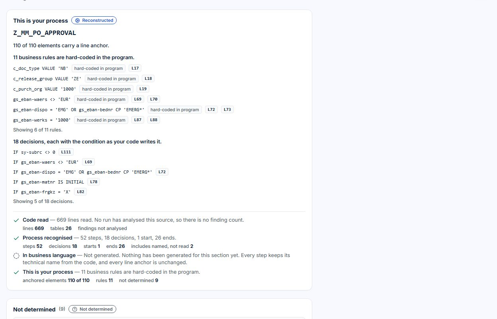

# Clean-Core.io

Clean-Core.io is a free community web app that reads custom SAP ABAP and takes it from
"not understood" to an evidence-backed decision, aligned with SAP's Clean Core
extensibility model. It is complementary to SAP's own tooling (ABAP Test Cockpit, ABAP
Development Tools, SAP Cloud ALM), not a replacement, and it is not affiliated with or
endorsed by SAP SE.

[clean-core.io](https://clean-core.io) · source: [github.com/sonnyfrenzel-rgb/clean-core.io](https://github.com/sonnyfrenzel-rgb/clean-core.io) ·
Apache License 2.0 · release notes: [`CHANGELOG.md`](CHANGELOG.md)



*The Business view of the demo project `Z_MM_PO_APPROVAL`, captured from the workspace by
`tests/capture-screens.spec.ts` (`CAPTURE_LANDING=1`). No mockup images.*

---

## What it does

You bring one piece of custom ABAP. A deterministic engine reads it first; a language
model only proposes names and wording afterwards, and every proposal is marked as a
Model proposal.

- **The process, read from the code.** The engine reconstructs the business process the
  program implements and draws it as BPMN. Every element carries the line it came from
  (`L243`), including the business rules that are hard-coded in the program. What the
  engine could not determine is listed as *not determined*, with the reason.
- **One workspace, three views.** Each project opens in a workspace with three views of
  the same content. The Business view asks *"Do I still need this, and what changes for
  me?"*, the IT view *"What exactly, where to, and is it right?"*, the Management view
  *"What do I risk, what do I decide?"*. A view orders and explains; it never changes the
  result and is never stored with it.
- **Six layers.** Within a view the page is organised in layers: Need & process ·
  Standard fit · Costs & assumptions · Architecture & dependencies · Evidence & controls ·
  Changes & commitments.
- **The seven stages as tools.** Analyze · Design · Transformation · Documentation ·
  Testing · Economics · Delivery stay available as tools from the workspace toolbar.
- **Clean Core Level A–D.** Every SAP object the code uses is graded Level A–D from SAP's
  published Cloudification Repository and object classification, with the rule version
  that produced it. The level is an orientation, not an ATC result, and is not part of
  the signed audit pack.
- **Where each statement comes from.** Every statement carries one of nine provenance
  values: Proven · Confirmed · Reconstructed · Imported · Model proposal · Simulation ·
  Demonstrated · mock · Stale · Not determined. *Confirmed* means the signed-in account
  confirmed it: a self-declaration, not a mandate.
- **Signed runs.** Every completed analysis is stored as an immutable run, signed with
  HMAC and Ed25519, and a signed export can be verified against it.
- **BPMN 2.0 XML export.** The process model leaves as a BPMN 2.0 XML file. There is no
  connection to a Signavio workspace or the Signavio API; the file is yours to take along.
- **Read access by invitation.** A project is shared with one confirmed e-mail address,
  including its source code, with expiry and revocation.
- **Costs only as simulation.** Economics calculates on your own assumptions; any amount
  shown elsewhere carries the *Simulation* label and the assumption revision.
- **A demo project for every account.** The fully worked demo `Z_MM_PO_APPROVAL`, with a
  guided tour; nothing done there is saved or counted.
- **The SAP object catalog.** A free viewer of SAP's Cloudification Repository and object
  classification at [clean-core.io/catalog](https://clean-core.io/catalog), no account
  needed.

## What it deliberately does not do

Deliberately not built: tenants and organisation accounts, single sign-on, guest access,
role mandates, a self-hosted edition, ALM adapters, portfolio or wave planning, and any
write access through an API. Accountability stays with the signed-in account. The
reasons are in [`docs/ROADMAP.md`](docs/ROADMAP.md) §8.

## Cost

Free. There is no paid tier and no payment is accepted. An account has five analysis
runs, and each starter example is free the first time it runs; after that you continue
with your own Gemini API key, which Google bills under your own agreement with Google.

## Local development

Requirements: Node.js 22.8 or later.

```bash
git clone https://github.com/sonnyfrenzel-rgb/clean-core.io.git
cd clean-core.io
npm ci
cp .env.example .env.local   # Firebase keys, GEMINI_API_KEY, AUDIT_SIGNING_KEY, RESEND_API_KEY
npm run dev                  # http://localhost:3000
```

Tests run against the Firebase emulators:

```bash
firebase emulators:start --only auth,firestore --project=cleancore-491216
npx playwright test
```

Architecture and runbook: [`docs/ARCHITECTURE.md`](docs/ARCHITECTURE.md) · design rules:
[`DESIGN.md`](DESIGN.md) · working in this repository: [`CLAUDE.md`](CLAUDE.md).

## Security and data

Model keys never reach the browser; every mutating route verifies a Firebase ID token;
S/4HANA credentials are encrypted with AES-256-GCM in a collection no client can read.
Generated tests run against mocks in an isolated test runner, a service of its own.
Running generated tests against a connected tenant is locked until the isolated live
runner has passed its external review. Account deletion follows GDPR Art. 17; encrypted
backups age out within 30 days.

Details: [`SECURITY.md`](SECURITY.md) · retention and backups:
[`docs/DATA-RETENTION.md`](docs/DATA-RETENTION.md) · operations:
[`docs/OPERATIONS.md`](docs/OPERATIONS.md).

## Licence

Apache License 2.0 — see [`LICENSE`](LICENSE) and [`NOTICE`](NOTICE). You may run, fork
and build on the code under that licence; you own the output you generate. The object
catalog is derived from SAP's Apache-2.0-licensed
[Cloudification Repository](https://github.com/SAP/abap-atc-cr-cv-s4hc); those files keep
their own copyright ([`THIRD-PARTY-NOTICES.md`](THIRD-PARTY-NOTICES.md)). SAP product names
are used nominatively.
