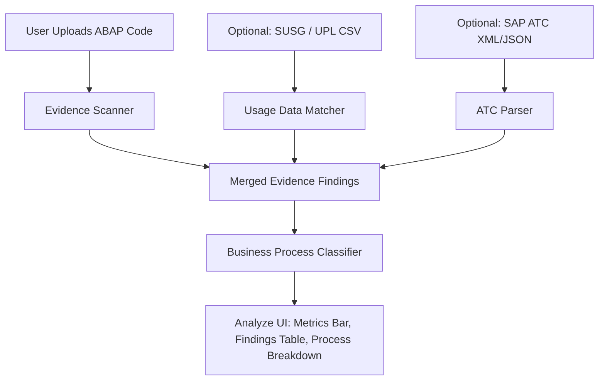

# Concept: Lightweight Clean-Core.io Enrichments

This document outlines how to integrate the three key learnings from AWS KIRO Agents (**SUSG Usage Ingestion, Business Process Mapping, and ATC Parsing**) into clean-core.io with **minimal UX impact**. 

Rather than changing the app's structure, we build these features directly into our existing **Project Upload** and **Analyze** views.

---

## 🗺️ Architectural Overview



---

## 1. SUSG / UPL Usage Data Ingestion

**Objective**: Flag unused custom code so architects can retire it immediately, rather than refactoring dead logic.

### UX Integration (Minimalist)
On the project file dropzone, we add a secondary, optional upload input:
```
┌────────────────────────────────────────────────────────┐
│  📁 Drag & Drop ABAP Source Code File here             │
└────────────────────────────────────────────────────────┘
  [+] Add Optional SAP Usage Log (SUSG / UPL CSV Export)
```

### Technical implementation
1. **CSV Schema**: The parser expects two columns: `OBJECT_NAME` and `EXECUTION_COUNT`.
2. **Merging Logic**:
   * During analysis, the scanner checks the code name or detected database tables against the usage map.
   * If a custom object has an execution count of `0` in the CSV, the system automatically sets:
     * `recommendedRoute` = `'Retire'`
     * `confidenceScore` = `100%` (Usage-verified retirement)
     * An additional finding is injected: **"Unused Code Candidate: 0 executions logged in the last 12 months."**

---

## 2. Business Process Mapping (Categorization)

**Objective**: Show clean core metrics grouped by actual business domains (e.g., Order-to-Cash) rather than technical classes.

### Technical Implementation
We extend our new `sap-api-catalog.ts` by adding a `process` tag to each entry:
```typescript
export interface SapApiEntry {
  view: string;
  type: SapApiObjectType;
  process: 'Order-to-Cash' | 'Procure-to-Pay' | 'Record-to-Report' | 'Plan-to-Produce' | 'Hire-to-Retire' | 'Cross-Module';
}
```

### UX Integration (Minimalist)
In the existing **Evidence Findings** header, we add a toggle selector to group findings by:
```
Group by: [ Severity ] | [ Business Process ]
```

When grouped by **Business Process**, the table organizes findings under collapsible process headers:
*   📦 **Order-to-Cash** (e.g. `VBAK`, `VBAP` accesses)
*   💳 **Record-to-Report** (e.g. `BKPF`, `BSEG` accesses)

---

## 3. Asynchronous ATC Report Ingestion

**Objective**: Merge official SAP ABAP Test Cockpit results directly into the clean-core.io findings checklist without requiring real-time connections.

### UX Integration (Minimalist)
Another optional drop area on the upload page:
```
  [+] Add Optional SAP ATC Check Results (XML / JSON Export)
```

### Technical Implementation
1. **Parser**: A lightweight parser processes the uploaded XML/JSON (using SAP's standard ATC export schema).
2. **Unified Data Model**:
   Each ATC warning is converted into our `EvidenceFinding` structure:
   ```typescript
   {
     id: `ATC-${atcId}`,
     kind: 'unreleased-api',
     title: atcFinding.title,
     severity: atcFinding.priority === 1 ? 'Critical' : 'Medium',
     source: 'static-parser', // Fits perfectly with our new Source column
     lineStart: atcFinding.line,
     snippet: atcFinding.codeSnippet,
     technicalDetail: atcFinding.description,
     recommendation: 'Replace with released API as indicated by SAP ATC.'
   }
   ```
3. **Display**: The findings appear directly in the **Evidence Findings** table labeled with the source **`⚙ Parser (ATC)`** or **`📋 Catalog`**, giving a unified view.

---

## 📋 Action Plan & Code Stubs

### State updates in `analyze/page.tsx`
We only need to add three state hooks:
```typescript
const [usageData, setUsageData] = useState<Record<string, number> | null>(null);
const [atcFindings, setAtcFindings] = useState<EvidenceFinding[]>([]);
const [groupByProcess, setGroupByProcess] = useState(false);
```

### CSV Parser Helper (`lib/abap/usage-parser.ts`)
```typescript
export function parseUsageCsv(csvText: string): Record<string, number> {
  const usageMap: Record<string, number> = {};
  const lines = csvText.split('\n');
  for (const line of lines) {
    const [objName, count] = line.split(',');
    if (objName && count !== undefined) {
      usageMap[objName.trim().toUpperCase()] = parseInt(count.trim(), 10) || 0;
    }
  }
  return usageMap;
}
```
