# Clean-Core.io — Referenzkorpus v2.1

**Stand:** 17.09.2026 · **Status:** candidate / not independently signed — Gegenreview REVIEW-2.0.1 eingearbeitet · **Ersetzt:** Referenzkorpus v2 (16.09.2026, SHA-256 `aa36119e45caf3104631d948de3490f2b956cc0374128a9ffe14407f338ad8a9`), v1 (25 Fälle) und die Härtungsstudie 1.0.1

**Was v2.1 gegenüber v2 ist:** derselbe Korpus nach einem strukturierten Gegenreview (§12). Sechs Regeln neu gefasst, dreizehn mit Bedingung, zehn Fälle inhaltlich korrigiert, acht Gegenbeispiele als Fälle CC-061 bis CC-068 aufgenommen, sechzehn Befunde je mit Entscheidung. Nichts davon ist eine Freigabe: das Gegenreview hat die Sollantworten vor der Prüfung gesehen und sagt das selbst. Es ist der zweite Autor, der sorgfältig widerspricht — und v2.1 hält fest, wo er recht hatte und wo nicht.

---

## 0. Was dieser Korpus ist — und was er nicht ist

Dieser Korpus ist die Sammlung von ABAP-Fällen, zu denen die richtige Antwort *vorher* feststeht, damit die deterministische Engine von Clean-Core.io widerlegt werden kann: Befunde je Zeile, SAP-Nachfolger, Clean-Core-Level A–D, Prozessskelett.

Er ist **nicht unabhängig freigegeben** und wird es in dieser Fassung nicht. Die Entscheidung vom 16.09.2026 lautet: Ein externer SAP-Architekt kann diesen Umfang nicht in vertretbarer Zeit gegenzeichnen, und ein Review, der es könnte, wäre unverhältnismäßig teuer. Der Korpus lebt deshalb mit dieser Einschränkung und kommt ihr so nah, wie es ohne den Architekten geht. Jeder Fall trägt, welche der verfügbaren Prüfungen ihn getroffen haben — und dass die eine, die zählen würde, fehlt.

Das ist kein Etikett, das man am Ende anklebt. Es ist der Grund, warum jeder Fall so geschnitten ist, wie er geschnitten ist: **eng genug, dass eine Abweichung einer überprüfbaren Ursache zugeordnet werden kann**, und mit einer Sollantwort, die sagt, worauf sie beruht.

### 0.1 Was v1 fehlte — in einem Satz je Review

Vier Modelle haben v1 am 16.09.2026 mit identischer Ausgangslage angegriffen (Grok 4.6: 130 Fälle; GLM 5.3: 105; Claude Fable 5.1: 122; DeepSeek v4 Pro: 103). Alle vier: **nicht freigeben.** Ihre Begründungen überschneiden sich in der Sache und unterscheiden sich im Schwerpunkt:

| Review | Schwerster Einzelmangel | Was nur dieses Review sah |
|---|---|---|
| Grok 4.6 | Klassifikation ohne interprozeduralen Wirkungskontext — eine Fassade ändert das Level nicht | RAP/EML (27 Fälle), `CLIENT SPECIFIED`, die Kritik an der Härtungsstudie: TRY/CATCH/CHECK sind Parserlücken, entscheidungsrelevant sind LUW, transitives D, dynamisches SQL, Exits, RAP-Flags, Mandant/Authority |
| GLM 5.3 | Kein Fallpaar, in dem derselbe Code in zwei Zielkontexten zwei richtige Antworten hat — **das ist mit mehr Fällen nicht zu heilen, nur mit einem anderen Schlüssel** | Asynchronität als Klasse; datenabhängiger Kontrollfluss (`AT NEW`, `ON CHANGE OF`); Ereignisreihenfolge klassischer Reports |
| Claude Fable 5.1 | R13 („Literale sind keine Statements") ist einseitig verankert und CC-016 trainiert das aktiv: **eine Engine, die v1 besteht, lässt ein KNA1-Update per ADBC mit null Befunden und Level B durch** | Vier innere Widersprüche des Korpus (drei Ankerkonventionen; CC-008 F04 falsch formuliert; ALPHA in CC-002/CC-023 unbelegt; `cloud_view` irreführend); Berechtigung als fehlende Aussageklasse; `release_contract` für kundeneigene Objekte |
| DeepSeek v4 Pro | Keine klassischen Langläufer-Konstrukte: Listverarbeitung, BDC, Sperren, Verbuchung | ENQUEUE/DEQUEUE (14 Fälle gegen 1 und 2 bei den anderen); ALV/Smartforms/SAPscript; `BYPASSING BUFFER`, `FOR UPDATE` |

Konvergenz über die vier Reviews, gezählt an ihren Fällen: dynamische Konstrukte (23/20/14/—), Verbuchung (7/10/12/9), Makros (14/10/7/2), COMMIT/LUW (22/10/12/4), SUBMIT/CALL TRANSACTION (3/4/9/8). Was drei von vier unabhängig treffen, ist in v2 eine Konstruktklasse mit eigenen Fällen. Was eines allein trifft, ist aufgenommen, wenn es kritisch ist, und steht dann mit dieser Kennzeichnung.

### 0.2 Was v2 gegenüber v1 ändert — die Kurzfassung

1. **Der Schlüssel.** v1 bildete *Code → Antwort* ab. v2 bildet *(Code, Zielprofil) → Antwort* ab. Ein Zielprofil ist Edition, ABAP-Sprachversion, Release, Katalogrevision, Regelrevision. Vier Fallpaare (CC-057 bis CC-060) haben **identische Quelle und zwei Profile mit zwei verschiedenen richtigen Antworten**. Eine Engine, die das Profil nicht im Schlüssel hat, besteht v2 nicht — das ist die Absicht.
2. **Der Anker.** v1 hatte drei Ankerkonventionen (FROM-Zeile, Bereich, Programmzeile). v2 hat eine: Statementbeginn plus Tokenoffset. Literalzeile und Bereich sind Sekundäranker. CC-007 und CC-013 sind korrigiert.
3. **R13 ist zweigeteilt.** R13a: ein Literal ohne Konsument ist kein Statement (CC-016 bleibt). R13b: ein Literal mit Konsument — ADBC, `EXEC SQL`, `GENERATE`, `ASSIGN (…)`, RTTI-Name, `CALL TRANSACTION USING`, Callback-FORM — *ist* Abhängigkeit oder Code. Je Konsumentenklasse ein Positivfall.
4. **Acht neue Konstruktklassen** (K12–K19) mit 35 neuen Fällen (CC-026 bis CC-060, darunter vier Fallpaare mit je zwei Zielprofilen) und zehn neuen Regeln (R25–R34). Die Klassen sind die Konvergenz aus 0.1. Fünf Autoren haben sie nach einem identischen Briefing aus den ~460 Modellfällen destilliert; ihre Berichte — was sie **nicht** aufgenommen haben und warum — stehen in §10.
5. **Eine neue Aussageklasse** `security_and_authorization`, weil das A–D-Level „unsicher" nicht sagen kann und v1 es hineinmogeln musste.
6. **Beleggrad an jedem Fall**, mit der Bedeutung, die Fable präzisiert hat: `verifiziert` heißt, die genannten SAP-Objekte, Syntaxelemente und das dokumentierte Verhalten existieren sicher — nie, dass eine Codestelle irgendwo steht. `konstruiert` ist der Normalfall und ehrlich.
7. **Unabhängigkeitsstufen an jedem Fall** — siehe §2. Das ist der Ersatz für die fehlende Freigabe: nicht eine Unterschrift, sondern eine Liste dessen, was den Fall geprüft hat.
8. **Eine Negativliste** (§3), die sagt, worüber der Korpus schweigt. Sie ist Teil jedes Exports.
9. **v2.1: das Gegenreview** (§12). Ein nicht blindes KI-Gegenreview (REVIEW-2.0.1, 16.09.2026) hat alle 35 Regeln und zehn Fälle inhaltlich beurteilt, alle 60 Fälle mechanisch geprüft (61 Quellenhashes bestätigt), sechzehn Befunde und acht Gegenbeispiele geliefert. v2.1 arbeitet es ein — jede Aussage mit einer von drei Entscheidungen: übernommen, übernommen mit Änderung, widersprochen. Eine neue Unabhängigkeitsstufe `gegenreview` sagt je Fall, ob er dabei war. `architekt` bleibt 0.

---

## 1. Der Schlüssel: Quelle und Zielprofil

Ein Urteil im Korpus ist eine Funktion von zwei Dingen, und v1 hat das zweite stillschweigend konstant gehalten.

```
Zielprofil := {
  edition:               onpremise-s4 | private-cloud | btp-abap-environment | ecc-6
  abap_language_version: standard | abap-for-cloud
  release:               z. B. "S/4HANA 2023", "ECC 6.0 EHP8"
  catalog_revision:      z. B. "PCE2022-objectReleaseInfo" | n/a
  rule_revision:         z. B. "rules-v2.0"
  runtime_context:       report | dialog | batch | rfc | update-task     (nur wo ein Fall es braucht)
}
```

`runtime_context` ist neu und Fable geschuldet (L5): `MESSAGE E…` bedeutet in einer Liste, im Dialog, im Batch und im RFC vier verschiedene Dinge. Ein Fall, der eine Aussage über Abbruch oder Rollback macht, muss sagen, in welchem Kontext.

Was der Schlüssel **nicht** ist: eine Erlaubnis, für jedes Profil eine bequeme Antwort zu wählen. Wo ein Fall nur ein Profil nennt, gilt seine Antwort nur dort, und die Zeile `Zweites Profil:` sagt, ob sie woanders anders wäre. Wo sie es wäre und das entscheidungsrelevant ist, ist es ein Fallpaar.

---

## 2. Unabhängigkeitsstufen — was die fehlende Freigabe ersetzt, und was nicht

Ein Korpus ist so viel wert, wie seine Sollantworten *unabhängig* vom Autor der Engine sind. Der Autor der Fälle und der Autor der Werkzeugtests sind hier dieselbe Person, und vier Modelle sind dieselbe Gattung Autor. Das ist die Einschränkung, mit der v2 lebt. Sie wird nicht versteckt, sondern **je Fall gemessen**:

| Stufe | Was sie prüft | Was sie nicht prüft | Wer sie ausgeführt hat |
|---|---|---|---|
| `modellreview` | Vier Modelle mit identischer Ausgangslage haben diesen Fall oder seine Klasse unabhängig als Lücke genannt (Konvergenz-Zeile am Fall) | Ob die *Sollantwort* richtig ist — die Modelle führen nichts aus und haben keinen Netzzugang; sie liefern eine Angriffsflächenkarte, keinen Beleg | 16.09.2026, OpenRouter, vier Berichte archiviert |
| `abaplint` | Ein fremder ABAP-Parser liest die Quelle des Falls; Statementgrenzen, Verzweigungen, FORMs und PERFORMs stimmen zwischen beiden Lesarten überein, oder die Abweichung ist mit Urteil im Register (`tests/helpers/abaplint-baseline.json`) | Ob die Klassifikation stimmt — abaplint kennt kein Clean-Core-Level | Seit 16.09.2026 als Ratsche im Test; jeder neue Fall wird gegen beide Parser gestellt |
| `metamorph` | Fünf Eigenschaften der Engine, die für jede Eingabe gelten müssen, ohne dass jemand die Sollantwort kennt (`tests/abap-metamorphic.spec.ts`, 98 Tests): **P1** Umbenennen lokaler Namen ist unsichtbar; **P2** Formatieren (Einrücken, Umbrechen, Ketten auflösen) verschiebt Anker exakt und sonst nichts; **P3** ein Kommentar ändert nichts; **P4** Aneinanderhängen zweier Programme ist die Vereinigung ihrer Antworten (64 geordnete Paare); **P5** jeder Anker zeigt auf sein Konstrukt, und jeder Block-Abschluss in der Quelle schließt genau einen gemeldeten Block. Jede Eigenschaft hat einen Rot-Beweis: Engine gezielt gebrochen → nur diese Eigenschaft fällt | Ob die Antwort richtig ist — nur, ob sie *stabil* und *in sich konsistent* ist | Seit 16.09.2026 |
| `sap-doku` | Die Sollantwort beruht auf einer benannten SAP-Quelle: ABAP-Schlüsselwortdokumentation, `objectReleaseInfo`, Cloudification-Repository, SAP-Learning-Level-Definition (Quellenregister §17 von v1, fortgeführt) | Ob die Quelle auf das konkrete Zielprofil zutrifft — Kataloge sind versioniert, und v1 §4 gilt weiter: `upstream_commit` ist für die großen SAP-Dateien nicht archiviert | Je Fall im Quellenverweis |
| `gegenreview` | Ein strukturiertes, **nicht blindes** KI-Gegenreview (REVIEW-2.0.1, 16.09.2026; Reviewer hat v1 mitverfasst und die v2-Sollantworten vor der Prüfung gesehen) hat den Fall inhaltlich beurteilt — Fallbogen mit Zustimmung/Widerspruch je Aussage — oder eine seiner Regeln mit einem der drei Urteile versehen (dann `(regel-ebene)`). Alle 60 Fälle wurden mechanisch geprüft: Quellenhashes, nummerierte Abdrucke, Extraktion | Unabhängigkeit vom Autor — es ist dieselbe Gattung Autor; und die Richtigkeit der Sollantwort, wo Review und Korpus sich einig sind, bleibt ungeprüft von jemandem, der ABAP in Produktion verantwortet hat | Zehn Fälle inhaltlich (CC-023, 026, 027, 034, 035, 038, 053, 057, 058, 060), sechs weitere gelesen (CC-028, 030, 033, 037, 056, 059), acht Gegenbeispiele (CC-061–068); 35 Regeln |
| `architekt` | Ein SAP-Architekt hat die Sollantwort **blind** — nur mit der Quelle, ohne unsere Antwort — aufgeschrieben, und beide stimmen überein | — | **Für keinen Fall.** Das ist die Einschränkung. Das Gegenreview sagt dazu (REV2-15) zu Recht: auch ein bestandener Kontrollfall bewiese Blindheit nicht; der Auftrag an den externen Prüfer ist darum entsprechend umformuliert (§12.4). |

Jeder Fall trägt die Zeile `**Unabhängigkeit:**` mit den Stufen, die ihn getroffen haben. `keine` ist eine erlaubte Antwort und kommt vor. Die Verteilung über alle Fälle steht in §5.

**Was das bedeutet:** Ein Fall mit `modellreview · abaplint · metamorph · sap-doku` hat vier Prüfungen bestanden, die unterschiedliche Fehlerklassen fangen. Er ist immer noch ein Kandidat, weil keine der vier die Frage „ist diese Sollantwort die richtige Entscheidung für einen Kunden?" beantwortet. Aber er ist ein Kandidat, dessen Parsing ein zweiter Parser bestätigt, dessen Stabilität bewiesen ist, dessen Lücke vier Reviews unabhängig gesehen haben und dessen Regel eine SAP-Quelle trägt. Das ist so nah, wie es ohne den Architekten geht.

---

## 3. Negativliste — worüber dieser Korpus schweigt

Diese Liste ist Teil jedes Exports, der auf den Korpus verweist. Ein Werkzeug, das v2 vollständig besteht, hat **keine** Aussage bewiesen über:

- **Laufzeitverhalten.** Nichts hier wurde ausgeführt. Kein ATC-Lauf, keine Syntaxprüfung im System, kein ABAP Unit. Ein Fall, der sagt „Laufzeitfehler", sagt, was die Dokumentation sagt.
- **Vollständigkeit der Sprache.** Kein Parser, keine Grammatik. Die Konstruktklassen K01–K19 sind die, die vier Reviews und eine Realcode-Studie genannt haben, nicht die, die es gibt.
- **Performance.** Kein Fall macht eine Aussage über Laufzeit, Puffer, Indexnutzung — auch wo DeepSeek `BYPASSING BUFFER` nennt, ist es als Abhängigkeit erfasst, nicht als Performanceurteil.
- **Vollständige Sicherheitsbewertung.** `security_and_authorization` ist eine Aussageklasse mit Fällen für die häufigsten Muster. Sie ist keine Sicherheitstestsuite, kein Ersatz für eine Code-Vulnerability-Analyse.
- **Aufwand und Kosten.** Alle Stunden sind unkalibrierte Autorenannahmen, `actual_hours = null` in jedem Fall. Kein ROI, kein TCO-Beleg.
- **Fachliche Notwendigkeit.** Ein Fachsatz sagt, was der Code tut, nicht, ob er es tun sollte. Kein Fall kennt die Unternehmenspolicy.
- **Kundencode.** Kein Fall **stammt** aus einem Kundensystem: alle Quelltexte sind konstruiert. v2 behauptete an dieser Stelle, produktiver Fachcode sei nicht öffentlich — **das war falsch** (§9, Fundstellen vom 17.09.2026): über Fachanwendungs-Marker finden sich auf GitHub komplette Kundenpakete, und für elf Fälle existiert eine Fundstelle an einem festgenagelten Commit. Was bleibt: die Fundstellen sind Belege, keine Fallquellen — elf von zwölf Repositories tragen keine Lizenz, ihr Code wird zitiert, nicht übernommen; und zwei Muster, die der Korpus als typisch führt (`GENERATE SUBROUTINE POOL` in Fachanwendung, `AUTHORITY-CHECK` ohne Auswertung), sind in rund 8.400 Dateien Kundencode **nicht** auffindbar — belegte Fehlanzeigen, die an CC-039 und CC-049 stehen.
- **Vollständige SAP-Kataloge.** v1 §4 gilt weiter: Die C-Einstufungen für KNA1/KNB1/KNVV sind unter einem stipulierten Profil bedingt, `upstream_commit` ist für die großen SAP-Dateien nicht archiviert.
- **Prozess-Ground-Truth.** Die Skelette sind As-is-Kontrollfluss aus dem Quelltext, keine beobachteten Abläufe, kein importgeprüftes BPMN 2.0.
- **Marktvergleich.** Nichts hier belegt Überlegenheit gegenüber irgendeinem anderen Werkzeug.

Und, ausdrücklich: **kein Fall ist von einem SAP-Architekten gegengezeichnet.**

---

## 4. Konstruktklassen v2

| Klasse | Bezeichnung | Fälle | Herkunft |
|---|---|---|---|
| K01 | Direct SELECT on standard tables | CC-001, CC-002, CC-007, CC-008, CC-023 | v1 |
| K02 | Simple wrapper classes / reports | CC-003, CC-004, CC-016, CC-024, CC-025 | v1 |
| K03 | Static CALL FUNCTION | CC-005, CC-006 | v1 |
| K04 | Complex SQL Joins (3+ tables) | CC-007, CC-008 | v1 |
| K05 | BAdI / Enhancement Implementations | CC-009, CC-010 | v1 |
| K06 | Dynamic CALL FUNCTION / PERFORM | CC-006, CC-011, CC-012 | v1 |
| K07 | SAP GUI Dynpro screens (MODULE POOL) | CC-013, CC-014 | v1 |
| K08 | Kernel calls (ABAP system internals) | CC-015, CC-016 | v1 |
| K09 | ABAP OO with inheritance chains | CC-017, CC-018 | v1 |
| K10 | RTTI / dynamic type resolution | CC-019, CC-020 | v1 |
| K11 | Missing source dependency | CC-012, CC-014, CC-018, CC-020, CC-021, CC-022 | v1 |
| **K12** | **LUW, Verbuchung, RFC, Sperren** | CC-026 bis CC-033 | Konvergenz 4/4 |
| **K13** | **Dynamischer und nativer Code; R13b** | CC-034 bis CC-041 | Konvergenz 4/4 |
| **K14** | **Makros, Kettensätze, Ankeridentität** | CC-042 bis CC-044 | Konvergenz 4/4 |
| **K15** | **Berechtigung und Sicherheit** | CC-049 bis CC-052 | Grok, Fable, DeepSeek |
| **K16** | **Hostkontext und SAP-Exits** | CC-053, CC-054 | Grok, Fable |
| **K17** | **UI-Automatisierung, programmübergreifend** | CC-055, CC-056 | Grok, Fable, DeepSeek |
| **K18** | **Ereignisblöcke, LDB, Typabhängigkeit** | CC-045 bis CC-048 | GLM, Fable, DeepSeek |
| **K19** | **Fallpaare: eine Quelle, zwei Zielprofile** | CC-057 bis CC-060 | GLM (strukturell), Grok |

Die genauen Fallnummern je Klasse stehen in der Fallmatrix §6, sobald die Fälle zusammengeführt sind; die Bereiche oben sind die Zuteilung.

---

## 5. Unabhängigkeitsverteilung

Über die 43 neuen und geänderten Fälle (CC-026 bis CC-068; v1-Fälle CC-001 bis CC-022, CC-024, CC-025 siehe §6.1):

| Stufe | Fälle | Anteil |
|---|---:|---:|
| `modellreview` | 35 | 81 % |
| `abaplint` | 0 | 0 % |
| `metamorph` | 0 | 0 % |
| `sap-doku` | 24 | 56 % |
| `gegenreview` | 29 | 67 % |
| `architekt` | 0 | 0 % |
| keine | 1 | 2 % |

Beleggrad: 10 × `konstruiert` · 30 × `verifiziert` · 3 × `erinnert`.

**`verifiziert` heißt in v2.1 ausschließlich:** die genannten SAP-Objekte, Syntaxelemente und das dokumentierte Verhalten existieren sicher. Es heißt **nie**, dass die Codestelle irgendwo gefunden wurde. **Kein Fall dieses Korpus hat eine Fundstelle** (Stand des gezielten Durchgangs durch öffentliche Repositories: §9).

`architekt` ist 0. `gegenreview` ist die Stufe des nicht blinden KI-Gegenreviews REVIEW-2.0.1 (§2, §12) — sie ersetzt keinen Menschen und sagt das an jedem Fall, der sie trägt.

---

## 6. Fallmatrix v2.1

### 6.1 v1-Fälle (CC-001 bis CC-025), mit Korrekturen aus §11 und — für CC-023 — der v2.1-Fassung

| Fall | Konstruktklassen | Klassisch* | Cloud-API-Oberfläche | Thema |
|---|---|---|---|---|
| CC-001 | K01 | C | not_usable | Kundenliste: SAP-Tabelle lesen, keine Schreibmigration |
| CC-002 | K01 | C | not_usable | FAE: expliziter Leermengenschutz und Company-Daten |
| CC-003 | K02 | B | not_applicable | Lokaler Regel-Wrapper: Standard-ABAP B und keine echte Freigabe |
| CC-004 | K02 | B | not_usable | HTTP-Wrapper: Classic API plus notToBeReleased |
| CC-005 | K03 | B | not_usable | Statische Funktionsbausteine: ALPHA in beide Richtungen |
| CC-006 | K03, K06 | B | not_usable | Konstanter FM-Name ist statisch, kein dynamischer Blindflug |
| CC-007 | K04, K01 | C | not_usable | Drei Tabellen: Kunden, Company, Sales Area und Multiplizität |
| CC-008 | K04, K01 | C | not_usable | LEFT JOIN: WHERE-Filter entfernt Nulltreffer |
| CC-009 | K05 | B | unknown | Expliziter kundeneigener BAdI mit festgehaltener Aktivierung |
| CC-010 | K05 | D | not_usable | Implizites Enhancement: Kontext bestimmt D, nicht Z-Name |
| CC-011 | K06 | B | not_usable | Dynamischer FM: Syntax dynamisch, Datenfluss auflösbar |
| CC-012 | K06, K11 | Unknown | unknown | Externer dynamischer Aufruf und PERFORM: bewusst unaufgelöst |
| CC-013 | K07 | B | not_usable | Vollständiger Dynpro-Mikrofall: PBO, PAI und GUI-Status |
| CC-014 | K07, K11 | Unknown | not_usable | Dynpro-Aufruf ohne Screenexport |
| CC-015 | K08 | Unknown | unknown | Echter Kernelaufruf: Kenntnisgrenze sichtbar halten |
| CC-016 | K08, K02 | B | not_applicable | Lexikalische Falle: SQL und Kernel nur in Texten |
| CC-017 | K09 | B | not_applicable | OO: Redefinition und expliziter Super-Aufruf |
| CC-018 | K09, K11 | Unknown | unknown | OO: fehlende globale Basisklasse |
| CC-019 | K10 | B | usable | RTTI: bekannter lokaler Strukturtyp |
| CC-020 | K10, K11 | Unknown | unknown | Dynamischer Typ und Feldname aus Eingabe |
| CC-021 | K11 | Unknown | unknown | Fehlendes INCLUDE: keine erfundene Kreditregel |
| CC-022 | K11 | Unknown | unknown | Partner-Namespace: fehlende Quelle ist kein SAP-internes C |
| CC-023 | K01 | D | not_usable | Direktes SAP-UPDATE mit Testmodus: D trotz CDS-Nachfolger |
| CC-024 | K02 | B | unknown | Eigene Persistenz: keine automatische CAP-Pflicht |
| CC-025 | K02 | B | not_applicable | Business-Gegenprobe: Währung, Nachtregel, Grenzen und nur Routing |

\* Kandidatenurteile unter dem stipulierten v1-Profil. CC-023 steht in Teil B in seiner v2.1-Fassung (Stufe A des Gegenreviews).

### 6.2 Neue und geänderte Fälle (CC-026 bis CC-068)

| Fall | Klassen | Klassisch | Cloud-API | Beleggrad | Unabhängigkeit | Konvergenz | Thema |
|---|---|---|---|---|---|---|---|
| CC-026 | K12, K03, K11 | Unknown |  | konstruiert | modellreview · gegenreview · sap-doku (S05 LUW-Konzept, S09 COMMIT WORK/AND WAIT/sy-subrc; S32 nach Lesung des Regelautors) | Grok H-023 · GLM A-018 · Fable KA-042, KA-088 · DeepSeek CC-GAP-004, CC-GAP-005 (DeepSeek schreibt `IN BACKGROUND TASK`, meint aber laut Abschnitt 3 „Verbuchung | Verbuchung: registriert an der Aufrufstelle, ausgeführt beim COMMIT, verworfen beim ROLLBACK |
| CC-027 | K12, K03, K11 | Unknown |  | verifiziert | modellreview · gegenreview · sap-doku (S05, S07 SAP-LUW bei Programmaufrufen, S08 Datenbank-Commit, S09 COMMIT WORK; S30, S32 nach Lesung des Regelautors) | Grok H-023 („ohne COMMIT nie stattfindet") · GLM A-017 (dasselbe Muster für BAPIs), A-018 · Fable KA-042 · DeepSeek — keiner · Gegenreview REV2-11. Negativkontr | Verbuchung ohne COMMIT WORK: angekündigt, nicht persistiert (Negativkontrolle zu CC-026) |
| CC-028 | K12, K03 | B | not_usable | verifiziert | modellreview · gegenreview · sap-doku | Grok H-029, H-030 · GLM A-017 · Fable KA-041 · DeepSeek CC-GAP-048 (dort mit DESTINATION; hier bewusst lokal) | BAPI-Paar: Anlage nur mit BAPI_TRANSACTION_COMMIT; der Fehlerzweig committet nichts |
| CC-029 | K12, K03 | B | unknown | verifiziert | modellreview | DeepSeek CC-GAP-001, CC-GAP-002 · Fable KA-089 (nicht in der Auftragsliste, trifft exakt dieses Muster; der Autor führt es als Beleg auf) · Grok — keiner in der | Sperre als Transaktionsknoten: geschrieben wird nur mit gesetzter Sperre |
| CC-030 | K12, K02 | B (nicht die Prüfgröße dieses Falls) | unknown | erinnert | modellreview · gegenreview · sap-doku | Fable KA-023 (einziges Modell; kritisch, weil der Fehler erst mit Datenmenge auftritt und kein Level ihn anzeigt) · verwandt, nicht deckungsgleich: Fable KA-087 | COMMIT WORK in SELECT … ENDSELECT: der Befund ist ein Laufzeitfehler, kein Level |
| CC-031 | K12, K03, K11 | Unknown (`known_worst_level`: B) | unknown | konstruiert | modellreview | Grok H-089, H-090 · Fable KA-040, KA-045, KA-086 · DeepSeek CC-GAP-046 · GLM — keiner in der zugewiesenen Spanne | RFC mit dynamischer Destination: Systemgrenze, impliziter Commit, wirkungsloser Rollback |
| CC-032 | K12, K03, K11 | Unknown (`known_worst_level`: B) | unknown | erinnert | modellreview | Grok H-025 · GLM A-023, A-024 · Fable KA-043 · DeepSeek CC-GAP-047 | Asynchroner RFC: paralleler Zweig, Callback-Handler als Anker, Ergebnis ohne Konsument |
| CC-033 | K12, K02 | B (nicht die Prüfgröße dieses Falls) | unknown | erinnert | modellreview · gegenreview · sap-doku | Fable KA-031 · DeepSeek CC-GAP-004 (Abschnitt 3, Fall 10: `MESSAGE e…` im Rollback-Zweig) · GLM A-044 (Fachsatz „ändert" gilt nur im Commit-Fall) | MESSAGE Typ E als Abbruchpfad: die LUW-Wirkung hängt am Laufzeitkontext |
| CC-034 | K13, K02, K01 | D |  | verifiziert | modellreview · gegenreview · sap-doku (S01 Leveldefinition, S08 Datenbank-Commit, S10 ADBC, S11 Native SQL, S19 KNA1-Eintrag) | Fable KA-018 (ausgeschrieben §3.2) · Grok H-013 · GLM A-007 (Native-SQL-Klasse) · DeepSeek: keine · Gegenreview REV2-04 (Fachsatz), REV2-05 (Abgrenzung zu CE-01 | ADBC: das Stringtemplate wird als SQL ausgeführt (Gegenstück zu CC-016) |
| CC-035 | K13, K08, K01 | D |  | verifiziert | modellreview · gegenreview · sap-doku (S01, S11 EXEC SQL, S19) | Grok H-012 · GLM A-007 · Fable KA-017 · DeepSeek: keine · Gegenreview (Architekturreview §6, „Bound Values sind kein zweiter CC-034-Injektionsfall"; REV2-07) | EXEC SQL: Native SQL schreibt KNA1, kein Nachfolger, nicht in der Cloud |
| CC-036 | K13, K01, K06 | C | not_usable | verifiziert | keine (Kontrollfall) | Kontrollfall zum Partnerfall CC-037; abgeleitet aus GLM A-041 und Fable KA-019 (Herkunft der Variable als Kontextbeleg); v1-Analogie CC-006/CC-011 für `CALL FUN | Dynamisches FROM aus Konstante: Datenfluss vollständig, Ziel KNA1 (Fallpaar A) |
| CC-037 | K13, K01, K06, K11 | Unknown | unknown | verifiziert | modellreview · gegenreview | GLM A-041 (ausgeschrieben Fall 3) · Fable KA-016, KA-019 · Grok H-010 (WHERE-Variante) · DeepSeek: keine | Dynamisches FROM aus Eingabe: Zielmenge Unknown, schlimmster Fall D (Fallpaar B) |
| CC-038 | K13, K01, K06, K11 | Unknown |  | verifiziert | modellreview · gegenreview · sap-doku (S01 Leveldefinition, S02) | Fable KA-015 · GLM A-042 (DELETE-Variante) · Grok: keine in der zugewiesenen Liste · DeepSeek: keine · Gegenreview REV2-03 (R26), REV2-07 (R28), REV2-12 (Zweitp | Dynamisches Schreibziel: MODIFY (p_tab) — Unknown, schlimmster Fall D, plus Sicherheitsbefund |
| CC-039 | K13, K06, K08, K11 | Unknown | not_usable | verifiziert | modellreview | Grok H-036 (ausgeschrieben §3) · Fable KA-062 (ausgeschrieben §3.7) · GLM: keine · DeepSeek: keine | GENERATE SUBROUTINE POOL: Daten werden Code, jede statische Antwort ist Annahme |
| CC-040 | K13, K10, K11 | Unknown | not_usable | verifiziert | modellreview | Fable KA-096 (ausgeschrieben §3.1) · Grok H-041 (allgemeiner dynamischer ASSIGN) · GLM: keine · DeepSeek: keine | ASSIGN ('(SAPMV45A)VBAK-VBELN'): das Literal wird Abhängigkeit auf ein SAP-Programm |
| CC-041 | K13, K06, K09 | B | not_applicable | verifiziert | modellreview | Fable KA-038 (Zielmenge > 1) · GLM A-089, A-090 · Grok H-039 · DeepSeek CC-GAP-103 (die drei letzten als Unknown-Variante mit Eingabeherkunft; hier ist der Date | Dynamischer Methodenname mit Zielmenge zwei: die Liste ist die Antwort |
| CC-042 | K14, K01 | C | not_usable | verifiziert | modellreview · gegenreview (regel-ebene) | Grok H-006 · GLM A-035 · Fable KA-001 (L10) · DeepSeek — | Makro: zwei Lesebefunde an den Aufrufzeilen, keiner an der Definition |
| CC-043 | K14, K11 | Unknown | unknown | verifiziert | modellreview · gegenreview (regel-ebene) | Fable KA-002 (L10) · Prüfung F05 (Vergleicher, M15) · Grok — · GLM — · DeepSeek — . Einzelnennung; aufgenommen, weil der Fall die Statementidentität festlegt, o | Kettensatz: drei Aufrufe auf einer Zeile, drei Anker, drei Knoten |
| CC-044 | K14, K03 | B | not_usable | verifiziert | modellreview | Fable KA-003, KA-004 (L10) · Grok — · GLM — · DeepSeek — . Einzelnennung; aufgenommen, weil der Fall den Ankervertrag festlegt (Statementbeginn plus Tokenoffset | Literal auf der Folgezeile: Primäranker ist der Statementbeginn |
| CC-045 | K18, K01 | C | not_usable | verifiziert | modellreview | GLM A-072 · Fable KA-008, KA-009, KA-010, KA-011, KA-012 (L2) · Grok — · DeepSeek — | Typabhängigkeit ohne SQL: TABLES, SELECT-OPTIONS FOR, INCLUDE STRUCTURE, TYPE |
| CC-046 | K18, K02 | B | not_usable | verifiziert | modellreview | GLM A-075, A-077 · Fable KA-066, KA-068 (L5 b) · DeepSeek CC-GAP-081, CC-GAP-083 · Grok — | Klassischer Report ohne START-OF-SELECTION: vier Ereignisblöcke, kein leeres Skelett |
| CC-047 | K18, K01 | C | not_usable | verifiziert | modellreview | GLM A-069, A-070, A-071 (HR-Analogon PNPCE/INFOTYPES) · Fable KA-120, KA-083 (L2, L5 b) · Grok — · DeepSeek — | Logische Datenbank: KNA1 lesen ohne SELECT, Kontrollfluss von außen |
| CC-048 | K18 | B | not_applicable | verifiziert | modellreview | Grok H-103 · GLM A-036 und Abschnitt 4 Nr. 9 („dritter CHECK-Kontext“) · Fable KA-082, KA-083 (L5 c) · Realcode-Prüfung RV-027/RV-028 (§8.2) · DeepSeek — | CHECK in drei Kontexten: drei Bedingungen, drei verschiedene Ziele |
| CC-049 | K15, K01 | C | not_usable | verifiziert | modellreview · gegenreview (regel-ebene) · sap-doku | Grok H-068 · Fable KA-090, KA-091 · DeepSeek CC-GAP-071 (H-067 „Prüfung fehlt" bewusst nicht aufgenommen, siehe Autorenbericht) | AUTHORITY-CHECK: mit Auswertung ein Gateway, ohne Auswertung „geprüft ohne Wirkung" |
| CC-050 | K15 | B | usable | verifiziert | modellreview · gegenreview (regel-ebene) · sap-doku | Fable KA-021 · Grok H-071 (verwandt: Berechtigungsumgehung beim Lesen über eine View) · Grok-Lückenzeile „RAP/EML/DCL-Bypass: PRIVILEGED nie zu A". Nur ein Mode | WITH PRIVILEGED ACCESS: sieht clean aus, umgeht die Zugriffskontrolle |
| CC-051 | K15, K01 | C | not_usable | verifiziert | modellreview · gegenreview (regel-ebene) · sap-doku | Grok H-016 (nur der Leseteil; der INSERT-Teil ist ein eigener Fall und nicht gebaut) · Fable KA-022 | CLIENT SPECIFIED: R01-C plus Befund „mandantenübergreifend" |
| CC-052 | K15, K01 | C | not_usable | verifiziert | modellreview | Grok H-070 · Fable KA-033 · Grok-Lückenzeile „Security ≠ Levelbuchstabe: usr02 … nicht R01-C" | USR02 lesen: C plus Sicherheitsbefund; der Nachfolger ist ein Verbot |
| CC-053 | K16, K05 | Unknown |  | verifiziert | modellreview · gegenreview · sap-doku (S01 Leveldefinition | Grok H-058, H-063 („B oder D je Fixture") · Fable KA-052 (D „namentlich erkennbar ohne Metadaten" — die Lesart, die dieser Fall jetzt zurückweist), KA-053 · Fab | Userexit-FORM `userexit_save_document`: Marker im Code sind eine Hosthypothese, das Level braucht den Kontextbeleg |
| CC-054 | K17, K16, K07 | B | not_usable | verifiziert | modellreview | Fable KA-064, KA-106 · DeepSeek CC-GAP-091, CC-GAP-098, CC-GAP-090 · Gegenprobe: Fable KA-055 (Keyword-Überreaktion), GLM A-084 (verwandt), v1 CC-016 | Der Konsument entscheidet: ALV-Callback im Literal wirkt, ENHANCEMENT im Kommentar nicht |
| CC-055 | K17 | C | not_usable | verifiziert | modellreview · gegenreview (regel-ebene) · sap-doku | Fable KA-059 · DeepSeek CC-GAP-006 · Fable-Lücke L9 · Grok-Lückenzeile „Native/dynamischer Code: R13-Vorrang gegen Ausführung" (verwandt) | Batch-Input auf XD01: Literale werden Abhängigkeiten, das Schreiben geschieht im Aufruf |
| CC-056 | K17, K11 | Unknown | unknown | verifiziert | modellreview · gegenreview · sap-doku | Fable KA-058 · DeepSeek CC-GAP-007 · (LEAVE TO TRANSACTION: DeepSeek CC-GAP-008, Fable KA-060 — nicht gebaut, siehe Autorenbericht) | SUBMIT … AND RETURN: Systemgrenze, opak, ohne erfundene Kindlogik |
| CC-057 | K19, K01 | C | not_usable | verifiziert | modellreview · gegenreview · sap-doku (S01, S02 Sprachversion/Zulassung, S15 ALPHA, S19 KNA1-Eintrag und eigener I_CUSTOMER-Eintrag) | Grok H-115 · GLM A-004, A-005, A-092 (FM-Zwilling derselben Ursache) · Fable KA-103 · DeepSeek: keiner · Gegenreview REV2-12 (Source-/Targetprozess), REV2-10 (E | Profilpaar: SELECT FROM KNA1 in einer globalen Klasse — C mit Nachfolger oder nicht aktivierbar |
| CC-058 | K19, K01 | B | usable | verifiziert | modellreview · gegenreview · sap-doku (S01, S02, S19 eigener released-Eintrag, S21 Warnung vor releaseübergreifender Feldgleichheit) | Fable KA-020, Fable §5 („`cloud_view = not_applicable` ist irreführend") · GLM A-004 (freigegebenes Lesen on-premise) · Grok H-115 (Paaridee) · DeepSeek: keiner | Profilpaar: SELECT FROM I_CUSTOMER im klassischen REPORT — freigegebenes Lesen ist nicht C, der Report bleibt klassisch |
| CC-059 | K19 (RAP/EML hat keine v1-Klasse — Zusammenführer) | B | usable | verifiziert | modellreview · gegenreview · sap-doku | Grok H-045, H-046 · Fable KA-021 (PRIVILEGED-Variante auf CDS), KA-105 („modern ist kein Level") · GLM A-092 (Sprachversion entscheidet) · DeepSeek: keiner | Profilpaar: RAP/EML `MODIFY ENTITIES … IN LOCAL MODE` — sieht aus wie A, das Level hängt an der Sprachversion, der Sicherheitsbefund an keiner |
| CC-060 | K19, K02, K01 |  |  | verifiziert | modellreview · gegenreview · sap-doku (S01, S02 API-Freigabe = Zustand, Vertrag, Sichtbarkeit; S04 Wrapper mit C1; S19 KNA1) | Fable KA-103, KA-104, KA-105, Abschnitt 4 L7 · Grok H-001, H-005 (Z-API-Kette: oberste Klasse ist nicht das Urteil) · GLM: keiner · DeepSeek: keiner · Gegenrevi | Profilpaar mit `release_contract`: kundeneigener Wrapper mit C1-Freigabe liest KNA1 — das Level des Konsumenten stoppt am Vertrag, `known_worst` nicht |
| CC-061 | K13, K02 | B | not_applicable | konstruiert | gegenreview · sap-doku | Gegenreview CE-01 / REV2-05 (Regelurteil R13a „hält nicht") · Gegenfall zu CC-016 (Zeile 7) und zur R13a-Begründung in CC-034 · Modellreviews 16.09.: kein Model | Stringtemplate mit eingebettetem Methodenaufruf: der Seiteneffekt braucht keinen Konsumenten (Gegenfall zu CC-016) |
| CC-062 | K13, K01 | C | not_usable | konstruiert | gegenreview · sap-doku · modellreview | Gegenreview CE-02 / REV2-03 (Regelurteil R26 „hält nicht") · Gegenfall zu CC-037 und CC-038 (dort: Ziel aus Eingabe, Unknown + `known_worst_level` D) · Modellre | Bekanntes FROM trotz dynamischem WHERE: die Tabelle ist KNA1, das Prädikat ist Eingabe (Gegenfall zu CC-037/CC-038) |
| CC-063 | K15, K01 | C | not_usable | konstruiert | gegenreview · sap-doku | Gegenreview CE-03 / REV2-07 (Regelurteil R28 „hält nicht") · Gegenfall zu CC-051 (`CLIENT SPECIFIED` mit Mandant aus Eingabe) — das Manifest des Reviews nennt C | CLIENT SPECIFIED mit explizitem eigenem Mandanten: Mandantenautomatik aus, Ergebnismenge trotzdem der Anmeldemandant (Gegenfall zu CC-051) |
| CC-064 | K15, K02 | B | not_usable | konstruiert | gegenreview | Gegenreview CE-04 / REV2-07 (Regelurteil R28 „hält nicht": „gespeicherter sy-subrc kann später wirksam geprüft werden") · Gegenfall zu CC-049-F03 („geprüft ohne | Gesicherter Rückgabewert statt unmittelbarer sy-subrc-Prüfung: die Berechtigungsprüfung wirkt (Gegenfall zu CC-049-F03) |
| CC-065 | K17, K11 | Unknown | unknown | konstruiert | gegenreview · sap-doku | Gegenreview CE-05 / REV2-06 (Regelurteil R34 „hält nicht") und REV2-01/REV2-11 (R25: kein pauschaler impliziter Commit) · Gegenfall zum Regelwortlaut R34@2.0.0  | Opakes SUBMIT mit Fortsetzung des Aufrufers: die Grenze beendet die Kenntnis, nicht den Kontrollfluss (Gegenfall zur R34-Fassung, Partner von CC-056) |
| CC-066 | K14, K02 | B | not_applicable | konstruiert | gegenreview | Gegenreview CE-06 / REV2-13 (Regelurteil R27 „hält nur unter Bedingung": „eine Makroaufrufstelle kann mehrere Wirkungsstellen enthalten") · Gegenfall zum Wortla | Ein Makroaufruf, zwei Wirkungsstellen: die Aufrufstelle allein identifiziert die Wirkung nicht (Gegenfall zu R27, Partner von CC-042/CC-043) |
| CC-067 | K01, K02 | C | not_usable | konstruiert | gegenreview · sap-doku | Gegenreview CE-07 / Regelurteil R09 „hält nur unter Bedingung" („ASSERT ohne ID kann die Fortsetzung wirksam verhindern, aber durch Dump; die v2-Aussage, ASSERT | ASSERT ohne ID vor FAE: ein Fail-fast-Guard, kein sanfter Leerfall (Gegenfall zur R09-Präzisierung in v2 §7.1, Partner von CC-002) |
| CC-068 | K16, K02 | B | not_applicable | konstruiert | gegenreview · sap-doku | Gegenreview CE-08 / REV2-02 (Regelurteil R32 „hält nicht": „Namen und Marker liefern Hinweise, nicht das Level D") · Gegenfall zu CC-053 (dessen Prüferfrage 2 g | Gleicher Exittext im kundeneigenen Report: der FORM-Name ist eine Hypothese, kein Host und kein D (Gegenfall zu CC-053) |

---

## 7. Regelregister v2

*(v1 §18 mit R13 → R13a/R13b und den neuen R25–R34; Autorität je Regel: `sap_interpretation` | `sap_semantics` | `sap_metadata` | `corpus_policy`)*

---

## 8. Was die Engine heute schon nicht besteht

Der Korpus ist kein Papier. Am Tag seiner Erstellung hat er — über abaplint und die metamorphen Eigenschaften, also über zwei der Stufen aus §2 — Defekte in der Engine gefunden, die kein v1-Fall gesehen hätte:

| Konstrukt | Was die Engine las | Was richtig ist | Gefunden durch | Status |
|---|---|---|---|---|
| `IF lv = \|Status: ok\|.` | „verkettete Verzweigung", 0 Verzweigungen — **das Gateway verschwand aus dem Diagramm** | ein `If` | abaplint | behoben 16.09. |
| `lv = \|a: b, c\|.` | zwei Anweisungen, von denen keine in der Quelle steht | eine | abaplint | behoben 16.09. |
| `lv = \|say "hi" now\|.` | das `"` öffnete einen Kommentar und verschluckte die Anweisung darunter | zwei Anweisungen | abaplint | behoben 16.09. |
| `ENDIF. " done` | Schließer mit Inline-Kommentar zählte nicht — Verschachtelungstiefe 99 statt 3, Komplexität 10 statt 9: **ein Programm galt als komplexer, weil es kommentiert war** | Kommentar ändert nichts | metamorph | behoben 16.09. |
| `INSERT ztab FROM @VALUE #( … )` in `ZLEGACY_ORDER_FULFILLMENT_AUDIT_1000LOC.abap:500, :524` | die Engine ist nachsichtig und erfasst den Write | **kein gültiges ABAP** — eine Host-Expression heißt `@( … )`; das ausgelieferte Beispiel ist fehlerhaft | abaplint | offen — Entscheidung Sonny, vier Specs pinnen die Zahlen |
| `lv = 12.50.` (unquotierte Dezimalzahl) | eine Anweisung (Regel vom 16.09.) | abaplint: zwei — ABAP-Zahlliterale sind Ganzzahlen, `'12.50'` wäre richtig; unsere Regel liest Code, der nicht übersetzen würde | abaplint | offen — bewusst nicht geändert, Entscheidung Sonny |
| `WRITE: a, b, c.` — Kettensatz in der Coverage | „3 × classic list output" für `Z_MATERIAL_STOCK_CALC`, ausgeschrieben sind es **10**: die Engine hat zwei Anweisungsleser, `readStatements` expandiert Ketten, `tokenize` (der die Coverage speist) nicht | ein Befund je Kettenglied — genau der Ankervertrag von **CC-043** (R27) | metamorph (P2, Kettenauflösung) | offen — gemeldet, nicht behoben, weil `tokenize` auch den Klassenparser speist, der Ketten selbst zerlegt; Phase-2-Punkt |
| Kommentarzeile vor jeder Zeile | Komplexität `Z_MM_PO_APPROVAL` 8 → 9, `Z_SALES_ORDER_CREATOR` 2 → 3: `computeComplexityScore` zählt Kommentar- und Fortsetzungszeilen als LOC | Kommentar ändert nichts (P3) | metamorph (P3) | offen — was als Zeile zählt, ändert eine Zahl, die jeder signierte Run speichert; Entscheidung Sonny |
| `MODIFY gt_bp_data FROM gs_bp_data.` (lokale interne Tabelle) | Datenkopplung meldet `GT_BP_DATA · Write · Medium` als Datenbank-Abhängigkeit; die Evidenz-Engine unterdrückt denselben Namen als lokal deklariert | keine DB-Abhängigkeit — erfundene Abhängigkeit, die Klasse aus QA-Review 33471220d6e9 | metamorph (Beobachtung beim Bau von P1) | offen — `extractDataCoupling` fragt die deklarierten Namen nicht; die Über-Meldung ist dokumentiert gewollt, hier trifft sie aber eine Variable, keine Tabelle |

Diese Tabelle ist der Beleg dafür, dass die Stufen aus §2 keine Formalität sind: sieben Engine-Befunde an einem Tag, keiner davon durch einen v1-Fall auffindbar, zwei davon (Kettensatz, eingerückter Stern) durch v2-Fälle abgedeckt. Der eingerückte Stern, der ein `IF` verschluckte, wird von P5 **auf der ausgelieferten Quelle ohne jede Umschreibung** gefangen (`L415 ENDIF — no if block ends here`); der Dezimalpunkt dagegen von keiner Eigenschaft auf dem ausgelieferten Korpus — in 2277 Zeilen steht kein einziger Punkt zwischen zwei Ziffern außerhalb eines Literals. Er wird nur mit einer eigens erzeugten Eingabefamilie gefangen. Das ist die Lehre, die auch für v2 gilt: **eine Eigenschaft sagt nichts über ein Konstrukt, das der Korpus nie enthält.**

---

*Fallbuch v2 folgt: v1-Fälle mit Korrekturen, dann CC-026 bis CC-060.*


**Stand:** 17.09.2026 · **Autor:** Registerautor v2.1 (Claude-Agent, dieselbe Gattung wie Fallautoren und Gegenreview) · **Status:** candidate, nicht unabhängig freigegeben.
**Grundlage:** Regelregister v2 (`01-regeln-methode.md` §7), v1-Wortlaut R01–R24 (`inputs/v1-regelregister-auszug.md`, v1 §18), Gegenreview REVIEW-2.0.1-proposed (`architekturreview.md` §4, §9, §10; `decisions/rule-verdicts.json`; `decisions/findings.json` REV2-01/-02/-03/-05/-06/-07/-13; Fallbögen CC-026/027/034/038/053), Gegenbeispiele CE-01–CE-08, SAP-Quellen S01–S28 (`evidence/sources.json`) und elf zusätzliche Seiten der ABAP-Schlüsselwortdokumentation, die ich für die sechs strittigen Regeln selbst gelesen habe (S29–S40, Abschnitt 5).
**Stufe des Reviews:** `gegenreview` — nicht blindes KI-Gegenreview vom 16.09.2026, hat die Sollantworten vor der Prüfung gesehen. Kein Fall und keine Regel wird dadurch `architekt`.

## 0. Zählung und Versionssemantik

35 aktive Regeln: R01–R12, R14–R24 (v1), R13a, R13b, R25–R34 (v2). R13 (1.0.0) ist archiviert und zählt nicht.

| Urteil des Reviews | Regeln | Folge in v2.1 |
|---|---|---|
| hält (16) | R02, R04, R06, R08, R10, R11, R14, R16, R17, R18, R20, R21, R22, R23, R24, R31 | Wortlaut und Version unverändert; Zeile „Gegenreview: hält (Quellen)". Hinweise des Reviews ohne Textwirkung stehen in derselben Zeile. |
| hält nur unter Bedingung (13) | R01, R03, R05, R07, R09, R12, R15, R19 (v1 → **1.1.0**); R13b, R27, R29, R30, R33 (v2 → **2.1.0**) | Die Bedingung steht im Regeltext; darunter „ersetzt <alt>: <alter Wortlaut in einem Satz>". |
| hält nicht (6) | R13a, R25, R26, R28, R32, R34 (→ **2.1.0**) | Neu formuliert nach eigener Prüfung des Reparaturvorschlags; darunter „ersetzt 2.0.0: …" und **Entscheidung:** übernommen / übernommen mit Änderung / widersprochen, mit Begründung. |

Zitierweise in Fällen: `R25@2.1.0`, `R01@1.1.0`, `R02@1.0.0`. Eine Regelversion bezeichnet unseren Auswertungsvertrag, keine SAP-Note. Autorität wie v2: `sap_interpretation` (wir lesen eine SAP-Aussage aus), `sap_semantics` (dokumentierte Sprachsemantik), `sap_metadata` (Katalogdaten), `corpus_policy` (Konvention dieses Korpus).

Neue Feldnamen, die dieses Register einführt und die der Zusammenführer in den Fallvertrag aufnehmen muss: `potential_worst_level`, `unresolved_targets`, `target_resolution`, `predicate_resolution` (R26); `component_level`, `extension_level`, `scope_members` (R30); `db_luw`, `sap_luw`, `update_registration`, `dispatch`, `persistence_evidence`, `runtime_context` als Profilfeld (R25); `host_context` (R32); `expansion_ordinal`, `expression_path` (R27); `trigger` an Startknoten (R33); `policy_decision` (R28). Kein bestehender Feldname wird umbenannt.

## 1. Regelregister v2.1 — alle 35 Regeln

| Regel | Version | Autorität | Inhalt | Quellen | Herkunft |
|---|---|---|---|---|---|
| R01 | 1.1.0 | sap_interpretation | Direktes Lesen eines SAP-Objekts, das **für das Zielprofil** als intern belegt ist — beobachteter Katalogzustand `notToBeReleased`/nicht freigegeben oder ausdrückliche Fixture-Stipulation —: C. Drei Bedingungen: (a) „intern" ist beobachtet oder stipuliert; eine Suchfehlanzeige in einer Katalogdatei belegt weder „intern" noch „nicht freigegeben" und gilt nicht katalog- oder releaseübergreifend; (b) das Objekt ist nicht anders nominiert — `classicAPI`/Overlap → R04, dokumentierter Bestand → R05, `released` (auch im klassischen Report) → kein C (CC-058); (c) Typreferenz ohne SQL → R29, LDB-Lesen → R33, dynamisches Ziel → R26.<br>**ersetzt 1.0.0:** Direktes Lesen eines im Fixture als intern eingeordneten SAP-Objekts: C; nur nach bestätigtem Release-/Classic-Kontext.<br>**Gegenreview:** hält nur unter Bedingung (S01, S19, S20) — übernommen. | SAP-LEVEL, SAP-PCE22, S19, S20 | v1 §18; Bedingung aus Regelurteil R01 |
| R02 | 1.0.0 | sap_interpretation | Direktes nicht unterstütztes Schreiben auf SAP-Kerntabellen: D; ein Lese-CDS-Nachfolger ist keine Schreib-API.<br>**Gegenreview:** hält (S01, S10, S11) — der Schreibweg (ABAP SQL, ADBC, `EXEC SQL`) ändert den Effekt nicht; keine Textänderung. | SAP-LEVEL, SAP-SQL | v1 §18 unverändert |
| R03 | 1.1.0 | sap_interpretation | Standard-Sprachversion mit ausschließlich eigenen/released/classic Abhängigkeiten: B — **für den erklärten Scope** (`scope_members`, R30), dessen Abhängigkeits- und Technologiemenge vollständig bekannt und zulässig ist. Eine sichtbare kundeneigene Schnittstelle sagt nichts über ihre nicht gelieferte Implementierung: dann Level Unknown mit `known_worst_level` für den sichtbaren Teil (R16, R30). „B für die Scheibe" und „Unknown für die Kette" sind zwei Aussagen mit zwei Scopes, nie eine.<br>**ersetzt 1.0.0:** Standard-Sprachversion mit ausschließlich eigenen/released/classic Abhängigkeiten: B im definierten Bestandsscope.<br>**Gegenreview:** hält nur unter Bedingung (S01, S02) — übernommen. | SAP-LEVEL, S02 | v1 §18; Bedingung aus Regelurteil R03 |
| R04 | 1.0.0 | sap_interpretation | classicAPI + notToBeReleased: Classic B, Cloud-API nicht benutzbar. Keine pauschale Zusammenfassung zu D.<br>**Gegenreview:** hält (S03) — beide Metadatenfelder erhalten, nicht in ein Release-Label kollabieren; keine Textänderung. | SAP-OVERLAP, SAP-CLASSIC | v1 §18 unverändert |
| R05 | 1.1.0 | sap_interpretation | Im **dokumentierten** Bestandskontext — das Objekt trägt im Zielprofil einen beobachteten Zustand `deprecated`/`classicAPI` (SAP-OVERLAP, SAP-PCE22) — B; die Zahl der Nachfolger verändert das Level nicht; Ende der Unterstützung separat prüfen. R05 setzt diesen Beleg voraus und ersetzt weder R03 (released lesen) noch R01 (intern lesen): ohne beobachteten Bestandszustand greift R01 oder R03.<br>**ersetzt 1.0.0:** Im dokumentierten Bestandskontext B; Nachfolgerzahl verändert nicht automatisch das Level. Ende der Unterstützung separat prüfen.<br>**Gegenreview:** hält nur unter Bedingung (S01, S03) — übernommen. | SAP-OVERLAP, SAP-PCE22, S03 | v1 §18; Bedingung aus Regelurteil R05 |
| R06 | 1.0.0 | sap_semantics | Literal und Konstante statisch. Variable dynamisch, auch wenn Datenfluss das Ziel eingrenzt.<br>**Gegenreview:** hält (S26) — keine Textänderung. | SAP-CALL | v1 §18 unverändert |
| R07 | 1.1.0 | sap_semantics | Zielmenge nur schließen, wenn der Datenfluss **vollständig** ist: alle Zuweisungspfade, Aliasse und Aufrufer der Variablen liegen in der Scheibe (`dataflow = closed`). `DEFAULT`-Vorbelegung, Namensmuster und eine nicht vollständig bekannte Aufrufermenge sind keine Singleton-Garantie — dann bleibt das Ziel offen (`unresolved_targets`, R26) und die Sicherheitsprüfung wird verlangt (R28).<br>**ersetzt 1.0.0:** Bei vollständig bekanntem Datenfluss Zielmenge bestimmen; externes unbekanntes Ziel offen lassen und Sicherheitsprüfung verlangen.<br>**Gegenreview:** hält nur unter Bedingung (S26, S27) — übernommen. | SAP-CALL, SAP-FLOW, S26, S27 | v1 §18; Bedingung aus Regelurteil R07 |
| R08 | 1.0.0 | sap_semantics | Join-Kardinalität, Projektion, Filter und Nullsemantik erhalten; drei Tabellen allein begründen weder D noch Side-by-Side.<br>**Gegenreview:** hält (S23) — die v2-Präzisierung des CC-008-Prädikats ist richtig; keine Textänderung. | SAP-SQL | v1 §18 unverändert |
| R09 | 1.1.0 | sap_semantics | Guard verhindert Leertabellen-FAE. Guard ist jede Kontrolle, die bei leerer Treibertabelle die Ausführung des FAE-SELECT **verhindert**: der sanfte Leerpfad (`IF itab IS NOT INITIAL`, `CHECK`) ebenso wie der Fail-fast-Pfad (`ASSERT` ohne ID → Laufzeitfehler, S13). Beide sind Guards; das Skelett unterscheidet sie durch die Kante (Leerzweig vs. Abbruch). `ASSERT ID` hängt an der Checkpoint-Aktivierung und ist ohne Kontext kein Guard. Ein Guard **nach** dem SELECT ist wirkungslos. Ohne Guard darf kein Leerschutz behauptet werden.<br>**ersetzt 1.0.0:** Guard verhindert Leertabellen-FAE; ohne Guard darf kein angeblicher Leerschutz behauptet werden — samt v2-Präzisierung (§7.1) „ein ASSERT ist kein Guard im Sinne von R09, sondern ein Abbruchpfad".<br>**Gegenreview:** hält nur unter Bedingung (S13, S23) — übernommen; CE-07 ist die Belastungsprobe. | SAP-SQL, S13, S23 | v1 §18; Bedingung aus Regelurteil R09, CE-07 |
| R10 | 1.0.0 | sap_interpretation | Impliziter Eingriff ist nicht mit einem freigegebenen BAdI gleichzusetzen; D für explizit als implicit belegte SAP-Erweiterung.<br>**Gegenreview:** hält (S01) — nicht auf jeden klassischen Exit oder Marker ausweiten; das regelt R32 2.1.0; keine Textänderung. | SAP-LEVEL | v1 §18 unverändert |
| R11 | 1.0.0 | sap_interpretation | Dynpro allein ist nicht D. Screenfluss und GUI-Status für Prozessrekonstruktion ergänzen; Cloud-Rehosting separat.<br>**Gegenreview:** hält (S01) — keine Textänderung. | SAP-LEVEL, SAP-SCREEN | v1 §18 unverändert |
| R12 | 1.1.0 | corpus_policy | Konstrukt eindeutig erkennen, fehlende Freigabe nicht erfinden: ohne Katalog- oder Dokumentationsbeleg für das Objekt bleibt das Level Unknown (CC-015). Liegt ein **negativer** Beleg vor — `noAPI`/`notToBeReleased` für das Objekt oder eine in SAP-LEVEL ausdrücklich unter D geführte Technik (Modifikation, implizite Erweiterung, nicht unterstütztes Schreiben) —, dann gilt er; allgemeine Unkenntnis darf negative Evidenz nicht verdrängen. Konvention, keine SAP-Kernelklassifikation.<br>**ersetzt 1.0.0:** Konstrukt eindeutig erkennen, aber fehlende heutige objektbezogene Freigabe nicht erfinden; Level bleibt Unknown im Fall CC-015.<br>**Gegenreview:** hält nur unter Bedingung (S01) — übernommen. | SAP-KERNEL-EXAMPLE, SAP-LEVEL | v1 §18; Bedingung aus Regelurteil R12 |
| R13a | 2.1.0 | sap_semantics | Kommentare und **Textsegmente** von Zeichenliteralen und Stringtemplates sind keine Statements: kein SQL, kein CALL, kein Marker (R32). Eingebettete Ausdrücke `{ … }` eines Stringtemplates sind ABAP: sie werden bei der Auswertung des Templates von links nach rechts ausgeführt — Datenobjekte, Rechen-, Konstruktor- und Tabellenausdrücke, vordefinierte Funktionen, funktionale Methodenaufrufe und Methodenketten (S12) — und tragen Aufrufe, Seiteneffekte und Abhängigkeiten **unabhängig davon, ob der erzeugte String später konsumiert wird**. Reihenfolge der Analyse: (1) eingebettete Ausdrücke wie jeder andere Ausdruck, (2) Textsegmente inert, (3) der erzeugte String nach R13b. Negativkontrolle CC-016 bleibt gültig: das Template dort bettet nur ein Datenobjekt ein.<br>**ersetzt 2.0.0:** Kommentare, Zeichenliterale und Stringtemplates ohne Konsumenten sind keine ausgeführten SQL-/CALL-Statements.<br>**Entscheidung: übernommen.** Der Reparaturvorschlag (REV2-05) deckt sich mit der Schlüsselwortdokumentation zu eingebetteten Ausdrücken, die ich selbst gelesen habe (S12: funktionale Methoden und Methodenketten sind zulässig, Auswertung von links nach rechts, Seiteneffekte auf rechts stehende Operanden). CE-01 (`\|{ lcl_counter=>tick( ) }\|`, erwartet `calls = 1`) ist unter 2.0.0 ein Fehlurteil — kein Konsument, also kein Befund — und unter 2.1.0 ein Aufruf mit Seiteneffekt. Laut Auftrag deckt sich das mit einem abaplint-Befund gegen die Engine vom selben Tag; der ist nicht Teil dieses Registers. | S12 | v2 §7.2 (Fable KA-018, L1); Neufassung REV2-05, CE-01 |
| R13b | 2.1.0 | sap_semantics | Ein Literal mit Konsumenten ist Abhängigkeit oder Code — **je nach der Rolle**, die der Konsument dem Text gibt: (a) *interpretierter Code oder SQL* (ADBC-Statementtext, `EXEC SQL`-Rumpf, `GENERATE SUBROUTINE POOL`-Zeilen, dynamische Tokens in ABAP SQL, die Syntax enthalten) → der Text ist Statement; Level und Befund folgen dem Konsumenten (R02 für SAP-Tabellenschreiben); (b) *Identifier* (Tabellenname in `FROM (…)`/`MODIFY (…)`, `ASSIGN ('…')`, RTTI-Typname, `CREATE DATA … TYPE (…)`, Programm-/Transaktionsname, BDC-Feldname, Callback-FORM-Name) → Abhängigkeit auf das benannte Objekt, kein Statement, Level nach dem Objekt (R01/R29/R34); (c) *gebundener Wert* (`SET_PARAM`/Platzhalter in ADBC — S10; Hostvariable `:var` in `EXEC SQL` — S11; `@var` in ABAP SQL) → Datenwert: weder Statement noch Abhängigkeit noch Injektion. Primäranker ist die Konsumentenzeile, das Literal ist Sekundäranker. Konsumentenklassen wie 2.0.0.<br>**ersetzt 2.0.0:** Ein Literal mit Konsumenten ist Abhängigkeit oder Code; Konsumentenklassen ADBC, EXEC SQL, GENERATE, ASSIGN, RTTI, CREATE DATA, CALL TRANSACTION USING, BDC-Felder, Callback-FORMs, dynamisches FROM; Level und Befund folgen dem Konsumenten.<br>**Gegenreview:** hält nur unter Bedingung (S10, S11, S12) — übernommen. | S10, S11, S12, ABAP-KEYDOC | v2 §7.2 (Fable KA-018, L1); Bedingung aus Regelurteil R13b |
| R14 | 1.0.0 | sap_semantics | Dynamischen Dispatch, explizites super und fehlende Vorfahren unterscheiden.<br>**Gegenreview:** hält (S27) — als Prinzip bestätigt, nicht als Prüfung jeder OO-Fixture; keine Textänderung. | SAP-OO | v1 §18 unverändert |
| R15 | 1.1.0 | sap_interpretation | Freigegebene RTTS-Klassen berücksichtigen; statisch beschreibbarer lokaler Typ versus externer Laufzeittyp. Drei getrennte Prüfungen: (1) Freigabe der RTTS-Klasse und -Methode im Zielprofil; (2) der dynamisch bezeichnete Typ ist ein eigenes Objekt mit eigenem Katalogzustand — die Freigabe des Deskriptors ist keine Freigabe jedes damit erreichbaren Typs (Typname im Literal → R29); (3) Sprachversion der rufenden Klasse.<br>**ersetzt 1.0.0:** Freigegebene RTTS-Klassen berücksichtigen; statisch beschreibbarer lokaler Typ versus externer Laufzeittyp.<br>**Gegenreview:** hält nur unter Bedingung (S02, S19) — übernommen. | SAP-RTTI, SAP-PCE22, S19 | v1 §18; Bedingung aus Regelurteil R15 |
| R16 | 1.0.0 | corpus_policy | Unaufgelöste kundeneigene/Partner-Abhängigkeit nicht als SAP-intern C umetikettieren; known-worst getrennt von vollständigem Urteil.<br>**Gegenreview:** hält (S01) — keine Textänderung. | SAP-LEVEL, SAP-OO | v1 §18 unverändert |
| R17 | 1.0.0 | sap_metadata | TADIR-Identität, objectType und objectKey unverändert erhalten; 0/1/n und unknown unterscheiden; keine Drop-in-Behauptung.<br>**Gegenreview:** hält (S19, S21) — unbekannt, leer und nicht erhoben unterscheiden; S21 (Public Edition 2608, CustomerName) ist ein Gegenbeispiel gegen releaseübergreifende Feldäquivalenz; keine Textänderung. | SAP-CR, SAP-PCE22, S21 | v1 §18 unverändert |
| R18 | 1.0.0 | corpus_policy | Ein Satz darf nur behaupten, was seine Anker tragen. Berechneter Status ist keine ausgeführte Genehmigung.<br>**Gegenreview:** hält (S09, S10) — die Regel ist richtig, wird aber in mehreren v2-Sollsätzen verletzt (CC-026, CC-027, CC-028, CC-034, CC-035, CC-060; Hinweis an die Fallautoren). Das Stufenmodell der Behauptungsstärke steht in R25 2.1.0, Achse (5). Keine Textänderung. | SAP-FLOW | v1 §18 unverändert |
| R19 | 1.1.0 | corpus_policy | Kontrollfluss, Guards, Fehler-/Abbruchpfade und opaque Aufrufe erhalten; keine erfundenen Menschen, Nachfolgeraktionen oder Reviewaktivitäten im Ist-Skelett. Das Skelett nennt seine **Abstraktionsgrenze**: welche Ausnahme- und Abbruchpfade modelliert sind — die im Code behandelten (`CATCH`, `sy-subrc`-Zweige, `MESSAGE`-Abbrüche, `ASSERT`) — und welche bewusst nicht (nicht behandelte Laufzeitausnahmen, Systemabbrüche). Ein opaker Aufruf hat eine Rückkehrkante, wenn die Sprache sie garantiert (R34). Das Fehlen einer nicht modellierten Sprachoperation ist kein Abweichungsbefund, wenn sie innerhalb der erklärten Grenze liegt.<br>**ersetzt 1.0.0:** Kontrollfluss, Guards, Fehler-/Abbruchpfade und opaque Aufrufe erhalten. Keine erfundenen Menschen, Nachfolgeraktionen oder Reviewaktivitäten im Ist-Skelett.<br>**Gegenreview:** hält nur unter Bedingung (S06, S07) — übernommen. | SAP-FLOW, SAP-CALL, SAP-SCREEN | v1 §18; Bedingung aus Regelurteil R19 |
| R20 | 1.0.0 | corpus_policy | Eigene Tabelle bedeutet nicht automatisch BTP/CAP. Betriebs- und Zielkontext separat; Transaktionsgrenzen erhalten.<br>**Gegenreview:** hält (S02) — keine Textänderung. | SAP-LEVEL, SAP-SQL | v1 §18 unverändert |
| R21 | 1.0.0 | corpus_policy | Arbeitspakete und unkalibrierte Bandbreite separat. actual_hours bleibt null ohne Messung; kein Aufwand-Accuracy-Score gegen geschätzte Stunden.<br>**Gegenreview:** hält (Korpuskonvention) — keine Textänderung. | Korpuskonvention | v1 §18 unverändert |
| R22 | 1.0.0 | corpus_policy | Alle Anker an exakte Datei-/Kontext-/Oracle-Hashes. Ein geändertes SAP-Katalogprofil erzwingt Neubewertung.<br>**Gegenreview:** hält (S19) — Hashes belegen Integrität, nicht fachliche Wahrheit; fehlende Kontexthashes sind eine Umsetzungslücke des Fallbündels, keine Regellücke. Keine Textänderung. | SAP-CR | v1 §18 unverändert |
| R23 | 1.0.0 | sap_semantics | Grenzwerte inklusive/exklusive, Währung, Reihenfolge und fehlende Kontrolle separat belegen.<br>**Gegenreview:** hält (S12) — keine Textänderung. | SAP-FLOW | v1 §18 unverändert |
| R24 | 1.0.0 | sap_semantics | GET BADI/CALL BADI nicht mit nachgewiesener Einzelimplementierung verwechseln; Filter/Aktivierung aus explizitem Fixture-Kontext.<br>**Gegenreview:** hält (S01, S28) — keine Textänderung. | SAP-LEVEL, SAP-BADI | v1 §18 unverändert |
| R25 | 2.1.0 | sap_semantics | **LUW.** Jede transaktionale Anweisung wird auf fünf getrennten Achsen beschrieben; ein Fachsatz nennt die Achse, die er trägt.<br>**(1) `db_luw`** — impliziter Datenbank-Commit **nur** bei: Abschluss eines Dialogschritts (Dynpro oder Liste an das Frontend — also auch `CALL SCREEN` und Dynpro-Wechsel im Dialog); Aufruf eines Funktionsbausteins per synchronem **oder asynchronem** RFC; Ende eines sRFC-Bausteins im eigenen Workprozess; `RECEIVE` im aRFC-Callback; ICF-HTTP/HTTPS/SMTP; AMC/APC; `WAIT UP TO`, `WAIT FOR ASYNCHRONOUS TASKS`, `WAIT FOR MESSAGING CHANNELS`; Senden von Meldungen der Typen E, I, W (S08). Impliziter Datenbank-Rollback bei Laufzeitfehler, Meldungstyp A/X und bei Meldungen, die das Programm im jeweiligen Kontext beenden (S29). **Nicht** in der Commit-Liste und dokumentiert als „beendet die Datenbank-LUW nicht": `CALL TRANSACTION` (S06), `SUBMIT` mit und ohne `AND RETURN` (S30), `LEAVE TO TRANSACTION` (S31), `CALL DIALOG`; das gerufene Programm läuft in **derselben** DB-LUW, sodass ein Dialogschritt, eine Meldung oder ein RFC **dort** die ungesicherten Änderungen des Rufers mit festschreibt und ein Rollback dort den Rufer trifft. Jeder Datenbank-Commit — explizit oder implizit — schließt offene Cursor; `SELECT … ENDSELECT`/`FETCH` danach löst eine nicht behandelbare Ausnahme aus (S08, S09).<br>**(2) `sap_luw`** — `COMMIT WORK`/`ROLLBACK WORK` beenden sie und öffnen eine neue; `CALL TRANSACTION` und `SUBMIT … AND RETURN` öffnen eine **neue, verschachtelte** SAP-LUW, die des Rufers bleibt erhalten; `SUBMIT` ohne `AND RETURN` und `LEAVE TO TRANSACTION` beenden die SAP-LUW des Rufers, ohne registrierte Prozeduren auszuführen oder zurückzurollen (S07, S31).<br>**(3) `update_registration`** — `CALL FUNCTION … IN UPDATE TASK` registriert nur (`registered`); `COMMIT WORK` stößt an (`dispatched`); `ROLLBACK WORK` löscht die Registrierungen der aktuellen SAP-LUW (`discarded`); endet die Sitzung ohne `COMMIT WORK`, wird der Baustein **nicht ausgeführt** (`orphaned`) — ob die VB*-Einträge dabei gelöscht werden (S32, Programmende) oder als nicht mehr ausführbar bestehen bleiben (S07, SUBMIT ohne RETURN / LEAVE TO TRANSACTION), ist für den Fachsatz gleichwertig: „registriert, nicht ausgeführt", nicht „verworfen wie durch ROLLBACK". `SET UPDATE TASK LOCAL`, V1/V2 sind nicht aus der CALL-Zeile ablesbar → Profilannahme.<br>**(4) `dispatch`** — `COMMIT WORK` ohne `AND WAIT`: asynchron, `sy-subrc` immer 0, Erfolg in der Scheibe unbekannt; mit `AND WAIT`: `sy-subrc` 0/4 für die synchron abgewartete Verbuchung, nicht für V2-Bausteine und nicht für fachlichen Erfolg (S09). `CALL TRANSACTION … USING … UPDATE 'S'` ≙ `COMMIT WORK AND WAIT`, `'A'` ≙ ohne, `'L'` ≙ `SET UPDATE TASK LOCAL` im gerufenen Programm (S24, S33).<br>**(5) `persistence_evidence`** — Behauptungsstärke eines Fachsatzes in Stufen: *Versuch* → *registriert* → *ausgeführt* → *Zeilen betroffen* → *Commit erfolgt* → *fachlich bestätigt*; keine Stufe folgt automatisch aus der vorigen, eine Ausgabe (`COMMITTED`, `SAVED`) belegt keine. Ein fehlender COMMIT in der Scheibe ergibt „Persistenz innerhalb der Scheibe nicht nachgewiesen" (`not_in_slice`), nicht „nicht persistiert": eine bereits ausgeführte Datenbankänderung kann durch eine implizite Grenze innerhalb oder außerhalb der Scheibe festgeschrieben sein. „Nicht persistiert" ist nur zulässig, wenn ein Rollback belegt ist oder keine Datenbankänderung vorliegt (eine Registrierung allein ändert nichts).<br>**`runtime_context`** (dialog, batch, rfc, update, called-via-submit-and-return, …) ist Pflichtfeld des Zielprofils, sobald ein Fall einen Transaktionsknoten trägt: Meldungswirkung (E im RFC → `SYSTEM_FAILURE` beim Rufer plus Rollback, S35; E im Hintergrund → Protokoll und Abbruch der Verarbeitung ohne Rollback, S34; E im Dialog → die Meldungsausgabe ist ein Dialogschritt, S08), Callback-Zeitpunkte und implizite Grenzen hängen daran; ohne Kontext ist die Persistenzantwort Unknown.<br>**ersetzt 2.0.0:** `IN UPDATE TASK` wird beim `COMMIT WORK` ausgeführt, ohne COMMIT kein Effekt, `ROLLBACK WORK` verwirft; synchroner RFC, `WAIT`, `CALL SCREEN`, `CALL TRANSACTION`, `LEAVE TO TRANSACTION`, `SUBMIT … AND RETURN`, Dynpro-Wechsel sind implizite Commits und Transaktionsknoten; ein Fachsatz über Persistenz nennt den Commit oder sagt „angekündigt, nicht persistiert".<br>**Entscheidung: übernommen mit Änderung.** *Übernommen:* die Trennung der Achsen (REV2-01); `CALL TRANSACTION`, `SUBMIT`, `LEAVE TO TRANSACTION` aus der Commit-Liste gestrichen — von mir gegen S06, S30, S31 geprüft, alle drei sagen wörtlich „does not end the current database LUW"; „Persistenz nicht nachgewiesen" statt „nicht persistiert" (REV2-01, REV2-11); `runtime_context` als Pflichtfeld (REV2-11, K12-Autorenbericht). *Geändert:* (a) **eine** Regel mit fünf Achsen statt der vorgeschlagenen Zerlegung in getrennte Regeln — jeder Befund braucht eine Regel-ID, und BRIEFING-v2.1 verlangt Umformulierung, keine neuen Regeln; (b) `CALL SCREEN` und Dynpro-Wechsel bleiben implizite Commits, weil sie im Dialog einen Dialogschritt abschließen (S08 „Completion of a dialog step") — das Review streicht sie mit „nicht jeder Programm-/Screenaufruf committet" stillschweigend mit; (c) zu REV2-11 „Sitzungsende ≠ Löschen der Registrierung": die Schlüsselwortdokumentation zu `IN UPDATE TASK` (S32) sagt wörtlich, die Einträge werden beim Programmende ohne COMMIT gelöscht; der Einwand trägt für `SUBMIT` ohne RETURN und `LEAVE TO TRANSACTION` (S07: „persisted, but can no longer be executed") — beide Fassungen stehen deshalb in Achse (3), der Fachsatz ist in beiden „nicht ausgeführt"; (d) Cursor-Schließung ist Teil von Achse (1), keine neue R25a (K12-Frage). **Nur erinnert, nicht belegt:** ob Batch-Input-Dynpros in `MODE 'N'` je Dynprowechsel einen DB-Commit auslösen; ob ein RFC mit `DESTINATION 'NONE'` im Rufer committet; wohin eine E-Meldung in `START-OF-SELECTION` im Dialog zurückkehrt (S40 lieferte nur die W→E-Umwandlung). | S05–S09, S24, S29–S35, S40 | v2 §7.3 (Grok H-023–H-035; GLM A-017/018/043/044; Fable KA-042, L4; DeepSeek CC-GAP-001–006); Neufassung REV2-01, REV2-11, Review §7 (CC-030, CC-033) |
| R26 | 2.1.0 | corpus_policy | **Dynamisches SQL und dynamische Ziele.** Ein dynamisches `FROM`, ein dynamisches DML-Ziel (`MODIFY (lv_tab)`, `DELETE FROM (lv_tab)`) oder ein dynamischer Programm-/Methodenname aus nicht konstanter Herkunft: `target_resolution = unknown`, Level Unknown; Variable und Herkunft (Eingabe, Customizing/TVARVC, Parameter; Konstante → auflösbar nach R07) stehen in `unresolved_targets`. **Drei getrennte Werte:** `known_worst_level` nur aus im Scope **beobachteten** Elementen (sichtbare eigene oder Standard-Mechanik → B, sonst `none`) — ein mögliches Ziel ist kein bekanntes; `potential_worst_level` als ausdrücklich so benannte vorsorgliche Obergrenze (D für dynamisches DML, C für dynamisches Lesen), nie unter dem Namen „known"; Strukturverträglichkeit (`MODIFY (tab) FROM wa`) begrenzt die erreichbare Zielmenge, macht sie aber nicht bekannt. Ein dynamisches **`WHERE`** lässt ein statisches `FROM` bekannt: Level nach R01/R02 für das FROM, `predicate_resolution = unknown`, Injektionsbefund nach R28, wenn Eingabe in das Prädikat fließt (S39); nennt das Prädikat weitere Datenquellen, sind das `unresolved_targets`, sie ändern das FROM nicht. Nie C oder D raten.<br>**ersetzt 2.0.0:** Dynamisches FROM/WHERE/DML-Ziel: Zielmenge Unknown, `known_worst_level` D; Herkunft der Variablen als Kontextbeleg; nie C oder D raten.<br>**Entscheidung: übernommen mit Änderung.** *Übernommen:* „ein möglicher Worst Case ist nicht known" (REV2-03, CC-038-Fallbogen) und die Trennung von Zielauflösung und Prädikat (CE-02; S39 bestätigt, dass das dynamische Token ein logischer Ausdruck ist, kein Datenquellenwechsel). *Geändert:* das Review schlägt die Felder `observed_worst_level`, `potential_worst_level`, `unresolved_targets`, `scope_members`, `target_resolution` vor; ich behalte den Namen `known_worst_level` (60 Fälle tragen ihn) und definiere ihn über beobachtete Elemente, ergänze `potential_worst_level`, `unresolved_targets`, `target_resolution`, `predicate_resolution`; `scope_members` ist ein R30-Feld. Dynamisches Lesen bekommt `potential_worst = C`, nicht D — die CC-037-Prüferfrage wird damit im Register entschieden, weil ein generischer Leser SAP-LEVEL D („Schreiben, Modifikation, implizit") nicht erreicht. | S01, S10, S23, S39 | v2 §7.3 (Grok H-010, H-016–H-022; GLM A-040–A-042; Fable KA-015/016/019; DeepSeek CC-GAP-053); Neufassung REV2-03, CE-02 |
| R27 | 2.1.0 | corpus_policy | **Ankeridentität.** Primäranker = Zeile des Statementbeginns + Tokenoffset; Tokenzählung normiert: erstes Schlüsselwort = 0, Trennzeichen (`:` `,` `.`) zählen nicht, ein Literal ist ein Token, ein Stringtemplate ein Token (Konvention aus CC-043 und K19, jetzt verbindlich). Zusätzliche Identität, wo die Zeile nicht reicht: Kettensatz → ein Anker je Glied; Makro → Aufrufstelle primär plus `expansion_ordinal` je Wirkung derselben Expansion, Definitionsspanne sekundär, kein Befund an der Definitionszeile; Ausdruck mit mehreren Armen auf einer Zeile (`COND`, `SWITCH`) → `expression_path`; Literal auf Folgezeile → Statementbeginn primär, Literalzeile sekundär. Kommentar- und Whitespace-Änderungen verschieben Anker nach definierter Abbildung (metamorph P2/P3); die Quellenhashes bleiben die der geprüften Fassung.<br>**ersetzt 2.0.0:** Primäranker = Statementbeginn + Tokenoffset; Makro: Aufrufstelle primär, Definition sekundär; Kettensatz: ein Anker je Glied; Literal auf Folgezeile: Statementbeginn primär.<br>**Gegenreview:** hält nur unter Bedingung (Korpuskonvention; REV2-13, CE-06) — übernommen. | Härtungsstudie F05, Korpuskonvention | v2 §7.3 (Grok H-006; GLM A-035/036; Fable KA-001–004, L10); Bedingung REV2-13, CE-06 |
| R28 | 2.1.0 | corpus_policy | **Aussageklasse `security_and_authorization`.** Eigene Befunde, die das A–D-Level **nie** verändern, jeder in fünf Teilen: *Beobachtung* → *Datenfluss* → *wirksame Schutzmaßnahme* → *verbleibendes Risiko* → `policy_decision` (Verbot, Ausnahme, Umbau: eine Projektentscheidung, kein technischer Nachfolger — „Nachfolger" bleibt R17). Konkret: **`AUTHORITY-CHECK`** setzt nur `sy-subrc` und bricht nichts ab (S37) — „mit Wirkung" heißt: `sy-subrc` oder eine Kopie davon wird auf jedem Pfad **vor** der geschützten Operation ausgewertet (Datenfluss, nicht Zeilenabstand; CE-04); „geprüft ohne Wirkung" heißt: keine Auswertung auf dem Pfad. **`CLIENT SPECIFIED`/`USING CLIENT`:** automatische Mandantenbehandlung abgeschaltet — Befund „mandantenübergreifend" nur, wenn das Prädikat den Mandanten nicht festlegt (dann alle Mandanten, S14, S38); `mandt = sy-mandt` → kein Sicherheitsbefund, nur Beobachtung (CE-03; obsolete Syntax und Cloud-Zulässigkeit sind Syntax-/Profilbefunde); Mandant aus Variable oder Eingabe → „Mandant wählbar" (CC-051). **`WITH PRIVILEGED ACCESS`:** „DCL umgangen" nur, wenn die Entität im Profil eine Zugriffskontrolle trägt; sonst Beobachtung „Umgehung beabsichtigt". **EML `IN LOCAL MODE`** im eigenen Behavior-Pool (Determination, Validation): bestimmungsgemäß (S17, S18) — Beobachtung mit Schwere `info` „ohne BO-Berechtigungsprüfung", kein Schwachstellenbefund; außerhalb des eigenen BO oder `PRIVILEGED` → Befund. **Injektion:** nur wenn Eingabe **als Text** in interpretierten Code oder SQL fließt (Konkatenation oder Template in ADBC-/`EXEC SQL`-Text, `GENERATE`-Zeilen, dynamisches `WHERE`/`FROM` aus Eingabe — S39); gebundene Werte (R13b c) sind Daten, kein Injektionsbefund (CC-035). Generischer Tabellenzugriff aus Eingabe, `usr02`/Passworthashes, OS-Befehl, `SYSTEM`-Kernelaufruf, Destination aus Eingabe: Beobachtung mit Datenfluss, ohne erfundenes Berechtigungsobjekt. Ein unabhängig begründetes D (R02) kann neben einem Sicherheitsbefund stehen; der Sicherheitsbefund ist keine A–D-Regel.<br>**ersetzt 2.0.0:** Eigene Befunde ohne Levelwirkung: `AUTHORITY-CHECK` ohne `sy-subrc`-Auswertung = „geprüft ohne Wirkung"; `PRIVILEGED ACCESS` = „DCL umgangen"; `CLIENT SPECIFIED` = „mandantenübergreifend"; usr02, generischer Zugriff, OS-Befehl, Injektion = eigener Befund; der Nachfolger ist hier ein Verbot.<br>**Entscheidung: übernommen mit Änderung.** *Übernommen:* die vier Gegenbeispiele des Reviews (REV2-07: `CLIENT SPECIFIED` mit `sy-mandt`, gesicherter `sy-subrc`, gebundene Parameter, `LOCAL MODE`) — S37 und S38 von mir gelesen, sie tragen die ersten beiden wörtlich; das Fünf-Teile-Muster; Verbot ≠ Nachfolger. *Geändert:* `LOCAL MODE` bleibt eine **Beobachtung** mit Schwere `info`, statt ganz zu entfallen — die Klasse existiert, damit Sichtbares sichtbar bleibt, und CC-059-S01 sagt das bereits so; „geprüft ohne Wirkung" bleibt ein Befund, weil S37 bestätigt, dass die Anweisung allein nichts unterbindet. | SAP-LEVEL, S10, S11, S14, S17, S18, S37, S38, S39 | v2 §7.3 (Grok H-067–H-076; Fable KA-015/016/021/033, L6; DeepSeek CC-GAP-071/072; K13-Autorenbericht); Neufassung REV2-07, CE-03, CE-04 |
| R29 | 2.1.0 | sap_interpretation | **Typabhängigkeit außerhalb SQL.** `TYPE kna1`, `TYPE kna1-kunnr`, `INCLUDE STRUCTURE`, `TABLES`, `SELECT-OPTIONS … FOR`, `RANGES`, `NODES`, `INFOTYPES` und ein Typname im Literal (RTTI `describe_by_name`, `CREATE DATA … TYPE (…)`) sind DDIC-Abhängigkeiten auf das benannte Objekt — **eine Abhängigkeit, noch kein Level**. Das Level folgt dem Zustand dieses Objekts im Zielprofil (R01 intern → C; R03 released → kein C; R05 Bestand; R12 unbelegt → Unknown); Nachfolger sind Strukturebene (released Datenelemente und Strukturen), nicht der CDS-Lesenachfolger, der kein mechanischer Typersatz ist. `NODES`/`GET` tragen zusätzlich die LDB-Bindung als eigene Abhängigkeit (R33). Nicht v1-R16 „fehlendes Include".<br>**ersetzt 2.0.0:** … sind DDIC-Abhängigkeiten auf ein SAP-Objekt; Nachfolger sind Strukturebene, nicht der CDS-Lesenachfolger.<br>**Gegenreview:** hält nur unter Bedingung (S01, S16, S19) — übernommen. | SAP-PCE22, S16, S19 | v2 §7.3 (GLM A-069–A-072, A-096; Fable KA-008–KA-012, L2); Bedingung aus Regelurteil R29 |
| R30 | 2.1.0 | corpus_policy | **Release-Vertrag kundeneigener Objekte.** Kundeneigene Klassen und Schnittstellen tragen `release_contract` ∈ {C0, C1, none}. Ein C1-Vertrag zählt für den Konsumenten nur, wenn belegt: `release_state = released`, Vertrag C1, `usage_visibility` (Cloud-Konsument zulässig), Sprachversion **beider** Objekte, Signatur im Profil (S02, S04). **Zwei Level-Felder mit Scope:** `component_level` je `scope_member` (Konsument: A-Kandidat oder B nach Sprachversion und Vertrag; Wrapper: nach seiner Implementierung, etwa C bei `SELECT FROM kna1`) und `extension_level` für den gesamten bewerteten Scope (`scope_members` aufgezählt) — beide Werte stehen nie unter derselben Spalte ohne Scope-Angabe. `known_worst_level` läuft über den transitiven Scope und stoppt **nicht** am Wrapper (C1-Fassade über KNA1 → C). Wer nur das Komponentenlevel liest, liest die Fassade; wer entscheidet, liest beide.<br>**ersetzt 2.0.0:** `release_contract` C0/C1/none; das Level des Konsumenten stoppt am C1-Wrapper, `known_worst_level` nicht; Sprachversion je Objekt Pflichtfeld.<br>**Gegenreview:** hält nur unter Bedingung (S01, S02, S04; REV2-08) — übernommen. | SAP-LEVEL, S02, S04 | v2 §7.3 (Grok H-001; Fable KA-103–KA-105, L7); Bedingung REV2-08 |
| R31 | 2.0.0 | corpus_policy | **Zielprofil im Schlüssel.** Dieselbe Quelle kann in zwei Zielprofilen zwei richtige Antworten haben. Ein Fallpaar hat identischen Quellenhash und zwei Profile. Eine Engine ohne Profil im Schlüssel besteht diese Paare nicht — das ist der Zweck.<br>**Gegenreview:** hält (S02, S19) — Hinweis ohne Textänderung: `scope_members` (R30) und `runtime_context` (R25) sind Profilfelder geworden; ein Paar, das mehrere Dimensionen wechselt, benennt jede und behauptet keine Ein-Faktor-Kausalität (Fallautoren). | S02, S19 | v2 §7.3 (GLM A-004/005/092; Grok H-115) unverändert |
| R32 | 2.1.0 | sap_interpretation | **Hostkontext syntaktisch — als Hypothese.** Marker (`ENHANCEMENT … ENDENHANCEMENT`, `CALL CUSTOMER-FUNCTION`, `IF_EX_*`-Implementierung, `ZX*`-Include, `FORM userexit_*`, undeklarierte Host-Globale, Include-Fragment ohne `REPORT`/`PROGRAM`/`FUNCTION`-Statement) erzeugen `host_context = suspected:<mechanism>` und einen Befund „Hostkontext vermutet, Mechanismus nicht belegt" — **kein Level**. Das Level folgt erst dem **belegten** Mechanismus (Fixture oder Repository-Manifest mit Provenienz; die Repository-Identität einer Datei wie `MV45AFZZ` ist ein solcher Kontextbeleg, kein Syntaxmarker): Modifikation, implizite Erweiterung, nicht unterstütztes Schreiben → D (R10; SAP-LEVEL D); nominierter klassischer Erweiterungspunkt — Userexit-Include, Customer-Exit (`CALL CUSTOMER-FUNCTION`, `ZX*`), klassisches BAdI, expliziter Enhancement-Spot — → B nach SAP-LEVEL (S01: „user exits, BAdIs … exposed for customer use"), mit C für darin genutzte interne Objekte (R01). Ohne Beleg: Level Unknown, `known_worst_level` nicht D geraten (R26-Logik: `potential_worst_level = D` benennen). Wo kein Marker steht, bleibt CC-010: Kontext bestimmt D. Das Wort im Kommentar ist kein Marker (R13a).<br>**ersetzt 2.0.0:** Marker, aus denen der Hostkontext lesbar ist — D nach v1-R10 folgt dann aus dem Marker, nicht aus dem Namen; ohne Marker bleibt CC-010.<br>**Entscheidung: übernommen mit Änderung.** *Übernommen:* Marker sind Hypothese, der Mechanismus ist ein getrennter Kontextbeleg (REV2-02); der Dateiname ist Metadatum mit Provenienz (CC-053-Fallbogen). *Geändert/ergänzt:* das Review lässt das Level bei belegtem Userexit offen; ich lege nach eigener Lesung von S01 fest, dass ein **nominierter** Exit B ist und D nur mit Modifikations- oder Impliziterweiterungsnachweis — sonst hätte die Regel kein Ergebnis mehr. S25 (SAP-Community-Beitrag, MV45AFZZ als B-Beispiel, Note 3578329) konnte ich nicht lesen (HTTP 403); er zählt nur nach Lesart des Reviews, das die Note ebenfalls nicht lesen konnte. Autorität von `sap_semantics` auf `sap_interpretation`: die Markererkennung ist Syntax, die Levelzuordnung liest SAP-LEVEL aus. | SAP-LEVEL (S01), S20, S25 (Lesart des Reviews) | v2 §7.3 (Grok H-054–H-066; Fable KA-051–KA-057, L3); Neufassung REV2-02, CE-08 |
| R33 | 2.1.0 | sap_semantics | **Ereignisblöcke und LDB.** `INITIALIZATION`, `AT SELECTION-SCREEN`, `START-OF-SELECTION`, `GET <node>`, `GET <node> LATE`, `END-OF-SELECTION`, `TOP-OF-PAGE`, `END-OF-PAGE`, `AT LINE-SELECTION`, `AT USER-COMMAND` sind Startknoten mit **Auslösebedingung** (`trigger`: `always`, `per-ldb-record`, `on-user-action`, `on-page-break`, `on-selection-screen`); ihre Reihenfolge ist die Laufzeitreihenfolge, nicht die Quelltextreihenfolge, und kein linear durchlaufener Ablauf: ein Block ohne Auslöser in der Scheibe ist ein Knoten mit `trigger = external`, kein Pfad ab Start. `GET`-Blöcke werden je Satz erneut betreten (Wiedereintritt); `NODES`/`GET` binden an eine logische Datenbank — Kontrollfluss ohne eigenes `SELECT`, Abhängigkeit auf das LDB-Objekt (R29). `CHECK`/`EXIT` in einem `GET`-Block unterdrücken die untergeordneten LDB-Knoten für den aktuellen Satz (S16); `CHECK` verlässt in `LOOP` die Iteration, in `FORM` die Routine — drei Ziele.<br>**ersetzt 2.0.0:** … sind Startknoten; Reihenfolge = Laufzeitreihenfolge; `NODES`/`GET` binden an LDB; `CHECK` hat drei Ziele.<br>**Gegenreview:** hält nur unter Bedingung (S16) — übernommen. | ABAP-KEYDOC Reporting-Ereignisse, S16 | v2 §7.3 (GLM A-075–A-077, A-060/061; Fable KA-069–071, KA-076–084, L5; DeepSeek CC-GAP-081–083); Bedingung aus Regelurteil R33 |
| R34 | 2.1.0 | corpus_policy | **Programmübergreifend.** `SUBMIT`, `CALL TRANSACTION`, `LEAVE TO TRANSACTION`, `CALL DIALOG`, `CALL FUNCTION … DESTINATION`, `STARTING NEW TASK`, `IN BACKGROUND TASK` sind opake Knoten (`external_program`, `rfc`, `async`): das Innere ist nicht geliefert und wird nicht erfunden; das Ziel ist Abhängigkeit (R13b, Rolle Identifier). **Opak ist nicht das Ende des Kontrollflusses.** Die Fortsetzung folgt der Sprache: `SUBMIT … AND RETURN`, `CALL TRANSACTION`, `CALL DIALOG`, synchroner RFC → Rückkehrkante `return` in den Rufer, die Folgeschritte bleiben modelliert (S30, S06); behandelte Ausnahmeausgänge (`EXCEPTIONS`-Zweige, `MESSAGES INTO`, `sy-subrc`) sind eigene Kanten; `SUBMIT` ohne `AND RETURN`, `LEAVE TO TRANSACTION`, `LEAVE PROGRAM` → kein Rücksprung, `end`-Knoten des Rufers (S31); `STARTING NEW TASK`, `IN BACKGROUND TASK` → Fortsetzung sofort, ein Callback ist ein eigener Startknoten mit `trigger = external` (CC-032). Transaktionswirkung ausschließlich nach R25 2.1.0 (SAP-LUW neu oder beendet, DB-LUW geteilt, Persistenz `not_in_slice`) — keine Knotenbeschriftung „impliziter Commit" am Aufruf. R34 vergibt kein Level; C für eine nicht freigegebene SAP-Transaktion oder ein SAP-Programm als Abhängigkeit ist eine R01-analoge Fallentscheidung (CC-055-Prüferfrage bleibt offen).<br>**ersetzt 2.0.0:** … sind `external_program`-/`rfc`-/`async`-Knoten: opak, Systemgrenze im Skelett, Commit-Semantik nach R25; das Ziel ist Abhängigkeit, das Skelett endet an der Grenze.<br>**Entscheidung: übernommen.** REV2-06 und CE-05 treffen den Wortlaut „das Skelett endet an der Grenze", der CC-056 (Rückkehrkante gezeichnet) widerspricht; die Rückkehr steht in S30 wörtlich („execution … is continued after the statement SUBMIT"). Gegenüber dem Vorschlag ergänzt: die Ausgänge ohne Rücksprung (S31) und der Callback-Start. | SAP-FLOW, SAP-CALL, S06, S30, S31 | v2 §7.3 (Grok H-084–H-090; Fable KA-040/043/044/058–060, L9; DeepSeek CC-GAP-007/008/046–048/066); Neufassung REV2-06, CE-05 |

## 2. Entscheidungstabelle

| Regel | Urteil Review | Entscheidung v2.1 | Was sich ändert | Warum |
|---|---|---|---|---|
| R01 | hält nur unter Bedingung | übernommen | 1.0.0 → 1.1.0: „intern" muss beobachtet oder stipuliert sein, Suchfehlanzeige ist kein Beleg; Abgrenzung zu R04/R05/R29/R33/R26 im Text | S20: gezielte Suche ohne Treffer ist keine Negativzertifizierung; CC-058 zeigt released im Report ≠ C |
| R02 | hält | übernommen | nichts | Schreibweg ändert den Effekt nicht (S10, S11); CC-034/035 bestätigen |
| R03 | hält nur unter Bedingung | übernommen | → 1.1.0: B nur für den erklärten Scope mit geschlossener Abhängigkeitsmenge; Schnittstelle ≠ Implementierung | CC-026/CC-060: sichtbare Klasse, unbekannte Implementierung |
| R04 | hält | übernommen | nichts | S03 bestätigt den Overlap |
| R05 | hält nur unter Bedingung | übernommen | → 1.1.0: Bestandskontext muss beobachtet sein; kein Ersatz für R03/R01 | Review: Nachfolgerzahl legt kein Level fest; CC-058 |
| R06 | hält | übernommen | nichts | S26 |
| R07 | hält nur unter Bedingung | übernommen | → 1.1.0: `dataflow = closed` als Bedingung; DEFAULT/Namensmuster/Aufrufer keine Garantie | CC-036 vs. CC-037/038: Konstante schließt, Eingabe nicht |
| R08 | hält | übernommen | nichts | S23 |
| R09 | hält nur unter Bedingung | übernommen | → 1.1.0: ASSERT ohne ID ist ein Fail-fast-Guard; ASSERT ID kontextabhängig; v2-Präzisierung „kein Guard" zurückgenommen | S13: ASSERT ohne ID ist immer aktiv und verhindert die FAE-Ausführung durch Laufzeitfehler; CE-07 |
| R10 | hält | übernommen | nichts | Ausweitung auf Marker ist R32-Sache |
| R11 | hält | übernommen | nichts | S01 |
| R12 | hält nur unter Bedingung | übernommen | → 1.1.0: negativer Beleg (noAPI, SAP-LEVEL-D-Technik) verdrängt Unknown | Review: Unkenntnis darf negative Evidenz nicht überschreiben |
| R13a | hält nicht | übernommen | → 2.1.0: inert sind nur Textsegmente und Kommentare; eingebettete Ausdrücke werden ausgeführt und analysiert, unabhängig vom Konsumenten | S12 selbst gelesen: funktionale Methoden in Templates, Auswertung links nach rechts; CE-01 |
| R13b | hält nur unter Bedingung | übernommen | → 2.1.0: drei Rollen des Textes beim Konsumenten (Code/SQL, Identifier, gebundener Wert) | S10/S11: Bindung macht Eingabe zu Daten; CC-035 |
| R14 | hält | übernommen | nichts | S27 |
| R15 | hält nur unter Bedingung | übernommen | → 1.1.0: drei getrennte Prüfungen (RTTS-Freigabe, Zieltyp, Sprachversion) | Deskriptorfreigabe ≠ Typfreigabe; Typname im Literal → R29 |
| R16 | hält | übernommen | nichts | S01 |
| R17 | hält | übernommen | nichts | S19, S21 |
| R18 | hält | übernommen (Hinweis) | nichts am Text; Fallautoren prüfen sechs benannte Fälle | Regel richtig, Anwendung verletzt (Review) |
| R19 | hält nur unter Bedingung | übernommen | → 1.1.0: Abstraktionsgrenze des Skeletts explizit; Rückkehr aus opaken Aufrufen nach R34 | S06/S07; CE-05 |
| R20 | hält | übernommen | nichts | S02 |
| R21 | hält | übernommen | nichts | Korpuskonvention |
| R22 | hält | übernommen (Hinweis) | nichts; Kontexthashes sind eine Lücke des Fallbündels | S19 |
| R23 | hält | übernommen | nichts | S12 |
| R24 | hält | übernommen | nichts | S01, S28 |
| R25 | hält nicht | übernommen mit Änderung | → 2.1.0: fünf Achsen (`db_luw`, `sap_luw`, `update_registration`, `dispatch`, `persistence_evidence`); CALL TRANSACTION/SUBMIT/LEAVE TO TRANSACTION aus der Commit-Liste; „nicht nachgewiesen" statt „nicht persistiert"; `runtime_context` Pflichtfeld; Cursor-Schließung in der Regel; eine Regel statt mehrerer | S06, S30, S31 von mir gelesen: „does not end the current database LUW"; S08: Commit-Liste enthält Meldungen E/I/W und aRFC, nicht die Programmaufrufe; S32: Registrierung wird beim Programmende ohne COMMIT gelöscht — Einwand REV2-11 trägt nur für SUBMIT ohne RETURN/LEAVE TO TRANSACTION (S07) |
| R26 | hält nicht | übernommen mit Änderung | → 2.1.0: `known_worst_level` nur aus Beobachtetem, `potential_worst_level` getrennt; dynamisches WHERE lässt FROM bekannt; `unresolved_targets`, `target_resolution`, `predicate_resolution`; dynamisches Lesen → potential C, nicht D | REV2-03, CE-02, S39; Feldnamen des Reviews nicht übernommen, weil `known_worst_level` in 60 Fällen steht |
| R27 | hält nur unter Bedingung | übernommen | → 2.1.0: Tokenzählung normiert (CC-043/K19-Konvention), `expansion_ordinal`, `expression_path`, Abbildung bei Kommentar-/Whitespace-Änderung | REV2-13, CE-06 (ein Makroaufruf, zwei Wirkungen) |
| R28 | hält nicht | übernommen mit Änderung | → 2.1.0: Fünf-Teile-Struktur; `AUTHORITY-CHECK` über Datenfluss; `CLIENT SPECIFIED` nur ohne Mandantenprädikat „übergreifend"; PRIVILEGED nur bei DCL; LOCAL MODE als `info`-Beobachtung; Injektion nur bei Text, nicht bei Bindung; `policy_decision` statt „Nachfolger = Verbot" | S37 (setzt nur sy-subrc), S38 (ohne Mandantenprädikat alle Mandanten), S17/S18, S10/S11; CE-03, CE-04; LOCAL MODE bleibt sichtbar, weil die Klasse Sichtbarkeit bezweckt |
| R29 | hält nur unter Bedingung | übernommen | → 2.1.0: Abhängigkeit ≠ Level; Level nach Objektzustand (R01/R03/R05/R12); LDB-Bindung eigene Abhängigkeit; Typname im Literal aufgenommen | Review; K13-Autorenbericht (Typname im Literal fehlte) |
| R30 | hält nur unter Bedingung | übernommen | → 2.1.0: C1-Bedingungen (Zustand, Vertrag, Sichtbarkeit, beide Sprachversionen, Signatur); `component_level`/`extension_level` mit `scope_members`; `known_worst` transitiv | REV2-08; S02, S04; löst den Wortlautkonflikt R30 ↔ Fable L7 mit zwei benannten Feldern |
| R31 | hält | übernommen (Hinweis) | nichts am Text; Profil enthält jetzt auch `runtime_context` und `scope_members` | Review: Schlüssel um Scope/Metadaten ergänzen — geschieht über R25/R30 |
| R32 | hält nicht | übernommen mit Änderung | → 2.1.0: Marker = Hypothese (`host_context = suspected`), Level erst nach belegtem Mechanismus; nominierter Exit → B, Modifikation/implizit → D, unbelegt → Unknown; Autorität sap_interpretation | REV2-02, CE-08; S01 selbst gelesen (Level B nennt Userexits und BAdIs); S25 nicht lesbar |
| R33 | hält nur unter Bedingung | übernommen | → 2.1.0: `trigger` je Startknoten, `external` ohne Auslöser in der Scheibe; Wiedereintritt bei GET; CHECK/EXIT unterdrückt LDB-Unterbaum | S16; K14-Frage „Block ohne Auslöser" damit beantwortet |
| R34 | hält nicht | übernommen | → 2.1.0: opak ≠ Ende; Rückkehrkante bei AND RETURN/CALL TRANSACTION/sRFC; Ausgänge ohne Rücksprung; Callback-Start; keine Commit-Beschriftung am Aufruf | REV2-06, CE-05; S30 wörtlich; CC-056 war schon richtig, die Regel nicht |

## 3. Konsequenzen für Fälle

Nur benannt, nicht geändert — das machen die Fallautoren mit einer Zeile `**Korrektur v2.1 (Gegenreview REV2-nn / Regel Rnn@x.y.z):**`. Jede Regel hat ein Urteil bekommen, also trägt **jeder** Fall, der eine Regel zitiert, mindestens `gegenreview (regel-ebene)` in der Unabhängigkeitszeile; die sechzehn inhaltlich gelesenen Fälle (CC-023, CC-026, CC-027, CC-028, CC-030, CC-033, CC-034, CC-035, CC-037, CC-038, CC-053, CC-056, CC-057, CC-058, CC-059, CC-060) tragen `gegenreview` ohne Zusatz.

| Regel | Fälle, deren Sollantwort sich ändern könnte | Was sich ändern könnte |
|---|---|---|
| R01 1.1.0 | CC-001, CC-002, CC-007, CC-008, CC-057 (Review); CC-045, CC-047, CC-049, CC-051, CC-052 (zitieren R01) | Profilannahme muss sagen, ob „intern" beobachtet oder stipuliert ist; CC-049 stipuliert KNB1 nur; CC-057 Profil 1 stipuliert |
| R03 1.1.0 | CC-003, CC-026, CC-060 (Review); CC-059 | Scope-Angabe zum B; CC-026/027 „known_worst B" ist „B für die Scheibe", nicht für die Kette |
| R05 1.1.0 | CC-058; CC-025 | Beleg des Bestandszustands nennen |
| R07 1.1.0 | CC-036, CC-037, CC-038, CC-041 (Review); CC-011, CC-012, CC-031 | CC-031: Destination aus Eingabe → `unresolved_targets`; CC-041: Liste als geschlossener Datenfluss ausweisen |
| R09 1.1.0 | CC-002 | Die v2-Korrekturzeile „ASSERT ist kein Guard" ist zurückzunehmen; CE-07 als neuer Positivfall (Fail-fast-Guard) empfohlen |
| R12 1.1.0 | CC-015; CC-039, CC-040 | Prüfen, ob ein negativer Beleg (SAP-LEVEL D-Technik) vorliegt, der Unknown verdrängt |
| R13a 2.1.0 | CC-016, CC-034 (Review); CC-054 | CC-016 bleibt B ohne Befund (nur Datenobjekt eingebettet) — Profilannahme sollte das ausdrücklich sagen; CC-034 unverändert durch R13a (Ausdrücke sind Datenobjekte); CE-01 als neuer Fall „Template mit Methodenaufruf" empfohlen |
| R13b 2.1.0 | CC-034, CC-035, CC-039, CC-054 (Review); CC-036, CC-040, CC-055 | Rolle des Textes (Code / Identifier / gebundener Wert) je Literal angeben; CC-055 BDC-Felder = Identifier, `fval = p_kunnr` = Wert |
| R15 1.1.0 | CC-019, CC-020 | drei Prüfungen getrennt ausweisen |
| R19 1.1.0 | CC-026, CC-034, CC-035, CC-060 (Review); CC-030, CC-032, CC-033, CC-056 | Abstraktionsgrenze im Skelett benennen (nicht behandelte Ausnahmen) |
| R25 2.1.0 | CC-026, CC-027, CC-028, CC-030, CC-031, CC-032, CC-033, CC-055, CC-056 (Review); CC-029, CC-034, CC-038 (Commit-Knoten) | **CC-056, CC-055:** Knotenbeschriftung „impliziter Commit" am SUBMIT/CALL TRANSACTION streichen; `db_luw = shared`, `sap_luw = new`; Prüferfrage zum impliziten Commit ist durch S06/S30 beantwortet (nein, nicht durch den Aufruf). **CC-033:** F01 „angekündigt, nicht persistiert" ist im Dialogprofil wahrscheinlich falsch — das Senden einer E-Meldung steht in der Commit-Liste (S08); Sollantwort eher `persistence_evidence = not_in_slice` mit Prüferfrage, welcher Meldungskontext gilt; batch (S34) und rfc (S35) sind jetzt belegt. **CC-027:** „verworfen" → „registriert, nicht ausgeführt"; zweites Profil: SUBMIT AND RETURN öffnet eine eigene SAP-LUW (S07, S30) — ein Caller-COMMIT stößt die Registrierung des Kindes nicht an. **CC-031:** sRFC-Commit belegt (S08), Beleggrad hebbar; `'NONE'` bleibt Prüferfrage. **CC-032:** F05 (aRFC-Start = impliziter Commit) ist durch S08 belegt, Beleggrad von erinnert auf sap-doku. **CC-030:** Cursor-Schließung und „nicht behandelbare Ausnahme" belegt (S09); Name des Laufzeitfehlers bleibt offen. **CC-028:** F02 bleibt Unknown; die implizite Grenze ist jetzt benannt (Listenausgabe = Dialogschritt). **CC-026:** Achse `dispatch` (ohne AND WAIT kein Erfolgsbeleg) und `update_registration` eintragen. Alle K12-Fälle: `runtime_context` ist jetzt regelkonform Pflichtfeld. |
| R26 2.1.0 | CC-037, CC-038 (Review); CC-036, CC-039, CC-040 | **CC-037:** `known_worst_level` D → B (sichtbar) oder `none`, `potential_worst_level = C`; **CC-038:** `known_worst_level` D → B/`none`, `potential_worst_level = D`; Cloud-Zweitprofil: REPORT nicht aktivierbar, nicht „bleibt Unknown"; **CC-039/CC-040:** `known_worst_level` D für erzeugten Code bzw. Programmspeicher-Lesen ist nach derselben Logik `potential_worst`; CC-036 unverändert (R07 geschlossen) |
| R27 2.1.0 | CC-007, CC-008, CC-042, CC-043, CC-044, CC-060 (Review); CC-013 | CC-042: `expansion_ordinal` je Makrowirkung; CC-060 consumer:16: `expression_path` für die COND-Arme; CC-043: Tokenzählung ist jetzt Regel, Prüferfrage geschlossen |
| R28 2.1.0 | CC-034, CC-035, CC-038, CC-049, CC-050, CC-051, CC-052, CC-059 (Review); CC-031, CC-037, CC-039, CC-055 | **CC-051:** F02 „mandantenübergreifend" → „Mandant aus Eingabe wählbar" (Prädikat vorhanden, Wert aus `p_mandt`); **CC-049:** Prüferfrage „Kopie von sy-subrc" ist entschieden (Datenfluss zählt); **CC-050:** Befund hängt an stipulierter DCL — als Bedingung ausweisen; **CC-059:** S01 ist `info`-Beobachtung, stimmt schon; **CC-034/CC-039/CC-037/CC-038:** Fünf-Teile-Struktur nachtragen; **CC-035:** ausdrücklich „gebundene Hostvariablen, kein Injektionsbefund"; **CC-052:** `policy_decision` statt Nachfolger „Verbot" |
| R29 2.1.0 | CC-045, CC-047, CC-053 (Review); CC-036, CC-054, CC-055 | CC-045: Level je Objektzustand statt pauschal; CC-047: LDB-Bindung als eigene Abhängigkeit; CC-053: `vbak` ist Hostvariable, TABL/VBAK nur mit Deklarationsnachweis |
| R30 2.1.0 | CC-060 (Review); CC-059 | `component_level` (Konsument A-Kandidat, Wrapper C) und `extension_level` (C) getrennt eintragen; C1-Bedingungen als Profilannahmen; B02 „Kunde unbekannt" → „Name initial" (REV2-09, Fallautor) |
| R32 2.1.0 | CC-010, CC-053, CC-054 (Review); CC-040 | **CC-053:** Level D → Unknown mit `host_context = suspected:userexit-include`, `potential_worst_level = D`; bei belegtem Userexit-Include B (nicht D), D nur mit Modifikationsnachweis (W01 bleibt); Objektname MV45AFZZ als Kontextbeleg mit Provenienz, nicht als Marker; **CC-010:** unverändert (Fixture belegt implizit → D); **CC-054:** Kommentar bleibt kein Marker; CE-08 als neuer Gegenfall zu CC-053 empfohlen |
| R33 2.1.0 | CC-046, CC-047, CC-048 | `trigger` je Startknoten nachtragen; CC-046 P2 (Block ohne Auslöser) ist entschieden: Knoten mit `trigger = external`; CC-047: Wiedereintritt des GET-Blocks im Skelett |
| R34 2.1.0 | CC-031, CC-032, CC-055, CC-056 (Review) | CC-056: Skelett bleibt (Rückkehrkante war richtig), nur die Knotenbeschriftung ändert sich; CC-055: dito, `UPDATE 'S'` als `dispatch`-Angabe; CC-031: `EXCEPTIONS`-Zweige als eigene Kanten; CC-032: Callback als Startknoten `trigger = external` |

## 4. Prüfung der Gegenbeispiele gegen die v2.1-Regeln

Alle acht sind `konstruiert`, `Unabhängigkeit: gegenreview`, plus `sap-doku`, wo die `expectation.json` eine S-Quelle nennt; nichts wurde aktiviert oder ausgeführt.

- **CE-01** (Stringtemplate mit `lcl_counter=>tick( )`) belastet **R13a**: unter 2.0.0 null Befunde, unter 2.1.0 ein Aufruf mit Seiteneffekt (`calls = 1`), Textsegmente inert — richtig behandelt (S12).
- **CE-02** (`FROM kna1 WHERE (p_where)`) belastet **R26**: FROM bleibt bekannt (R01 → C bei stipuliertem KNA1), `predicate_resolution = unknown`, R28-Injektionsbefund für die Eingabe im Prädikat, kein `known_worst = D` — richtig behandelt (S39).
- **CE-03** (`CLIENT SPECIFIED … WHERE mandt = sy-mandt`) belastet **R28**: kein Befund „mandantenübergreifend", nur Beobachtung; R01 für KNA1 unverändert — richtig behandelt (S14, S38).
- **CE-04** (`lv_auth_result = sy-subrc`, später geprüft) belastet **R28**: „mit Wirkung" über Datenfluss, kein Befund „geprüft ohne Wirkung"; die Regel behauptet nichts über andere Operationen — richtig behandelt (S37).
- **CE-05** (`SUBMIT zce_child AND RETURN.` dann `WRITE`) belastet **R34** und **R25**: `external_program` opak mit Rückkehrkante, `WRITE 'RETURNED'` modelliert, keine Commit-Beschriftung, `sap_luw = new`, `db_luw = shared` — richtig behandelt (S30).
- **CE-06** (Makro mit zwei `WRITE`) belastet **R27**: zwei `output`-Knoten an Aufrufstelle :7 mit `expansion_ordinal` 1 und 2, Definition :2–5 sekundär — richtig behandelt.
- **CE-07** (`ASSERT lines( keys ) > 0.` vor FAE) belastet **R09**: Fail-fast-Guard, kein Befund „ungeschützte FAE", Abbruchkante im Skelett — richtig behandelt (S13); unter der v2-Präzisierung wäre es fälschlich ein Befund gewesen.
- **CE-08** (`FORM userexit_save_document` im Z-Report mit deklariertem `vbak`) belastet **R32**: `REPORT`-Statement und Deklaration vorhanden → keine Host-Hypothese, allenfalls Hinweis auf den FORM-Namen; Level B — richtig behandelt (S01).

## 5. Zusätzlich gelesene Quellen (S29–S40) und was nur erinnert ist

Alle Seiten am 17.09.2026 über ein Abrufwerkzeug gelesen, das die Seite zusammenfasst und Sätze zitiert; kein archivierter Snapshot; Zitate in Abschnitt 1 sind die vom Werkzeug zurückgegebenen Sätze. S06, S07, S08, S09, S12 und S01 aus dem Review habe ich auf demselben Weg erneut gelesen; S25 war nicht abrufbar (HTTP 403).

| ID | Quelle (ABAP-Schlüsselwortdokumentation 7.52, help.sap.com, sofern nicht anders vermerkt) | Trägt |
|---|---|---|
| S29 | `abendb_rollback.htm` — Database Rollback | R25 (1): Rollback bei Laufzeitfehler, Abbruchmeldung, programmbeendender Meldung |
| S30 | `abapsubmit.htm` — SUBMIT | R25 (1)(2), R34: „does not end the current database LUW, regardless of AND RETURN"; neue SAP-LUW; Fortsetzung nach dem Statement |
| S31 | `abapleave_to_transaction.htm` — LEAVE TO TRANSACTION | R25 (2)(3), R34: beendet SAP-LUW, nicht DB-LUW; Registrierungen nicht mehr ausführbar; kein Rücksprung |
| S32 | `abapcall_function_update.htm` — CALL FUNCTION IN UPDATE TASK | R25 (3): Ausführung durch COMMIT WORK; ROLLBACK löscht; ohne COMMIT beim Programmende gelöscht; SET UPDATE TASK LOCAL |
| S33 | `abapcall_transaction_using.htm` — CALL TRANSACTION USING (7.52) | R25 (4): UPDATE A/S/L, MODE, sy-subrc, MESSAGES INTO |
| S34 | `abenabap_message_batch_job.htm` — Messages in Background Processing | R25 `runtime_context`: E/A ins Protokoll, A mit Rollback, X Laufzeitfehler |
| S35 | `abenabap_message_rfc.htm` — Messages in RFC | R25 `runtime_context`: A/E/X → Abbruch, Rollback, SYSTEM_FAILURE beim Rufer; I/S/W ignoriert |
| S36 | `abenabap_messages_types.htm` — Message Types | R25: Verhalten ist kontextabhängig; Verzeichnis der Kontextseiten |
| S37 | `abapauthority-check.htm` — AUTHORITY-CHECK | R28: setzt nur sy-subrc (0/4/12/40), bricht nicht ab |
| S38 | `abapselect_client.htm` — SELECT, CLIENT SPECIFIED / USING CLIENT (7.52) | R28: ohne Mandantenprädikat alle Mandanten; USING CLIENT empfohlen |
| S39 | `abenwhere_logexp_dynamic.htm` — dynamische WHERE-Bedingung | R26, R28: Token ist logischer Ausdruck; CX_SY_DYNAMIC_OSQL_ERROR; Injektionswarnung |
| S40 | `abenabap_message_list_processing.htm` — Messages in List Processing | nur: W wird zu E; Rest nicht abrufbar |

**Nur erinnert:** (a) Batch-Input-Dynpros in `MODE 'N'` als Dialogschritte mit DB-Commit je Dynprowechsel; (b) impliziter Commit bei `DESTINATION 'NONE'`; (c) Rückkehrziel einer E-Meldung in `START-OF-SELECTION` im Dialog (Selektionsbild); (d) ob ein dynamisches WHERE Unterabfragen auf weitere Tabellen enthalten darf; (e) MV45AFZZ als Level B (S25 nach Lesart des Reviews, Note 3578329 von niemandem gelesen); (f) dass nicht deklarative Anweisungen vor dem ersten Ereignisschlüsselwort zum impliziten `START-OF-SELECTION` gehören — deshalb nicht in R33 aufgenommen (K14 P1 bleibt offen).

## Autorenbericht

1. Widersprochen habe ich keiner der sechs Neufassungen im Kern; vier habe ich mit Änderung übernommen (R25, R26, R28, R32), zwei unverändert (R13a, R34). Die Änderungen sind Entscheidungen, wo das Review offen ließ oder über das Ziel hinausging, nicht Widerspruch gegen seine Belege.
2. R25: Das Review hat recht, dass `CALL TRANSACTION`/`SUBMIT`/`LEAVE TO TRANSACTION` die DB-LUW nicht beenden — ich habe alle drei Seiten gelesen, es steht wörtlich da. Es hat nicht recht, `CALL SCREEN`/Dynpro-Wechsel mit zu streichen (Dialogschritt = Commit, S08), und REV2-11 gilt nur zur Hälfte: S32 sagt „gelöscht beim Programmende", S07 sagt „bleibt, nicht mehr ausführbar" — je nach Endeart. Beides steht jetzt in der Regel.
3. Überrascht hat mich S08: das **Senden einer E-/I-/W-Meldung** ist ein impliziter DB-Commit. Das dreht CC-033 im Dialogprofil wahrscheinlich um (die Änderung wird beim Abbruch mit festgeschrieben, nicht verworfen) und belegt CC-032-F05 (aRFC-Start = Commit), das der K12-Autor nur erinnert hatte.
4. R26: Feldnamen des Reviews nicht übernommen — `known_worst_level` bleibt, neu definiert; `potential_worst_level` dazu. Dynamisches Lesen → potential C, das war eine offene Prüferfrage in CC-037 und ist jetzt Registerentscheidung.
5. R28: `LOCAL MODE` bleibt als `info`-Beobachtung; das Review wollte es eher weglassen. Begründung: die Klasse soll Sichtbarkeit herstellen, nicht Schuld zuweisen.
6. R32: Das Review lässt das Level bei belegtem Userexit offen; ich lege B fest, nach S01 selbst gelesen („user exits, BAdIs … exposed for customer use" unter B; Modifikation und implizite Erweiterung unter D). S25 konnte ich nicht lesen (403) — das ist der schwächste Beleg in diesem Register.
7. Eine Regel statt sechs für R25: BRIEFING-v2.1 Regel 5 (umformulieren, nicht neu erfinden) und der Bedarf nach einer Regel-ID je Befund. Der Zusammenführer kann das anders entscheiden.
8. Unsicher bin ich bei: Batch-Input-Commits in `MODE 'N'`; `DESTINATION 'NONE'`; E-Meldung in `START-OF-SELECTION` (Rückkehrziel); Tokenzählung — ich habe die CC-043/K19-Konvention verbindlich gemacht, weil sie die einzige definierte ist.
9. Gefehlt hat mir: eine lesbare Fassung von S25 und der Note 3578329; die vollständige Seite zu Meldungen in der Listverarbeitung (S40 lieferte nur einen Satz); ein Fallvertrag, der die neuen Felder (Abschnitt 0) schematisiert — ich habe Namen vergeben, kein Schema.
10. Nichts ausgeführt, nichts ins Repository geschrieben. Meine vier Tempdateien (`_tmp-cc056`, `_tmp-constructs`, `_tmp-keycases`, `_tmp-rule-case-map`) in `v21/` waren Arbeitsmaterial und sind gelöscht; andere Dateien dort stammen von anderen Autoren.

## 8. Methodenprotokoll — wie v2 entstanden ist

Dieser Abschnitt steht im Korpus, weil ein Prüfer, der die Sollantworten nicht selbst gegenzeichnen kann, wenigstens sehen muss, **wie sie zustande kamen**.

### 8.1 Der Vier-Modell-Angriff (16.09.2026)

**Ausgangslage, für alle vier identisch:** die vier Desktop-Dateien — `referenzkorpus-v1.md` (169,5 kB), `abap-realcode-pruefung.md` (42,2 kB), `abap-realcode-fallmatrix-103.csv` (39,0 kB), `abap-realcode-fallbuch-103.md` (220,6 kB) — als ein Payload von 478.862 Zeichen, plus derselbe Prompt in deutscher Sprache.

**Der Auftrag im Prompt:** „Greife diesen Korpus an. Mindestens 100 eigene reale ABAP-Beispiele." Mit drei ausdrücklichen Scheiterbedingungen: (1) erfundene Belege — je Fall ein `Beleggrad` aus `verifiziert`/`erinnert`/`konstruiert`, keine erfundene URL, Zeilennummer oder Methodenname; (2) Behaupten, etwas ausgeführt zu haben; (3) Zustimmung — ein Bericht, der den Korpus für gut befindet, ist kein Ergebnis. Ausgabeformat in sechs festen Abschnitten: Urteil, Falltabelle, zehn ausgeschriebene Fälle, systematische Lücken, was nicht widerlegt werden konnte, Freigabeempfehlung.

**Modelle und Kosten** (OpenRouter, `max_tokens 96000`, `reasoning effort medium`, `temperature 0.3`):

| Modell | Eingabe-Tokens | Ausgabe-Tokens | Laufzeit | Fälle | kritisch | verifiziert / erinnert / konstruiert |
|---|---|---|---|---|---|---|
| `x-ai/grok-4.6` | ~150k | — | — | 130 | 35 | 0 / — / — |
| `z-ai/glm-5.3` | 151.433 | 14.543 | 141 s | 105 | 16 | 0 / — / — |
| `deepseek/deepseek-v4-pro` | 156.167 | 13.137 | 185 s | 103 | 15 | 0 / — / — |
| `anthropic/claude-fable-5.1` | 250.830 | 83.521 | 1051 s | 122 | 11 | 19 / 5 / 82 |

Erster Lauf mit `max_tokens 32000`: drei der vier Modelle lieferten 0 Zeichen, weil das gesamte Budget in das Reasoning ging. Zweiter Lauf mit 96.000. Fable brauchte davon 83.521.

**Das Ergebnis, ehrlich:** Über Grok, GLM und DeepSeek ist **kein einziger Fall** als `verifiziert` markiert — 322 `konstruiert`, 16 `erinnert`. Alle drei sagten, sie hätten keinen Netzzugang und führten nichts aus. Fable markierte 19 als `verifiziert`, definierte den Begriff aber in seiner Legende ausdrücklich enger: „die genannten SAP-Objekte/Syntaxelemente existieren sicher; der Codeausschnitt selbst ist immer nachgebaut, keine Fundstelle". Diese engere Definition ist die, die v2 übernimmt (§0.2, Punkt 6). **Die vier Berichte sind eine sehr gute Angriffsflächenkarte und kein Beleg.** Sie sagen, wo der Korpus blind ist; sie beweisen nicht, dass die Sollantworten stimmen.

**Was sie gegeneinander bestätigen:** Kein Modell hat die anderen gesehen. Dass drei von vier unabhängig LUW/Verbuchung, dynamischen Code und Makros als Hauptlücke nennen, ist ein Konvergenzsignal, das ein einzelnes Review nicht liefern kann. Dass Grok und Fable unabhängig die Härtungsstudie an derselben Stelle angreifen (103 korrelierte Methoden aus zwei Werkzeugprojekten sind Lexer-Regression, kein ERP-Korpus; „561/561 Assertions" sind großteils triviale Negativmerkmale), ist ein zweites.

### 8.2 Die Destillation (16./17.09.2026)

Fünf Autoren — Claude-Agenten mit identischem Briefing — haben je eine Lückenklasse aus den vier Berichten in Korpusfälle destilliert. Das Briefing (archiviert als `BRIEFING.md`) legt fest: eng geschnitten, kein Import der ~460 Modellfälle, Konvergenz-Zeile je Fall, Beleggrad ehrlich, Zielprofil im Schlüssel, Anker am Statementbeginn, `Unknown` als Antwort, Sicherheit als eigene Aussageklasse, kein Fachsatz ohne Träger, Skelett as-is. Jeder Autor liefert einen Autorenbericht: welche Modellfälle er **nicht** aufgenommen hat und warum, wo er unsicher ist, welche Regel ihm fehlte. Die Autorenberichte stehen in §10.

Das ist dieselbe Gattung Autor wie die vier Reviewer. Es ist keine Unabhängigkeit. Es ist Sorgfalt unter einer bekannten Einschränkung.

### 8.3 Die zwei Prüfungen, die keine Sollantwort brauchen

**abaplint** (`@abaplint/core` 2.120.54) liest seit 16.09.2026 jede der acht ausgelieferten ABAP-Dateien parallel zur Engine. Statementgrenzen, Verzweigungen, FORMs und PERFORMs werden verglichen; jede Abweichung steht mit Urteil (`abaplint-right` | `both-defensible` — `ours-right` ist im Spec verboten) und Begründung im Register `tests/helpers/abaplint-baseline.json`. Neun Abweichungen in drei Formen; vier Engine-Defekte gefunden, alle behoben (§8 des Rahmens). Die Ratsche ist als Ratsche geprüft: Eintrag entfernt → fällt; erfunden → fällt; verändert → fällt.

**Metamorphe Eigenschaften** (`tests/abap-metamorphic.spec.ts`): Relationen zwischen zwei Läufen, die gelten müssen, wer auch immer über die Antwort recht hat — Inline-Kommentar auf jeder Zeile ändert nichts; Umbenennen lokaler Variablen ändert nichts; Zeilen davor einfügen verschiebt jeden Anker exakt um die Zahl der Zeilen. Erster Fund: die Verschachtelungstiefe stieg auf 99, weil `ENDIF. " done` nicht als Schließer zählte — ein Programm galt als komplexer, weil es kommentiert war.

Beide Prüfungen prüfen die **Engine**, nicht den Korpus. Sie stehen hier, weil sie zwei der fünf Unabhängigkeitsstufen (§2) sind, die jeder v2-Fall trägt — und weil sie am Tag ihrer Einführung fünf Defekte gefunden haben, die kein v1-Fall gesehen hätte.

### 8.4 Stichproben des Zusammenführers (v2.1)

Der Zusammenführer hat die Arbeit der Autoren nicht nur eingesammelt, sondern stichprobenartig nachgerechnet. Was dabei geprüft wurde, und mit welchem Ergebnis:

- **Quellenhashes, die ein Autor selbst gerechnet hat** (CC-060, CC-065): unabhängig über die Originaldateien nachgehasht — byteidentisch. Seit v2.1 *prüft* der Zusammenführer angegebene Hashes, statt sie zu überschreiben; ein Fall, dessen Hash nicht zum Quelltext passt, bricht den Lauf ab. Ein Autor, der sich verzählt, fällt damit auf.
- **Die tragendste neue Regelaussage** — R25(1), dass `SUBMIT` die Datenbank-LUW nicht beendet — wurde gegen die zitierte Quelle S30 selbst abgerufen und steht dort wörtlich: *„SUBMIT does not end the current database LUW, regardless of the addition AND RETURN."* Die Regel hält an ihrem wichtigsten Punkt.
- **Die Belegart der Quellen S29–S40 ist im Register offengelegt:** sie wurden über ein Abrufwerkzeug gelesen, das Seiten zusammenfasst und Sätze zitiert, nicht als archivierter Snapshot. Eine Quelle (S25) war nicht abrufbar, eine (S40) nur teilweise — beides steht dort. Das ist der ehrliche Zustand: die Regeln stützen sich auf gelesene, nicht auf eingefrorene Dokumentation.
- **Ein Fehler im Gegenreview** ist den Autoren aufgefallen und wurde korrigiert übernommen: sein Manifest ordnet CE-03 dem Fall CC-050 zu, es gehört zu CC-051.

### 8.5 Was nicht getan wurde

- Kein Fall wurde in einem SAP-System aktiviert, syntaxgeprüft oder ausgeführt.
- Kein Fall wurde von einem SAP-Architekten blind gegengezeichnet (Entscheidung 16.09.2026: Umfang und Kosten).
- Kein Fall wurde aus Realcode gebaut. Der gezielte Durchgang durch öffentliche ABAP-Repositories **nach Konstrukten** (17.09.2026, `referenzkorpus-v2-anhang/fundstellen-oeffentliche-repos.md`: 25 Code-Search-Abfragen mit Zeitstempel, 14 Klone, 36 Einzeldateien am Commit geholt) hat die v2-Annahme widerlegt, Fachcode sei nicht öffentlich: alle acht gesuchten Konstrukte sind an gepinnten Commits belegt, sieben in Fachanwendung; vier komplette Kundenpakete liegen auf GitHub. Die Fundstellen sind je Fall als Beleg eingetragen (§9, und in den Fällen als Abschnitt „Fundstelle"); übernommen wurde kein fremder Code — elf von zwölf Repositories haben keine Lizenz. Zwei belegte Fehlanzeigen: `GENERATE SUBROUTINE POOL` und `AUTHORITY-CHECK` ohne Auswertung fehlen in rund 8.400 Dateien Kundencode.
- Die 103 Realfälle der Härtungsstudie sind seit ihrer Veröffentlichung Entwicklungsmaterial, kein Holdout mehr (Studie §10.3). v2 führt sie als Regressionsmaterial, nicht als unabhängigen Testbestand.


---

## 9. Offene Erweiterungen — was v2.1 bewusst nicht aufgenommen hat

- **Datenabhängiger Kontrollfluss** (`AT NEW`, `ON CHANGE OF`, `PROVIDE`): braucht einen Knotentyp „Iteration über unbekannte Teilmenge in unbekannter Reihenfolge" und eine Kantenklasse „nur bei Gruppenwechsel". GLM A-027/028/066/068/081/082. Nur ein Review nennt es; der Vertrag müsste ein Kapitel wachsen.
- **`STOP` → `END-OF-SELECTION`**, `EXIT`/`MESSAGE`-Ziele je Laufzeitkontext: GLM A-076, Fable KA-084. Wäre ein guter weiterer K18-Fall; lag außerhalb des zugeteilten ID-Bereichs.
- **Tokenoffset korpusweit:** die Konvention aus CC-043 (erstes Schlüsselwort = 0; Kettenzeichen `:` und `,` zählen nicht) gilt für alle neuen Fälle und ist in R27 aufgenommen. Das Gegenreview (REV2-13, CE-06) zeigt, dass ein Offset nicht jede Wirkung identifiziert — ein Makroaufruf mit zwei Wirkungsstellen, ein `COND`-Gateway mit zwei Armen auf einer Zeile — und verlangt Expansionsordinal bzw. Ausdruckspfad; R27@2.1.0 nimmt das auf, die v1-Fälle tragen noch keine Offsets (§11 setzt sie für CC-007 und CC-013).
- **Neue Verwendungswerte** `ldb_read`, `ldb_binding`, `write_native_sql_via_adbc` ergänzen `read`/`write`/`call` aus v1 §5; ein Register aller Verwendungswerte fehlt noch (REV2-16).
- **Jede `source.abap` dieses Korpus durch abaplint und die metamorphen Eigenschaften ziehen.** Erst dann tragen neue Fälle die Stufen `abaplint` und `metamorph` (§5). Stand: nur die acht ausgelieferten Beispiele.
- **Fundstellen — erledigt am 17.09.2026, Ergebnis eingearbeitet.** Der gezielte Durchgang durch öffentliche ABAP-Repositories nach Konstrukten (`referenzkorpus-v2-anhang/fundstellen-oeffentliche-repos.md`; 25 Code-Search-Abfragen mit Zeitstempel und Trefferzahl, 14 Klone, 36 Dateien am Commit geholt) hat alle acht Konstrukte an gepinnten Commits belegt, sieben in Fachanwendung, und die v2-Annahme widerlegt, Fachcode sei nicht öffentlich. Elf Fälle tragen jetzt `verifiziert (Fundstelle)` — nach eigener Nachprüfung jeder Fundstelle durch einen zweiten Autor —, zwei Fehlanzeigen sind belegt (CC-039, CC-049). Der Beleggrad hebt das **Muster**, nicht das Urteil. **Offen daraus:** die „besseren Fälle" — fünf reale Ausschnitte, die schärfer sind als der konstruierte Fall (CC-034: `TRUNCATE` plus per `CONCATENATE` gebautes `INSERT` über ADBC; CC-040: fünf `ASSIGN ('(SAPMV45A)…')` in Folge ohne `IS ASSIGNED`; CC-051: `CLIENT SPECIFIED` mit `WHERE MANDT = SY-MANDT` und hart codierten Buchungskreisen im Sichern-Userexit; CC-050; CC-029: Sperre gesetzt, `sy-subrc` mit leerem `IF` ignoriert, `CALL TRANSACTION` dazwischen). Sie werden als **konstruierte Nachbauten nach dem realen Muster** gebaut, mit der Fundstelle als Beleg — kein fremder Code als Fallquelle (elf von zwölf Repositories ohne Lizenz). Und ein fremdes ABAP-Evaluationskorpus (`Chen-Caleb/AISD-SS26-Group-2`, Fixtures wie `bdc-batch-input-name-001.abap`) ist eine eigene Sichtung wert.
- **Maschinenlesbares Fallbündel** (`source.abap`, `context.json`, `expected.json`, `process.expected.json` je Fall) mit Kontexthash und Enum-Register (REV2-16) — v1 hatte es, v2/v2.1 sind zunächst das Fallbuch.
- **`ENHANCEMENT … ENDENHANCEMENT` als Block:** GLM A-084 und Fable KA-054 widersprechen sich darin, ob ein expliziter Enhancement-Block D oder B ist; das Gegenreview (R32: Marker sind Hypothese, nominierte klassische Exits können B sein) legt die Richtung fest, ein Fall fehlt noch.
- **Level für `CALL TRANSACTION`/BDC:** R34@2.1.0 vergibt bewusst kein Level; CC-055 führt „C-Kandidat" als Prüferfrage.
- **`*{ INSERT`/`*} INSERT`-Marker** (abapGit-/Transportmarker für Enhancement-Implementierungen): kein Fall, keine Regel.
- **Nachrücker K15–K17:** `RFC_READ_TABLE` (Fable KA-112), OS-Befehl (`CALL 'SYSTEM'`, `cl_gui_frontend_services=>execute`), `LEAVE TO TRANSACTION`.
- **Nachrücker K13:** `describe_by_name( 'KNA1' )` und `CREATE DATA … TYPE ('KNA1')` (R29-Typabhängigkeit, nicht R13b allein); dynamisches `WHERE` mit Eingabe im Prädikat (R26@2.1.0: das FROM bleibt bekannt — CE-02 ist jetzt CC-062); familiengebundene Zielmenge (`'CONVERSION_EXIT_' && … && '_INPUT'`); `EXPORT … TO MEMORY ID` als Seiteneffekt ohne Regel.
- **Zeilenvertrag für Klassenquellen:** CC-040 ist eine Klassenquelle ohne `REPORT`-Rahmen; v2.1 lässt Report- und Klassenquelle zu, die Zeilen zählen ab 1.
- **Sperren haben keine eigene Regel:** CC-029 lehnt sich an R19 an; eine R-Nummer — Sperre als Transaktionsknoten, Fachsatz nur mit Auswertung — ist der nächste Regelkandidat.
- **R25a (Vorschlag K12):** Cursor-Invalidierung durch `COMMIT WORK` in `SELECT … ENDSELECT` (CC-030) als eigene Regel, sobald Fehlername und Auslösezeitpunkt belegt sind.
- **Nicht gebaut in K12, bewusst:** `IN BACKGROUND TASK`, `PERFORM ON COMMIT/ROLLBACK`, `SET UPDATE TASK LOCAL`, `WITH HOLD`, `COMMIT` in `LOOP AT`, `DB_COMMIT`, Jobs, `cl_bcs`, IDoc.

### 9.2 Warum die Fundstellen im Repository nicht benannt sind

Der Durchgang vom 17.09.2026 hat für neun Fälle belegt, dass ihr Konstrukt in produktivem Code vorkommt. Jede Fundstelle wurde zweimal geholt — vom Rechercheur und, unabhängig, vom Prüfer — und Zeile für Zeile verglichen: 30 von 30 wörtlich identisch, kein Fall abgelehnt. Der Beleg ist so fest, wie er ohne SAP-System werden kann.

**Trotzdem steht im Repository kein Zeiger darauf.** Vierzehn der fünfzehn Quellen tragen keine Lizenzdatei, und die tragenden unter ihnen sind nach allen Indizien — Transportnummern, Entwicklernamen, Arbeitgebernamen in Pfad und Kopfkommentar — **unautorisiert hochgeladene Arbeitgeberbestände**. Dieses Repository ist öffentlich. Ein URL samt Commit und Zeilennummer darin wäre ein dauerhafter, indizierter Zeiger auf eine fremde Offenlegung; die Zeiger wieder zu entfernen ginge nicht, weil Git sie behält.

Was der Korpus braucht, ist die Aussage *„dieses Muster ist real"* — und die trägt der Beleg auch ohne den Zeiger: Klasse, Zeilenzahl, Prüfdatum, SHA-256 des Ausschnitts und das beschriebene Verfahren stehen an jedem Fall. Was fehlt, ist die Möglichkeit, es selbst nachzuschlagen. Deshalb heißt der Beleggrad hier **`verifiziert (Fundstelle, im Repository nicht benannt)`** und nicht einfach `verifiziert (Fundstelle)`: ein Leser soll nicht glauben, er könne es prüfen, wenn er es aus diesem Dokument heraus nicht kann.

Der vollständige Beleg — URL, Commit, Pfad, Zeilen, wörtlicher Ausschnitt, Lizenzlage je Quelle — liegt bei Clean-Core.io außerhalb des Repositories (`referenzkorpus-v2-anhang/fundstellen-oeffentliche-repos.md` und `fundstellen/`) und wird auf Anfrage einem Prüfer gezeigt. Aus den Ausschnitten wurde nichts übernommen; alle Quelltexte des Korpus sind konstruiert. In den 35 geprüften Dateien fanden sich keine Anmeldedaten und keine Kundenstammdaten, aber Entwicklernamen und eine private E-Mail-Adresse — nichts davon ist in den Korpus eingegangen.

Zwei Fundstellen hat der Prüfer dem Rechercheur **abgesprochen**: bei CC-026 enthält keine der beiden Quelleinheiten ein `COMMIT WORK` (eine eigene Nachsuche in den vier Paketen blieb negativ), bei CC-051 tragen beide Funde ein `sy-mandt`-Prädikat und sind damit nicht mandantenübergreifend. Beide sind als „verwandt" geführt, nicht als Beleg. Das ist der Unterschied, den die zweite Prüfung macht.

### 9.1 Register-Ergänzungen aus den Klassen

| Register | Neuer Wert | Eingeführt in | Bedeutung |
|---|---|---|---|
| Quellenschlüssel (§17 v1) | `ABAP-KEYDOC` | K15–K17 | ABAP-Schlüsselwortdokumentation (SAP Help Portal), ohne festgenagelte URL |
| Quellenschlüssel | `SAP-USEREXIT-SD` | K15–K17 | SAP-Dokumentation zu SD-Userexits (MV45AFZZ u. a.) |
| Quellenschlüssel | `SAP-ABAPDOC` | K13 | **Alias für `ABAP-KEYDOC`**; beim Fallbündel wird vereinheitlicht |
| Quellenschlüssel | `S01`–`S28` | Gegenreview | die Quellen des Gegenreviews (`evidence/sources.json` im Anhang); wo eine v2.1-Regel sie zitiert, gilt der dortige Eintrag |
| Aussageklasse (§2 v1) | `security_and_authorization` | K13, K15 | Sicherheits-/Berechtigungsbefund, verändert das Level nicht (R28@2.1.0: Beobachtung, Schwachstelle und Policy getrennt) |
| Verwendung | `write_native_sql_via_adbc` | CC-034 | Schreibzugriff über Native SQL (ADBC) |
| Verwendung | `ldb_read`, `ldb_binding` | CC-047 | Lesen über eine logische Datenbank; Bindung durch `NODES` |
| Scope (§1 v1) | `partial_missing_update_module_source`, `partial_missing_function_module_source` | K12 | Baustein nicht im Slice, Wirkung opak |
| Zielprofil (§1) | `runtime_context` ∈ {report, dialog, batch, rfc, update-task} | K12, CC-033 | Laufzeitkontext als Profilfeld |
| Nachfolgerstatus (§5 v1) | `none_access_prohibited` | CC-052 | kein Nachfolger, weil der Zugriff untersagt ist |
| Nachfolgerstatus | `intentionally_incomplete` | CC-056 | der Fall endet an einer Systemgrenze |
| Beleggrad (§0.2) | `verifiziert (Fundstelle)` | v2.1 | das Konstrukt kommt so in öffentlich erreichbarem Code vor, geholt an einem festgenagelten Commit; sagt nichts über die Sollantwort |
| Unabhängigkeit (§2) | `gegenreview`, `gegenreview (regel-ebene)` | v2.1 | siehe §2 und §12 |
| Enum-Konvention (REV2-16) | `n/a` · `none` | v2.1 | `n/a` = Feld trifft nicht zu; `none` = Wert ist die leere Menge; `not_applicable` wird nicht mehr verwendet |
| Knotentypen (§7 v1) | `update_task`, `rfc`, `async`, `lock`, `authorization`, `external_program`, `event_block`, `opaque_call` | K12, K15–K18 | siehe Briefing Regel 9 und die jeweiligen Fälle |


---

## 10. Autorenberichte

Unverändert übernommen — die der fünf Destillationsautoren (v2) und die der vier Einarbeitungsautoren (v2.1). Sie sagen, was **nicht** aufgenommen wurde und warum.

### K12

Acht Fälle CC-026 bis CC-033; jeder deckt genau einen Auftragspunkt, zwei Punkte sind je in einem Fall mit Gate zusammengelegt: CC-026 trägt COMMIT- und ROLLBACK-Zweig nach dem Muster von CC-023 (Auftragspunkte 1 und 7a), CC-028 trägt das BAPI-Paar und den Fehlerzweig ohne Commit (Punkt 3). Dadurch blieb Platz für CC-033 (MESSAGE E, Punkt 7b) innerhalb der acht IDs.

**Nicht aufgenommen und warum:** `IN BACKGROUND TASK` (Grok H-024, Fable KA-044, DeepSeek CC-GAP-005 sinngemäß) — tRFC ist ein eigenes Konstrukt und bräuchte einen Knotentyp, den mein Auftrag nicht enthält; Kandidat für einen Folgefall. `PERFORM … ON COMMIT/ON ROLLBACK` (H-026, H-027, KA-085) — gleiche Aufschubsemantik wie CC-026, aber ohne Knotentyp; Folgefall. `SET UPDATE TASK LOCAL` (H-028) — ändert Ausführungsort, nicht Zeitpunkt; ohne Regel nicht sauber formulierbar. `CALL TRANSACTION USING`, `LEAVE TO TRANSACTION`, `SUBMIT` (H-031–H-034, KA-061, CC-GAP-006) — programmübergreifend, gehört zur R34-Klasse eines anderen Autors; hier nur die RFC-Systemgrenze. `JOB_OPEN/…` (H-035, A-104) — Job außerhalb der LUW, kein Knotentyp `job`. H-084 (cl_bcs) und H-085 (IDoc) — LUW-verwandt, aber Objektfreigabe im Vordergrund. H-086 bis H-088 — keine LUW-Fälle, Fehlzuordnung in der Auftragsspanne. A-019 (SELECT nach COMMIT ohne AND WAIT) — Race; besser als Metamorph-Variante von CC-026 als eigener Korpusfall. A-043 (MODIFY vs. UPDATE) — Fachsatzklasse, nicht LUW. A-044 — in CC-031 enthalten. KA-032 (`WITH HOLD`), KA-087 (Commit je LOOP-Durchlauf), KA-122/CC-GAP-063 (`DB_COMMIT`) — Gegenkonstrukte zu CC-030; je ein Fall pro Ursache, deshalb nicht aufgenommen, als Folgefälle empfohlen. CC-GAP-003 (COMMIT WORK AND WAIT allein) — bereits CC-023/CC-024. CC-GAP-062, -064, -065, -066 — nicht K12.

**Außerhalb der Auftragsliste zitiert:** Fable KA-089 (ENQUEUE/DEQUEUE) als Beleg für CC-029, weil es exakt das Muster trifft.

**Unsicher (alle als `erinnert` markiert und in den Prüferfragen):** CC-027 — verwirft ein Reportende ohne COMMIT WORK die Registrierung? CC-029 — `_SCOPE`-Standard und Sperrfreigabe am COMMIT ohne Verbuchung; TADIR-Typ `ENQU`. CC-030 — Name des Laufzeitfehlers und ob er beim nächsten Satz oder erst beim nächsten Paket eintritt. CC-031 — impliziter Commit auch bei `'NONE'`/eigenem System? CC-032 — Ausführungszeitpunkt des Callbacks; impliziter Commit beim aRFC-Start (F05 bewusst inert). CC-033 — E-Meldung: impliziter Rollback oder impliziter Commit am Dialogschrittende; Verhalten in Batch und RFC. Zweite Profile für ABAP for Cloud (IN UPDATE TASK, STARTING NEW TASK, DESTINATION aus Eingabe) sind durchweg Erinnerung.

**Fehlende Regeln:** (1) Sperren — keine Regel; CC-029-F01 lehnt sich an R19. (2) Cursor-Invalidierung durch Commit — R25 gedehnt; Vorschlag R25a. (3) Laufzeitkontext als Profilfeld — ich habe `runtime_context` in allen acht Zielprofilen ergänzt; ob es v2-weit Pflichtfeld wird, muss der Zusammenführer entscheiden. (4) Security-Aspekt der Eingabe-Destination in CC-031 nur als Verweis auf R28, nicht bewertet.

**Formentscheidungen, die der Zusammenführer sehen sollte:** Knotentyp `async` in CC-026 am Commit verankert (Sekundäranker Aufrufstelle), damit keine zwei Knoten gleichen Typs auf einer Zeile entstehen (Fehlerfamilie F05); in CC-031 teilen `transaction` und `rfc` die Zeile 11 mit verschiedenen Typen. Knotentyp `write` in CC-028 für das Füllen interner Strukturen ist gekennzeichnet und kann herabgestuft werden. Callback in CC-032 als zweiter `start`-Knoten mit gestrichelter Ereignisbindung — kein neuer Knotentyp `event_block`, weil nicht in meiner Liste. Hashes sind nicht eingetragen, sondern zum Zusammenführen ausgewiesen. Scope-Werte `partial_missing_update_module_source` und `partial_missing_function_module_source` sind neu, nach dem v1-Muster gebildet. Nichts wurde ausgeführt.

### K13

**Nicht aufgenommen und warum.**
- Grok H-014 (`CONNECTION (lv_con)`), GLM A-008 (`CONNECT TO`): Nebenverbindung ist ein LUW-/Betriebsthema (R25), nicht die Zweiteilung von R13. Gehört zur LUW-Klasse.
- Grok H-015, GLM A-009 (AMDP): SQLScript-Rumpf ist keine Literalbindung; eigene Klasse, eigene Regel nötig.
- Grok H-037, Fable KA-063 (`INSERT REPORT`): Repository-Schreiben; Konsument ist klar, aber die Sollantwort bräuchte eine Regel „Repository-Objekte per Statement anlegen", die es nicht gibt. Grok H-038 (`SYNTAX-CHECK`): niedrig, ohne Level-Wirkung.
- Grok H-040 (`CREATE OBJECT TYPE (lv_cls)`), H-042/H-043/H-044, GLM A-088, Fable KA-098 (`describe_by_name('KNA1')`, `CREATE DATA TYPE ('KNA1')`): die Sollantwort ist eine **Typabhängigkeit** (R29) — nicht in meinem Regelsatz. Das ist die größte Lücke dieser Lieferung; der R29-Autor sollte einen Fall „Typname im Literal, Konsument RTTI/CREATE DATA" bauen. Ohne R29 hätte ich ein Level raten müssen.
- Grok H-072/H-073/H-074 (`SXPG_COMMAND_EXECUTE`, `CALL 'SYSTEM'`, `CALL 'ThUsrInfo'`): Kernel-/OS-Fälle, CC-015-Nachbarn; R28 nennt OS-Befehl, aber die Klasse ist K08, nicht K13.
- Grok H-010, GLM A-040 (dynamisches WHERE): nahe an CC-037, aber die Zielmenge ist dort bekannt und nur die Bedingung dynamisch — ein eigener Fall (Fachsatz nicht tragbar, Injektion), den ich wegen der Slotgrenze nicht gebaut habe.
- DeepSeek CC-GAP-016–019 (SET/GET PARAMETER, EXPORT/IMPORT MEMORY): Literal-IDs mit Konsument, aber die Sollantwort ist ein **Seiteneffekt** ohne Level-Wirkung; keine meiner Regeln trägt das. DeepSeek CC-GAP-053 (`PARAMETER-TABLE`): Parameterdynamik, kein Ziel — ohne Regel.
- Fable KA-035 (`dd03l WHERE tabname = 'KNA1'`): das Literal ist ein Filterwert, kein Konsument im R13b-Sinn; strittig, weggelassen. Fable KA-064 (ALV-Callback-FORM): R13b nennt Callback-Namen, aber der Fall braucht das Framework-Verhalten von REUSE_ALV_GRID_DISPLAY als Kontext — Beleggrad wäre erinnert, Slotgrenze.
- Fable KA-039 (familiengebundene Menge) und die SAP-Zielvariante von KA-038: CC-041 deckt nur die Listenanforderung mit lokalen Zielen; „Zielmenge durch Namensmuster" hat keine Regel.

**Unsicher.** CC-034: ob COMMIT WORK den ADBC-Update auf der Standardverbindung mit erfasst (Prüferfrage). CC-036: ob der Compiler `FROM (lc_tab)` mit CONSTANTS statisch prüft — Sollantwort unabhängig davon. CC-037: ob `known_worst_level` D für ein dynamisches **Lese**ziel richtig ist oder C. CC-039: Klauselreihenfolge `IF FOUND USING … CHANGING`. CC-040: Beleggrad erinnert für VBAK als Global von SAPMV45A; Level Unknown vs. D für lesenden Programmspeicherzugriff. CC-040 ist außerdem ein Klassen-Quelltext ohne REPORT-Rahmen — Zusammenführer muss sagen, ob der Zeilenvertrag das zulässt.

**Gefehlte Regeln.** (1) R29 für Typnamen im Literal (s. o.). (2) R28 zählt „Injektion in interpretierten Text" nicht ausdrücklich auf; ich habe sie unter Regel 7 des Briefings als eigenen Befund geführt (CC-034, CC-039) — bitte in R28 nachtragen oder streichen. (3) Eine Regel „Zielmenge durch Namensmuster" (Fable L8). (4) Ein Quellenschlüssel für die ABAP-Schlüsselwortdokumentation; ich habe `SAP-ABAPDOC` vorgeschlagen, v1 hat keinen. (5) Ein Knotenattribut „Ziel unbekannt" für `read`/`write`; ich habe es in den Knotentext geschrieben.

**Format.** Hashes stehen auf `pending`; ich habe nichts ausgeführt. Rule-Revision der neuen Regeln als `2.0.0-draft`. Anker am Statementbeginn, FROM-/Templatezeilen als Sekundäranker — das weicht sichtbar von CC-001 ab (dort Befund auf der FROM-Zeile); der Zusammenführer muss v1 entweder nachziehen oder Sekundäranker als gleichwertig vergleichen.

### K14/K18

Für den Zusammenführer, nicht für den Korpus. Sieben Fälle, CC-042 bis CC-048; K14 = CC-042–044, K18 = CC-045–048.

**Nicht aufgenommen und warum.** Grok H-097 (SET SCREEN dynamisch), H-098 (CHAIN/FIELD), H-099 (Table Control) gehören nach K07 Dynpro. H-100, H-101 (TRY/RETRY/CLEANUP, RESUME), H-120 (CATCH SYSTEM-EXCEPTIONS), Fable KA-092, KA-093 sind Ausnahmesemantik — eigene Klasse, keine meiner Regeln trägt sie. H-104, H-117, H-118, H-119, GLM A-027, A-028, A-066, A-068, Fable KA-076, KA-077, KA-078 (AT NEW/AT END/ON CHANGE OF/COLLECT/DELETE ADJACENT/PROVIDE) sind **datenabhängiger Kontrollfluss**: die Kante hängt vom Tabellenzustand ab, nicht von der Zeile. Das ist eine andere Ursache als „Wirkung nicht an der Zeile“; es fehlt eine Regel dafür (siehe unten). H-105, H-106, KA-079, KA-080 (itab-Semantik), H-107 (Ausdrücke mit Nebenwirkung), H-108 (TEST-SEAM) liegen außerhalb beider Klassen. GLM A-081, A-082 (BAdI-Filter/Multi-Use) → K05; A-096 (SAP-Include) → K11. Fable KA-065, KA-095 (SET HANDLER/RAISE EVENT) sind OO-Ereignisse mit statisch auflösbarer Registrierung — anderer Mechanismus als klassische Ereignisblöcke; KA-067 (POPUP_TO_CONFIRM), KA-069–071 (MESSAGE-Typen je Laufzeitkontext), KA-081 (sy-subrc-Setzer), KA-094 (class_constructor) brauchen L5 (a)/(e), wofür keine Regel vorliegt. GLM A-076 / Fable KA-084 (STOP → END-OF-SELECTION) wäre ein guter CC-049, aber der Bereich endet bei 048. GLM A-071 (INFOTYPES) ist das HR-Analogon von CC-047 und dort in der Konvergenz genannt, nicht als eigener Fall. DeepSeek CC-GAP-082 (END-OF-PAGE) ist dieselbe Mechanik wie TOP-OF-PAGE in CC-046. Grok H-006 (Makro mit UPDATE, D) ist dieselbe Mechanik wie CC-042 mit R02 statt R01; nicht dupliziert, als CC-042 P4 vermerkt.

**Abweichung vom Auftrag.** CC-044 verwendet `CONVERSION_EXIT_ALPHA_INPUT` statt eines `'BAPI_…'`-Literals: für kein BAPI liegt in v1 ein beobachteter Katalogzustand vor, und ein erfundener hätte den Fall um eine zweite, unbelegte Ursache erweitert. Die Ankermechanik ist identisch; Umstellung ist trivial, sobald ein BAPI-Eintrag beobachtet ist (CC-044 P2). CC-043 trägt den R16-Basisbefund aus CC-021 mit, weil opake FORM-Knoten ohne fehlendes Include nicht ehrlich zu haben sind (CC-043 P3).

**Wo ich unsicher bin.** (1) CC-046: die Zuordnung nicht deklarativer Zeilen vor dem ersten Ereignisschlüsselwort zum impliziten START-OF-SELECTION, wenn danach explizite Blöcke folgen — nach meiner Kenntnis dokumentiert, aber nicht am Text nachgeprüft. (2) CC-047: LDB-Name DDF, KNA1 als Wurzel, TADIR-Typ LDBA — erinnert. (3) CC-045: ob eine reine Typreferenz im klassischen Level C ist; und ob `INCLUDE STRUCTURE` in `TYPES BEGIN OF` ohne vorheriges TABLES zulässig wäre (hier ist TABLES vorhanden, also unkritisch). (4) CC-042: ob `DEFINE` in abap-for-cloud erlaubt ist — betrifft nur die Zeile „Zweites Profil“. (5) CC-048: CHECK in AT SELECTION-SCREEN bewusst vermieden, weil ich die Wirkung nicht sicher belegen kann.

**Was mir gefehlt hat.** (a) Der Tokenoffset ist im Briefing genannt, aber nicht definiert; ich habe in CC-043 eine Zählung festgelegt (Schlüsselwort = 0, `:` und `,` zählen nicht) — die muss korpusweit entschieden werden. (b) Eine Regel für datenabhängige Kanten (Gruppenwechsel, Kontrollstufen); ohne sie sind A-027 und Verwandte nicht sauber formulierbar. (c) Eine Regel für MESSAGE-Semantik je Laufzeitkontext und für STOP/EXIT/REJECT mit Zielangabe (Fable L5 a, c). (d) R33 sagt nicht, ob ein Ereignisblock ohne Auslöser im Slice ein Knoten ist (CC-046 P2). (e) Ein Verwendungswert für „Lesen durch SAP-Rahmen“ — ich habe `ldb_read` und `ldb_binding` eingeführt; das sind neue Vokabeln, keine Regeln. (f) R01 ist auf „direktes Lesen“ formuliert; für LDB (CC-047) und Typreferenz (CC-045) habe ich R01 zusammen mit R29/R33 zitiert, statt eine Regel zu erfinden.

### K15/K16/K17

**Zuschnitt unter der 8-Fälle-Grenze.** Die Pflichtliste hat neun Ursachen. Zwei Zusammenlegungen, beide zum Teilen markiert: CC-049 trägt AUTHORITY-CHECK „mit" (:4/:7) und „ohne" (:16) Auswertung in einem Report — eine Achse, das Kriterium sy-subrc; CC-054 legt ALV-Callback (R13b, Literal mit Konsument) und die geforderte Kommentar-Gegenprobe (R13a, `ENHANCEMENT` ohne Konsument) auf dieselbe Achse, Präzedenz v1 CC-016. Abweichungen sind je Anker einer Ursache zuzuordnen; bei freien IDs beides teilen.

**Nicht aufgenommen und warum.** Grok H-054/H-055/H-056/H-057/H-059–H-062/H-064–H-066, Fable KA-056/KA-057: BAdI-, BTE-, BRF+-, NAST-, Switch- und Workflow-Bindungen sind Customizing-gesteuert, nicht syntaktisch — K05-Erweiterung mit eigener Regel, nicht K16-Marker. Grok H-067 (fehlender AUTHORITY-CHECK): ein Nichtvorhandensein hat keinen Statementanker, das ist Lint. H-069/KA-121 (`sy-uname`-Backdoor), H-072–H-074/KA-075 (OS-Befehl, Kernel-SYSTEM), H-075/KA-074 (OPEN DATASET/S_DATASET), KA-112 (`RFC_READ_TABLE DESTINATION`): alle R28-würdig, kein Slot — KA-112 und der OS-Befehl sind die wichtigsten Nachrücker. H-076/KA-072/KA-073 (Frontend, OLE), CC-GAP-066/-072/-090/-092–097 (Dynpro-FMs, Aggregat, Tree, Smartforms, Controls): keine Ursache über R11 hinaus. H-092 (PCL2-Cluster), H-109/H-110 (LDB, Makro): R33/R27, fremde Klassen. H-124/H-125 (Viewcluster-Event, `&SAP_EDIT`): erinnert, nicht belegbar. KA-053 (`*{ INSERT`-Modifikationsmarker): kritisch, aber Kommentar-Syntax steht gegen R13a — braucht eine eigene Regel; Fallpaar zu CC-054 empfohlen. KA-054/GLM A-084 (`ENHANCEMENT…ENDENHANCEMENT`): GLM sagt B im eigenen Include, Fable sagt Marker; implizit/explizit ist ein Spot-Metadatum, der Hosteigentümer ebenso — der Block beweist „Enhancement-Implementierung", nicht „SAP-Host". Deshalb MV45AFZZ als K16-Positivfall; der ENHANCEMENT-Block braucht erst eine Regelentscheidung. KA-055 (`ENHANCEMENT-POINT` im Z-Report): durch CC-054 teilweise abgedeckt. KA-060/CC-GAP-008 (`LEAVE TO TRANSACTION`, `AND SKIP FIRST SCREEN`): Alternative zu CC-056, kein Slot. KA-067 (POPUP_TO_CONFIRM): Gateway ist eine Menschenentscheidung — gehört zu R19, nicht hierher. KA-115 (Erben von `cl_ci_test_scan`): K09. KA-116 (`MODIFY SCREEN`): braucht R33. Grok H-016 nur im Leseteil; der INSERT CLIENT SPECIFIED ist ein eigener D-Fall.

**Unsicher.** CC-053: D für Userexit-Includes (Modifikationsmodell) gegen C — SAP-LEVEL-Text nicht wörtlich belegt. CC-055: C für Batch-Input; R34 vergibt kein Level. CC-050: ob `WITH PRIVILEGED ACCESS` in ABAP Cloud zulässig ist; ob I_CUSTOMER eine DCL trägt. CC-051: ob `CLIENT SPECIFIED` in der Cloud Syntaxfehler ist. CC-054: Funktionsgruppe SALV (erinnert). CC-055: Mechanik der XD01-Ablösung in S/4HANA (erinnert, keine Note erfunden). CC-052: ob R28 „usr02" pauschal oder feldbezogen meint.

**Regeln, die gefehlt haben.** Eine Levelzuweisung für `CALL TRANSACTION`/BDC (R34 ist nur Skelett). Eine ausdrückliche Nennung von `CLIENT SPECIFIED` unter R28 (CC-051 stellt ihn dorthin). Eine Regel für Modifikationsmarker `*{ INSERT`. R25 wird nur über R34 zitiert; R29 (BDCDATA, SLIS, VBAK als Typ) und R16 (fehlende kundeneigene Quelle in CC-056) wurden benannt, nicht angewendet. Neuer Nachfolgerstatus `none_access_prohibited` (CC-052) und `exists_identity_not_recorded` (CC-055) — Vertrag muss sie zulassen.

**Form.** Hashes nicht berechnet (nichts ausgeführt), Platzhalter stehen. Knotentyp `opaque_call` wie in v1 statt `call-opaque` aus dem Briefing. Neue Quellenschlüssel ohne URL: `ABAP-KEYDOC` (Stichwort je Befund), `SAP-USEREXIT-SD` — zu registrieren. Bereichsanker und Literalzeilen stehen durchgehend als „sek.".

### K19

1. **Nicht aufgenommen:** Grok H-080 bis H-082 (Währungsumrechnung, `WRITE … CURRENCY`, Einheitenumrechnung) — das ist R23/CC-025-Material ohne Profilbezug; ich vermute ein Nummernversehen im Auftrag. H-047 (unmanaged Save → `UPDATE vbak`, D) und H-048 (`COMMIT ENTITIES` vs. `COMMIT WORK`) sind LUW-/Schreibfälle, keine Profilpaare; H-049 (CDS-Pfadausdruck) ist K04. H-050 bis H-053 (Proxy-Views, ACDOCA, CVI) wären Paare auf der **Release-Achse** (`ecc-6` ↔ `onpremise-s4`), aber das Level ändert sich dort nicht, nur Objektidentität und Semantik — und die S/4-Redirect-Details sind bei mir nur `erinnert`. Nicht gebaut; Kandidat für einen Folgeauftrag mit Architekt.
2. **Nur ein Modell:** CC-058 (KA-020) stammt im Kern nur von Fable; aufgenommen, weil R01 ohne diesen Gegenfall jedes SAP-Objekt zu C macht — das ist kritisch.
3. **Abweichung vom Auftragstext:** Fall 1 ist eine Klasse, kein Report. Mit einem Report hätte Profil 2 zwei Ursachen (Artefakttyp und KNA1), Briefing Regel 1 verlangt eine. Fall 2 trägt die Artefakt-Ursache allein. Fall 2 wechselt nur die Sprachversion (`onpremise-s4` in beiden Profilen), weil I_CUSTOMER im BTP ABAP Environment nicht existiert und ein BTP-Profil dort wieder zwei Ursachen hätte.
4. **PRIVILEGED nicht gebaut** (H-046, KA-021 für EML): die BDEF-/Aufrufervoraussetzungen sind bei mir nicht sicher; als Prüferfrage 4 in CC-059 hinterlegt.
5. **Regeln außerhalb meiner Liste, zitiert und ausgewiesen:** R03 (v1) für „Standard-Sprachversion → B" in CC-059/CC-060 — R05 trägt das nur ungefähr; R28 (v2-vorläufig) für CC-059-S01, weil Briefing Regel 7 die Aussageklasse erzwingt. **Gefehlt:** ein Regeleintrag für Level **A** (v1 §3 spart A bewusst aus; R31 trägt die Profilabhängigkeit, nicht die A-Definition) und ein Enum-Wert `n/a` für `classic_extension.level`.
6. **Wortlautkonflikt R30 ↔ Fable L7:** Fable sagt „`known_worst` stoppt an freigegebenen Wrappern", das Briefing sagt das Gegenteil. Ich habe beide Anliegen in zwei Feldern getrennt (Level stoppt, `known_worst` nicht) — CC-060 Prüferfrage 1. Der Zusammenführer sollte den R30-Text entsprechend präzisieren.
7. **Unsicher:** Meldungsklasse (Syntaxfehler vs. ATC) in Profil 2 von CC-057; Feldnamen von I_Customer; Freigabe von `CL_ABAP_BEHAVIOR_HANDLER` im Katalog; vollständige Liste dessen, was LOCAL MODE überspringt. Alles als Prüferfragen markiert, nichts davon trägt das Urteil allein.
8. **Ausgeführt** habe ich ausschließlich `sha256sum` über die fünf Quelltexte im Scratchpad (`korpus-v2/src-k19/`), damit die Paar-Invariante ein Wert ist und keine Behauptung. Keine Engine, kein SAP-System.
9. Die Tokenoffset-Zählweise (Trennzeichen zählen nicht) ist mein Vorschlag und in jedem Fall als Prüferfrage geführt; sie ist identisch mit der in `korrekturen-v1.md` §0.

### Stufe A (v2.1) (Stufe-A-Fälle v2.1)

1. **Widersprochen** habe ich an zwei Stellen, beide teilweise: CC-026 („lokalen Modus nicht allein aus der Syntax ausschließen" — der Modus folgt aus Scheibenvollständigkeit plus Startkontext, beides war schon Fixture; die geforderte Zeile steht trotzdem) und CC-027 (die Verallgemeinerung „Registrierungen bleiben als nicht mehr ausführbare Einträge bestehen" gilt nach S07 für SUBMIT ohne RETURN/LEAVE TO TRANSACTION, nach S32 laut Regelautor nicht für das normale Programmende — für den Fachsatz gleichwertig, für W03 nicht). Alles andere ist übernommen oder übernommen mit Änderung; die Belege des Reviews haben getragen.
2. **Übernommen mit Änderung gegen den Reviewtext:** R18 als Träger des ALPHA-Befunds CC-023-F03 nur vorläufig (v2 §11.4 meldete, keine v1-Regel trägt ihn — Registerfrage); CC-060 `extension_level` C statt „mindestens C" (vollständige Scheibe ohne D-Element); CC-053 Variante 2 folgt der Registerentscheidung „nominierter Exit → B", die über das Review hinausgeht (das Review ließ das offen).
3. **Abhängig vom Regelregister v2.1** (vom Zusammenführer abzugleichen): R25-Achsen und `orphaned`/S32 (CC-026/027); R26 `known_worst_level`/`potential_worst_level` (CC-038, CC-053); R28 Fünf-Teile-Struktur mit `policy_decision` (CC-034, CC-038); R30 `component_level`/`extension_level`/`scope_members` (CC-060); R32 `host_context` und „nominierter Exit → B" (CC-053); R27 `expression_path` (CC-060); R13b Rollen a/b/c (CC-034, CC-035, CC-038).
4. **Unsicher:** ob `known_worst_level` bei rein sichtbarer Standardmechanik B oder `none` heißen soll (CC-038, CC-053 — der Zusammenführer entscheidet einheitlich); ob die Host-Arbeitsstruktur `vbak` in CC-053 Variante 2 eine R29-Abhängigkeit auf ein internes Objekt ist (→ C) oder die vorgesehene Exitschnittstelle (→ B); ob `MODIFY (p_tab) FROM wa` bei Strukturabweichung dumpt oder konvertiert (CC-038, Fixture-Annahme); S32 habe ich nicht selbst gelesen.
5. **Titel geändert:** CC-053 (die These im alten Titel ist widerlegt). Die Fallmatrix §6 und der Anhang müssen nachgezogen werden. Alle anderen Titel unverändert; CC-027 und CC-038 tragen eine Lesehilfe unter dem Kopf.
6. **Nicht gebaut, empfohlen:** DELETE-Variante von CC-038 (GLM A-042, Review bestätigt) — K13-Autor; ADBC-Gegenfall mit `SET_PARAM`-Bindung (Befund-Autor zu REV2-04) — CC-06x-Kandidat; Klassenvarianten für die Syntaxfragen `IN UPDATE TASK` und dynamisches `MODIFY` in ABAP for Cloud.
7. **Gefehlt hat mir:** die vollständigen Texte S07/S30/S32 (ich zitiere die Lesungen von Review und Regelautor); eine lesbare Fassung von S25 und Note 3578329; ein Fallvertragsschema für `assessment_applicable`/`source_process`/`target_execution_graph` (REV2-12 — ich habe die Namen des Befund-Autors verwendet, kein Schema); die Zählweise `expression_path` als Konvention (Vorschlag: `:16#cond`, `:16#arm1`, `:16#arm2`, analog zu CC-066 `:7#e1`/`#e2`; der Zusammenführer gleicht CC-043/CC-060/CC-066 ab).
8. **Format:** Zehn Fälle, jeder mit `**Unabhängigkeit:** modellreview · gegenreview · sap-doku (S…)`, Korrektur-Zeilen je geänderter Aussage, Widerspruchs-Zeilen mit Beleg, beantwortete und offene Prüferfragen getrennt, `rule_revision=2.1.0-candidate`. Quellenhashes unverändert; alle Kontexthashes neu zu berechnen. Nichts ausgeführt, nichts ins Repository.

### Weitere Fälle (v2.1)

1. **Zwölf Fälle, dreizehn Widerspruchsversuche, vier Teilwidersprüche.** Ich habe jedes Reviewurteil an der zitierten Codezeile nachgelesen. Vier davon tragen für den konkreten Fall nicht ganz: CC-049-F03 bleibt „ohne Wirkung" (Zeilen 17–20 lesen `sy-subrc` nicht; CE-04 trifft die Regel, nicht den Fall); CC-051 bleibt ein Befund (`mandt = @p_mandt` aus Eingabe ist nicht CE-03s `sy-mandt`); die Manifest-Zuordnung CE-03 → CC-050 ist falsch (Konstrukt steht in CC-051); CC-059-S01 wird nicht gestrichen, nur getrennt in Beobachtung und Policy. Alles Übrige habe ich übernommen, meist als Wortlaut, den der Fall in seinen eigenen Prüferfragen schon erbeten hatte.
2. **Die Formel „angekündigt, nicht persistiert" war das eigentliche Leck — und in CC-033 im Vorzeichen falsch.** Sie ist für Verbuchungsregistrierungen richtig (CC-026/027) und wurde auf einen bereits ausgeführten UPDATE übertragen. Der Regelautor hat S08 gelesen: das Senden einer E/I/W-Meldung ist ein impliziter Datenbank-Commit; S35 belegt für RFC den Rollback, S34 für Batch den Abbruch ohne Rollback. Der Fall trägt jetzt drei Persistenzantworten für drei Kontexte, im Dialog `not_in_slice` mit Tendenz Festschreibung — nicht als Fachsatz, weil Rückkehrziel und Reihenfolge zu S29 (programmbeendender Rollback) nicht belegt sind. Das war die Prüferfrage, die der K12-Autor als die unsicherste markiert hatte; sie ist zu zwei Dritteln beantwortet.
3. **„Impliziter Commit" stand an drei Knoten (CC-055, CC-056, in R25) ohne Träger — und S06/S30 sagen wörtlich das Gegenteil.** `CALL TRANSACTION` und `SUBMIT` beenden die Datenbank-LUW nicht; das gerufene Programm teilt sie (`db_luw = shared`) und öffnet eine verschachtelte SAP-LUW (`sap_luw = new`). Ich habe die Knoten umbeschriftet, die Achsen eingetragen und CC-056-W03 so getrennt, dass die geteilte Datenbank-LUW (ein Dialogschritt im Kind schreibt den Rufer mit fest, ein Rollback trifft ihn) und die getrennte SAP-LUW (ein Caller-COMMIT stößt keine Kind-Registrierung an) auseinanderstehen. Offen bleibt nur, was das Register als „nur erinnert" führt: Batch-Input in `MODE 'N'` und ein Kind ohne jeden Dialogschritt (CE-05).
3a. **Nachgezogen am 17.09.2026 gegen `07-regelregister-v2.1.md`:** Feldnamen (`known_worst_level` bleibt, `potential_worst_level`, fünf R25-Achsen, `not_in_slice`, `expansion_ordinal`), keine R25a (Cursor in Achse 1, S08/S09 — CC-030-Beleggrad hebbar), R26 entscheidet CC-037-Prüferfrage 1 (Lesen → potential C, beobachtet B), R28-Wortlaut „Mandant aus Eingabe wählbar" (CC-051) und LOCAL MODE `info` (CC-059). Meine Kettenglied-/Quellspannen-IDs in CC-043 stehen als Sekundäranker und Vorschlag, nicht als Registerfeld. `sap-doku` steht jetzt an neun der zwölf Fälle, jeweils mit S-ID und dem Vermerk „Lesung des Regelautors, kein Snapshot".
4. **Zweitprofile:** acht Fälle antworteten für dasselbe Artefaktmerkmal (REPORT) `Unknown`, CC-057/058 `not_activatable`. Ich habe alle acht angeglichen und die Konstruktfragen (dynamisches FROM, `CLIENT SPECIFIED`, `CALL TRANSACTION`, `SUBMIT`, `DEFINE` in der Cloud) als Prüferfragen für Klassenvarianten stehen lassen — das ist Briefing Regel 1, nicht Bequemlichkeit.
5. **Unsicher bin ich** bei der Spaltenzählung der Quellspannen in CC-043 (1-basiert; nur Sekundäranker, Vorschlag); bei der Behauptung, dass die BO-Kontrollen bei Determinations auf der auslösenden Operation greifen (CC-059; als Profilannahme markiert, nicht als Beleg); und beim Dialogprofil von CC-033: S08 zeigt auf Festschreibung, S29 (programmbeendender Rollback) könnte vorausgehen — ich habe die Tendenz in den Fachsatz und die Reihenfolge in die Prüferfrage geschrieben, nicht umgekehrt. `known_worst_level = B` für Slices ohne SAP-Objekt (CC-037) ist inzwischen Registerentscheidung, keine Unsicherheit mehr.
6. **Gefehlt hat mir:** ein Enum für `level = n/a` im Zielprofil (ich benutze `n/a`, wie CC-057); ein Schema, das sagt, ob `expansion_ordinal` ein Feld des Ankers oder des Knotens ist (ich habe es an beide geschrieben); ein Snapshot der Seiten S29–S40 — die Lesungen des Regelautors stehen als das, was sie sind, an jedem Fall. CE-03, CE-04, CE-06 gehören als eigene Fälle in K14/K15 — die Gegenbeispiel-Datei ist nicht mein Auftrag; die drei Fälle hier zitieren sie nur als Gegenfälle zur Regel.
7. **Nicht getan:** nichts ausgeführt, keine Hashes berechnet (Quelltexte unverändert, Quellenhashes gültig), keine neuen Fälle, keine Änderung an Stufe-A-Fällen — wo ich dort etwas gesehen habe (CC-060 Signaturkollision an `consumer:16`; CC-057/060 ALPHA-Satz), steht es in Teil 1 als Wirkung für den Stufe-A-Autor.

### Fundstellen (v2.1)

1. **Nachgeprüft und bestätigt:** alle 30 Ausschnittdateien des Rechercheurs — Datei am Commit geholt, Zeilenbereiche wörtlich identisch (Text und Nummern), kein CRLF/BOM; dazu 5 eigene Abrufe (2 verwendet: ZOTC `zotcn0136_bom_display.prog.abap` für CC-040, Wiley `zqtcn_purch_ord_enh_post.prog.abap` für §9; 3 negativ). 35 Dateien, 15 Repositories, Lizenzfeld je Repository bestätigt.
2. **Abgelehnt wegen Textabweichung:** keine. **Nicht zur Hebung zugelassen (als „verwandt" geführt):** CC-026 beide Fundstellen (kein `COMMIT WORK`/`ROLLBACK WORK` in der Quelleinheit; eigene Nachsuche in den vier Kundenpaketen negativ), CC-051 beide (`sy-mandt`, kein mandantenübergreifender Sinn), Wiley `create_credit_order` für CC-029 (Guard leer — gegenteiliger Sinn), keremkoseoglu (Sperrprobe ohne Schreibpfad), Pandiyarajan `VIA JOB` für CC-056 (asynchron), ZOTC `atp_check` für CC-055 (T-Code variabel).
3. **Gehoben (9):** CC-027, CC-029, CC-034, CC-035, CC-040, CC-042, CC-050, CC-055, CC-056. **Nicht gehoben (2):** CC-026, CC-051 — hier weiche ich vom Rechercheur ab. **Fehlanzeige-Blöcke:** CC-039, CC-049. Bei CC-034/CC-035 ist das Konstrukt belegt, das Schreibziel KNA1 nicht (öffentlich nur Nebenverbindungen); bei CC-050 nur im Cloud-Profil — jeweils in der Beleggradzeile gesagt.
4. **Bessere Fälle für §9 (Nachbauten, kein fremder Code):** (a) Userexit-Include mit `IN UPDATE TASK`, Commit im Rahmenprogramm (CC-026/027); (b) `SET UPDATE TASK LOCAL` + `IN UPDATE TASK` — in §9 als „bewusst nicht gebaut", jetzt belegt: `(Quelle nicht benannt)` `src/zqtcn_purch_ord_enh_post.prog.abap:67–68`, SHA-256 der Z. 66–69 `06b7da4eac92f5a1ab224d955c4994f9ccb2a8604f2899634d7ce03d03207f72`, nachgeprüft 22:41:32Z; (c) Sperre in Methode mit Ausnahme, Freigabe in allen Zweigen (fidley); (d) „Sperre geprüft ohne Wirkung" (Wiley); (e) ADBC/`EXEC SQL` auf Nebenverbindung (DELVEL, smartfactory); (f) RFC_READ_TABLE-Nachbau mit `GENERATE` (Enbridge); (g) fünf `ASSIGN` ohne Guard (Wiley) und `ASSIGN` + `EXPORT TO MEMORY` (DELVEL); (h) Berechtigungs-Gateway mit Datenleeren im Hostprogramm (Pandiyarajan); (i) Prüfung im FORM, Auswertung beim Aufrufer (SAPDBBRF-Muster); (j) drei `PRIVILEGED ACCESS` in einem JOIN (Sadda); (k) `CLIENT SPECIFIED` mit `sy-mandt` + hart codierte Buchungskreise (Pandiyarajan); (l) BDC-Literale über `bdc_dynpro`/`bdc_field` (DELVEL); (m) `SUBMIT VIA JOB` (Pandiyarajan).
5. **Unsicher:** Klasse `fachanwendung` für `fidley/Customers` (quelloffene Fachbibliothek, kein Kundenpaket — ich habe es so gelassen und im Block gesagt); Objektart von `ztable_plant` (CC-050); ob die drei Makro-Expansionen in CC-042 in verschiedenen Prozeduren liegen. Die Rasterzahlen zu CC-039/CC-049 sind die des Rechercheurs — ich habe keine Klone gezogen und nur Seite 1 der eigenen Suchen gesichtet.
6. **Hinweis für den Zusammenführer — Veröffentlichung:** In den 35 geholten Dateien keine Anmeldedaten, keine Kundenstammdaten, keine Geschäftsdaten außer einer hart codierten Belegnummer (Sadda, Z. 57) und zwei Buchungskreisen (Pandiyarajan); `…-SECRET` in SIRIO ist ein Tabellenfeld, kein Literal. **Personenbezogen:** Entwicklernamen in Kopf- und Änderungskommentaren (Wiley 6 Namen in `create_credit_order_f01`, ZOTC 4, Pandiyarajan 2, DELVEL inline) und eine private E-Mail-Adresse des Uploaders in AWAZEL `zhcm_time_machine_f01.prog.abap:246`. Ich habe keinen Namen und keine Adresse in diese Datei übernommen und nur Codezeilen zitiert, nie Kopfzeilen. **Provenienz:** `bharani-wiley/existing_package` („Try to bring existing package", 0 Sterne, Transportnummern, WRICEF-IDs), `manu02323/ZOTC`, `erfarhanahmed/DELVEL_ZDELVAL_DEV`, `Pandiyarajan1997/SAP-ABAP`, `hkhahaha/SIRIO_SAP`, `EnbridgeGit/ZDAV`, `kirankrishna3github/ZABAP` („INDOFIL_ZABAP"), `maherwahid90/AWAZEL`, `mviiep/NatureDelight`, `Sadda-SAP-AAho/…` sind nach allen Indizien Arbeitgeber- bzw. Kundencode, von Einzelpersonen hochgeladen; eine Autorisierung ist nirgends erkennbar. Wenn die Regel „nichts zitieren" streng auf unautorisierte Uploads angewandt wird, fallen Wiley, ZOTC, DELVEL, Pandiyarajan und SIRIO weg — dann bleiben nur CC-029 (fidley, GPL-3.0), CC-035 (smartfactory) und CC-050 (Sadda, mviiep) gehoben; CC-027, CC-034, CC-040, CC-042, CC-055, CC-056 verlören alle Fundstellen. Meine Empfehlung: Zitate wie hier (Codezeilen, keine Namen) behalten und die Provenienz im Fall als Vorbehalt nennen; die Entscheidung ist eine Rechts-, keine Korpusfrage.
7. **Gefehlt:** ein Fund mit `IN UPDATE TASK` und `COMMIT WORK` in einer Quelleinheit (CC-026) — die 36 Code-Search-Treffer in den vier Paketen sind nicht durchgesehen, nur drei; das wäre der nächste Schritt.

### Gegenbeispiele CC-061–068 (v2.1)

1. **Zuordnung korrigiert (CE-03):** Das Manifest nennt CC-050 als `related_case`; CC-050 ist WITH PRIVILEGED ACCESS, das belastete Regelstück steht in CC-051-F02. CC-063 verweist auf CC-051 und nennt die Manifestangabe.
2. **Übernommen mit Änderung (CE-07, CE-08):** In beiden Quellen ist der positive Zweig im Slice unerreichbar (`keys` bzw. `vbak` werden nie gefüllt). `expectation.json` sagt das nicht. Ich habe die Quellen byteidentisch belassen, die Unerreichbarkeit im Skelett markiert und als Prüferfrage geführt; die Regelaussage ändert das nicht, die native Prüfbarkeit beider Zweige schon.
3. **Übernommen mit Änderung (CE-02):** „Zieltabelle bleibt KNA1" gilt für das FROM. Ob die dynamische WHERE-Bedingung Unterabfragen auf andere Tabellen tragen darf, weiß ich nicht sicher — als Prüferfrage P2 geführt, nicht behauptet.
4. **Übernommen mit Änderung (CE-04):** Die R28-Neufassung braucht eine Bedingung („Auswertung von `sy-subrc` oder eines daraus abgeleiteten Werts ohne dazwischenliegende `sy-subrc`-setzende Operation"), sonst wäre auch ein längst überschriebener Wert „wirksam". Vorschlag in CC-064 P1. Das Review nennt dafür keine S-Quelle; die tragende Semantik steht in der ABAP-Schlüsselwortdokumentation, die CC-049 als ABAP-KEYDOC zitiert und die im Review-Register S01–S28 fehlt — der Registerautor könnte sie ergänzen.
5. **Übernommen mit Änderung (CE-05):** Ein Fall mit zwei Scopes (partiell = Sollantwort, erweitert = Kontrollantwort) statt zweier Fälle; Prüferfrage P3 stellt die Alternative. Die LUW-Kante trägt die REV2-01-Achsen; ob SUBMIT AND RETURN ohne Dialogschritt im Kind die DB-LUW beendet, habe ich nicht belegt (P1).
6. **Widersprochen:** nichts im Kern. Alle acht Erwartungen halte ich nach Textprüfung und dokumentierter Sprachsemantik für richtig.
7. **Unsicher:** CC-062 P1 (Backtick-`DEFAULT` mit einfachen Anführungszeichen aktivierbar?), CC-062 P3 (leeres Prädikat = keine Bedingung, Beleggrad erinnert), CC-064 (S_TCODE in ABAP Cloud nicht freigegeben — Annahme, Katalog nicht beobachtet), CC-065 P1/P2, CC-063 (nicht strikte Syntax im Zielrelease uneingeschränkt?).
8. **Modellreview-IDs:** Nur bei CC-062 trägt ein Modell dieselbe Antwort (Grok H-010, GLM A-040) — dort steht `modellreview` in der Unabhängigkeitszeile. Bei CC-064 (DeepSeek CC-GAP-071, gleiches Objekt S_TCODE), CC-066 (GLM A-035), CC-068 (Fable KA-055) sind die Nennungen verwandt, nicht deckungsgleich; sie stehen nur in der Konvergenzzeile.
9. **Format:** Vier Quellen liegen unter der 10-Zeilen-Untergrenze des Briefings (CE-02: 6, CE-03: 7, CE-05: 4+4, CE-06: 7); byteidentisch übernommen, weil der Auftrag es verlangt. Alle Dateien sind LF mit abschließendem Zeilenumbruch; Bytezahlen stehen am Fall. Für CE-05 hasht der Zusammenführer nur den ersten Block (`caller.abap`); `child.abap` braucht eine gesonderte Hashzeile.
10. **Neue Notation:** `source.abap:7#e1`/`#e2` (Expansionsordinal) in CC-066 — Vorschlag, wie CC-043 den Tokenoffset vorgeschlagen hat; der Zusammenführer entscheidet. Kein neuer Knotentyp; der Laufzeitfehler in CC-067 ist `end` mit Attribut `kind = runtime_error` (P3 dort).
11. **Regelversionen:** zitiert als `@2.1.0 (Fassung nach REV2-nn)` bzw. `R09@1.1.0`; R01 und R27 mit v2-Nummer. Der Registerautor gleicht ab.
12. **Nicht benutzt:** die 15 Gegenmodelltests — keiner betrifft die acht Beispiele. Nichts ausgeführt, nichts ins Repository geschrieben.

---

## 11. Korrekturen an v1-Fällen (v2)

### Korrekturen an v1-Fällen — Prüfung von Fables Block „Wo der Korpus selbst irrt"

**Geprüft:** fable.md Abschnitt 5 („Wo der Korpus selbst irrt") und die Fälle KA-004, KA-025 bis KA-029, KA-102 gegen den vollständigen v1-Text von CC-002, CC-007, CC-008, CC-013, CC-023. Zeilenangaben „v1 Z. n" beziehen sich auf `C:/Users/felix/OneDrive/Desktop/referenzkorpus-v1.md` (3748 Zeilen); „code Z. n" auf die Zeilennummer im jeweiligen `source.abap`.

**Ergebnis in einem Satz:** Fünf Behauptungen bestätigt (Ankerkonventionen CC-007, Ankerkonvention CC-013 als Uneinheitlichkeit, CC-008 F04 als Regelformulierung, ALPHA in CC-023, `cloud_view = not_applicable`), zwei teilweise widerlegt (CC-008 F04 ist für den eigenen Code sachlich richtig; CC-002 hat keinen unbelegten Fachsatz, sondern eine fehlende Vorbedingung), eine Frage entschieden (KA-025 gehört nicht in CC-002, sondern in einen neuen Fall).

Nichts ausgeführt; alle Aussagen sind Textprüfung plus dokumentierte ABAP-Semantik. Beleggrad je Abschnitt angegeben.

---

#### 0. Ankerkonvention, einmal ausformuliert (Briefing Regel 5)

Damit die Korrekturen in §1, §2 und §7 dieselbe Konvention benutzen, hier der Vorschlag, den die korrigierten Tabellen voraussetzen:

- **Primäranker = Zeile, auf der das Statement beginnt, plus Tokenoffset**, wo das Merkmal nicht das erste Token ist: `source.abap:4+8`.
- **Tokenoffset** zählt 0-basiert ab dem ersten Token des Statements; Trennzeichen (`,` einer SELECT-Liste, der abschließende `.`) zählen nicht; `a~kunnr`, `@p_land`, `@DATA(x)` sind je ein Token. Diese Zählweise ist ein Vorschlag an den Comparator-Autor, keine SAP-Norm.
- **Sekundäranker** = Literal-/Tabellenzeile oder Bereich, als solcher gekennzeichnet; der Comparator prüft den Primäranker, der Sekundäranker ist Lesehilfe.
- **Artefaktbefunde** (R11 Dynpro, Sprachversion, Artefakttyp) ankern am einleitenden Statement (`REPORT`, `PROGRAM`, `CLASS … DEFINITION`) mit der Kennzeichnung `scope=artefact` und nennen die Evidenzstellen als Sekundäranker.
- **Skelettknoten** folgen derselben Regel: Statementbeginn primär, Bereich sekundär.

Beleggrad: Korpuskonvention, keine SAP-Norm. Offene Prüferfrage an den Comparator-Autor: Ist die Kommaregel tragfähig, oder soll der Offset auf Statement-Scanner-Token (SAP `SCAN ABAP-SOURCE`) normiert werden?

---

#### 1. CC-007 F01–F04 — zwei Ankerkonventionen für ein Statement (Fable KA-004, L10)

**Fables Behauptung.** F01–F03 sind je an der JOIN-Zeile verankert, F04 an einem Bereich 4–8 — zwei Konventionen für dasselbe Statement (KA-004, Beleggrad verifiziert „Korpus selbst"; L10: „Der Ankervertrag ist innerhalb des Korpus nicht einheitlich (CC-007)").

**Prüfergebnis: bestätigt.** v1 Z. 1186–1189:
- F01 `source.abap:5` (FROM-Zeile), F02 `source.abap:6` (erste JOIN-Zeile), F03 `source.abap:7` (zweite JOIN-Zeile), F04 `source.abap:4–8` (Bereich).
- Das Statement beginnt auf code Z. 4 (`SELECT a~kunnr, …`) und endet auf code Z. 9 (`INTO TABLE …`). Keiner der vier Anker nennt den Statementbeginn; F04 nennt einen Bereich, der das Statement nicht einmal vollständig umfasst (Z. 9 fehlt).
- Der Skelettknoten `j` (v1 Z. 1261, 1275) verankert mit `source.abap:4–9` — eine dritte Variante im selben Fall.

Eine Engine, die konsistent am Statementbeginn ankert, liefert `source.abap:4` für alle vier Befunde und wird vom v1-Comparator (Prüfung F02: Anker sind Datei + Zeilenbereich + Ausschnitt-Hash) an F01–F03 abgelehnt.

**Korrigierter Abschnitt (nur Befundtabelle und Skelettanker; Sollaussagen unverändert):**

| ID | Regelversion | Exakter Anker | Schwere* | Sollaussage | Quellen |
|---|---|---|---|---|---|
| CC-007-F01 | R01@1.0.0 | source.abap:4+8 (Sekundäranker: source.abap:5) | medium | KNA1 lesen; Nachfolger I_CUSTOMER. | SAP-LEVEL, SAP-PCE22 |
| CC-007-F02 | R01@1.0.0 | source.abap:4+13 (Sekundäranker: source.abap:6) | medium | KNB1 lesen; Nachfolger I_CUSTOMERCOMPANY. | SAP-LEVEL, SAP-PCE22 |
| CC-007-F03 | R01@1.0.0 | source.abap:4+22 (Sekundäranker: source.abap:7) | medium | KNVV lesen; Nachfolger I_CUSTOMERSALESAREA. | SAP-LEVEL, SAP-PCE22 |
| CC-007-F04 | R08@1.0.0 | source.abap:4 (Sekundäranker: source.abap:6–7, die beiden JOIN-Klauseln) | medium | Company und Sales Area werden jeweils nur über Kunde verbunden; Kombinationen können sich multiplizieren. | SAP-SQL |

Tokenzählung (Kommas zählen nicht): `SELECT`(0) `a~kunnr`(1) `a~name1`(2) `b~bukrs`(3) `c~vkorg`(4) `c~vtweg`(5) `c~spart`(6) `FROM`(7) **`kna1`(8)** `AS`(9) `a`(10) `INNER`(11) `JOIN`(12) **`knb1`(13)** `AS`(14) `b`(15) `ON`(16) `b~kunnr`(17) `=`(18) `a~kunnr`(19) `INNER`(20) `JOIN`(21) **`knvv`(22)**.

Skelettknoten `j`: `source.abap:4` (Bereich 4–9 sekundär). Objektanker im Abschnitt „SAP-/Repository-Objekte" (v1: `source.abap:5/6/7`) entsprechend auf `4+8`, `4+13`, `4+22`.

**Begründung:** Ein Statement, ein Primäranker; die Tabellennamen sind Offsets innerhalb dieses Statements, keine eigenen Statements. Die Sekundäranker erhalten die v1-Lesbarkeit.

---

#### 2. CC-013 F01 — Anker auf `PROGRAM` (Fable §5: „drei Ankerkonventionen")

**Fables Behauptung.** CC-013 F01 ist an Zeile 1 (`PROGRAM`) verankert, CC-007 F04 an einen Bereich, CC-001 F01 an die FROM-Zeile: drei Konventionen; eine Engine, die konsistent am Statementbeginn ankert, wird an mindestens einem dieser Fälle abgelehnt.

**Prüfergebnis: bestätigt als Uneinheitlichkeit, nicht als falscher Anker.** v1 Z. 2082: F01 `source.abap:1`; v1 Z. 2088: das explizite Verbot ebenfalls `source.abap:1`. Code Z. 1 ist `PROGRAM zcc_ref_013.` — der Beginn eines Statements. Unter der Konvention aus §0 ist `:1` für einen **Artefaktbefund** (R11 bewertet Dynpro-Programm plus PBO/PAI/Status, nicht eine Zeile) der richtige Primäranker. Was fehlt, ist (a) die Kennzeichnung `scope=artefact` und (b) die Evidenzstellen, ohne die ein Comparator nicht unterscheiden kann, ob die Engine „Dynpro erkannt" oder „Programmkopf gesehen" hat. Fables Dreiteilung ist als Befund richtig; die Reparatur ist nicht das Verschieben von `:1`, sondern das Deklarieren, was `:1` bedeutet.

**Korrigierter Abschnitt:**

| ID | Regelversion | Exakter Anker | Schwere* | Sollaussage | Quellen |
|---|---|---|---|---|---|
| CC-013-F01 | R11@1.0.0 | source.abap:1 (scope=artefact; Sekundäranker: source.abap:5 `MODULE … OUTPUT`, source.abap:6 `SET PF-STATUS`, source.abap:8 `MODULE … INPUT`) | medium | Dynpro mit gelieferten PBO/PAI- und Statusmetadaten: klassischer B-Kandidat, Cloud-UI-Rehosting nötig; nicht automatisch D. | SAP-LEVEL, SAP-SCREEN |

Explizit unzulässige Schlussfolgerung (v1 Z. 2088) bleibt bei `source.abap:1`, ergänzt um `scope=artefact`.

**Begründung:** R11 ist eine Aussage über das Artefakt; ein Artefaktbefund braucht einen deklarierten Artefaktanker plus Evidenz, sonst ist `:1` vom Comparator nicht von einem Zufallstreffer zu unterscheiden.

---

#### 3. CC-008 F04 — „WHERE auf rechter Tabelle verwirft NULL-Treffer" als Regel (Fable KA-028, KA-029, §3.8)

**Fables Behauptung.** F04 ist als Regelsatz formuliert („WHERE-Bedingung auf rechter Tabelle verwirft NULL-Company-Treffer"); wörtlich angewandt liefert er bei `… OR b~bukrs IS NULL` (KA-028) und bei `WHERE c~kunnr IS NULL` (KA-029, Anti-Join) exakt das Gegenteil. Richtig ist eine Prädikataussage.

**Prüfergebnis: bestätigt für die Formulierung, widerlegt für die Sachaussage über CC-008 selbst.** v1 Z. 1362: „WHERE-Bedingung auf rechter Tabelle verwirft NULL-Company-Treffer. Verlagerung nach ON verändert Semantik." Für den vorliegenden Code (code Z. 8: `WHERE b~bukrs = @p_bukrs`) ist der Satz **wahr**: das Gleichheitsprädikat ist für NULL nicht erfüllt, die Zeilen ohne KNB1-Treffer fallen weg; B01 (v1 Z. 1421) und die beiden Prüfvektoren (v1 „Zusätzliche fachliche Prüfeingaben": company_match false → 0 Zeilen) sind konsistent. Der Fehler liegt darin, dass der Satz die **Position** („auf rechter Tabelle") als Ursache nennt statt das **Prädikat**. Ein Comparator, der die Sollaussage inhaltlich vergleicht (Prüfung §7 F01: „Inhaltliches Entailment bleibt separat"), würde eine Engine akzeptieren, die genau diese Verallgemeinerung gelernt hat — und die in KA-028/KA-029 falsch antwortet.

**Korrigierter Abschnitt (nur F04; F01–F03 siehe §7):**

| ID | Regelversion | Exakter Anker | Schwere* | Sollaussage | Quellen |
|---|---|---|---|---|---|
| CC-008-F04 | R08@1.0.0 | source.abap:4+30 (Token `WHERE`; Sekundäranker: source.abap:8) | medium | Das WHERE-Prädikat `b~bukrs = @p_bukrs` ist für NULL nicht erfüllt; Zeilen, für die der LEFT OUTER JOIN auf KNB1 keinen Treffer liefert, werden verworfen. Die Wirkung folgt aus dem Prädikat, nicht aus seiner Stellung im WHERE: `… OR b~bukrs IS NULL` behielte diese Zeilen, `WHERE c~kunnr IS NULL` wäre ein Anti-Join und das Gegenteil. Verlagerung des Prädikats in die ON-Bedingung verändert die Semantik. | SAP-SQL |

Tokenzählung: `SELECT`(0) `a~kunnr`(1) `b~bukrs`(2) `c~vkorg`(3) `c~vtweg`(4) `c~spart`(5) `FROM`(6) `kna1`(7) `AS`(8) `a`(9) `LEFT`(10) `OUTER`(11) `JOIN`(12) `knb1`(13) `AS`(14) `b`(15) `ON`(16) `b~kunnr`(17) `=`(18) `a~kunnr`(19) `LEFT`(20) `OUTER`(21) `JOIN`(22) `knvv`(23) `AS`(24) `c`(25) `ON`(26) `c~kunnr`(27) `=`(28) `a~kunnr`(29) **`WHERE`(30)** `b~bukrs`(31).

Ergänzung „Explizit unzulässige Schlussfolgerungen" (neu, CC-008 hat bisher keinen solchen Block): `source.abap:4+30` — kein allgemeiner Satz „WHERE auf einer LEFT-JOIN-Tabelle entfernt NULL-Zeilen"; die Aussage gilt nur für Prädikate, die NULL nicht zulassen.

Beleggrad: verifiziert (dokumentierte NULL-Semantik in ABAP SQL: Vergleichsprädikate sind für NULL nicht wahr; `IS NULL` prüft explizit). KA-028/KA-029 gehören als eigene v2-Fälle in K04 — nicht mein Auftrag, im Autorenbericht vermerkt.

**Begründung:** Eine Sollaussage, die als Regel lesbar ist, wird als Regel gelernt. Die Prädikatfassung ist für CC-008 genauso wahr und für die Gegenfälle nicht falsch.

---

#### 4. CC-002 und CC-023 — `PARAMETERS p_kunnr TYPE c LENGTH 10` ohne ALPHA-Konvertierung (Fable KA-102)

**Fables Behauptung.** Der Parameter erhält keine ALPHA-Konvertierung; die Fachsätze B01/B02 („Kunde wird gelesen/geändert") gelten nur für zehnstellige Eingaben mit führenden Nullen; Prüfvektoren fehlen; der Korpus hat damit im eigenen Kernfall eine unbelegte Fachaussage.

**SAP-Sachverhalt (Beleggrad: verifiziert).** Konvertierungsroutinen hängen an Domänen. KNA1-KUNNR ist über Datenelement/Domäne KUNNR mit der Konvertierungsroutine ALPHA versehen; der Datenbankwert einer numerischen Kundennummer ist rechtsbündig mit führenden Nullen (`0000001000`). Ein `PARAMETERS … TYPE c LENGTH 10` hat keine Domäne, also keine Konvertierungsroutine: die Eingabe `1000` steht im Feld als `1000` linksbündig mit Leerzeichen, und `WHERE kunnr = @p_kunnr` vergleicht `1000␣␣␣␣␣␣` mit `0000001000` — kein Treffer. Nur eine Eingabe, die bereits das interne Format hat, trifft. (Zum Vergleich hat der Korpus in CC-005 genau diese Konvertierung als eigenen Fall — v1 Z. 916 ff. — und nutzt sie in CC-002/CC-023 nicht.)

**Prüfergebnis CC-023: bestätigt.** v1 Z. 3170 ff., code Z. 2: `PARAMETERS p_kunnr TYPE c LENGTH 10.` v1 Z. 3253, B02: „Außerhalb des Testmodus wird NAME1 des angegebenen Kunden direkt in KNA1 geändert." — ohne Formatbedingung. Mit Eingabe `1000` und `p_test = ' '` trifft der UPDATE (code Z. 10) keine Zeile, `sy-subrc = 4`, ROLLBACK WORK (code Z. 15), Ausgabe NO_UPDATE. Dieser Pfad ist in B03 (v1 Z. 3256) und im Skelett (Knoten `g`, `r`, `no`) modelliert — B02 nimmt ihn aber nicht auf. Die Fixture-Annahmen (v1 Z. 3176) sagen nichts zum Eingabeformat. Fables Vorwurf trifft.

**Prüfergebnis CC-002: teilweise bestätigt.** v1 Z. 495, code Z. 4: dieselbe Deklaration. Aber: kein Fachsatz behauptet einen Treffer. B01 (v1 Z. 570) „Nur eine nicht leere Kundennummer wird als Selektionsschlüssel aufgenommen" ist formatunabhängig wahr; B02 (Z. 573) betrifft die leere Schlüsselliste; B03 (Z. 576) die Projektion. Fables Zitat „Kunde wird gelesen" steht nicht in CC-002. Was fehlt, ist die **Vorbedingung** in den Profilannahmen (v1 Z. 487 schweigt zum Format) und der Prüfvektor; W03 (v1 Z. 615) nennt „Duplikatsemantik", nicht das Format. Also: Lücke bestätigt, „unbelegter Fachsatz" für CC-002 widerlegt.

**Beide Optionen, ausgearbeitet:**

*(a) Prüfvektoren ergänzen* — neuer Block „Zusätzliche fachliche Prüfeingaben" im v1-Format:

CC-002:
```json
{
  "kind": "input_format_fixture_only",
  "vectors": [
    { "p_kunnr": "1000",       "knb1_rows_for_0000001000": 2, "expected_rows": 0, "expected_output": "no line (lt_keys not empty, so no NO_INPUT; lt_company empty, loop writes nothing)" },
    { "p_kunnr": "0000001000", "knb1_rows_for_0000001000": 2, "expected_rows": 2, "expected_output": "2 lines" }
  ],
  "note": "PARAMETERS without DDIC reference carries no ALPHA conversion; no actual SAP table read."
}
```

CC-023:
```json
{
  "kind": "input_format_fixture_only",
  "vectors": [
    { "p_kunnr": "1000",       "p_test": " ", "kna1_row_for_0000001000": true, "expected_sy_subrc": 4, "expected_path": "ROLLBACK WORK", "expected_output": "NO_UPDATE" },
    { "p_kunnr": "0000001000", "p_test": " ", "kna1_row_for_0000001000": true, "expected_sy_subrc": 0, "expected_path": "COMMIT WORK AND WAIT", "expected_output": "UPDATE_COMMITTED" }
  ],
  "note": "Same declaration as CC-002; the miss lands in the existing ROLLBACK path (B03), not in an error."
}
```

*(b) Fachsätze bedingt formulieren* — geänderte Sätze im v1-Format:

**CC-023-B02** — Außerhalb des Testmodus wird NAME1 des Kunden geändert, dessen Schlüssel exakt der eingegebenen zehnstelligen Zeichenkette entspricht. Eine Eingabe ohne führende Nullen trifft keinen Satz, weil `p_kunnr` ohne DDIC-Bezug deklariert ist und keine ALPHA-Konvertierung erhält; sie endet im ROLLBACK-Pfad (B03).  
Anker: source.abap:10, source.abap:2. Kontext: /business_scope, /execution_assumptions (Eingabeformat).

**CC-002-B03** — Das Ergebnis enthält Kundennummer, Buchungskreis und Abstimmkonto der Company-Sätze, deren Schlüssel exakt der eingegebenen zehnstelligen Zeichenkette entspricht; nicht jede beliebige Stammdateneigenschaft, und bei Eingabe ohne führende Nullen keine Zeile (keine ALPHA-Konvertierung an `p_kunnr`).  
Anker: source.abap:13, source.abap:4, source.abap:16. Kontext: /business_scope, /execution_assumptions (Eingabeformat).

Zusätzlich in beiden Fällen unter **Profilannahmen** ein Satz: „Eingabe wird im internen zehnstelligen Format erwartet; das ist eine Ausführungsannahme, kein Codeverhalten."

**Empfehlung: (b), mit (a) als Beleg.** Das Ehrlichere ist die bedingte Formulierung: Der Fachsatz ist das, was der Comparator prüft (Prüfung §7 F01: erwartete atomare Claim-IDs, nicht Vektoren); ein Vektor allein ließe einen Satz stehen, der für eine plausible Eingabe falsch ist. Umgekehrt ist ein bedingter Satz ohne Vektor eine weitere unbelegte Behauptung. Wenn nur eines geht: (b).

**Optionaler Befund, nicht ausgearbeitet:** „Eingabeparameter ohne Konvertierungsroutine gegen Schlüsselfeld mit ALPHA" wäre statisch ableitbar (Deklaration ohne DDIC-Bezug, Zielfeld mit Domäne KUNNR) und ein eigener Befund in CC-002/CC-023. Keine v1-Regel trägt ihn; R23 („fehlende Kontrolle separat belegen") ist auf Grenzwerte/Währung gemünzt. Fehlende Regel → Autorenbericht.

---

#### 5. KA-025 — FAE-Duplikateliminierung: in CC-002 relevant oder neuer Fall?

**Fables Fall.** `SELECT netwr FROM vbap FOR ALL ENTRIES IN lt WHERE vbeln = lt-vbeln` ohne Schlüssel in der Projektion: gleiche Ergebniszeilen werden eliminiert, eine Summe darüber ist falsch; eigener Befund (KA-025, Beleggrad verifiziert: SAP-dokumentiertes Verhalten).

**Entscheidung: nicht in CC-002 relevant — neuer Fall.**

Begründung (Beleggrad: verifiziert, dokumentierte FAE-Semantik: das Ergebnis wird wie bei `DISTINCT` von Duplikaten befreit; leere Treibertabelle selektiert alles):
1. CC-002 projiziert `kunnr, bukrs, akont` (code Z. 13). KNB1 hat den Schlüssel MANDT, KUNNR, BUKRS; die Projektion enthält den vollständigen Schlüssel ohne Mandant. Zwei Ergebniszeilen können daher nur gleich sein, wenn sie derselbe Datensatz sind — die Duplikateliminierung kann nichts entfernen.
2. Die Treibertabelle `lt_keys` hat höchstens einen Eintrag (code Z. 6–7). Auch die zweite FAE-Falle (Duplikate in der Treibertabelle) tritt nicht auf.
3. Kein Fachsatz in CC-002 summiert oder zählt.

Ein neuer Fall braucht: Projektion **ohne** Schlüssel (z. B. nur `netwr`), mehrere Treiberschlüssel, eine Aggregation über das Ergebnis (Summe, Zählung), und den Sollbefund „Summe ist falsch, weil gleiche Zeilen eliminiert werden" unter R08 (Projektion erhalten). Konvergenz für den Zusammenführer: Fable KA-025; Grok H-009 und GLM A-047 nennen die Treibertabellen-Duplikate — Vorsicht: A-047 („Duplikate multiplizieren Ergebnis") beschreibt JOIN-Verhalten, nicht FAE; bei FAE wird das Ergebnis dedupliziert. Das ist eine Sachkorrektur an einem Modellfall, die im neuen Fall als „explizit unzulässige Schlussfolgerung" stehen sollte.

Kleine Ehrlichkeitskorrektur an CC-002 selbst (optional): W03 (v1 Z. 615) „Duplikatsemantik prüfen" suggeriert ein Problem, das hier strukturell nicht auftreten kann. Vorschlag: „Duplikatsemantik: greift hier nicht, da der volle Schlüssel projiziert ist — bei Änderung der Projektion neu prüfen."

---

#### 6. `cloud_view` → `cloud_api_surface` und `cloud_artefact` (Fable §5, KA-020, KA-104)

**Fables Behauptung.** `cloud_view = not_applicable` für Reports mit `WRITE`/`PARAMETERS` (CC-003, CC-016, CC-017, CC-025) ist irreführend: kein REPORT ist in ABAP Cloud aktivierbar; das Feld soll API-Oberfläche meinen, wird aber je Fall gelesen.

**Prüfergebnis: bestätigt.** v1 Z. 633 (CC-003), 2361 (CC-016), 2458 (CC-017), 3453 (CC-025): `Cloud-API: not_applicable`. v1 Z. 2730 (CC-019): `usable` — für einen REPORT. Die Fallmatrix (v1 Z. 186, Spaltenkopf „Cloud-API-Oberfläche") und die Fußnote (v1 Z. 214: „Cloud-API-Oberfläche ist keine Aussage, dass der gesamte REPORT in ABAP Cloud ausführbar sei") sagen, dass API-Oberfläche gemeint ist; §3 (v1 Z. 53) definiert `cloud_view` aber als **beides** („Benutzbarkeit der API-Oberfläche **und** Eignung der vorliegenden gesamten Implementierung"). Ein Feld, zwei Bedeutungen, und der Wert `not_applicable` beantwortet keine von beiden: Er sagt nicht, dass keine SAP-API berührt wird, und nicht, dass das Artefakt nicht aktivierbar ist.

**Vorgeschlagene v2-Semantik:**

- **`cloud_api_surface`** ∈ {usable, not_usable, unknown}: Sind **alle** im Scope referenzierten SAP-Objekte im Zielprofil für ABAP for Cloud freigegeben? `usable` bei leerer Menge ist vakuum wahr; ich empfehle als vierten Wert **`none`** („keine SAP-API berührt"), damit das Vakuum nicht wie eine Freigabe aussieht. Die Tabelle unten nutzt `usable (vakuum)` und markiert die Stellen.
- **`cloud_artefact`** ∈ {activatable, not_activatable, unknown}: Wäre das **gelieferte Artefakt** (Programmtyp + Syntax + Objektmenge) in der Sprachversion ABAP for Cloud im Zielprofil aktivierbar? Entscheidbar auch dann, wenn `cloud_api_surface` unknown ist — ein REPORT ist nie aktivierbar, egal was er aufruft.
- Die beiden Felder sind unabhängig: CC-019 ist `usable` / `not_activatable` (die Fable-Falle); CC-058 in `k19-profilpaare.md` ebenso; CC-059 dort ist `usable` / `activatable`.

**Alle 25 v1-Fälle** (Artefakttypen aus den ersten Statements der Quellen, v1 Z. 351–3451; `n.a.` = nicht aktivierbar):

| Fall | Artefakt(e) | v1 `Cloud-API` | v2 `cloud_api_surface` | v2 `cloud_artefact` | Grund |
|---|---|---|---|---|---|
| CC-001 | REPORT | not_usable | not_usable | not_activatable | REPORT; KNA1 |
| CC-002 | REPORT | not_usable | not_usable | not_activatable | REPORT; KNB1 |
| CC-003 | REPORT + lokale Klasse | not_applicable | usable (vakuum → `none`) | not_activatable | REPORT/WRITE; keine SAP-API |
| CC-004 | REPORT + lokale Klasse | not_usable | not_usable | not_activatable | REPORT; CL_HTTP_UTILITY notToBeReleased (R04: klassisch B bleibt) |
| CC-005 | REPORT | not_usable | not_usable | not_activatable | REPORT; CONVERSION_EXIT_ALPHA_* notToBeReleasedStable |
| CC-006 | REPORT | not_usable | not_usable | not_activatable | REPORT; klassischer FM |
| CC-007 | REPORT | not_usable | not_usable | not_activatable | REPORT; KNA1/KNB1/KNVV |
| CC-008 | REPORT | not_usable | not_usable | not_activatable | REPORT; KNA1/KNB1/KNVV |
| CC-009 | globale Klasse + Interface + REPORT | unknown | unknown | not_activatable (Scheibe enthält REPORT); Klasse/Interface allein: unknown | BAdI-Spot-Metadaten nicht geliefert |
| CC-010 | REPORT | not_usable | not_usable | not_activatable | REPORT; implizites Enhancement |
| CC-011 | REPORT | not_usable | not_usable | not_activatable | REPORT; klassischer FM (aufgelöst) |
| CC-012 | REPORT | unknown | unknown | not_activatable | REPORT; Ziel unaufgelöst |
| CC-013 | PROGRAM (Modulpool) | not_usable | not_usable | not_activatable | Dynpro |
| CC-014 | REPORT | not_usable | not_usable | not_activatable | REPORT; CALL SCREEN |
| CC-015 | REPORT | unknown | unknown | not_activatable | REPORT; Kernelaufruf (zweiter Grund, erinnert: `CALL cfunc` nicht in ABAP for Cloud) |
| CC-016 | REPORT | not_applicable | usable (vakuum → `none`) | not_activatable | REPORT; nur Literale |
| CC-017 | REPORT + lokale Klassen | not_applicable | usable (vakuum → `none`) | not_activatable | REPORT/WRITE |
| CC-018 | REPORT + lokale Klasse | unknown | unknown | not_activatable | REPORT; Basisklasse fehlt |
| CC-019 | REPORT | usable | usable | **not_activatable** | REPORT — die Falle: released RTTS macht den Report nicht cloud-fähig |
| CC-020 | REPORT | unknown | unknown | not_activatable | REPORT; dynamischer Typ |
| CC-021 | REPORT + fehlendes INCLUDE | unknown | unknown | not_activatable | REPORT; INCLUDE fehlt |
| CC-022 | REPORT | unknown | unknown | not_activatable | REPORT; Partnerobjekt fehlt |
| CC-023 | REPORT | not_usable | not_usable | not_activatable | REPORT; UPDATE KNA1 |
| CC-024 | REPORT | unknown | unknown | not_activatable | REPORT; Z-Tabelle (Cloud-Status der Tabelle nicht geliefert) |
| CC-025 | REPORT | not_applicable | usable (vakuum → `none`) | not_activatable | REPORT/WRITE |

**Was die Tabelle zeigt:** `cloud_artefact` ist in allen 25 Fällen `not_activatable`, weil jede Scheibe ein ausführbares Programm oder einen Modulpool enthält — v1 hat damit nie ein Artefakt bewertet, nur API-Oberflächen, und das Feld `cloud_view` hat beides vermischt. Die Trennung macht CC-019 lesbar (usable / not_activatable) und beantwortet die vier `not_applicable`-Fälle mit einem Wert, der etwas aussagt.

Beleggrad: verifiziert (ausführbare Programme, Selektionsbilder, Listausgabe und Dynpros sind in der Sprachversion ABAP for Cloud nicht enthalten). Offene Prüferfrage: Für CC-009 — ist ein kundeneigener Enhancement-Spot mit klassischem BAdI (`GET BADI`/`CALL BADI`) in ABAP for Cloud definierbar? (Nach meiner Kenntnis ja; nicht belegt.)

---

#### 7. Gleichartig betroffene Anker außerhalb des Auftrags (mechanisch, zur Vollständigkeit)

Dieselbe Konvention (§0) betrifft weitere FROM-Zeilen-Anker; nicht Teil meines Auftrags, aber trivial und hier gelistet, damit der Zusammenführer den Korpus in einem Zug angleichen kann:

| Befund | v1 Anker (Zeile) | Statementbeginn | Korrigierter Anker | Tokenzählung |
|---|---|---|---|---|
| CC-001-F01 (v1 Z. 390) | source.abap:5 | code Z. 4 | source.abap:4+5 (Sek. :5) | SELECT(0) kunnr(1) name1(2) land1(3) FROM(4) kna1(5) |
| CC-002-F01 (v1 Z. 541) | source.abap:14 | code Z. 13 | source.abap:13+5 (Sek. :14) | SELECT(0) kunnr(1) bukrs(2) akont(3) FROM(4) knb1(5) |
| CC-008-F01 (v1 Z. 1359) | source.abap:5 | code Z. 4 | source.abap:4+7 (Sek. :5) | siehe §3 |
| CC-008-F02 (v1 Z. 1360) | source.abap:6 | code Z. 4 | source.abap:4+13 (Sek. :6) | siehe §3 |
| CC-008-F03 (v1 Z. 1361) | source.abap:7 | code Z. 4 | source.abap:4+23 (Sek. :7) | siehe §3 |
| CC-023-F01 (v1 Z. 3224) | source.abap:10 | code Z. 10 | source.abap:10+1 (Tabellentoken; Sek. :10) | UPDATE(0) kna1(1) |

Skelettknoten mit Bereichsanker (CC-008 `j`, v1 Z. 1434/1443: `source.abap:4–9`) → `source.abap:4` (Bereich sekundär). Die Objektanker in den Abschnitten „SAP-/Repository-Objekte" folgen jeweils.

---

#### Autorenbericht

1. **Bestätigt:** CC-007 F01–F04 zwei (mit Skelett: drei) Ankerkonventionen (v1 Z. 1186–1189, 1261, 1275); CC-013 F01 als Uneinheitlichkeit (v1 Z. 2082) — der Anker `:1` ist unter der Statementbeginn-Konvention nicht falsch, nur undeklariert; CC-008 F04 als Regelformulierung (v1 Z. 1362); CC-023 B02 unbedingt trotz fehlender ALPHA-Konvertierung (v1 Z. 3253); `cloud_view = not_applicable` in CC-003/016/017/025 (v1 Z. 633, 2361, 2458, 3453) und `usable` für den REPORT CC-019 (v1 Z. 2730).
2. **Widerlegt bzw. eingeschränkt:** CC-008 F04 ist für den eigenen Code sachlich richtig (nur die Verallgemeinerung ist falsch). CC-002 hat keinen Fachsatz „Kunde wird gelesen" (v1 Z. 570–576); die Lücke ist eine fehlende Vorbedingung plus fehlender Vektor, kein falscher Satz.
3. **Entschieden:** KA-025 gehört nicht in CC-002 (Schlüssel vollständig projiziert, höchstens ein Treiberschlüssel), sondern in einen neuen K01-Fall unter R08; dabei GLM A-047 („Duplikate multiplizieren") als JOIN-, nicht FAE-Verhalten kennzeichnen.
4. **Empfehlung ALPHA:** bedingte Fachsätze (b) als Korrektur, Vektoren (a) als Beleg; wenn nur eines: (b).
5. **Regel gefehlt:** ein Eintrag für „Eingabeparameter ohne Konvertierungsroutine gegen ALPHA-Schlüsselfeld" (statisch ableitbar, kein v1-Träger; R23 passt nicht); ein Wert `none` für `cloud_api_surface`; die Tokenoffset-Zählweise (Kommas zählen nicht) ist mein Vorschlag, nicht abgestimmt.
6. **Unsicher:** ob `CALL cfunc` (CC-015) in ABAP for Cloud syntaktisch ausgeschlossen ist (zweiter Grund, das Urteil hängt nicht daran); ob kundeneigene Enhancement-Spots in ABAP for Cloud definierbar sind (CC-009, Prüferfrage). Alles andere ist Textprüfung gegen v1 oder dokumentierte ABAP-Semantik.
7. **Nicht getan:** KA-028/KA-029 (LEFT-JOIN-Gegenfälle) und der KA-025-Fall sind neue v2-Fälle, nicht Korrekturen — für die Autoren von K01/K04. Nichts ausgeführt; keine Hashes berechnet, weil sich mit den Korrekturen keine Quelle ändert (nur Anker, Sätze und Felder — Quellenhashes der fünf Fälle bleiben gültig, Kontexthashes müssen neu).


---

## 12. Das Gegenreview REVIEW-2.0.1 — was eingearbeitet wurde, was widersprochen

Am 16.09.2026 hat ein KI-Assistent — nicht blind, mit Vorbefassung an v1 und Kenntnis der v2-Sollantworten, und das steht so in seinem Paket (`README.md`, `evidence/review-status.json`) — den Korpus v2 nach dem Auftrag an den externen Prüfer geprüft: Stufe A. Ergebnis: 35 Regeln beurteilt (16 hält, 13 hält nur unter Bedingung, 6 hält nicht: R13a, R25, R26, R28, R32, R34), zehn Fallbögen mit 29 verglichenen Fachsätzen und 48 beantworteten Prüferfragen, 16 Befunde (5 × P0), 8 konstruierte Gegenbeispiele, 15 lokale Python/SQLite-Gegenmodelltests (kein SAP), und die mechanische Prüfung aller 60 Fälle (63 ABAP-Dateien, 997 Zeilen, 61 Quellenhashes bestätigt). Entscheidung des Reviews: *„Nicht unverändert als fachlich freigegebene Ground Truth einsetzen."* Das Paket liegt im Anhang (`referenzkorpus-v2-anhang/gegenreview-REVIEW-2.0.1/`).

v2.1 hat jede Aussage daraus mit einer von drei Entscheidungen versehen: **übernommen**, **übernommen mit Änderung**, **widersprochen** — mit Begründung. Die Regelentscheidungen stehen in §7, die Fallkorrekturen in den Fällen selbst (Zeilen `Korrektur v2.1 …` und `Widersprochen …`), die Gegenbeispiele als CC-061 bis CC-068, und die 16 Befunde hier:


**Stand:** 17.09.2026 · **Grundlage:** `archreview/referenzkorpus-v2-review/` (REVIEW-2.0.1-proposed, `decisions/findings.json`, `architekturreview.md` §4–§11, `evidence/sources.json` S01–S28, `counterexamples/CE-01…08`), geprüft gegen `referenzkorpus-v2.md` (SHA-256 `aa36119e…`) und die ABAP-Schlüsselwortdokumentation, soweit sie im Quellenregister des Reviews belegt ist; nachgezogen am 17.09.2026 gegen das Regelregister v2.1 (`07-regelregister-v2.1.md`) und die dort vom Regelautor selbst gelesenen Quellen S29–S40 (zusammenfassendes Abrufwerkzeug, kein Snapshot). Nichts ausgeführt.

**Konvention dieser Datei:** Jeder Befund bekommt genau eine der drei Entscheidungen aus `BRIEFING-v2.1.md` Regel 1. „Übernommen mit Änderung" heißt: die Sache trägt, der Reparaturvorschlag wird nicht wörtlich, sondern in der hier genannten Form umgesetzt. Regelversionen werden als `Rnn@2.1.0 in der Fassung des Reparaturvorschlags REV2-nn` zitiert, weil die endgültige v2.1-Regelfassung beim Regelautor liegt. Die lokalen Python/SQLite-Gegenmodelle des Reviews werden als das zitiert, was sie sind — eine SQL-Nachstellung, kein SAP-Beleg.

### 12.1 Die 16 Befunde — je eine Entscheidung

#### REV2-01 — LUW-Regel verallgemeinert Transaktionsgrenzen falsch (Priorität des Reviews: P0)

**Behauptung:** R25@2.0.0 (Korpus §7.3, Z. 299) bündelt Verbuchungszeitpunkt, SAP-LUW, Datenbank-LUW und eine Liste „impliziter Commits" (`CALL SCREEN`, `CALL TRANSACTION`, `LEAVE TO TRANSACTION`, `SUBMIT … AND RETURN`, Dynpro-Wechsel) zu einer Aussage; `CALL TRANSACTION` ohne `USING` beendet die Datenbank-LUW nicht allein durch den Aufruf; derselbe pauschale Text steht in CC-055-F01 (Z. 8904: „implizite Commit-Semantik nach R25") und CC-056-F01 (Z. 9048) sowie in den Skelettknoten `x` beider Fälle (Z. 8964, 9106: „impliziter Commit").

**Geprüft:** R25-Text Z. 299; CC-055 Z. 8904, 8930–8931 (B01 „synchron verbucht"), 8964; CC-056 Z. 9048, 9106, 9114 (W03: „Was vor dem SUBMIT ungesichert ist, wird durch den Aufruf implizit committet"); CC-033-F01 Z. 5366 („angekündigt, nicht persistiert" für einen bereits ausgeführten direkten `UPDATE`); CC-028-B03 Z. 4588 („Erst dieser Aufruf macht die Anlage persistent"); CC-030-F01 Z. 4880 (Cursor-Invalidierung unter R25 „gedehnt", Prüferfrage 3). Semantik: Die Schlüsselwortdokumentation trennt Datenbank-LUW (Commit an Dialogschrittende, RFC-Aufruf und -Ende, `WAIT`, ICF-Kommunikation; schließt offene Cursor [S08]) von SAP-LUW (`COMMIT WORK` stößt registrierte Verbuchung an, `AND WAIT` synchronisiert nur die V1-Verbuchung [S09]; `CALL TRANSACTION` und `SUBMIT … AND RETURN` eröffnen eine neue SAP-LUW in einer neuen internen Sitzung, die des Aufrufers wird danach fortgesetzt [S06, S07]) und von der BDC-Variante `CALL TRANSACTION … USING`, deren `UPDATE`-Zusatz die Verbuchung der *aufgerufenen* Transaktion steuert [S24]. Keines dieser Statements ist selbst ein Commit; Commits entstehen an den Dialogschritten der aufgerufenen Sitzung oder durch deren eigenes `COMMIT WORK`. Die R25-Liste behauptet mehr als die Dokumentation.

**Entscheidung:** übernommen mit Änderung.

**Begründung:** Die Sache trägt vollständig (S05–S09, S24) — und die Registerfassung R25@2.1.0 ist mit den vom Regelautor gelesenen Seiten S29–S35 an drei Stellen **schärfer** als das Review selbst: (1) `CALL TRANSACTION` (S06), `SUBMIT` mit und ohne `AND RETURN` (S30) und `LEAVE TO TRANSACTION` (S31) beenden die Datenbank-LUW wörtlich nicht; das gerufene Programm läuft in **derselben** Datenbank-LUW und einer neuen, verschachtelten SAP-LUW — ein Dialogschritt, eine Meldung oder ein RFC dort schreibt ungesicherte Änderungen des Rufers mit fest, ein Rollback dort trifft den Rufer; (2) die Commit-Liste (S08) enthält das **Senden einer Meldung vom Typ E, I oder W** und den Aufruf per synchronem **oder asynchronem** RFC — das dreht CC-033 im Dialogprofil um und belegt CC-032-F05, das K12 nur erinnert hatte; (3) impliziter Rollback nur bei Laufzeitfehler, Meldungstyp A/X und programmbeendenden Meldungen (S29). Änderung gegenüber dem Reparaturvorschlag: R25 wird nicht in sechs Einzelregeln zerlegt — das würde neun Fälle auf sechs Regelnummern verteilen, ohne dass eine davon eine eigene SAP-Aussage hätte —, sondern bleibt **eine** Regel mit fünf Zustandsachsen je Operation (`db_luw`, `sap_luw`, `update_registration`, `dispatch`, `persistence_evidence`; der Ausführungsmodus — `SET UPDATE TASK LOCAL`, V1/V2 — ist eine Profilannahme unter Achse 3) und einer Statementtabelle je Konstrukt; so hat es das Register entschieden, ich folge. `CALL SCREEN` und Dynpro-Wechsel bleiben implizite Commits (Dialogschrittende, S08) — das Review hatte sie mit „nicht jeder Screenaufruf committet" stillschweigend mitgestrichen; der Regelautor hat das zu Recht nicht übernommen. Die Formel „angekündigt, nicht persistiert" bleibt **nur** für Verbuchungsregistrierungen ohne Anstoß zulässig; für bereits ausgeführte direkte Schreibzugriffe ohne sichtbaren COMMIT heißt die Sollantwort `persistence_evidence = not_in_slice` (Persistenz innerhalb der Scheibe nicht nachgewiesen). Fachsätze über Persistenz tragen eine Claim-Stärke aus Review §10.3 (Versuch · registriert · ausgeführt · Zeilen betroffen · Commit erfolgt · fachlich bestätigt). Cursor-Schließung (CC-030) ist Teil von Achse (1) — jeder Datenbank-Commit schließt offene Cursor, Weiterlesen löst eine nicht behandelbare Ausnahme aus (S08, S09); der Regelautor hat sich gegen die vom K12-Autor vorgeschlagene R25a entschieden (Register, R25 Entscheidung (d)), mein ursprünglicher Vorschlag „R25a" ist damit erledigt.

**Wirkung auf v2.1:** R25@2.1.0 mit fünf Achsen und Statementtabelle — Regelautor (liegt vor). CC-026, CC-027 — Stufe-A-Autor (Fallbögen liegen vor; CC-027 „verworfen" → „registriert, nicht ausgeführt"). CC-028 (B03, F02 — implizite Grenze benannt: Listausgabe nach RETURN), CC-030 (F01 → Achse 1, Beleggrad hebbar, B02/B03), **CC-033 (F01, B02, Zweitprofile — im Dialog Tendenz Festschreibung statt „nicht persistiert"; rfc: Rollback belegt S35; batch: kein Rollback S34)**, CC-055 (F01, B01, Knoten `x`: `db_luw = shared`, `sap_luw = new`, `UPDATE 'S'` als `dispatch`, S33), CC-056 (F01, Knoten `x`, W03, Prüferfrage 1 durch S30 beantwortet) — ich, Teil 2. CC-031 (sRFC-Commit belegt S08, Beleggrad hebbar; `'NONE'` bleibt Prüferfrage), CC-032 (F05 aRFC-Start = impliziter Commit durch S08 belegt: Beleggrad von `erinnert` auf `sap-doku`) — Zusammenführer. Rahmen: §1 (`runtime_context` als Pflichtfeld, sobald ein Fall einen Transaktionsknoten trägt), §7.3, Briefing-Tabelle R25.

#### REV2-02 — Hostmarker sind kein pauschaler D-Beweis (Priorität des Reviews: P0)

**Behauptung:** R32@2.0.0 (Z. 306) macht aus Markern (`ENHANCEMENT…`, `CALL CUSTOMER-FUNCTION`, `ZX*`, `MV45AFZZ`, `IF_EX_*`) ein D nach v1-R10; CC-053-F01/F02 (Z. 8575–8576) leiten D aus FORM-Name, undeklarierter Globale `vbak` und fehlendem Programmstatement ab und verbieten `Unknown` ausdrücklich (Z. 8584). Der Name `MV45AFZZ` steht nicht im Quelltext; SAP zählt nominierte klassische Userexits/BAdIs zu B.

**Geprüft:** Quelltext CC-053 Z. 8546–8555: kein `MV45AFZZ`, kein Modifikationsmarker; Profilannahme Z. 8541 nennt den Objektnamen selbst als „Repository-Identität der gelieferten Quelle … kein zusätzlicher Kontextbeleg" — das ist ein Metadatum, kein Syntaxmerkmal; das Review liest das richtig. Prüferfrage 1 des Falls (Z. 8648) fragt selbst, ob SAP-LEVEL Userexit-Includes unter D oder C führt — der Fall wusste, dass D unbelegt ist, und hat es trotzdem gesetzt. Gegenbeispiel CE-08 (kundeneigener Report mit eigenem `vbak`-Typ und gleichnamigem FORM) zeigt, dass FORM-Name plus Variablenname im isolierten FORM-Slice nicht unterscheidbar sind. Semantik: SAP-LEVEL [S01] nennt klassische Erweiterungspunkte (Userexits, BAdIs) nicht unter D; MV45AFZZ ist ein von SAP ausgeliefertes Include, das der Kunde mit Objektschlüssel bearbeitet — ob das für SAP „Modifikation" (D) oder „klassische Erweiterung" (B/C) ist, belegt weder das Review (S25 nennt B als möglich, Note 3578329 nicht lesbar) noch der Korpus.

**Entscheidung:** übernommen mit Änderung.

**Begründung:** Übernommen: Marker sind Hypothese, nicht Level (Register R32@2.1.0: `host_context = suspected:<mechanism>`, Befund „Hostkontext vermutet, Mechanismus nicht belegt", kein Level); Repository-/Erweiterungsmechanismus ist ein getrennter Kontextbeleg mit Provenienz; das Verbot von `Unknown` bei fehlendem Mechanismusbeleg (Z. 8584) fällt; ohne Beleg `potential_worst_level = D`, nicht `known_worst_level = D`. Änderung: das Review ließ das Level bei **belegtem** Userexit offen; der Regelautor hat nach eigener Lesung von S01 („user exits, BAdIs … exposed for customer use" unter B) festgelegt, dass ein nominierter klassischer Exit B ist und D nur mit Modifikations- oder Impliziterweiterungsnachweis — sonst hätte die Regel kein Ergebnis mehr. Ich folge dem, mit einem Vorbehalt, der im Fall stehen muss: die Autorenposition D (Modifikationsmodell mit Objektschlüssel) bleibt als dokumentierte Gegenposition im Fall (Prüfauftrag §8: Widerspruch wird nicht still entschieden), bis SE95/Modifikationsassistent (W01) oder die von niemandem gelesene Note 3578329 den Mechanismus belegen. Für CC-053 heißt das heute: `classic_extension.level = Unknown`, `host_context = suspected:userexit-include`, `potential_worst_level = D`; bei belegtem Userexit-Include B. Autorität von R32: `sap_interpretation` (Markererkennung ist Syntax, die Levelzuordnung liest SAP-LEVEL aus — Registerentscheidung; mein Vorschlag `corpus_policy` ist damit erledigt).

**Wirkung auf v2.1:** R32@2.1.0 — Regelautor (liegt vor). CC-053 — Stufe-A-Autor (Level Unknown mit `host_context`, F01 als Hypothese, F02 mit Bedingung „bei belegtem Include B, D nur mit Modifikationsnachweis", Verbot von Unknown streichen, Autorenposition D als Gegenposition, CE-08 als Gegenfall zitieren). CC-054 (R32-Kommentar-Gegenprobe) bleibt; CC-010 unverändert (Fixture belegt implizit → D). CE-08 → neuer Fall CC-06x (Gegenbeispielautor). Rahmen §4/§6: CC-053-Spalte „Klassisch" von D auf „Unknown (host_context suspected)".

#### REV2-03 — Hypothetisches D wird als known_worst ausgegeben (Priorität des Reviews: P0)

**Behauptung:** R26@2.0.0 (Z. 300) setzt für dynamisches FROM/WHERE/DML-Ziel pauschal `known_worst_level` D; CC-037-F01 (Z. 6070) begründet D damit, dass „jede Tabelle des Systems … Ziel sein kann"; CC-038 ebenso. Ein mögliches Ziel ist kein bekanntes; ein dynamisches WHERE lässt das FROM bekannt.

**Geprüft:** CC-037 Z. 6070 (F01), 6079 („Nicht D als Level. D ist known_worst_level"), 6153 (Prüferfrage 1: der Autor fragt selbst, ob D für ein *Lese*ziel richtig ist); CC-038 Z. 6174 (Zweitprofil „known_worst_level D"). `known_worst_level` ist in v1-R16 und v2-R30 als das definiert, was im Slice **bekannt** ist („known-worst getrennt von vollständigem Urteil"; „die Implementierung dahinter zählt"). In CC-037 ist im Slice kein SAP-Objekt bekannt — `DEFAULT 'KNA1'` ist laut Fall selbst kein Ziel. Ein dynamisches Leseziel ist nach R01 höchstens C; D setzt nach R02 einen nicht unterstützten Schreibzugriff voraus, den CC-037 nicht hat — die Begründung „trifft auch Tabellen, deren Lesen nicht unter R01 fällt" (Z. 6153) ist ein Sicherheitsargument, das der Fall an anderer Stelle (Z. 6080) selbst aus dem Level verbannt. CE-02 (`FROM kna1 WHERE (p_where)`): Tabellenidentität statisch, Prädikat dynamisch — die R26-Formulierung „Dynamisches … WHERE: Zielmenge Unknown" ist dafür falsch.

**Entscheidung:** übernommen.

**Begründung:** Beides trägt ohne Einschränkung. Ein Feld, das „known" heißt, darf nur Beobachtetes tragen; die vorsorgliche Obergrenze braucht einen eigenen Namen. R26@2.1.0 (Register): `known_worst_level` bleibt der Feldname und trägt nur im Scope beobachtete Elemente (sichtbare eigene oder Standard-Mechanik → B, sonst `none`); `potential_worst_level` ist die ausdrücklich so benannte vorsorgliche Obergrenze (D für dynamisches DML, C für dynamisches Lesen); `unresolved_targets` (Liste mit Herkunft: Eingabe/Customizing/Konstante), `target_resolution` ∈ {resolved, unknown}, `predicate_resolution` für dynamisches WHERE. Dynamisches WHERE: Tabelle bleibt bekannt, das Prädikat geht als Injektionsbefund nach R28 und als „Filter unbekannt" in den Fachsatz (S39: das dynamische Token ist ein logischer Ausdruck, kein Datenquellenwechsel). Strukturverträglichkeit begrenzt bei dynamischem DML die erreichbare Zielmenge, macht sie aber nicht bekannt (CC-038) — als Prüferfrage, nicht als Behauptung. Der Reparaturvorschlag hatte `observed_worst_level` als neuen Namen; das Register behält `known_worst_level`, weil 60 Fälle ihn tragen — dem folge ich. [S01, S39]

**Wirkung auf v2.1:** R26@2.1.0 — Regelautor (liegt vor): der Feldname `known_worst_level` bleibt (Register §0: kein bestehender Feldname wird umbenannt) und bedeutet ab v2.1 „nur aus im Scope beobachteten Elementen — sichtbare eigene oder Standard-Mechanik → B, sonst `none`"; neu `potential_worst_level` (D für dynamisches DML, C für dynamisches Lesen), `unresolved_targets`, `target_resolution`, `predicate_resolution`; dynamisches WHERE lässt das FROM bekannt (S39: das Token ist ein logischer Ausdruck, kein Datenquellenwechsel). CC-037 — ich, Teil 2 (`known_worst_level = B`, `potential_worst_level = C`, `unresolved_targets: p_tab`, Prüferfrage 1 im Register entschieden). CC-038 — Stufe-A-Autor (B/`none`, potential D, Zweitprofil). CC-039, CC-040 (`known_worst_level` D für erzeugten Code bzw. Programmspeicher-Lesen nach derselben Logik → `potential_worst`) — Zusammenführer. CE-02 → neuer Fall (Gegenbeispielautor). Rahmen §1 (Schema), §7.3, Briefing-Tabelle R26.

#### REV2-04 — CC-034 behauptet garantierten Kundenscope trotz Injektion (Priorität des Reviews: P0)

**Behauptung:** CC-034-B02 (Z. 5590) sagt „NAME1 des angegebenen Kunden im aktuellen Mandanten … geändert", während F03 (Z. 5550) die ungeprüfte Einbettung von `p_name`/`p_kunnr` in den SQL-Text als Injektion meldet; für beliebige zulässige Eingaben garantiert der Code diesen Scope nicht.

**Geprüft:** Quelltext Z. 5495–5499: `lv_sql = |UPDATE KNA1 SET NAME1 = '{ p_name }' | && |WHERE MANDT = '{ sy-mandt }' AND KUNNR = '{ p_kunnr }'|`, `execute_update( lv_sql )`. `p_name` ist `c LENGTH 35 LOWER CASE`; ein `'` in `p_name` beendet das SQL-Literal, der Rest des Textes wird vom Datenbanksystem interpretiert — der Text erreicht die Datenbank unverändert, ADBC bindet nichts [S10]. B04 (Z. 5596) prüft `lv_rows = 0`, nicht `= 1`. Das SQLite-Gegenmodell (`tools/test_countermodels.py`, `test_input_within_c35_can_remove_appended_scope_in_sqlite`) zeigt dieselbe Textkomposition mit einer 15-Zeichen-Eingabe, die drei Zeilen über zwei Mandanten ändert — als Nachstellung der Textinterpretation, nicht als HANA-Lauf; für die Entscheidung reicht die Sprachsemantik allein.

**Entscheidung:** übernommen.

**Begründung:** Ein Fachsatz darf nur behaupten, was seine Anker tragen (R18); die Anker tragen einen *Versuch* mit *beabsichtigtem* Filter. B02 in v2.1: „Nach dem Guard wird versucht, NAME1 per Native SQL zu ändern; der Text nennt den eingegebenen Kunden und den aktuellen Mandanten als beabsichtigten Filter; der tatsächlich betroffene Zeilenumfang hängt vom Inhalt von `p_name`/`p_kunnr` ab, weil beide ungeprüft in den interpretierten Text fließen (F03). Claim-Stärke: Versuch." B04: „`lv_rows <> 0` heißt mindestens eine Zeile, nicht genau eine." Gebundene Parameter (`SET_PARAM`/Platzhalter [S10]) als Gegenfall — CC-035 zeigt das Prinzip für `EXEC SQL` bereits; ein ADBC-Gegenfall mit Bindung ist ein Kandidat für CC-06x. Das D-Level (F02) bleibt unberührt — es folgt aus dem KNA1-Schreibzugriff, nicht aus der Injektion.

**Wirkung auf v2.1:** CC-034 (B02, B04, Skelettknoten `w` „effektiver Zeilenscope eingabeabhängig") — Stufe-A-Autor. R18 bleibt 1.0.0 (hält); R28@2.1.0 nennt „Eingabe in interpretiertem Text" ausdrücklich (K13-Autorenbericht hatte das erbeten, Z. 440) — Regelautor. Rahmen §10.3 des Reviews (Claim-Stärken) in §1 des Rahmens übernehmen — Zusammenführer.

#### REV2-05 — R13a übersieht Ausführung innerhalb eines Templates (Priorität des Reviews: P0)

**Behauptung:** R13a@2.0.0 (Z. 290: „Stringtemplates ohne Konsumenten sind keine ausgeführten SQL-/CALL-Statements") ist zu weit: eingebettete Ausdrücke `{ … }` werden bei der Auswertung des Templates ausgeführt, ein funktionaler Methodenaufruf darin ist ein Call mit möglichem Seiteneffekt — ohne späteren Konsumenten (CE-01: `|{ lcl_counter=>tick( ) }|` erhöht einen Zähler).

**Geprüft:** R13a Z. 290; CC-016 Quelltext (`sources-extracted/CC-016/source.abap`): Z. 6 Zeichenliteral, Z. 7 `|{ lv_text } CALL FUNCTION BAPI_PO_CREATE1|` — ein eingebetteter Ausdruck, aber eine reine Variablenreferenz ohne Seiteneffekt; CC-016 bleibt als Negativkontrolle richtig, trägt aber nicht die Verallgemeinerung „Template = inert". Semantik: Die Schlüsselwortdokumentation zu eingebetteten Ausdrücken in Stringtemplates [S12] erlaubt funktionale Methodenaufrufe, Rechenausdrücke und Zeichenkettenfunktionen; sie werden beim Aufbau des Strings ausgewertet.

**Entscheidung:** übernommen.

**Begründung:** Die Regel muss zwei Dinge trennen, die sie vermischt hat: (1) der **Text** eines Literals/Templates ist inert — kein SQL, kein CALL, egal was drinsteht (das war die richtige Lehre aus CC-016); (2) **eingebettete Ausdrücke** sind ABAP und werden rekursiv wie jede andere Anweisung analysiert (Call, Seiteneffekt, Abhängigkeit) — unabhängig davon, ob der erzeugte String später einen Konsumenten hat; (3) erst danach die Konsumentenfrage nach R13b. R13a@2.1.0 in der Fassung des Reparaturvorschlags. [S12]

**Wirkung auf v2.1:** R13a@2.1.0 — Regelautor. CC-016 — Zusammenführer: ein Satz in den „Explizit unzulässigen Schlussfolgerungen": „`source.abap:7` — der eingebettete Ausdruck `{ lv_text }` ist eine Variablenreferenz ohne Seiteneffekt; ein Methodenaufruf an dieser Stelle wäre ein Call (CE-01)". CE-01 → neuer Fall (Gegenbeispielautor). CC-034 unberührt (Konsument vorhanden).

#### REV2-06 — Opake Grenze wird mit Ende des Aufrufers verwechselt (Priorität des Reviews: P1)

**Behauptung:** R34@2.0.0 (Z. 308: „das Skelett endet an der Grenze") widerspricht der modellierbaren Fortsetzung nach `AND RETURN`; CC-056 zeichnet die Rückkehrkante selbst (Z. 9095: `x -->|"Rückkehr (AND RETURN)"| o2`) und ist damit präziser als die Regel.

**Geprüft:** R34 Z. 308; CC-056 Skelett Z. 9080–9108, F02 Z. 9049 („CHILD_DONE belegt nur die Rückkehr"). Semantik: `SUBMIT … AND RETURN` kehrt nach Ende des Kindes in die aufrufende Sitzung zurück; `SUBMIT` ohne `AND RETURN`, `LEAVE TO TRANSACTION` und `CALL TRANSACTION` unterscheiden sich darin (kein/anderer Rückkehrpunkt) [S06, S07]. Nicht normale Ausgänge (Laufzeitfehler bei fehlendem Selektionsparameter des Kindes, Abbruchmeldung, `LEAVE PROGRAM` im Kind) sind aus der Scheibe nicht ableitbar.

**Entscheidung:** übernommen.

**Begründung:** An einer opaken Grenze endet die Kenntnis der Innenlogik, nicht der Kontrollfluss des Aufrufers. R34@2.1.0 in der Fassung des Reparaturvorschlags: der `external_program`-Knoten ist opak; die normale Rückkehr wird je Konstrukt modelliert (`AND RETURN`/synchroner RFC: Kante zum Folgestatement; `SUBMIT` ohne `AND RETURN`, `LEAVE TO TRANSACTION`: `end`; `STARTING NEW TASK`: `async` mit Callback als zweitem Start, wie CC-032); nicht normale Ausgänge sind eine benannte Scopegrenze, keine erfundenen Kanten; Transaktionseffekte getrennt nach R25@2.1.0.

**Wirkung auf v2.1:** R34@2.1.0 — Regelautor. CC-056 — ich, Teil 2 (nur Wortlaut: die Kante als „normale Rückkehr" kennzeichnen, nicht normale Ausgänge als Scopegrenze nennen). CC-031/CC-032 — Zusammenführer (Rückkehr-/Callback-Kanten sind dort bereits modelliert; nur die Regelzitate auf 2.1.0). CE-05 → neuer Fall (Gegenbeispielautor).

#### REV2-07 — Security-Achse richtig, Einzelheuristiken zu absolut (Priorität des Reviews: P1)

**Behauptung:** R28@2.0.0 (Z. 302) setzt vier Gleichungen zu absolut: `CLIENT SPECIFIED` = „mandantenübergreifend" (CE-03: mit `WHERE mandt = sy-mandt` ist die Ergebnismenge der eigene Mandant); `AUTHORITY-CHECK` ohne Auswertung von `sy-subrc` = „ohne Wirkung" (CE-04: gesicherter Returncode, später geprüft, ist wirksam); Eingabe in interpretiertem Text = Injektion (CC-035: gebundene Hostvariablen bleiben Daten); `IN LOCAL MODE` = Umgehung (CC-059: dokumentiertes Determination-Muster). Verbot und Nachfolger sind verschiedene Felder.

**Geprüft:** CC-051 Z. 8300 (F02 „Mandantenübergreifender Zugriff") gegen Quelltext Z. 8267–8268 (`WHERE mandt = @p_mandt` — Zielmandant aus **Eingabe**, nicht `sy-mandt`); Profilannahme Z. 8257 sagt bereits „der Fall behauptet nicht, dass `p_mandt` vom Anmeldemandanten abweicht — er behauptet, dass der Code das zulässt". CE-03 (`WHERE mandt = sy-mandt AND kunnr = p_kunnr`) hat den gegenteiligen Filter; `counterexamples/manifest.json` ordnet CE-03 CC-050 zu — CC-050 ist aber `WITH PRIVILEGED ACCESS` und enthält kein `CLIENT SPECIFIED`; die Zuordnung gehört zu CC-051. CC-049 Z. 7985 (F03) gegen Quelltext Z. 7949–7953: `sy-subrc` aus Zeile 16 wird bis `ENDLOOP` (Z. 20, setzt `sy-subrc` neu) weder direkt noch über eine Kopie gelesen — F03 ist für diesen Fall richtig; CC-049 Prüferfrage 2 (Z. 8088) hat die Datenflussfrage bereits gestellt. CC-059 Z. 9562 (S01) sagt selbst „dokumentiertes Verhalten und für Determinations der vorgesehene Weg" und lässt die Schwere an Prüferfrage 2 hängen. CC-052 Z. 8234/8400 (`none_access_prohibited`). Semantik: `CLIENT SPECIFIED` schaltet nur die automatische Mandantenbehandlung ab; welcher Mandant gelesen wird, sagt das WHERE [S14]. `sy-subrc` ist ein Systemfeld wie jedes andere; eine Kopie, die vor der nächsten Neusetzung genommen und vor der geschützten Aktion geprüft wird, ist eine Auswertung. Hostvariablen in `EXEC SQL` werden gebunden, nicht in den Text eingesetzt [S11]. `IN LOCAL MODE` ist im eigenen Behavior-Pool das dokumentierte Muster für Determinations und führt Berechtigungs- und Feature-Kontrolle des BO nicht aus [S17, S18].

**Entscheidung:** übernommen mit Änderung.

**Begründung:** Übernommen: das fünfteilige Muster (Beobachtung → Datenfluss → wirksame Schutzmaßnahme → verbleibendes Risiko → `policy_decision`) ist der Vertrag der Aussageklasse (Register R28@2.1.0); jede Heuristik in R28 hat ihre Bedingung: „mandantenübergreifend" nur, wenn das Prädikat den Mandanten nicht festlegt (dann alle Mandanten, S14, S38); `mandt = sy-mandt` → kein Sicherheitsbefund, nur Beobachtung (CE-03); Mandant aus Variable oder Eingabe → „Mandant wählbar" (CC-051); „mit Wirkung" heißt, `sy-subrc` oder eine Kopie davon wird auf jedem Pfad vor der geschützten Operation ausgewertet — Datenfluss, nicht Zeilenabstand (CE-04; S37: `AUTHORITY-CHECK` setzt nur `sy-subrc` und bricht nichts ab); „Injektion" nur bei Texteinbettung (S39), nicht bei gebundenen Werten/Hostvariablen (CC-035); `IN LOCAL MODE` im eigenen Behavior-Pool als Beobachtung mit Schwere `info` „ohne BO-Berechtigungsprüfung" (S17, S18), kein Schwachstellenbefund. Änderung in zwei Punkten, beide mit dem Register vereinbar: (1) „Verbot ≠ Nachfolger" (Register: „‚Nachfolger' bleibt R17") wird für CC-052 so umgesetzt, dass der Nachfolgerstatus `none` mit `reason = access_prohibited` bleibt — „es gibt keinen Nachfolger, weil SAP diesen Zugriff nicht als API anbietet" ist eine Aussage über SAP-Objekte —, und das Projektverbot zusätzlich in `policy_decision` steht (REV2-16: Status + Grund statt zusammengesetztem Wert). (2) Die Gleichung „`WITH PRIVILEGED ACCESS` = DCL umgangen" bleibt an die stipulierte DCL gebunden (Register: „nur, wenn die Entität im Profil eine Zugriffskontrolle trägt; sonst Beobachtung ‚Umgehung beabsichtigt'") und wird als „Zugriffskontrolle für diesen Zugriff nicht angewendet" mit `policy_decision = open` formuliert. Keine Sicherheitsentscheidung wird als technischer Nachfolger kodiert. [S10, S11, S14, S17, S18, S37, S38, S39]

**Wirkung auf v2.1:** R28@2.1.0 — Regelautor (liegt vor). CC-049 (Datenflusskriterium, S37, Prüferfrage 2 beantwortet, CE-04 als Gegenfall zur Regel — F03 bleibt), CC-050 (Beobachtung/Policy-Trennung, DCL als Bedingung; Widerspruch gegen die CE-03-Zuordnung), CC-051 (F02 „Mandant aus Eingabe wählbar", S38; CE-03 als Gegenfall), CC-059 (S01 als `info`-Beobachtung — das Register sagt „stimmt schon") — ich, Teil 2. CC-034/CC-035/CC-038 — Stufe-A-Autor. CC-052 (`policy_decision` ergänzen; Status `none` + Grund) — Zusammenführer. `counterexamples/manifest.json` CE-03 `related_cases` → CC-051 (Gegenbeispielautor). CE-03, CE-04 → neue Fälle.

#### REV2-08 — C1-Bewertung braucht klare Komponenten- und Gesamtscopes (Priorität des Reviews: P1)

**Behauptung:** R30@2.0.0 (Z. 304) und CC-060 (Z. 9750–9762) führen für den Konsumenten A (Profil 2) und `known_worst` C ohne ausdrücklich verschiedene Scopes; vollständige Freigabemetadaten (Zustand, Vertrag, Sichtbarkeit, Sprachversion je Objekt) fehlen als Nachweis; eine Managementansicht könnte aus der zulässigen Schnittstelle ein sauberes Ganzes ableiten.

**Geprüft:** CC-060 Sollantwort je Profil Z. 9751–9762: Level je **Datei** (Wrapper C, Konsument B/A), `known_worst_level` nur für den Konsumenten (C), `release_contract` C1 als Kontextbeleg (Z. 9659), Sprachversion je Datei im Profil (Z. 9649). Die zwei Sichten sind da, aber nur als Zeilen einer Tabelle, nicht als benannte Scopes; ein Exporter, der „Level des Konsumenten in Profil 2" liest, bekommt A ohne den C-Unterbau. Semantik: Das Drei-Ebenen-Modell erlaubt kundeneigene klassische Wrapper mit C1-Freigabe für Cloud-Konsumenten; die Freigabe ist ein Objektzustand mit Vertrag und Sichtbarkeit, sie ändert die Wrapperimplementierung nicht [S02, S04].

**Entscheidung:** übernommen mit Änderung.

**Begründung:** Übernommen: `scope_members` je Bewertung; Freigabemetadaten des Wrappers (`release_state = released`, Vertrag C1, `usage_visibility`, Sprachversion **beider** Objekte, Signatur im Profil — S02, S04) als Bedingungen, ohne die der C1-Vertrag für den Konsumenten nicht zählt; der C-Unterbau bleibt in jeder Darstellung sichtbar, die A zeigt. Das Register hat dafür zwei benannte Level-Felder eingeführt: `component_level` je `scope_member` (Konsument: A-Kandidat oder B; Wrapper: C) und `extension_level` für den gesamten bewerteten Scope — beide nie ohne Scope-Angabe unter derselben Spalte; `known_worst_level` läuft transitiv und stoppt nicht am Wrapper. Änderung gegenüber dem Reparaturvorschlag: nicht `component_contract_level`, sondern `component_level`; kein bestehendes Feld wird umbenannt (`classic_extension.level` je Datei in CC-060 ist das `component_level`, Register §0). Mein ursprünglicher Vorschlag, statt neuer Felder nur Scopenamen zu vergeben, ist damit erledigt — zwei Felder mit Scope sind eindeutiger als ein Feld mit Beschriftung. Das schließt auch CC-060 Prüferfrage 1 (R30 ↔ Fable L7): beide Anliegen sind zwei Felder mit zwei Scopes, nicht zwei Lesarten eines Feldes.

**Wirkung auf v2.1:** R30@2.1.0 — Regelautor (liegt vor). CC-060 (`component_level`/`extension_level` mit `scope_members` eintragen, C1-Bedingungen als Profilannahmen, F03 „A ohne C-Unterbau ist unvollständig" bleibt) — Stufe-A-Autor. CC-059 (`release_contract = none`, `component_level` = Level) — ich, Teil 2, nur Feldname; keine inhaltliche Änderung. Rahmen §1 (Schema aus Review §10.1 als Vorschlag, nicht als implementiertes Schema) — Zusammenführer.

#### REV2-09 — Kunde unbekannt ist nicht dasselbe wie Name initial (Priorität des Reviews: P1)

**Behauptung:** CC-060-B01/B02 (Z. 9814, 9817) sprechen von „kein Name ermittelbar → UNKNOWN_CUSTOMER" und „bei bekanntem Kunden"; der Wrapper liefert nur `rv_name` (initial, wenn `sy-subrc <> 0` **oder** NAME1 leer), keinen Existenzindikator.

**Geprüft:** Wrapper Z. 9673–9679: `SELECT SINGLE name1 … IF sy-subrc = 0. rv_name = lv_name.` — ein vorhandener Satz mit leerem NAME1 liefert ebenfalls einen initialen String; Konsument Z. 9719: `IF lv_name IS INITIAL.` prüft den Namen, nicht die Existenz. B02 sagt „bei bekanntem Kunden" — das trägt der Code nicht.

**Entscheidung:** übernommen.

**Begründung:** R18 wörtlich: ein Satz behauptet nur, was seine Anker tragen. B01: „Liefert der Wrapper einen initialen Namen — kein Satz gefunden oder NAME1 leer —, lautet die Route UNKNOWN_CUSTOMER"; B02: „Bei nicht initialem Namen …". Ein Umbau auf ein explizites `found`-Kennzeichen wäre eine fachliche Änderung (W-Item), kein Refactoring. Prüfvektoren: Name initial bei vorhandenem Satz, Betrag genau 10000 (→ AUTO), 10000,01 (→ MANAGER) — Review §10.3.

**Wirkung auf v2.1:** CC-060 (B01, B02, W03-Vektoren) — Stufe-A-Autor. Keine Regeländerung.

#### REV2-10 — CC-023-Korrektur nicht konsolidiert; ALPHA-Satz weiter zu weit (Priorität des Reviews: P1)

**Behauptung:** Der v2-Korrekturabschnitt §11.4 (Z. 616) nimmt die unbedingte B02 zurück, der Fallkörper von CC-023 (Teil A, v1-Wortlaut) trägt sie weiter; der neue Satz „Eine Eingabe ohne führende Nullen trifft keinen Satz" gilt nicht für alphanumerische Schlüssel.

**Geprüft:** §11.4 Z. 616–622 (bedingte B02, Empfehlung (b)); Rahmen Z. 202/727 („wo §11 einen Fall korrigiert, gilt §11" — ein Vorranghinweis, keine Konsolidierung); CC-057 Profilannahme Z. 9148 und CC-060-B01-Kontext Z. 9815 („ohne führende Nullen kein Treffer → UNKNOWN_CUSTOMER") übernehmen den zu weiten Satz. Semantik: Die ALPHA-Konvertierung füllt nur rein numerische Eingaben rechtsbündig mit Nullen auf; nicht numerische Eingaben werden linksbündig übernommen [S15] — ein Schlüssel `AB12` steht ohne Nullen in der Datenbank und wird von der Eingabe `AB12` getroffen; nur eine **numerische** Eingabe ohne führende Nullen verfehlt den kanonischen Schlüssel. Das Zeichenvergleichs-Gegenmodell des Reviews bildet beide Richtungen ab, ist aber keine Konvertierungsroutine.

**Entscheidung:** übernommen mit Änderung.

**Begründung:** Übernommen: eine kanonische B02 im Fallkörper (die §11-Fassung ersetzt den v1-Satz, nicht nur ein Hinweis darauf); der ALPHA-Satz wird auf numerische Eingaben eingeschränkt; die Prüfvektoren aus §11.4 (a) bekommen einen alphanumerischen Gegenvektor. Änderung: der zweite Halbsatz der §11-Fassung („weil `p_kunnr` ohne DDIC-Bezug deklariert ist und keine ALPHA-Konvertierung erhält") bleibt — er ist die richtige Ursache; nur die Folge wird bedingt formuliert. Derselbe Satz wird in CC-057 (Profilannahme) und CC-060 (B01-Kontext) angeglichen. Der in §11.4 vorgeschlagene, nicht ausgearbeitete Befund „Eingabeparameter ohne Konvertierungsroutine gegen ALPHA-Schlüsselfeld" bleibt Registerfrage.

**Wirkung auf v2.1:** CC-023 (kanonische B02 im Körper, Vektoren, alphanumerischer Gegenvektor) — Stufe-A-Autor; §11.4 bekommt eine Zeile „konsolidiert in v2.1" — Zusammenführer. CC-057 Z. 9148, CC-060 Z. 9815 — Stufe-A-Autor. CC-002-B03 (§11.4) — Zusammenführer, gleiche Einschränkung.

#### REV2-11 — Reportende ist nicht identisch mit ROLLBACK (Priorität des Reviews: P1)

**Behauptung:** CC-027 (Prüferfragen) setzt das Ende der internen Sitzung mit dem Verwerfen der Verbuchungsregistrierungen gleich und erwägt, ein späteres Caller-COMMIT nach `SUBMIT … AND RETURN` als Anstoß des Kindreports zu lesen; Registrierung, Anstoß und fachliche Persistenz sind drei Zustände.

**Geprüft:** Fallbogen CC-027 §7 („So nicht bestätigen"; „Die aufgerufene interne Sitzung hat eine eigene SAP-LUW"); CC-056-W03 Z. 9114 trägt dieselbe Vermischung in der Gegenrichtung („Was vor dem SUBMIT ungesichert ist, wird durch den Aufruf implizit committet" — für Verbuchungsregistrierungen falsch, für direkte Datenbankänderungen richtig). Semantik: Das Ende der internen Sitzung ohne `COMMIT WORK` führt registrierte Verbuchungsaufrufe nicht aus; das ist in der **Wirkung** wie ein Verwerfen, aber nicht dieselbe Operation wie `ROLLBACK WORK` — der Dialogschrittwechsel am Programmende ist ein impliziter Datenbank-**Commit**, kein Rollback [S08]; direkte Schreibzugriffe davor würden festgeschrieben, Registrierungen nicht angestoßen [S07, S09]. `SUBMIT … AND RETURN` eröffnet eine neue SAP-LUW; ein `COMMIT WORK` des Aufrufers nach der Rückkehr stößt nur dessen eigene Registrierungen an [S07].

**Entscheidung:** übernommen.

**Begründung:** Die drei Zustände `registration_state`, `dispatch_state`, `business_persistence` sind die Achsen `update_registration`, `dispatch`, `persistence_evidence` aus REV2-01; CC-027 trägt in v2.1 „registriert; nicht angestoßen; Persistenz keine (kein Anstoß im Slice); Lebenszyklus der Registrierung am Sitzungsende: nicht ausgeführt (`orphaned`) — nicht gleich ROLLBACK". Das Register präzisiert den Einwand mit zwei Quellen: S32 (`CALL FUNCTION … IN UPDATE TASK`) sagt, die Einträge werden beim Programmende ohne COMMIT gelöscht; S07 sagt für `SUBMIT` ohne RETURN / `LEAVE TO TRANSACTION`, sie bleiben bestehen, sind aber nicht mehr ausführbar — REV2-11 trägt also je nach Endeart ganz oder halb, und für den Fachsatz ist beides „registriert, nicht ausgeführt", nicht „verworfen wie durch ROLLBACK". Für CC-056 wird W03 in (a) direkte Datenbankänderungen (geteilte Datenbank-LUW: impliziter Commit an den Dialogschritten der Kindsitzung, Rollback dort trifft den Rufer — S30, S08) und (b) Registrierungen (bleiben in der SAP-LUW des Aufrufers, Anstoß nur durch dessen eigenes `COMMIT WORK`, nicht durch eines im Kind — S07, S09) getrennt.

**Wirkung auf v2.1:** CC-027 — Stufe-A-Autor. CC-056 W03 — ich, Teil 2. R25@2.1.0 Achse (3) mit beiden Endearten — Regelautor (liegt vor).

#### REV2-12 — Zielaktivierbarkeit darf As-is-Wissen nicht löschen (Priorität des Reviews: P1)

**Behauptung:** Cloud-Zweitprofile antworten `Unknown` trotz klassischem REPORT/SUBMIT (CC-038 Z. 6174, CC-056 Z. 9004, ebenso CC-037 Z. 6026, CC-051 Z. 8251, CC-055 Z. 8840); CC-057/CC-058 verlangen in Profil 2 „kein Skelett" (Z. 9256, 9414: `process = not_applicable`) — der Legacyprozess, den Explore braucht, verschwindet mit der Zielaktivierbarkeit.

**Geprüft:** Die genannten Zeilen. CC-057/058 sind intern konsistent („kein Level, Artefakt nicht aktivierbar — entscheidbar, nicht Unknown", Z. 9142/9173), die übrigen Zweitprofile antworten für dasselbe Artefaktmerkmal (REPORT mit Selektionsbild/Liste) `Unknown` — zwei Enums für eine Sache. Das As-is-Skelett ist aus dem Quelltext abgeleitet und profilunabhängig; ob das Artefakt im Ziel läuft, ist ein anderes Feld. Semantik: Ausführbare Programme, Selektionsbilder und Listausgabe sind in der Sprachversion ABAP for Cloud nicht enthalten (Korpus §11.6, Beleggrad verifiziert); das ist entscheidbar [S02].

**Entscheidung:** übernommen mit Änderung.

**Begründung:** Übernommen: `source_process` (Status `reconstructed`, Scope `delivered-slice`, `target_executable = false`) bleibt in jedem Profil; nur ein ausdrücklich als Zielausführungsmodell benannter Graph darf `not_applicable` sein; ein nicht aktivierbares Artefakt antwortet `cloud_artefact = not_activatable`, `level = n/a` — nicht `Unknown`. Änderung: Wo ein Zweitprofil **zwei** Ursachen hätte (Artefakt nicht aktivierbar **und** ein Konstrukt in der Cloud-Syntax fraglich — CC-037 dynamisches FROM, CC-051 `CLIENT SPECIFIED`, CC-055 `CALL TRANSACTION`, CC-056 `SUBMIT`), entscheidet die Artefaktursache; die Konstruktfrage bleibt Prüferfrage für eine Klassenvariante (Briefing Regel 1: ein Fall, eine Ursache) und wird nicht als zweites `Unknown` geführt. Das heißt für keinen dieser Fälle eine neue Levelantwort, nur ein anderes Enum und ein erhaltenes Skelett.

**Wirkung auf v2.1:** CC-037, CC-051, CC-055, CC-056 (Zeile „Zweites Profil"; Skelett-Vermerk) — ich, Teil 2; CC-028, CC-042, CC-049, CC-050 gleichlautend angeglichen. CC-038, CC-057, CC-058 — Stufe-A-Autor. R31 bleibt 1.0.0/2.0.0 (hält); Rahmen §1 (Felder `source_process`/`target_activation` aus Review §10.1 als Vorschlag) und §11.6-Tabelle (`cloud_artefact`) — Zusammenführer.

#### REV2-13 — Statementoffset allein identifiziert nicht jede Wirkung (Priorität des Reviews: P1)

**Behauptung:** R27@2.0.0 (Z. 301) kennt Zeile + Tokenoffset; ein Makroaufruf kann mehrere Wirkungsstellen haben (CE-06: ein Aufruf, zwei `WRITE`), und in CC-060 teilen sich an `consumer:16` Gateway und zwei Aktionsarme eine Zeile; der v2-Comparator ist nicht mitgeliefert und nicht getestet.

**Geprüft:** CC-042 (Z. 6877–6878: ein Befund je Aufrufzeile; das Makro hat genau ein Statement — Ordinal 1/1, kein Fehler, aber keine Vorsorge für n > 1); CC-043 (Z. 7030: Tokenzählung „Schlüsselwort = 0, `:` und `,` zählen nicht" — im Fall festgelegt, korpusweit offen, P1); CC-060 Skelett Z. 9859–9861: `g2` (gateway), `m` (action), `a` (action) alle `zcl_route_service.clas.abap:16` — **zwei Knoten gleichen Typs auf einer Zeile ohne Unterscheidung**, genau die Signaturkollision, die CC-043 (Z. 7042) und der K12-Autorenbericht (Z. 423) vermeiden wollten. Das ist ein tatsächlicher Defekt in CC-060. Rahmen §8 (Z. 264) sagt selbst, dass der Kettensatz-Comparator offen ist.

**Entscheidung:** übernommen mit Änderung.

**Begründung:** Übernommen: zusätzliche Identitäten, wo die Zeile nicht reicht — `expansion_ordinal` je Wirkung derselben Makroexpansion (Aufrufstelle primär, Definitionsspanne sekundär, kein Befund an der Definitionszeile), `expression_path` für Ausdrucksarme auf einer Zeile (`COND`, `SWITCH`), ein Anker je Kettenglied; Tokenzählung korpusweit normiert (erstes Schlüsselwort = 0; `:` `,` `.` zählen nicht; ein Literal und ein Stringtemplate sind je ein Token — die Konvention aus CC-043/§11.0/K19, jetzt verbindlich); Kommentar-/Whitespace-Änderungen verschieben Anker nach definierter Abbildung. Keine Behauptung, dass ein Comparator das prüft. Änderung: Der **Primäranker bleibt** „Zeile des Statementbeginns + Tokenoffset" — die neuen IDs sind zusätzliche Felder, kein Ersatz (sonst müssten alle 60 Fälle neu geankert werden); das Register führt nur `expansion_ordinal` und `expression_path` als Felder ein. Die vom Review zusätzlich verlangte normierte Quellspanne (`code_span`) und eine Kettenglied-ID habe ich in CC-043 als **Sekundäranker und Vorschlag** eingetragen, nicht als Registerfeld — sie hängen nicht an der Tokenzählung und sind das, was Review §10.2 „tatsächliche Quellspanne" nennt; ob sie Feld werden, entscheidet der Zusammenführer. Die Normierung auf `SCAN ABAP-SOURCE`-Token bleibt Prüferfrage an den Comparator-Autor.

**Wirkung auf v2.1:** R27@2.1.0 — Regelautor (liegt vor). CC-042 (`expansion_ordinal 1/1`), CC-043 (Tokenzählung als Regel, P1 geschlossen; Glied-/Spannenangaben sekundär) — ich, Teil 2. CC-060 (`expression_path` an `m`/`a`, Signaturkollision beheben) — Stufe-A-Autor. CC-007/CC-008 (§11-Offsets) — unverändert, Zusammenführer prüft die Kommaregel. CE-06 → neuer Fall.

#### REV2-14 — Metadaten wurden verbessert, sind aber kein nativer Pin (Priorität des Reviews: P2)

**Behauptung:** `I_CUSTOMER` und `CL_ABAP_BEHAVIOR_HANDLER` haben in der abgefragten PCE2022-Datei eigene `released`-Datensätze — stärker als die v2-Erinnerung, aber `main` und Webcache sind kein unveränderlicher Snapshot.

**Geprüft:** `evidence/catalog-observations.json`: DDLS/I_CUSTOMER (`released`, web_lines 29313–29322), CLAS/CL_ABAP_BEHAVIOR_HANDLER (`released`, web_lines 5173–5182), TABL/KNA1 (`notToBeReleased`, Nachfolger I_CUSTOMER, 136428–136446 — deckungsgleich mit dem Korpusverweis); `upstream_commit: null`, `full_upstream_bytes_archived: false`. Im Korpus: CC-058 Z. 9393 („released (erinnert; Vertrag C1 — Prüferfrage 1)"), CC-059 Z. 9581 („released (erinnert — Prüferfrage 3)"), CC-050 Z. 8171 („released (Zusatzvektor-Annahme)"). [S19–S21]

**Entscheidung:** übernommen.

**Begründung:** Eine beobachtete Katalogzeile mit Datum und Zeilenposition ist ein besserer Beleggrad als „erinnert" und ein schlechterer als ein commitgepinnter Snapshot — beides steht in v2.1 am Objekt: `Cloud-Rohzustand: released — beobachtet (PCE2022-Webabruf des Gegenreviews, 16.09.2026, ohne Commit-Pin)`. Der v1-§4-Vorbehalt (`upstream_commit` nicht archiviert) gilt weiter und wird nicht durch die Beobachtung aufgehoben; S21 (2608-Feldänderungen) zeigt, warum ein Katalogeintrag ohne Release-Pin keine Feldäquivalenz belegt. ADT-Vertragsdetails (C1) sind damit nicht beobachtet — CC-058 Prüferfrage 1 bleibt für den Vertrag offen, für den Zustand geschlossen.

**Wirkung auf v2.1:** CC-059 — ich, Teil 2. CC-058, CC-050 (I_CUSTOMER) — Stufe-A-Autor bzw. ich (CC-050). Rahmen §2 (`sap-doku`: Provenienzfelder `observed_date`, `web_lines`, `upstream_commit`), §3 Negativliste („Vollständige SAP-Kataloge" um den Satz „beobachtete Einzelzeilen sind kein Snapshot") — Zusammenführer.

#### REV2-15 — Blindheit und Kontrollfallresultate werden methodisch überinterpretiert (Priorität des Reviews: P1)

**Behauptung:** Prüfauftrag §2 Nr. 3: „ein Prüfer, der die Kontrollfälle nicht findet, hat Phase 2 vor Phase 1 gelesen" — der Schluss ist nicht gedeckt; ein positives Review oder ein abaplint-Dissens ist kein Beweis methodischer Ungültigkeit; Parserdissens wird per Toolnamen entschieden.

**Geprüft:** Auftrag §2 Nr. 3 (Z. 22), §8 (Z. 122: Zustimmung → Stufe `architekt` für den ganzen Fall); Korpus §2 (Z. 72: `architekt` = blind, Übereinstimmung); Korpus §8.1 (Z. 327: Scheiterbedingung „Zustimmung ist kein Ergebnis"); Korpus §8.3 (Z. 352: Urteile `abaplint-right` | `both-defensible`, „`ours-right` ist im Spec verboten" — das entscheidet per Toolnamen, nur in die andere Richtung). Logik: Nichtfinden eines Kontrollfalls kann Irrtum, unklarer Scope oder abweichender Vertrag sein; Finden kann auch ein vorinformierter Prüfer. Kontrollergebnis und Unabhängigkeit sind zwei Nachweise.

**Entscheidung:** übernommen mit Änderung.

**Begründung:** Übernommen: Unabhängigkeit wird durch Prozessbelege hergestellt (getrennte Materialpakete, tatsächliche Abgabe der Phase-1-Bögen vor Oraclezugang, Eingangsbestätigung mit Zeitstempel, Erklärung des Prüfers) und nicht durch Kontrollfälle gemessen; Kontrolltreffer werden als getrenntes Sorgfaltssignal berichtet; Zustimmung ist ein gültiges Ergebnis, wenn sie begründet ist (das Review selbst liefert 16 „hält"); `architekt` bezieht sich auf Aussagefacetten und geprüften Umfang, nicht auf den ganzen Fall. Änderung: Die Kontrollfälle werden **nicht gestrichen** — sie bleiben als Qualitätssignal für die Sorgfalt der Phase 1, mit dem Satz, was sie nicht beweisen; und `ours-right` wird nicht einfach erlaubt, sondern an Adjudikation gebunden (Parserversion, Sprachprofil, Minimalfall, Dokumentationsstelle) — mit dem vierten Urteil `unresolved`, damit die Ratsche keine Tool-Bias in beide Richtungen kodiert. Der konkrete Wortlautvorschlag steht in §12.2.

**Wirkung auf v2.1:** Auftrag an den externen Prüfer §2 Nr. 3, §7 Nr. 1, §8 Spiegelstrich 1 — Zusammenführer/Sonny. Korpus §2 (Tabelle: Zeile `gegenreview` neu; `architekt` je Facette; Spalte „Prozessbeleg"), §8.1 (Scheiterbedingung 3 umformulieren), §8.3 (Urteile) — Zusammenführer. `tests/helpers/abaplint-baseline.json`-Schema — Repository, nicht Teil dieser Runde.

#### REV2-16 — Version-/Enum-/Nachweisregister noch nicht maschinenklar (Priorität des Reviews: P2)

**Behauptung:** 35 aktive Regel-IDs statt „34" (Auftrag §4); Fallköpfe zitieren mehrere v2-Versionstexte; `n/a`/`not_applicable`/`none` uneinheitlich; kein maschinenlesbares Fixturebündel, kein Comparator; Autorenangaben zu Enginefixes sind keine im Review ausgeführten Tests.

**Geprüft:** Auftrag §4 Z. 51 („Die 34 Regeln (R01–R24 aus v1, R13a/R13b, R25–R34 neu)"): 24 − 1 (R13 ersetzt) + 2 + 10 = 35. Versionstexte in meinen Fällen: `R25@v2-draft` (CC-028), `R26@2.0.0-draft` (CC-037), `R27 @2.0.0-draft` (CC-042), `R28@2.0.0-candidate.1` (CC-049), `R28@v2-vorl.` (CC-059), `rule_revision=v1-1.0.0+v2-draft(R13a,R13b,R26,R28)` (CC-037) — sechs Schreibweisen für dieselbe Fassung. Enums: `not_applicable`, `not_applicable_customer_or_partner`, `not_applicable_object_is_successor`, `none_access_prohibited`, `exists_identity_not_recorded`, `not_asserted`, `not_observed_in_extract`, `unknown_not_collected`, `absent_in_target`, `n/a` — ohne Register (Korpus §9.1 listet nur die neu eingeführten). Rahmen §8 (Engine-Defekttabelle) ist Autorenangabe; das Review hat sie nicht reproduziert und sagt das.

**Entscheidung:** übernommen mit Änderung.

**Begründung:** Übernommen: ein aktives 35er-Register mit `R13 → R13a/R13b` als Migrationszeile (Register §0 liegt vor: 35 aktive Regeln, R13 archiviert); ein Versionsschema (`Rnn@<major.minor.patch>`, v1-Regeln 1.0.0/1.1.0, v2-Regeln 2.0.0/2.1.0; alle Fallköpfe `rule_revision = rules-v2.1`); ein Enum-Register mit Semantik und Aliasplan — das Register §0 nennt die neuen Feldnamen bereits (`potential_worst_level`, `unresolved_targets`, `target_resolution`, `predicate_resolution`, `component_level`, `extension_level`, `scope_members`, die fünf R25-Achsen, `runtime_context`, `host_context`, `expansion_ordinal`, `expression_path`, `trigger`, `policy_decision`) und sagt „kein bestehender Feldname wird umbenannt"; das Enum-Register muss ihre Wertebereiche festlegen; Rahmen §8 als „Autorenangabe, vom Gegenreview nicht reproduziert" kennzeichnen. Änderung: Die zusammengesetzten Nachfolgerstatus werden **nicht auf drei Werte kollabiert**, sondern in `status` ∈ {listed, none, unknown, not_collected, n/a} plus `reason` (customer_or_partner, object_is_successor, access_prohibited, identity_not_recorded, absent_in_target) zerlegt — die Begründung ist Information, die ein Prüfer braucht (CC-052, CC-055, CC-058). `n/a` = Feld trifft in diesem Profil nicht zu; `none` = leere Menge; `unknown` = nicht bestimmbar; `not_collected` = nicht nachgeschlagen; `not_in_slice` = innerhalb der Scheibe nicht nachgewiesen (nur `persistence_evidence`); ein nacktes `not_applicable` wird nicht mehr verwendet. Das Fixturebündel bleibt §9-Punkt.

**Wirkung auf v2.1:** Rahmen §7 (Register, Versionsschema), §9.1 (Enum-Register), §8 (Kennzeichnung) — Zusammenführer/Regelautor. Alle Fallköpfe — Zusammenführer mechanisch; meine Korrekturblöcke zitieren bereits `Rnn@2.1.0`. Auftrag §4 „34" → „35" — Zusammenführer.

### 12.2 Übersicht und Methodenfolgen

| Befund | Pn | Entscheidung | betrifft |
|---|---|---|---|
| REV2-01 | P0 | übernommen mit Änderung | R25@2.1.0 (fünf Achsen statt Zerlegung; Cursor in Achse 1, keine R25a; S06/S30/S31 „beendet die DB-LUW nicht"; S08 Meldung E/I/W = Commit); CC-026/027 (Stufe A); CC-028, CC-030, **CC-033 (dreht sich im Dialog)**, CC-055, CC-056 (Teil 2); CC-031/032 (Beleggrad hebbar); §1, §7.3 |
| REV2-02 | P0 | übernommen mit Änderung | R32@2.1.0 (Hypothese `host_context`, sap_interpretation; belegter Exit → B nach S01); CC-053 Unknown mit Gegenposition D (Stufe A); CE-08 → CC-06x; §6 |
| REV2-03 | P0 | übernommen | R26@2.1.0 (`known_worst_level` nur beobachtet, `potential_worst_level`, `unresolved_targets`, `predicate_resolution`; S39); CC-037 (Teil 2), CC-038 (Stufe A), CC-039/040; CE-02 → CC-06x; §1 |
| REV2-04 | P0 | übernommen | CC-034 B02/B04 (Stufe A); R28@2.1.0 (Injektion benannt); Claim-Stärken in §1 |
| REV2-05 | P0 | übernommen | R13a@2.1.0; CC-016 (ein Satz); CE-01 → CC-06x |
| REV2-06 | P1 | übernommen | R34@2.1.0; CC-056 (Wortlaut, Teil 2); CC-031/032 (Zitate); CE-05 → CC-06x |
| REV2-07 | P1 | übernommen mit Änderung | R28@2.1.0 (fünf Teile, Bedingungen; S37/S38/S39; Nachfolgerstatus `none` + Grund statt Kollaps); CC-049, CC-050, CC-051, CC-059 (Teil 2); CC-034/035/038 (Stufe A); CC-052; Manifest CE-03 → CC-051 |
| REV2-08 | P1 | übernommen mit Änderung | R30@2.1.0 (`component_level`/`extension_level` mit `scope_members`, C1-Bedingungen; `known_worst_level` transitiv); CC-060 (Stufe A); §1 |
| REV2-09 | P1 | übernommen | CC-060 B01/B02 (Stufe A) |
| REV2-10 | P1 | übernommen mit Änderung | CC-023 kanonische B02, ALPHA nur numerisch (Stufe A); CC-057, CC-060, CC-002 gleichlautend; §11.4 |
| REV2-11 | P1 | übernommen | CC-027 (Stufe A); CC-056 W03 (Teil 2); R25@2.1.0 Achse 3 (S32 „gelöscht beim Programmende" / S07 „bleibt, nicht ausführbar" — beides „nicht ausgeführt") |
| REV2-12 | P1 | übernommen mit Änderung | Zweitprofile CC-037/051/055/056 (+028/042/049/050) (Teil 2); CC-038/057/058 (Stufe A); §1, §11.6 |
| REV2-13 | P1 | übernommen mit Änderung | R27@2.1.0 (`expansion_ordinal`, `expression_path`, Tokenzählung verbindlich; Primäranker bleibt; Quellspanne nur Sekundäranker); CC-042, CC-043 (Teil 2); CC-060 Signaturkollision (Stufe A); CE-06 → CC-06x |
| REV2-14 | P2 | übernommen | CC-059, CC-050 (Teil 2); CC-058 (Stufe A); §2, §3 |
| REV2-15 | P1 | übernommen mit Änderung | Prüfauftrag §2 Nr. 3/§7/§8; Korpus §2, §8.1, §8.3 (Kontrollfälle bleiben als Signal; `ours-right` nur mit Adjudikation) |
| REV2-16 | P2 | übernommen mit Änderung | Rahmen §7, §8, §9.1; alle Fallköpfe; Auftrag §4 (34 → 35); Nachfolgerstatus als status+reason statt Kollaps |

**Zählung:** 7 × übernommen (REV2-03, 04, 05, 06, 09, 11, 14) · 9 × übernommen mit Änderung (REV2-01, 02, 07, 08, 10, 12, 13, 15, 16) · 0 × widersprochen. Teilwidersprüche auf Fallebene (CC-049-F03 bleibt „ohne Wirkung"; CC-051 bleibt ein Befund; CE-03-Zuordnung; CC-059-S01 wird nicht gestrichen) stehen in `faelle-weitere-v2.1.md`.

#### Was das Review über die Methode sagt — REV2-15 und REV2-16

Zwei Befunde treffen nicht einen Fall, sondern die Art, wie der Korpus seine eigene Glaubwürdigkeit misst. Beide haben recht, und beide heilen sich nicht durch mehr Fälle.

**REV2-15 in einem Satz:** Der Korpus hat den Beweis der Unabhängigkeit an ein Ergebnis gehängt (Kontrollfälle gefunden?), das ihn nicht trägt, und den Beweis der Sorgfalt an ein Ergebnis (Widerspruch?), das ihn ebenfalls nicht trägt. Unabhängigkeit ist ein Prozessmerkmal und wird durch Belege über den Prozess nachgewiesen; Sorgfalt ist ein Inhaltsmerkmal und zeigt sich in Begründungen, gleich ob sie zustimmen oder widersprechen.

**Vorschlag für Korpus §2 (Unabhängigkeitsstufen), neue Fassung der Tabelle:**

- Neue Zeile `gegenreview`: *„Ein zweiter Autor derselben Gattung (KI) hat Regeln und Fälle mit Quellen, Fallbögen und Gegenbeispielen geprüft — nicht blind, mit Kenntnis der Sollantworten (REVIEW-2.0.1, 16.09.2026). Prüft: Widerspruchsfreiheit gegen SAP-Quellen und Sprachsemantik. Prüft nicht: ob ein Mensch unabhängig dasselbe sagen würde. Ausgeführt für: 35 Regeln; zehn Fälle inhaltlich; sechs weitere in Auszügen; 60 mechanisch."*
- Zeile `architekt`, Spalte „Was sie prüft": *„Ein externer SAP-Architekt hat die Sollantwort **je Aussagefacette** (Level, Befund, Nachfolger, Fachsatz, Skelett, Sicherheit) blind aufgeschrieben; Übereinstimmung wird je Facette vermerkt, nicht je Fall."* Neue Spalte **„Prozessbeleg"** für jede Stufe: was belegt, dass die Prüfung so stattfand (Modellreview: archivierte Prompts und Antworten; abaplint: Baseline-Datei mit Version; metamorph: Spec mit Rot-Beweis; sap-doku: Quellen-ID mit Abrufdatum; gegenreview: `review-status.json`; architekt: Zeitstempel der Phase-1-Abgabe, Eingangsbestätigung, Erklärung des Prüfers).
- Nach der Tabelle ein Satz: *„Kein Ergebnis einer Prüfung — weder Zustimmung noch Widerspruch noch ein gefundener oder übersehener Kontrollfall — ist ein Beleg für ihre Unabhängigkeit. Unabhängigkeit steht in der Spalte Prozessbeleg oder gar nicht."*

**Vorschlag für Korpus §8 (Methodenprotokoll):**

- §8.1, Scheiterbedingung (3): statt *„Zustimmung — ein Bericht, der den Korpus für gut befindet, ist kein Ergebnis"* → *„Unbegründete Zustimmung — ein Urteil ohne Prüfung der Aussage gegen Code und Quelle ist kein Ergebnis; begründete Zustimmung ist eines und wird gezählt."* Der Vier-Modell-Prompt bleibt adversarial (Gegenbeispiele suchen), das Gesamturteil muss richtige Aussagen anerkennen — sonst wird ein gewünschtes Nein optimiert, nicht Wahrheit.
- §8.3, abaplint-Ratsche: Urteile `abaplint-right` | `ours-right` | `both-defensible` | `unresolved`; `ours-right` und `abaplint-right` nur mit **Adjudikationsbeleg**: abaplint-Version, Sprachprofil, ein Minimalfall, der die Abweichung isoliert, und die Dokumentationsstelle; `unresolved` hält die Ratsche geschlossen, bis ein Beleg da ist. Der heutige Satz *„`ours-right` ist im Spec verboten"* fällt — er entscheidet per Toolnamen, nur andersherum als das, was er verhindern soll.
- §8.3, metamorphe Eigenschaften: jede Transformation bekommt einen zulässigen Eingabebereich und eine Vorbedingung (Review §10.4: Umbenennen bricht reflektive/textbasierte Bezüge; zwei REPORTs lassen sich nicht aneinanderkleben; Kommentaränderung muss Kommentarpositionen kennen). Das ist keine Schwächung — es sagt, wofür P1–P5 gelten.
- §8 neu, Abschnitt 8.5 „Was das Gegenreview getan hat und was nicht": die Tabelle aus `review-status.json` (nicht blind; 0 native Läufe; 0 Engine-Läufe; 15 lokale Gegenmodelle, kein SAP; 8 Gegenbeispiele, nicht aktiviert). Die Engine-Defekttabelle im Rahmen §8 wird als Autorenangabe gekennzeichnet, die kein Review reproduziert hat.

**Vorschlag für den Auftrag an den externen Prüfer, §2 Nr. 3 „Kontrollfälle" (ersetzt den heutigen Text):**

> **3. Kontrollfälle.** Eine kleine Zahl der Fälle trägt absichtlich eine falsche Sollantwort. Wir sagen Ihnen nicht, welche. Sie sind eine Plausibilitätsprobe für die Sorgfalt der Phase 1 — nicht mehr: Ein übersehener Kontrollfall kann ein Irrtum, ein anders gelesener Vertrag oder ein fehlendes Detail sein, und wir werden ihn so behandeln, mit Ihnen; ein gefundener beweist nicht, dass Sie blind waren. **Ihre Unabhängigkeit belegen wir anders:** durch die Reihenfolge der Übergaben (Phase-1-Bögen bei uns, Eingangsbestätigung mit Zeitstempel, erst dann Phase-2-Material), durch getrennte Materialpakete und durch Ihre Erklärung nach §10. Das Ergebnis der Kontrollfälle berichten wir getrennt vom Ergebnis Ihrer Prüfung, und es ändert nichts daran, welche Ihrer Aussagen die Stufe `architekt` tragen.

Dazu in §7 Nr. 1 des Auftrags: *„…wir bestätigen den Eingang mit Zeitstempel — diese Bestätigung ist der Unabhängigkeitsbeleg der Phase 1, nicht Ihr Ergebnis bei den Kontrollfällen."* Und in §8 Spiegelstrich 1: *„Eine Aussage, der Sie zustimmen, trägt danach die Stufe `architekt` — je Facette (Level, Befund, Nachfolger, Fachsatz, Skelett, Sicherheit), nicht der ganze Fall."*

**REV2-16 in einem Satz:** Ein Korpus, dessen Regeln sechs Versionsschreibweisen und dessen Enums zehn ungeregelte Werte haben, kann nicht maschinell abgenommen werden — und ein Prüfer, der „34 Regeln" liest und 35 findet, beginnt mit Misstrauen. Die Reparatur ist unspektakulär und gehört vor die nächste externe Runde: ein Register, ein Versionsschema, ein Enum-Register mit Aliasplan; die §9-Punkte „maschinenlesbares Fallbündel" und „Register aller Verwendungswerte" werden damit zur Voraussetzung der Stufe `architekt`, nicht zur Kür danach.

### Autorenbericht (Befunde)

1. **Widersprochen habe ich keinem der 16 Befunde als Ganzem.** Ich habe es bei jedem versucht; getragen hätte ein Widerspruch nirgends. Was ich statt dessen gefunden habe, sind Teilwidersprüche und Überschüsse: der Reparaturvorschlag zu REV2-01 (sechs Regeln) ist mehr, als die Sache braucht; REV2-07 will das Verbot aus dem Nachfolgerfeld nehmen, aber `none_access_prohibited` ist eine SAP-Aussage, kein Policy-Satz; REV2-15 könnte als „Kontrollfälle streichen" gelesen werden — sie bleiben, nur ohne Beweislast; REV2-16 würde bei wörtlicher Umsetzung Begründungen aus Nachfolgerstatus löschen.
2. **Was ich zusätzlich gefunden habe:** CC-060 hat an `consumer:16` zwei `action`-Knoten gleichen Typs auf einer Zeile ohne Unterscheidung — die F05-Signaturkollision, die der Korpus in CC-043 und im K12-Bericht ausdrücklich vermeiden wollte (REV2-13, Stufe-A-Autor). Das Manifest ordnet CE-03 CC-050 zu; das Konstrukt steht in CC-051. Die R28-Heuristik „ohne sy-subrc-Auswertung" war nicht falsch, nur unterbestimmt — CC-049 hatte die Datenflussfrage selbst gestellt.
3. **Unsicher war ich** bei drei Semantikpunkten; zwei hat das Regelregister mit gelesenen Quellen geklärt, teils gegen meine erste Fassung: das **Senden** einer E-Meldung steht selbst in der Commit-Liste (S08) — ich hatte nur das Dialogschrittende genannt; damit dreht sich CC-033 im Dialog von „nicht persistiert" auf „Tendenz Festschreibung" (offen bleibt das Rückkehrziel und die Reihenfolge zu S29). Für CC-053 hat der Regelautor nach S01 B für belegte nominierte Exits festgelegt; ich hatte „strittig" vorgesehen und führe die Autorenposition D jetzt als dokumentierte Gegenposition, nicht als Levelwert. Offen bleibt, ob `CALL TRANSACTION … USING … MODE 'N'` Dialogschrittwechsel mit impliziten Commits erzeugt (CC-055; das Register führt es als „nur erinnert").
4. **Nachgezogen gegen `07-regelregister-v2.1.md` (17.09.2026):** fünf statt sechs R25-Achsen, keine R25a (Cursor in Achse 1), `known_worst_level` bleibt Feldname (beobachtet) plus `potential_worst_level`, `component_level`/`extension_level` statt Scopebeschriftung, R32 als `sap_interpretation`, `expansion_ordinal`/`expression_path` als einzige neue Ankerfelder. Wo ich anders vorgeschlagen hatte, steht das jetzt als „erledigt" im jeweiligen Befund; die Zählung 7/9/0 ändert sich dadurch nicht. **Gefehlt hat mir** weiterhin die Note 3578329 (von niemandem gelesen; für CC-053 die eine Quelle, die es entscheiden könnte) und ein Schema für die neuen Felder (das Register vergibt Namen, kein Schema).
5. **Formhinweis an den Zusammenführer:** `assemble-v21.mjs` schreibt §12.4 („Was das Review über die Methode sagt") mit eigenem Kurztext; mein §12.2 enthält die ausformulierten Vorschläge zu §2/§8/Auftrag — einer von beiden sollte auf den anderen verweisen, nicht beide nebeneinander stehen. Und: CC-032-F05 und CC-031 (sRFC) sind durch S08 belegt — Beleggrad dort hebbar; das ist nicht mein Fall, steht aber in REV2-01 als Wirkung.


### 12.3 Die acht Gegenbeispiele auf einen Blick

| Fall | Gegenfall zu | Regel, die er belastet | Was die v2-Fassung falsch gemacht hätte | Was richtig ist |
|---|---|---|---|---|
| CC-061 | CC-016 (Zeile 7), R13a-Begründung in CC-034 | R13a@2.0.0 → 2.1.0 (REV2-05) | Stringtemplate ohne Konsumenten als inert verworfen; Aufruf `tick( )` und Seiteneffekt verloren; Skelett ohne die Methode; Sollausgabe 0 statt 1 | Eingebettete Ausdrücke werden bei der Template-Auswertung ausgeführt; nur Textsegmente sind inert; Aufruf und Seiteneffekt gehören in Graph und Skelett; Level B unverändert |
| CC-062 | CC-037, CC-038 | R26@2.0.0 → 2.1.0 (REV2-03); R28 (REV2-07) | Dynamisches WHERE wie dynamisches FROM behandelt: Zielmenge Unknown, `known_worst_level` D | FROM ist statisch: KNA1, Level C; Prädikat dynamisch aus Eingabe als eigene Aussage; Sicherheitsbefund „Eingabe in interpretiertem Text" mit Restrisiko Prädikatmanipulation; kein D |
| CC-063 | CC-051 (Manifest: CC-050, korrigiert) | R28@2.0.0 → 2.1.0 (REV2-07) | `CLIENT SPECIFIED` pauschal als „mandantenübergreifend" gemeldet; Fachsatz „Kunde aus anderem Mandanten" | Mandantenautomatik deaktiviert, aber `WHERE mandt = sy-mandt` begrenzt auf den Anmeldemandanten; Beobachtung mit Schwere info, Level C unverändert |
| CC-064 | CC-049-F03 (Prüferfrage 2 dort) | R28@2.0.0 → 2.1.0 (REV2-07) | „Geprüft ohne Wirkung", weil kein `IF sy-subrc` unmittelbar folgt; Skelett mit unbedingter Kante zur Ausgabe | Rückgabewert gesichert und vor der Ausgabe geprüft, ohne dazwischenliegende `sy-subrc`-Änderung: Berechtigungsgateway mit Abbruch; Wirksamkeit belegt, Angemessenheit nicht |
| CC-065 | CC-056 (Regelwortlaut R34, Knoten „impliziter Commit") | R34@2.0.0 → 2.1.0 (REV2-06); R25 (REV2-01) | Skelett des Aufrufers an der Systemgrenze beendet; Kante pauschal „impliziter Commit" | Grenze beendet die Kenntnis der Innenlogik, nicht den Kontrollfluss: normale Rückkehr und RETURNED modellierbar; LUW nach Achsen (neue SAP-LUW; DB-LUW nicht durch das Statement); Unknown im partiellen, B im erweiterten Scope |
| CC-066 | CC-042, CC-043 | R27@2.0.0 → 2.1.0 (REV2-13) | Beide Ausgaben auf einen Knoten/Anker `source.abap:7` zusammengezogen; Tokenoffset kann sie nicht trennen | Aufrufstelle plus Expansionsordinal (`7#e1`, `7#e2`) mit Definitionszeile als Herkunft; zwei Knoten in fester Reihenfolge |
| CC-067 | CC-002; v2 §7.1 (R09-Präzisierung) | R09@1.0.0 → 1.1.0 (Regelurteil) | „ASSERT ist kein Guard": ungesichertes Leertabellen-FAE gemeldet — oder umgekehrt als sanfter Leerfall wie CC-002 gelesen | Zwei Aussagen: Leerfortsetzung wirksam verhindert (kein FAE mit leerer Tabelle), aber durch Laufzeitfehler, ohne definierten Weiterlauf; `ASSERT ID` ist ein anderer Fall; Level C aus KNA1 |
| CC-068 | CC-053 (Prüferfrage 2 dort) | R32@2.0.0 → 2.1.0 (REV2-02); R10 unverändert | D aus dem FORM-Namen; `vbak` als SAP-Tabelle; Start als opaker Hostaufruf | FORM-Name ist Hypothese; `REPORT`, eigene Deklaration und eigener PERFORM widerlegen sie im Slice: kein Host, keine DDIC-Abhängigkeit, Level B; Start ist Reportstart |


### 12.4 Wo die Methodenfolgen stehen

Die beiden Befunde über die **Methode** statt über einen Fall — REV2-15 (Blindheit und Kontrollfälle werden überinterpretiert) und REV2-16 (Versions- und Enum-Register nicht maschinenklar) — sind in §12.2 oben ausformuliert, mit dem vorgeschlagenen Wortlaut für §2 und §8 dieses Korpus und für §2 Nr. 3 des Auftrags an den externen Prüfer. Kurz: Kontrollfälle sind eine Plausibilitätsprobe für die Sorgfalt der Phase 1 und **kein Beweis der Unabhängigkeit** — die entsteht durch die Reihenfolge der Übergaben mit Zeitstempel und die Erklärung des Prüfers. Und die Enum-Konvention für v2.1 lautet: `n/a` = das Feld trifft nicht zu, `none` = der Wert ist die leere Menge, `not_applicable` wird nicht mehr verwendet (§9.1).

---

# Referenzkorpus v2.1 — Fallbuch, Teil A: die v1-Fälle

Die 25 v1-Fälle im Wortlaut von v1, mit den Korrekturen aus §11; CC-023 in seiner v2.1-Fassung. Jeder v1-Fall trägt implizit: **Zielprofil:** edition=onpremise-s4 · abap_language_version=standard · release=S/4HANA (PCE2022-Katalog) · rule_revision=v1@1.0.0 — **Beleggrad:** konstruiert — **Unabhängigkeit:** modellreview · gegenreview (mechanisch; inhaltlich nur, wo §12 es sagt).

Version1.0.0-candidate.1. Alle Sollangaben sind Reviewkandidaten. Kontext, Grenzen und Quellen siehe README.md. Kein nativer SAP-Lauf wurde ausgeführt.

## CC-001 — Kundenliste: SAP-Tabelle lesen, keine Schreibmigration

**Konstruktklassen:** K01 · **Classic:** C · **Cloud-API:** not_usable  
**Scope:** `complete_for_declared_slice` · **Status:** nicht unabhängig freigegeben.

Quellenhash: `c95f9c5ff6bae2ae269f60d7c32a7a570692fc9e06a7a09af3495ade43d2d8fc`  
Kontexthash: `c50aed2460de7e178d2e1b199471ed3cd1531066e7db5b5cca7af2822749ab7e`

**Profilannahmen:** For this synthetic profile these SAP tables are stipulated internal and not classicAPI/noAPI. Release state and typed successors are observed; absence from the complete classic catalogue still requires independent verification.

### Quelltext `source.abap` — Zeilen zählen ab1

```abap
REPORT zcc_ref_001.
PARAMETERS p_land TYPE c LENGTH 3 DEFAULT 'DE'.
START-OF-SELECTION.
  SELECT kunnr, name1, land1
    FROM kna1
    WHERE land1 = @p_land
    ORDER BY kunnr
    INTO TABLE @DATA(lt_customers).
  IF lt_customers IS INITIAL.
    WRITE / 'NO_MATCH'.
    RETURN.
  ENDIF.
  LOOP AT lt_customers INTO DATA(ls_customer).
    WRITE: / ls_customer-kunnr, ls_customer-name1.
  ENDLOOP.
```

```text
001  REPORT zcc_ref_001.
002  PARAMETERS p_land TYPE c LENGTH 3 DEFAULT 'DE'.
003  START-OF-SELECTION.
004    SELECT kunnr, name1, land1
005      FROM kna1
006      WHERE land1 = @p_land
007      ORDER BY kunnr
008      INTO TABLE @DATA(lt_customers).
009    IF lt_customers IS INITIAL.
010      WRITE / 'NO_MATCH'.
011      RETURN.
012    ENDIF.
013    LOOP AT lt_customers INTO DATA(ls_customer).
014      WRITE: / ls_customer-kunnr, ls_customer-name1.
015    ENDLOOP.
```

### Sollbefunde

| ID | Regelversion | Exakter Anker | Schwere* | Sollaussage | Quellen |
|---|---|---|---|---|---|
| CC-001-F01 | R01@1.0.0 | source.abap:5 | medium | Direkter Lesezugriff auf KNA1. CDS-Nachfolger ist I_CUSTOMER, kein bewiesener Drop-in-Ersatz. | SAP-LEVEL, SAP-PCE22 |

\* Der Schweregrad ist eine Korpuspriorität, keine behauptete SAP-ATC-Prioritätsnummer.

### SAP-/Repository-Objekte und Nachfolger

**KNA1** · Eigentümer `SAP` · Verwendung `read`  
Anker: source.abap:5. Identität: `{"tadirObject": "TABL", "tadirObjName": "KNA1", "objectType": "TABL", "objectKey": "KNA1"}`.  
Cloud-Rohzustand: `notToBeReleased`; Classic-Rohzustand: `not_asserted`. Nachfolgerstatus: `listed`.

```json
[
  {
    "tadirObject": "DDLS",
    "tadirObjName": "I_CUSTOMER",
    "objectType": "CDS_STOB",
    "objectKey": "I_CUSTOMER"
  }
]
```

Quelle: SAP-PCE22; 136428–136446.

### Fachliche Ground-Truth-Kandidaten

**CC-001-B01** — Es werden Kunden mit dem eingegebenen Länderschlüssel selektiert.  
Anker: source.abap:6. Kontext: /business_scope, /execution_assumptions.

**CC-001-B02** — Ohne Treffer wird NO_MATCH ausgegeben und der Reportingblock verlassen.  
Anker: source.abap:9, source.abap:11. Kontext: /business_scope, /execution_assumptions.

**CC-001-B03** — Bei Treffern werden Kundennummer und Name als Liste ausgegeben.  
Anker: source.abap:14. Kontext: /business_scope, /execution_assumptions.

### Erwartetes Prozessskelett

Dies ist der normalisierte prozedurale As-is-Scope, kein importgeprüftes BPMN und keine tatsächliche Ausführung. Die Kantenbedingungen sind Teil des Sollvertrags.

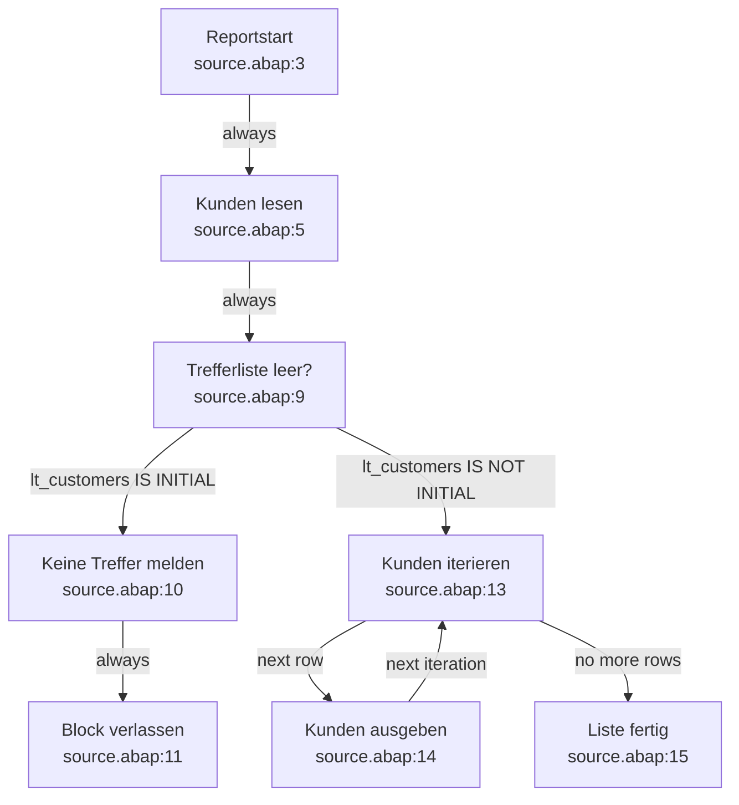
```mermaid
flowchart TD
    s["Reportstart\nsource.abap:3"]
    q["Kunden lesen\nsource.abap:5"]
    g["Trefferliste leer?\nsource.abap:9"]
    no["Keine Treffer melden\nsource.abap:10"]
    e["Block verlassen\nsource.abap:11"]
    l["Kunden iterieren\nsource.abap:13"]
    o["Kunden ausgeben\nsource.abap:14"]
    done["Liste fertig\nsource.abap:15"]
    s -->|"always"| q
    q -->|"always"| g
    g -->|"lt_customers IS INITIAL"| no
    no -->|"always"| e
    g -->|"lt_customers IS NOT INITIAL"| l
    l -->|"next row"| o
    o -->|"next iteration"| l
    l -->|"no more rows"| done
```

| Knoten | Typ | Quelle | Bedeutung |
|---|---|---|---|
| s | start | source.abap:3 | Reportstart |
| q | read | source.abap:5 | Kunden lesen |
| g | gateway | source.abap:9 | Trefferliste leer? |
| no | output | source.abap:10 | Keine Treffer melden |
| e | end | source.abap:11 | Block verlassen |
| l | loop | source.abap:13 | Kunden iterieren |
| o | output | source.abap:14 | Kunden ausgeben |
| done | end | source.abap:15 | Liste fertig |

### Konkrete Handarbeit und Schätzgrenze

- **CC-001-W01**: KNA1-Projektion KUNNR/NAME1/LAND1 und ORDER BY gegen I_CUSTOMER im Zielrelease prüfen
- **CC-001-W02**: Berechtigungs- und Filterunterschiede des Ziel-Lesemodells demonstrieren
- **CC-001-W03**: Leere Treffer und Mehrtreffer gegen SAP-Testdaten prüfen

Autorenannahme, nicht kalibriert: **2 / 4 / 8 Stunden** (optimistisch / wahrscheinlich / pessimistisch). Iststunden: **nicht gemessen**. Arbeitsumfang und Ausschlüsse siehe Kontext/README; diese Werte sind weder TCO-Ground-Truth noch belastbare Obergrenzen bei fehlenden Abhängigkeiten.

### Prüferfragen

- KNA1-Projektion KUNNR/NAME1/LAND1 und ORDER BY gegen I_CUSTOMER im Zielrelease prüfen
- Berechtigungs- und Filterunterschiede des Ziel-Lesemodells demonstrieren
- Leere Treffer und Mehrtreffer gegen SAP-Testdaten prüfen
- Tragen alle Anker den vollständigen Fachsatz einschließlich Bedingungen und Negativpfad?
- Welche Aussage ist nur eine Fixture-Annahme und darf nicht auf den echten Kunden übertragen werden?

**Freigabe:** externe SAP-Architekturprüfung ausstehend; Quelle, Kontext, Oracle und Regelversion müssen gemeinsam gezeichnet werden.

---

## CC-002 — FAE: expliziter Leermengenschutz und Company-Daten

**Konstruktklassen:** K01 · **Classic:** C · **Cloud-API:** not_usable  
**Scope:** `complete_for_declared_slice` · **Status:** nicht unabhängig freigegeben.

Quellenhash: `ea6745f9e30b5041cc10315194ddcb88d56c6f113f6061ff88a8f4bd6a83d23d`  
Kontexthash: `600d5b9e7ba3f4f61dde9b8dd151e374a2433dae93f6849a6266772e740ca2fc`

**Profilannahmen:** For this synthetic profile these SAP tables are stipulated internal and not classicAPI/noAPI. Release state and typed successors are observed; absence from the complete classic catalogue still requires independent verification.

### Quelltext `source.abap` — Zeilen zählen ab1

```abap
REPORT zcc_ref_002.
TYPES: BEGIN OF ty_key, kunnr TYPE c LENGTH 10, END OF ty_key.
DATA lt_keys TYPE STANDARD TABLE OF ty_key WITH EMPTY KEY.
PARAMETERS p_kunnr TYPE c LENGTH 10.
START-OF-SELECTION.
  IF p_kunnr IS NOT INITIAL.
    APPEND VALUE #( kunnr = p_kunnr ) TO lt_keys.
  ENDIF.
  IF lt_keys IS INITIAL.
    WRITE / 'NO_INPUT'.
    RETURN.
  ENDIF.
  SELECT kunnr, bukrs, akont
    FROM knb1
    FOR ALL ENTRIES IN @lt_keys
    WHERE kunnr = @lt_keys-kunnr
    INTO TABLE @DATA(lt_company).
  LOOP AT lt_company INTO DATA(ls_company).
    WRITE: / ls_company-kunnr, ls_company-bukrs, ls_company-akont.
  ENDLOOP.
```

```text
001  REPORT zcc_ref_002.
002  TYPES: BEGIN OF ty_key, kunnr TYPE c LENGTH 10, END OF ty_key.
003  DATA lt_keys TYPE STANDARD TABLE OF ty_key WITH EMPTY KEY.
004  PARAMETERS p_kunnr TYPE c LENGTH 10.
005  START-OF-SELECTION.
006    IF p_kunnr IS NOT INITIAL.
007      APPEND VALUE #( kunnr = p_kunnr ) TO lt_keys.
008    ENDIF.
009    IF lt_keys IS INITIAL.
010      WRITE / 'NO_INPUT'.
011      RETURN.
012    ENDIF.
013    SELECT kunnr, bukrs, akont
014      FROM knb1
015      FOR ALL ENTRIES IN @lt_keys
016      WHERE kunnr = @lt_keys-kunnr
017      INTO TABLE @DATA(lt_company).
018    LOOP AT lt_company INTO DATA(ls_company).
019      WRITE: / ls_company-kunnr, ls_company-bukrs, ls_company-akont.
020    ENDLOOP.
```

### Sollbefunde

| ID | Regelversion | Exakter Anker | Schwere* | Sollaussage | Quellen |
|---|---|---|---|---|---|
| CC-002-F01 | R01@1.0.0 | source.abap:14 | medium | KNB1 wird direkt gelesen; I_CUSTOMERCOMPANY ist der katalogisierte Lesemodell-Nachfolger. | SAP-LEVEL, SAP-PCE22 |

\* Der Schweregrad ist eine Korpuspriorität, keine behauptete SAP-ATC-Prioritätsnummer.

**Explizit unzulässige Schlussfolgerungen:**

- `source.abap:15` — Kein ungesichertes Leertabellen-FAE melden; Guard und Return sind vorhanden.

### SAP-/Repository-Objekte und Nachfolger

**KNB1** · Eigentümer `SAP` · Verwendung `read`  
Anker: source.abap:14. Identität: `{"tadirObject": "TABL", "tadirObjName": "KNB1", "objectType": "TABL", "objectKey": "KNB1"}`.  
Cloud-Rohzustand: `notToBeReleased`; Classic-Rohzustand: `not_asserted`. Nachfolgerstatus: `listed`.

```json
[
  {
    "tadirObject": "DDLS",
    "tadirObjName": "I_CUSTOMERCOMPANY",
    "objectType": "CDS_STOB",
    "objectKey": "I_CUSTOMERCOMPANY"
  }
]
```

Quelle: SAP-PCE22; 136448–136465.

### Fachliche Ground-Truth-Kandidaten

**CC-002-B01** — Nur eine nicht leere Kundennummer wird als Selektionsschlüssel aufgenommen.  
Anker: source.abap:6, source.abap:6–7. Kontext: /business_scope, /execution_assumptions.

**CC-002-B02** — Bei leerer Schlüsselliste wird vor der FAE-Abfrage abgebrochen.  
Anker: source.abap:9, source.abap:11. Kontext: /business_scope, /execution_assumptions.

**CC-002-B03** — Das Ergebnis enthält Kundennummer, Buchungskreis und Abstimmkonto; nicht jede beliebige Stammdateneigenschaft.  
Anker: source.abap:13. Kontext: /business_scope, /execution_assumptions.

### Erwartetes Prozessskelett

Dies ist der normalisierte prozedurale As-is-Scope, kein importgeprüftes BPMN und keine tatsächliche Ausführung. Die Kantenbedingungen sind Teil des Sollvertrags.

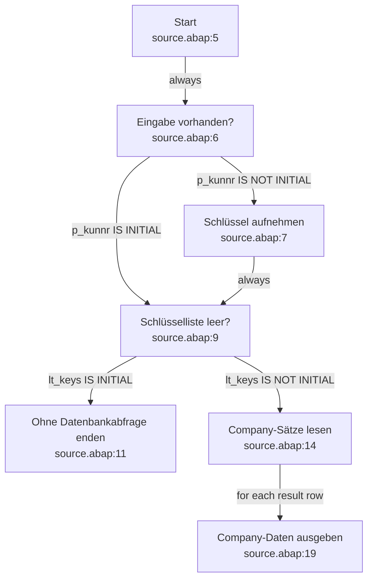
```mermaid
flowchart TD
    s["Start\nsource.abap:5"]
    i["Eingabe vorhanden?\nsource.abap:6"]
    a["Schlüssel aufnehmen\nsource.abap:7"]
    g["Schlüsselliste leer?\nsource.abap:9"]
    x["Ohne Datenbankabfrage enden\nsource.abap:11"]
    q["Company-Sätze lesen\nsource.abap:14"]
    o["Company-Daten ausgeben\nsource.abap:19"]
    s -->|"always"| i
    i -->|"p_kunnr IS NOT INITIAL"| a
    i -->|"p_kunnr IS INITIAL"| g
    a -->|"always"| g
    g -->|"lt_keys IS INITIAL"| x
    g -->|"lt_keys IS NOT INITIAL"| q
    q -->|"for each result row"| o
```

| Knoten | Typ | Quelle | Bedeutung |
|---|---|---|---|
| s | start | source.abap:5 | Start |
| i | gateway | source.abap:6 | Eingabe vorhanden? |
| a | action | source.abap:7 | Schlüssel aufnehmen |
| g | gateway | source.abap:9 | Schlüsselliste leer? |
| x | end | source.abap:11 | Ohne Datenbankabfrage enden |
| q | read | source.abap:14 | Company-Sätze lesen |
| o | output | source.abap:19 | Company-Daten ausgeben |

### Konkrete Handarbeit und Schätzgrenze

- **CC-002-W01**: Guard einschließlich RETURN vor FAE erhalten
- **CC-002-W02**: KNB1-Projektion KUNNR/BUKRS/AKONT gegen Zielmodell abgleichen
- **CC-002-W03**: Leere Eingabe, mehrere Company-Sätze und Duplikatsemantik prüfen

Autorenannahme, nicht kalibriert: **2 / 5 / 10 Stunden** (optimistisch / wahrscheinlich / pessimistisch). Iststunden: **nicht gemessen**. Arbeitsumfang und Ausschlüsse siehe Kontext/README; diese Werte sind weder TCO-Ground-Truth noch belastbare Obergrenzen bei fehlenden Abhängigkeiten.

### Prüferfragen

- Guard einschließlich RETURN vor FAE erhalten
- KNB1-Projektion KUNNR/BUKRS/AKONT gegen Zielmodell abgleichen
- Leere Eingabe, mehrere Company-Sätze und Duplikatsemantik prüfen
- Tragen alle Anker den vollständigen Fachsatz einschließlich Bedingungen und Negativpfad?
- Welche Aussage ist nur eine Fixture-Annahme und darf nicht auf den echten Kunden übertragen werden?

**Freigabe:** externe SAP-Architekturprüfung ausstehend; Quelle, Kontext, Oracle und Regelversion müssen gemeinsam gezeichnet werden.

---

## CC-003 — Lokaler Regel-Wrapper: Standard-ABAP B und keine echte Freigabe

**Konstruktklassen:** K02 · **Classic:** B · **Cloud-API:** not_applicable  
**Scope:** `complete_for_declared_slice` · **Status:** nicht unabhängig freigegeben.

Quellenhash: `a8fcae066b8e02d4ddec782a5d40ec390615e27956799ecd3d05a77a74d4808a`  
Kontexthash: `1addd9fdb0f6f3d87c093f3c66db6e0db1dae14734b130befc2d0aaf95916d5f`

### Quelltext `source.abap` — Zeilen zählen ab1

```abap
REPORT zcc_ref_003.
CLASS lcl_route DEFINITION FINAL.
  PUBLIC SECTION.
    CLASS-METHODS decide IMPORTING iv_amount TYPE decfloat34
                         RETURNING VALUE(rv_route) TYPE string.
ENDCLASS.
CLASS lcl_route IMPLEMENTATION.
  METHOD decide.
    IF iv_amount < 0.
      rv_route = 'INVALID'.
    ELSEIF iv_amount <= 10000.
      rv_route = 'AUTO_ROUTE'.
    ELSE.
      rv_route = 'MANAGER_ROUTE'.
    ENDIF.
  ENDMETHOD.
ENDCLASS.
PARAMETERS p_amount TYPE p LENGTH 9 DECIMALS 2.
START-OF-SELECTION.
  DATA(lv_route) = lcl_route=>decide( CONV decfloat34( p_amount ) ).
  WRITE / lv_route.
```

```text
001  REPORT zcc_ref_003.
002  CLASS lcl_route DEFINITION FINAL.
003    PUBLIC SECTION.
004      CLASS-METHODS decide IMPORTING iv_amount TYPE decfloat34
005                           RETURNING VALUE(rv_route) TYPE string.
006  ENDCLASS.
007  CLASS lcl_route IMPLEMENTATION.
008    METHOD decide.
009      IF iv_amount < 0.
010        rv_route = 'INVALID'.
011      ELSEIF iv_amount <= 10000.
012        rv_route = 'AUTO_ROUTE'.
013      ELSE.
014        rv_route = 'MANAGER_ROUTE'.
015      ENDIF.
016    ENDMETHOD.
017  ENDCLASS.
018  PARAMETERS p_amount TYPE p LENGTH 9 DECIMALS 2.
019  START-OF-SELECTION.
020    DATA(lv_route) = lcl_route=>decide( CONV decfloat34( p_amount ) ).
021    WRITE / lv_route.
```

### Sollbefunde

**Keine Findings im endlichen v1-Regelvertrag.** Das klassifiziert Standard-ABAP nicht automatisch zu A. Compiler-/Security-/allgemeine Qualitätsdiagnosen außerhalb dieses Vertrags bleiben separat.

**Explizit unzulässige Schlussfolgerungen:**

- `source.abap:14` — Kein realer Manager-Task, keine Bestellung oder tatsächliche Genehmigung belegt.

### SAP-/Repository-Objekte und Nachfolger

Keine explizite externe SAP-Repository-Identität im gelieferten Scope. Dynamische Ziele oder Kernelroutinen können dennoch unbekannt beziehungsweise keine TADIR-Objekte sein; das ist kein automatisches „keine Abhängigkeit“. Kommentare und Literale erzeugen keine Phantom-Objekte.

### Fachliche Ground-Truth-Kandidaten

**CC-003-B01** — Negative Beträge werden als INVALID eingeordnet.  
Anker: source.abap:9, source.abap:9–10. Kontext: /business_scope, /execution_assumptions.

**CC-003-B02** — Nicht negative Beträge bis einschließlich 10000 erhalten AUTO_ROUTE.  
Anker: source.abap:11, source.abap:12. Kontext: /business_scope, /execution_assumptions.

**CC-003-B03** — Für größere Beträge wird MANAGER_ROUTE zurückgegeben; der Code führt keine menschliche Genehmigung aus.  
Anker: source.abap:14, source.abap:9–14. Kontext: /business_scope, /execution_assumptions.

### Erwartetes Prozessskelett

Dies ist der normalisierte prozedurale As-is-Scope, kein importgeprüftes BPMN und keine tatsächliche Ausführung. Die Kantenbedingungen sind Teil des Sollvertrags.

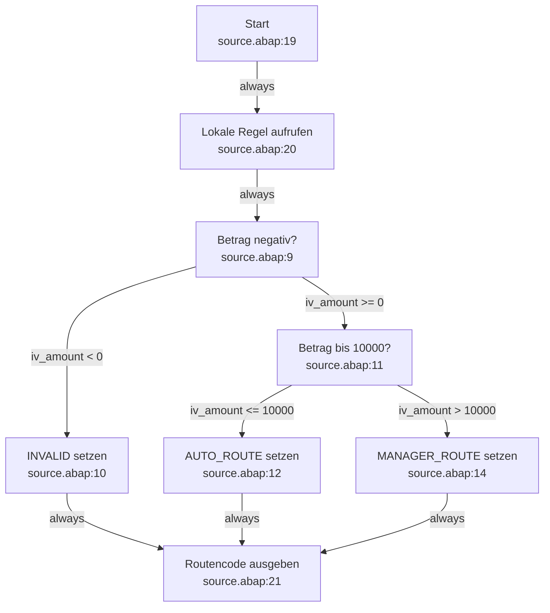
```mermaid
flowchart TD
    s["Start\nsource.abap:19"]
    c["Lokale Regel aufrufen\nsource.abap:20"]
    g["Betrag negativ?\nsource.abap:9"]
    x["INVALID setzen\nsource.abap:10"]
    h["Betrag bis 10000?\nsource.abap:11"]
    a["AUTO_ROUTE setzen\nsource.abap:12"]
    m["MANAGER_ROUTE setzen\nsource.abap:14"]
    o["Routencode ausgeben\nsource.abap:21"]
    s -->|"always"| c
    c -->|"always"| g
    g -->|"iv_amount < 0"| x
    g -->|"iv_amount >= 0"| h
    h -->|"iv_amount <= 10000"| a
    h -->|"iv_amount > 10000"| m
    x -->|"always"| o
    a -->|"always"| o
    m -->|"always"| o
```

| Knoten | Typ | Quelle | Bedeutung |
|---|---|---|---|
| s | start | source.abap:19 | Start |
| c | call | source.abap:20 | Lokale Regel aufrufen |
| g | gateway | source.abap:9 | Betrag negativ? |
| x | action | source.abap:10 | INVALID setzen |
| h | gateway | source.abap:11 | Betrag bis 10000? |
| a | action | source.abap:12 | AUTO_ROUTE setzen |
| m | action | source.abap:14 | MANAGER_ROUTE setzen |
| o | output | source.abap:21 | Routencode ausgeben |

### Konkrete Handarbeit und Schätzgrenze

- **CC-003-W01**: Grenzen -0.01/0/10000/10000.01 gegen Fachsätze abgleichen
- **CC-003-W02**: Routentext von tatsächlicher Genehmigung trennen
- **CC-003-W03**: Wrapper im gewählten Laufzeitmodell aktivieren und testen

Autorenannahme, nicht kalibriert: **1 / 2 / 4 Stunden** (optimistisch / wahrscheinlich / pessimistisch). Iststunden: **nicht gemessen**. Arbeitsumfang und Ausschlüsse siehe Kontext/README; diese Werte sind weder TCO-Ground-Truth noch belastbare Obergrenzen bei fehlenden Abhängigkeiten.

### Zusätzliche fachliche Prüfeingaben

```json
{
  "kind": "manually_authored_expectations_not_SAP_execution",
  "vectors": [
    {
      "amount": "-0.01",
      "expected": "INVALID"
    },
    {
      "amount": "0",
      "expected": "AUTO_ROUTE"
    },
    {
      "amount": "10000",
      "expected": "AUTO_ROUTE"
    },
    {
      "amount": "10000.01",
      "expected": "MANAGER_ROUTE"
    }
  ]
}
```

### Prüferfragen

- Grenzen -0.01/0/10000/10000.01 gegen Fachsätze abgleichen
- Routentext von tatsächlicher Genehmigung trennen
- Wrapper im gewählten Laufzeitmodell aktivieren und testen
- Tragen alle Anker den vollständigen Fachsatz einschließlich Bedingungen und Negativpfad?
- Welche Aussage ist nur eine Fixture-Annahme und darf nicht auf den echten Kunden übertragen werden?

**Freigabe:** externe SAP-Architekturprüfung ausstehend; Quelle, Kontext, Oracle und Regelversion müssen gemeinsam gezeichnet werden.

---

## CC-004 — HTTP-Wrapper: Classic API plus notToBeReleased

**Konstruktklassen:** K02 · **Classic:** B · **Cloud-API:** not_usable  
**Scope:** `complete_for_declared_slice` · **Status:** nicht unabhängig freigegeben.

Quellenhash: `baf697be6ec0a962e8164b2f440f4c355aa1e20c86a16403aef66935f90dd34d`  
Kontexthash: `cd2b5a9bebce3718d4e0fc6dc6f50611bb93c3cc9f453f6ee08c7514d2da13d8`

**Profilannahmen:** CL_HTTP_UTILITY dual status is explicitly documented by SAP. Exact typed successor not captured in accessible primary extract; do not guess.

### Quelltext `source.abap` — Zeilen zählen ab1

```abap
REPORT zcc_ref_004.
PARAMETERS p_text TYPE c LENGTH 80 LOWER CASE DEFAULT 'A B'.
CLASS lcl_url DEFINITION FINAL.
  PUBLIC SECTION.
    CLASS-METHODS encode IMPORTING iv_text TYPE string
                         RETURNING VALUE(rv_text) TYPE string.
ENDCLASS.
CLASS lcl_url IMPLEMENTATION.
  METHOD encode.
    rv_text = cl_http_utility=>escape_url( unescaped = iv_text ).
  ENDMETHOD.
ENDCLASS.
START-OF-SELECTION.
  DATA(lv_result) = lcl_url=>encode( CONV string( p_text ) ).
  WRITE / lv_result.
```

```text
001  REPORT zcc_ref_004.
002  PARAMETERS p_text TYPE c LENGTH 80 LOWER CASE DEFAULT 'A B'.
003  CLASS lcl_url DEFINITION FINAL.
004    PUBLIC SECTION.
005      CLASS-METHODS encode IMPORTING iv_text TYPE string
006                           RETURNING VALUE(rv_text) TYPE string.
007  ENDCLASS.
008  CLASS lcl_url IMPLEMENTATION.
009    METHOD encode.
010      rv_text = cl_http_utility=>escape_url( unescaped = iv_text ).
011    ENDMETHOD.
012  ENDCLASS.
013  START-OF-SELECTION.
014    DATA(lv_result) = lcl_url=>encode( CONV string( p_text ) ).
015    WRITE / lv_result.
```

### Sollbefunde

| ID | Regelversion | Exakter Anker | Schwere* | Sollaussage | Quellen |
|---|---|---|---|---|---|
| CC-004-F01 | R04@1.0.0 | source.abap:10 | info | CL_HTTP_UTILITY ist im dokumentierten PCE2025-Overlap classicAPI und notToBeReleased: klassisch B, nicht D. | SAP-OVERLAP, SAP-CLASSIC |

\* Der Schweregrad ist eine Korpuspriorität, keine behauptete SAP-ATC-Prioritätsnummer.

**Explizit unzulässige Schlussfolgerungen:**

- `source.abap:10` — Nicht wegen notToBeReleased allein zu D machen.

### SAP-/Repository-Objekte und Nachfolger

**CL_HTTP_UTILITY** · Eigentümer `SAP` · Verwendung `static_method_call`  
Anker: source.abap:10. Identität: `{"tadirObject": "CLAS", "tadirObjName": "CL_HTTP_UTILITY", "objectType": "CLAS", "objectKey": "CL_HTTP_UTILITY"}`.  
Cloud-Rohzustand: `notToBeReleased`; Classic-Rohzustand: `classicAPI`. Nachfolgerstatus: `exists_but_exact_identity_not_captured`.

Nachfolgerliste: `[]` **mit obiger Statusbegründung**, nicht pauschal „kein Nachfolger existiert“.

Quelle: SAP-OVERLAP, SAP-CLASSIC; SAP blog CL_HTTP_UTILITY overlap; classic JSON 6992–7004.

### Fachliche Ground-Truth-Kandidaten

**CC-004-B01** — Der Wrapper ruft die URL-Escaping-Methode von CL_HTTP_UTILITY auf.  
Anker: source.abap:10. Kontext: /business_scope, /execution_assumptions.

**CC-004-B02** — Der Eingabetext wird dem lokalen Wrapper übergeben; der gelieferte Quelltext enthält keinen expliziten HTTP-Request.  
Anker: source.abap:14, source.abap:10–11. Kontext: /business_scope, /execution_assumptions.

### Erwartetes Prozessskelett

Dies ist der normalisierte prozedurale As-is-Scope, kein importgeprüftes BPMN und keine tatsächliche Ausführung. Die Kantenbedingungen sind Teil des Sollvertrags.

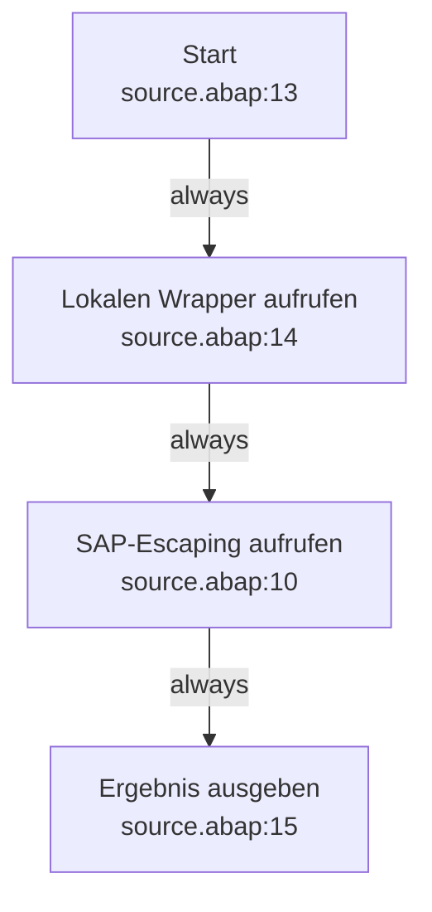
```mermaid
flowchart TD
    s["Start\nsource.abap:13"]
    w["Lokalen Wrapper aufrufen\nsource.abap:14"]
    e["SAP-Escaping aufrufen\nsource.abap:10"]
    o["Ergebnis ausgeben\nsource.abap:15"]
    s -->|"always"| w
    w -->|"always"| e
    e -->|"always"| o
```

| Knoten | Typ | Quelle | Bedeutung |
|---|---|---|---|
| s | start | source.abap:13 | Start |
| w | call | source.abap:14 | Lokalen Wrapper aufrufen |
| e | opaque_call | source.abap:10 | SAP-Escaping aufrufen |
| o | output | source.abap:15 | Ergebnis ausgeben |

### Konkrete Handarbeit und Schätzgrenze

- **CC-004-W01**: PCE2025-Overlap und exakte successor-Identität aus nativem SAP-Snapshot erfassen
- **CC-004-W02**: Escaping-Vertrag einschließlich Unicode und reservierter Zeichen vergleichen
- **CC-004-W03**: Keine Netzwerk-/Berechtigungsfunktionen aus dem Wrappernamen ableiten

Autorenannahme, nicht kalibriert: **1 / 3 / 6 Stunden** (optimistisch / wahrscheinlich / pessimistisch). Iststunden: **nicht gemessen**. Arbeitsumfang und Ausschlüsse siehe Kontext/README; diese Werte sind weder TCO-Ground-Truth noch belastbare Obergrenzen bei fehlenden Abhängigkeiten.

### Prüferfragen

- PCE2025-Overlap und exakte successor-Identität aus nativem SAP-Snapshot erfassen
- Escaping-Vertrag einschließlich Unicode und reservierter Zeichen vergleichen
- Keine Netzwerk-/Berechtigungsfunktionen aus dem Wrappernamen ableiten
- Tragen alle Anker den vollständigen Fachsatz einschließlich Bedingungen und Negativpfad?
- Welche Aussage ist nur eine Fixture-Annahme und darf nicht auf den echten Kunden übertragen werden?

**Besonderheit:** Bekannter Nachfolgerexistenz-Beleg ist keine Identität des Nachfolgers. Keine erfundene CL_WEB_HTTP_UTILITY-Zuordnung im Oracle.

**Freigabe:** externe SAP-Architekturprüfung ausstehend; Quelle, Kontext, Oracle und Regelversion müssen gemeinsam gezeichnet werden.

---

## CC-005 — Statische Funktionsbausteine: ALPHA in beide Richtungen

**Konstruktklassen:** K03 · **Classic:** B · **Cloud-API:** not_usable  
**Scope:** `complete_for_declared_slice` · **Status:** nicht unabhängig freigegeben.

Quellenhash: `169d55b94e766f7bd3909fbcdef09feb143dc39a814ef894904b78528063f767`  
Kontexthash: `39c0b3770ad268d8eb45f6bb8b56d2c3809ac09d99c7e7ee346d2522549e11a7`

### Quelltext `source.abap` — Zeilen zählen ab1

```abap
REPORT zcc_ref_005.
PARAMETERS p_id TYPE c LENGTH 10 DEFAULT '123'.
DATA lv_internal TYPE c LENGTH 10.
DATA lv_external TYPE c LENGTH 10.
START-OF-SELECTION.
  CALL FUNCTION 'CONVERSION_EXIT_ALPHA_INPUT'
    EXPORTING input = p_id
    IMPORTING output = lv_internal.
  CALL FUNCTION 'CONVERSION_EXIT_ALPHA_OUTPUT'
    EXPORTING input = lv_internal
    IMPORTING output = lv_external.
  WRITE: / lv_internal, / lv_external.
```

```text
001  REPORT zcc_ref_005.
002  PARAMETERS p_id TYPE c LENGTH 10 DEFAULT '123'.
003  DATA lv_internal TYPE c LENGTH 10.
004  DATA lv_external TYPE c LENGTH 10.
005  START-OF-SELECTION.
006    CALL FUNCTION 'CONVERSION_EXIT_ALPHA_INPUT'
007      EXPORTING input = p_id
008      IMPORTING output = lv_internal.
009    CALL FUNCTION 'CONVERSION_EXIT_ALPHA_OUTPUT'
010      EXPORTING input = lv_internal
011      IMPORTING output = lv_external.
012    WRITE: / lv_internal, / lv_external.
```

### Sollbefunde

| ID | Regelversion | Exakter Anker | Schwere* | Sollaussage | Quellen |
|---|---|---|---|---|---|
| CC-005-F01 | R06@1.0.0 | source.abap:6 | info | Statisch benannter klassischer Funktionsbaustein; historisches Rohlabel notToBeReleasedStable nicht in D umdeuten. | SAP-CALL |
| CC-005-F02 | R06@1.0.0 | source.abap:9 | info | Zweiter statischer Baustein; auch hier keine im beobachteten Katalog benannte Nachfolgeridentität. | SAP-CALL |

\* Der Schweregrad ist eine Korpuspriorität, keine behauptete SAP-ATC-Prioritätsnummer.

### SAP-/Repository-Objekte und Nachfolger

**CONVERSION_EXIT_ALPHA_INPUT** · Eigentümer `SAP` · Verwendung `static_function_call`  
Anker: source.abap:6. Identität: `{"tadirObject": "FUGR", "tadirObjName": "ALFA", "objectType": "FUNC", "objectKey": "CONVERSION_EXIT_ALPHA_INPUT"}`.  
Cloud-Rohzustand: `notToBeReleasedStable`; Classic-Rohzustand: `classicAPI`. Nachfolgerstatus: `not_listed_in_observed_record`.

Nachfolgerliste: `[]` **mit obiger Statusbegründung**, nicht pauschal „kein Nachfolger existiert“.

Quelle: SAP-PCE22, SAP-CLASSIC; release INPUT 141169–141178; classic INPUT 31473–31481 / OUTPUT 31482–31490.

**CONVERSION_EXIT_ALPHA_OUTPUT** · Eigentümer `SAP` · Verwendung `static_function_call`  
Anker: source.abap:9. Identität: `{"tadirObject": "FUGR", "tadirObjName": "ALFA", "objectType": "FUNC", "objectKey": "CONVERSION_EXIT_ALPHA_OUTPUT"}`.  
Cloud-Rohzustand: `notToBeReleasedStable`; Classic-Rohzustand: `classicAPI`. Nachfolgerstatus: `not_listed_in_observed_record`.

Nachfolgerliste: `[]` **mit obiger Statusbegründung**, nicht pauschal „kein Nachfolger existiert“.

Quelle: SAP-PCE22, SAP-CLASSIC; release INPUT 141169–141178; classic INPUT 31473–31481 / OUTPUT 31482–31490.

### Fachliche Ground-Truth-Kandidaten

**CC-005-B01** — Der Code übergibt p_id an CONVERSION_EXIT_ALPHA_INPUT und übernimmt dessen Ausgabe nach lv_internal.  
Anker: source.abap:6, source.abap:7, source.abap:8. Kontext: /business_scope, /execution_assumptions.

**CC-005-B02** — Danach wird lv_internal an CONVERSION_EXIT_ALPHA_OUTPUT übergeben; dessen Ausgabe landet in lv_external.  
Anker: source.abap:9, source.abap:10, source.abap:11. Kontext: /business_scope, /execution_assumptions.

### Erwartetes Prozessskelett

Dies ist der normalisierte prozedurale As-is-Scope, kein importgeprüftes BPMN und keine tatsächliche Ausführung. Die Kantenbedingungen sind Teil des Sollvertrags.

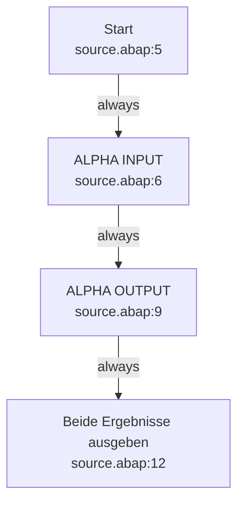
```mermaid
flowchart TD
    s["Start\nsource.abap:5"]
    i["ALPHA INPUT\nsource.abap:6"]
    o["ALPHA OUTPUT\nsource.abap:9"]
    e["Beide Ergebnisse ausgeben\nsource.abap:12"]
    s -->|"always"| i
    i -->|"always"| o
    o -->|"always"| e
```

| Knoten | Typ | Quelle | Bedeutung |
|---|---|---|---|
| s | start | source.abap:5 | Start |
| i | opaque_call | source.abap:6 | ALPHA INPUT |
| o | opaque_call | source.abap:9 | ALPHA OUTPUT |
| e | output | source.abap:12 | Beide Ergebnisse ausgeben |

### Konkrete Handarbeit und Schätzgrenze

- **CC-005-W01**: ALPHA-Ein-/Ausgabetypen und Feldlängen auf Zielsystem bestätigen
- **CC-005-W02**: Sprachalternative separat von Repository-Nachfolger bewerten
- **CC-005-W03**: Numerische, alphanumerische und leere Eingaben testen

Autorenannahme, nicht kalibriert: **1 / 2 / 4 Stunden** (optimistisch / wahrscheinlich / pessimistisch). Iststunden: **nicht gemessen**. Arbeitsumfang und Ausschlüsse siehe Kontext/README; diese Werte sind weder TCO-Ground-Truth noch belastbare Obergrenzen bei fehlenden Abhängigkeiten.

### Prüferfragen

- ALPHA-Ein-/Ausgabetypen und Feldlängen auf Zielsystem bestätigen
- Sprachalternative separat von Repository-Nachfolger bewerten
- Numerische, alphanumerische und leere Eingaben testen
- Tragen alle Anker den vollständigen Fachsatz einschließlich Bedingungen und Negativpfad?
- Welche Aussage ist nur eine Fixture-Annahme und darf nicht auf den echten Kunden übertragen werden?

**Besonderheit:** ALPHA-Stringtemplate ist eine zu prüfende Sprachalternative, kein erfundener SAP-Repository-Nachfolger. Funktionssemantik muss bei Zielsystemreview separat bestätigt werden.

**Freigabe:** externe SAP-Architekturprüfung ausstehend; Quelle, Kontext, Oracle und Regelversion müssen gemeinsam gezeichnet werden.

---

## CC-006 — Konstanter FM-Name ist statisch, kein dynamischer Blindflug

**Konstruktklassen:** K03, K06 · **Classic:** B · **Cloud-API:** not_usable  
**Scope:** `complete_for_declared_slice` · **Status:** nicht unabhängig freigegeben.

Quellenhash: `0b63a007cac0e750a991ec24c8bc58c0921fb018da669ee4f2299a9718f60aec`  
Kontexthash: `47d76acad9ff1802d32059355fcf54315b3c958c1340629ccb6924bb8dbc9508`

### Quelltext `source.abap` — Zeilen zählen ab1

```abap
REPORT zcc_ref_006.
CONSTANTS lc_function TYPE c LENGTH 30 VALUE 'CONVERSION_EXIT_ALPHA_INPUT'.
PARAMETERS p_id TYPE c LENGTH 10 DEFAULT '4711'.
DATA lv_result TYPE c LENGTH 10.
START-OF-SELECTION.
  CALL FUNCTION lc_function
    EXPORTING input = p_id
    IMPORTING output = lv_result.
  WRITE / lv_result.
```

```text
001  REPORT zcc_ref_006.
002  CONSTANTS lc_function TYPE c LENGTH 30 VALUE 'CONVERSION_EXIT_ALPHA_INPUT'.
003  PARAMETERS p_id TYPE c LENGTH 10 DEFAULT '4711'.
004  DATA lv_result TYPE c LENGTH 10.
005  START-OF-SELECTION.
006    CALL FUNCTION lc_function
007      EXPORTING input = p_id
008      IMPORTING output = lv_result.
009    WRITE / lv_result.
```

### Sollbefunde

| ID | Regelversion | Exakter Anker | Schwere* | Sollaussage | Quellen |
|---|---|---|---|---|---|
| CC-006-F01 | R06@1.0.0 | source.abap:6 | info | Konstante wird laut SAP als statisch spezifiziert ausgewertet. Auflösen nach CONVERSION_EXIT_ALPHA_INPUT. | SAP-CALL |

\* Der Schweregrad ist eine Korpuspriorität, keine behauptete SAP-ATC-Prioritätsnummer.

**Explizit unzulässige Schlussfolgerungen:**

- `source.abap:6` — Nicht als unauflösbares dynamisches Ziel behandeln.

### SAP-/Repository-Objekte und Nachfolger

**CONVERSION_EXIT_ALPHA_INPUT** · Eigentümer `SAP` · Verwendung `static_via_constant`  
Anker: source.abap:2, source.abap:6. Identität: `{"tadirObject": "FUGR", "tadirObjName": "ALFA", "objectType": "FUNC", "objectKey": "CONVERSION_EXIT_ALPHA_INPUT"}`.  
Cloud-Rohzustand: `notToBeReleasedStable`; Classic-Rohzustand: `classicAPI`. Nachfolgerstatus: `not_listed_in_observed_record`.

Nachfolgerliste: `[]` **mit obiger Statusbegründung**, nicht pauschal „kein Nachfolger existiert“.

Quelle: SAP-PCE22, SAP-CLASSIC; release INPUT 141169–141178; classic INPUT 31473–31481 / OUTPUT 31482–31490.

### Fachliche Ground-Truth-Kandidaten

**CC-006-B01** — Das Aufrufziel ist die unveränderliche Konstante CONVERSION_EXIT_ALPHA_INPUT.  
Anker: source.abap:2, source.abap:6. Kontext: /business_scope, /execution_assumptions.

**CC-006-B02** — Das konvertierte Ergebnis wird in lv_result übernommen.  
Anker: source.abap:8. Kontext: /business_scope, /execution_assumptions.

### Erwartetes Prozessskelett

Dies ist der normalisierte prozedurale As-is-Scope, kein importgeprüftes BPMN und keine tatsächliche Ausführung. Die Kantenbedingungen sind Teil des Sollvertrags.

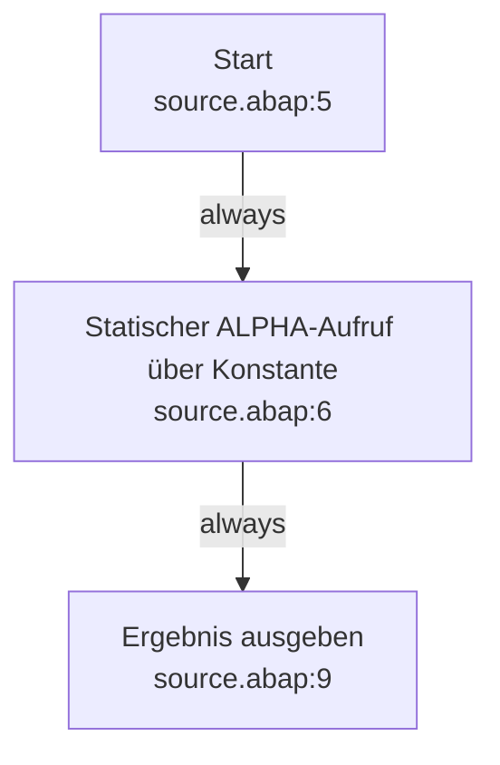
```mermaid
flowchart TD
    s["Start\nsource.abap:5"]
    f["Statischer ALPHA-Aufruf über Konstante\nsource.abap:6"]
    o["Ergebnis ausgeben\nsource.abap:9"]
    s -->|"always"| f
    f -->|"always"| o
```

| Knoten | Typ | Quelle | Bedeutung |
|---|---|---|---|
| s | start | source.abap:5 | Start |
| f | opaque_call | source.abap:6 | Statischer ALPHA-Aufruf über Konstante |
| o | output | source.abap:9 | Ergebnis ausgeben |

### Konkrete Handarbeit und Schätzgrenze

- **CC-006-W01**: CONSTANTS-Bindung mit SAP-Syntaxreferenz prüfen
- **CC-006-W02**: Aufrufstelle und Definitionsanker konsistent zuordnen
- **CC-006-W03**: Korpusgegenprobe auf Variable ändern; erwartete Syntaxklasse muss wechseln

Autorenannahme, nicht kalibriert: **1 / 2 / 3 Stunden** (optimistisch / wahrscheinlich / pessimistisch). Iststunden: **nicht gemessen**. Arbeitsumfang und Ausschlüsse siehe Kontext/README; diese Werte sind weder TCO-Ground-Truth noch belastbare Obergrenzen bei fehlenden Abhängigkeiten.

### Prüferfragen

- CONSTANTS-Bindung mit SAP-Syntaxreferenz prüfen
- Aufrufstelle und Definitionsanker konsistent zuordnen
- Korpusgegenprobe auf Variable ändern; erwartete Syntaxklasse muss wechseln
- Tragen alle Anker den vollständigen Fachsatz einschließlich Bedingungen und Negativpfad?
- Welche Aussage ist nur eine Fixture-Annahme und darf nicht auf den echten Kunden übertragen werden?

**Freigabe:** externe SAP-Architekturprüfung ausstehend; Quelle, Kontext, Oracle und Regelversion müssen gemeinsam gezeichnet werden.

---

## CC-007 — Drei Tabellen: Kunden, Company, Sales Area und Multiplizität

**Konstruktklassen:** K04, K01 · **Classic:** C · **Cloud-API:** not_usable  
**Scope:** `complete_for_declared_slice` · **Status:** nicht unabhängig freigegeben.

Quellenhash: `7a0c8f3aa6fba22a43212733367e78ae7ad3812b1023286dbfe3f2ae6f7d3da4`  
Kontexthash: `ac28d915e96baeb3ff95067e66cb3571790a57a72902d22ca8d36680420b1a5c`

**Profilannahmen:** For this synthetic profile these SAP tables are stipulated internal and not classicAPI/noAPI. Release state and typed successors are observed; absence from the complete classic catalogue still requires independent verification.

### Quelltext `source.abap` — Zeilen zählen ab1

```abap
REPORT zcc_ref_007.
PARAMETERS p_land TYPE c LENGTH 3 DEFAULT 'DE'.
START-OF-SELECTION.
  SELECT a~kunnr, a~name1, b~bukrs, c~vkorg, c~vtweg, c~spart
    FROM kna1 AS a
    INNER JOIN knb1 AS b ON b~kunnr = a~kunnr
    INNER JOIN knvv AS c ON c~kunnr = a~kunnr
    WHERE a~land1 = @p_land
    INTO TABLE @DATA(lt_combinations).
  LOOP AT lt_combinations INTO DATA(ls_row).
    WRITE: / ls_row-kunnr, ls_row-bukrs,
             ls_row-vkorg, ls_row-vtweg, ls_row-spart.
  ENDLOOP.
```

```text
001  REPORT zcc_ref_007.
002  PARAMETERS p_land TYPE c LENGTH 3 DEFAULT 'DE'.
003  START-OF-SELECTION.
004    SELECT a~kunnr, a~name1, b~bukrs, c~vkorg, c~vtweg, c~spart
005      FROM kna1 AS a
006      INNER JOIN knb1 AS b ON b~kunnr = a~kunnr
007      INNER JOIN knvv AS c ON c~kunnr = a~kunnr
008      WHERE a~land1 = @p_land
009      INTO TABLE @DATA(lt_combinations).
010    LOOP AT lt_combinations INTO DATA(ls_row).
011      WRITE: / ls_row-kunnr, ls_row-bukrs,
012               ls_row-vkorg, ls_row-vtweg, ls_row-spart.
013    ENDLOOP.
```

### Sollbefunde

| ID | Regelversion | Exakter Anker | Schwere* | Sollaussage | Quellen |
|---|---|---|---|---|---|
| CC-007-F01 | R01@1.0.0 | source.abap:5 | medium | KNA1 lesen; Nachfolger I_CUSTOMER. | SAP-LEVEL, SAP-PCE22 |
| CC-007-F02 | R01@1.0.0 | source.abap:6 | medium | KNB1 lesen; Nachfolger I_CUSTOMERCOMPANY. | SAP-LEVEL, SAP-PCE22 |
| CC-007-F03 | R01@1.0.0 | source.abap:7 | medium | KNVV lesen; Nachfolger I_CUSTOMERSALESAREA. | SAP-LEVEL, SAP-PCE22 |
| CC-007-F04 | R08@1.0.0 | source.abap:4–8 | medium | Company und Sales Area werden jeweils nur über Kunde verbunden; Kombinationen können sich multiplizieren. | SAP-SQL |

\* Der Schweregrad ist eine Korpuspriorität, keine behauptete SAP-ATC-Prioritätsnummer.

### SAP-/Repository-Objekte und Nachfolger

**KNA1** · Eigentümer `SAP` · Verwendung `join_read`  
Anker: source.abap:5. Identität: `{"tadirObject": "TABL", "tadirObjName": "KNA1", "objectType": "TABL", "objectKey": "KNA1"}`.  
Cloud-Rohzustand: `notToBeReleased`; Classic-Rohzustand: `not_asserted`. Nachfolgerstatus: `listed`.

```json
[
  {
    "tadirObject": "DDLS",
    "tadirObjName": "I_CUSTOMER",
    "objectType": "CDS_STOB",
    "objectKey": "I_CUSTOMER"
  }
]
```

Quelle: SAP-PCE22; 136428–136446.

**KNB1** · Eigentümer `SAP` · Verwendung `join_read`  
Anker: source.abap:6. Identität: `{"tadirObject": "TABL", "tadirObjName": "KNB1", "objectType": "TABL", "objectKey": "KNB1"}`.  
Cloud-Rohzustand: `notToBeReleased`; Classic-Rohzustand: `not_asserted`. Nachfolgerstatus: `listed`.

```json
[
  {
    "tadirObject": "DDLS",
    "tadirObjName": "I_CUSTOMERCOMPANY",
    "objectType": "CDS_STOB",
    "objectKey": "I_CUSTOMERCOMPANY"
  }
]
```

Quelle: SAP-PCE22; 136448–136465.

**KNVV** · Eigentümer `SAP` · Verwendung `join_read`  
Anker: source.abap:7. Identität: `{"tadirObject": "TABL", "tadirObjName": "KNVV", "objectType": "TABL", "objectKey": "KNVV"}`.  
Cloud-Rohzustand: `notToBeReleased`; Classic-Rohzustand: `not_asserted`. Nachfolgerstatus: `listed`.

```json
[
  {
    "tadirObject": "DDLS",
    "tadirObjName": "I_CUSTOMERSALESAREA",
    "objectType": "CDS_STOB",
    "objectKey": "I_CUSTOMERSALESAREA"
  }
]
```

Quelle: SAP-PCE22; 136562–136578.

### Fachliche Ground-Truth-Kandidaten

**CC-007-B01** — Es werden nur Kunden des angegebenen Landes berücksichtigt.  
Anker: source.abap:8. Kontext: /business_scope, /execution_assumptions.

**CC-007-B02** — Ausgegeben werden Kombinationen vorhandener Company- und Sales-Area-Sätze je Kunde; nicht zwingend eine Zeile je Kunde.  
Anker: source.abap:6, source.abap:7. Kontext: /business_scope, /execution_assumptions.

### Erwartetes Prozessskelett

Dies ist der normalisierte prozedurale As-is-Scope, kein importgeprüftes BPMN und keine tatsächliche Ausführung. Die Kantenbedingungen sind Teil des Sollvertrags.

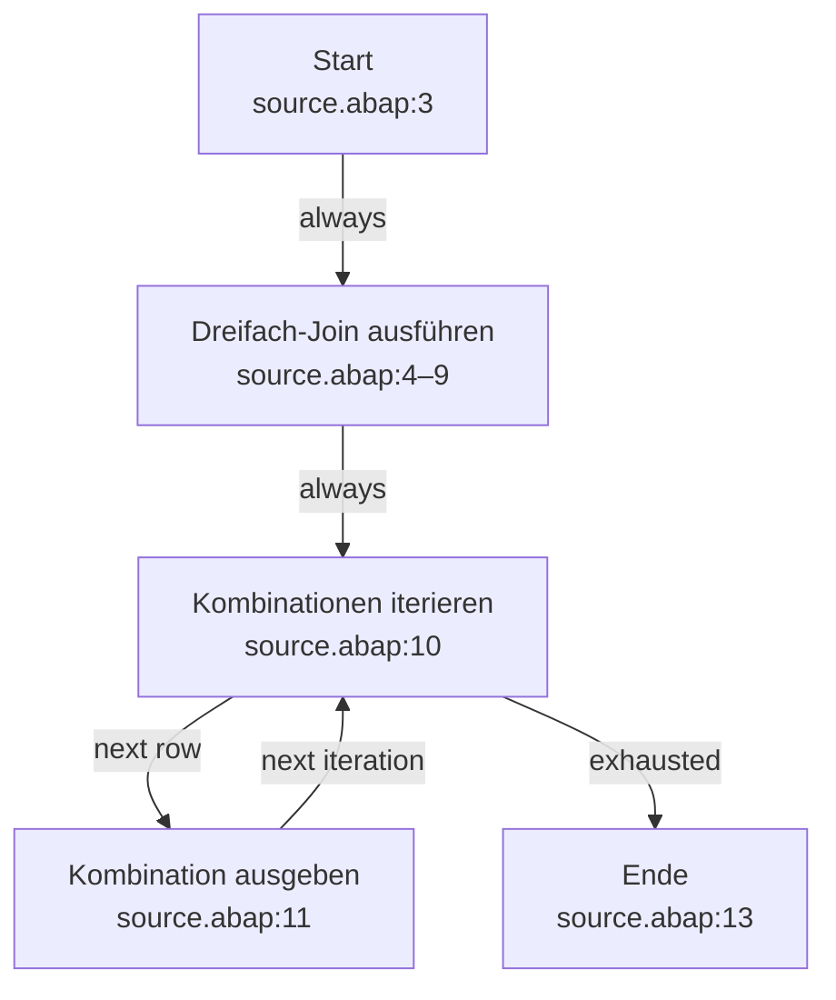
```mermaid
flowchart TD
    s["Start\nsource.abap:3"]
    j["Dreifach-Join ausführen\nsource.abap:4–9"]
    l["Kombinationen iterieren\nsource.abap:10"]
    o["Kombination ausgeben\nsource.abap:11"]
    e["Ende\nsource.abap:13"]
    s -->|"always"| j
    j -->|"always"| l
    l -->|"next row"| o
    o -->|"next iteration"| l
    l -->|"exhausted"| e
```

| Knoten | Typ | Quelle | Bedeutung |
|---|---|---|---|
| s | start | source.abap:3 | Start |
| j | read | source.abap:4–9 | Dreifach-Join ausführen |
| l | loop | source.abap:10 | Kombinationen iterieren |
| o | output | source.abap:11 | Kombination ausgeben |
| e | end | source.abap:13 | Ende |

### Konkrete Handarbeit und Schätzgrenze

- **CC-007-W01**: Company-mal-Sales-Area-Kardinalität gegen 1x2x3-Testdaten bestätigen
- **CC-007-W02**: Alle drei Nachfolger und ihre Beziehungen/Felder releasebezogen prüfen
- **CC-007-W03**: Nicht versehentlich DISTINCT oder neue Join-Bedingung einführen

Autorenannahme, nicht kalibriert: **4 / 10 / 20 Stunden** (optimistisch / wahrscheinlich / pessimistisch). Iststunden: **nicht gemessen**. Arbeitsumfang und Ausschlüsse siehe Kontext/README; diese Werte sind weder TCO-Ground-Truth noch belastbare Obergrenzen bei fehlenden Abhängigkeiten.

### Zusätzliche fachliche Prüfeingaben

```json
{
  "kind": "relational_fixture_only",
  "customer_rows": 1,
  "company_rows_same_customer": 2,
  "sales_rows_same_customer": 3,
  "expected_join_rows": 6,
  "note": "No actual SAP table read; no DISTINCT and all projected keys differ."
}
```

### Prüferfragen

- Company-mal-Sales-Area-Kardinalität gegen 1x2x3-Testdaten bestätigen
- Alle drei Nachfolger und ihre Beziehungen/Felder releasebezogen prüfen
- Nicht versehentlich DISTINCT oder neue Join-Bedingung einführen
- Tragen alle Anker den vollständigen Fachsatz einschließlich Bedingungen und Negativpfad?
- Welche Aussage ist nur eine Fixture-Annahme und darf nicht auf den echten Kunden übertragen werden?

**Freigabe:** externe SAP-Architekturprüfung ausstehend; Quelle, Kontext, Oracle und Regelversion müssen gemeinsam gezeichnet werden.

---

## CC-008 — LEFT JOIN: WHERE-Filter entfernt Nulltreffer

**Konstruktklassen:** K04, K01 · **Classic:** C · **Cloud-API:** not_usable  
**Scope:** `complete_for_declared_slice` · **Status:** nicht unabhängig freigegeben.

Quellenhash: `7a5d3ec80446dc61de1a986e0392817f52506fc34ab8f9487e461c9c8ab8c2c4`  
Kontexthash: `81672f2b6c4dde069e4c652c080e59d2f2781e0c28dd7e4a81768599b8b0b46f`

**Profilannahmen:** For this synthetic profile these SAP tables are stipulated internal and not classicAPI/noAPI. Release state and typed successors are observed; absence from the complete classic catalogue still requires independent verification.

### Quelltext `source.abap` — Zeilen zählen ab1

```abap
REPORT zcc_ref_008.
PARAMETERS p_bukrs TYPE c LENGTH 4 DEFAULT '1000'.
START-OF-SELECTION.
  SELECT a~kunnr, b~bukrs, c~vkorg, c~vtweg, c~spart
    FROM kna1 AS a
    LEFT OUTER JOIN knb1 AS b ON b~kunnr = a~kunnr
    LEFT OUTER JOIN knvv AS c ON c~kunnr = a~kunnr
    WHERE b~bukrs = @p_bukrs
    INTO TABLE @DATA(lt_rows).
  LOOP AT lt_rows INTO DATA(ls_row).
    WRITE: / ls_row-kunnr, ls_row-bukrs, ls_row-vkorg.
  ENDLOOP.
```

```text
001  REPORT zcc_ref_008.
002  PARAMETERS p_bukrs TYPE c LENGTH 4 DEFAULT '1000'.
003  START-OF-SELECTION.
004    SELECT a~kunnr, b~bukrs, c~vkorg, c~vtweg, c~spart
005      FROM kna1 AS a
006      LEFT OUTER JOIN knb1 AS b ON b~kunnr = a~kunnr
007      LEFT OUTER JOIN knvv AS c ON c~kunnr = a~kunnr
008      WHERE b~bukrs = @p_bukrs
009      INTO TABLE @DATA(lt_rows).
010    LOOP AT lt_rows INTO DATA(ls_row).
011      WRITE: / ls_row-kunnr, ls_row-bukrs, ls_row-vkorg.
012    ENDLOOP.
```

### Sollbefunde

| ID | Regelversion | Exakter Anker | Schwere* | Sollaussage | Quellen |
|---|---|---|---|---|---|
| CC-008-F01 | R01@1.0.0 | source.abap:5 | medium | KNA1 lesen. | SAP-LEVEL, SAP-PCE22 |
| CC-008-F02 | R01@1.0.0 | source.abap:6 | medium | KNB1 lesen. | SAP-LEVEL, SAP-PCE22 |
| CC-008-F03 | R01@1.0.0 | source.abap:7 | medium | KNVV lesen. | SAP-LEVEL, SAP-PCE22 |
| CC-008-F04 | R08@1.0.0 | source.abap:8 | medium | WHERE-Bedingung auf rechter Tabelle verwirft NULL-Company-Treffer. Verlagerung nach ON verändert Semantik. | SAP-SQL |

\* Der Schweregrad ist eine Korpuspriorität, keine behauptete SAP-ATC-Prioritätsnummer.

### SAP-/Repository-Objekte und Nachfolger

**KNA1** · Eigentümer `SAP` · Verwendung `join_read`  
Anker: source.abap:5. Identität: `{"tadirObject": "TABL", "tadirObjName": "KNA1", "objectType": "TABL", "objectKey": "KNA1"}`.  
Cloud-Rohzustand: `notToBeReleased`; Classic-Rohzustand: `not_asserted`. Nachfolgerstatus: `listed`.

```json
[
  {
    "tadirObject": "DDLS",
    "tadirObjName": "I_CUSTOMER",
    "objectType": "CDS_STOB",
    "objectKey": "I_CUSTOMER"
  }
]
```

Quelle: SAP-PCE22; 136428–136446.

**KNB1** · Eigentümer `SAP` · Verwendung `join_read`  
Anker: source.abap:6. Identität: `{"tadirObject": "TABL", "tadirObjName": "KNB1", "objectType": "TABL", "objectKey": "KNB1"}`.  
Cloud-Rohzustand: `notToBeReleased`; Classic-Rohzustand: `not_asserted`. Nachfolgerstatus: `listed`.

```json
[
  {
    "tadirObject": "DDLS",
    "tadirObjName": "I_CUSTOMERCOMPANY",
    "objectType": "CDS_STOB",
    "objectKey": "I_CUSTOMERCOMPANY"
  }
]
```

Quelle: SAP-PCE22; 136448–136465.

**KNVV** · Eigentümer `SAP` · Verwendung `join_read`  
Anker: source.abap:7. Identität: `{"tadirObject": "TABL", "tadirObjName": "KNVV", "objectType": "TABL", "objectKey": "KNVV"}`.  
Cloud-Rohzustand: `notToBeReleased`; Classic-Rohzustand: `not_asserted`. Nachfolgerstatus: `listed`.

```json
[
  {
    "tadirObject": "DDLS",
    "tadirObjName": "I_CUSTOMERSALESAREA",
    "objectType": "CDS_STOB",
    "objectKey": "I_CUSTOMERSALESAREA"
  }
]
```

Quelle: SAP-PCE22; 136562–136578.

### Fachliche Ground-Truth-Kandidaten

**CC-008-B01** — Kunden ohne passenden Company-Satz im gewählten Buchungskreis bleiben nicht im Ergebnis.  
Anker: source.abap:8, source.abap:5–8. Kontext: /business_scope, /execution_assumptions.

**CC-008-B02** — Ein fehlender Sales-Area-Satz allein entfernt einen sonst passenden Kunden nicht.  
Anker: source.abap:7, source.abap:5–8. Kontext: /business_scope, /execution_assumptions.

### Erwartetes Prozessskelett

Dies ist der normalisierte prozedurale As-is-Scope, kein importgeprüftes BPMN und keine tatsächliche Ausführung. Die Kantenbedingungen sind Teil des Sollvertrags.

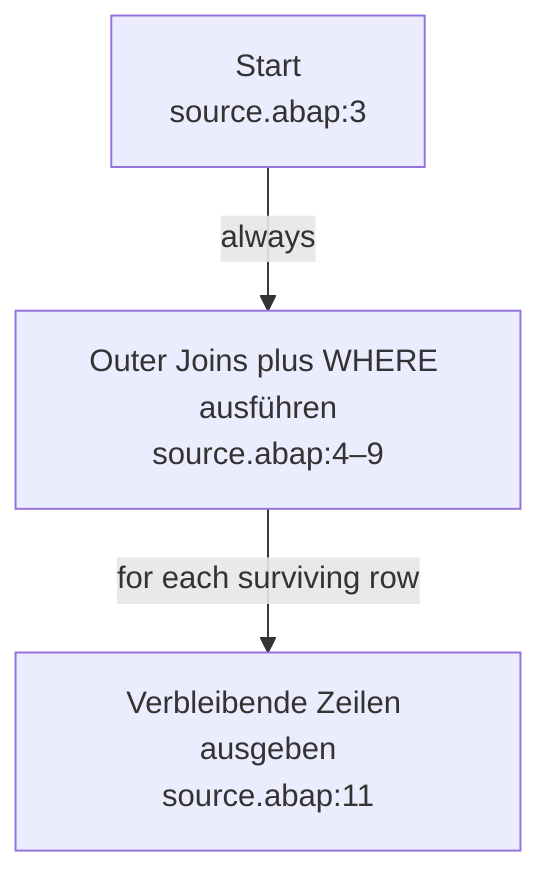
```mermaid
flowchart TD
    s["Start\nsource.abap:3"]
    j["Outer Joins plus WHERE ausführen\nsource.abap:4–9"]
    o["Verbleibende Zeilen ausgeben\nsource.abap:11"]
    s -->|"always"| j
    j -->|"for each surviving row"| o
```

| Knoten | Typ | Quelle | Bedeutung |
|---|---|---|---|
| s | start | source.abap:3 | Start |
| j | read | source.abap:4–9 | Outer Joins plus WHERE ausführen |
| o | output | source.abap:11 | Verbleibende Zeilen ausgeben |

### Konkrete Handarbeit und Schätzgrenze

- **CC-008-W01**: NULL-Semantik mit fehlendem Company- und fehlendem Sales-Satz verproben
- **CC-008-W02**: WHERE-nach-ON-Verschiebung ausdrücklich als Verhaltensänderung erkennen
- **CC-008-W03**: Ziel-CDS-Join mit identischer Ergebnismenge fachlich prüfen

Autorenannahme, nicht kalibriert: **4 / 10 / 20 Stunden** (optimistisch / wahrscheinlich / pessimistisch). Iststunden: **nicht gemessen**. Arbeitsumfang und Ausschlüsse siehe Kontext/README; diese Werte sind weder TCO-Ground-Truth noch belastbare Obergrenzen bei fehlenden Abhängigkeiten.

### Zusätzliche fachliche Prüfeingaben

```json
{
  "kind": "relational_fixture_only",
  "vectors": [
    {
      "customer": true,
      "company_match": false,
      "sales_match": false,
      "expected_rows": 0
    },
    {
      "customer": true,
      "company_match": true,
      "sales_match": false,
      "expected_rows": 1
    }
  ]
}
```

### Prüferfragen

- NULL-Semantik mit fehlendem Company- und fehlendem Sales-Satz verproben
- WHERE-nach-ON-Verschiebung ausdrücklich als Verhaltensänderung erkennen
- Ziel-CDS-Join mit identischer Ergebnismenge fachlich prüfen
- Tragen alle Anker den vollständigen Fachsatz einschließlich Bedingungen und Negativpfad?
- Welche Aussage ist nur eine Fixture-Annahme und darf nicht auf den echten Kunden übertragen werden?

**Freigabe:** externe SAP-Architekturprüfung ausstehend; Quelle, Kontext, Oracle und Regelversion müssen gemeinsam gezeichnet werden.

---

## CC-009 — Expliziter kundeneigener BAdI mit festgehaltener Aktivierung

**Konstruktklassen:** K05 · **Classic:** B · **Cloud-API:** unknown  
**Scope:** `complete_for_declared_slice` · **Status:** nicht unabhängig freigegeben.

Quellenhash: `cbff55adc6761e7a6529c3dda43a1b2373ac3122e4dd0ef6ce6264ff13a2c28a`  
Kontexthash: `bca84726be6387f76d0842f208a1155829afd89b2ff963e661b83a7bbcc0d13e`

### Quelltext `implementation.abap` — Zeilen zählen ab1

```abap
CLASS zcl_cc_route_impl DEFINITION PUBLIC FINAL CREATE PUBLIC.
  PUBLIC SECTION.
    INTERFACES zif_cc_route.
ENDCLASS.
CLASS zcl_cc_route_impl IMPLEMENTATION.
  METHOD zif_cc_route~determine.
    IF iv_amount > 10000.
      cv_route = 'MANAGER_ROUTE'.
    ELSE.
      cv_route = 'AUTO_ROUTE'.
    ENDIF.
  ENDMETHOD.
ENDCLASS.
```

```text
001  CLASS zcl_cc_route_impl DEFINITION PUBLIC FINAL CREATE PUBLIC.
002    PUBLIC SECTION.
003      INTERFACES zif_cc_route.
004  ENDCLASS.
005  CLASS zcl_cc_route_impl IMPLEMENTATION.
006    METHOD zif_cc_route~determine.
007      IF iv_amount > 10000.
008        cv_route = 'MANAGER_ROUTE'.
009      ELSE.
010        cv_route = 'AUTO_ROUTE'.
011      ENDIF.
012    ENDMETHOD.
013  ENDCLASS.
```

### Quelltext `interface.abap` — Zeilen zählen ab1

```abap
INTERFACE zif_cc_route PUBLIC.
  INTERFACES if_badi_interface.
  METHODS determine IMPORTING iv_amount TYPE p
                    CHANGING cv_route TYPE string.
ENDINTERFACE.
```

```text
001  INTERFACE zif_cc_route PUBLIC.
002    INTERFACES if_badi_interface.
003    METHODS determine IMPORTING iv_amount TYPE p
004                      CHANGING cv_route TYPE string.
005  ENDINTERFACE.
```

### Quelltext `source.abap` — Zeilen zählen ab1

```abap
REPORT zcc_ref_009.
PARAMETERS p_amount TYPE p LENGTH 9 DECIMALS 2 DEFAULT '15000'.
DATA lo_badi TYPE REF TO zbadi_cc_route.
DATA lv_route TYPE string.
START-OF-SELECTION.
  GET BADI lo_badi.
  CALL BADI lo_badi->determine
    EXPORTING iv_amount = p_amount
    CHANGING cv_route = lv_route.
  WRITE / lv_route.
```

```text
001  REPORT zcc_ref_009.
002  PARAMETERS p_amount TYPE p LENGTH 9 DECIMALS 2 DEFAULT '15000'.
003  DATA lo_badi TYPE REF TO zbadi_cc_route.
004  DATA lv_route TYPE string.
005  START-OF-SELECTION.
006    GET BADI lo_badi.
007    CALL BADI lo_badi->determine
008      EXPORTING iv_amount = p_amount
009      CHANGING cv_route = lv_route.
010    WRITE / lv_route.
```

### Sollbefunde

| ID | Regelversion | Exakter Anker | Schwere* | Sollaussage | Quellen |
|---|---|---|---|---|---|
| CC-009-F01 | R24@1.0.0 | source.abap:6 | info | BAdI-Auswahl aus mitgelieferter synthetischer SE18/SE19-Konfiguration nachvollziehen; keine SAP-Standardabdeckung behaupten. | SAP-LEVEL, SAP-BADI |

\* Der Schweregrad ist eine Korpuspriorität, keine behauptete SAP-ATC-Prioritätsnummer.

### SAP-/Repository-Objekte und Nachfolger

**ZBADI_CC_ROUTE** · Eigentümer `customer` · Verwendung `badi_definition`  
Anker: source.abap:3. Identität: `{"tadirObject": "ENHS", "tadirObjName": "ZCC_ROUTE_SPOT", "objectType": "BADI_DEF", "objectKey": "ZBADI_CC_ROUTE"}`.  
Cloud-Rohzustand: `not_applicable`; Classic-Rohzustand: `not_applicable`. Nachfolgerstatus: `not_applicable_customer_or_partner`.

Nachfolgerliste: `[]` **mit obiger Statusbegründung**, nicht pauschal „kein Nachfolger existiert“.

**IF_BADI_INTERFACE** · Eigentümer `SAP` · Verwendung `interface_inclusion`  
Anker: interface.abap:2. Identität: `{"tadirObject": "INTF", "tadirObjName": "IF_BADI_INTERFACE", "objectType": "INTF", "objectKey": "IF_BADI_INTERFACE"}`.  
Cloud-Rohzustand: `released`; Classic-Rohzustand: `classicAPI`. Nachfolgerstatus: `not_listed_in_observed_record`.

Nachfolgerliste: `[]` **mit obiger Statusbegründung**, nicht pauschal „kein Nachfolger existiert“.

Quelle: SAP-PCE22, SAP-CLASSIC; release 82243–82252; classic 91121–91129.

**ZIF_CC_ROUTE** · Eigentümer `customer` · Verwendung `implementation_dependency`  
Anker: implementation.abap:3. Identität: `{"tadirObject": "INTF", "tadirObjName": "ZIF_CC_ROUTE", "objectType": "INTF", "objectKey": "ZIF_CC_ROUTE"}`.  
Cloud-Rohzustand: `not_applicable`; Classic-Rohzustand: `not_applicable`. Nachfolgerstatus: `not_applicable_customer_or_partner`.

Nachfolgerliste: `[]` **mit obiger Statusbegründung**, nicht pauschal „kein Nachfolger existiert“.

**ZCL_CC_ROUTE_IMPL** · Eigentümer `customer` · Verwendung `supplied_implementation`  
Anker: implementation.abap:1. Identität: `{"tadirObject": "CLAS", "tadirObjName": "ZCL_CC_ROUTE_IMPL", "objectType": "CLAS", "objectKey": "ZCL_CC_ROUTE_IMPL"}`.  
Cloud-Rohzustand: `not_applicable`; Classic-Rohzustand: `not_applicable`. Nachfolgerstatus: `not_applicable_customer_or_partner`.

Nachfolgerliste: `[]` **mit obiger Statusbegründung**, nicht pauschal „kein Nachfolger existiert“.

### Fachliche Ground-Truth-Kandidaten

**CC-009-B01** — Die konfigurierte BAdI-Implementierung wird angefordert.  
Anker: source.abap:6. Kontext: /business_scope, /execution_assumptions, /dependencies.

**CC-009-B02** — Der Betrag wird der Methode determine übergeben und ein Routentext übernommen; dieser Aufruf ist nicht selbst ein menschlicher Freigabeprozess.  
Anker: source.abap:7. Kontext: /business_scope, /execution_assumptions, /dependencies.

**CC-009-B03** — Die im Fixture einzige aktive Implementierung setzt für Beträge größer10000 MANAGER_ROUTE, ansonsten AUTO_ROUTE.  
Anker: implementation.abap:7, implementation.abap:8, implementation.abap:10. Kontext: /business_scope, /execution_assumptions, /dependencies.

### Erwartetes Prozessskelett

Dies ist der normalisierte prozedurale As-is-Scope, kein importgeprüftes BPMN und keine tatsächliche Ausführung. Die Kantenbedingungen sind Teil des Sollvertrags.

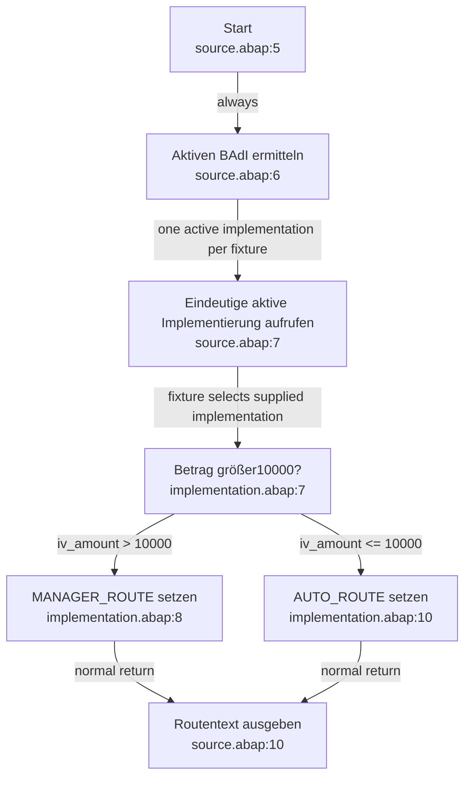
```mermaid
flowchart TD
    s["Start\nsource.abap:5"]
    b["Aktiven BAdI ermitteln\nsource.abap:6"]
    c["Eindeutige aktive Implementierung aufrufen\nsource.abap:7"]
    o["Routentext ausgeben\nsource.abap:10"]
    g["Betrag größer10000?\nimplementation.abap:7"]
    m["MANAGER_ROUTE setzen\nimplementation.abap:8"]
    a["AUTO_ROUTE setzen\nimplementation.abap:10"]
    s -->|"always"| b
    b -->|"one active implementation per fixture"| c
    c -->|"fixture selects supplied implementation"| g
    g -->|"iv_amount > 10000"| m
    g -->|"iv_amount <= 10000"| a
    m -->|"normal return"| o
    a -->|"normal return"| o
```

| Knoten | Typ | Quelle | Bedeutung |
|---|---|---|---|
| s | start | source.abap:5 | Start |
| b | call | source.abap:6 | Aktiven BAdI ermitteln |
| c | call | source.abap:7 | Eindeutige aktive Implementierung aufrufen |
| o | output | source.abap:10 | Routentext ausgeben |
| g | gateway | implementation.abap:7 | Betrag größer10000? |
| m | action | implementation.abap:8 | MANAGER_ROUTE setzen |
| a | action | implementation.abap:10 | AUTO_ROUTE setzen |

### Konkrete Handarbeit und Schätzgrenze

- **CC-009-W01**: SE18/SE19-Single-use-Aktivierung und Schnittstellenobjekte einrichten
- **CC-009-W02**: Main- und Implementierungsquellen zu einer durchgehenden Spur verbinden
- **CC-009-W03**: Grenzwerte und deaktivierte/fehlende Implementierung gesondert prüfen

Autorenannahme, nicht kalibriert: **3 / 6 / 12 Stunden** (optimistisch / wahrscheinlich / pessimistisch). Iststunden: **nicht gemessen**. Arbeitsumfang und Ausschlüsse siehe Kontext/README; diese Werte sind weder TCO-Ground-Truth noch belastbare Obergrenzen bei fehlenden Abhängigkeiten.

### Prüferfragen

- SE18/SE19-Single-use-Aktivierung und Schnittstellenobjekte einrichten
- Main- und Implementierungsquellen zu einer durchgehenden Spur verbinden
- Grenzwerte und deaktivierte/fehlende Implementierung gesondert prüfen
- Tragen alle Anker den vollständigen Fachsatz einschließlich Bedingungen und Negativpfad?
- Welche Aussage ist nur eine Fixture-Annahme und darf nicht auf den echten Kunden übertragen werden?

**Besonderheit:** Vollständiger BAdI-Mikrofall inklusive Schnittstelle und Implementierung; SE18/SE19-Konfiguration bleibt synthetische Einrichtungsvoraussetzung. Kein realer SAP-Standard-BAdI behauptet.

**Freigabe:** externe SAP-Architekturprüfung ausstehend; Quelle, Kontext, Oracle und Regelversion müssen gemeinsam gezeichnet werden.

---

## CC-010 — Implizites Enhancement: Kontext bestimmt D, nicht Z-Name

**Konstruktklassen:** K05 · **Classic:** D · **Cloud-API:** not_usable  
**Scope:** `complete_for_declared_slice` · **Status:** nicht unabhängig freigegeben.

Quellenhash: `f0773dc4956a95a6ea863694f1ccac65e28d3d1f1bbdffd7d06fa1f7c084591f`  
Kontexthash: `f19050ab638f696e8c0796eafe2f7898f74b73e87364c04de7f9e4b61714a8e8`

**Profilannahmen:** D depends on stipulated implicit SAP-host insertion. Same standalone Z-report without this metadata is B, not D.

### Quelltext `source.abap` — Zeilen zählen ab1

```abap
REPORT zcc_ref_010.
DATA gv_review TYPE c LENGTH 1.
PARAMETERS p_amount TYPE p LENGTH 9 DECIMALS 2 DEFAULT '25000'.
START-OF-SELECTION.
  PERFORM copied_host_logic.
  WRITE / gv_review.
FORM copied_host_logic.
  gv_review = 'N'.
  " The inserted fragment is evaluated with host metadata in context.json.
  IF p_amount > 20000.
    gv_review = 'Y'.
  ENDIF.
ENDFORM.
```

```text
001  REPORT zcc_ref_010.
002  DATA gv_review TYPE c LENGTH 1.
003  PARAMETERS p_amount TYPE p LENGTH 9 DECIMALS 2 DEFAULT '25000'.
004  START-OF-SELECTION.
005    PERFORM copied_host_logic.
006    WRITE / gv_review.
007  FORM copied_host_logic.
008    gv_review = 'N'.
009    " The inserted fragment is evaluated with host metadata in context.json.
010    IF p_amount > 20000.
011      gv_review = 'Y'.
012    ENDIF.
013  ENDFORM.
```

### Sollbefunde

| ID | Regelversion | Exakter Anker | Schwere* | Sollaussage | Quellen |
|---|---|---|---|---|---|
| CC-010-F01 | R10@1.0.0 | source.abap:10–11 | high | Dieser Ausschnitt ist laut explizitem Host-Fixture ein implizites Enhancement in einem SAP-Host. D gilt durch Kontext, nicht durch IF oder Z-Report. | SAP-LEVEL |

\* Der Schweregrad ist eine Korpuspriorität, keine behauptete SAP-ATC-Prioritätsnummer.

### SAP-/Repository-Objekte und Nachfolger

Keine explizite externe SAP-Repository-Identität im gelieferten Scope. Dynamische Ziele oder Kernelroutinen können dennoch unbekannt beziehungsweise keine TADIR-Objekte sein; das ist kein automatisches „keine Abhängigkeit“. Kommentare und Literale erzeugen keine Phantom-Objekte.

### Fachliche Ground-Truth-Kandidaten

**CC-010-B01** — Zu Beginn des Host-Ausschnitts wird die Review-Markierung N gesetzt.  
Anker: source.abap:8. Kontext: /business_scope, /execution_assumptions, /host_metadata.

**CC-010-B02** — Ein Betrag größer als 20000 setzt die Review-Markierung auf Y; Gleichheit nicht.  
Anker: source.abap:10, source.abap:11. Kontext: /business_scope, /execution_assumptions, /host_metadata.

### Erwartetes Prozessskelett

Dies ist der normalisierte prozedurale As-is-Scope, kein importgeprüftes BPMN und keine tatsächliche Ausführung. Die Kantenbedingungen sind Teil des Sollvertrags.

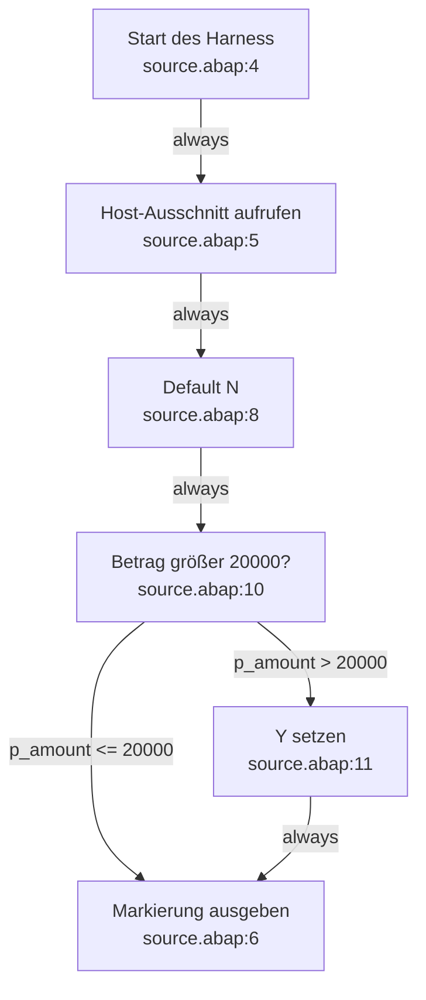
```mermaid
flowchart TD
    s["Start des Harness\nsource.abap:4"]
    h["Host-Ausschnitt aufrufen\nsource.abap:5"]
    d["Default N\nsource.abap:8"]
    g["Betrag größer 20000?\nsource.abap:10"]
    y["Y setzen\nsource.abap:11"]
    o["Markierung ausgeben\nsource.abap:6"]
    s -->|"always"| h
    h -->|"always"| d
    d -->|"always"| g
    g -->|"p_amount > 20000"| y
    g -->|"p_amount <= 20000"| o
    y -->|"always"| o
```

| Knoten | Typ | Quelle | Bedeutung |
|---|---|---|---|
| s | start | source.abap:4 | Start des Harness |
| h | call | source.abap:5 | Host-Ausschnitt aufrufen |
| d | action | source.abap:8 | Default N |
| g | gateway | source.abap:10 | Betrag größer 20000? |
| y | action | source.abap:11 | Y setzen |
| o | output | source.abap:6 | Markierung ausgeben |

### Konkrete Handarbeit und Schätzgrenze

- **CC-010-W01**: Implizite SAP-Host-Einfügung anhand tatsächlichem ENHO/Hostexport bestätigen
- **CC-010-W02**: Ohne Hostmetadata keinen D-Schluss aus isoliertem IF ziehen
- **CC-010-W03**: Geeigneten expliziten Erweiterungspunkt im echten Zielprozess untersuchen

Autorenannahme, nicht kalibriert: **4 / 12 / 24 Stunden** (optimistisch / wahrscheinlich / pessimistisch). Iststunden: **nicht gemessen**. Arbeitsumfang und Ausschlüsse siehe Kontext/README; diese Werte sind weder TCO-Ground-Truth noch belastbare Obergrenzen bei fehlenden Abhängigkeiten.

### Prüferfragen

- Implizite SAP-Host-Einfügung anhand tatsächlichem ENHO/Hostexport bestätigen
- Ohne Hostmetadata keinen D-Schluss aus isoliertem IF ziehen
- Geeigneten expliziten Erweiterungspunkt im echten Zielprozess untersuchen
- Tragen alle Anker den vollständigen Fachsatz einschließlich Bedingungen und Negativpfad?
- Welche Aussage ist nur eine Fixture-Annahme und darf nicht auf den echten Kunden übertragen werden?

**Besonderheit:** Kein erfundener konkreter SAP-Hostname. Dieser Kontexttest verlangt beides: Meldung mit Host-Fixture und keine D-Meldung ohne Host-Fixture.

**Freigabe:** externe SAP-Architekturprüfung ausstehend; Quelle, Kontext, Oracle und Regelversion müssen gemeinsam gezeichnet werden.

---

## CC-011 — Dynamischer FM: Syntax dynamisch, Datenfluss auflösbar

**Konstruktklassen:** K06 · **Classic:** B · **Cloud-API:** not_usable  
**Scope:** `complete_for_declared_slice` · **Status:** nicht unabhängig freigegeben.

Quellenhash: `9e47e55bb554d21dfd1cb9361840f167d90e53a8c7da9ea18ef54cc5f531b6eb`  
Kontexthash: `d0990c61794ef987745561ec5375bb03bf582507bac90e8d1ae2db135f9bf180`

### Quelltext `source.abap` — Zeilen zählen ab1

```abap
REPORT zcc_ref_011.
PARAMETERS p_id TYPE c LENGTH 10 DEFAULT '42'.
DATA lv_function TYPE c LENGTH 30.
DATA lv_output TYPE c LENGTH 10.
START-OF-SELECTION.
  lv_function = 'CONVERSION_EXIT_ALPHA_INPUT'.
  CALL FUNCTION lv_function
    EXPORTING input = p_id
    IMPORTING output = lv_output.
  WRITE / lv_output.
```

```text
001  REPORT zcc_ref_011.
002  PARAMETERS p_id TYPE c LENGTH 10 DEFAULT '42'.
003  DATA lv_function TYPE c LENGTH 30.
004  DATA lv_output TYPE c LENGTH 10.
005  START-OF-SELECTION.
006    lv_function = 'CONVERSION_EXIT_ALPHA_INPUT'.
007    CALL FUNCTION lv_function
008      EXPORTING input = p_id
009      IMPORTING output = lv_output.
010    WRITE / lv_output.
```

### Sollbefunde

| ID | Regelversion | Exakter Anker | Schwere* | Sollaussage | Quellen |
|---|---|---|---|---|---|
| CC-011-F01 | R07@1.0.0 | source.abap:7 | info | Variablenaufruf ist syntaktisch dynamisch; das einzige vorherige Assignment begrenzt das Ziel auf ALPHA_INPUT. | SAP-CALL, SAP-FLOW |

\* Der Schweregrad ist eine Korpuspriorität, keine behauptete SAP-ATC-Prioritätsnummer.

**Explizit unzulässige Schlussfolgerungen:**

- `source.abap:7` — Nicht unbekanntes Ziel behaupten; syntaktisch trotzdem nicht CONSTANTS-static.

### SAP-/Repository-Objekte und Nachfolger

**CONVERSION_EXIT_ALPHA_INPUT** · Eigentümer `SAP` · Verwendung `dynamic_call_singleton_proven_by_dataflow`  
Anker: source.abap:6, source.abap:7. Identität: `{"tadirObject": "FUGR", "tadirObjName": "ALFA", "objectType": "FUNC", "objectKey": "CONVERSION_EXIT_ALPHA_INPUT"}`.  
Cloud-Rohzustand: `notToBeReleasedStable`; Classic-Rohzustand: `classicAPI`. Nachfolgerstatus: `not_listed_in_observed_record`.

Nachfolgerliste: `[]` **mit obiger Statusbegründung**, nicht pauschal „kein Nachfolger existiert“.

Quelle: SAP-PCE22, SAP-CLASSIC; release INPUT 141169–141178; classic INPUT 31473–31481 / OUTPUT 31482–31490.

### Fachliche Ground-Truth-Kandidaten

**CC-011-B01** — Im gelieferten geradlinigen Code wird genau der zuvor zugewiesene Funktionsbaustein aufgerufen.  
Anker: source.abap:6, source.abap:7. Kontext: /business_scope, /execution_assumptions.

**CC-011-B02** — Das vom Funktionsbaustein zurückgegebene Feld wird ausgegeben.  
Anker: source.abap:10. Kontext: /business_scope, /execution_assumptions.

### Erwartetes Prozessskelett

Dies ist der normalisierte prozedurale As-is-Scope, kein importgeprüftes BPMN und keine tatsächliche Ausführung. Die Kantenbedingungen sind Teil des Sollvertrags.

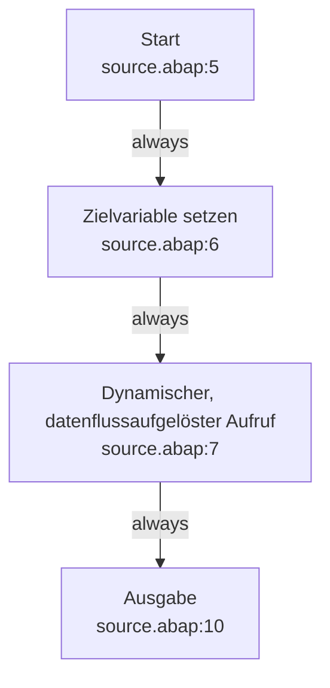
```mermaid
flowchart TD
    s["Start\nsource.abap:5"]
    a["Zielvariable setzen\nsource.abap:6"]
    c["Dynamischer, datenflussaufgelöster Aufruf\nsource.abap:7"]
    o["Ausgabe\nsource.abap:10"]
    s -->|"always"| a
    a -->|"always"| c
    c -->|"always"| o
```

| Knoten | Typ | Quelle | Bedeutung |
|---|---|---|---|
| s | start | source.abap:5 | Start |
| a | action | source.abap:6 | Zielvariable setzen |
| c | opaque_call | source.abap:7 | Dynamischer, datenflussaufgelöster Aufruf |
| o | output | source.abap:10 | Ausgabe |

### Konkrete Handarbeit und Schätzgrenze

- **CC-011-W01**: Einzige Zuweisung und fehlende zwischenliegende Seiteneffekte prüfen
- **CC-011-W02**: Dynamische Syntax und aufgelöste Singleton-Zielmenge getrennt dokumentieren
- **CC-011-W03**: Zusätzliche alternative Zuweisung als verpflichtende Gegenprobe prüfen

Autorenannahme, nicht kalibriert: **1 / 3 / 5 Stunden** (optimistisch / wahrscheinlich / pessimistisch). Iststunden: **nicht gemessen**. Arbeitsumfang und Ausschlüsse siehe Kontext/README; diese Werte sind weder TCO-Ground-Truth noch belastbare Obergrenzen bei fehlenden Abhängigkeiten.

### Prüferfragen

- Einzige Zuweisung und fehlende zwischenliegende Seiteneffekte prüfen
- Dynamische Syntax und aufgelöste Singleton-Zielmenge getrennt dokumentieren
- Zusätzliche alternative Zuweisung als verpflichtende Gegenprobe prüfen
- Tragen alle Anker den vollständigen Fachsatz einschließlich Bedingungen und Negativpfad?
- Welche Aussage ist nur eine Fixture-Annahme und darf nicht auf den echten Kunden übertragen werden?

**Freigabe:** externe SAP-Architekturprüfung ausstehend; Quelle, Kontext, Oracle und Regelversion müssen gemeinsam gezeichnet werden.

---

## CC-012 — Externer dynamischer Aufruf und PERFORM: bewusst unaufgelöst

**Konstruktklassen:** K06, K11 · **Classic:** Unknown · **Cloud-API:** unknown  
**Scope:** `partial_missing_runtime_targets` · **Status:** nicht unabhängig freigegeben.

Quellenhash: `56e238efaaf2b60fdd73976fda995ae616ab01c80c706546b79a5fe857ef245e`  
Kontexthash: `0ac6ce19be93220565d2b0c045b0cafd2f912c6f875504145229ea123cede8ee`

### Quelltext `source.abap` — Zeilen zählen ab1

```abap
REPORT zcc_ref_012.
PARAMETERS p_func TYPE c LENGTH 30.
PARAMETERS p_prog TYPE c LENGTH 40.
PARAMETERS p_form TYPE c LENGTH 30.
DATA lv_input TYPE c LENGTH 10 VALUE '42'.
DATA lv_output TYPE c LENGTH 10.
START-OF-SELECTION.
  IF p_func IS NOT INITIAL.
    CALL FUNCTION p_func
      EXPORTING input = lv_input
      IMPORTING output = lv_output.
  ENDIF.
  IF p_prog IS NOT INITIAL AND p_form IS NOT INITIAL.
    PERFORM (p_form) IN PROGRAM (p_prog) IF FOUND.
  ENDIF.
  WRITE / 'DISPATCH_RETURNED'.
```

```text
001  REPORT zcc_ref_012.
002  PARAMETERS p_func TYPE c LENGTH 30.
003  PARAMETERS p_prog TYPE c LENGTH 40.
004  PARAMETERS p_form TYPE c LENGTH 30.
005  DATA lv_input TYPE c LENGTH 10 VALUE '42'.
006  DATA lv_output TYPE c LENGTH 10.
007  START-OF-SELECTION.
008    IF p_func IS NOT INITIAL.
009      CALL FUNCTION p_func
010        EXPORTING input = lv_input
011        IMPORTING output = lv_output.
012    ENDIF.
013    IF p_prog IS NOT INITIAL AND p_form IS NOT INITIAL.
014      PERFORM (p_form) IN PROGRAM (p_prog) IF FOUND.
015    ENDIF.
016    WRITE / 'DISPATCH_RETURNED'.
```

### Sollbefunde

| ID | Regelversion | Exakter Anker | Schwere* | Sollaussage | Quellen |
|---|---|---|---|---|---|
| CC-012-F01 | R07@1.0.0 | source.abap:9 | high | Unvalidierter externer Funktionsname; Ziel und Interfaces unbekannt, Laufzeitfehler möglich. | SAP-CALL, SAP-FLOW |
| CC-012-F02 | R07@1.0.0 | source.abap:14 | high | Externe Programm-/FORM-Auswahl unbekannt. IF FOUND bedeutet nicht, dass das Ziel ausgeführt wurde. | SAP-CALL, SAP-FLOW |

\* Der Schweregrad ist eine Korpuspriorität, keine behauptete SAP-ATC-Prioritätsnummer.

### SAP-/Repository-Objekte und Nachfolger

Keine explizite externe SAP-Repository-Identität im gelieferten Scope. Dynamische Ziele oder Kernelroutinen können dennoch unbekannt beziehungsweise keine TADIR-Objekte sein; das ist kein automatisches „keine Abhängigkeit“. Kommentare und Literale erzeugen keine Phantom-Objekte.

### Fachliche Ground-Truth-Kandidaten

**CC-012-B01** — Ein Funktionsbaustein wird nur bei nicht leerem Namen aufgerufen.  
Anker: source.abap:8, source.abap:8–11. Kontext: /business_scope, /execution_assumptions.

**CC-012-B02** — Das externe Unterprogramm wird bei beiden ausgefüllten Namensfeldern gesucht und nur bei Existenz ausgeführt.  
Anker: source.abap:13, source.abap:14. Kontext: /business_scope, /execution_assumptions.

**CC-012-B03** — DISPATCH_RETURNED belegt nur das Erreichen der Ausgabe nach zurückgekehrten oder übersprungenen Aufrufen.  
Anker: source.abap:16, source.abap:8–16. Kontext: /business_scope, /execution_assumptions.

### Erwartetes Prozessskelett

Dies ist der normalisierte prozedurale As-is-Scope, kein importgeprüftes BPMN und keine tatsächliche Ausführung. Die Kantenbedingungen sind Teil des Sollvertrags.

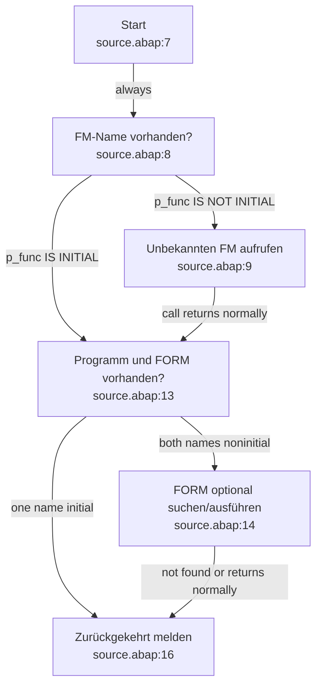
```mermaid
flowchart TD
    s["Start\nsource.abap:7"]
    g["FM-Name vorhanden?\nsource.abap:8"]
    f["Unbekannten FM aufrufen\nsource.abap:9"]
    h["Programm und FORM vorhanden?\nsource.abap:13"]
    p["FORM optional suchen/ausführen\nsource.abap:14"]
    o["Zurückgekehrt melden\nsource.abap:16"]
    s -->|"always"| g
    g -->|"p_func IS NOT INITIAL"| f
    g -->|"p_func IS INITIAL"| h
    f -->|"call returns normally"| h
    h -->|"both names noninitial"| p
    h -->|"one name initial"| o
    p -->|"not found or returns normally"| o
```

| Knoten | Typ | Quelle | Bedeutung |
|---|---|---|---|
| s | start | source.abap:7 | Start |
| g | gateway | source.abap:8 | FM-Name vorhanden? |
| f | opaque_call | source.abap:9 | Unbekannten FM aufrufen |
| h | gateway | source.abap:13 | Programm und FORM vorhanden? |
| p | opaque_call | source.abap:14 | FORM optional suchen/ausführen |
| o | output | source.abap:16 | Zurückgekehrt melden |

### Konkrete Handarbeit und Schätzgrenze

- **CC-012-W01**: Erlaubte FM-/FORM-Zielmengen und Interfaces vom Verantwortlichen beschaffen
- **CC-012-W02**: Allowlist und Fehlerbehandlung konzipieren; unbekannte Ziele nicht ausführen
- **CC-012-W03**: Nach Zielaufklärung relevante Implementierungen separat analysieren

Autorenannahme, nicht kalibriert: **4 / 12 / 40 Stunden** (optimistisch / wahrscheinlich / pessimistisch). Iststunden: **nicht gemessen**. Arbeitsumfang und Ausschlüsse siehe Kontext/README; diese Werte sind weder TCO-Ground-Truth noch belastbare Obergrenzen bei fehlenden Abhängigkeiten.

### Prüferfragen

- Erlaubte FM-/FORM-Zielmengen und Interfaces vom Verantwortlichen beschaffen
- Allowlist und Fehlerbehandlung konzipieren; unbekannte Ziele nicht ausführen
- Nach Zielaufklärung relevante Implementierungen separat analysieren
- Tragen alle Anker den vollständigen Fachsatz einschließlich Bedingungen und Negativpfad?
- Welche Aussage ist nur eine Fixture-Annahme und darf nicht auf den echten Kunden übertragen werden?

**Freigabe:** externe SAP-Architekturprüfung ausstehend; Quelle, Kontext, Oracle und Regelversion müssen gemeinsam gezeichnet werden.

---

## CC-013 — Vollständiger Dynpro-Mikrofall: PBO, PAI und GUI-Status

**Konstruktklassen:** K07 · **Classic:** B · **Cloud-API:** not_usable  
**Scope:** `complete_for_declared_slice` · **Status:** nicht unabhängig freigegeben.

Quellenhash: `a696d1e6ac04fdaa2ecba1e3044b46f116c0766a41ef18ea01814f1c42348e71`  
Kontexthash: `05b7f2e54dba7686a25bc5d51906053f777bc98475487de0828e140d79f8e65a`

### Quelltext `source.abap` — Zeilen zählen ab1

```abap
PROGRAM zcc_ref_013.
DATA ok_code TYPE c LENGTH 20.
DATA gv_amount TYPE p LENGTH 9 DECIMALS 2.
DATA gv_route TYPE c LENGTH 20.
MODULE status_0100 OUTPUT.
  SET PF-STATUS 'MAIN'.
ENDMODULE.
MODULE user_command_0100 INPUT.
  CASE ok_code.
    WHEN 'CHECK'.
      IF gv_amount > 10000.
        gv_route = 'MANAGER_ROUTE'.
      ELSE.
        gv_route = 'AUTO_ROUTE'.
      ENDIF.
    WHEN 'BACK'.
      LEAVE TO SCREEN 0.
  ENDCASE.
  CLEAR ok_code.
ENDMODULE.
```

```text
001  PROGRAM zcc_ref_013.
002  DATA ok_code TYPE c LENGTH 20.
003  DATA gv_amount TYPE p LENGTH 9 DECIMALS 2.
004  DATA gv_route TYPE c LENGTH 20.
005  MODULE status_0100 OUTPUT.
006    SET PF-STATUS 'MAIN'.
007  ENDMODULE.
008  MODULE user_command_0100 INPUT.
009    CASE ok_code.
010      WHEN 'CHECK'.
011        IF gv_amount > 10000.
012          gv_route = 'MANAGER_ROUTE'.
013        ELSE.
014          gv_route = 'AUTO_ROUTE'.
015        ENDIF.
016      WHEN 'BACK'.
017        LEAVE TO SCREEN 0.
018    ENDCASE.
019    CLEAR ok_code.
020  ENDMODULE.
```

### Sollbefunde

| ID | Regelversion | Exakter Anker | Schwere* | Sollaussage | Quellen |
|---|---|---|---|---|---|
| CC-013-F01 | R11@1.0.0 | source.abap:1 | medium | Dynpro mit gelieferten PBO/PAI- und Statusmetadaten: klassischer B-Kandidat, Cloud-UI-Rehosting nötig; nicht automatisch D. | SAP-LEVEL, SAP-SCREEN |

\* Der Schweregrad ist eine Korpuspriorität, keine behauptete SAP-ATC-Prioritätsnummer.

**Explizit unzulässige Schlussfolgerungen:**

- `source.abap:1` — Nicht allein wegen MODULE POOL/Dynpro D vergeben.

### SAP-/Repository-Objekte und Nachfolger

Keine explizite externe SAP-Repository-Identität im gelieferten Scope. Dynamische Ziele oder Kernelroutinen können dennoch unbekannt beziehungsweise keine TADIR-Objekte sein; das ist kein automatisches „keine Abhängigkeit“. Kommentare und Literale erzeugen keine Phantom-Objekte.

### Fachliche Ground-Truth-Kandidaten

**CC-013-B01** — Im PBO wird der GUI-Status MAIN gesetzt.  
Anker: source.abap:6. Kontext: /business_scope, /execution_assumptions, /dynpro.

**CC-013-B02** — Nur CHECK prüft den Grenzwert und setzt einen Routentext.  
Anker: source.abap:10, source.abap:11, source.abap:10–18. Kontext: /business_scope, /execution_assumptions, /dynpro.

**CC-013-B03** — BACK beendet die Screenfolge; andere Funktionscodes führen zu keiner Regelentscheidung.  
Anker: source.abap:16, source.abap:17. Kontext: /business_scope, /execution_assumptions, /dynpro.

### Erwartetes Prozessskelett

Dies ist der normalisierte prozedurale As-is-Scope, kein importgeprüftes BPMN und keine tatsächliche Ausführung. Die Kantenbedingungen sind Teil des Sollvertrags.

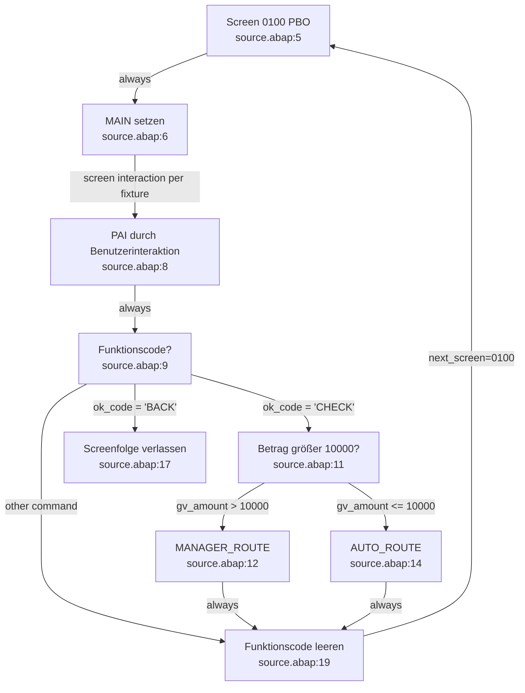
```mermaid
flowchart TD
    s["Screen 0100 PBO\nsource.abap:5"]
    p["MAIN setzen\nsource.abap:6"]
    i["PAI durch Benutzerinteraktion\nsource.abap:8"]
    g["Funktionscode?\nsource.abap:9"]
    v["Betrag größer 10000?\nsource.abap:11"]
    m["MANAGER_ROUTE\nsource.abap:12"]
    a["AUTO_ROUTE\nsource.abap:14"]
    x["Screenfolge verlassen\nsource.abap:17"]
    c["Funktionscode leeren\nsource.abap:19"]
    s -->|"always"| p
    p -->|"screen interaction per fixture"| i
    i -->|"always"| g
    g -->|"ok_code = 'CHECK'"| v
    g -->|"ok_code = 'BACK'"| x
    g -->|"other command"| c
    v -->|"gv_amount > 10000"| m
    v -->|"gv_amount <= 10000"| a
    m -->|"always"| c
    a -->|"always"| c
    c -->|"next_screen=0100"| s
```

| Knoten | Typ | Quelle | Bedeutung |
|---|---|---|---|
| s | start | source.abap:5 | Screen 0100 PBO |
| p | action | source.abap:6 | MAIN setzen |
| i | event | source.abap:8 | PAI durch Benutzerinteraktion |
| g | gateway | source.abap:9 | Funktionscode? |
| v | gateway | source.abap:11 | Betrag größer 10000? |
| m | action | source.abap:12 | MANAGER_ROUTE |
| a | action | source.abap:14 | AUTO_ROUTE |
| x | end | source.abap:17 | Screenfolge verlassen |
| c | action | source.abap:19 | Funktionscode leeren |

### Konkrete Handarbeit und Schätzgrenze

- **CC-013-W01**: Screen0100, MAIN-Status und PBO/PAI-Metadaten im Sandboxsystem einrichten
- **CC-013-W02**: CHECK/BACK/sonstige Befehle und Screen-Rücksprung verproben
- **CC-013-W03**: UI-Rehosting von Classic-Level separat bewerten

Autorenannahme, nicht kalibriert: **8 / 20 / 40 Stunden** (optimistisch / wahrscheinlich / pessimistisch). Iststunden: **nicht gemessen**. Arbeitsumfang und Ausschlüsse siehe Kontext/README; diese Werte sind weder TCO-Ground-Truth noch belastbare Obergrenzen bei fehlenden Abhängigkeiten.

### Prüferfragen

- Screen0100, MAIN-Status und PBO/PAI-Metadaten im Sandboxsystem einrichten
- CHECK/BACK/sonstige Befehle und Screen-Rücksprung verproben
- UI-Rehosting von Classic-Level separat bewerten
- Tragen alle Anker den vollständigen Fachsatz einschließlich Bedingungen und Negativpfad?
- Welche Aussage ist nur eine Fixture-Annahme und darf nicht auf den echten Kunden übertragen werden?

**Freigabe:** externe SAP-Architekturprüfung ausstehend; Quelle, Kontext, Oracle und Regelversion müssen gemeinsam gezeichnet werden.

---

## CC-014 — Dynpro-Aufruf ohne Screenexport

**Konstruktklassen:** K07, K11 · **Classic:** Unknown · **Cloud-API:** not_usable  
**Scope:** `partial_missing_screen` · **Status:** nicht unabhängig freigegeben.

Quellenhash: `a55206bf57547ac11e628300879ecce662b296749f2c57b070582902dbe62d55`  
Kontexthash: `8c3b331b7985d7c0af1ebb453d541b91bd92042658341ddc9a1ae86274d95d29`

### Quelltext `source.abap` — Zeilen zählen ab1

```abap
REPORT zcc_ref_014.
DATA gv_result TYPE c LENGTH 20.
START-OF-SELECTION.
  CALL SCREEN 0200.
  WRITE / gv_result.
```

```text
001  REPORT zcc_ref_014.
002  DATA gv_result TYPE c LENGTH 20.
003  START-OF-SELECTION.
004    CALL SCREEN 0200.
005    WRITE / gv_result.
```

### Sollbefunde

| ID | Regelversion | Exakter Anker | Schwere* | Sollaussage | Quellen |
|---|---|---|---|---|---|
| CC-014-F01 | R11@1.0.0 | source.abap:4 | high | Screen0200 samt PBO/PAI/GUI-Status fehlt. Die UI- und Fachlogik kann nicht rekonstruiert werden. | SAP-LEVEL, SAP-SCREEN |

\* Der Schweregrad ist eine Korpuspriorität, keine behauptete SAP-ATC-Prioritätsnummer.

### SAP-/Repository-Objekte und Nachfolger

Keine explizite externe SAP-Repository-Identität im gelieferten Scope. Dynamische Ziele oder Kernelroutinen können dennoch unbekannt beziehungsweise keine TADIR-Objekte sein; das ist kein automatisches „keine Abhängigkeit“. Kommentare und Literale erzeugen keine Phantom-Objekte.

### Fachliche Ground-Truth-Kandidaten

**CC-014-B01** — Das Programm ruft eine Screenfolge ab0200 auf.  
Anker: source.abap:4. Kontext: /business_scope, /execution_assumptions, /missing_dependencies.

**CC-014-B02** — Nach normaler Rückkehr wird gv_result ausgegeben; sein in der Screenfolge möglicher Wert bleibt unbekannt.  
Anker: source.abap:5. Kontext: /business_scope, /execution_assumptions, /missing_dependencies.

### Erwartetes Prozessskelett

Dies ist der normalisierte prozedurale As-is-Scope, kein importgeprüftes BPMN und keine tatsächliche Ausführung. Die Kantenbedingungen sind Teil des Sollvertrags.

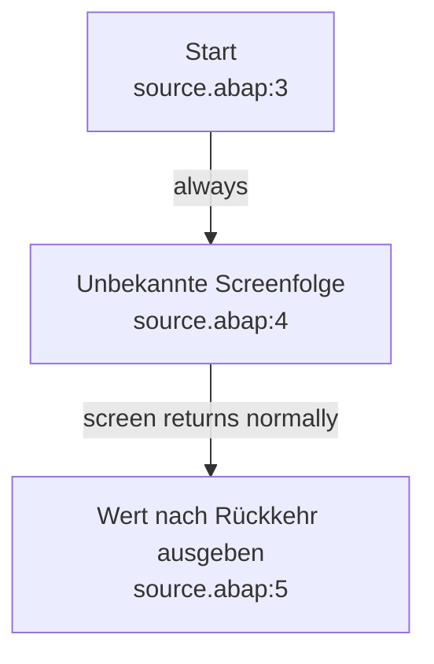
```mermaid
flowchart TD
    s["Start\nsource.abap:3"]
    d["Unbekannte Screenfolge\nsource.abap:4"]
    o["Wert nach Rückkehr ausgeben\nsource.abap:5"]
    s -->|"always"| d
    d -->|"screen returns normally"| o
```

| Knoten | Typ | Quelle | Bedeutung |
|---|---|---|---|
| s | start | source.abap:3 | Start |
| d | opaque_call | source.abap:4 | Unbekannte Screenfolge |
| o | output | source.abap:5 | Wert nach Rückkehr ausgeben |

### Konkrete Handarbeit und Schätzgrenze

- **CC-014-W01**: Screen0200 samt PBO/PAI/GUI-Status exportieren
- **CC-014-W02**: Schreibstellen von GV_RESULT und mögliche Abbruchpfade suchen
- **CC-014-W03**: Erst nach Quellenvollständigkeit fachliches Skelett freigeben

Autorenannahme, nicht kalibriert: **4 / 12 / 32 Stunden** (optimistisch / wahrscheinlich / pessimistisch). Iststunden: **nicht gemessen**. Arbeitsumfang und Ausschlüsse siehe Kontext/README; diese Werte sind weder TCO-Ground-Truth noch belastbare Obergrenzen bei fehlenden Abhängigkeiten.

### Prüferfragen

- Screen0200 samt PBO/PAI/GUI-Status exportieren
- Schreibstellen von GV_RESULT und mögliche Abbruchpfade suchen
- Erst nach Quellenvollständigkeit fachliches Skelett freigeben
- Tragen alle Anker den vollständigen Fachsatz einschließlich Bedingungen und Negativpfad?
- Welche Aussage ist nur eine Fixture-Annahme und darf nicht auf den echten Kunden übertragen werden?

**Freigabe:** externe SAP-Architekturprüfung ausstehend; Quelle, Kontext, Oracle und Regelversion müssen gemeinsam gezeichnet werden.

---

## CC-015 — Echter Kernelaufruf: Kenntnisgrenze sichtbar halten

**Konstruktklassen:** K08 · **Classic:** Unknown · **Cloud-API:** unknown  
**Scope:** `partial_kernel_contract_unverified` · **Status:** nicht unabhängig freigegeben.

Quellenhash: `e826a73b93fb399faf47dc9cc59a68f30999c4d8a9f6a2a481acdb089267341b`  
Kontexthash: `14eff48635239428fb39aee216d62a43ef71e9ac66ea528540773c47546b3c6a`

### Quelltext `source.abap` — Zeilen zählen ab1

```abap
REPORT zcc_ref_015.
PARAMETERS p_read AS CHECKBOX DEFAULT space.
DATA lv_parameter TYPE c LENGTH 40 VALUE 'rdisp/myname'.
DATA lv_value TYPE c LENGTH 128.
START-OF-SELECTION.
  IF p_read <> 'X'.
    WRITE / 'NOT_EXECUTED'.
    RETURN.
  ENDIF.
  CALL 'C_SAPGPARAM'
    ID 'NAME' FIELD lv_parameter
    ID 'VALUE' FIELD lv_value.
  WRITE / lv_value.
```

```text
001  REPORT zcc_ref_015.
002  PARAMETERS p_read AS CHECKBOX DEFAULT space.
003  DATA lv_parameter TYPE c LENGTH 40 VALUE 'rdisp/myname'.
004  DATA lv_value TYPE c LENGTH 128.
005  START-OF-SELECTION.
006    IF p_read <> 'X'.
007      WRITE / 'NOT_EXECUTED'.
008      RETURN.
009    ENDIF.
010    CALL 'C_SAPGPARAM'
011      ID 'NAME' FIELD lv_parameter
012      ID 'VALUE' FIELD lv_value.
013    WRITE / lv_value.
```

### Sollbefunde

| ID | Regelversion | Exakter Anker | Schwere* | Sollaussage | Quellen |
|---|---|---|---|---|---|
| CC-015-F01 | R12@1.0.0 | source.abap:10 | high | Kernel-Systemaufruf erkannt. Historischer Syntaxbeleg ersetzt keine aktuelle Freigabe; klassisches Level Unknown statt erfundenem A/B/D. | SAP-KERNEL-EXAMPLE, SAP-LEVEL |

\* Der Schweregrad ist eine Korpuspriorität, keine behauptete SAP-ATC-Prioritätsnummer.

### SAP-/Repository-Objekte und Nachfolger

Keine explizite externe SAP-Repository-Identität im gelieferten Scope. Dynamische Ziele oder Kernelroutinen können dennoch unbekannt beziehungsweise keine TADIR-Objekte sein; das ist kein automatisches „keine Abhängigkeit“. Kommentare und Literale erzeugen keine Phantom-Objekte.

### Fachliche Ground-Truth-Kandidaten

**CC-015-B01** — Ohne explizit gesetztes p_read wird der Kernelaufruf nicht erreicht.  
Anker: source.abap:6, source.abap:7, source.abap:8. Kontext: /business_scope, /execution_assumptions.

**CC-015-B02** — Bei gesetztem Schalter wird der Profilparameter rdisp/myname angefragt; der tatsächliche Rückgabewert ist nicht im Quelltext bekannt.  
Anker: source.abap:10, source.abap:3, source.abap:10–12. Kontext: /business_scope, /execution_assumptions.

### Erwartetes Prozessskelett

Dies ist der normalisierte prozedurale As-is-Scope, kein importgeprüftes BPMN und keine tatsächliche Ausführung. Die Kantenbedingungen sind Teil des Sollvertrags.

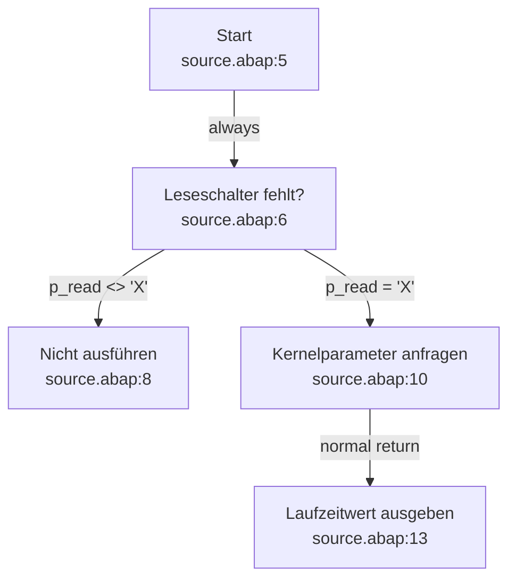
```mermaid
flowchart TD
    s["Start\nsource.abap:5"]
    g["Leseschalter fehlt?\nsource.abap:6"]
    x["Nicht ausführen\nsource.abap:8"]
    k["Kernelparameter anfragen\nsource.abap:10"]
    o["Laufzeitwert ausgeben\nsource.abap:13"]
    s -->|"always"| g
    g -->|"p_read <> 'X'"| x
    g -->|"p_read = 'X'"| k
    k -->|"normal return"| o
```

| Knoten | Typ | Quelle | Bedeutung |
|---|---|---|---|
| s | start | source.abap:5 | Start |
| g | gateway | source.abap:6 | Leseschalter fehlt? |
| x | end | source.abap:8 | Nicht ausführen |
| k | opaque_call | source.abap:10 | Kernelparameter anfragen |
| o | output | source.abap:13 | Laufzeitwert ausgeben |

### Konkrete Handarbeit und Schätzgrenze

- **CC-015-W01**: Heutige Unterstützung des konkreten Kernelaufrufs mit SAP-Nachweis klären
- **CC-015-W02**: Sichere unterstützte Alternative für genau diesen Parameter prüfen
- **CC-015-W03**: Nie stillschweigend aus historischem Syntaxbeispiel A-D-Freigabe machen

Autorenannahme, nicht kalibriert: **3 / 8 / 20 Stunden** (optimistisch / wahrscheinlich / pessimistisch). Iststunden: **nicht gemessen**. Arbeitsumfang und Ausschlüsse siehe Kontext/README; diese Werte sind weder TCO-Ground-Truth noch belastbare Obergrenzen bei fehlenden Abhängigkeiten.

### Prüferfragen

- Heutige Unterstützung des konkreten Kernelaufrufs mit SAP-Nachweis klären
- Sichere unterstützte Alternative für genau diesen Parameter prüfen
- Nie stillschweigend aus historischem Syntaxbeispiel A-D-Freigabe machen
- Tragen alle Anker den vollständigen Fachsatz einschließlich Bedingungen und Negativpfad?
- Welche Aussage ist nur eine Fixture-Annahme und darf nicht auf den echten Kunden übertragen werden?

**Besonderheit:** Absichtlicher Reviewblocker. Es wäre unredlich, ohne aktuelle SAP-Regel oder ATC die gewünschte feste D-Antwort zu erfinden.

**Freigabe:** externe SAP-Architekturprüfung ausstehend; Quelle, Kontext, Oracle und Regelversion müssen gemeinsam gezeichnet werden.

---

## CC-016 — Lexikalische Falle: SQL und Kernel nur in Texten

**Konstruktklassen:** K08, K02 · **Classic:** B · **Cloud-API:** not_applicable  
**Scope:** `complete_for_declared_slice` · **Status:** nicht unabhängig freigegeben.

Quellenhash: `7a2a28dc25aa81bffbbdc9d58de23b53ac1df351cb44697e17da7d451ddef9aa`  
Kontexthash: `5741eff345acf0034674ea124ff6ca2fdca3ad203b819d5b97f4ed4b5d7ae43a`

### Quelltext `source.abap` — Zeilen zählen ab1

```abap
REPORT zcc_ref_016.
DATA lv_text TYPE string.
START-OF-SELECTION.
* CALL 'C_SAPGPARAM' ID 'NAME' FIELD 'rdisp/myname'.
  " SELECT * FROM kna1 INTO TABLE @DATA(lt_fake).
  lv_text = `CALL 'C_SAPGPARAM'; UPDATE KNA1;`.
  lv_text = |{ lv_text } CALL FUNCTION BAPI_PO_CREATE1|.
  WRITE / lv_text.
```

```text
001  REPORT zcc_ref_016.
002  DATA lv_text TYPE string.
003  START-OF-SELECTION.
004  * CALL 'C_SAPGPARAM' ID 'NAME' FIELD 'rdisp/myname'.
005    " SELECT * FROM kna1 INTO TABLE @DATA(lt_fake).
006    lv_text = `CALL 'C_SAPGPARAM'; UPDATE KNA1;`.
007    lv_text = |{ lv_text } CALL FUNCTION BAPI_PO_CREATE1|.
008    WRITE / lv_text.
```

### Sollbefunde

**Keine Findings im endlichen v1-Regelvertrag.** Das klassifiziert Standard-ABAP nicht automatisch zu A. Compiler-/Security-/allgemeine Qualitätsdiagnosen außerhalb dieses Vertrags bleiben separat.

**Explizit unzulässige Schlussfolgerungen:**

- `source.abap:4` — Kommentar ist kein Kernelaufruf.
- `source.abap:5` — Kommentar ist kein SELECT.
- `source.abap:6` — Stringliteral ist kein UPDATE.
- `source.abap:7` — Stringtemplate enthält keinen ausgeführten Funktionsbausteinaufruf.

### SAP-/Repository-Objekte und Nachfolger

Keine explizite externe SAP-Repository-Identität im gelieferten Scope. Dynamische Ziele oder Kernelroutinen können dennoch unbekannt beziehungsweise keine TADIR-Objekte sein; das ist kein automatisches „keine Abhängigkeit“. Kommentare und Literale erzeugen keine Phantom-Objekte.

### Fachliche Ground-Truth-Kandidaten

**CC-016-B01** — Ein Text mit ABAP-ähnlichen Schlüsselwörtern wird in eine Stringvariable geschrieben.  
Anker: source.abap:6. Kontext: /business_scope, /execution_assumptions.

**CC-016-B02** — Der Text wird ausgegeben; der sichtbare Code führt weder Kernelaufruf noch Datenbankänderung aus.  
Anker: source.abap:8, source.abap:3–8. Kontext: /business_scope, /execution_assumptions.

### Erwartetes Prozessskelett

Dies ist der normalisierte prozedurale As-is-Scope, kein importgeprüftes BPMN und keine tatsächliche Ausführung. Die Kantenbedingungen sind Teil des Sollvertrags.

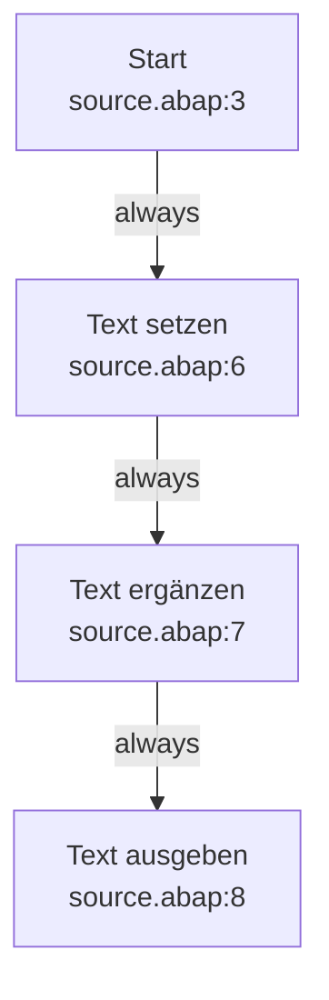
```mermaid
flowchart TD
    s["Start\nsource.abap:3"]
    a["Text setzen\nsource.abap:6"]
    b["Text ergänzen\nsource.abap:7"]
    o["Text ausgeben\nsource.abap:8"]
    s -->|"always"| a
    a -->|"always"| b
    b -->|"always"| o
```

| Knoten | Typ | Quelle | Bedeutung |
|---|---|---|---|
| s | start | source.abap:3 | Start |
| a | action | source.abap:6 | Text setzen |
| b | action | source.abap:7 | Text ergänzen |
| o | output | source.abap:8 | Text ausgeben |

### Konkrete Handarbeit und Schätzgrenze

- **CC-016-W01**: Kommentare, Backticks und Stringtemplate lexikalisch prüfen
- **CC-016-W02**: Keine Phantom-Objekte aus BAPI-/KNA1-Texten erzeugen
- **CC-016-W03**: Negativkontrolle mit echter Statement-Einfügung verproben

Autorenannahme, nicht kalibriert: **0.5 / 1 / 2 Stunden** (optimistisch / wahrscheinlich / pessimistisch). Iststunden: **nicht gemessen**. Arbeitsumfang und Ausschlüsse siehe Kontext/README; diese Werte sind weder TCO-Ground-Truth noch belastbare Obergrenzen bei fehlenden Abhängigkeiten.

### Prüferfragen

- Kommentare, Backticks und Stringtemplate lexikalisch prüfen
- Keine Phantom-Objekte aus BAPI-/KNA1-Texten erzeugen
- Negativkontrolle mit echter Statement-Einfügung verproben
- Tragen alle Anker den vollständigen Fachsatz einschließlich Bedingungen und Negativpfad?
- Welche Aussage ist nur eine Fixture-Annahme und darf nicht auf den echten Kunden übertragen werden?

**Freigabe:** externe SAP-Architekturprüfung ausstehend; Quelle, Kontext, Oracle und Regelversion müssen gemeinsam gezeichnet werden.

---

## CC-017 — OO: Redefinition und expliziter Super-Aufruf

**Konstruktklassen:** K09 · **Classic:** B · **Cloud-API:** not_applicable  
**Scope:** `complete_for_declared_slice` · **Status:** nicht unabhängig freigegeben.

Quellenhash: `5e4b662c4f97bca5b0ceb04a2536c3bb65c26e45c43a6258f48cd1c997ec1784`  
Kontexthash: `90dc7865e8998fe36553260243f645c7458a2f35c20a8054e24229b0970a8c3d`

### Quelltext `source.abap` — Zeilen zählen ab1

```abap
REPORT zcc_ref_017.
PARAMETERS p_amt TYPE i DEFAULT 10001.
CLASS lcl_base DEFINITION.
  PUBLIC SECTION.
    METHODS route IMPORTING iv_amount TYPE i
                  RETURNING VALUE(rv_route) TYPE string.
ENDCLASS.
CLASS lcl_base IMPLEMENTATION.
  METHOD route.
    IF iv_amount > 10000.
      rv_route = 'MANAGER_ROUTE'.
    ELSE.
      rv_route = 'AUTO_ROUTE'.
    ENDIF.
  ENDMETHOD.
ENDCLASS.
CLASS lcl_child DEFINITION INHERITING FROM lcl_base FINAL.
  PUBLIC SECTION.
    METHODS route REDEFINITION.
ENDCLASS.
CLASS lcl_child IMPLEMENTATION.
  METHOD route.
    IF iv_amount < 0.
      rv_route = 'INVALID'.
      RETURN.
    ENDIF.
    rv_route = super->route( iv_amount ).
  ENDMETHOD.
ENDCLASS.
START-OF-SELECTION.
  DATA lo_rule TYPE REF TO lcl_base.
  lo_rule = NEW lcl_child( ).
  DATA(lv_route) = lo_rule->route( p_amt ).
  WRITE / lv_route.
```

```text
001  REPORT zcc_ref_017.
002  PARAMETERS p_amt TYPE i DEFAULT 10001.
003  CLASS lcl_base DEFINITION.
004    PUBLIC SECTION.
005      METHODS route IMPORTING iv_amount TYPE i
006                    RETURNING VALUE(rv_route) TYPE string.
007  ENDCLASS.
008  CLASS lcl_base IMPLEMENTATION.
009    METHOD route.
010      IF iv_amount > 10000.
011        rv_route = 'MANAGER_ROUTE'.
012      ELSE.
013        rv_route = 'AUTO_ROUTE'.
014      ENDIF.
015    ENDMETHOD.
016  ENDCLASS.
017  CLASS lcl_child DEFINITION INHERITING FROM lcl_base FINAL.
018    PUBLIC SECTION.
019      METHODS route REDEFINITION.
020  ENDCLASS.
021  CLASS lcl_child IMPLEMENTATION.
022    METHOD route.
023      IF iv_amount < 0.
024        rv_route = 'INVALID'.
025        RETURN.
026      ENDIF.
027      rv_route = super->route( iv_amount ).
028    ENDMETHOD.
029  ENDCLASS.
030  START-OF-SELECTION.
031    DATA lo_rule TYPE REF TO lcl_base.
032    lo_rule = NEW lcl_child( ).
033    DATA(lv_route) = lo_rule->route( p_amt ).
034    WRITE / lv_route.
```

### Sollbefunde

| ID | Regelversion | Exakter Anker | Schwere* | Sollaussage | Quellen |
|---|---|---|---|---|---|
| CC-017-F01 | R14@1.0.0 | source.abap:17 | info | Vollständige lokale Vorfahren vorhanden. Referenztyp Base, Laufzeittyp Child; negatives Input endet vor Super. | SAP-OO |

\* Der Schweregrad ist eine Korpuspriorität, keine behauptete SAP-ATC-Prioritätsnummer.

### SAP-/Repository-Objekte und Nachfolger

Keine explizite externe SAP-Repository-Identität im gelieferten Scope. Dynamische Ziele oder Kernelroutinen können dennoch unbekannt beziehungsweise keine TADIR-Objekte sein; das ist kein automatisches „keine Abhängigkeit“. Kommentare und Literale erzeugen keine Phantom-Objekte.

### Fachliche Ground-Truth-Kandidaten

**CC-017-B01** — Das Objekt hinter der Basisklassenreferenz ist eine Instanz der Kindklasse.  
Anker: source.abap:32, source.abap:31–32. Kontext: /business_scope, /execution_assumptions.

**CC-017-B02** — Die Kindklasse weist negative Beträge zurück, ohne die Basismethode auszuführen.  
Anker: source.abap:23, source.abap:25, source.abap:23–25. Kontext: /business_scope, /execution_assumptions.

**CC-017-B03** — Nicht negative Beträge werden durch den expliziten Super-Aufruf nach der Basisregel verarbeitet.  
Anker: source.abap:27, source.abap:23–27. Kontext: /business_scope, /execution_assumptions.

### Erwartetes Prozessskelett

Dies ist der normalisierte prozedurale As-is-Scope, kein importgeprüftes BPMN und keine tatsächliche Ausführung. Die Kantenbedingungen sind Teil des Sollvertrags.

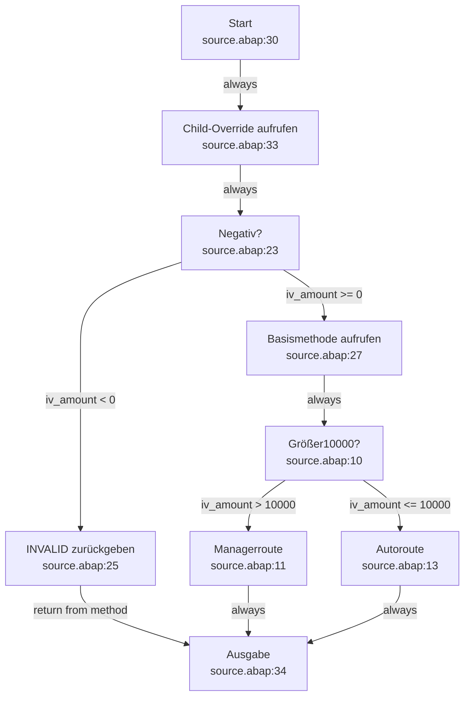
```mermaid
flowchart TD
    s["Start\nsource.abap:30"]
    c["Child-Override aufrufen\nsource.abap:33"]
    g["Negativ?\nsource.abap:23"]
    x["INVALID zurückgeben\nsource.abap:25"]
    b["Basismethode aufrufen\nsource.abap:27"]
    h["Größer10000?\nsource.abap:10"]
    m["Managerroute\nsource.abap:11"]
    a["Autoroute\nsource.abap:13"]
    o["Ausgabe\nsource.abap:34"]
    s -->|"always"| c
    c -->|"always"| g
    g -->|"iv_amount < 0"| x
    x -->|"return from method"| o
    g -->|"iv_amount >= 0"| b
    b -->|"always"| h
    h -->|"iv_amount > 10000"| m
    h -->|"iv_amount <= 10000"| a
    m -->|"always"| o
    a -->|"always"| o
```

| Knoten | Typ | Quelle | Bedeutung |
|---|---|---|---|
| s | start | source.abap:30 | Start |
| c | call | source.abap:33 | Child-Override aufrufen |
| g | gateway | source.abap:23 | Negativ? |
| x | return | source.abap:25 | INVALID zurückgeben |
| b | call | source.abap:27 | Basismethode aufrufen |
| h | gateway | source.abap:10 | Größer10000? |
| m | action | source.abap:11 | Managerroute |
| a | action | source.abap:13 | Autoroute |
| o | output | source.abap:34 | Ausgabe |

### Konkrete Handarbeit und Schätzgrenze

- **CC-017-W01**: Dispatch Base-Referenz auf Child-Instanz und Super-Aufruf nachvollziehen
- **CC-017-W02**: Negative Beträge dürfen die Basis nicht erreichen
- **CC-017-W03**: Zusätzlichen Vorfahren oder Override als Änderungsprobe prüfen

Autorenannahme, nicht kalibriert: **2 / 4 / 8 Stunden** (optimistisch / wahrscheinlich / pessimistisch). Iststunden: **nicht gemessen**. Arbeitsumfang und Ausschlüsse siehe Kontext/README; diese Werte sind weder TCO-Ground-Truth noch belastbare Obergrenzen bei fehlenden Abhängigkeiten.

### Prüferfragen

- Dispatch Base-Referenz auf Child-Instanz und Super-Aufruf nachvollziehen
- Negative Beträge dürfen die Basis nicht erreichen
- Zusätzlichen Vorfahren oder Override als Änderungsprobe prüfen
- Tragen alle Anker den vollständigen Fachsatz einschließlich Bedingungen und Negativpfad?
- Welche Aussage ist nur eine Fixture-Annahme und darf nicht auf den echten Kunden übertragen werden?

**Freigabe:** externe SAP-Architekturprüfung ausstehend; Quelle, Kontext, Oracle und Regelversion müssen gemeinsam gezeichnet werden.

---

## CC-018 — OO: fehlende globale Basisklasse

**Konstruktklassen:** K09, K11 · **Classic:** Unknown · **Cloud-API:** unknown  
**Scope:** `intentionally_incomplete` · **Status:** nicht unabhängig freigegeben.

Quellenhash: `3696af0664d9e42e8a1aa4d985a88982458a59f8d918f1be0a57ee6bf30aba4c`  
Kontexthash: `b2019fca3932bc65066595569c664cc0558b50da46498c4d8d25085ef00da4e7`

### Quelltext `source.abap` — Zeilen zählen ab1

```abap
REPORT zcc_ref_018.
CLASS lcl_child DEFINITION INHERITING FROM zcl_cc_missing_base FINAL.
  PUBLIC SECTION.
    METHODS route REDEFINITION.
ENDCLASS.
CLASS lcl_child IMPLEMENTATION.
  METHOD route.
    super->route( ).
  ENDMETHOD.
ENDCLASS.
START-OF-SELECTION.
  DATA(lo_rule) = NEW lcl_child( ).
  lo_rule->route( ).
```

```text
001  REPORT zcc_ref_018.
002  CLASS lcl_child DEFINITION INHERITING FROM zcl_cc_missing_base FINAL.
003    PUBLIC SECTION.
004      METHODS route REDEFINITION.
005  ENDCLASS.
006  CLASS lcl_child IMPLEMENTATION.
007    METHOD route.
008      super->route( ).
009    ENDMETHOD.
010  ENDCLASS.
011  START-OF-SELECTION.
012    DATA(lo_rule) = NEW lcl_child( ).
013    lo_rule->route( ).
```

### Sollbefunde

| ID | Regelversion | Exakter Anker | Schwere* | Sollaussage | Quellen |
|---|---|---|---|---|---|
| CC-018-F01 | R16@1.0.0 | source.abap:2 | high | Basisklassenquelle und Vertrag fehlen. Keine erfundene Basislogik oder Complete-Analyse. | SAP-LEVEL, SAP-OO |
| CC-018-F02 | R14@1.0.0 | source.abap:8 | high | Super-Aufruf bleibt opak, selbst wenn der Override sichtbar ist. | SAP-OO |

\* Der Schweregrad ist eine Korpuspriorität, keine behauptete SAP-ATC-Prioritätsnummer.

### SAP-/Repository-Objekte und Nachfolger

**ZCL_CC_MISSING_BASE** · Eigentümer `customer` · Verwendung `missing_superclass`  
Anker: source.abap:2. Identität: `{"tadirObject": "CLAS", "tadirObjName": "ZCL_CC_MISSING_BASE", "objectType": "CLAS", "objectKey": "ZCL_CC_MISSING_BASE"}`.  
Cloud-Rohzustand: `not_applicable`; Classic-Rohzustand: `not_applicable`. Nachfolgerstatus: `not_applicable_customer_or_partner`.

Nachfolgerliste: `[]` **mit obiger Statusbegründung**, nicht pauschal „kein Nachfolger existiert“.

### Fachliche Ground-Truth-Kandidaten

**CC-018-B01** — Die lokale Kindklasse erbt von einer nicht gelieferten kundeneigenen Klasse.  
Anker: source.abap:2. Kontext: /business_scope, /execution_assumptions, /missing_dependencies.

**CC-018-B02** — Der Override delegiert an eine unbekannte Basismethode; ihr fachliches Verhalten ist nicht belegt.  
Anker: source.abap:8. Kontext: /business_scope, /execution_assumptions, /missing_dependencies.

### Erwartetes Prozessskelett

Dies ist der normalisierte prozedurale As-is-Scope, kein importgeprüftes BPMN und keine tatsächliche Ausführung. Die Kantenbedingungen sind Teil des Sollvertrags.

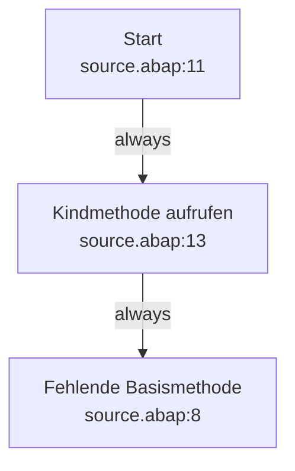
```mermaid
flowchart TD
    s["Start\nsource.abap:11"]
    c["Kindmethode aufrufen\nsource.abap:13"]
    b["Fehlende Basismethode\nsource.abap:8"]
    s -->|"always"| c
    c -->|"always"| b
```

| Knoten | Typ | Quelle | Bedeutung |
|---|---|---|---|
| s | start | source.abap:11 | Start |
| c | call | source.abap:13 | Kindmethode aufrufen |
| b | opaque_call | source.abap:8 | Fehlende Basismethode |

### Konkrete Handarbeit und Schätzgrenze

- **CC-018-W01**: Globale Basisklasse einschließlich Interfaces/Abhängigkeiten beschaffen
- **CC-018-W02**: Super-Signatur und fachliche Seiteneffekte prüfen
- **CC-018-W03**: Unknown erst nach nachvollziehbarer Quellenauflösung ersetzen

Autorenannahme, nicht kalibriert: **2 / 6 / 20 Stunden** (optimistisch / wahrscheinlich / pessimistisch). Iststunden: **nicht gemessen**. Arbeitsumfang und Ausschlüsse siehe Kontext/README; diese Werte sind weder TCO-Ground-Truth noch belastbare Obergrenzen bei fehlenden Abhängigkeiten.

### Prüferfragen

- Globale Basisklasse einschließlich Interfaces/Abhängigkeiten beschaffen
- Super-Signatur und fachliche Seiteneffekte prüfen
- Unknown erst nach nachvollziehbarer Quellenauflösung ersetzen
- Tragen alle Anker den vollständigen Fachsatz einschließlich Bedingungen und Negativpfad?
- Welche Aussage ist nur eine Fixture-Annahme und darf nicht auf den echten Kunden übertragen werden?

**Freigabe:** externe SAP-Architekturprüfung ausstehend; Quelle, Kontext, Oracle und Regelversion müssen gemeinsam gezeichnet werden.

---

## CC-019 — RTTI: bekannter lokaler Strukturtyp

**Konstruktklassen:** K10 · **Classic:** B · **Cloud-API:** usable  
**Scope:** `complete_for_declared_slice` · **Status:** nicht unabhängig freigegeben.

Quellenhash: `d1d8dd3270afc4a8939f8f5f89a0f39f5b1d5bd4ca11b390ae25c2441719e693`  
Kontexthash: `bec04cfc8f3ffdc3749c37a0bb9261941aaff96ac9d657f87408214cda10997a`

### Quelltext `source.abap` — Zeilen zählen ab1

```abap
REPORT zcc_ref_019.
TYPES: BEGIN OF ty_request,
         amount TYPE p LENGTH 9 DECIMALS 2,
         currency TYPE c LENGTH 3,
       END OF ty_request.
DATA ls_request TYPE ty_request.
DATA lo_description TYPE REF TO cl_abap_structdescr.
START-OF-SELECTION.
  lo_description ?= cl_abap_typedescr=>describe_by_data( ls_request ).
  DATA(lt_components) = lo_description->get_components( ).
  LOOP AT lt_components INTO DATA(ls_component).
    WRITE / ls_component-name.
  ENDLOOP.
```

```text
001  REPORT zcc_ref_019.
002  TYPES: BEGIN OF ty_request,
003           amount TYPE p LENGTH 9 DECIMALS 2,
004           currency TYPE c LENGTH 3,
005         END OF ty_request.
006  DATA ls_request TYPE ty_request.
007  DATA lo_description TYPE REF TO cl_abap_structdescr.
008  START-OF-SELECTION.
009    lo_description ?= cl_abap_typedescr=>describe_by_data( ls_request ).
010    DATA(lt_components) = lo_description->get_components( ).
011    LOOP AT lt_components INTO DATA(ls_component).
012      WRITE / ls_component-name.
013    ENDLOOP.
```

### Sollbefunde

| ID | Regelversion | Exakter Anker | Schwere* | Sollaussage | Quellen |
|---|---|---|---|---|---|
| CC-019-F01 | R15@1.0.0 | source.abap:9 | info | RTTI mit bekanntem lokalem Strukturtyp; verwendete CL_ABAP_TYPEDESCR und CL_ABAP_STRUCTDESCR sind im PCE2022-Auszug released. | SAP-RTTI, SAP-PCE22 |

\* Der Schweregrad ist eine Korpuspriorität, keine behauptete SAP-ATC-Prioritätsnummer.

**Explizit unzulässige Schlussfolgerungen:**

- `source.abap:9` — RTTI nicht pauschal als unauflösbar oder Cloud-verboten klassifizieren.

### SAP-/Repository-Objekte und Nachfolger

**CL_ABAP_STRUCTDESCR** · Eigentümer `SAP` · Verwendung `type_reference`  
Anker: source.abap:7. Identität: `{"tadirObject": "CLAS", "tadirObjName": "CL_ABAP_STRUCTDESCR", "objectType": "CLAS", "objectKey": "CL_ABAP_STRUCTDESCR"}`.  
Cloud-Rohzustand: `released`; Classic-Rohzustand: `not_asserted`. Nachfolgerstatus: `not_listed_in_observed_record`.

Nachfolgerliste: `[]` **mit obiger Statusbegründung**, nicht pauschal „kein Nachfolger existiert“.

Quelle: SAP-PCE22; 5953–5962.

**CL_ABAP_TYPEDESCR** · Eigentümer `SAP` · Verwendung `static_method_call`  
Anker: source.abap:9. Identität: `{"tadirObject": "CLAS", "tadirObjName": "CL_ABAP_TYPEDESCR", "objectType": "CLAS", "objectKey": "CL_ABAP_TYPEDESCR"}`.  
Cloud-Rohzustand: `released`; Classic-Rohzustand: `not_asserted`. Nachfolgerstatus: `not_listed_in_observed_record`.

Nachfolgerliste: `[]` **mit obiger Statusbegründung**, nicht pauschal „kein Nachfolger existiert“.

Quelle: SAP-PCE22; 6013–6022.

### Fachliche Ground-Truth-Kandidaten

**CC-019-B01** — Die lokale Struktur enthält AMOUNT und CURRENCY.  
Anker: source.abap:2, source.abap:2–5. Kontext: /business_scope, /execution_assumptions.

**CC-019-B02** — Der Code ermittelt Metadaten dieser Struktur; er berechnet keine Beträge und liest keine SAP-Stammdatentabelle.  
Anker: source.abap:9, source.abap:10. Kontext: /business_scope, /execution_assumptions.

**CC-019-B03** — Die Namen der Strukturkomponenten werden ausgegeben.  
Anker: source.abap:12. Kontext: /business_scope, /execution_assumptions.

### Erwartetes Prozessskelett

Dies ist der normalisierte prozedurale As-is-Scope, kein importgeprüftes BPMN und keine tatsächliche Ausführung. Die Kantenbedingungen sind Teil des Sollvertrags.

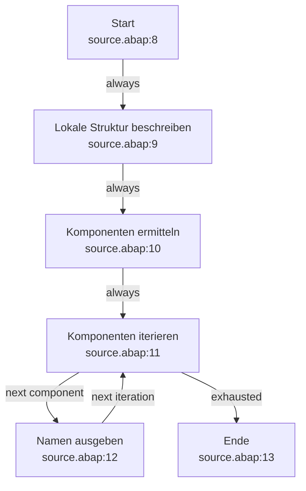
```mermaid
flowchart TD
    s["Start\nsource.abap:8"]
    d["Lokale Struktur beschreiben\nsource.abap:9"]
    c["Komponenten ermitteln\nsource.abap:10"]
    l["Komponenten iterieren\nsource.abap:11"]
    o["Namen ausgeben\nsource.abap:12"]
    e["Ende\nsource.abap:13"]
    s -->|"always"| d
    d -->|"always"| c
    c -->|"always"| l
    l -->|"next component"| o
    o -->|"next iteration"| l
    l -->|"exhausted"| e
```

| Knoten | Typ | Quelle | Bedeutung |
|---|---|---|---|
| s | start | source.abap:8 | Start |
| d | call | source.abap:9 | Lokale Struktur beschreiben |
| c | call | source.abap:10 | Komponenten ermitteln |
| l | loop | source.abap:11 | Komponenten iterieren |
| o | output | source.abap:12 | Namen ausgeben |
| e | end | source.abap:13 | Ende |

### Konkrete Handarbeit und Schätzgrenze

- **CC-019-W01**: PCE2022-Freigabe beider RTTS-Klassen und benötigter Methoden bestätigen
- **CC-019-W02**: Komponenten AMOUNT/CURRENCY mit RTTI-Ausgabe vergleichen
- **CC-019-W03**: Keinen pauschalen RTTI-Handarbeits- oder D-Zwang einführen

Autorenannahme, nicht kalibriert: **1 / 3 / 6 Stunden** (optimistisch / wahrscheinlich / pessimistisch). Iststunden: **nicht gemessen**. Arbeitsumfang und Ausschlüsse siehe Kontext/README; diese Werte sind weder TCO-Ground-Truth noch belastbare Obergrenzen bei fehlenden Abhängigkeiten.

### Prüferfragen

- PCE2022-Freigabe beider RTTS-Klassen und benötigter Methoden bestätigen
- Komponenten AMOUNT/CURRENCY mit RTTI-Ausgabe vergleichen
- Keinen pauschalen RTTI-Handarbeits- oder D-Zwang einführen
- Tragen alle Anker den vollständigen Fachsatz einschließlich Bedingungen und Negativpfad?
- Welche Aussage ist nur eine Fixture-Annahme und darf nicht auf den echten Kunden übertragen werden?

**Freigabe:** externe SAP-Architekturprüfung ausstehend; Quelle, Kontext, Oracle und Regelversion müssen gemeinsam gezeichnet werden.

---

## CC-020 — Dynamischer Typ und Feldname aus Eingabe

**Konstruktklassen:** K10, K11 · **Classic:** Unknown · **Cloud-API:** unknown  
**Scope:** `partial_missing_type_and_runtime_domain` · **Status:** nicht unabhängig freigegeben.

Quellenhash: `a5e03946a38c6cbc7727904536610134a217cade27b5cb0797af77382b9151ae`  
Kontexthash: `17452740680c9fc3b124991ec76672afb84586824bcf85c662ec346c7443452e`

### Quelltext `source.abap` — Zeilen zählen ab1

```abap
REPORT zcc_ref_020.
PARAMETERS p_type TYPE c LENGTH 30 DEFAULT 'ZCCR_PAYLOAD'.
PARAMETERS p_field TYPE c LENGTH 30 DEFAULT 'AMOUNT'.
DATA lr_payload TYPE REF TO data.
FIELD-SYMBOLS <payload> TYPE any.
FIELD-SYMBOLS <value> TYPE any.
START-OF-SELECTION.
  CREATE DATA lr_payload TYPE (p_type).
  ASSIGN lr_payload->* TO <payload>.
  ASSIGN COMPONENT p_field OF STRUCTURE <payload> TO <value>.
  IF sy-subrc = 0.
    WRITE / <value>.
  ELSE.
    WRITE / 'FIELD_NOT_FOUND'.
  ENDIF.
```

```text
001  REPORT zcc_ref_020.
002  PARAMETERS p_type TYPE c LENGTH 30 DEFAULT 'ZCCR_PAYLOAD'.
003  PARAMETERS p_field TYPE c LENGTH 30 DEFAULT 'AMOUNT'.
004  DATA lr_payload TYPE REF TO data.
005  FIELD-SYMBOLS <payload> TYPE any.
006  FIELD-SYMBOLS <value> TYPE any.
007  START-OF-SELECTION.
008    CREATE DATA lr_payload TYPE (p_type).
009    ASSIGN lr_payload->* TO <payload>.
010    ASSIGN COMPONENT p_field OF STRUCTURE <payload> TO <value>.
011    IF sy-subrc = 0.
012      WRITE / <value>.
013    ELSE.
014      WRITE / 'FIELD_NOT_FOUND'.
015    ENDIF.
```

### Sollbefunde

| ID | Regelversion | Exakter Anker | Schwere* | Sollaussage | Quellen |
|---|---|---|---|---|---|
| CC-020-F01 | R15@1.0.0 | source.abap:8 | high | Laufzeittyp ist extern bestimmt; DDIC-Schema fehlt. Kein fester Wert oder garantierte Struktur behauptbar. | SAP-RTTI, SAP-PCE22 |
| CC-020-F02 | R15@1.0.0 | source.abap:10 | medium | Dynamische Feldsuche besitzt sy-subrc-Guard; CREATE DATA oder nichtstruktureller Typ können schon vorher fehlschlagen. | SAP-RTTI, SAP-PCE22 |

\* Der Schweregrad ist eine Korpuspriorität, keine behauptete SAP-ATC-Prioritätsnummer.

### SAP-/Repository-Objekte und Nachfolger

**ZCCR_PAYLOAD** · Eigentümer `customer` · Verwendung `default_dynamic_type_not_exhaustive`  
Anker: source.abap:2. Identität: `{"tadirObject": "TABL", "tadirObjName": "ZCCR_PAYLOAD", "objectType": "TABL", "objectKey": "ZCCR_PAYLOAD"}`.  
Cloud-Rohzustand: `not_applicable`; Classic-Rohzustand: `not_applicable`. Nachfolgerstatus: `not_applicable_customer_or_partner`.

Nachfolgerliste: `[]` **mit obiger Statusbegründung**, nicht pauschal „kein Nachfolger existiert“.

### Fachliche Ground-Truth-Kandidaten

**CC-020-B01** — Ein Datenobjekt des zur Laufzeit benannten Typs wird angelegt; es werden keine Datenbankzeilen geladen.  
Anker: source.abap:8. Kontext: /business_scope, /execution_assumptions, /source_completeness.

**CC-020-B02** — Nur eine erfolgreiche Komponentenbindung führt zur Ausgabe des Feldwerts.  
Anker: source.abap:10, source.abap:11, source.abap:10–12. Kontext: /business_scope, /execution_assumptions, /source_completeness.

**CC-020-B03** — Bei erfolgloser Komponentenbindung wird FIELD_NOT_FOUND ausgegeben, sofern dieser Pfad überhaupt erreicht wird.  
Anker: source.abap:14, source.abap:11–14. Kontext: /business_scope, /execution_assumptions, /source_completeness.

### Erwartetes Prozessskelett

Dies ist der normalisierte prozedurale As-is-Scope, kein importgeprüftes BPMN und keine tatsächliche Ausführung. Die Kantenbedingungen sind Teil des Sollvertrags.

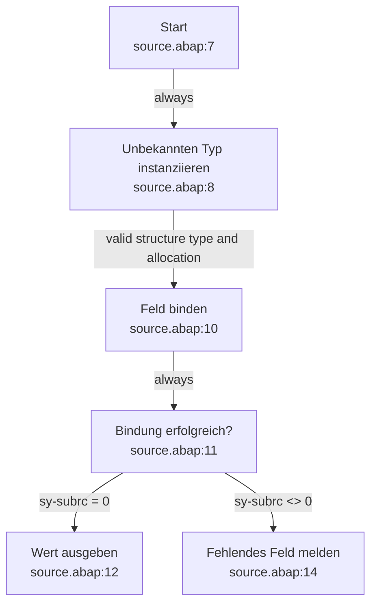
```mermaid
flowchart TD
    s["Start\nsource.abap:7"]
    t["Unbekannten Typ instanziieren\nsource.abap:8"]
    a["Feld binden\nsource.abap:10"]
    g["Bindung erfolgreich?\nsource.abap:11"]
    v["Wert ausgeben\nsource.abap:12"]
    x["Fehlendes Feld melden\nsource.abap:14"]
    s -->|"always"| t
    t -->|"valid structure type and allocation"| a
    a -->|"always"| g
    g -->|"sy-subrc = 0"| v
    g -->|"sy-subrc <> 0"| x
```

| Knoten | Typ | Quelle | Bedeutung |
|---|---|---|---|
| s | start | source.abap:7 | Start |
| t | opaque_call | source.abap:8 | Unbekannten Typ instanziieren |
| a | action | source.abap:10 | Feld binden |
| g | gateway | source.abap:11 | Bindung erfolgreich? |
| v | output | source.abap:12 | Wert ausgeben |
| x | output | source.abap:14 | Fehlendes Feld melden |

### Konkrete Handarbeit und Schätzgrenze

- **CC-020-W01**: Zugelassene Laufzeittypen und Feldnamen inklusive DDIC-Schema beschaffen
- **CC-020-W02**: CREATE-DATA-Fehler und Nichtstrukturfall zusätzlich absichern
- **CC-020-W03**: ASSIGN-Erfolg/Fehlschlag und initiale Werte verproben

Autorenannahme, nicht kalibriert: **3 / 8 / 24 Stunden** (optimistisch / wahrscheinlich / pessimistisch). Iststunden: **nicht gemessen**. Arbeitsumfang und Ausschlüsse siehe Kontext/README; diese Werte sind weder TCO-Ground-Truth noch belastbare Obergrenzen bei fehlenden Abhängigkeiten.

### Prüferfragen

- Zugelassene Laufzeittypen und Feldnamen inklusive DDIC-Schema beschaffen
- CREATE-DATA-Fehler und Nichtstrukturfall zusätzlich absichern
- ASSIGN-Erfolg/Fehlschlag und initiale Werte verproben
- Tragen alle Anker den vollständigen Fachsatz einschließlich Bedingungen und Negativpfad?
- Welche Aussage ist nur eine Fixture-Annahme und darf nicht auf den echten Kunden übertragen werden?

**Freigabe:** externe SAP-Architekturprüfung ausstehend; Quelle, Kontext, Oracle und Regelversion müssen gemeinsam gezeichnet werden.

---

## CC-021 — Fehlendes INCLUDE: keine erfundene Kreditregel

**Konstruktklassen:** K11 · **Classic:** Unknown · **Cloud-API:** unknown  
**Scope:** `intentionally_incomplete` · **Status:** nicht unabhängig freigegeben.

Quellenhash: `ae06569fe9c75606764a46ff1476c2b7321500b309e66d55176bda7bd9e90025`  
Kontexthash: `36696a252f8ec34809e6be81b58e8ecde20ea675ce1e0d9fd039d3ade27d8395`

### Quelltext `source.abap` — Zeilen zählen ab1

```abap
REPORT zcc_ref_021.
DATA gv_amount TYPE p LENGTH 9 DECIMALS 2 VALUE '10000'.
DATA gv_result TYPE c LENGTH 20.
INCLUDE zcc_ref_021_rules.
START-OF-SELECTION.
  PERFORM determine_route USING gv_amount CHANGING gv_result.
  WRITE / gv_result.
```

```text
001  REPORT zcc_ref_021.
002  DATA gv_amount TYPE p LENGTH 9 DECIMALS 2 VALUE '10000'.
003  DATA gv_result TYPE c LENGTH 20.
004  INCLUDE zcc_ref_021_rules.
005  START-OF-SELECTION.
006    PERFORM determine_route USING gv_amount CHANGING gv_result.
007    WRITE / gv_result.
```

### Sollbefunde

| ID | Regelversion | Exakter Anker | Schwere* | Sollaussage | Quellen |
|---|---|---|---|---|---|
| CC-021-F01 | R16@1.0.0 | source.abap:4 | high | Include nicht geliefert; FORM-Signatur und Verhalten nicht als bekannt ausgeben. | SAP-LEVEL, SAP-OO |

\* Der Schweregrad ist eine Korpuspriorität, keine behauptete SAP-ATC-Prioritätsnummer.

### SAP-/Repository-Objekte und Nachfolger

**ZCC_REF_021_RULES** · Eigentümer `customer` · Verwendung `missing_include`  
Anker: source.abap:4. Identität: `{"tadirObject": "PROG", "tadirObjName": "ZCC_REF_021_RULES", "objectType": "PROG", "objectKey": "ZCC_REF_021_RULES"}`.  
Cloud-Rohzustand: `not_applicable`; Classic-Rohzustand: `not_applicable`. Nachfolgerstatus: `not_applicable_customer_or_partner`.

Nachfolgerliste: `[]` **mit obiger Statusbegründung**, nicht pauschal „kein Nachfolger existiert“.

### Fachliche Ground-Truth-Kandidaten

**CC-021-B01** — Der Report benötigt das nicht gelieferte Include zcc_ref_021_rules.  
Anker: source.abap:4. Kontext: /business_scope, /execution_assumptions, /missing_dependencies.

**CC-021-B02** — Betrag und Ergebnisfeld werden an determine_route übergeben; die eigentliche Regel ist unbekannt.  
Anker: source.abap:6. Kontext: /business_scope, /execution_assumptions, /missing_dependencies.

### Erwartetes Prozessskelett

Dies ist der normalisierte prozedurale As-is-Scope, kein importgeprüftes BPMN und keine tatsächliche Ausführung. Die Kantenbedingungen sind Teil des Sollvertrags.

```mermaid
flowchart TD
    s["Start bei vollständig aktiviertem System\nsource.abap:5"]
    p["Unbekannte FORM\nsource.abap:6"]
    o["Ergebnis nach Rückkehr\nsource.abap:7"]
    s -->|"always"| p
    p -->|"normal return"| o
```

| Knoten | Typ | Quelle | Bedeutung |
|---|---|---|---|
| s | start | source.abap:5 | Start bei vollständig aktiviertem System |
| p | opaque_call | source.abap:6 | Unbekannte FORM |
| o | output | source.abap:7 | Ergebnis nach Rückkehr |

### Konkrete Handarbeit und Schätzgrenze

- **CC-021-W01**: Exaktes Include mit Quellhash beschaffen
- **CC-021-W02**: FORM-Signatur und Datenfluss des CHANGING-Parameters prüfen
- **CC-021-W03**: Anker und Skelett nach Include-Ergänzung neu freigeben

Autorenannahme, nicht kalibriert: **2 / 6 / 20 Stunden** (optimistisch / wahrscheinlich / pessimistisch). Iststunden: **nicht gemessen**. Arbeitsumfang und Ausschlüsse siehe Kontext/README; diese Werte sind weder TCO-Ground-Truth noch belastbare Obergrenzen bei fehlenden Abhängigkeiten.

### Prüferfragen

- Exaktes Include mit Quellhash beschaffen
- FORM-Signatur und Datenfluss des CHANGING-Parameters prüfen
- Anker und Skelett nach Include-Ergänzung neu freigeben
- Tragen alle Anker den vollständigen Fachsatz einschließlich Bedingungen und Negativpfad?
- Welche Aussage ist nur eine Fixture-Annahme und darf nicht auf den echten Kunden übertragen werden?

**Freigabe:** externe SAP-Architekturprüfung ausstehend; Quelle, Kontext, Oracle und Regelversion müssen gemeinsam gezeichnet werden.

---

## CC-022 — Partner-Namespace: fehlende Quelle ist kein SAP-internes C

**Konstruktklassen:** K11 · **Classic:** Unknown · **Cloud-API:** unknown  
**Scope:** `intentionally_incomplete` · **Status:** nicht unabhängig freigegeben.

Quellenhash: `370c6eb448994d4c179e4fc406e2a576f68da4baa7541a415a573cf10e7b382f`  
Kontexthash: `b59925f88ecabd2fcdd802183157648a9b6087f961d2245257dce6c8aa2bb8d2`

### Quelltext `source.abap` — Zeilen zählen ab1

```abap
REPORT zcc_ref_022.
DATA lv_result TYPE string.
START-OF-SELECTION.
  lv_result = /acme/cl_route=>determine( iv_amount = 25000 ).
  WRITE / lv_result.
```

```text
001  REPORT zcc_ref_022.
002  DATA lv_result TYPE string.
003  START-OF-SELECTION.
004    lv_result = /acme/cl_route=>determine( iv_amount = 25000 ).
005    WRITE / lv_result.
```

### Sollbefunde

| ID | Regelversion | Exakter Anker | Schwere* | Sollaussage | Quellen |
|---|---|---|---|---|---|
| CC-022-F01 | R16@1.0.0 | source.abap:4 | high | Partnerklasse im expliziten /ACME/-Fixture-Namespace fehlt. Nicht allein wegen Nicht-Z-Präfix als SAP-Objekt C einstufen. | SAP-LEVEL, SAP-OO |

\* Der Schweregrad ist eine Korpuspriorität, keine behauptete SAP-ATC-Prioritätsnummer.

**Explizit unzulässige Schlussfolgerungen:**

- `source.abap:4` — Kein direkter Tabellenzugriff und keine begründete SAP-intern-Einstufung.

### SAP-/Repository-Objekte und Nachfolger

**/ACME/CL_ROUTE** · Eigentümer `partner` · Verwendung `missing_partner_class`  
Anker: source.abap:4. Identität: `{"tadirObject": "CLAS", "tadirObjName": "/ACME/CL_ROUTE", "objectType": "CLAS", "objectKey": "/ACME/CL_ROUTE"}`.  
Cloud-Rohzustand: `not_applicable`; Classic-Rohzustand: `not_applicable`. Nachfolgerstatus: `not_applicable_customer_or_partner`.

Nachfolgerliste: `[]` **mit obiger Statusbegründung**, nicht pauschal „kein Nachfolger existiert“.

### Fachliche Ground-Truth-Kandidaten

**CC-022-B01** — Ein statisch benannter Partneraufruf erhält den Betrag25000.  
Anker: source.abap:4. Kontext: /business_scope, /execution_assumptions, /missing_dependencies.

**CC-022-B02** — Der Rückgabewert wird ausgegeben; die Partnerimplementierung bleibt unbekannt.  
Anker: source.abap:5. Kontext: /business_scope, /execution_assumptions, /missing_dependencies.

### Erwartetes Prozessskelett

Dies ist der normalisierte prozedurale As-is-Scope, kein importgeprüftes BPMN und keine tatsächliche Ausführung. Die Kantenbedingungen sind Teil des Sollvertrags.

```mermaid
flowchart TD
    s["Start\nsource.abap:3"]
    p["Partnerregel aufrufen\nsource.abap:4"]
    o["Rückgabe ausgeben\nsource.abap:5"]
    s -->|"always"| p
    p -->|"normal return"| o
```

| Knoten | Typ | Quelle | Bedeutung |
|---|---|---|---|
| s | start | source.abap:3 | Start |
| p | opaque_call | source.abap:4 | Partnerregel aufrufen |
| o | output | source.abap:5 | Rückgabe ausgeben |

### Konkrete Handarbeit und Schätzgrenze

- **CC-022-W01**: Ownership und freigegebenen Vertrag des Partner-Namespace dokumentieren
- **CC-022-W02**: Partnerquelle oder belastbare externe API-Spezifikation beschaffen
- **CC-022-W03**: Fehlende Partnerquelle nie als bekannte SAP-interne Implementierung darstellen

Autorenannahme, nicht kalibriert: **2 / 8 / 32 Stunden** (optimistisch / wahrscheinlich / pessimistisch). Iststunden: **nicht gemessen**. Arbeitsumfang und Ausschlüsse siehe Kontext/README; diese Werte sind weder TCO-Ground-Truth noch belastbare Obergrenzen bei fehlenden Abhängigkeiten.

### Prüferfragen

- Ownership und freigegebenen Vertrag des Partner-Namespace dokumentieren
- Partnerquelle oder belastbare externe API-Spezifikation beschaffen
- Fehlende Partnerquelle nie als bekannte SAP-interne Implementierung darstellen
- Tragen alle Anker den vollständigen Fachsatz einschließlich Bedingungen und Negativpfad?
- Welche Aussage ist nur eine Fixture-Annahme und darf nicht auf den echten Kunden übertragen werden?

**Freigabe:** externe SAP-Architekturprüfung ausstehend; Quelle, Kontext, Oracle und Regelversion müssen gemeinsam gezeichnet werden.

---

## CC-023 — Direktes SAP-UPDATE mit Testmodus: D trotz CDS-Nachfolger

**Konstruktklassen:** K01 · **Classic:** D · **`known_worst_level`:** D (beobachtet: UPDATE KNA1, F01) · **`cloud_api_surface`:** not_usable (KNA1) · **`cloud_artefact`:** not_activatable (REPORT, PARAMETERS, WRITE)  
**Scope:** `complete_for_declared_slice` · **Status:** candidate / not independently signed.

**Konvergenz:** v1-Fall (von allen vier Modellreviews gelesen und angegriffen) · Fable KA-102 (ALPHA; v2 §11.4) · Gegenreview REV2-10  
**Beleggrad:** konstruiert (synthetisch). Verifiziert sind Syntax und Objekte: `UPDATE … SET … WHERE`, `COMMIT WORK AND WAIT`, `ROLLBACK WORK`, KNA1 mit KUNNR und NAME1; KUNNR trägt über Datenelement/Domäne die Konvertierungsroutine ALPHA (v2 §11.4), ein `PARAMETERS … TYPE c LENGTH 10` hat keine Domäne und damit keine Konvertierungsroutine.  
**Zielprofil:** edition=onpremise-s4 · abap_language_version=standard · release=S/4HANA 2023 (v1: „S/4HANA, PCE2022-Katalog") · catalog_revision=PCE2022-objectReleaseInfo · rule_revision=2.1.0-candidate  
**Zweites Profil:** onpremise-s4 · abap-for-cloud: `cloud_artefact = not_activatable` — ausführbares Programm mit Selektionsbild und Listausgabe, zusätzlich UPDATE auf ein nicht freigegebenes Objekt. Kein A–D-Level dort (`assessment_applicable = false`). Das As-is-Skelett bleibt in beiden Profilen gültig (`source_process = reconstructed`, REV2-12).  
**Unabhängigkeit:** modellreview · gegenreview · sap-doku (S01 Leveldefinition, S15 ALPHA-Konvertierung)

Quellenhash: `2d09e72b740dda8b3314f5717dc0b7ea4d5e61c47724b27562a2780bce89766d`
Kontexthash: `n/a — der Kontext (Zielprofil, Profilannahmen) steht im Fall selbst; ein Kontexthash entsteht mit dem maschinenlesbaren Fallbündel`

**Korrektur v2.1 (Fallbogen CC-023 / REV2-10):** vorher stand die ALPHA-Korrektur nur in v2 §11.4 und die Ankerkorrektur nur in §11.7, der Fallkörper trug weiter die unbedingte B02 und den Anker `source.abap:10` → jetzt ist dieser Fallkörper die einzige kanonische Fassung; §11.4 und §11.7 sind hier eingearbeitet → warum: ein Importer liest den Fallkörper, nicht die Vorrangregel „wo §11 korrigiert, gilt §11" (REV2-10: „Menschen und Importer können verschiedene Oracles verwenden").

**Profilannahmen:** Für dieses synthetische Profil ist KNA1 als intern und nicht classicAPI/noAPI stipuliert. Release-Zustand und typisierter Nachfolger sind beobachtet; das Fehlen aus dem vollständigen Classic-Katalog bleibt unabhängig zu prüfen. **Ergänzt v2.1:** Die Eingabe `p_kunnr` wird mit dem gespeicherten Schlüssel als Zeichenkette verglichen — ohne Konvertierungsroutine. Für einen **numerischen** Kundenschlüssel ist deshalb die interne, zehnstellig nullaufgefüllte Eingabe (`0000001000`) Ausführungsannahme; ein **alphanumerischer** Schlüssel (`ABC123`) trifft in seiner eingegebenen Schreibweise (S15: numerische und nicht numerische ALPHA-Schlüssel werden verschieden behandelt). Das ist eine Aussage über das Fixture, kein Codeverhalten.

### Quelltext `source.abap` — Zeilen zählen ab 1

```abap
REPORT zcc_ref_023.
PARAMETERS p_kunnr TYPE c LENGTH 10.
PARAMETERS p_name TYPE c LENGTH 35 LOWER CASE.
PARAMETERS p_test AS CHECKBOX DEFAULT 'X'.
START-OF-SELECTION.
  IF p_test = 'X'.
    WRITE / 'SIMULATION_ONLY'.
    RETURN.
  ENDIF.
  UPDATE kna1 SET name1 = @p_name WHERE kunnr = @p_kunnr.
  IF sy-subrc = 0.
    COMMIT WORK AND WAIT.
    WRITE / 'UPDATE_COMMITTED'.
  ELSE.
    ROLLBACK WORK.
    WRITE / 'NO_UPDATE'.
  ENDIF.
```

```text
001  REPORT zcc_ref_023.
002  PARAMETERS p_kunnr TYPE c LENGTH 10.
003  PARAMETERS p_name TYPE c LENGTH 35 LOWER CASE.
004  PARAMETERS p_test AS CHECKBOX DEFAULT 'X'.
005  START-OF-SELECTION.
006    IF p_test = 'X'.
007      WRITE / 'SIMULATION_ONLY'.
008      RETURN.
009    ENDIF.
010    UPDATE kna1 SET name1 = @p_name WHERE kunnr = @p_kunnr.
011    IF sy-subrc = 0.
012      COMMIT WORK AND WAIT.
013      WRITE / 'UPDATE_COMMITTED'.
014    ELSE.
015      ROLLBACK WORK.
016      WRITE / 'NO_UPDATE'.
017    ENDIF.
```

### Sollbefunde

| ID | Regelversion | Exakter Anker | Schwere* | Sollaussage | Quellen |
|---|---|---|---|---|---|
| CC-023-F01 | R02@1.0.0 | source.abap:10+1 (Tabellentoken; Sekundäranker: source.abap:10) | high | Direktes Schreiben auf SAP-Tabelle KNA1 ist D; der gelistete Lesenachfolger I_CUSTOMER ersetzt dieses Update nicht. D hängt am Vorhandensein des nicht unterstützten Schreibwegs im Programm, nicht an einem beobachteten erfolgreichen Schreibversuch — der Testmodus umgeht ihn nur im gewählten Pfad. | SAP-LEVEL, SAP-SQL; S01 |
| CC-023-F02 | R19@1.1.0; R25@2.1.0 (Achsen 1, 4) | source.abap:12 | info | Transaktionsabschluss ist Teil der Semantik; der Testmodus (Zeile 6) überspringt den gesamten Schreibpfad. COMMIT WORK AND WAIT beendet die Datenbank-LUW (`db_luw`); `AND WAIT` betrifft die Achse `dispatch` und hat hier nichts abzuwarten — es gibt keine Verbuchungsregistrierung. Es ist kein Beleg für die fachliche Richtigkeit der Änderung. | SAP-FLOW, SAP-CALL, SAP-SCREEN; S09 |
| CC-023-F03 | R18@1.0.0 (Regelträger vorläufig — siehe Offene Prüferfragen) | source.abap:2 (Sekundäranker: source.abap:10+9, Token `@p_kunnr`) | medium | `p_kunnr` ist generisch `c LENGTH 10` ohne DDIC-Bezug: keine Konvertierungsroutine am Eingabefeld, während KNA1-KUNNR ALPHA trägt. Ob `WHERE kunnr = @p_kunnr` trifft, ist datenabhängig: ein numerischer Schlüssel nur in interner, nullaufgefüllter Form; ein alphanumerischer Schlüssel ohne Nullauffüllung. | SAP-ABAPDOC (Konvertierungsroutinen); S15 |

\* Der Schweregrad ist eine Korpuspriorität, keine behauptete SAP-ATC-Prioritätsnummer.

**Korrektur v2.1 (v2 §11.7 / Fallbogen CC-023):** F01 vorher `source.abap:10` → jetzt `source.abap:10+1` (Tabellentoken, Sekundäranker :10) → warum: Ankerkonvention §11.0, wie für CC-001/CC-002/CC-007/CC-008 in §11 beschlossen und dort nicht in den Fallkörper übernommen.  
**Korrektur v2.1 (Fallbogen CC-023 §2):** F03 neu → warum: das Review führt „Schlüsselformat" als eigenen Befund an Zeile 10 (Regel R18, mittel); v2 §11.4 hatte den Befund als „statisch ableitbar, ohne v1-Träger" benannt und nicht ausgearbeitet. Übernommen mit Änderung: Anker auf die Deklaration (Zeile 2, dort entsteht die fehlende Konvertierung), Zeile 10 als Sekundäranker; Regelträger R18 als Vorschlag des Reviews, nicht als Entscheidung.

**Explizit unzulässige Schlussfolgerungen** (neu in v2.1; v1 hatte diesen Block nicht):

- `source.abap:10` — kein Fachsatz „der angegebene Kunde wird geändert" ohne die drei Bedingungen Testmodus abgewählt, Treffer, Eingabeformat (B02).
- `source.abap:2` — kein Regelsatz „ohne führende Nullen kein Treffer" für jeden Schlüssel; die Aussage gilt nur für numerische Schlüssel (S15). Eine Engine, die ihn allgemein lernt, antwortet bei CC-057/CC-060 falsch.
- `source.abap:12` — kein Befund „Commit-Ergebnis nicht geprüft" als Fehler. Die fehlende Prüfung wird beschrieben (B03), nicht als Defekt gewertet: es gibt in dieser Scheibe keine Verbuchungsregistrierung, deren Erfolg nach dem Commit zu prüfen wäre.
- gesamte Scheibe — kein `security_and_authorization`-Befund „Berechtigungsprüfung fehlt": im Slice ist keine sichtbar; das belegt nicht, dass keine greift (Start-, Tabellen- und Hostkontext liegen außerhalb der Scheibe). R28@2.1.0 verlangt Beobachtung, Datenfluss und Schutzmaßnahme — eine Abwesenheit im Slice ist keine Beobachtung.

### SAP-/Repository-Objekte und Nachfolger

**KNA1** · Eigentümer `SAP` · Verwendung `write`  
Anker: source.abap:10+1 (Sekundäranker: source.abap:10). Identität: `{"tadirObject": "TABL", "tadirObjName": "KNA1", "objectType": "TABL", "objectKey": "KNA1"}`.  
Cloud-Rohzustand: `notToBeReleased`; Classic-Rohzustand: `not_asserted`. Nachfolgerstatus: `listed` — Lesenachfolger, keine Schreib-API (Drop-in für UPDATE: nein).

```json
[
  {
    "tadirObject": "DDLS",
    "tadirObjName": "I_CUSTOMER",
    "objectType": "CDS_STOB",
    "objectKey": "I_CUSTOMER"
  }
]
```

Quelle: SAP-PCE22; 136428–136446. Das Gegenreview hat denselben Eintrag in der Webansicht bestätigt (S19: `notToBeReleased`, `successorClassification = oneObject`, Nachfolger I_CUSTOMER) — Abschrift, kein archivierter Snapshot.

### Fachliche Ground-Truth-Kandidaten

**CC-023-B01** — Im Testmodus (`p_test = 'X'`) wird SIMULATION_ONLY ausgegeben und vor dem UPDATE zurückgekehrt; es findet keine Datenbankänderung statt. Die Vorbelegung `'X'` ist ein Default, kein dauerhaftes Schreibverbot: der Benutzer kann sie im Selektionsbild abwählen.  
Anker: source.abap:4, source.abap:6, source.abap:7, source.abap:8. Kontext: /business_scope, /execution_assumptions.

**Korrektur v2.1 (Fallbogen CC-023, B01 „stimme zu"):** vorher „Der voreingestellte Testmodus führt keine Datenbankänderung aus." → jetzt mit dem Zusatz, dass `DEFAULT 'X'` Vorbelegung und kein Schreibverbot ist, und mit Anker auf Zeile 4 → warum: die alte Fassung ließ die Lesart „das Programm schreibt nie" zu.

**CC-023-B02** — Außerhalb des Testmodus (`p_test <> 'X'`, Zweig ab Zeile 6) wird versucht, NAME1 der KNA1-Zeile zu ändern, deren KUNNR exakt der eingegebenen zehnstelligen Zeichenkette entspricht. Nur bei Treffer (`sy-subrc = 0`) folgt der Commit-Zweig (B03). `p_kunnr` ist ohne DDIC-Bezug deklariert und erhält keine ALPHA-Konvertierung (F03): für einen **numerischen** Kundenschlüssel trifft nur die Eingabe im internen, nullaufgefüllten Format (Vektor `1000` → kein Treffer, `0000001000` → Treffer); ein **alphanumerischer** Schlüssel braucht keine Nullauffüllung und trifft in der eingegebenen Schreibweise (Gegenvektor `ABC123`). Ein Treffer ist vom Code nicht garantiert.  
Anker: source.abap:10, source.abap:2, source.abap:6, source.abap:11. Kontext: /business_scope, /execution_assumptions (Eingabeformat); Bedingung: `p_test <> 'X'`. Achse: `db_luw` (direkte Datenbankänderung, kein Verbuchungsbaustein); Behauptungsstärke: **Versuch** — „Zeilen betroffen" erst mit `sy-subrc = 0` (B03).

**Korrektur v2.1 (Fallbogen CC-023 / REV2-10; v2 §11.4):** vorher (v1 und v2-Fallkörper) „Außerhalb des Testmodus wird NAME1 des angegebenen Kunden direkt in KNA1 geändert." → v2 §11.4(b) schlug vor: „…dessen Schlüssel exakt der eingegebenen zehnstelligen Zeichenkette entspricht. Eine Eingabe ohne führende Nullen trifft keinen Satz …" → jetzt: Versuch statt Änderung, Treffer als Bedingung, Nullauffüllung nur für numerische Schlüssel, alphanumerischer Gegenvektor → warum: die v1-Fassung war unbedingt (Fable KA-102, vom Review als „widerspreche der Unbedingtheit" bestätigt); die §11.4-Fassung war ein neuer Überall-Satz, der für zulässige alphanumerische Schlüssel falsch ist (S15). Die Vektoren stehen unter „Zusätzliche fachliche Prüfeingaben".

**CC-023-B03** — Bei `sy-subrc = 0` nach dem UPDATE wird COMMIT WORK AND WAIT aufgerufen, sonst ROLLBACK WORK. Eine separate Prüfung des Commit-Ergebnisses ist nicht sichtbar; der Code hat keine weitere fachliche Ergebnisprüfung. Das ist eine Beschreibung, kein Defektbefund.  
Anker: source.abap:11, source.abap:12, source.abap:15, source.abap:10–17. Kontext: /business_scope, /execution_assumptions. Achse: `db_luw`; Behauptungsstärke: bei `sy-subrc = 0` **Zeilen betroffen** (mindestens eine) und **Commit erfolgt**; nicht *fachlich bestätigt*. Im ROLLBACK-Zweig: Rollback belegt → „nicht persistiert" zulässig (R25@2.1.0 Achse 5).

### Zusätzliche fachliche Prüfeingaben

```json
{
  "kind": "input_format_fixture_only",
  "note": "Zeichenvergleich ohne Konvertierungsroutine; kein SAP-Lauf. Das Gegenreview hat die drei Formatrichtungen lokal als Zeichenvergleich nachgestellt (tools/test_countermodels.py: test_unconverted_numeric_short_input_misses_canonical_numeric, test_canonical_numeric_input_matches, test_alphanumeric_key_can_match_without_zeroes) — eine Python-Nachstellung, kein SAP-Beleg und keine vollständige ALPHA-Routine.",
  "vectors": [
    { "p_kunnr": "1000",       "p_test": " ", "kna1_row_kunnr": "0000001000", "expected_sy_subrc": 4, "expected_path": "ROLLBACK WORK", "expected_output": "NO_UPDATE", "note": "numerischer Schlüssel ohne Nullauffüllung: kein Treffer" },
    { "p_kunnr": "0000001000", "p_test": " ", "kna1_row_kunnr": "0000001000", "expected_sy_subrc": 0, "expected_path": "COMMIT WORK AND WAIT", "expected_output": "UPDATE_COMMITTED" },
    { "p_kunnr": "ABC123",     "p_test": " ", "kna1_row_kunnr": "ABC123",     "expected_sy_subrc": 0, "expected_path": "COMMIT WORK AND WAIT", "expected_output": "UPDATE_COMMITTED", "note": "alphanumerischer Schlüssel: keine Nullauffüllung, der Vergleich trifft in der eingegebenen Schreibweise (S15)" },
    { "p_kunnr": "0000001000", "p_test": "X", "kna1_row_kunnr": "0000001000", "expected_path": "RETURN vor UPDATE", "expected_output": "SIMULATION_ONLY" }
  ]
}
```

### Erwartetes Prozessskelett

Dies ist der normalisierte prozedurale As-is-Scope, kein importgeprüftes BPMN und keine tatsächliche Ausführung. Die Kantenbedingungen sind Teil des Sollvertrags. Das Skelett gilt in beiden Profilen als `source_process`; im Zweitprofil gibt es kein Zielausführungsmodell.

```mermaid
flowchart TD
    s["Start\nsource.abap:5"]
    t["Testmodus?\nsource.abap:6"]
    so["SIMULATION_ONLY melden\nsource.abap:7"]
    x["Simulation ohne Schreiben\nsource.abap:8"]
    u["Name ändern (Versuch)\nsource.abap:10"]
    g["Update erfolgreich?\nsource.abap:11"]
    c["Commit\nsource.abap:12"]
    r["Rollback\nsource.abap:15"]
    ok["Commit melden\nsource.abap:13"]
    no["Kein Update melden\nsource.abap:16"]
    s -->|"always"| t
    t -->|"p_test = 'X'"| so
    so -->|"always"| x
    t -->|"p_test <> 'X'"| u
    u -->|"always"| g
    g -->|"sy-subrc = 0"| c
    g -->|"sy-subrc <> 0"| r
    c -->|"always"| ok
    r -->|"always"| no
```

| Knoten | Typ | Quelle | Bedeutung |
|---|---|---|---|
| s | start | source.abap:5 | Start |
| t | gateway | source.abap:6 | Testmodus? |
| so | output | source.abap:7 | SIMULATION_ONLY melden |
| x | end | source.abap:8 | Simulation ohne Schreiben |
| u | write | source.abap:10 | Name ändern — Versuch; Treffer eingabeabhängig (B02) |
| g | gateway | source.abap:11 | Update erfolgreich? |
| c | transaction | source.abap:12 | COMMIT WORK AND WAIT |
| r | transaction | source.abap:15 | ROLLBACK WORK |
| ok | output | source.abap:13 | Commit melden |
| no | output | source.abap:16 | Kein Update melden |

**Korrektur v2.1 (Fallbogen CC-023 §5):** vorher war die Ausgabe SIMULATION_ONLY (Zeile 7) im Endknoten `x` verdichtet → jetzt eigener Ausgabeknoten `so` → warum: das Review lässt beide Formen zu, „sofern der Abstraktionsvertrag dies zulässt"; der Korpus legt sich auf eine fest, und die v2-Konvention ist ein Ausgabeknoten je WRITE (CC-034, CC-035, CC-038).

### Konkrete Handarbeit und Schätzgrenze

- **CC-023-W01**: Direktupdate durch einen unterstützten fachlichen Schreibweg ersetzen; welcher das im Zielrelease ist, ist nicht untersucht (Fallbogen §7)
- **CC-023-W02**: Testmodus, fehlenden Kunden, Berechtigungen, Sperren und Transaktionsverhalten prüfen — Berechtigungs-, Sperr- und Validierungskonzept liegen außerhalb der Scheibe
- **CC-023-W03**: I_CUSTOMER nicht als automatisch geeignete Schreib-API ausgeben
- **CC-023-W04**: Eingabeformat klären: Prüfvektoren numerisch/alphanumerisch im Zielsystem verproben; falls nur numerische Schlüssel vorkommen, Eingabe auf einen DDIC-Typ mit ALPHA umstellen

Autorenannahme, nicht kalibriert: **6 / 16 / 40 Stunden** (optimistisch / wahrscheinlich / pessimistisch). Iststunden: **nicht gemessen**. Arbeitsumfang und Ausschlüsse siehe Kontext/README; diese Werte sind weder TCO-Ground-Truth noch belastbare Obergrenzen bei fehlenden Abhängigkeiten.

### Prüferfragen — vom Gegenreview beantwortet

- **ALPHA-Korrektur aus §11 übernehmen?** → Ja zur Bedingung und zum Testfall `1000` gegen `0000001000`; nein zum universellen Satz „ohne führende Nullen kein Treffer" — alphanumerische Schlüssel können korrekt ohne Nullen stehen (S15). **Entscheidung:** übernommen (B02, F03, Prüfvektoren).
- **Ist §11 konsolidiert?** → Nein, Stand v2. **Entscheidung:** übernommen; in v2.1 erledigt (Korrekturzeile am Fallkopf).
- **Commit-Ergebnis extra prüfen?** → Beschreiben, nicht automatisch als Fehler werten; im direkten SQL-Slice gibt es keine Update-Task-Registrierung. **Entscheidung:** übernommen (B03 unverändert, unzulässige Schlussfolgerung ergänzt).
- **Tragen alle Anker den vollständigen Fachsatz einschließlich Bedingungen und Negativpfad?** → Fallbogen §4 nennt für B02 die Anker 2, 10–13. **Entscheidung:** übernommen (Anker :2, :6, :11 an B02 ergänzt).
- **Welche Aussage ist nur Fixture-Annahme?** → Eingabeformat und Schlüssel-/Datendomäne im konkreten System; D braucht dagegen keinen beobachteten Schreibversuch. **Entscheidung:** übernommen (Profilannahmen).

### Offene Prüferfragen

- Regelträger für F03: reicht R18 (Vorschlag des Reviews), oder braucht das Register einen eigenen Eintrag „Eingabefeld ohne Konvertierungsroutine gegen ALPHA-Schlüsselfeld"? v2 §11.4 hat gemeldet, dass keine v1-Regel den Befund trägt. Entscheidung beim Zusammenführer.
- Welche unterstützte fachliche Schreib-API ersetzt das Update im Zielrelease (W01)? Nicht untersucht — weder vom Autor noch vom Review.
- Native Verprobung der vier Prüfvektoren: bisher nur Zeichenvergleich (Autor) und Python-Nachstellung (Review), kein SAP-Lauf.

**Freigabestatus:** candidate / not independently signed. Geprüft durch: v1-Autor; Modellreviews Grok/GLM/Fable/DeepSeek; §11-Korrekturprüfung (v2); Gegenreview REVIEW-2.0.1 (nicht blind, KI). Nicht geprüft durch: externen SAP-Architekten.

---

## CC-024 — Eigene Persistenz: keine automatische CAP-Pflicht

**Konstruktklassen:** K02 · **Classic:** B · **Cloud-API:** unknown  
**Scope:** `complete_for_declared_slice` · **Status:** nicht unabhängig freigegeben.

Quellenhash: `c22b8aef90ba9021dadb19cdb6d0cf4b88eaad22715ade6264989305df7d474f`  
Kontexthash: `80b4fff8f08c4a960fb2a488fb8032d7a146f3d2c70248d5b39b52008988f092`

### Quelltext `source.abap` — Zeilen zählen ab1

```abap
REPORT zcc_ref_024.
PARAMETERS p_id TYPE c LENGTH 10.
PARAMETERS p_route TYPE c LENGTH 20.
PARAMETERS p_test AS CHECKBOX DEFAULT 'X'.
START-OF-SELECTION.
  IF p_test = 'X'.
    WRITE / 'SIMULATION_ONLY'.
    RETURN.
  ENDIF.
  UPDATE zcc_decision SET route = @p_route WHERE case_id = @p_id.
  IF sy-subrc = 0.
    COMMIT WORK AND WAIT.
    WRITE / 'RECORDED'.
  ELSE.
    ROLLBACK WORK.
    WRITE / 'MISSING_CASE'.
  ENDIF.
```

```text
001  REPORT zcc_ref_024.
002  PARAMETERS p_id TYPE c LENGTH 10.
003  PARAMETERS p_route TYPE c LENGTH 20.
004  PARAMETERS p_test AS CHECKBOX DEFAULT 'X'.
005  START-OF-SELECTION.
006    IF p_test = 'X'.
007      WRITE / 'SIMULATION_ONLY'.
008      RETURN.
009    ENDIF.
010    UPDATE zcc_decision SET route = @p_route WHERE case_id = @p_id.
011    IF sy-subrc = 0.
012      COMMIT WORK AND WAIT.
013      WRITE / 'RECORDED'.
014    ELSE.
015      ROLLBACK WORK.
016      WRITE / 'MISSING_CASE'.
017    ENDIF.
```

### Sollbefunde

| ID | Regelversion | Exakter Anker | Schwere* | Sollaussage | Quellen |
|---|---|---|---|---|---|
| CC-024-F01 | R20@1.0.0 | source.abap:10 | info | Kundeneigene Tabelle mit geliefertem Schema; eigener Schreibzugriff ist kein SAP-Standardtabellen-D und erzwingt kein CAP. | SAP-LEVEL, SAP-SQL |
| CC-024-F02 | R19@1.0.0 | source.abap:12 | info | Entwurfsstatus speichern und fachliche Genehmigung sind verschiedene Aussagen. | SAP-FLOW, SAP-CALL, SAP-SCREEN |

\* Der Schweregrad ist eine Korpuspriorität, keine behauptete SAP-ATC-Prioritätsnummer.

### SAP-/Repository-Objekte und Nachfolger

**ZCC_DECISION** · Eigentümer `customer` · Verwendung `customer_table_write`  
Anker: source.abap:10. Identität: `{"tadirObject": "TABL", "tadirObjName": "ZCC_DECISION", "objectType": "TABL", "objectKey": "ZCC_DECISION"}`.  
Cloud-Rohzustand: `not_applicable`; Classic-Rohzustand: `not_applicable`. Nachfolgerstatus: `not_applicable_customer_or_partner`.

Nachfolgerliste: `[]` **mit obiger Statusbegründung**, nicht pauschal „kein Nachfolger existiert“.

### Fachliche Ground-Truth-Kandidaten

**CC-024-B01** — Eine existierende Zeile der kundeneigenen Tabelle erhält den eingegebenen Routentext.  
Anker: source.abap:10. Kontext: /business_scope, /execution_assumptions.

**CC-024-B02** — Wenn UPDATE keine passende Zeile trifft, wird MISSING_CASE ausgegeben; der Code legt keine neue Zeile an.  
Anker: source.abap:16, source.abap:11–16. Kontext: /business_scope, /execution_assumptions.

**CC-024-B03** — RECORDED bestätigt in diesem Code den Speicherpfad, nicht eine organisatorisch mandatierte Entscheidung.  
Anker: source.abap:13, source.abap:11–13. Kontext: /business_scope, /execution_assumptions.

### Erwartetes Prozessskelett

Dies ist der normalisierte prozedurale As-is-Scope, kein importgeprüftes BPMN und keine tatsächliche Ausführung. Die Kantenbedingungen sind Teil des Sollvertrags.

```mermaid
flowchart TD
    s["Start\nsource.abap:5"]
    t["Testmodus?\nsource.abap:6"]
    x["Ohne Schreiben enden\nsource.abap:8"]
    u["Eigene Zeile ändern\nsource.abap:10"]
    g["Zeile geändert?\nsource.abap:11"]
    c["Commit\nsource.abap:12"]
    r["Rollback\nsource.abap:15"]
    ok["Gespeichert melden\nsource.abap:13"]
    no["Fehlenden Fall melden\nsource.abap:16"]
    s -->|"always"| t
    t -->|"p_test = 'X'"| x
    t -->|"p_test <> 'X'"| u
    u -->|"always"| g
    g -->|"sy-subrc = 0"| c
    g -->|"sy-subrc <> 0"| r
    c -->|"always"| ok
    r -->|"always"| no
```

| Knoten | Typ | Quelle | Bedeutung |
|---|---|---|---|
| s | start | source.abap:5 | Start |
| t | gateway | source.abap:6 | Testmodus? |
| x | end | source.abap:8 | Ohne Schreiben enden |
| u | write | source.abap:10 | Eigene Zeile ändern |
| g | gateway | source.abap:11 | Zeile geändert? |
| c | transaction | source.abap:12 | Commit |
| r | transaction | source.abap:15 | Rollback |
| ok | output | source.abap:13 | Gespeichert melden |
| no | output | source.abap:16 | Fehlenden Fall melden |

### Konkrete Handarbeit und Schätzgrenze

- **CC-024-W01**: Kundeneigene DDIC-Tabelle und Schlüssel clientabhängig einrichten
- **CC-024-W02**: UPDATE versus INSERT und Commit/Rollback fachlich verifizieren
- **CC-024-W03**: On-stack/Side-by-Side erst mit Zielkontext, Betrieb und Kosten vergleichen

Autorenannahme, nicht kalibriert: **4 / 8 / 20 Stunden** (optimistisch / wahrscheinlich / pessimistisch). Iststunden: **nicht gemessen**. Arbeitsumfang und Ausschlüsse siehe Kontext/README; diese Werte sind weder TCO-Ground-Truth noch belastbare Obergrenzen bei fehlenden Abhängigkeiten.

### Prüferfragen

- Kundeneigene DDIC-Tabelle und Schlüssel clientabhängig einrichten
- UPDATE versus INSERT und Commit/Rollback fachlich verifizieren
- On-stack/Side-by-Side erst mit Zielkontext, Betrieb und Kosten vergleichen
- Tragen alle Anker den vollständigen Fachsatz einschließlich Bedingungen und Negativpfad?
- Welche Aussage ist nur eine Fixture-Annahme und darf nicht auf den echten Kunden übertragen werden?

**Freigabe:** externe SAP-Architekturprüfung ausstehend; Quelle, Kontext, Oracle und Regelversion müssen gemeinsam gezeichnet werden.

---

## CC-025 — Business-Gegenprobe: Währung, Nachtregel, Grenzen und nur Routing

**Konstruktklassen:** K02 · **Classic:** B · **Cloud-API:** not_applicable  
**Scope:** `complete_for_declared_slice` · **Status:** nicht unabhängig freigegeben.

Quellenhash: `67c8d9540ec79b4a271a788e5e546a6af8c7078d1de83f12359b2c910c922c22`  
Kontexthash: `313c0a5344d6c2f969821d6f46c8b7887fb945c590efc37038b64957adff00ca`

### Quelltext `source.abap` — Zeilen zählen ab1

```abap
REPORT zcc_ref_025.
PARAMETERS p_amount TYPE p LENGTH 9 DECIMALS 2 DEFAULT '50000'.
PARAMETERS p_curr TYPE c LENGTH 3 DEFAULT 'EUR'.
PARAMETERS p_urgent AS CHECKBOX.
PARAMETERS p_night AS CHECKBOX.
PARAMETERS p_deleg AS CHECKBOX.
DATA lv_route TYPE string.
START-OF-SELECTION.
  IF p_amount < 0.
    lv_route = 'INVALID_AMOUNT'.
  ELSEIF p_curr <> 'EUR'.
    lv_route = 'CURRENCY_REVIEW'.
  ELSEIF p_urgent = 'X' AND p_amount <= 50000.
    IF p_night = 'X' AND p_deleg <> 'X'.
      lv_route = 'DELEGATE_REQUIRED'.
    ELSE.
      lv_route = 'EMERGENCY_ROUTE'.
    ENDIF.
  ELSEIF p_amount > 10000.
    lv_route = 'MANAGER_ROUTE'.
  ELSE.
    lv_route = 'AUTO_ROUTE'.
  ENDIF.
  WRITE / lv_route.
```

```text
001  REPORT zcc_ref_025.
002  PARAMETERS p_amount TYPE p LENGTH 9 DECIMALS 2 DEFAULT '50000'.
003  PARAMETERS p_curr TYPE c LENGTH 3 DEFAULT 'EUR'.
004  PARAMETERS p_urgent AS CHECKBOX.
005  PARAMETERS p_night AS CHECKBOX.
006  PARAMETERS p_deleg AS CHECKBOX.
007  DATA lv_route TYPE string.
008  START-OF-SELECTION.
009    IF p_amount < 0.
010      lv_route = 'INVALID_AMOUNT'.
011    ELSEIF p_curr <> 'EUR'.
012      lv_route = 'CURRENCY_REVIEW'.
013    ELSEIF p_urgent = 'X' AND p_amount <= 50000.
014      IF p_night = 'X' AND p_deleg <> 'X'.
015        lv_route = 'DELEGATE_REQUIRED'.
016      ELSE.
017        lv_route = 'EMERGENCY_ROUTE'.
018      ENDIF.
019    ELSEIF p_amount > 10000.
020      lv_route = 'MANAGER_ROUTE'.
021    ELSE.
022      lv_route = 'AUTO_ROUTE'.
023    ENDIF.
024    WRITE / lv_route.
```

### Sollbefunde

**Keine Findings im endlichen v1-Regelvertrag.** Das klassifiziert Standard-ABAP nicht automatisch zu A. Compiler-/Security-/allgemeine Qualitätsdiagnosen außerhalb dieses Vertrags bleiben separat.

**Explizit unzulässige Schlussfolgerungen:**

- `source.abap:17` — Keine tatsächlich erfolgte Genehmigung, kein belegter Standard-Fit, keine Einsparung aus diesem Satz ableiten.

### SAP-/Repository-Objekte und Nachfolger

Keine explizite externe SAP-Repository-Identität im gelieferten Scope. Dynamische Ziele oder Kernelroutinen können dennoch unbekannt beziehungsweise keine TADIR-Objekte sein; das ist kein automatisches „keine Abhängigkeit“. Kommentare und Literale erzeugen keine Phantom-Objekte.

### Fachliche Ground-Truth-Kandidaten

**CC-025-B01** — Negative Beträge werden vor allen anderen Prüfungen als ungültig eingeordnet.  
Anker: source.abap:9, source.abap:9–10. Kontext: /business_scope, /execution_assumptions.

**CC-025-B02** — Nicht negative Nicht-EUR-Fälle werden zur Währungsprüfung geroutet; der Code rechnet keine Währung um.  
Anker: source.abap:11, source.abap:12, source.abap:9–12. Kontext: /business_scope, /execution_assumptions.

**CC-025-B03** — Ein nicht negativer dringender EUR-Fall bis einschließlich50000 erhält nachts ohne gesetzte Vertretungsmarkierung DELEGATE_REQUIRED; sonst EMERGENCY_ROUTE.  
Anker: source.abap:13, source.abap:14, source.abap:9–17. Kontext: /business_scope, /execution_assumptions.

**CC-025-B04** — EMERGENCY_ROUTE ist ein berechneter Text. Es findet weder Bestellung, Auszahlung noch reale Freigabe statt.  
Anker: source.abap:17. Kontext: /business_scope, /execution_assumptions.

**CC-025-B05** — Bei nicht negativen EUR-Fällen außerhalb des priorisierten Notfallzweigs führen Beträge größer10000 zu MANAGER_ROUTE, kleinere oder gleiche zu AUTO_ROUTE.  
Anker: source.abap:19, source.abap:9–22. Kontext: /business_scope, /execution_assumptions.

### Erwartetes Prozessskelett

Dies ist der normalisierte prozedurale As-is-Scope, kein importgeprüftes BPMN und keine tatsächliche Ausführung. Die Kantenbedingungen sind Teil des Sollvertrags.

```mermaid
flowchart TD
    s["Start\nsource.abap:8"]
    g1["Betrag negativ?\nsource.abap:9"]
    i["INVALID_AMOUNT\nsource.abap:10"]
    g2["Fremdwährung?\nsource.abap:11"]
    c["CURRENCY_REVIEW\nsource.abap:12"]
    g3["Dringend und bis50000?\nsource.abap:13"]
    g4["Nachts ohne Vertretung?\nsource.abap:14"]
    d["DELEGATE_REQUIRED\nsource.abap:15"]
    e["EMERGENCY_ROUTE\nsource.abap:17"]
    g5["Größer10000?\nsource.abap:19"]
    m["MANAGER_ROUTE\nsource.abap:20"]
    a["AUTO_ROUTE\nsource.abap:22"]
    o["Routentext ausgeben\nsource.abap:24"]
    s -->|"always"| g1
    g1 -->|"p_amount < 0"| i
    g1 -->|"p_amount >= 0"| g2
    g2 -->|"p_curr <> 'EUR'"| c
    g2 -->|"p_curr = 'EUR'"| g3
    g3 -->|"p_urgent = 'X' AND p_amount <= 50000"| g4
    g3 -->|"NOT (urgent AND amount <= 50000)"| g5
    g4 -->|"p_night = 'X' AND p_deleg <> 'X'"| d
    g4 -->|"NOT (night AND NOT delegate)"| e
    g5 -->|"p_amount > 10000"| m
    g5 -->|"p_amount <= 10000"| a
    i -->|"always"| o
    c -->|"always"| o
    d -->|"always"| o
    e -->|"always"| o
    m -->|"always"| o
    a -->|"always"| o
```

| Knoten | Typ | Quelle | Bedeutung |
|---|---|---|---|
| s | start | source.abap:8 | Start |
| g1 | gateway | source.abap:9 | Betrag negativ? |
| i | action | source.abap:10 | INVALID_AMOUNT |
| g2 | gateway | source.abap:11 | Fremdwährung? |
| c | action | source.abap:12 | CURRENCY_REVIEW |
| g3 | gateway | source.abap:13 | Dringend und bis50000? |
| g4 | gateway | source.abap:14 | Nachts ohne Vertretung? |
| d | action | source.abap:15 | DELEGATE_REQUIRED |
| e | action | source.abap:17 | EMERGENCY_ROUTE |
| g5 | gateway | source.abap:19 | Größer10000? |
| m | action | source.abap:20 | MANAGER_ROUTE |
| a | action | source.abap:22 | AUTO_ROUTE |
| o | output | source.abap:24 | Routentext ausgeben |

### Konkrete Handarbeit und Schätzgrenze

- **CC-025-W01**: Jeden fachlichen Satz an vollständige Kontrollflussbedingungen binden
- **CC-025-W02**: Negativbetrag, EUR-Abgrenzung und Grenzwerte im Fachreview prüfen
- **CC-025-W03**: Nacht/Vertretung als Routingsignal statt echte delegierte Berechtigung behandeln

Autorenannahme, nicht kalibriert: **3 / 8 / 16 Stunden** (optimistisch / wahrscheinlich / pessimistisch). Iststunden: **nicht gemessen**. Arbeitsumfang und Ausschlüsse siehe Kontext/README; diese Werte sind weder TCO-Ground-Truth noch belastbare Obergrenzen bei fehlenden Abhängigkeiten.

### Zusätzliche fachliche Prüfeingaben

```json
{
  "kind": "manually_authored_business_truth_for_synthetic_rule",
  "vectors": [
    {
      "amount": "-1",
      "currency": "USD",
      "urgent": true,
      "night": true,
      "delegate": false,
      "expected": "INVALID_AMOUNT"
    },
    {
      "amount": "50000",
      "currency": "USD",
      "urgent": true,
      "night": true,
      "delegate": true,
      "expected": "CURRENCY_REVIEW"
    },
    {
      "amount": "50000",
      "currency": "EUR",
      "urgent": true,
      "night": true,
      "delegate": false,
      "expected": "DELEGATE_REQUIRED"
    },
    {
      "amount": "50000",
      "currency": "EUR",
      "urgent": true,
      "night": true,
      "delegate": true,
      "expected": "EMERGENCY_ROUTE"
    },
    {
      "amount": "50000.01",
      "currency": "EUR",
      "urgent": true,
      "night": true,
      "delegate": false,
      "expected": "MANAGER_ROUTE"
    },
    {
      "amount": "10000",
      "currency": "EUR",
      "urgent": false,
      "night": false,
      "delegate": false,
      "expected": "AUTO_ROUTE"
    },
    {
      "amount": "10000.01",
      "currency": "EUR",
      "urgent": false,
      "night": false,
      "delegate": false,
      "expected": "MANAGER_ROUTE"
    },
    {
      "amount": "0",
      "currency": "EUR",
      "urgent": true,
      "night": true,
      "delegate": false,
      "expected": "DELEGATE_REQUIRED"
    },
    {
      "amount": "50000",
      "currency": "EUR",
      "urgent": true,
      "night": false,
      "delegate": false,
      "expected": "EMERGENCY_ROUTE"
    }
  ]
}
```

### Prüferfragen

- Jeden fachlichen Satz an vollständige Kontrollflussbedingungen binden
- Negativbetrag, EUR-Abgrenzung und Grenzwerte im Fachreview prüfen
- Nacht/Vertretung als Routingsignal statt echte delegierte Berechtigung behandeln
- Tragen alle Anker den vollständigen Fachsatz einschließlich Bedingungen und Negativpfad?
- Welche Aussage ist nur eine Fixture-Annahme und darf nicht auf den echten Kunden übertragen werden?

**Freigabe:** externe SAP-Architekturprüfung ausstehend; Quelle, Kontext, Oracle und Regelversion müssen gemeinsam gezeichnet werden.

---


---

# Anhang: Ausgeführte Qualitätssicherung


**Stand:** 16. September 2026 · **Kandidat:** 1.0.0-candidate.1

## Ergebnis und Aussagegrenze

| Prüfung | Ergebnis | Damit nicht bewiesen |
|---|---|---|
| Struktur, Hashes, Quellenbezüge, Zeilenanker, Prozessverknüpfungen | 2.924 Prüfungen bestanden | Native ABAP-Syntax oder fachliche SAP-Richtigkeit |
| Python-Unit-Tests | 49 Tests bestanden | Leistung der Clean-Core.io-Engine |
| Darin: absichtlich verfälschte Vorhersagen | 35 Gegenproben zurückgewiesen | Mutierte ABAP-Programme wurden nicht durch die Engine ausgeführt |
| JSON-Schema-Kontrollfälle | 25 strukturell gültige Sollkopien | Diese Sollkopien sind keine unabhängigen Engine-Ergebnisse |
| Python-Syntaxprüfung der Werkzeuge und Tests | 8 Dateien erfolgreich geprüft | Produktintegration oder Ausführungsisolation |
| Nativer SAP-Compile-/ATC-/Runtime-Lauf | Nicht ausgeführt | Keine aktivierte SAP-Testlandschaft belegt |
| Engine-Lauf und Claude-Vergleich | Nicht ausgeführt | Kein empirisch belegter Modellsieger |
| Unabhängiges SAP-Architektenreview | Ausstehend | Keine freigegebene Ground Truth |
| Unveränderlicher vollständiger SAP-Katalog-Snapshot | Nicht archiviert | Beobachtete Metadatenauszüge sind kein nativer Vollsnapshot |

Die Zahlen beziehen sich auf unterschiedliche Prüfarten und werden **nicht** zu einer vermeintlichen Anzahl unabhängiger SAP-Tests addiert. Die 35 Mutationen verändern vorhergesagte Ergebnisse für den Comparator. Sie verändern nicht ABAP-Quellen in einem tatsächlich ausgeführten SUT-Lauf.

## Reproduktion

Im entpackten Hauptordner:

```sh
python tools/validate_corpus.py --out evidence/my-structural-check.json
python -m unittest discover -s tests -v
python tools/make_engine_input.py --out engine-input.json
```

`python tools/release_gate.py` bleibt beim vorliegenden Stand absichtlich negativ. Ein Name in einem JSON-Feld ist keine authentifizierte Freigabe. Das Offlinewerkzeug implementiert keinen vertrauenswürdigen externen Signaturprüfer.

## Prüfevidenz

- `evidence/structural-validation.json`: vollständiger Status der Strukturprüfung.
- `evidence/unit-tests.txt`: Testnamen und tatsächliches Ergebnis.
- `evidence/qa-summary.json`: klare Trennung ausgeführter und nicht ausgeführter Prüfungen.
- `evidence/release-gate.json`: offene Freigabehindernisse.
- `evidence/AUTHOR-QA.md`: während der Autoren-QA gefundene und korrigierte Fehler.
- `SHA256SUMS`: Hashes aller übrigen gelieferten Dateien. Diese Datei erleichtert Integritätskontrolle, ist aber **keine unabhängige digitale Signatur**.

## Inhaltlicher Nutzen der Gegenproben

Der Vergleich erkennt unter anderem falsche Nachfolgertypen, falsche Quellstände, verlorene Abhängigkeiten, Kommentar-Phantome, unzulässige A-/D-Einstufungen, erfundene Aufrufziele, fehlende Prozesszweige, veränderte Guards und unbelegte Iststunden. Ein gültiger Zeilenanker garantiert dagegen keine wahre Freitextaussage. Die entsprechende Semantik bleibt ausdrücklich `NOT_EVALUATED` und benötigt externe fachliche Beurteilung.


---

# Referenzkorpus v2.1 — Fallbuch, Teil B: die Fälle CC-026 bis CC-068

### Vorbemerkungen der Autoren je Klasse

### K12

# Referenzkorpus v2 — Klasse K12: LUW, Verbuchung, RFC, Sperren (CC-026 bis CC-033)

Acht Fälle, jeder prüft eine Ursache. Gemeinsamer Nenner der Klasse: Ein Statement, das etwas *ankündigt* (Registrierung zur Verbuchung, BAPI-Aufruf, Sperranforderung, RFC-Versand), ist nicht das Statement, das es *wirksam* macht. Die Sollantworten sind Kandidaten. Alle Fälle nehmen das v1-Fixture-Schema an: `ZCC_DECISION` mit Schlüssel `CASE_ID` und Feld `ROUTE` (siehe CC-024); wo weitere kundeneigene Objekte vorkommen, sind sie im Fall stipuliert.

Notation der Regelversion: v1-Regeln `Rnn@1.0.0`; die vorläufigen v2-Regeln `Rnn@v2-draft` (Nummern aus dem Briefing, nicht endgültig).

Quellen- und Kontexthashes sind nicht eingetragen: Sie werden beim Zusammenführen über die fixierte `source.abap` und die Kontextdatei berechnet, nicht vom Autor behauptet.

---

### K13

# Referenzkorpus v2 — Klasse K13: Dynamischer und nativer Code (die Zweiteilung von R13)

**Fälle:** CC-034 bis CC-041 · **Autor:** Fallautor K13 · **Stand:** 16. September 2026
**Status aller Fälle:** candidate / not independently signed.

Diese Klasse baut das Positiv-Gegenstück zu CC-016. CC-016 lehrt: ein Literal ohne Konsument ist kein Statement (v2: R13a). Die acht Fälle hier lehren die andere Richtung (R13b): sobald ein Literal an einen Interpreter gebunden ist — ADBC, `EXEC SQL`, `GENERATE SUBROUTINE POOL`, `ASSIGN (…)`, dynamisches `FROM`/DML-Ziel, dynamischer Methodenname — ist es Statement oder Abhängigkeit, und Level und Befund folgen dem Konsumenten. Hashes werden beim Zusammenführen berechnet; hier wurde nichts ausgeführt.

Neue Konstruktklasse: **K13 — Dynamischer und nativer Code** (Literal mit Konsument). Mehrfachzuordnung zu K01/K06/K08/K10 ist beabsichtigt.

Vorgeschlagener Quellenschlüssel für den Zusammenführer: **[SAP-ABAPDOC]** — ABAP-Schlüsselwortdokumentation (`EXEC SQL`, ADBC `CL_SQL_STATEMENT`, `GENERATE SUBROUTINE POOL`, dynamische Tokens in ABAP SQL, `ASSIGN (name)`, `CALL METHOD (name)`). v1 hat dafür keinen Schlüssel.

---

### K14/K18

# Referenzkorpus v2 — Klassen K14 und K18

**K14** — Makros, Kettensätze, Ankeridentität. **K18** — klassische Ereignisblöcke, logische Datenbanken, Typabhängigkeiten außerhalb SQL. Gemeinsames Thema: Code, dessen Wirkung nicht an der Zeile steht, auf der er geschrieben ist.

Fälle CC-042 bis CC-048. Format: v1 (CC-001 als Vorlage) plus die v2-Zusätze aus dem Briefing. Quellen- und Kontexthashes sind vom Zusammenführer zu berechnen (SHA-256 über `source.abap`, UTF-8, LF, abschließende neue Zeile); hier wurde nichts ausgeführt.

**Ankerkonvention dieser Klassen (Vorschlag, in CC-043 festgelegt):** `source.abap:Z` ist die Zeile, auf der das Statement beginnt. `source.abap:Z+n` ist das Token mit Index n ab Statementbeginn; das erste Schlüsselwort hat Index 0, Kettenzeichen `:` und `,` zählen nicht als Token. Ein Sekundäranker (Definitionszeile eines Makros, Literalzeile, Bereich) steht nie in der Spalte „Exakter Anker“, sondern in der Zeile **Sekundäranker** unter der Tabelle.

---

### K15/K16/K17

# Referenzkorpus v2 — Klassen K15, K16, K17

**K15** Berechtigung und Sicherheit als eigene Aussageklasse · **K16** Hostkontext und SAP-Exits · **K17** UI-Automatisierung und programmübergreifende Aufrufe.
Gemeinsames Thema: Dinge, die das A–D-Level nicht ausdrücken kann. Acht Fälle, CC-049 bis CC-056. Alle Sollangaben sind Reviewkandidaten; kein nativer SAP-Lauf, keine Engine, kein Hash wurde ausgeführt oder berechnet.

Zeilenkonvention wie v1 (§6): `source.abap`, 1-basiert, Leerzeilen zählen. Primäranker = Zeile des Statementbeginns; `+n` = Tokenoffset; „sek." = Sekundäranker (Literalzeile oder Bereich). Knotentypen: v1 (`start`, `read`, `write`, `gateway`, `output`, `end`, `loop`, `action`, `event`, `opaque_call`, `transaction`) plus `authorization` und `external_program`. Regelversionen: v1-Regeln `@1.0.0`, neue Regeln `@2.0.0-candidate.1`. Quellenschlüssel `ABAP-KEYDOC` = ABAP-Schlüsselwortdokumentation zum im Befund genannten Stichwort; `SAP-USEREXIT-SD` = SAP-Dokumentation der SD-Userexits (Include MV45AFZZ). Beide sind neu, tragen hier keine URL und sind vom Zusammenführer zu registrieren.

---

### K19

# Referenzkorpus v2 — Klasse K19: Fallpaare mit identischer Quelle und zwei Zielprofilen

**Fälle:** CC-057 bis CC-060 · **Regelgrundlage:** R31 (Paar), R30 (release_contract), R01, R04, R05, R17 (v1) · zusätzlich zitiert, nicht neu: R03 (v1, „Standard-Sprachversion mit nur eigenen/released Abhängigkeiten: B") und R28 (v2-vorläufig, nur weil Briefing-Regel 7 die Aussageklasse `security_and_authorization` verlangt) — beides im Autorenbericht ausgewiesen.

**Was diese Klasse prüft.** v1 hat kein einziges Fallpaar, in dem dieselbe Zeile je Edition/Sprachversion anders zu bewerten ist (GLM A-004/A-005/A-092, Grok H-115, Fable KA-103/L7). Eine Engine ohne Zielprofil im Schlüssel besteht v1 vollständig und ist kontextblind. Jeder Fall dieser Klasse trägt **einen** `source.abap` (ein Quellenhash), **zwei** Zielprofile und **zwei** Sollantworten. Die Paar-Invariante ist der identische Hash; der Unterschied zwischen den Antworten muss einer einzigen Profilgröße zuzuordnen sein.

**Konventionen dieser Datei.**
- Anker = Statementbeginn plus Tokenoffset (Briefing Regel 5). Tokenoffset zählt 0-basiert ab dem ersten Token des Statements; Trennzeichen (`,` einer SELECT-Liste, der abschließende `.`) zählen nicht; `a~kunnr`, `@iv_kunnr`, `@DATA(x)`, `%tky` sind je ein Token. Diese Zählweise ist ein Vorschlag an den Comparator-Autor, keine SAP-Norm (Prüferfrage in jedem Fall).
- `classic_extension.level = n/a` bedeutet: das Zielprofil ist kein klassischer Bestandskontext **und** das Artefakt ist dort nicht aktivierbar — es gibt nichts, was A–D bewerten könnte. Das ist kein `Unknown` (Unknown = bewertbar, aber nicht entscheidbar).
- `cloud_api_surface` (usable / not_usable / unknown) und `cloud_artefact` (activatable / not_activatable / unknown) sind die in `korrekturen-v1.md` §6 vorgeschlagene Aufspaltung von v1-`cloud_view`; sie werden hier bereits benutzt.
- Quellenhash = SHA-256 über die Datei (UTF-8, LF, abschließende neue Zeile), berechnet über den hier abgedruckten Text. Kontexthash: vom Zusammenführer über die Kontextdatei zu berechnen; die Kontextbelege stehen unter **Profilannahmen**.

---

---

## CC-026 — Verbuchung: registriert an der Aufrufstelle, ausgeführt beim COMMIT, verworfen beim ROLLBACK

**Konstruktklassen:** K12, K03, K11 · **Classic:** Unknown · **`known_worst_level`:** B (beobachtet, nur sichtbarer Teil; R16, R03@1.1.0) · **`cloud_api_surface`:** unknown · **`cloud_artefact`:** not_activatable (REPORT, PARAMETERS, WRITE)  
**Scope:** `partial_missing_update_module_source` · **Status:** candidate / not independently signed.

**Konvergenz:** Grok H-023 · GLM A-018 · Fable KA-042, KA-088 · DeepSeek CC-GAP-004, CC-GAP-005 (DeepSeek schreibt `IN BACKGROUND TASK`, meint aber laut Abschnitt 3 „Verbuchung" — Zuordnung mit Vorbehalt) · Gegenreview REV2-01  
**Beleggrad:** konstruiert (Muster aus realem Verbuchungscode). Verifiziert: die Syntax `IN UPDATE TASK`, `COMMIT WORK`, `ROLLBACK WORK` und ihr dokumentiertes Verhalten (S05, S09; S32 laut Regelregister v2.1).  
**Zielprofil:** edition=onpremise-s4 · abap_language_version=standard · release=S/4HANA 2023 · catalog_revision=n/a · rule_revision=2.1.0-candidate · runtime_context=dialog (direkter Start) · update_mode=nicht lokal (siehe Profilannahmen)  
**Zweites Profil:** abap_language_version=abap-for-cloud: `cloud_artefact = not_activatable` — der Artefaktgrund (REPORT mit Selektionsbild und Liste) gilt unabhängig vom `IN UPDATE TASK`; `classic_extension.level = n/a` dort, das As-is-Skelett bleibt (`source_process = reconstructed`, REV2-12). Ob `CALL FUNCTION … IN UPDATE TASK` in ABAP for Cloud syntaktisch zulässig ist, bleibt Prüferfrage; für ein isoliertes aufrufendes Cloud-Objekt wäre es ein anderer Zielartefaktfall (Fallbogen §7).  
**Unabhängigkeit:** modellreview · gegenreview · sap-doku (S05 LUW-Konzept, S09 COMMIT WORK/AND WAIT/sy-subrc; S32 nach Lesung des Regelautors)

**Korrektur v2.1 (Fallbogen CC-026 / REV2-12):** Zweites Profil vorher „`IN UPDATE TASK` ist dort nach Erinnerung des Autors nicht zulässig; die Sollantwort wäre ein Syntaxbefund, kein Level" → jetzt `cloud_artefact = not_activatable` aus dem Artefaktgrund, Syntaxfrage offen, Skelett bleibt → warum: die Aktivierbarkeit des gelieferten Artefakts ist unabhängig von der Verbuchungstechnik entscheidbar; die Zweitprofilantwort darf das As-is-Wissen nicht löschen.

Quellenhash: `e71faa102cfbc7afe3d567a0cfa38934db87fa5bf2d88cbc90342a934a49f7a0`
Kontexthash: `n/a — der Kontext (Zielprofil, Profilannahmen) steht im Fall selbst; ein Kontexthash entsteht mit dem maschinenlesbaren Fallbündel`

**Profilannahmen:** `Z_CC_DECISION_UPD` ist ein kundeneigener Funktionsbaustein mit Verarbeitungsart „Verbuchungsbaustein" (V1 oder V2 — aus dem Aufruf nicht ablesbar). Sein Quelltext ist **nicht** Teil der Scheibe. Der Report läuft im Dialog (Selektionsbild, dann Liste) und wird direkt gestartet. **Ergänzt v2.1 — Ausführungsmodus:** Die Verbuchung ist **nicht lokal**. Das ist keine Ablesung aus der CALL-Zeile (V1/V2 und `SET UPDATE TASK LOCAL` stehen dort nicht — R25@2.1.0 Achse 3: Profilannahme), sondern folgt aus zwei Fixture-Eigenschaften: die Scheibe ist der vollständige Report ab `START-OF-SELECTION` und enthält kein `SET UPDATE TASK LOCAL`; beim direkten Dialogstart gibt es keinen Aufrufer, der es in derselben SAP-LUW vorher gesetzt haben könnte. Wer den Report aus einem Rahmenprogramm startet, muss den Modus neu festlegen.

**Widersprochen (Fallbogen CC-026 §1/§2, „lokalen Modus nicht allein aus der Syntax ausschließen"):** teilweise. Der nicht lokale Modus wird hier nicht aus der Syntax der CALL-Zeile abgeleitet, sondern aus der Scheibenvollständigkeit und dem stipulierten Startkontext — beides stand schon im v2-Fixture (Scope, `runtime_context=dialog`). Die vom Review geforderte ausdrückliche Festlegung ist damit sachlich erfüllt; sie wird trotzdem als eigene Zeile ausgeschrieben, weil ein Comparator sie sonst nicht findet. Beleg: `SET UPDATE TASK LOCAL` wirkt innerhalb der aktuellen SAP-LUW und muss vor der ersten Registrierung gesetzt sein (S32 laut Regelregister v2.1; S05) — in dieser Scheibe gibt es kein Statement davor, das es setzen könnte.

### Quelltext `source.abap` — Zeilen zählen ab 1

```abap
REPORT zcc_ref_026.
PARAMETERS p_id TYPE c LENGTH 10.
PARAMETERS p_route TYPE c LENGTH 20.
PARAMETERS p_abort AS CHECKBOX.
START-OF-SELECTION.
  CALL FUNCTION 'Z_CC_DECISION_UPD'
    IN UPDATE TASK
    EXPORTING iv_case_id = p_id
              iv_route   = p_route.
  WRITE / 'REGISTERED'.
  IF p_abort = 'X'.
    ROLLBACK WORK.
    WRITE / 'DISCARDED'.
  ELSE.
    COMMIT WORK.
    WRITE / 'COMMITTED'.
  ENDIF.
```

```text
001  REPORT zcc_ref_026.
002  PARAMETERS p_id TYPE c LENGTH 10.
003  PARAMETERS p_route TYPE c LENGTH 20.
004  PARAMETERS p_abort AS CHECKBOX.
005  START-OF-SELECTION.
006    CALL FUNCTION 'Z_CC_DECISION_UPD'
007      IN UPDATE TASK
008      EXPORTING iv_case_id = p_id
009                iv_route   = p_route.
010    WRITE / 'REGISTERED'.
011    IF p_abort = 'X'.
012      ROLLBACK WORK.
013      WRITE / 'DISCARDED'.
014    ELSE.
015      COMMIT WORK.
016      WRITE / 'COMMITTED'.
017    ENDIF.
```

### Zustandsachsen (R25@2.1.0)

| Achse | Zweig `p_abort = 'X'` | Zweig `p_abort <> 'X'` |
|---|---|---|
| `update_registration` | `registered` (Zeile 6) → `discarded` (Zeile 12) | `registered` (Zeile 6) → `dispatched` (Zeile 15) |
| `dispatch` | keiner | COMMIT WORK (Zeile 15); nicht lokal stipuliert; asynchron, kein `AND WAIT` → `sy-subrc` immer 0, Erfolg in der Scheibe unbekannt (S09) |
| `db_luw` | ROLLBACK WORK beendet die Datenbank-LUW; keine Datenbankänderung in der Scheibe davor | COMMIT WORK beendet die Datenbank-LUW; keine Datenbankänderung in der Scheibe davor |
| `sap_luw` | beendet durch ROLLBACK WORK | beendet durch COMMIT WORK |
| `persistence_evidence` | `none` — Rollback belegt, keine Datenbankänderung: „nicht persistiert" zulässig | `none` — Stufe *registriert* und *angestoßen*; COMMITTED belegt keine Stufe darüber |

Kein `MESSAGE` vom Typ E/I/W in der Scheibe; die Listausgabe am Ende ist ein Dialogschritt und damit ein impliziter Datenbank-Commit (S08) — nach dem expliziten COMMIT/ROLLBACK WORK ohne weitere Wirkung auf die Registrierung.

### Sollbefunde

| ID | Regelversion | Exakter Anker | Schwere* | Sollaussage | Quellen |
|---|---|---|---|---|---|
| CC-026-F01 | R25@2.1.0 (Achse 3) | source.abap:6 | high | `IN UPDATE TASK` registriert den Baustein nur (`registered`). An dieser Stelle wird der Baustein nicht ausgeführt und nichts geschrieben; seine Implementierung ist nicht geliefert. Die Ausführung erfolgt erst nach COMMIT WORK (Zeile 15, F05), im stipulierten nicht lokalen Modus in einem Verbucherprozess, ohne `AND WAIT` asynchron zum weiteren Ablauf. | SAP-CALL, SAP-FLOW; S05, S09, S32 |
| CC-026-F02 | R25@2.1.0 (Achse 3) | source.abap:12 | medium | ROLLBACK WORK löscht die in dieser SAP-LUW registrierten Verbuchungsaufrufe (`discarded`), also die Registrierung aus Zeile 6. In diesem Zweig wird der Baustein nicht ausgeführt. Behauptet wird nur der modellierte Abbruchzweig. | SAP-FLOW; S09, S32 |
| CC-026-F03 | R06@1.0.0; R03@1.1.0 | source.abap:6 | info | Statisch benannter kundeneigener Baustein; Quelltext nicht geliefert. Level für die Gesamtscheibe Unknown, `known_worst_level` B für den sichtbaren Teil (R16) — „B für die Scheibe" und „Unknown für die Kette" sind zwei Aussagen mit zwei Scopes (R03@1.1.0). | SAP-CALL |
| CC-026-F04 | R18@1.0.0; R25@2.1.0 (Achse 4) | source.abap:16 | info | COMMITTED belegt den Commit-Aufruf, nicht den Verbuchungserfolg: kein `AND WAIT`, keine Auswertung von `sy-subrc`, kein Fehlerpfad im Code. Und: ohne `AND WAIT` ist `sy-subrc` nach COMMIT WORK immer 0 (S09) — nicht nur die Auswertung fehlt, der Wert selbst wäre kein Beleg. | SAP-FLOW; S09 |
| CC-026-F05 | R25@2.1.0 (Achsen 2, 4) | source.abap:15 | high | COMMIT WORK stößt die Verbuchung an (`dispatched`) und beendet Datenbank- und SAP-LUW. Ohne `AND WAIT` keine Synchronisation mit dem Verbuchungsergebnis; der Aufrufer läuft weiter (Zeile 16). Dass die Ausführung in einem Verbucherprozess und nicht lokal stattfindet, ist Kontextfestlegung (Profilannahmen), nicht Syntax. | SAP-FLOW; S05, S09 |

\* Der Schweregrad ist eine Korpuspriorität, keine behauptete SAP-ATC-Prioritätsnummer.

**Korrektur v2.1 (Fallbogen CC-026 §2 / REV2-01):** F01 vorher „die Ausführung erfolgt erst durch COMMIT WORK (Zeile 15) in einem Verbucherprozess" → jetzt mit der Bedingung „im stipulierten nicht lokalen Modus" und Verweis auf F05 → warum: Registrierung, Anstoß und Ausführungsmodus sind getrennte Zustände (R25@2.1.0 Achsen 3 und 4); der Verbucherprozess folgt aus dem Modus, nicht aus dem Statement.  
**Korrektur v2.1 (Fallbogen CC-026 §2):** F05 neu → warum: das Review führt den Anstoß an Zeile 15 als eigenen Befund (hoch); v2 hatte ihn in F01 an Zeile 6 mitverhandelt. Ein Anker je Zustand.  
**Korrektur v2.1 (Fallbogen CC-026 §7 „sy-subrc ohne AND WAIT"):** F04 vorher „keine Auswertung von sy-subrc" → jetzt zusätzlich „der Wert ist ohne AND WAIT immer 0 und wäre kein Beleg" → warum: Prüferfrage 1 des v2-Falls, vom Review mit S09 beantwortet, im Register als Achse 4 festgehalten.

**Explizit unzulässige Schlussfolgerungen:**

- `source.abap:6` — kein synchroner `call-opaque` mit Kante „und damit erledigt" (CC-005-Form; Grok H-023, GLM A-018).
- `source.abap:16` — kein Fachsatz „Route gespeichert" (siehe „Nicht tragbar").
- `source.abap:6` — kein Level B für die Gesamtscheibe aus „Standard-ABAP-Mechanik"; B beschreibt nur den sichtbaren Teil (R16, R03@1.1.0, Fallbogen §1).
- gesamte Scheibe — kein `security_and_authorization`-Befund „Berechtigungsprüfung fehlt": die fehlende Bausteinquelle umfasst auch die dort möglichen Prüfungen; ein fehlender sichtbarer Check ist keine Beobachtung im Sinne von R28@2.1.0.

### SAP-/Repository-Objekte und Nachfolger

**Z_CC_DECISION_UPD** · Eigentümer `customer` · Verwendung `update_task_registration`  
Anker: source.abap:6. Identität: `{"tadirObject": "FUGR", "tadirObjName": "not_delivered", "objectType": "FUNC", "objectKey": "Z_CC_DECISION_UPD"}`.  
Cloud-Rohzustand: `not_applicable`; Classic-Rohzustand: `not_applicable`. Nachfolgerstatus: `not_applicable_customer_or_partner`.

Nachfolgerliste: `[]` **mit obiger Statusbegründung**. Die Implementierung des Bausteins (was er schreibt, ob er SAP-Tabellen berührt, ob er Berechtigungen prüft) ist nicht Teil der Scheibe; deshalb kein vollständiges Level.

### Fachliche Ground-Truth-Kandidaten

**CC-026-B01** — Fall-ID und Route werden als Parameter eines zur Verbuchung registrierten Aufrufs festgehalten; der Baustein wird an Zeile 6 nicht ausgeführt, an der Aufrufstelle wird nichts geändert.  
Anker: source.abap:6, source.abap:8, source.abap:9. Kontext: /execution_assumptions (runtime_context=dialog, update_mode=nicht lokal). Achse: `update_registration`; Behauptungsstärke: **registriert**.

**Korrektur v2.1 (Fallbogen CC-026, B01 „stimme zu, präzisieren"):** vorher „Der Baustein wird mit Fall-ID und Route zur Verbuchung registriert; an der Aufrufstelle wird nichts geändert." → jetzt „als Parameter eines registrierten Aufrufs festgehalten … nicht ausgeführt", mit Achse und Stärke → warum: die Behauptungsstärke „registriert" wird ausgeschrieben (R25@2.1.0 Achse 5).

**CC-026-B02** — Ohne Abbruchkennzeichen wird COMMIT WORK aufgerufen. Im stipulierten nicht lokalen Modus stößt das die Ausführung des registrierten Bausteins in einem Verbucherprozess an. COMMITTED wird ausgegeben, ohne dass der Code den Verbuchungserfolg prüft — angestoßen, nicht als ausgeführt oder persistiert belegt.  
Anker: source.abap:11, source.abap:15, source.abap:16. Kontext: /execution_assumptions (update_mode=nicht lokal); Bedingung: `p_abort <> 'X'`. Achsen: `dispatch`, `sap_luw`; Behauptungsstärke: **registriert und angestoßen** — nicht *ausgeführt*.

**Korrektur v2.1 (Fallbogen CC-026, B02 „stimme nur unter Bedingung zu"):** vorher „löst COMMIT WORK die Ausführung des registrierten Bausteins in einem Verbucherprozess aus … angekündigt, nicht als persistiert belegt" → jetzt mit der Bedingung „im stipulierten nicht lokalen Modus" und „angestoßen" statt „angekündigt" → warum: der Verbucherprozess ist Folge des Modus; „angestoßen" ist die Zustandsstufe, die der Code trägt (REV2-01, R25@2.1.0 Achse 4).

**CC-026-B03** — Mit Abbruchkennzeichen löscht ROLLBACK WORK die Registrierung, DISCARDED wird ausgegeben; im gelieferten Zweig wird der Baustein nicht ausgeführt.  
Anker: source.abap:11, source.abap:12, source.abap:13. Kontext: /execution_assumptions; Bedingung: `p_abort = 'X'`. Achse: `update_registration` (`discarded`), `sap_luw`; Rollback belegt → „nicht persistiert" zulässig.

**CC-026-B04** — REGISTERED wird vor der Verzweigung (Zeile 11) in beiden Zweigen ausgegeben und belegt nur das Erreichen dieser Stelle. In der gelieferten Scheibe liegt vor Zeile 10 keine Operation, die Daten ändern kann — die Registrierung in Zeile 6 ändert nichts (F01).  
Anker: source.abap:10, source.abap:6–17. Kontext: /execution_assumptions. Achse: `persistence_evidence` = `none`.

**Korrektur v2.1 (Fallbogen CC-026, B04 „enger formulieren"):** vorher „REGISTERED wird in beiden Zweigen ausgegeben, bevor irgendeine Datenänderung möglich ist." → jetzt „belegt nur das Erreichen dieser Stelle; in der Scheibe liegt davor keine datenändernde Operation" → warum: „irgendeine" behauptete Wirkungslosigkeit aller denkbaren Laufzeitaktivitäten; tragbar ist die Aussage über die Scheibe.

**Nicht tragbar:** „Die Route des Falls ist nach COMMITTED gespeichert." Der Code trägt nur „Verbuchung angestoßen".

### Erwartetes Prozessskelett

Dies ist der normalisierte prozedurale As-is-Scope, kein importgeprüftes BPMN und keine tatsächliche Ausführung. Die Kantenbedingungen sind Teil des Sollvertrags. Der Knoten `x` ist die einzige Stelle, an der eine Datenänderung stattfinden kann; er hängt am Commit, nicht am Aufruf, und setzt den nicht lokalen Modus voraus. Das Gegenreview hält das Diagramm „unter dieser Modusannahme im Kern für passend" (Fallbogen §5). Abstraktionsgrenze (R19@1.1.0): keine nicht behandelten Laufzeitausnahmen modelliert; der Code behandelt keine.

```mermaid
flowchart TD
    s["Start\nsource.abap:5"]
    u["Verbuchung registrieren\nsource.abap:6"]
    o1["Registriert melden\nsource.abap:10"]
    g["Abbruch?\nsource.abap:11"]
    r["Rollback: Registrierung löschen\nsource.abap:12"]
    o2["Verworfen melden\nsource.abap:13"]
    c["Commit: Verbuchung anstoßen (Dispatch)\nsource.abap:15"]
    o3["Commit melden\nsource.abap:16"]
    x["Baustein läuft im Verbucher (opak; nicht lokal stipuliert)\nsource.abap:15 (Sekundäranker source.abap:6)"]
    s -->|"always"| u
    u -->|"always"| o1
    o1 -->|"always"| g
    g -->|"p_abort = 'X'"| r
    r -->|"always"| o2
    g -->|"p_abort <> 'X'"| c
    c -->|"always"| o3
    c -->|"asynchron, anderer Workprozess; Zeitpunkt nicht im Code"| x
```

| Knoten | Typ | Quelle | Bedeutung |
|---|---|---|---|
| s | start | source.abap:5 | Start (`trigger = dialog`, direkter Reportstart) |
| u | update_task | source.abap:6 | Verbuchung registrieren (`registered`) |
| o1 | output | source.abap:10 | Registriert melden |
| g | gateway | source.abap:11 | Abbruch? |
| r | transaction | source.abap:12 | ROLLBACK WORK: Registrierung löschen (`discarded`) |
| o2 | output | source.abap:13 | Verworfen melden |
| c | transaction | source.abap:15 | COMMIT WORK: Verbuchung anstoßen (`dispatched`) |
| o3 | output | source.abap:16 | Commit melden |
| x | async | source.abap:15 | Baustein läuft im Verbucher (opak); Modus nicht lokal aus Profilannahmen; Sekundäranker source.abap:6 |

Ein Skelett, das `u` als synchronen `opaque_call` mit Kante nach `o1` „und damit erledigt" zeichnet, ist falsch (das ist die CC-005-Form, die Grok H-023 und GLM A-018 angreifen).

### Konkrete Handarbeit und Schätzgrenze

- **CC-026-W01**: Quelltext und Attribute (V1/V2, Start sofort/verzögert) von Z_CC_DECISION_UPD beschaffen und den Aufrufkontext klären (wird `SET UPDATE TASK LOCAL` von einem Rahmenprogramm gesetzt?); erst dann Level der Gesamtscheibe
- **CC-026-W02**: Fehlerstrategie klären: ohne `AND WAIT` werden Verbuchungsfehler nicht an den Aufrufer zurückgemeldet; sie erscheinen in der Verbuchungsverwaltung und in den von SAP dokumentierten Benachrichtigungsmechanismen (S09) — der Aufrufer selbst erfährt nichts
- **CC-026-W03**: Nachfolger bewerten: RAP-Verhaltensdefinition mit Save-Sequenz statt Verbuchungsbaustein; Transaktionsgrenze erhalten

**Korrektur v2.1 (Fallbogen CC-026 §7 „Fehler nur in SM13?"):** W02 vorher „ohne AND WAIT landen Verbuchungsfehler nur in SM13" → jetzt „nicht an den Aufrufer zurückgemeldet; Verbuchungsverwaltung und dokumentierte Benachrichtigungsmechanismen" → warum: „nur SM13" war zu absolut (S09).

Autorenannahme, nicht kalibriert: **4 / 10 / 24 Stunden** (optimistisch / wahrscheinlich / pessimistisch). Iststunden: **nicht gemessen**. Arbeitsumfang und Ausschlüsse siehe Kontext/README; diese Werte sind weder TCO-Ground-Truth noch belastbare Obergrenzen bei fehlenden Abhängigkeiten.

### Prüferfragen — vom Gegenreview beantwortet

- **Ohne `AND WAIT` ist `sy-subrc` nach COMMIT WORK nicht vom Verbuchungsergebnis abhängig; Fehler nur in SM13 sichtbar?** → Erster Teil bestätigt (S09; Register: immer 0); zweiter Teil zu absolut: Verbuchungsverwaltung/Protokolle und dokumentierte Benachrichtigungsmechanismen, nicht „nur SM13". **Entscheidung:** übernommen mit Änderung (F04, W02).
- **V1/V2-Attribut ändert Reihenfolge und Fehlerverhalten, nicht die Aussage „Ausführung erst nach COMMIT WORK"?** → Bestätigt mit Ergänzung: `AND WAIT` bezieht sich auf die synchron abgewartete Verbuchung; V2-Ergebnisse gelten damit nicht als geprüft (S05, S09; R25@2.1.0 Achse 4). **Entscheidung:** übernommen (W01, F05).
- **Zweites Profil: `IN UPDATE TASK` in ABAP for Cloud syntaktisch verboten oder nur nicht freigegeben?** → Der gelieferte REPORT ist ohnehin nicht aktivierbar; für ein isoliertes Cloud-Objekt wäre das ein anderer Zielartefaktfall. **Entscheidung:** übernommen mit Änderung: Zweitprofil auf `cloud_artefact = not_activatable` umgestellt; die Syntaxfrage bleibt offen (unten).
- **Welche Aussage ist nur Fixture-Annahme?** → FM-Attribute und -Quelltext, lokaler Update-Modus, konkrete Produktivfehlerbehandlung; die statische Registrierungsaussage braucht keinen Systemlauf. **Entscheidung:** übernommen (Profilannahmen, W01).

### Offene Prüferfragen

- Ist `CALL FUNCTION … IN UPDATE TASK` in der Sprachversion ABAP for Cloud syntaktisch ausgeschlossen oder nur nicht freigegeben? Vom Review nicht beantwortet; entscheidet über den Befundtyp in einem Klassen-Zweitprofil, nicht über diesen Fall.
- Tragen alle Anker den vollständigen Fachsatz einschließlich Bedingungen und Negativpfad? (Für B02 und B04 nach dieser Fassung: ja; Bestätigung ausstehend.)

**Freigabestatus:** candidate / not independently signed. Geprüft durch: Fallautor K12; Modellreviews Grok/GLM/Fable/DeepSeek als Konvergenzquelle; Gegenreview REVIEW-2.0.1 (nicht blind, KI); Regelregister v2.1 (R25-Achsen, S32). Nicht geprüft durch: externen SAP-Architekten.

---

### Fundstelle in einem öffentlichen Repository (17.09.2026)

*(Beleggrad nicht gehoben — bleibt `konstruiert`. Begründung unten.)*

**Fundstelle 1 (verwandt):** Quelle im Repository nicht benannt — keine Lizenzdatei; Klasse: fachanwendung; Zeilen 388–395 ; SHA-256 des Ausschnitts `b53b5129f295dce1fed7ee820922a5a9c0d97befd8f58fd9ef6e8b2221060107`; nachgeprüft am 2026-09-16T22:32:37Z. Eigentümer, Repository, Pfad und Commit stehen nur im nicht veröffentlichten Beleg (siehe §9.2).

> *Zitat nicht abgedruckt* — 8 Zeilen, SHA-256 `b53b5129f295dce1fed7ee820922a5a9c0d97befd8f58fd9ef6e8b2221060107`. Der Ausschnitt wurde am 17.09.2026 an der Quelle nachgeprüft (Text und Zeilennummern identisch); er steht nicht im Repository, weil die Quelle keine Lizenz trägt.

**Was sie am Fall bestätigt / wo sie abweicht:** Bestätigt `CALL FUNCTION … IN UPDATE TASK` als Registrierung eines kundeneigenen Verbuchungsbausteins in Fachcode; der Kopf (Z. 3: `Called from "USEREXIT_SAVE_DOCUMENT(MV45AFZZ)"`, Transport `ED2K919548`) stellt den Aufruf in den Sichern-Userexit. Weicht ab: In der ganzen Datei (421 Zeilen) gibt es **kein** `COMMIT WORK` und kein `ROLLBACK WORK` — der Commit liegt im Rahmenprogramm SAPMV45A. CC-026 prüft genau die explizite Kopplung Registrierung → COMMIT/ROLLBACK in einer Scheibe; die zeigt die Fundstelle nicht. Eigene Nachsuche (Code Search `"IN UPDATE TASK" "COMMIT WORK"` mit `repo:`-Qualifier, 2026-09-16T22:39:58Z–22:40:21Z): Wiley 23, ZOTC 9, DELVEL 3, Pandiyarajan 1 Datei (`.xml`); drei Kandidaten geholt (`manu02323/ZOTC` `src/z01otc_cl_si_cpqprice_in.clas.abap`, `bharani-wiley/existing_package` `src/zqtcn_send_ac_notif_r095_f02.prog.abap` und `src/zqtcn_purch_ord_enh_post.prog.abap`): in keiner stehen beide Anweisungen ausführbar in einer Quelleinheit — die Treffer sind Kommentare bzw. `SET UPDATE TASK LOCAL`. Damit ist das Konstrukt von CC-026 öffentlich nicht belegt; der Beleggrad bleibt.
**Der reale Ausschnitt als besserer Fall?** ja — Registrierung sieben `IF sy-subrc`-Ebenen tief in einem Userexit-Include, Commit außerhalb der Scheibe: prüft Ankertiefe und R32-Hostkontext zusammen; als konstruierter Nachbau nach dem realen Muster in §9 vorgeschlagen (kein fremder Code als Fallquelle).

**Fundstelle 2 (verwandt):** Quelle im Repository nicht benannt — keine Lizenzdatei; Klasse: fachanwendung; Zeilen 30–39 ; SHA-256 des Ausschnitts `dd7a8614e4fb6395de3ff6e59c56440a48aa8def1bdacde149e6ab86bc860876`; nachgeprüft am 2026-09-16T22:32:47Z. Eigentümer, Repository, Pfad und Commit stehen nur im nicht veröffentlichten Beleg (siehe §9.2).

> *Zitat nicht abgedruckt* — 10 Zeilen, SHA-256 `dd7a8614e4fb6395de3ff6e59c56440a48aa8def1bdacde149e6ab86bc860876`. Der Ausschnitt wurde am 17.09.2026 an der Quelle nachgeprüft (Text und Zeilennummern identisch); er steht nicht im Repository, weil die Quelle keine Lizenz trägt.

**Was sie am Fall bestätigt / wo sie abweicht:** Bestätigt dasselbe Registrierungsmuster aus einem Enhancement-Include im Auftragssichern (Guard `vbak-auart` und `xvbak_updkz`, Z. 25–28); die SAPMV45A-Arbeitsbereiche `xvbap[]`, `xvbpa[]`, `xkomv[]` werden in die Verbuchung übergeben. Weicht ab wie Fundstelle 1: kein `COMMIT WORK`/`ROLLBACK WORK` in der Datei (149 Zeilen; die zwei `commit`-Treffer sind ein Variablenname `lv_serial_commit`).
**Der reale Ausschnitt als besserer Fall?** nein — dasselbe Muster wie Fundstelle 1 mit einem zusätzlichen Änderungskennzeichen-Guard; ein Nachbau genügt.

---

---

## CC-027 — Verbuchung ohne COMMIT WORK: angekündigt, nicht persistiert (Negativkontrolle zu CC-026)

**Konstruktklassen:** K12, K03, K11 · **Classic:** Unknown · **`known_worst_level`:** B (beobachtet, nur sichtbarer Teil; R16, R03@1.1.0) · **`cloud_api_surface`:** unknown · **`cloud_artefact`:** not_activatable (REPORT, PARAMETERS, WRITE)  
**Scope:** `partial_missing_update_module_source` · **Status:** candidate / not independently signed.

Der Titel „angekündigt, nicht persistiert" ist nach R25@2.1.0 Achse 5 zulässig, weil in der Scheibe **keine Datenbankänderung** vorliegt — eine Registrierung allein ändert nichts. Er sagt nichts darüber, was nach dem Ende der Scheibe mit den Verwaltungsdaten der Registrierung geschieht (REV2-11).

**Konvergenz:** Grok H-023 („ohne COMMIT nie stattfindet") · GLM A-017 (dasselbe Muster für BAPIs), A-018 · Fable KA-042 · DeepSeek — keiner · Gegenreview REV2-11. Negativkontrolle, absichtlich minimal.  
**Beleggrad:** verifiziert (Fundstelle, im Repository nicht benannt) — das Konstrukt ist in fachanwendung belegt und an der Quelle nachgeprüft; der Zeiger steht nicht hier (§9.2). Sollantwort davon unberührt.
**Zielprofil:** edition=onpremise-s4 · abap_language_version=standard · release=S/4HANA 2023 · catalog_revision=n/a · rule_revision=2.1.0-candidate · runtime_context=dialog (direkter Start) · update_mode=nicht lokal (wie CC-026)  
**Zweites Profil:** runtime_context=called-via-submit-and-return: Der Report läuft dann in einer eigenen internen Sitzung mit **eigener, verschachtelter SAP-LUW** (`sap_luw = new`, S07, S30); die Datenbank-LUW wird durch den Aufruf **nicht** beendet (`db_luw = shared`, S30: „does not end the current database LUW"). Ein späteres COMMIT WORK des Aufrufers stößt nur dessen eigene Registrierungen an; es darf nicht als Dispatcher dieses Reports eingezeichnet werden. Die Sollantwort „in der Scheibe nicht angestoßen" bleibt in beiden Kontexten (Partnerfall für die Aufruferseite: CC-065). Cloud-Zweitprofil wie CC-026: `cloud_artefact = not_activatable`, Skelett bleibt.  
**Unabhängigkeit:** modellreview · gegenreview · sap-doku (S05, S07 SAP-LUW bei Programmaufrufen, S08 Datenbank-Commit, S09 COMMIT WORK; S30, S32 nach Lesung des Regelautors)

**Korrektur v2.1 (Fallbogen CC-027 / REV2-11; Regelregister R25@2.1.0 Achse 3):** Beleggrad vorher „erinnert — dass ein Reportende ohne COMMIT WORK die Registrierung verwirft (und kein impliziter COMMIT WORK, sondern nur ein impliziter Datenbank-Commit am Dialogschrittende stattfindet), ist die Erinnerung des Autors" → jetzt zerlegt: (i) der Baustein wird beim Programmende ohne COMMIT WORK **nicht ausgeführt** (`orphaned`; S32 laut Regelautor: die Einträge werden beim Programmende gelöscht; für `SUBMIT` ohne RETURN/`LEAVE TO TRANSACTION` bleiben sie nach S07 als nicht mehr ausführbar bestehen — für den Fachsatz gleichwertig); (ii) das ist **nicht die Operation** ROLLBACK WORK — das Programmende ist ein Dialogschrittwechsel und damit ein impliziter Datenbank-**Commit** (S08), kein Rollback; direkte Datenbankänderungen davor würden festgeschrieben, Registrierungen nicht angestoßen → warum: REV2-11 „Reportende ist nicht identisch mit ROLLBACK"; das v2-Wort „verwirft" vermischte Wirkung (nicht ausgeführt) und Operation (Rollback).  
**Korrektur v2.1 (Fallbogen CC-027 §7 / REV2-11):** Zweites Profil vorher „läuft der Report in der SAP-LUW eines Rahmenprogramms, das später committet, könnte die Registrierung dort ausgeführt werden" → jetzt „eigene, verschachtelte SAP-LUW; DB-LUW geteilt; Caller-COMMIT ist kein Dispatcher" → warum: die pauschale gemeinsame SAP-LUW ist bei `SUBMIT … AND RETURN` falsch (S07, S30); nicht mit externem FORM oder normalem Funktionsaufruf verwechseln.

**Widersprochen (Fallbogen CC-027 §7, teilweise):** Das Review schreibt „Registrierungen können als nicht mehr ausführbare Einträge bestehen bleiben [S07, S09]" und verallgemeinert das auf das Ende der internen Sitzung. Nach der Lesung des Regelautors gilt das für `SUBMIT` ohne RETURN und `LEAVE TO TRANSACTION` (S07); für das normale Programmende ohne COMMIT WORK sagt S32, die Einträge werden gelöscht. Für die Sollantwort dieses Falls ist der Unterschied unerheblich — beide Fassungen heißen „registriert, nicht ausgeführt" — für W03 (Verwaltungsdaten im Zielsystem) nicht. Ich habe S32 nicht selbst gelesen; der Beleg ist die Registerlesung (Regelregister v2.1 §5, S32) und steht unter demselben Vorbehalt wie alle Web-Leseansichten.

Quellenhash: `15a9f6ef9f7f76c40225df816ad8f9ce9c4f05ed30b4d53ee55b619583f876df`
Kontexthash: `n/a — der Kontext (Zielprofil, Profilannahmen) steht im Fall selbst; ein Kontexthash entsteht mit dem maschinenlesbaren Fallbündel`

**Profilannahmen:** wie CC-026 (kundeneigener Verbuchungsbaustein, Quelltext nicht geliefert, Dialogkontext, direkter Start, kein `SET UPDATE TASK LOCAL` in der Scheibe). Die Scheibe ist der gesamte Report; das ist der Vollständigkeitsbeleg dafür, dass kein COMMIT WORK, kein `MESSAGE` vom Typ E/I/W und kein anderes Statement mit impliziter COMMIT-WORK-Wirkung vorkommt.

### Quelltext `source.abap` — Zeilen zählen ab 1

```abap
REPORT zcc_ref_027.
PARAMETERS p_id TYPE c LENGTH 10.
PARAMETERS p_route TYPE c LENGTH 20.
START-OF-SELECTION.
  CALL FUNCTION 'Z_CC_DECISION_UPD'
    IN UPDATE TASK
    EXPORTING iv_case_id = p_id
              iv_route   = p_route.
  WRITE / 'REGISTERED'.
  WRITE / 'END_OF_REPORT'.
```

```text
001  REPORT zcc_ref_027.
002  PARAMETERS p_id TYPE c LENGTH 10.
003  PARAMETERS p_route TYPE c LENGTH 20.
004  START-OF-SELECTION.
005    CALL FUNCTION 'Z_CC_DECISION_UPD'
006      IN UPDATE TASK
007      EXPORTING iv_case_id = p_id
008                iv_route   = p_route.
009    WRITE / 'REGISTERED'.
010    WRITE / 'END_OF_REPORT'.
```

### Zustandsachsen (R25@2.1.0)

| Achse | Wert in der Scheibe |
|---|---|
| `update_registration` | `registered` (Zeile 5) → beim Programmende ohne COMMIT WORK `orphaned`: nicht ausgeführt. Ob die VB*-Einträge dabei gelöscht werden (S32, Programmende) oder als nicht mehr ausführbar bestehen bleiben (S07, andere Endearten), ist für den Fachsatz gleichwertig; **nicht** `discarded` — das ist die Operation ROLLBACK WORK. |
| `dispatch` | keiner: kein COMMIT WORK, kein Statement mit impliziter COMMIT-WORK-Wirkung in Zeilen 4–10 |
| `db_luw` | kein expliziter Abschluss in der Scheibe; die Listausgabe (Zeilen 9–10) ist ein Dialogschritt → impliziter Datenbank-**Commit** (S08), der keine Verbuchung anstößt (S05, S09). Kein `MESSAGE` E/I/W in der Scheibe. |
| `sap_luw` | nicht explizit abgeschlossen; endet mit dem Programm |
| `persistence_evidence` | `none` — keine Datenbankänderung in der Scheibe (eine Registrierung ändert nichts); „nicht persistiert" zulässig (Achse 5) |

### Sollbefunde

| ID | Regelversion | Exakter Anker | Schwere* | Sollaussage | Quellen |
|---|---|---|---|---|---|
| CC-027-F01 | R25@2.1.0 (Achse 3) | source.abap:5 | high | Registrierung zur Verbuchung (`registered`) ohne COMMIT WORK in der gelieferten Scheibe. Es gibt keinen Transaktionsknoten, der die Ausführung anstößt; eine fachliche Datenänderung ist innerhalb der Scheibe nicht belegbar. Quelltext und Eigenschaften des Bausteins fehlen. | SAP-CALL, SAP-FLOW; S05, S09, S32 |
| CC-027-F02 | R18@1.0.0 | source.abap:9 | info | REGISTERED ist eine berechnete Ausgabe nach der Registrierung, keine Bestätigung einer Datenänderung. | SAP-FLOW |
| CC-027-F03 | R06@1.0.0; R03@1.1.0 | source.abap:5 | info | Statisch benannter kundeneigener Baustein; Quelltext nicht geliefert (wie CC-026-F03). | SAP-CALL |
| CC-027-F04 | R25@2.1.0 (Achsen 1, 3) | source.abap:10 (scope=slice-end; Sekundäranker: source.abap:4–10, gesamte Scheibe) | medium | Scopeabschluss: Zeile 10 ist das letzte Statement der Scheibe. Das Programmende ist weder COMMIT WORK noch ROLLBACK WORK — der registrierte Baustein wird nicht ausgeführt (`orphaned`, S32), die Datenbank-LUW endet mit dem Dialogschritt per implizitem Commit (S08), der keine Verbuchung anstößt. Das Ende ist nicht mit dem Löschen der Registrierung durch ROLLBACK WORK gleichzusetzen (`discarded`). Kein Skelettknoten dafür. | S07, S08, S09, S32 |

\* Der Schweregrad ist eine Korpuspriorität, keine behauptete SAP-ATC-Prioritätsnummer.

**Korrektur v2.1 (Fallbogen CC-027 §2 / REV2-11):** F04 neu → warum: das Review führt den Scopeabschluss als eigenen Befund („keine Update-Ausführung aus dem Reportende ergänzen; Lebenszyklus der Registrierung nicht mit ROLLBACK gleichsetzen"); v2 hatte die Aussage nur als Prüferfrage und Beleggrad-Vorbehalt. Die Zustandsnamen `orphaned`/`discarded` sind die von R25@2.1.0 Achse 3.

**Explizit unzulässige Schlussfolgerungen:**

- `source.abap:10` — kein `transaction`- und kein `async`-Knoten aus dem Reportende (kein erfundener Dispatch).
- `source.abap:10` — kein Knoten und kein Fachsatz „Registrierung durch ROLLBACK verworfen" (`discarded`); richtig ist `orphaned` — nicht ausgeführt (REV2-11).
- `source.abap:10` — kein Fachsatz „der implizite Datenbank-Commit am Dialogschrittende führt die Verbuchung aus": ein Datenbank-Commit ist kein COMMIT WORK (S05, S08, S09).
- `source.abap:5` — kein Fachsatz „die Verbuchung läuft nach Programmende" (kein Träger in der Scheibe).
- `source.abap:5` — kein Fehlerbefund „COMMIT WORK fehlt" ohne Klärung der vorgesehenen Transaktionsverantwortung (Fallbogen §6); W01 klärt das, der Korpus urteilt nicht.
- gesamte Scheibe — kein `security_and_authorization`-Befund (wie CC-026).

### SAP-/Repository-Objekte und Nachfolger

**Z_CC_DECISION_UPD** · Eigentümer `customer` · Verwendung `update_task_registration`  
Anker: source.abap:5. Identität: `{"tadirObject": "FUGR", "tadirObjName": "not_delivered", "objectType": "FUNC", "objectKey": "Z_CC_DECISION_UPD"}`.  
Cloud-Rohzustand: `not_applicable`; Classic-Rohzustand: `not_applicable`. Nachfolgerstatus: `not_applicable_customer_or_partner`.

Nachfolgerliste: `[]` **mit obiger Statusbegründung**.

### Fachliche Ground-Truth-Kandidaten

**CC-027-B01** — Der Report registriert den Baustein mit Fall-ID und Route zur Verbuchung.  
Anker: source.abap:5, source.abap:7, source.abap:8. Kontext: /execution_assumptions (runtime_context=dialog). Achse: `update_registration`; Behauptungsstärke: **registriert**.

**CC-027-B02** — In der gelieferten Scheibe wird kein COMMIT WORK ausgeführt und kein Statement mit impliziter COMMIT-WORK-Wirkung erreicht (Vollständigkeitsbeleg: Zeilen 4–10 sind die ganze Scheibe). Innerhalb der Scheibe wird der registrierte Baustein nicht angestoßen und nicht ausgeführt; eine Datenbankänderung findet nicht statt — nicht persistiert (zulässig, weil keine Datenbankänderung vorliegt). REGISTERED und END_OF_REPORT sind Ausgaben, keine Bestätigungen.  
Anker: source.abap:4–10 (gesamte Scheibe), source.abap:9, source.abap:10. Kontext: /execution_assumptions. Achsen: `dispatch` = keiner, `persistence_evidence` = `none`; Behauptungsstärke: **registriert**, keine Stufe darüber.

**Korrektur v2.1 (Fallbogen CC-027, B02 „stimme nur in enger Fassung zu"):** vorher „In der gelieferten Scheibe wird kein COMMIT WORK ausgeführt. Die Registrierung ist angekündigt, nicht persistiert; REGISTERED und END_OF_REPORT belegen nur das Erreichen der Ausgaben." → jetzt mit dem Vollständigkeitsbeleg über die ganze Scheibe als Anker, „nicht angestoßen, nicht ausgeführt" als Zustände, und „nicht persistiert" mit der Begründung, warum es hier zulässig ist (keine Datenbankänderung; R25@2.1.0 Achse 5) → warum: der Satz ohne Scope und Begründung ließ die Lesart „nie persistiert, egal was der Aufrufer tut" zu; B02 braucht die ganze Scheibe als Beleg für das Fehlen eines COMMIT (Fallbogen §7), nicht nur Zeile 10.

**Nicht tragbar:** „Die Route wird gespeichert", „Die Verbuchung läuft nach Programmende", „Das Reportende wirkt wie ROLLBACK WORK". Keiner der drei Sätze hat in dieser Scheibe einen Träger; der dritte ist v2.1 neu (REV2-11). Tragbar ist: „registriert, beim Programmende nicht ausgeführt".

### Erwartetes Prozessskelett

Dies ist der normalisierte prozedurale As-is-Scope, kein importgeprüftes BPMN und keine tatsächliche Ausführung. Die Kantenbedingungen sind Teil des Sollvertrags. **Es gibt keinen `transaction`- und keinen `async`-Knoten.** Ein Skelett, das hier eine Verbuchung zeichnet, ist falsch — das ist die eigentliche Prüfgröße dieses Falls. Ein außerhalb der Scheibe liegender Sitzungs-/LUW-Lebenszyklus darf als Kontextnotiz stehen, nicht als Knoten (Fallbogen §5). Abstraktionsgrenze (R19@1.1.0): keine Laufzeitausnahmen modelliert; der Code behandelt keine.

```mermaid
flowchart TD
    s["Start\nsource.abap:4"]
    u["Verbuchung registrieren\nsource.abap:5"]
    o1["Registriert melden\nsource.abap:9"]
    o2["Reportende melden\nsource.abap:10"]
    s -->|"always"| u
    u -->|"always"| o1
    o1 -->|"always"| o2
```

| Knoten | Typ | Quelle | Bedeutung |
|---|---|---|---|
| s | start | source.abap:4 | Start (`trigger = dialog`, direkter Reportstart) |
| u | update_task | source.abap:5 | Verbuchung registrieren (`registered`) |
| o1 | output | source.abap:9 | Registriert melden |
| o2 | output | source.abap:10 | Reportende melden (Scopeende; kein Transaktionsknoten) |

### Konkrete Handarbeit und Schätzgrenze

- **CC-027-W01**: Feststellen, ob der Report absichtlich ohne Commit läuft — die Transaktionsverantwortung läge dann bei einem Aufrufer, was bei `SUBMIT … AND RETURN` nach S07/S30 nicht automatisch der Fall ist (eigene SAP-LUW des Kindes) — oder ob ein Fehler vorliegt; Aufrufkontexte (SA38, SUBMIT, Job) erheben
- **CC-027-W02**: Falls Fehler: COMMIT WORK mit Fehlerauswertung ergänzen und gegen die Verbuchungsverwaltung verifizieren
- **CC-027-W03**: Quelltext des Bausteins beschaffen (wie CC-026-W01); in der Verbuchungsverwaltung des Zielsystems prüfen, ob nicht angestoßene Registrierungen beim Programmende gelöscht werden (S32) oder verbleiben (S07) — für die Sollantwort unerheblich, für Aufräumroutinen nicht

Autorenannahme, nicht kalibriert: **2 / 6 / 16 Stunden** (optimistisch / wahrscheinlich / pessimistisch). Iststunden: **nicht gemessen**. Arbeitsumfang und Ausschlüsse siehe Kontext/README; diese Werte sind weder TCO-Ground-Truth noch belastbare Obergrenzen bei fehlenden Abhängigkeiten.

### Prüferfragen — vom Gegenreview beantwortet

- **Endet ein Dialogreport ohne COMMIT WORK, werden die Registrierungen (VBLOG) verworfen; der implizite Datenbank-Commit ist kein COMMIT WORK und führt keine Verbuchungsbausteine aus?** → Zweiter Teil bestätigt (S05, S07, S08, S09). Erster Teil vom Review so nicht bestätigt: Sitzungsende ist anders als ROLLBACK; Registrierungen können als nicht mehr ausführbare Einträge bestehen bleiben (S07, S09). Das Regelregister v2.1 ergänzt aus S32: beim Programmende ohne COMMIT WORK werden die Einträge gelöscht, der Baustein ist nicht ausgeführt; S07 gilt für `SUBMIT` ohne RETURN/`LEAVE TO TRANSACTION`. **Entscheidung:** übernommen mit Änderung (Beleggrad, F04, Zustandsachse `orphaned`; Widerspruch gegen die Verallgemeinerung des Reviews, siehe oben).
- **Verhält es sich bei `SUBMIT … AND RETURN` aus einem Programm mit anschließendem COMMIT WORK anders (gemeinsame SAP-LUW)?** → Nein: die aufgerufene interne Sitzung hat eine eigene SAP-LUW; ein späteres Caller-COMMIT ist ohne weiteren Beleg kein Dispatcher dieses Reports (S07; Register: S30, DB-LUW geteilt). **Entscheidung:** übernommen (Zweites Profil).
- **Tragen alle Anker den vollständigen Fachsatz?** → B02 braucht die ganze Scheibe als Vollständigkeitsbeleg, nicht nur Zeile 10. **Entscheidung:** übernommen (Anker 4–10).
- **Welche Aussage ist nur Fixture-Annahme?** → Start-/Rückkehrkontext, Verbuchungsverwaltungsdaten im Zielsystem, erwartete Commit-Verantwortung. **Entscheidung:** übernommen (Profilannahmen, W01, W03).

### Offene Prüferfragen

- Native Bestätigung von S32 (Löschung der Registrierung beim Programmende ohne COMMIT WORK) im Zielrelease — die Registerlesung ist eine Web-Leseansicht, kein Lauf. Für die Sollantwort unerheblich; für W03 nicht.
- Ist `IN UPDATE TASK` in ABAP for Cloud syntaktisch ausgeschlossen? (wie CC-026)

**Freigabestatus:** candidate / not independently signed. Geprüft durch: Fallautor K12; Modellreviews Grok/GLM/Fable als Konvergenzquelle; Gegenreview REVIEW-2.0.1 (nicht blind, KI); Regelregister v2.1 (R25-Achsen, S30, S32). Nicht geprüft durch: externen SAP-Architekten.

---

### Fundstelle in einem öffentlichen Repository (17.09.2026)


**Fundstelle 1:** Quelle im Repository nicht benannt — keine Lizenzdatei; Klasse: fachanwendung; Zeilen 388–395 ; SHA-256 des Ausschnitts `b53b5129f295dce1fed7ee820922a5a9c0d97befd8f58fd9ef6e8b2221060107`; nachgeprüft am 2026-09-16T22:32:37Z. Eigentümer, Repository, Pfad und Commit stehen nur im nicht veröffentlichten Beleg (siehe §9.2).

> *Zitat nicht abgedruckt* — 8 Zeilen, SHA-256 `b53b5129f295dce1fed7ee820922a5a9c0d97befd8f58fd9ef6e8b2221060107`. Der Ausschnitt wurde am 17.09.2026 an der Quelle nachgeprüft (Text und Zeilennummern identisch); er steht nicht im Repository, weil die Quelle keine Lizenz trägt.

**Was sie am Fall bestätigt / wo sie abweicht:** Bestätigt das Konstrukt von CC-027 exakt: Registrierung zur Verbuchung, und in der gesamten Quelleinheit (421 Zeilen) kein `COMMIT WORK` — die Scheibe allein trägt keinen Transaktionsknoten, genau die Sollaussage CC-027-F01. Weicht ab im Laufzeitkontext: Der Fall ist ein eigenständiger Dialogreport; die Fundstelle ist ein Userexit-Include, dessen Registrierung vom Rahmenprogramm SAPMV45A beim Sichern committet wird — das ist die Situation, die das **Zweite Profil** von CC-027 (`called-via-…`, Rahmenprogramm committet später) als Prüferfrage führt. Der Fund belegt das Muster „Registrierung ohne Commit in der Scheibe"; ob ein Reportende ohne `COMMIT WORK` die Registrierung verwirft (der `erinnert`-Anteil des Falls), belegt er **nicht** und bleibt Prüferfrage.
**Der reale Ausschnitt als besserer Fall?** ja — siehe CC-026, Fundstelle 1 (ein Vorschlag für beide Fälle: Userexit-Include mit `IN UPDATE TASK`, Commit außerhalb der Scheibe); als konstruierter Nachbau nach dem realen Muster in §9 vorgeschlagen (kein fremder Code als Fallquelle).

**Fundstelle 2:** Quelle im Repository nicht benannt — keine Lizenzdatei; Klasse: fachanwendung; Zeilen 30–39 ; SHA-256 des Ausschnitts `dd7a8614e4fb6395de3ff6e59c56440a48aa8def1bdacde149e6ab86bc860876`; nachgeprüft am 2026-09-16T22:32:47Z. Eigentümer, Repository, Pfad und Commit stehen nur im nicht veröffentlichten Beleg (siehe §9.2).

> *Zitat nicht abgedruckt* — 10 Zeilen, SHA-256 `dd7a8614e4fb6395de3ff6e59c56440a48aa8def1bdacde149e6ab86bc860876`. Der Ausschnitt wurde am 17.09.2026 an der Quelle nachgeprüft (Text und Zeilennummern identisch); er steht nicht im Repository, weil die Quelle keine Lizenz trägt.

**Was sie am Fall bestätigt / wo sie abweicht:** Zweiter unabhängiger Beleg desselben Musters (anderes Repository, anderes Unternehmen): Registrierung in einem Enhancement-Include, keine `COMMIT WORK`/`ROLLBACK WORK`-Anweisung in der Datei. Abweichung wie Fundstelle 1 (Rahmenprogramm committet).
**Der reale Ausschnitt als besserer Fall?** nein — Dublette des Musters.

---

---

## CC-028 — BAPI-Paar: Anlage nur mit BAPI_TRANSACTION_COMMIT; der Fehlerzweig committet nichts

**Konstruktklassen:** K12, K03 · **Classic:** B · **Cloud-API:** not_usable  
**Scope:** `complete_for_declared_slice` · **Status:** nicht unabhängig freigegeben.

**Konvergenz:** Grok H-029, H-030 · GLM A-017 · Fable KA-041 · DeepSeek CC-GAP-048 (dort mit DESTINATION; hier bewusst lokal)  
**Beleggrad:** verifiziert (Syntax/Objekte) — `BAPI_SALESORDER_CREATEFROMDAT2`, `BAPI_TRANSACTION_COMMIT` mit Parameter `WAIT`, die Strukturen `BAPISDHD1`, `BAPIPARNR`, `BAPIRET2`, `BAPIVBELN` und das dokumentierte BAPI-Transaktionsmodell (BAPI schreibt in die LUW, Aufrufer committet) existieren. Nicht behauptet: dass die gezeigten Pflichtfelder für eine erfolgreiche Anlage ausreichen.  
**Zielprofil:** edition=onpremise-s4 · abap_language_version=standard · release=S/4HANA 2023 · catalog_revision=PCE2022-objectReleaseInfo · rule_revision=v2-draft · runtime_context=dialog  
**Zweites Profil:** abap_language_version=abap-for-cloud — beide Bausteine sind nach Kenntnis des Autors nicht freigegeben; die Sollantwort wäre `not_usable` mit Nachfolgerfrage (freigegebene Sales-Order-API), deren Identität hier nicht behauptet wird.  
**Unabhängigkeit:** modellreview · gegenreview · sap-doku — REVIEW-2.0.1 (16.09.2026), nicht blind; Fall in §7 des Reviews inhaltlich gelesen (Fehlerzweig, Commit-Return), Regeln R25/R18 beurteilt; sap-doku: S22 (BAPI-Transaktionsmodell), S08/S09 (Dialogschritt-Commit, AND WAIT) nach Lesung des Regelautors

Quellenhash: `df6782b91d81068eec460beadd35e2930cd7ae915c88c811c6fa118c5ce905e5`
Kontexthash: `n/a — der Kontext (Zielprofil, Profilannahmen) steht im Fall selbst; ein Kontexthash entsteht mit dem maschinenlesbaren Fallbündel`

**Profilannahmen:** Für dieses Fixture werden beide BAPIs als `classicAPI` stipuliert; der Classic-Rohzustand ist im beobachteten Datensatz nicht nachgeschlagen und muss vor Freigabe gegen SAP-CLASSIC geprüft werden. Die gefüllten Felder sind ein Minimum für die Lesbarkeit des Falls, keine fachlich vollständige Auftragsanlage.

### Quelltext `source.abap` — Zeilen zählen ab 1

```abap
REPORT zcc_ref_028.
PARAMETERS p_auart TYPE c LENGTH 4 DEFAULT 'TA'.
PARAMETERS p_kunnr TYPE c LENGTH 10.
DATA ls_header TYPE bapisdhd1.
DATA lt_partners TYPE STANDARD TABLE OF bapiparnr.
DATA lt_return TYPE STANDARD TABLE OF bapiret2.
DATA lv_vbeln TYPE bapivbeln-vbeln.
START-OF-SELECTION.
  ls_header-doc_type = p_auart.
  APPEND VALUE #( partn_role = 'AG' partn_numb = p_kunnr ) TO lt_partners.
  CALL FUNCTION 'BAPI_SALESORDER_CREATEFROMDAT2'
    EXPORTING order_header_in = ls_header
    IMPORTING salesdocument   = lv_vbeln
    TABLES    return          = lt_return
              order_partners  = lt_partners.
  IF line_exists( lt_return[ type = 'E' ] ).
    WRITE / 'ERROR'.
    RETURN.
  ENDIF.
  CALL FUNCTION 'BAPI_TRANSACTION_COMMIT'
    EXPORTING wait = 'X'.
  WRITE: / 'CREATED', lv_vbeln.
```

```text
001  REPORT zcc_ref_028.
002  PARAMETERS p_auart TYPE c LENGTH 4 DEFAULT 'TA'.
003  PARAMETERS p_kunnr TYPE c LENGTH 10.
004  DATA ls_header TYPE bapisdhd1.
005  DATA lt_partners TYPE STANDARD TABLE OF bapiparnr.
006  DATA lt_return TYPE STANDARD TABLE OF bapiret2.
007  DATA lv_vbeln TYPE bapivbeln-vbeln.
008  START-OF-SELECTION.
009    ls_header-doc_type = p_auart.
010    APPEND VALUE #( partn_role = 'AG' partn_numb = p_kunnr ) TO lt_partners.
011    CALL FUNCTION 'BAPI_SALESORDER_CREATEFROMDAT2'
012      EXPORTING order_header_in = ls_header
013      IMPORTING salesdocument   = lv_vbeln
014      TABLES    return          = lt_return
015                order_partners  = lt_partners.
016    IF line_exists( lt_return[ type = 'E' ] ).
017      WRITE / 'ERROR'.
018      RETURN.
019    ENDIF.
020    CALL FUNCTION 'BAPI_TRANSACTION_COMMIT'
021      EXPORTING wait = 'X'.
022    WRITE: / 'CREATED', lv_vbeln.
```

### Sollbefunde

| ID | Regelversion | Exakter Anker | Schwere* | Sollaussage | Quellen |
|---|---|---|---|---|---|
| CC-028-F01 | R25@v2-draft | source.abap:11 | high | Der BAPI-Aufruf legt den Auftrag in der offenen SAP-LUW an, committet aber nicht. Persistenz hat als Träger ausschließlich Zeile 20. | SAP-CALL, SAP-FLOW |
| CC-028-F02 | R25@v2-draft | source.abap:16 | high | Fehlerzweig ohne `BAPI_TRANSACTION_ROLLBACK`: Die LUW wird weder committet noch explizit zurückgerollt, sondern mit RETURN verlassen. Was von der Teil-Anlage am nächsten impliziten Datenbank-Commit übrig bleibt, ist aus der Scheibe nicht ableitbar (Unknown). | SAP-FLOW |
| CC-028-F03 | R18@1.0.0 | source.abap:22 | info | CREATED steht nach dem Commit-Baustein, dessen RETURN-Parameter nicht angefordert und nicht ausgewertet wird: Commit angestoßen, Ergebnis nicht geprüft. | SAP-FLOW |
| CC-028-F04 | R06@1.0.0 | source.abap:11 | info | Zwei statisch benannte SAP-Bausteine; Level B unter der Fixture-Stipulation classicAPI. Kein Drop-in-Nachfolger behauptet. | SAP-CALL, SAP-LEVEL |

\* Der Schweregrad ist eine Korpuspriorität, keine behauptete SAP-ATC-Prioritätsnummer.

### SAP-/Repository-Objekte und Nachfolger

**BAPI_SALESORDER_CREATEFROMDAT2** · Eigentümer `SAP` · Verwendung `static_function_call`  
Anker: source.abap:11. Identität: `{"tadirObject": "FUGR", "tadirObjName": "not_looked_up", "objectType": "FUNC", "objectKey": "BAPI_SALESORDER_CREATEFROMDAT2"}`.  
Cloud-Rohzustand: `not_asserted`; Classic-Rohzustand: `not_asserted` (Fixture stipuliert classicAPI). Nachfolgerstatus: `unknown`.

Nachfolgerliste: `[]` **mit obiger Statusbegründung** — „unbekannt", nicht „existiert nicht". Ein freigegebener Nachfolger wird vor Freigabe des Falls im Katalog nachgeschlagen, nicht hier erfunden.

**BAPI_TRANSACTION_COMMIT** · Eigentümer `SAP` · Verwendung `static_function_call`  
Anker: source.abap:20. Identität: `{"tadirObject": "FUGR", "tadirObjName": "not_looked_up", "objectType": "FUNC", "objectKey": "BAPI_TRANSACTION_COMMIT"}`.  
Cloud-Rohzustand: `not_asserted`; Classic-Rohzustand: `not_asserted` (Fixture stipuliert classicAPI). Nachfolgerstatus: `unknown`.

Nachfolgerliste: `[]` **mit obiger Statusbegründung**.

### Fachliche Ground-Truth-Kandidaten

**CC-028-B01** — Ein Verkaufsauftrag mit der eingegebenen Auftragsart und dem Auftraggeber wird zur Anlage übergeben; der BAPI-Aufruf selbst persistiert nichts.  
Anker: source.abap:9, source.abap:10, source.abap:11. Kontext: /execution_assumptions (runtime_context=dialog).

**CC-028-B02** — Meldet RETURN mindestens eine Zeile vom Typ E, wird ERROR ausgegeben und der Block verlassen; es wird kein Commit ausgeführt. Ein Auftrag ist in diesem Zweig nicht als angelegt belegt.  
Anker: source.abap:16, source.abap:17, source.abap:18. Kontext: /execution_assumptions.

**CC-028-B03** — Ohne E-Zeile wird BAPI_TRANSACTION_COMMIT mit WAIT aufgerufen und danach CREATED mit der Belegnummer ausgegeben. Erst dieser Aufruf macht die Anlage persistent; sein Ergebnis wird im Code nicht geprüft.  
Anker: source.abap:16, source.abap:20, source.abap:21, source.abap:22. Kontext: /execution_assumptions.

**Nicht tragbar:** „Zeile 11 legt den Auftrag an." Träger der Anlage ist Zeile 20 unter der Bedingung aus Zeile 16.

### Erwartetes Prozessskelett

Dies ist der normalisierte prozedurale As-is-Scope, kein importgeprüftes BPMN und keine tatsächliche Ausführung. Die Kantenbedingungen sind Teil des Sollvertrags. Der Commit-Baustein ist ein `transaction`-Knoten, obwohl er syntaktisch ein Funktionsaufruf ist — das ist der Kern des Falls.

```mermaid
flowchart TD
    s["Start\nsource.abap:8"]
    p["Kopf und Partner füllen\nsource.abap:9"]
    b["Auftrag per BAPI übergeben (opak)\nsource.abap:11"]
    g["Fehler in RETURN?\nsource.abap:16"]
    o1["Fehler melden\nsource.abap:17"]
    e["Block ohne Commit verlassen\nsource.abap:18"]
    c["BAPI-Commit mit WAIT\nsource.abap:20"]
    o2["Angelegt melden\nsource.abap:22"]
    s -->|"always"| p
    p -->|"always"| b
    b -->|"call returns"| g
    g -->|"line_exists type = 'E'"| o1
    o1 -->|"always"| e
    g -->|"no E line"| c
    c -->|"always"| o2
```

| Knoten | Typ | Quelle | Bedeutung |
|---|---|---|---|
| s | start | source.abap:8 | Start |
| p | write | source.abap:9 | Kopf und Partner füllen (interne Daten, Sekundäranker source.abap:10) |
| b | opaque_call | source.abap:11 | Auftrag per BAPI übergeben; schreibt in die offene LUW |
| g | gateway | source.abap:16 | Fehler in RETURN? |
| o1 | output | source.abap:17 | Fehler melden |
| e | end | source.abap:18 | Block ohne Commit verlassen |
| c | transaction | source.abap:20 | BAPI-Commit mit WAIT |
| o2 | output | source.abap:22 | Angelegt melden |

Hinweis zu `p`: Der Typ `write` bezeichnet hier das Füllen interner Strukturen, keine Datenbankänderung; der Prüfer kann ihn zu einem untypisierten Vorbereitungsschritt herabstufen. Kein neuer Knotentyp wird dafür eingeführt.

### Konkrete Handarbeit und Schätzgrenze

- **CC-028-W01**: Classic-/Cloud-Rohzustand beider BAPIs im Zielkatalog nachschlagen; Fixture-Stipulation ersetzen
- **CC-028-W02**: Fehlerzweig um BAPI_TRANSACTION_ROLLBACK und Auswertung von Typ A ergänzen; Commit-RETURN auswerten
- **CC-028-W03**: Freigegebene Nachfolger-API für Verkaufsaufträge identifizieren und Feldabdeckung (Auftragsart, Partnerrollen) vergleichen

Autorenannahme, nicht kalibriert: **3 / 8 / 20 Stunden** (optimistisch / wahrscheinlich / pessimistisch). Iststunden: **nicht gemessen**. Arbeitsumfang und Ausschlüsse siehe Kontext/README; diese Werte sind weder TCO-Ground-Truth noch belastbare Obergrenzen bei fehlenden Abhängigkeiten.

### Offene Prüferfragen

- Bestätigen: BAPI_SALESORDER_CREATEFROMDAT2 schreibt über Verbuchungsbausteine, sodass ohne COMMIT WORK/BAPI_TRANSACTION_COMMIT nichts persistiert wird — oder gibt es direkte Schreibanteile, die am impliziten Datenbank-Commit des Dialogschrittendes hängen bleiben? Davon hängt ab, ob F02 „Unknown" oder „kein Effekt" lauten muss.
- Bestätigen: RETURN-Zeilen vom Typ A werden vom Guard in Zeile 16 nicht erfasst; ist das ein eigener Befund (R23) oder bereits in F02 enthalten?
- Classic-Rohzustand beider Bausteine im beobachteten SAP-CLASSIC-Datensatz nachschlagen; Stipulation aufheben.
- Tragen alle Anker den vollständigen Fachsatz einschließlich Bedingungen und Negativpfad?
- Welche Aussage ist nur eine Fixture-Annahme und darf nicht auf den echten Kunden übertragen werden?

**Freigabestatus:** candidate / not independently signed. Geprüft durch: Autor (Fallautor K12), Modellreviews Grok/GLM/Fable/DeepSeek als Konvergenzquelle. Nicht geprüft durch: externen SAP-Architekten.

---

### Korrekturen v2.1 (Gegenreview)


**Korrektur v2.1 (REV2-01 / §7 / S22):** Kopfzeile **Zweites Profil** — vorher: „abap_language_version=abap-for-cloud — beide Bausteine … nicht freigegeben; die Sollantwort wäre `not_usable` mit Nachfolgerfrage" → jetzt: „abap-for-cloud: `cloud_api_surface = not_usable` (beide Bausteine nach Kenntnis des Autors nicht freigegeben; Nachfolgeridentität nicht behauptet) **und** `cloud_artefact = not_activatable`, `level = n/a` (REPORT, PARAMETERS, WRITE) — entscheidbar, kein Unknown; `source_process` bleibt (source_as_is, target_executable = false)" → warum: REV2-12 — Artefaktursache und API-Oberfläche sind zwei Felder; das Skelett ist profilunabhängig.

**Korrektur v2.1 (REV2-01):** Sollbefund **CC-028-F01** — vorher (R25@v2-draft): „Der BAPI-Aufruf legt den Auftrag in der offenen SAP-LUW an, committet aber nicht. Persistenz hat als Träger ausschließlich Zeile 20." → jetzt (R25@2.1.0): „Der BAPI-Aufruf übergibt die Anlage an die SAP-LUW des Reports; nach dem BAPI-Transaktionsmodell schreibt ein BAPI nicht selbst fest, sondern überlässt den Abschluss dem Aufrufer [S22]. Achsen an Zeile 11: `update_registration` = registered (angenommen nach Programmiermodell, im Slice nicht sichtbar), `dispatch` = nein, `db_luw` = offen, `persistence_evidence` = `not_in_slice`. Der einzige Anstoß im Slice ist Zeile 20 (bedingt durch Zeile 16). Claim-Stärke der Anlage an Zeile 11: registriert (angenommen), nicht ausgeführt." → warum: „in der offenen SAP-LUW anlegen" las sich wie ein bereits vollzogener Schreibzugriff; das BAPI-Modell trennt Übergabe und Abschluss.

**Korrektur v2.1 (§7):** Sollbefund **CC-028-F02** — vorher: „Fehlerzweig ohne `BAPI_TRANSACTION_ROLLBACK`: Die LUW wird weder committet noch explizit zurückgerollt, sondern mit RETURN verlassen. Was von der Teil-Anlage am nächsten impliziten Datenbank-Commit übrig bleibt, ist aus der Scheibe nicht ableitbar (Unknown)." → jetzt: „Fehlerzweig ohne `BAPI_TRANSACTION_ROLLBACK`: die SAP-LUW wird weder abgeschlossen noch verworfen, sondern mit RETURN verlassen. Der Guard erfasst **nur** Zeilen vom Typ E (`lt_return[ type = 'E' ]`); Zeilen vom Typ A (Abbruch) sowie W und I führen auf den Commit-Pfad. Persistenz nach dem Fehlerzweig: `persistence_evidence = not_in_slice` — nach dem BAPI-Modell bleibt eine nur registrierte Verbuchung ohne `COMMIT WORK` unausgeführt [S22, S09, S32]; die nächste implizite Datenbankgrenze ist benannt: nach RETURN endet der Verarbeitungsblock, die Listausgabe (`WRITE 'ERROR'`) ist ein Dialogschritt und damit ein impliziter Datenbank-Commit [S08] — er schriebe direkte Schreibanteile des Bausteins fest, deren Existenz nicht belegt ist (Prüferfrage 1), nicht aber die Registrierung." → warum: der Typ-A-Fall fehlte (Prüferfrage 2 des Falls hatte ihn gestellt); „Unknown" allein sagte nicht, welcher Mechanismus die Unsicherheit trägt — jetzt ist er benannt (Register §3, R25).

**Korrektur v2.1 (REV2-01 / §7):** Fachsatz **CC-028-B02** — vorher: „Meldet RETURN mindestens eine Zeile vom Typ E, wird ERROR ausgegeben und der Block verlassen; es wird kein Commit ausgeführt. Ein Auftrag ist in diesem Zweig nicht als angelegt belegt." → jetzt: „Meldet RETURN mindestens eine Zeile vom Typ E, wird ERROR ausgegeben und der Block ohne Commit verlassen; Zeilen vom Typ A, W oder I stoppen den Ablauf nicht. Claim-Stärke: kein Anstoß; Persistenz nicht nachgewiesen (F02)." → warum: R18 — der Satz muss die Bedingung tragen, die im Code steht (nur E), nicht die, die man erwartet (jeder Fehler).

**Korrektur v2.1 (REV2-01 / §7 / S22):** Fachsatz **CC-028-B03** — vorher: „Ohne E-Zeile wird BAPI_TRANSACTION_COMMIT mit WAIT aufgerufen und danach CREATED mit der Belegnummer ausgegeben. Erst dieser Aufruf macht die Anlage persistent; sein Ergebnis wird im Code nicht geprüft." → jetzt: „Ohne E-Zeile wird BAPI_TRANSACTION_COMMIT mit WAIT = 'X' aufgerufen und danach CREATED mit `lv_vbeln` ausgegeben. Claim-Stärke: **Commit angestoßen** (synchron für die V1-Verbuchung); **Commit erfolgt** und **fachlich bestätigt**: nicht nachgewiesen — der RETURN-Parameter des Commit-Bausteins ist nicht angefordert, CREATED und `lv_vbeln` sind Ausgaben des Aufrufers, keine Bestätigung [S09, S22]. Ein Verbuchungsabbruch nach dem Anstoß wird vom Code nicht gesehen." → warum: „macht die Anlage persistent" behauptete die Stufe „Commit erfolgt", die der Slice nicht trägt; das Review nennt genau das.

**Korrektur v2.1 (REV2-01):** Skelettknoten **c** — vorher: `transaction · source.abap:20 · BAPI-Commit mit WAIT` → jetzt: `transaction · source.abap:20 · BAPI-Commit mit WAIT — Attribute: sap_luw = Abschluss, dispatch = ja (synchron V1), persistence_evidence = keine (RETURN nicht ausgewertet)`; Kante `g -->|"keine E-Zeile (A/W/I stoppen nicht)"| c` → warum: Kantenbedingung ist Teil des Sollvertrags und muss die tatsächliche Prüfung nennen.

**Korrektur v2.1 (§7):** **Offene Prüferfragen** — Prüferfrage 2 („RETURN-Zeilen vom Typ A werden vom Guard nicht erfasst; eigener Befund oder in F02 enthalten?") → beantwortet: in F02 und B02 enthalten, kein eigener Befund (eine Ursache: der Guard). Neu: „Fehlermodell des Commit-Bausteins (RETURN von BAPI_TRANSACTION_COMMIT; Verbuchungsabbruch trotz WAIT; Nachrichtentypen) als eigener Oraclevertrag für Fälle dieser Klasse festhalten — welche Rückgabe gilt als ‚Commit erfolgt'?" Prüferfrage 1 bleibt unverändert.

---

---

## CC-029 — Sperre als Transaktionsknoten: geschrieben wird nur mit gesetzter Sperre

**Konstruktklassen:** K12, K03 · **Classic:** B · **Cloud-API:** unknown  
**Scope:** `complete_for_declared_slice` · **Status:** nicht unabhängig freigegeben.

**Konvergenz:** DeepSeek CC-GAP-001, CC-GAP-002 · Fable KA-089 (nicht in der Auftragsliste, trifft exakt dieses Muster; der Autor führt es als Beleg auf) · Grok — keiner in der zugewiesenen Spanne · GLM — keiner  
**Beleggrad:** verifiziert (Fundstelle, im Repository nicht benannt) — das Konstrukt ist in fachanwendung belegt und an der Quelle nachgeprüft; der Zeiger steht nicht hier (§9.2). Sollantwort davon unberührt.
**Zielprofil:** edition=onpremise-s4 · abap_language_version=standard · release=S/4HANA 2023 · catalog_revision=n/a · rule_revision=v2-draft · runtime_context=dialog  
**Zweites Profil:** abap_language_version=abap-for-cloud — eigene Sperrobjekte und ihre generierten Bausteine sind nach Erinnerung des Autors dort verwendbar; die Antwort bliebe B mit dem Hinweis auf RAP-Sperrverhalten als konzeptionellen (nicht katalogisierten) Nachfolger. Prüferfrage.  
**Unabhängigkeit:** modellreview

Quellenhash: `f8fe578de400de65e5ca09cb6f6f99b7fc4bd15a71e008ceba9e73bc912fc16b`
Kontexthash: `n/a — der Kontext (Zielprofil, Profilannahmen) steht im Fall selbst; ein Kontexthash entsteht mit dem maschinenlesbaren Fallbündel`

**Profilannahmen:** Sperrobjekt `EZCC_DECISION` (kundeneigen) über Tabelle `ZCC_DECISION` mit Sperrparameter `CASE_ID`; `MANDT` wird vom generierten Baustein mit sy-mandt vorbelegt. `_SCOPE` bleibt auf dem Standardwert (nach Erinnerung des Autors `'2'`: Weitergabe an die Verbuchung bei COMMIT WORK). Kein Verbuchungsbaustein ist registriert.

### Quelltext `source.abap` — Zeilen zählen ab 1

```abap
REPORT zcc_ref_029.
PARAMETERS p_id TYPE c LENGTH 10.
PARAMETERS p_route TYPE c LENGTH 20.
START-OF-SELECTION.
  CALL FUNCTION 'ENQUEUE_EZCC_DECISION'
    EXPORTING case_id        = p_id
    EXCEPTIONS foreign_lock   = 1
               system_failure = 2
               OTHERS         = 3.
  IF sy-subrc <> 0.
    WRITE / 'LOCK_FAILED'.
    RETURN.
  ENDIF.
  UPDATE zcc_decision SET route = @p_route WHERE case_id = @p_id.
  IF sy-subrc = 0.
    COMMIT WORK.
  ELSE.
    ROLLBACK WORK.
  ENDIF.
  CALL FUNCTION 'DEQUEUE_EZCC_DECISION'
    EXPORTING case_id = p_id.
  WRITE / 'DONE'.
```

```text
001  REPORT zcc_ref_029.
002  PARAMETERS p_id TYPE c LENGTH 10.
003  PARAMETERS p_route TYPE c LENGTH 20.
004  START-OF-SELECTION.
005    CALL FUNCTION 'ENQUEUE_EZCC_DECISION'
006      EXPORTING case_id        = p_id
007      EXCEPTIONS foreign_lock   = 1
008                 system_failure = 2
009                 OTHERS         = 3.
010    IF sy-subrc <> 0.
011      WRITE / 'LOCK_FAILED'.
012      RETURN.
013    ENDIF.
014    UPDATE zcc_decision SET route = @p_route WHERE case_id = @p_id.
015    IF sy-subrc = 0.
016      COMMIT WORK.
017    ELSE.
018      ROLLBACK WORK.
019    ENDIF.
020    CALL FUNCTION 'DEQUEUE_EZCC_DECISION'
021      EXPORTING case_id = p_id.
022    WRITE / 'DONE'.
```

### Sollbefunde

| ID | Regelversion | Exakter Anker | Schwere* | Sollaussage | Quellen |
|---|---|---|---|---|---|
| CC-029-F01 | R19@1.0.0 | source.abap:5 | medium | Sperranforderung ist ein Transaktionsknoten vom Typ `lock`, kein gewöhnlicher opaker Aufruf. Der Guard in Zeile 10 wertet sy-subrc aus; nur bei 0 wird geschrieben. | SAP-CALL, SAP-FLOW |
| CC-029-F02 | R19@1.0.0 | source.abap:20 | info | Sperrfreigabe nach Commit oder Rollback, in beiden Zweigen erreicht; im Abbruchpfad (Zeile 12) korrekt nicht, weil dort keine Sperre gesetzt wurde. | SAP-FLOW |
| CC-029-F03 | R23@1.0.0 | source.abap:10 | info | `sy-subrc <> 0` fasst foreign_lock, system_failure und OTHERS zusammen; LOCK_FAILED unterscheidet Fremdsperre nicht von Systemfehler. | SAP-FLOW |
| CC-029-F04 | R06@1.0.0 | source.abap:5 | info | Statisch benannte, aus einem kundeneigenen Sperrobjekt generierte Bausteine (auch Zeile 20); Level B. | SAP-CALL |
| CC-029-F05 | R20@1.0.0 | source.abap:14 | info | Schreibzugriff auf kundeneigene Tabelle; kein SAP-Standardtabellen-D. | SAP-LEVEL, SAP-SQL |

\* Der Schweregrad ist eine Korpuspriorität, keine behauptete SAP-ATC-Prioritätsnummer.

### SAP-/Repository-Objekte und Nachfolger

**ENQUEUE_EZCC_DECISION** · Eigentümer `customer` · Verwendung `lock_request`  
Anker: source.abap:5. Identität: `{"tadirObject": "ENQU", "tadirObjName": "EZCC_DECISION", "objectType": "FUNC", "objectKey": "ENQUEUE_EZCC_DECISION"}`.  
Cloud-Rohzustand: `not_applicable`; Classic-Rohzustand: `not_applicable`. Nachfolgerstatus: `not_applicable_customer_or_partner`.

**DEQUEUE_EZCC_DECISION** · Eigentümer `customer` · Verwendung `lock_release`  
Anker: source.abap:20. Identität: `{"tadirObject": "ENQU", "tadirObjName": "EZCC_DECISION", "objectType": "FUNC", "objectKey": "DEQUEUE_EZCC_DECISION"}`.  
Cloud-Rohzustand: `not_applicable`; Classic-Rohzustand: `not_applicable`. Nachfolgerstatus: `not_applicable_customer_or_partner`.

**ZCC_DECISION** · Eigentümer `customer` · Verwendung `customer_table_write`  
Anker: source.abap:14. Identität: `{"tadirObject": "TABL", "tadirObjName": "ZCC_DECISION", "objectType": "TABL", "objectKey": "ZCC_DECISION"}`.  
Cloud-Rohzustand: `not_applicable`; Classic-Rohzustand: `not_applicable`. Nachfolgerstatus: `not_applicable_customer_or_partner`.

Nachfolgerlisten: `[]` **mit obiger Statusbegründung**. Die TADIR-Zuordnung generierter Sperrbausteine zur Funktionsgruppe des Sperrobjekts ist eine Autorenannahme (siehe Prüferfragen).

### Fachliche Ground-Truth-Kandidaten

**CC-029-B01** — Vor dem Schreiben wird eine Sperre auf den Fall angefordert; die Route wird nur geändert, wenn die Sperre gesetzt werden konnte.  
Anker: source.abap:5, source.abap:10, source.abap:14. Kontext: /execution_assumptions (runtime_context=dialog).

**CC-029-B02** — Ist der Fall fremdgesperrt oder die Sperranforderung gescheitert, wird LOCK_FAILED ausgegeben und der Block verlassen; es wird weder geschrieben noch entsperrt.  
Anker: source.abap:10, source.abap:11, source.abap:12. Kontext: /execution_assumptions.

**CC-029-B03** — Nach dem Schreiben folgt bei sy-subrc = 0 COMMIT WORK, sonst ROLLBACK WORK; in beiden Fällen wird danach die Sperre freigegeben und DONE ausgegeben. DONE trägt keine Aussage über Erfolg.  
Anker: source.abap:15, source.abap:16, source.abap:18, source.abap:20, source.abap:22. Kontext: /execution_assumptions.

**Nicht tragbar:** „Wenn DONE erscheint, ist die Route gespeichert" — DONE steht auch hinter dem Rollback-Zweig.

### Erwartetes Prozessskelett

Dies ist der normalisierte prozedurale As-is-Scope, kein importgeprüftes BPMN und keine tatsächliche Ausführung. Die Kantenbedingungen sind Teil des Sollvertrags.

```mermaid
flowchart TD
    s["Start\nsource.abap:4"]
    l1["Sperre anfordern\nsource.abap:5"]
    g1["Sperre gesetzt?\nsource.abap:10"]
    o1["Sperrfehler melden\nsource.abap:11"]
    e["Block verlassen\nsource.abap:12"]
    w["Route ändern\nsource.abap:14"]
    g2["Zeile geändert?\nsource.abap:15"]
    c["Commit\nsource.abap:16"]
    r["Rollback\nsource.abap:18"]
    l2["Sperre freigeben\nsource.abap:20"]
    o2["Fertig melden\nsource.abap:22"]
    s -->|"always"| l1
    l1 -->|"always"| g1
    g1 -->|"sy-subrc <> 0"| o1
    o1 -->|"always"| e
    g1 -->|"sy-subrc = 0"| w
    w -->|"always"| g2
    g2 -->|"sy-subrc = 0"| c
    g2 -->|"sy-subrc <> 0"| r
    c -->|"always"| l2
    r -->|"always"| l2
    l2 -->|"always"| o2
```

| Knoten | Typ | Quelle | Bedeutung |
|---|---|---|---|
| s | start | source.abap:4 | Start |
| l1 | lock | source.abap:5 | Sperre anfordern |
| g1 | gateway | source.abap:10 | Sperre gesetzt? |
| o1 | output | source.abap:11 | Sperrfehler melden |
| e | end | source.abap:12 | Block verlassen |
| w | write | source.abap:14 | Route ändern |
| g2 | gateway | source.abap:15 | Zeile geändert? |
| c | transaction | source.abap:16 | Commit |
| r | transaction | source.abap:18 | Rollback |
| l2 | lock | source.abap:20 | Sperre freigeben |
| o2 | output | source.abap:22 | Fertig melden |

### Konkrete Handarbeit und Schätzgrenze

- **CC-029-W01**: Sperrobjekt, Sperrmodus und `_SCOPE`-Verhalten am COMMIT WORK auf dem Zielsystem prüfen; DEQUEUE-Position gegen Verbuchungs-Weitergabe abgleichen
- **CC-029-W02**: Fremdsperre und Systemfehler im Fehlerpfad unterscheiden; Benutzerrückmeldung mit Sperrinhaber
- **CC-029-W03**: RAP-Sperrverhalten als Zielbild bewerten; Sperrgranularität (Fall) erhalten

Autorenannahme, nicht kalibriert: **3 / 6 / 16 Stunden** (optimistisch / wahrscheinlich / pessimistisch). Iststunden: **nicht gemessen**. Arbeitsumfang und Ausschlüsse siehe Kontext/README; diese Werte sind weder TCO-Ground-Truth noch belastbare Obergrenzen bei fehlenden Abhängigkeiten.

### Offene Prüferfragen

- Bestätigen: Mit `_SCOPE`-Standardwert wird die Sperre bei COMMIT WORK (Zeile 16) an die Verbuchung übergeben; ohne registrierten Verbuchungsbaustein — wird sie dann schon dort freigegeben, sodass Zeile 20 wirkungslos ist? Die Antwort ändert B03 nicht, aber das Skelett (Sperrfreigabe hätte einen zweiten Anker).
- Bestätigen: TADIR-Typ `ENQU` für das Sperrobjekt und Zuordnung der generierten Bausteine — die Identitätsangabe ist eine Autorenannahme.
- Fehlende Regel: Für Sperren gibt es im Register keine eigene Regel; F01 lehnt sich an R19 (Guard/Kontrollfluss). Der Zusammenführer entscheidet, ob R25 um Sperren erweitert oder eine R25a eingeführt wird.
- Tragen alle Anker den vollständigen Fachsatz einschließlich Bedingungen und Negativpfad?
- Welche Aussage ist nur eine Fixture-Annahme und darf nicht auf den echten Kunden übertragen werden?

**Freigabestatus:** candidate / not independently signed. Geprüft durch: Autor (Fallautor K12), Modellreviews DeepSeek/Fable als Konvergenzquelle. Nicht geprüft durch: externen SAP-Architekten.

---

### Fundstelle in einem öffentlichen Repository (17.09.2026)


**Fundstelle 1:** Quelle im Repository nicht benannt — GPL-3.0 — Zitat als Beleg; eine Übernahme wäre nur mit Lizenzhinweis möglich und ist hier nicht gemacht; Klasse: fachanwendung; Zeilen 528–539 ; SHA-256 des Ausschnitts `c6d36ad74881576bf6d255a888756fa89caebd7dfb937b4b298c6472db12610f`; nachgeprüft am 2026-09-16T22:33:37Z. Eigentümer, Repository, Pfad und Commit stehen nur im nicht veröffentlichten Beleg (siehe §9.2).

> *Zitat nicht abgedruckt* — 12 Zeilen, SHA-256 `c6d36ad74881576bf6d255a888756fa89caebd7dfb937b4b298c6472db12610f`. Der Ausschnitt wurde am 17.09.2026 an der Quelle nachgeprüft (Text und Zeilennummern identisch); er steht nicht im Repository, weil die Quelle keine Lizenz trägt.

**Was sie am Fall bestätigt / wo sie abweicht:** Methode `lock` (Z. 514) ruft `ENQUEUE_EXKNA1` (Z. 516, `mode_kna1 = 'E'`, `kunnr = customer`, Ausnahmen `foreign_lock`/`system_failure`/`others`); `sy-subrc <> 0` ist ein Abbruchpfad per Ausnahme. Der Schreibpfad: `lock( )` in Z. 550, danach `cmd_ei_api=>maintain_bapi( … )` (Z. 561–569), bei Erfolg `zcl_cmd_util=>commit_work( )` und `unlock( )` (Z. 578–579; `unlock` = `DEQUEUE_EXKNA1`, Z. 608–612), bei Fehler `rollback_work( )` und `unlock( )` (Z. 586–589, 594–596). Das ist der Sinn von CC-029: Sperre als Transaktionsknoten, geschrieben nur mit gesetzter Sperre, Freigabe nach Commit oder Rollback. Weicht ab: Schreiben über die SAP-API `CMD_EI_API` statt `UPDATE` auf eine Z-Tabelle; Guard als Ausnahme statt `RETURN`; SAP-Sperrobjekt `EXKNA1` statt kundeneigenem; Sperre und Schreiben liegen in zwei Methoden.
**Der reale Ausschnitt als besserer Fall?** ja — Sperre in eigener Methode mit Ausnahme als Abbruchpfad, Freigabe in allen drei Zweigen: prüft, ob die Engine den `lock`-Knoten über Methodengrenzen an den Schreibpfad bindet; als konstruierter Nachbau nach dem realen Muster in §9 vorgeschlagen (kein fremder Code als Fallquelle).

**Fundstelle 2:** Quelle im Repository nicht benannt — keine Lizenzdatei; Klasse: fachanwendung; Zeilen 122–131 ; SHA-256 des Ausschnitts `b904d3bdd649e94116dbff8827f5e8a957868c7eb6f5e53a11c72574cf793f27`; nachgeprüft am 2026-09-16T22:32:54Z. Eigentümer, Repository, Pfad und Commit stehen nur im nicht veröffentlichten Beleg (siehe §9.2).

> *Zitat nicht abgedruckt* — 10 Zeilen, SHA-256 `b904d3bdd649e94116dbff8827f5e8a957868c7eb6f5e53a11c72574cf793f27`. Der Ausschnitt wurde am 17.09.2026 an der Quelle nachgeprüft (Text und Zeilennummern identisch); er steht nicht im Repository, weil die Quelle keine Lizenz trägt.

**Was sie am Fall bestätigt / wo sie abweicht:** Proxy-Inbound für Equipment. Bei `sy-subrc <> 0` wird über `ENQUEUE_REPORT` (Z. 134–158) der sperrende Benutzer in eine Fehlermeldung geholt; erst im `ELSE`-Zweig (Z. 161) wird geschrieben (`WARRANTY_ASSIGNMENT_RFC DESTINATION 'NONE'`, Z. 186), danach `DEQUEUE_EIEQUI` (Z. 253). Bestätigt: geschrieben wird nur mit gesetzter Sperre, Freigabe danach. Weicht ab: kein `COMMIT WORK` in der Klasse (Proxy-Rahmen committet); Schreiben über einen RFC-fähigen Baustein; Fremdsperre-Diagnose als Zusatz.
**Der reale Ausschnitt als besserer Fall?** nein — Muster wie der Fall, ergänzt nur die Fremdsperre-Diagnose; kein neuer Prüfpunkt.

**Fundstelle 3 (verwandt):** Quelle im Repository nicht benannt — keine Lizenzdatei; Klasse: fachanwendung; Zeilen 778–789 ; SHA-256 des Ausschnitts `db7d8b32192b6daa611f2e2443eace2e255aa2e16f51efa4d293be7a54bb4a7e`; nachgeprüft am 2026-09-16T22:32:39Z. Eigentümer, Repository, Pfad und Commit stehen nur im nicht veröffentlichten Beleg (siehe §9.2).

> *Zitat nicht abgedruckt* — 12 Zeilen, SHA-256 `db7d8b32192b6daa611f2e2443eace2e255aa2e16f51efa4d293be7a54bb4a7e`. Der Ausschnitt wurde am 17.09.2026 an der Quelle nachgeprüft (Text und Zeilennummern identisch); er steht nicht im Repository, weil die Quelle keine Lizenz trägt.

**Was sie am Fall bestätigt / wo sie abweicht:** `ENQUEUE_EVVBRKE` (Z. 766, `_scope = '2'`, `_wait = 'X'`), dann `IF sy-subrc <> 0.` mit **leerem Rumpf** (Z. 779–781), dann `CALL TRANSACTION` (Z. 783–786), dann `DEQUEUE_EVVBRKE` (Z. 788). Das Konstrukt ist dasselbe, der Sinn ist der **gegenteilige**: die Sperre wird geprüft, aber ohne Wirkung — geschrieben wird auch ohne Sperre. Deshalb verwandt, nicht hebend.
**Der reale Ausschnitt als besserer Fall?** ja — „Sperre geprüft ohne Wirkung" als Gegenstück zu CC-049-F03 für Sperren, mit `CALL TRANSACTION` zwischen Sperre und Freigabe; als konstruierter Nachbau nach dem realen Muster in §9 vorgeschlagen (kein fremder Code als Fallquelle).

**Fundstelle 4 (verwandt):** Quelle im Repository nicht benannt — keine Lizenzdatei; Klasse: fachanwendung; Zeilen 370–381 ; SHA-256 des Ausschnitts `f1a0a37b11f520e139e3105025b300eef74631380cd9fa8f6b99440a4db9c1a3`; nachgeprüft am 2026-09-16T22:33:39Z. Eigentümer, Repository, Pfad und Commit stehen nur im nicht veröffentlichten Beleg (siehe §9.2).

> *Zitat nicht abgedruckt* — 12 Zeilen, SHA-256 `f1a0a37b11f520e139e3105025b300eef74631380cd9fa8f6b99440a4db9c1a3`. Der Ausschnitt wurde am 17.09.2026 an der Quelle nachgeprüft (Text und Zeilennummern identisch); er steht nicht im Repository, weil die Quelle keine Lizenz trägt.

**Was sie am Fall bestätigt / wo sie abweicht:** `wait_until_invoice_lockable` (Z. 368–386): Sperrprobe in `DO iv_max_wait TIMES`, bei Erfolg sofortige Freigabe, sonst `WAIT UP TO 1 SECONDS` (Z. 383). Kein Schreibpfad — die Sperre ist hier ein Warteinstrument, kein Transaktionsknoten vor einem Schreiben. Verwandt.
**Der reale Ausschnitt als besserer Fall?** nein — `WAIT` als impliziter Commit (R25) wäre der interessante Punkt, das ist aber ein anderer Fall als CC-029.

---

---

## CC-030 — COMMIT WORK in SELECT … ENDSELECT: der Befund ist ein Laufzeitfehler, kein Level

**Konstruktklassen:** K12, K02 · **Classic:** B (nicht die Prüfgröße dieses Falls) · **Cloud-API:** unknown  
**Scope:** `complete_for_declared_slice` · **Status:** nicht unabhängig freigegeben.

**Konvergenz:** Fable KA-023 (einziges Modell; kritisch, weil der Fehler erst mit Datenmenge auftritt und kein Level ihn anzeigt) · verwandt, nicht deckungsgleich: Fable KA-087 (Commit je Schleifendurchlauf über eine interne Tabelle), Fable KA-032 (`OPEN CURSOR WITH HOLD` als Gegenkonstrukt)  
**Beleggrad:** erinnert — Syntax verifiziert; dass ein Datenbank-Commit den offenen SELECT-Cursor schließt und die Schleife danach mit Laufzeitfehler abbricht, ist SAP-dokumentiert nach Erinnerung des Autors. Nicht behauptet: der exakte Name des Laufzeitfehlers und ob er beim zweiten Satz oder erst beim Nachladen des nächsten Pakets vom Datenbankcursor eintritt.  
**Zielprofil:** edition=onpremise-s4 · abap_language_version=standard · release=S/4HANA 2023 · catalog_revision=n/a · rule_revision=v2-draft · runtime_context=dialog  
**Zweites Profil:** keines bekannt — das Cursorverhalten hängt nicht von Edition oder Sprachversion ab; `OPEN CURSOR WITH HOLD` wäre ein anderer Fall, kein anderes Profil.  
**Unabhängigkeit:** modellreview · gegenreview · sap-doku — REVIEW-2.0.1 (16.09.2026), nicht blind; Fall in §7 des Reviews inhaltlich gelesen (Fetch statt Zeilenzahl), Regel R25 beurteilt; sap-doku: S08/S09 (Datenbank-Commit schließt offene Cursor, Weiterlesen löst eine nicht behandelbare Ausnahme aus) nach Lesung des Regelautors

Quellenhash: `de606b1bc638190db6770722805838b86d2a719a512ab7d6ace90e1cfd29d508`
Kontexthash: `n/a — der Kontext (Zielprofil, Profilannahmen) steht im Fall selbst; ein Kontexthash entsteht mit dem maschinenlesbaren Fallbündel`

**Profilannahmen:** `ZCC_DECISION` wie CC-024; der Wert `'OPEN'` im Feld `ROUTE` ist Fixture-Konvention für „noch nicht geroutet". Die Testdaten enthalten **mehr als eine** offene Zeile; ohne diese Annahme ist der Laufzeitfehler nicht beobachtbar (siehe B03).

### Quelltext `source.abap` — Zeilen zählen ab 1

```abap
REPORT zcc_ref_030.
PARAMETERS p_route TYPE c LENGTH 20.
START-OF-SELECTION.
  SELECT case_id
    FROM zcc_decision
    WHERE route = 'OPEN'
    INTO @DATA(lv_case).
    UPDATE zcc_decision SET route = @p_route WHERE case_id = @lv_case.
    IF sy-subrc = 0.
      COMMIT WORK.
    ENDIF.
  ENDSELECT.
  WRITE / 'DONE'.
```

```text
001  REPORT zcc_ref_030.
002  PARAMETERS p_route TYPE c LENGTH 20.
003  START-OF-SELECTION.
004    SELECT case_id
005      FROM zcc_decision
006      WHERE route = 'OPEN'
007      INTO @DATA(lv_case).
008      UPDATE zcc_decision SET route = @p_route WHERE case_id = @lv_case.
009      IF sy-subrc = 0.
010        COMMIT WORK.
011      ENDIF.
012    ENDSELECT.
013    WRITE / 'DONE'.
```

### Sollbefunde

| ID | Regelversion | Exakter Anker | Schwere* | Sollaussage | Quellen |
|---|---|---|---|---|---|
| CC-030-F01 | R25@v2-draft | source.abap:10 | high | COMMIT WORK innerhalb der SELECT-Schleife (Zeile 4–12): Der Datenbank-Commit schließt den offenen Cursor. Sobald die Schleife danach weitere Zeilen vom Cursor benötigt, bricht der Report mit einem Laufzeitfehler ab. Das ist die Sollantwort — ein Level ändert sich nicht. | SAP-SQL, SAP-FLOW |
| CC-030-F02 | R19@1.0.0 | source.abap:4 | medium | Die Schleife ist ein `loop`-Knoten über einen Datenbankcursor. DONE (Zeile 13) ist nur erreichbar, wenn nach dem ersten Commit keine weitere Zeile mehr vom Cursor geholt werden muss. | SAP-FLOW |
| CC-030-F03 | R25@v2-draft | source.abap:10 | medium | Commit je Zeile: jede geänderte Route ist beim Abbruch bereits persistiert; „alles oder nichts" gilt nicht. | SAP-FLOW |
| CC-030-F04 | R20@1.0.0 | source.abap:8 | info | Schreibzugriff auf kundeneigene Tabelle innerhalb der Leseschleife auf dieselbe Tabelle; kein SAP-Standardtabellen-D. | SAP-LEVEL, SAP-SQL |

\* Der Schweregrad ist eine Korpuspriorität, keine behauptete SAP-ATC-Prioritätsnummer.

### SAP-/Repository-Objekte und Nachfolger

**ZCC_DECISION** · Eigentümer `customer` · Verwendung `customer_table_write` (Zeile 8) und `read` (Zeile 5)  
Anker: source.abap:5, source.abap:8. Identität: `{"tadirObject": "TABL", "tadirObjName": "ZCC_DECISION", "objectType": "TABL", "objectKey": "ZCC_DECISION"}`.  
Cloud-Rohzustand: `not_applicable`; Classic-Rohzustand: `not_applicable`. Nachfolgerstatus: `not_applicable_customer_or_partner`.

Nachfolgerliste: `[]` **mit obiger Statusbegründung**.

### Fachliche Ground-Truth-Kandidaten

**CC-030-B01** — Für jeden offenen Fall wird die Route auf den eingegebenen Wert gesetzt und sofort committet — eine LUW je Zeile.  
Anker: source.abap:6, source.abap:8, source.abap:9, source.abap:10. Kontext: /execution_assumptions (runtime_context=dialog).

**CC-030-B02** — Gibt es mehr als eine offene Zeile, bricht der Report nach dem ersten Commit beim Weiterlesen vom geschlossenen Cursor mit einem Laufzeitfehler ab; die bis dahin committeten Änderungen bleiben. DONE wird nicht erreicht.  
Anker: source.abap:10, source.abap:12, source.abap:4–12. Kontext: /execution_assumptions (Testdaten: mehr als eine offene Zeile).

**CC-030-B03** — Bei höchstens einer offenen Zeile wird die Schleife regulär beendet und DONE ausgegeben. Der Fehler ist datenabhängig, nicht codeabhängig sichtbar.  
Anker: source.abap:12, source.abap:13. Kontext: /execution_assumptions.

**Nicht tragbar:** „Alle offenen Fälle werden geroutet." Der Code trägt das nur für den Fall, dass die Schleife ihren Cursor nach dem Commit nicht mehr braucht.

### Erwartetes Prozessskelett

Dies ist der normalisierte prozedurale As-is-Scope, kein importgeprüftes BPMN und keine tatsächliche Ausführung. Die Kantenbedingungen sind Teil des Sollvertrags. Der Knoten `x` ist ein **erwarteter, nicht abgefangener** Laufzeitfehler — er wird als `end` modelliert, nicht als Fehlerbehandlung (§7 v1: nicht modellierte Laufzeitfehler dürfen nicht als abgefangen erscheinen; hier ist er modelliert, weil er der Befund ist).

```mermaid
flowchart TD
    s["Start\nsource.abap:3"]
    l["Offene Fälle per Cursor lesen\nsource.abap:4"]
    w["Route setzen\nsource.abap:8"]
    g["Zeile geändert?\nsource.abap:9"]
    c["Commit (schließt Cursor)\nsource.abap:10"]
    x["Laufzeitfehler: Cursor ungültig\nsource.abap:4 (Sekundäranker source.abap:10)"]
    d["Fertig melden\nsource.abap:13"]
    s -->|"always"| l
    l -->|"next row"| w
    w -->|"always"| g
    g -->|"sy-subrc = 0"| c
    g -->|"sy-subrc <> 0"| l
    c -->|"weitere Zeile vom Cursor benötigt"| x
    c -->|"keine weitere Zeile benötigt"| l
    l -->|"no more rows"| d
```

| Knoten | Typ | Quelle | Bedeutung |
|---|---|---|---|
| s | start | source.abap:3 | Start |
| l | loop | source.abap:4 | Offene Fälle per Cursor lesen |
| w | write | source.abap:8 | Route setzen |
| g | gateway | source.abap:9 | Zeile geändert? |
| c | transaction | source.abap:10 | Commit (schließt Cursor) |
| x | end | source.abap:4 | Laufzeitfehler: Cursor ungültig; Sekundäranker source.abap:10 |
| d | output | source.abap:13 | Fertig melden |

Ein Skelett `l → w → g → c → l` ohne `x` ist die naive Lesart, die Fable KA-023 angreift: Es zeichnet einen Report, der alle Zeilen verarbeitet.

### Konkrete Handarbeit und Schätzgrenze

- **CC-030-W01**: Treffer zuerst in eine interne Tabelle selektieren, dann ändern und einmal committen — oder Paketverarbeitung mit `OPEN CURSOR WITH HOLD`, falls Commit je Paket fachlich gewollt ist
- **CC-030-W02**: Reproduktion mit zwei und mit mehr als einem Datenbankpaket offener Zeilen; Laufzeitfehlernamen und Auslösezeitpunkt dokumentieren
- **CC-030-W03**: Fachlich klären, ob Teilpersistenz bei Abbruch akzeptabel ist

Autorenannahme, nicht kalibriert: **2 / 5 / 12 Stunden** (optimistisch / wahrscheinlich / pessimistisch). Iststunden: **nicht gemessen**. Arbeitsumfang und Ausschlüsse siehe Kontext/README; diese Werte sind weder TCO-Ground-Truth noch belastbare Obergrenzen bei fehlenden Abhängigkeiten.

### Offene Prüferfragen

- Bestätigen und benennen: Welcher Laufzeitfehler tritt auf, und tritt er beim nächsten Schleifendurchlauf oder erst auf, wenn die Datenbankschnittstelle das nächste Paket vom Cursor nachladen muss? Davon hängt die Formulierung von B02 („mehr als eine Zeile" versus „mehr als ein Paket") ab.
- Bestätigen: Der COMMIT WORK schließt Cursor unabhängig von der Datenbankplattform (SAP HANA eingeschlossen); Plattformabhängigkeit wäre ein zweites Profil.
- Fehlende Regel: R25 spricht von LUW-Zeitpunkten, nicht von Cursor-Invalidierung. F01 dehnt R25; der Zusammenführer entscheidet, ob eine R25a „Commit schließt Datenbankcursor" eingeführt wird.
- Tragen alle Anker den vollständigen Fachsatz einschließlich Bedingungen und Negativpfad?
- Welche Aussage ist nur eine Fixture-Annahme und darf nicht auf den echten Kunden übertragen werden?

**Freigabestatus:** candidate / not independently signed. Geprüft durch: Autor (Fallautor K12), Modellreview Fable als Einzelquelle. Nicht geprüft durch: externen SAP-Architekten.

---

### Korrekturen v2.1 (Gegenreview)


**Korrektur v2.1 (Register R25 / S08 / S09):** Kopfzeile **Beleggrad** — vorher: „erinnert — Syntax verifiziert; dass ein Datenbank-Commit den offenen SELECT-Cursor schließt und die Schleife danach mit Laufzeitfehler abbricht, ist SAP-dokumentiert nach Erinnerung des Autors. Nicht behauptet: der exakte Name des Laufzeitfehlers und ob er beim zweiten Satz oder erst beim Nachladen des nächsten Pakets … eintritt." → jetzt: „verifiziert (Syntax/Objekte; dokumentiertes Verhalten: jeder Datenbank-Commit schließt offene Datenbankcursor, ein `SELECT … ENDSELECT`/`FETCH` danach löst eine nicht behandelbare Ausnahme aus — S08, S09, Lesung des Regelautors 17.09.2026 ohne Snapshot). Nicht behauptet: der Name des Laufzeitfehlers und ob er beim zweiten Satz oder erst beim Nachladen des nächsten Pakets eintritt (Prüferfrage 1)." → warum: der erinnerte Teil ist jetzt belegt, der offene Teil bleibt offen — beides steht am Fall.

**Korrektur v2.1 (§7 / REV2-01 / S08):** **Profilannahmen** — vorher: „Die Testdaten enthalten **mehr als eine** offene Zeile; ohne diese Annahme ist der Laufzeitfehler nicht beobachtbar (siehe B03)." → jetzt: „Die Testdaten enthalten so viele offene Zeilen, dass die Schleife nach dem ersten COMMIT WORK **einen weiteren Datenbank-Fetch** benötigt; ohne diese Annahme ist der Laufzeitfehler nicht beobachtbar (B03). Ob dafür eine zweite Zeile genügt oder erst das Nachladen des nächsten Pakets aus dem Datenbankcursor, ist nicht belegt (Beleggrad erinnert, Prüferfrage 1) — die Annahme nennt deshalb den Fetch, nicht die Zeilenzahl." → warum: die Schleife liest Zeilen aus einem Paketpuffer der Datenbankschnittstelle; ein Commit schließt den Cursor [S08], nicht den Puffer; „mehr als eine Zeile" war eine unbelegte Verschärfung.

**Korrektur v2.1 (REV2-01 / Register R25):** Sollbefund **CC-030-F01** — vorher: Regelversion „R25@v2-draft" → jetzt: „R25@2.1.0, Achse (1) `db_luw`: jeder Datenbank-Commit — explizit oder implizit — schließt offene Cursor; `SELECT … ENDSELECT`/`FETCH` danach löst eine nicht behandelbare Ausnahme aus (S08, S09)"; Quellen: „SAP-SQL, SAP-FLOW, S08, S09"; Sollaussage unverändert, sie sagt bereits „sobald die Schleife danach weitere Zeilen vom Cursor benötigt". → warum: R25@2.0.0 (LUW-Zeitpunkte) trug den Befund nur gedehnt (Prüferfrage 3 des Falls); der Regelautor hat die Cursor-Schließung in die Achse `db_luw` aufgenommen und sich gegen eine eigene R25a entschieden (Register, R25 Entscheidung (d)) — ich folge dem; mein Teil-1-Vorschlag „R25a" ist damit erledigt.

**Korrektur v2.1 (§7):** Fachsatz **CC-030-B02** — vorher: „Gibt es mehr als eine offene Zeile, bricht der Report nach dem ersten Commit beim Weiterlesen vom geschlossenen Cursor mit einem Laufzeitfehler ab; die bis dahin committeten Änderungen bleiben. DONE wird nicht erreicht." → jetzt: „Muss die Schleife nach dem ersten Commit weitere Zeilen vom Datenbankcursor holen, bricht der Report beim nächsten Fetch mit einem Laufzeitfehler ab; die bis dahin committeten Änderungen bleiben (Claim-Stärke: Commit erfolgt, je Zeile). DONE wird nicht erreicht. Ob der Fetch bereits bei der zweiten Zeile oder erst beim nächsten Paket nötig wird, ist Prüferfrage 1 — der Satz behauptet den Fetch, nicht die Zeilenzahl." → warum: R18 — der Anker (Cursor) trägt den Fetch; die Zeilenzahl war eine Annahme über die Datenbankschnittstelle.

**Korrektur v2.1 (§7):** Fachsatz **CC-030-B03** — vorher: „Bei höchstens einer offenen Zeile wird die Schleife regulär beendet und DONE ausgegeben. Der Fehler ist datenabhängig, nicht codeabhängig sichtbar." → jetzt: „Wird nach dem Commit kein weiterer Fetch nötig — sicher bei höchstens einer offenen Zeile; bei mehreren Zeilen innerhalb eines bereits geholten Pakets möglich, nicht belegt —, wird die Schleife regulär beendet und DONE ausgegeben. Der Fehler ist datenabhängig, nicht codeabhängig sichtbar." → warum: symmetrisch zu B02.

**Korrektur v2.1 (§7):** Handarbeit **CC-030-W02** — vorher: „Reproduktion mit zwei und mit mehr als einem Datenbankpaket offener Zeilen; Laufzeitfehlernamen und Auslösezeitpunkt dokumentieren" → jetzt: „… dokumentieren; das Ergebnis wird erst nach tatsächlicher Ausführung als nativer Gegenfall geführt — bis dahin ist Prüferfrage 1 offen und der Fall trägt `erinnert`." → warum: Review §7, damit W02 nicht als bereits vorhandener Beleg gelesen wird.

**Korrektur v2.1 (REV2-01 / Register R25):** **Offene Prüferfragen** — Prüferfrage 3 („Fehlende Regel: R25 spricht von LUW-Zeitpunkten, nicht von Cursor-Invalidierung … ob eine R25a eingeführt wird") → beantwortet: keine R25a; die Cursor-Schließung ist Teil von R25@2.1.0 Achse (1) und dort mit S08/S09 belegt. Prüferfrage 2 („unabhängig von der Datenbankplattform") bleibt; Prüferfrage 1 (Name des Laufzeitfehlers; zweiter Satz oder nächstes Paket) bleibt — das Register nennt „nicht behandelbare Ausnahme", keinen Namen.

---

---

## CC-031 — RFC mit dynamischer Destination: Systemgrenze, impliziter Commit, wirkungsloser Rollback

**Konstruktklassen:** K12, K03, K11 · **Classic:** Unknown (`known_worst_level`: B) · **Cloud-API:** unknown  
**Scope:** `partial_missing_runtime_targets` · **Status:** nicht unabhängig freigegeben.

**Konvergenz:** Grok H-089, H-090 · Fable KA-040, KA-045, KA-086 · DeepSeek CC-GAP-046 · GLM — keiner in der zugewiesenen Spanne  
**Beleggrad:** konstruiert — Syntax `CALL FUNCTION … DESTINATION`, die Standardausnahmen `COMMUNICATION_FAILURE`/`SYSTEM_FAILURE` und die dokumentierte Regel, dass ein synchroner RFC-Aufruf im rufenden Programm einen impliziten Datenbank-Commit auslöst, sind SAP-Keyword-Dokumentation; der Baustein und die Destination sind Fixture.  
**Zielprofil:** edition=onpremise-s4 · abap_language_version=standard · release=S/4HANA 2023 · catalog_revision=n/a · rule_revision=v2-draft · runtime_context=dialog  
**Zweites Profil:** abap_language_version=abap-for-cloud — `CALL FUNCTION … DESTINATION` ist dort nach Erinnerung des Autors zulässig, die Destination muss aber über den freigegebenen Destination-Service bezogen werden; eine Eingabe als Destination wäre dort ein zusätzlicher Befund. Die LUW-Aussagen (F02, F03) bleiben gleich.  
**Unabhängigkeit:** modellreview

Quellenhash: `6a49f88e8c40cbb413e427536d3d1196158456ce2da14c543bd3570fd9dcc8e2`
Kontexthash: `n/a — der Kontext (Zielprofil, Profilannahmen) steht im Fall selbst; ein Kontexthash entsteht mit dem maschinenlesbaren Fallbündel`

**Profilannahmen:** `Z_CC_NOTIFY` ist ein remotefähiger kundeneigener Baustein, dessen Implementierung im **Zielsystem** liegt und nicht Teil der Scheibe ist. `p_dest` ist eine RFC-Destination (SM59) mit anderem Zielsystem; `'NONE'` und Aufrufe im selben Workprozess sind ausdrücklich nicht dieses Profil. `ZCC_DECISION` wie CC-024.

### Quelltext `source.abap` — Zeilen zählen ab 1

```abap
REPORT zcc_ref_031.
PARAMETERS p_id TYPE c LENGTH 10.
PARAMETERS p_route TYPE c LENGTH 20.
PARAMETERS p_dest TYPE c LENGTH 32.
START-OF-SELECTION.
  UPDATE zcc_decision SET route = @p_route WHERE case_id = @p_id.
  IF sy-subrc <> 0.
    WRITE / 'MISSING_CASE'.
    RETURN.
  ENDIF.
  CALL FUNCTION 'Z_CC_NOTIFY'
    DESTINATION p_dest
    EXPORTING iv_case_id = p_id
    EXCEPTIONS communication_failure = 1
               system_failure        = 2
               OTHERS                = 3.
  IF sy-subrc <> 0.
    ROLLBACK WORK.
    WRITE / 'NOTIFY_FAILED'.
    RETURN.
  ENDIF.
  COMMIT WORK.
  WRITE / 'RECORDED'.
```

```text
001  REPORT zcc_ref_031.
002  PARAMETERS p_id TYPE c LENGTH 10.
003  PARAMETERS p_route TYPE c LENGTH 20.
004  PARAMETERS p_dest TYPE c LENGTH 32.
005  START-OF-SELECTION.
006    UPDATE zcc_decision SET route = @p_route WHERE case_id = @p_id.
007    IF sy-subrc <> 0.
008      WRITE / 'MISSING_CASE'.
009      RETURN.
010    ENDIF.
011    CALL FUNCTION 'Z_CC_NOTIFY'
012      DESTINATION p_dest
013      EXPORTING iv_case_id = p_id
014      EXCEPTIONS communication_failure = 1
015                 system_failure        = 2
016                 OTHERS                = 3.
017    IF sy-subrc <> 0.
018      ROLLBACK WORK.
019      WRITE / 'NOTIFY_FAILED'.
020      RETURN.
021    ENDIF.
022    COMMIT WORK.
023    WRITE / 'RECORDED'.
```

### Sollbefunde

| ID | Regelversion | Exakter Anker | Schwere* | Sollaussage | Quellen |
|---|---|---|---|---|---|
| CC-031-F01 | R34@v2-draft | source.abap:11 | high | Systemgrenze: Der Baustein läuft in dem System, das `p_dest` bezeichnet. Ziel und Implementierung sind aus der Scheibe nicht bestimmbar (Destination aus Eingabe, R07); der Knoten ist opak vom Typ `rfc`. Level der Gesamtscheibe Unknown, `known_worst_level` B für den lokalen Teil. | SAP-CALL, SAP-FLOW |
| CC-031-F02 | R25@v2-draft | source.abap:11 | high | Der synchrone RFC-Aufruf löst im rufenden Programm einen impliziten Datenbank-Commit aus. Die Änderung aus Zeile 6 ist ab hier festgeschrieben — vor dem expliziten COMMIT WORK in Zeile 22. | SAP-FLOW |
| CC-031-F03 | R25@v2-draft | source.abap:18 | high | ROLLBACK WORK nach dem RFC wirkt nicht mehr auf Zeile 6. Der Zweig NOTIFY_FAILED hinterlässt die geänderte Route; die Absicht „bei Fehler zurücknehmen" ist im Code nicht erfüllt. | SAP-FLOW |
| CC-031-F04 | R07@1.0.0 | source.abap:12 | medium | Destination aus Benutzereingabe ohne Eingrenzung; Zielmenge offen. Der Sicherheitsaspekt gehört in die Aussageklasse `security_and_authorization` (R28, nicht Teil dieses Auftrags) und verändert das Level nicht. | SAP-CALL, SAP-FLOW |
| CC-031-F05 | R20@1.0.0 | source.abap:6 | info | Schreibzugriff auf kundeneigene Tabelle; kein SAP-Standardtabellen-D. | SAP-LEVEL, SAP-SQL |

\* Der Schweregrad ist eine Korpuspriorität, keine behauptete SAP-ATC-Prioritätsnummer.

### SAP-/Repository-Objekte und Nachfolger

**Z_CC_NOTIFY** · Eigentümer `customer` · Verwendung `remote_function_call_dynamic_destination`  
Anker: source.abap:11 (Destination: source.abap:12). Identität: `{"tadirObject": "FUGR", "tadirObjName": "not_delivered", "objectType": "FUNC", "objectKey": "Z_CC_NOTIFY"}` — im Zielsystem, nicht im analysierten System.  
Cloud-Rohzustand: `not_applicable`; Classic-Rohzustand: `not_applicable`. Nachfolgerstatus: `not_applicable_customer_or_partner`.

Nachfolgerliste: `[]` **mit obiger Statusbegründung**. Der Name des Bausteins ist statisch (R06), sein Ausführungsort nicht (R07); beide Felder sind getrennt zu führen.

**ZCC_DECISION** · Eigentümer `customer` · Verwendung `customer_table_write`  
Anker: source.abap:6. Identität: `{"tadirObject": "TABL", "tadirObjName": "ZCC_DECISION", "objectType": "TABL", "objectKey": "ZCC_DECISION"}`.  
Cloud-Rohzustand: `not_applicable`; Classic-Rohzustand: `not_applicable`. Nachfolgerstatus: `not_applicable_customer_or_partner`.

### Fachliche Ground-Truth-Kandidaten

**CC-031-B01** — Die Route des angegebenen Falls wird geändert; fehlt der Fall, wird MISSING_CASE ausgegeben und der Block ohne Commit verlassen — nichts ist geändert.  
Anker: source.abap:6, source.abap:7, source.abap:8, source.abap:9. Kontext: /execution_assumptions (runtime_context=dialog).

**CC-031-B02** — Nach erfolgreicher Änderung wird ein entferntes System über die eingegebene Destination benachrichtigt. Welches System und was dort geschieht, ist aus der Scheibe nicht ableitbar.  
Anker: source.abap:11, source.abap:12, source.abap:13. Kontext: /execution_assumptions.

**CC-031-B03** — Schlägt die Benachrichtigung fehl, wird ROLLBACK WORK ausgeführt und NOTIFY_FAILED ausgegeben; die Routenänderung bleibt dennoch gespeichert, weil der RFC-Aufruf sie bereits implizit festgeschrieben hat.  
Anker: source.abap:17, source.abap:18, source.abap:19. Kontext: source.abap:6 (Änderung), source.abap:11 (impliziter Commit), /execution_assumptions.

**CC-031-B04** — Gelingt die Benachrichtigung, folgen COMMIT WORK und RECORDED.  
Anker: source.abap:17, source.abap:22, source.abap:23. Kontext: /execution_assumptions.

**Nicht tragbar:** „Bei Benachrichtigungsfehler bleibt der Fall unverändert." Genau diese Aussage würde eine Transformation nach RAP als Absicht übernehmen und das Verhalten ändern (Fable KA-086).

### Erwartetes Prozessskelett

Dies ist der normalisierte prozedurale As-is-Scope, kein importgeprüftes BPMN und keine tatsächliche Ausführung. Die Kantenbedingungen sind Teil des Sollvertrags. Der implizite Commit ist ein eigener `transaction`-Knoten am RFC-Aufruf (R25); die Systemgrenze ist ein opaker `rfc`-Knoten (R34).

```mermaid
flowchart TD
    s["Start\nsource.abap:5"]
    w["Route ändern\nsource.abap:6"]
    g1["Zeile geändert?\nsource.abap:7"]
    o1["Fehlenden Fall melden\nsource.abap:8"]
    e1["Block verlassen\nsource.abap:9"]
    t1["Impliziter DB-Commit durch RFC\nsource.abap:11"]
    f["Zielsystem benachrichtigen (opak, Systemgrenze)\nsource.abap:11 (Destination source.abap:12)"]
    g2["RFC erfolgreich?\nsource.abap:17"]
    r["Rollback (ohne Wirkung auf Zeile 6)\nsource.abap:18"]
    o2["Benachrichtigungsfehler melden\nsource.abap:19"]
    e2["Block verlassen\nsource.abap:20"]
    c["Commit\nsource.abap:22"]
    o3["Gespeichert melden\nsource.abap:23"]
    s -->|"always"| w
    w -->|"always"| g1
    g1 -->|"sy-subrc <> 0"| o1
    o1 -->|"always"| e1
    g1 -->|"sy-subrc = 0"| t1
    t1 -->|"always"| f
    f -->|"call returns"| g2
    g2 -->|"sy-subrc <> 0"| r
    r -->|"always"| o2
    o2 -->|"always"| e2
    g2 -->|"sy-subrc = 0"| c
    c -->|"always"| o3
```

| Knoten | Typ | Quelle | Bedeutung |
|---|---|---|---|
| s | start | source.abap:5 | Start |
| w | write | source.abap:6 | Route ändern |
| g1 | gateway | source.abap:7 | Zeile geändert? |
| o1 | output | source.abap:8 | Fehlenden Fall melden |
| e1 | end | source.abap:9 | Block verlassen |
| t1 | transaction | source.abap:11 | Impliziter DB-Commit durch RFC (Sekundäranker source.abap:12) |
| f | rfc | source.abap:11 | Zielsystem benachrichtigen (opak, Systemgrenze); Destination source.abap:12 |
| g2 | gateway | source.abap:17 | RFC erfolgreich? |
| r | transaction | source.abap:18 | Rollback, ohne Wirkung auf Zeile 6 |
| o2 | output | source.abap:19 | Benachrichtigungsfehler melden |
| e2 | end | source.abap:20 | Block verlassen |
| c | transaction | source.abap:22 | Commit |
| o3 | output | source.abap:23 | Gespeichert melden |

`t1` und `f` teilen die Zeile, nicht den Typ; die Knotenidentität bleibt eindeutig (Fehlerfamilie F05).

### Konkrete Handarbeit und Schätzgrenze

- **CC-031-W01**: Reihenfolge umkehren oder entkoppeln: erst Benachrichtigung, dann Schreiben — oder Benachrichtigung in die Verbuchung/tRFC nach dem Commit verlagern; Rollback-Absicht wiederherstellen
- **CC-031-W02**: Destination aus Customizing statt Eingabe; erlaubte Ziele und Berechtigung des RFC-Benutzers prüfen (Aussageklasse security_and_authorization)
- **CC-031-W03**: Implementierung von Z_CC_NOTIFY im Zielsystem beschaffen; erst dann Level der Gesamtscheibe

Autorenannahme, nicht kalibriert: **4 / 10 / 24 Stunden** (optimistisch / wahrscheinlich / pessimistisch). Iststunden: **nicht gemessen**. Arbeitsumfang und Ausschlüsse siehe Kontext/README; diese Werte sind weder TCO-Ground-Truth noch belastbare Obergrenzen bei fehlenden Abhängigkeiten.

### Offene Prüferfragen

- Bestätigen: Ein synchroner RFC in ein anderes System löst im Rufer einen impliziten Datenbank-Commit aus (Roll-out des Workprozesses). Gilt das auch, wenn `p_dest` zur Laufzeit `'NONE'` oder das eigene System bezeichnet? Falls nicht, braucht das Profil ein Feld für die Destinationsart.
- Bestätigen: Der implizite Commit ist ein Datenbank-Commit, kein COMMIT WORK — registrierte Verbuchungsbausteine (hier keine) würden dadurch nicht ausgeführt.
- Zweites Profil: Wie lautet in ABAP for Cloud die Sollantwort für eine Destination aus Eingabe — Syntaxbefund, Freigabebefund oder nur security_and_authorization?
- Tragen alle Anker den vollständigen Fachsatz einschließlich Bedingungen und Negativpfad?
- Welche Aussage ist nur eine Fixture-Annahme und darf nicht auf den echten Kunden übertragen werden?

**Freigabestatus:** candidate / not independently signed. Geprüft durch: Autor (Fallautor K12), Modellreviews Grok/Fable/DeepSeek als Konvergenzquelle. Nicht geprüft durch: externen SAP-Architekten.

---

---

## CC-032 — Asynchroner RFC: paralleler Zweig, Callback-Handler als Anker, Ergebnis ohne Konsument

**Konstruktklassen:** K12, K03, K11 · **Classic:** Unknown (`known_worst_level`: B) · **Cloud-API:** unknown  
**Scope:** `partial_missing_function_module_source` · **Status:** nicht unabhängig freigegeben.

**Konvergenz:** Grok H-025 · GLM A-023, A-024 · Fable KA-043 · DeepSeek CC-GAP-047  
**Beleggrad:** erinnert — Syntax `STARTING NEW TASK … PERFORMING form ON END OF TASK` und `RECEIVE RESULTS FROM FUNCTION` sind verifiziert; der Zeitpunkt, zu dem der Callback im rufenden Programm ausgeführt wird (nach Erinnerung des Autors erst bei `WAIT` oder beim nächsten Dialogschrittwechsel), und ob der aRFC-Start im Rufer einen impliziten Datenbank-Commit auslöst, sind Erinnerung.  
**Zielprofil:** edition=onpremise-s4 · abap_language_version=standard · release=S/4HANA 2023 · catalog_revision=n/a · rule_revision=v2-draft · runtime_context=dialog  
**Zweites Profil:** runtime_context=batch — ohne Dialogschrittwechsel und ohne WAIT wird der Callback nach Erinnerung des Autors in diesem Programm nie erreicht; B03 bliebe gleich (kein Konsument), das Skelett verlöre die Kante zum Callback. abap_language_version=abap-for-cloud — ob `STARTING NEW TASK` dort zulässig ist, ist nicht bekannt; Prüferfrage.  
**Unabhängigkeit:** modellreview

Quellenhash: `151bf78c60045a0062018328c5a7ef054d0528e776a79532bd926dc8a17978d1`
Kontexthash: `n/a — der Kontext (Zielprofil, Profilannahmen) steht im Fall selbst; ein Kontexthash entsteht mit dem maschinenlesbaren Fallbündel`

**Profilannahmen:** `Z_CC_ROUTE_CALC` ist ein remotefähiger kundeneigener Baustein mit Exportparameter `EV_ROUTE`; Quelltext nicht Teil der Scheibe. Ohne `DESTINATION` läuft die Task auf dem aktuellen Anwendungsserver (Standardverhalten nach Erinnerung des Autors, Prüferfrage). Die Scheibe enthält bewusst **kein** `WAIT`; das ist ein anderer Fall (impliziter Commit am WAIT, R25).

### Quelltext `source.abap` — Zeilen zählen ab 1

```abap
REPORT zcc_ref_032.
PARAMETERS p_id TYPE c LENGTH 10.
DATA gv_route TYPE c LENGTH 20.
DATA gv_done TYPE abap_bool.
START-OF-SELECTION.
  CALL FUNCTION 'Z_CC_ROUTE_CALC'
    STARTING NEW TASK 'ROUTE1'
    PERFORMING on_end ON END OF TASK
    EXPORTING iv_case_id = p_id
    EXCEPTIONS communication_failure = 1
               system_failure        = 2
               resource_failure      = 3.
  IF sy-subrc <> 0.
    WRITE / 'NOT_STARTED'.
    RETURN.
  ENDIF.
  WRITE / 'STARTED'.
FORM on_end USING p_task TYPE clike.
  RECEIVE RESULTS FROM FUNCTION 'Z_CC_ROUTE_CALC'
    IMPORTING ev_route = gv_route.
  gv_done = abap_true.
ENDFORM.
```

```text
001  REPORT zcc_ref_032.
002  PARAMETERS p_id TYPE c LENGTH 10.
003  DATA gv_route TYPE c LENGTH 20.
004  DATA gv_done TYPE abap_bool.
005  START-OF-SELECTION.
006    CALL FUNCTION 'Z_CC_ROUTE_CALC'
007      STARTING NEW TASK 'ROUTE1'
008      PERFORMING on_end ON END OF TASK
009      EXPORTING iv_case_id = p_id
010      EXCEPTIONS communication_failure = 1
011                 system_failure        = 2
012                 resource_failure      = 3.
013    IF sy-subrc <> 0.
014      WRITE / 'NOT_STARTED'.
015      RETURN.
016    ENDIF.
017    WRITE / 'STARTED'.
018  FORM on_end USING p_task TYPE clike.
019    RECEIVE RESULTS FROM FUNCTION 'Z_CC_ROUTE_CALC'
020      IMPORTING ev_route = gv_route.
021    gv_done = abap_true.
022  ENDFORM.
```

### Sollbefunde

| ID | Regelversion | Exakter Anker | Schwere* | Sollaussage | Quellen |
|---|---|---|---|---|---|
| CC-032-F01 | R25@v2-draft | source.abap:6 | high | Asynchroner RFC: Der Baustein läuft in einer eigenen Task parallel zum Rufer. Die Rückkehr der Anweisung bedeutet „gestartet", nicht „ausgeführt"; sy-subrc in Zeile 13 bewertet nur den Start. Knoten vom Typ `async`. | SAP-CALL, SAP-FLOW |
| CC-032-F02 | R19@1.0.0 | source.abap:8 | medium | Der Callback ist statisch benannt; sein Anker ist Zeile 18. Er wird vom Laufzeitsystem aufgerufen, nicht von einer Anweisung der Scheibe; der Zeitpunkt steht nicht im Code. | SAP-CALL, SAP-FLOW |
| CC-032-F03 | R18@1.0.0 | source.abap:17 | info | STARTED belegt den Start der Task, nicht das Vorliegen eines Ergebnisses. | SAP-FLOW |
| CC-032-F04 | R06@1.0.0 | source.abap:6 | info | Statisch benannter kundeneigener Baustein (auch Zeile 19); Quelltext nicht geliefert; Level der Gesamtscheibe Unknown, `known_worst_level` B. | SAP-CALL |
| CC-032-F05 | R25@v2-draft | source.abap:6 | info | Der aRFC-Start zählt nach R25 zu den impliziten Datenbank-Commits im Rufer. In dieser Scheibe gibt es nichts zu committen; der Befund ist inert und steht hier, damit ein Skelett ihn in Fällen mit vorherigem Schreiben nicht auslässt. Beleggrad erinnert. | SAP-FLOW |

\* Der Schweregrad ist eine Korpuspriorität, keine behauptete SAP-ATC-Prioritätsnummer.

### SAP-/Repository-Objekte und Nachfolger

**Z_CC_ROUTE_CALC** · Eigentümer `customer` · Verwendung `asynchronous_rfc_with_callback`  
Anker: source.abap:6 (Ergebnisempfang: source.abap:19). Identität: `{"tadirObject": "FUGR", "tadirObjName": "not_delivered", "objectType": "FUNC", "objectKey": "Z_CC_ROUTE_CALC"}`.  
Cloud-Rohzustand: `not_applicable`; Classic-Rohzustand: `not_applicable`. Nachfolgerstatus: `not_applicable_customer_or_partner`.

Nachfolgerliste: `[]` **mit obiger Statusbegründung**.

### Fachliche Ground-Truth-Kandidaten

**CC-032-B01** — Die Routenberechnung für den Fall wird asynchron in einer eigenen Task gestartet. Scheitert der Start (Kommunikation, System, Ressourcen), wird NOT_STARTED ausgegeben und der Block verlassen.  
Anker: source.abap:6, source.abap:7, source.abap:13, source.abap:14, source.abap:15. Kontext: /execution_assumptions (runtime_context=dialog).

**CC-032-B02** — Gelingt der Start, wird STARTED ausgegeben; ein Ergebnis liegt zu diesem Zeitpunkt nicht vor.  
Anker: source.abap:13, source.abap:17. Kontext: /execution_assumptions.

**CC-032-B03** — Das Ergebnis trifft ausschließlich im Callback ein und wird dort nach gv_route übernommen; der Zeitpunkt steht nicht im Code. In dieser Scheibe wird gv_route nirgends ausgegeben oder weiterverwendet.  
Anker: source.abap:8, source.abap:18, source.abap:19, source.abap:20, source.abap:21. Kontext: /execution_assumptions.

**Nicht tragbar:** „Der Report ermittelt die Route des Falls." Es gibt keinen Konsumenten des Ergebnisses; die Scheibe startet eine Berechnung, mehr nicht.

### Erwartetes Prozessskelett

Dies ist der normalisierte prozedurale As-is-Scope, kein importgeprüftes BPMN und keine tatsächliche Ausführung. Die Kantenbedingungen sind Teil des Sollvertrags. Der Callback ist ein zweiter Einstiegspunkt, der vom Laufzeitsystem und nicht vom Hauptfluss erreicht wird; die gestrichelte Kante ist keine Kontrollflusskante, sondern die Ereignisbindung aus Zeile 8.

```mermaid
flowchart TD
    s["Start\nsource.abap:5"]
    a["Routenberechnung asynchron starten\nsource.abap:6"]
    g["Start gelungen?\nsource.abap:13"]
    o1["Nicht gestartet melden\nsource.abap:14"]
    e["Block verlassen\nsource.abap:15"]
    o2["Gestartet melden\nsource.abap:17"]
    cb["Callback-Einstieg\nsource.abap:18"]
    rr["Ergebnis empfangen\nsource.abap:19"]
    s -->|"always"| a
    a -->|"call returns"| g
    g -->|"sy-subrc <> 0"| o1
    o1 -->|"always"| e
    g -->|"sy-subrc = 0"| o2
    a -.->|"ON END OF TASK; Zeitpunkt nicht im Code"| cb
    cb -->|"always"| rr
```

| Knoten | Typ | Quelle | Bedeutung |
|---|---|---|---|
| s | start | source.abap:5 | Start |
| a | async | source.abap:6 | Routenberechnung asynchron starten (Task 'ROUTE1', Sekundäranker source.abap:7) |
| g | gateway | source.abap:13 | Start gelungen? |
| o1 | output | source.abap:14 | Nicht gestartet melden |
| e | end | source.abap:15 | Block verlassen |
| o2 | output | source.abap:17 | Gestartet melden |
| cb | start | source.abap:18 | Callback-Einstieg (Ereignisbindung source.abap:8) |
| rr | rfc | source.abap:19 | Ergebnis empfangen; setzt gv_route und gv_done (Sekundäranker source.abap:21) |

Ein Skelett `a → o2` mit `a` als `opaque_call` und ohne `cb`/`rr` behauptet eine synchrone Berechnung, die der Code nicht enthält.

### Konkrete Handarbeit und Schätzgrenze

- **CC-032-W01**: Klären, wo das Ergebnis konsumiert werden soll; Synchronisation (`WAIT FOR ASYNCHRONOUS TASKS` mit Timeout-Zweig) ergänzen oder den Aufruf synchron machen
- **CC-032-W02**: Quelltext von Z_CC_ROUTE_CALC beschaffen; Parallelisierbarkeit und Ressourcenverhalten (Serverguppe, RFC-Quoten) bewerten
- **CC-032-W03**: Zielbild prüfen: Hintergrundverarbeitung über freigegebene Rahmen statt aRFC-Handarbeit

Autorenannahme, nicht kalibriert: **4 / 10 / 24 Stunden** (optimistisch / wahrscheinlich / pessimistisch). Iststunden: **nicht gemessen**. Arbeitsumfang und Ausschlüsse siehe Kontext/README; diese Werte sind weder TCO-Ground-Truth noch belastbare Obergrenzen bei fehlenden Abhängigkeiten.

### Offene Prüferfragen

- Bestätigen: Wann wird `on_end` im rufenden Programm ausgeführt — nur bei `WAIT` oder beim nächsten Dialogschrittwechsel (hier: Listenausgabe nach START-OF-SELECTION)? Wird er nie erreicht, wenn das Programm vorher endet?
- Bestätigen: Ohne `DESTINATION` läuft die Task auf dem aktuellen Anwendungsserver; welche Destination gilt implizit?
- Bestätigen: Löst der Start eines aRFC im Rufer einen impliziten Datenbank-Commit aus (F05)? Falls nein, ist F05 zu streichen und R25 zu präzisieren („synchroner RFC").
- Zweites Profil: Ist `STARTING NEW TASK` in ABAP for Cloud zulässig?
- Tragen alle Anker den vollständigen Fachsatz einschließlich Bedingungen und Negativpfad?
- Welche Aussage ist nur eine Fixture-Annahme und darf nicht auf den echten Kunden übertragen werden?

**Freigabestatus:** candidate / not independently signed. Geprüft durch: Autor (Fallautor K12), Modellreviews Grok/GLM/Fable/DeepSeek als Konvergenzquelle. Nicht geprüft durch: externen SAP-Architekten.

---

---

## CC-033 — MESSAGE Typ E als Abbruchpfad: die LUW-Wirkung hängt am Laufzeitkontext

**Konstruktklassen:** K12, K02 · **Classic:** B (nicht die Prüfgröße dieses Falls) · **Cloud-API:** unknown  
**Scope:** `complete_for_declared_slice` · **Status:** nicht unabhängig freigegeben.

**Konvergenz:** Fable KA-031 · DeepSeek CC-GAP-004 (Abschnitt 3, Fall 10: `MESSAGE e…` im Rollback-Zweig) · GLM A-044 (Fachsatz „ändert" gilt nur im Commit-Fall)  
**Beleggrad:** erinnert — Syntax verifiziert; dass eine E-Meldung im Dialogkontext eines Reports die Verarbeitung beendet, ist sicher; ob sie dabei einen impliziten Datenbank-Rollback auslöst oder die offene Datenbank-LUW am Dialogschrittende implizit festgeschrieben wird, ist Erinnerung des Autors und die zentrale Prüferfrage. Die Sollantwort ist so formuliert, dass sie unabhängig davon gilt.  
**Zielprofil:** edition=onpremise-s4 · abap_language_version=standard · release=S/4HANA 2023 · catalog_revision=n/a · rule_revision=v2-draft · **runtime_context=dialog (Pflichtfeld für diesen Fall)**  
**Zweites Profil:** runtime_context=batch — die E-Meldung bricht nach Erinnerung des Autors den Jobschritt ab; runtime_context=rfc — in einem per RFC aufgerufenen Baustein wird sie als Ausnahme an den Rufer gereicht. In beiden Fällen ändert sich der `end`-Knoten und die Aussage über die Datenbank-LUW; **ohne Laufzeitkontext ist die Sollantwort Unknown.**  
**Unabhängigkeit:** modellreview · gegenreview · sap-doku — REVIEW-2.0.1 (16.09.2026), nicht blind; Fall in §7 des Reviews inhaltlich gelesen (kein universelles ROLLBACK; Persistenz nicht nachgewiesen), Regel R25 beurteilt; sap-doku: S08 (Senden einer Meldung E/I/W = impliziter Datenbank-Commit), S29 (impliziter Rollback), S34 (Batch), S35 (RFC) nach Lesung des Regelautors 17.09.2026, kein Snapshot

Quellenhash: `c8b526c53fd2fe3cf8b4b196ee50e97d9b7cf910f1e03e8869160e2b025c1cca`
Kontexthash: `n/a — der Kontext (Zielprofil, Profilannahmen) steht im Fall selbst; ein Kontexthash entsteht mit dem maschinenlesbaren Fallbündel`

**Profilannahmen:** `ZCC_DECISION` wie CC-024. Zusätzlich stipuliert: kundeneigene Tabelle `ZCC_CASE` mit Schlüssel `CASE_ID` und Feld `STATUS`; Nachrichtenklasse `ZCC` mit Nachricht 001 „Fall &1 hat keinen Kopfsatz". Der Report läuft im Dialog vom Selektionsbild aus.

### Quelltext `source.abap` — Zeilen zählen ab 1

```abap
REPORT zcc_ref_033.
PARAMETERS p_id TYPE c LENGTH 10.
PARAMETERS p_route TYPE c LENGTH 20.
START-OF-SELECTION.
  UPDATE zcc_decision SET route = @p_route WHERE case_id = @p_id.
  IF sy-subrc <> 0.
    WRITE / 'MISSING_CASE'.
    RETURN.
  ENDIF.
  UPDATE zcc_case SET status = 'ROUTED' WHERE case_id = @p_id.
  IF sy-subrc <> 0.
    MESSAGE e001(zcc) WITH p_id.
  ENDIF.
  COMMIT WORK.
  WRITE / 'RECORDED'.
```

```text
001  REPORT zcc_ref_033.
002  PARAMETERS p_id TYPE c LENGTH 10.
003  PARAMETERS p_route TYPE c LENGTH 20.
004  START-OF-SELECTION.
005    UPDATE zcc_decision SET route = @p_route WHERE case_id = @p_id.
006    IF sy-subrc <> 0.
007      WRITE / 'MISSING_CASE'.
008      RETURN.
009    ENDIF.
010    UPDATE zcc_case SET status = 'ROUTED' WHERE case_id = @p_id.
011    IF sy-subrc <> 0.
012      MESSAGE e001(zcc) WITH p_id.
013    ENDIF.
014    COMMIT WORK.
015    WRITE / 'RECORDED'.
```

### Sollbefunde

| ID | Regelversion | Exakter Anker | Schwere* | Sollaussage | Quellen |
|---|---|---|---|---|---|
| CC-033-F01 | R25@v2-draft | source.abap:12 | high | MESSAGE Typ E ist ein Abbruchpfad ohne Fortsetzung im Code. Im Profil runtime_context=dialog wird COMMIT WORK (Zeile 14) nicht erreicht; die Änderung aus Zeile 5 ist nicht durch COMMIT belegt — angekündigt, nicht persistiert. Ohne Laufzeitkontext: Unknown. | SAP-FLOW |
| CC-033-F02 | R19@1.0.0 | source.abap:12 | medium | Der Abbruch ist ein `end`-Knoten, dessen Ziel (Selektionsbild, Jobabbruch, Ausnahme beim RFC-Rufer) vom Laufzeitkontext abhängt und nicht aus der Scheibe ableitbar ist. Kein ENDIF-Folgeknoten aus Zeile 13. | SAP-FLOW |
| CC-033-F03 | R18@1.0.0 | source.abap:15 | info | RECORDED steht nur hinter beiden erfolgreichen Updates und dem COMMIT WORK. | SAP-FLOW |
| CC-033-F04 | R20@1.0.0 | source.abap:5 | info | Schreibzugriffe auf kundeneigene Tabellen (auch Zeile 10); kein SAP-Standardtabellen-D. | SAP-LEVEL, SAP-SQL |

\* Der Schweregrad ist eine Korpuspriorität, keine behauptete SAP-ATC-Prioritätsnummer.

### SAP-/Repository-Objekte und Nachfolger

**ZCC_DECISION** · Eigentümer `customer` · Verwendung `customer_table_write`  
Anker: source.abap:5. Identität: `{"tadirObject": "TABL", "tadirObjName": "ZCC_DECISION", "objectType": "TABL", "objectKey": "ZCC_DECISION"}`.  
Cloud-Rohzustand: `not_applicable`; Classic-Rohzustand: `not_applicable`. Nachfolgerstatus: `not_applicable_customer_or_partner`.

**ZCC_CASE** · Eigentümer `customer` · Verwendung `customer_table_write`  
Anker: source.abap:10. Identität: `{"tadirObject": "TABL", "tadirObjName": "ZCC_CASE", "objectType": "TABL", "objectKey": "ZCC_CASE"}`.  
Cloud-Rohzustand: `not_applicable`; Classic-Rohzustand: `not_applicable`. Nachfolgerstatus: `not_applicable_customer_or_partner`.

**ZCC (Nachrichtenklasse), Nachricht 001** · Eigentümer `customer` · Verwendung `message_class_reference`  
Anker: source.abap:12. Identität: `{"tadirObject": "MSAG", "tadirObjName": "ZCC", "objectType": "MSAG", "objectKey": "ZCC"}`.  
Cloud-Rohzustand: `not_applicable`; Classic-Rohzustand: `not_applicable`. Nachfolgerstatus: `not_applicable_customer_or_partner`.

Nachfolgerlisten: `[]` **mit obiger Statusbegründung**.

### Fachliche Ground-Truth-Kandidaten

**CC-033-B01** — Die Route des Falls wird geändert; fehlt der Fall, wird MISSING_CASE ausgegeben und der Block ohne Commit verlassen — nichts ist geändert.  
Anker: source.abap:5, source.abap:6, source.abap:7, source.abap:8. Kontext: /execution_assumptions (runtime_context=dialog).

**CC-033-B02** — Fehlt danach der Kopfsatz des Falls, wird die Fehlermeldung 001(ZCC) vom Typ E ausgegeben. Im Dialogkontext beendet sie die Verarbeitung; COMMIT WORK wird nicht erreicht. Die bereits ausgeführte Routenänderung ist in diesem Zweig nicht als persistiert belegt.  
Anker: source.abap:10, source.abap:11, source.abap:12. Kontext: source.abap:5 (vorherige Änderung), source.abap:14 (nicht erreicht), /execution_assumptions (runtime_context=dialog).

**CC-033-B03** — Treffen beide Updates, wird COMMIT WORK ausgeführt und RECORDED ausgegeben.  
Anker: source.abap:6, source.abap:11, source.abap:14, source.abap:15. Kontext: /execution_assumptions.

**Nicht tragbar (ohne bestätigten Laufzeitkontext):** sowohl „Die E-Meldung rollt die Routenänderung zurück" als auch „Die Routenänderung bleibt gespeichert". Der Code trägt nur: kein COMMIT WORK auf diesem Pfad.

### Erwartetes Prozessskelett

Dies ist der normalisierte prozedurale As-is-Scope, kein importgeprüftes BPMN und keine tatsächliche Ausführung. Die Kantenbedingungen sind Teil des Sollvertrags. Der Knoten `m` ist ein `end`, dessen Bedeutung das Profilfeld `runtime_context` trägt — nicht der Code.

```mermaid
flowchart TD
    s["Start\nsource.abap:4"]
    w1["Route ändern\nsource.abap:5"]
    g1["Fall vorhanden?\nsource.abap:6"]
    o1["Fehlenden Fall melden\nsource.abap:7"]
    e1["Block verlassen\nsource.abap:8"]
    w2["Status setzen\nsource.abap:10"]
    g2["Kopfsatz vorhanden?\nsource.abap:11"]
    m["Abbruch durch E-Meldung (Ziel kontextabhängig)\nsource.abap:12"]
    c["Commit\nsource.abap:14"]
    o2["Gespeichert melden\nsource.abap:15"]
    s -->|"always"| w1
    w1 -->|"always"| g1
    g1 -->|"sy-subrc <> 0"| o1
    o1 -->|"always"| e1
    g1 -->|"sy-subrc = 0"| w2
    w2 -->|"always"| g2
    g2 -->|"sy-subrc <> 0"| m
    g2 -->|"sy-subrc = 0"| c
    c -->|"always"| o2
```

| Knoten | Typ | Quelle | Bedeutung |
|---|---|---|---|
| s | start | source.abap:4 | Start |
| w1 | write | source.abap:5 | Route ändern |
| g1 | gateway | source.abap:6 | Fall vorhanden? |
| o1 | output | source.abap:7 | Fehlenden Fall melden |
| e1 | end | source.abap:8 | Block verlassen |
| w2 | write | source.abap:10 | Status setzen |
| g2 | gateway | source.abap:11 | Kopfsatz vorhanden? |
| m | end | source.abap:12 | Abbruch durch E-Meldung; Ziel kontextabhängig (runtime_context) |
| c | transaction | source.abap:14 | Commit |
| o2 | output | source.abap:15 | Gespeichert melden |

Ein Skelett mit Kante `m → c` („nach der Meldung geht es weiter") ist im Dialogkontext falsch; ein Skelett, das `m` als `transaction` „Rollback" zeichnet, behauptet mehr, als der Code trägt.

### Konkrete Handarbeit und Schätzgrenze

- **CC-033-W01**: Reihenfolge und Fehlerbehandlung so umbauen, dass beide Änderungen in einer LUW stehen: Prüfung vor dem ersten UPDATE oder expliziter ROLLBACK WORK vor der Meldung
- **CC-033-W02**: Verhalten der E-Meldung in Dialog, Hintergrund und RFC auf dem Zielsystem beobachten und dokumentieren; das Ergebnis wird Kontextbeleg dieses Falls
- **CC-033-W03**: Für den Zielzustand Meldungen von Kontrollfluss trennen (Ausnahmeklassen statt MESSAGE als Abbruch)

Autorenannahme, nicht kalibriert: **2 / 6 / 16 Stunden** (optimistisch / wahrscheinlich / pessimistisch). Iststunden: **nicht gemessen**. Arbeitsumfang und Ausschlüsse siehe Kontext/README; diese Werte sind weder TCO-Ground-Truth noch belastbare Obergrenzen bei fehlenden Abhängigkeiten.

### Offene Prüferfragen

- Bestätigen: Eine E-Meldung im Verarbeitungsblock START-OF-SELECTION eines Dialogreports beendet die Verarbeitung — wohin kehrt das Programm zurück (Selektionsbild), und löst der Abbruch einen impliziten Datenbank-Rollback aus, oder wird die offene Datenbank-LUW am Dialogschrittende implizit festgeschrieben? Davon hängt ab, ob B02 um „und zurückgerollt" oder um „und dennoch festgeschrieben" erweitert werden darf.
- Bestätigen: Verhalten derselben Meldung bei runtime_context=batch (Jobabbruch mit Protokoll) und runtime_context=rfc (Ausnahme beim Rufer).
- Fehlende Regel: Der Laufzeitkontext als Pflichtfeld des Zielprofils ist in R25/R31 nicht vorgesehen. Der Autor hat `runtime_context` in allen K12-Zielprofilen ergänzt; der Zusammenführer entscheidet, ob es v2-weit Pflichtfeld wird.
- Tragen alle Anker den vollständigen Fachsatz einschließlich Bedingungen und Negativpfad?
- Welche Aussage ist nur eine Fixture-Annahme und darf nicht auf den echten Kunden übertragen werden?

**Freigabestatus:** candidate / not independently signed. Geprüft durch: Autor (Fallautor K12), Modellreviews Fable/DeepSeek/GLM als Konvergenzquelle. Nicht geprüft durch: externen SAP-Architekten.

---

### Korrekturen v2.1 (Gegenreview)


**Korrektur v2.1 (Register R25 / S08 / S29 / S34 / S35):** Kopfzeile **Beleggrad** — vorher: „erinnert — Syntax verifiziert; dass eine E-Meldung im Dialogkontext eines Reports die Verarbeitung beendet, ist sicher; ob sie dabei einen impliziten Datenbank-Rollback auslöst oder die offene Datenbank-LUW am Dialogschrittende implizit festgeschrieben wird, ist Erinnerung des Autors und die zentrale Prüferfrage. Die Sollantwort ist so formuliert, dass sie unabhängig davon gilt." → jetzt: „verifiziert (Syntax/Objekte) für die Profile batch (S34) und rfc (S35) und für die Commit-Liste im Dialog (S08: das Senden einer Meldung vom Typ E, I oder W ist ein impliziter Datenbank-Commit); **erinnert** bleibt allein das Rückkehrziel einer E-Meldung in START-OF-SELECTION im Dialog (Selektionsbild) und die Reihenfolge zwischen dem Meldungs-Dialogschritt und einem programmbeendenden Rollback nach S29 (Register §5 (c)). Die v2-Sollantwort war so formuliert, dass sie unabhängig davon gelten sollte — sie war es nicht (F01)." → warum: was der K12-Autor erinnert hatte, ist zu zwei Dritteln belegt und in einem Punkt gegen seine Erinnerung ausgegangen.

**Korrektur v2.1 (Register R25 / S34 / S35):** Kopfzeile **Zweites Profil** — vorher: „runtime_context=batch — die E-Meldung bricht nach Erinnerung des Autors den Jobschritt ab; runtime_context=rfc — in einem per RFC aufgerufenen Baustein wird sie als Ausnahme an den Rufer gereicht. In beiden Fällen ändert sich der `end`-Knoten und die Aussage über die Datenbank-LUW; **ohne Laufzeitkontext ist die Sollantwort Unknown.**" → jetzt: „**runtime_context=rfc:** eine E-Meldung im per RFC gerufenen Baustein bricht ab, löst einen Datenbank-**Rollback** aus und erreicht den Rufer als `SYSTEM_FAILURE` (S35) — die Routenänderung aus Zeile 5 ist in diesem Profil **nicht persistiert** (belegt; `persistence_evidence` = Rollback); `end`-Knoten = Ausnahme beim Rufer. **runtime_context=batch:** die E-Meldung geht ins Jobprotokoll und bricht die Verarbeitung ab, **ohne** Rollback (S34; Rollback nur bei Typ A) — ein Verwerfen ist damit ausgeschlossen; ob das Ende des abgebrochenen Jobschritts die offene Datenbank-LUW festschreibt, steht nicht in S34 → `persistence_evidence = not_in_slice`, Tendenz Festschreibung; `end`-Knoten = Jobabbruch mit Protokoll. **runtime_context=dialog** (Hauptprofil): siehe F01 — Tendenz Festschreibung durch die Meldungsausgabe selbst (S08). Drei Kontexte, drei verschiedene Persistenzantworten für denselben Code; ohne Laufzeitkontext ist die Sollantwort Unknown (R25@2.1.0: `runtime_context` ist Pflichtfeld)." → warum: das war die zentrale Prüferfrage des Falls; zwei der drei Antworten stehen in der Schlüsselwortdokumentation, und sie sind verschieden — genau der Grund, warum `runtime_context` im Schlüssel steht.

**Korrektur v2.1 (REV2-01 / §7 / Register R25 / S08 / S29):** Sollbefund **CC-033-F01** — vorher (R25@v2-draft): „MESSAGE Typ E ist ein Abbruchpfad ohne Fortsetzung im Code. Im Profil runtime_context=dialog wird COMMIT WORK (Zeile 14) nicht erreicht; die Änderung aus Zeile 5 ist nicht durch COMMIT belegt — angekündigt, nicht persistiert. Ohne Laufzeitkontext: Unknown." → jetzt (R25@2.1.0): „MESSAGE Typ E ist ein Abbruchpfad ohne Fortsetzung im Code; COMMIT WORK (Zeile 14) wird nicht erreicht. Achsen: `db_luw` = offen mit einem **ausgeführten** UPDATE (Zeile 5; `sy-subrc = 0` in Zeile 6, Claim-Stärke: ausgeführt, Zeilen betroffen); `sap_luw` = ohne Abschluss verlassen; `update_registration`/`dispatch` = keine; `persistence_evidence` = `not_in_slice`. Im Profil runtime_context=dialog gilt: das **Senden** einer Meldung vom Typ E steht in der Liste der impliziten Datenbank-Commits — die Meldungsausgabe beendet den Dialogschritt (S08); ein impliziter Datenbank-Rollback ist für Laufzeitfehler, Meldungen vom Typ A/X und für Meldungen dokumentiert, die das Programm im jeweiligen Kontext beenden (S29) — Typ E im Dialog ist dort nicht genannt. Damit ist im Dialogprofil die **Festschreibung** der Routenänderung die dokumentierte Tendenz, nicht ihr Verwerfen: die v2-Formel „angekündigt, nicht persistiert" war für diesen Pfad wahrscheinlich falsch, und zwar im Vorzeichen. Der Fall behauptet die Festschreibung nicht als Fachsatz, weil (a) das Rückkehrziel der E-Meldung in START-OF-SELECTION (Selektionsbild) und (b) die Reihenfolge zwischen dem Meldungs-Dialogschritt (Commit) und einem etwaigen programmbeendenden Rollback (S29) nicht belegt sind (Prüferfrage 1). Ohne Laufzeitkontext: Unknown." → warum: „angekündigt, nicht persistiert" ist die Formel für Verbuchungsregistrierungen ohne Anstoß (CC-026/027); für einen bereits ausgeführten direkten UPDATE behauptete sie mehr, als der Slice trägt (Review §7) — und S08 zeigt, dass sie voraussichtlich das Falsche behauptete. Der eigene Block „Nicht tragbar" hatte beide Schlusssätze verboten; F01 hatte sich nicht daran gehalten.

**Korrektur v2.1 (§7 / S08):** Fachsatz **CC-033-B02** — vorher: „… Im Dialogkontext beendet sie die Verarbeitung; COMMIT WORK wird nicht erreicht. Die bereits ausgeführte Routenänderung ist in diesem Zweig nicht als persistiert belegt." → jetzt: „… Im Dialogkontext beendet sie die Verarbeitung; COMMIT WORK wird nicht erreicht. Die bereits ausgeführte Routenänderung (Claim-Stärke: ausgeführt, Zeilen betroffen — `sy-subrc = 0` in Zeile 6) wird durch die Meldungsausgabe voraussichtlich implizit festgeschrieben (S08); der Fall führt sie als `not_in_slice` mit dieser Tendenz, bis Prüferfrage 1 beantwortet ist — ‚zurückgerollt' ist im Dialog nicht tragbar, ‚gespeichert' noch kein Fachsatz." → warum: der UPDATE ist ausgeführt, nicht nur angekündigt; und die Richtung, in die die Dokumentation zeigt, gehört in den Satz, nicht nur in die Prüferfrage.

**Korrektur v2.1 (S08 / S34 / S35):** Block **Nicht tragbar** — vorher: „(ohne bestätigten Laufzeitkontext): sowohl ‚Die E-Meldung rollt die Routenänderung zurück' als auch ‚Die Routenänderung bleibt gespeichert'. Der Code trägt nur: kein COMMIT WORK auf diesem Pfad." → jetzt: „Profil dialog: ‚Die E-Meldung rollt die Routenänderung zurück' — S08 spricht dagegen, S29 nennt Typ E nicht; ‚bleibt gespeichert' ist Tendenz (S08), kein Fachsatz, bis Prüferfrage 1 beantwortet ist. Profil rfc: ‚bleibt gespeichert' — S35 belegt den Rollback. Profil batch: ‚rollt zurück' — S34 belegt keinen Rollback. In jedem Profil trägt der Code nur: kein COMMIT WORK auf diesem Pfad; alles Weitere kommt aus dem Profil, und es steht dort." → warum: „nicht tragbar" muss je Kontext verschieden sein, wenn die Kontexte verschieden dokumentiert sind.

**Korrektur v2.1 (REV2-01 / Register R25):** Skelettknoten **m** — vorher: `end · source.abap:12 · Abbruch durch E-Meldung; Ziel kontextabhängig (runtime_context)` → jetzt: `end · source.abap:12 · Abbruch durch E-Meldung; Ziel kontextabhängig (runtime_context); Attribut db_luw: dialog → impliziter Commit durch die Meldungsausgabe (S08; Reihenfolge zu S29 offen, Prüferfrage 1) · batch → kein Rollback (S34), Festschreibung nicht belegt · rfc → Rollback (S35)`. Satz unter der Knotentabelle — vorher: „ein Skelett, das `m` als `transaction` ‚Rollback' zeichnet, behauptet mehr, als der Code trägt." → jetzt: „ein Skelett, das `m` als `transaction` ‚Rollback' zeichnet, behauptet im Profil dialog das Gegenteil dessen, was S08 nahelegt, und ist nur im Profil rfc sachlich richtig (S35) — dort ist es aber Profilwissen, kein Codeknoten; `m` bleibt in allen Profilen `end`." → warum: der Knoten trug die Kontextabhängigkeit nur für das Sprungziel, nicht für die Datenbank-LUW.

**Korrektur v2.1 (S34 / S35):** Handarbeit **CC-033-W02** — vorher: „Verhalten der E-Meldung in Dialog, Hintergrund und RFC auf dem Zielsystem beobachten und dokumentieren; das Ergebnis wird Kontextbeleg dieses Falls" → jetzt: „… — für Hintergrund und RFC ist es dokumentiert (S34, S35); zu beobachten bleibt der Dialog: Rückkehrziel der E-Meldung und ob die Routenänderung nach dem Abbruch in der Datenbank steht. Das Ergebnis wird Kontextbeleg dieses Falls." → warum: W02 soll nicht suchen, was schon steht.

**Korrektur v2.1 (§7 / Register R25):** **Offene Prüferfragen** — Frage 1 vorher: „… wohin kehrt das Programm zurück (Selektionsbild), und löst der Abbruch einen impliziten Datenbank-Rollback aus, oder wird die offene Datenbank-LUW am Dialogschrittende implizit festgeschrieben? Davon hängt ab, ob B02 um ‚und zurückgerollt' oder um ‚und dennoch festgeschrieben' erweitert werden darf." → jetzt: „Bestätigen für runtime_context=dialog: (a) Rückkehrziel der E-Meldung in START-OF-SELECTION (Selektionsbild); (b) dass die Meldungsausgabe als Dialogschritt (S08) die offene Datenbank-LUW **vor** einem etwaigen programmbeendenden Rollback (S29) festschreibt — oder ob S29 hier greift und der Rollback vorausgeht. Nach Dokumentationslage ist (b) die Festschreibung; davon hängt ab, ob B02 ‚und festgeschrieben' sagen darf." Frage 2 („Verhalten bei batch … und rfc") → beantwortet durch S34/S35 (Zweites Profil); Rest der Frage: „Schreibt das Ende eines durch E-Meldung abgebrochenen Jobschritts die offene Datenbank-LUW fest?" Frage 3 („Laufzeitkontext als Pflichtfeld … in R25/R31 nicht vorgesehen") → beantwortet: R25@2.1.0 macht `runtime_context` zum Pflichtfeld, sobald ein Fall einen Transaktionsknoten trägt. → warum: die Fragen sollen dem Prüfer sagen, was die Dokumentation schon beantwortet hat und in welche Richtung sie für den Rest zeigt.

---

---

## CC-034 — ADBC: das Stringtemplate wird als SQL ausgeführt (Gegenstück zu CC-016)

**Konstruktklassen:** K13, K02, K01 · **Classic:** D · **`known_worst_level`:** D (beobachtet: nicht unterstützter KNA1-Schreibweg, F02) · **`cloud_api_surface`:** not_usable (KNA1) · **`cloud_artefact`:** not_activatable (REPORT, PARAMETERS, WRITE; zusätzlich Native SQL auf KNA1)  
**Scope:** `complete_for_declared_slice` · **Status:** candidate / not independently signed.

**Konvergenz:** Fable KA-018 (ausgeschrieben §3.2) · Grok H-013 · GLM A-007 (Native-SQL-Klasse) · DeepSeek: keine · Gegenreview REV2-04 (Fachsatz), REV2-05 (Abgrenzung zu CE-01), REV2-07 (Injektionsbefund)  
**Beleggrad:** verifiziert (Fundstelle, im Repository nicht benannt) — das Konstrukt ist in fachanwendung belegt und an der Quelle nachgeprüft; der Zeiger steht nicht hier (§9.2). Sollantwort davon unberührt.
**Zielprofil:** edition=onpremise-s4 · abap_language_version=standard · release=S/4HANA 2023 · catalog_revision=PCE2022-objectReleaseInfo · rule_revision=2.1.0-candidate · db_connection=Standardverbindung (stipuliert)  
**Zweites Profil:** btp-abap-environment/abap-for-cloud: `cloud_artefact = not_activatable` (REPORT; und ein Native-SQL-Update auf KNA1 ist dort in keinem Fall zulässig), `cloud_api_surface = not_usable`, kein A–D-Level. Das As-is-Skelett bleibt (`source_process = reconstructed`, REV2-12). Ob `CL_SQL_STATEMENT` dort für Dienstverbindungen freigegeben ist, ändert daran nichts und ist Prüferfrage.  
**Unabhängigkeit:** modellreview · gegenreview · sap-doku (S01 Leveldefinition, S08 Datenbank-Commit, S10 ADBC, S11 Native SQL, S19 KNA1-Eintrag)

Quellenhash: `26b37cee8075e8afc842debab752a762bd26612c51ec22429bbed3f14b8bab2c`
Kontexthash: `n/a — der Kontext (Zielprofil, Profilannahmen) steht im Fall selbst; ein Kontexthash entsteht mit dem maschinenlesbaren Fallbündel`

**Profilannahmen:** KNA1 ist wie in CC-001/CC-023 als intern stipuliert; Release-Zustand und typisierter Nachfolger sind beobachtet. `CL_SQL_STATEMENT` ohne Verbindungsparameter arbeitet auf der Standardverbindung — dort teilen sich Native SQL und ABAP SQL die Datenbanktransaktion, und COMMIT WORK/ROLLBACK WORK sind die relevanten Grenzen (S05, S08, S10, S11; vom Review bestätigt, nicht nativ ausgeführt). Eine Sekundärverbindung wäre ein anderer Fall. Eingabeformat wie CC-023: `p_kunnr` ohne Konvertierungsroutine.

### Quelltext `source.abap` — Zeilen zählen ab 1

```abap
REPORT zcc_ref_034.
PARAMETERS p_kunnr TYPE c LENGTH 10.
PARAMETERS p_name TYPE c LENGTH 35 LOWER CASE.
DATA lv_sql TYPE string.
DATA lv_rows TYPE i.
START-OF-SELECTION.
  IF p_kunnr IS INITIAL.
    WRITE / 'NO_KEY'.
    RETURN.
  ENDIF.
  lv_sql = |UPDATE KNA1 SET NAME1 = '{ p_name }' | &&
           |WHERE MANDT = '{ sy-mandt }' AND KUNNR = '{ p_kunnr }'|.
  TRY.
      DATA(lo_stmt) = NEW cl_sql_statement( ).
      lv_rows = lo_stmt->execute_update( lv_sql ).
    CATCH cx_sql_exception.
      ROLLBACK WORK.
      WRITE / 'DB_ERROR'.
      RETURN.
  ENDTRY.
  IF lv_rows = 0.
    ROLLBACK WORK.
    WRITE / 'NO_UPDATE'.
    RETURN.
  ENDIF.
  COMMIT WORK.
  WRITE / 'UPDATE_COMMITTED'.
```

```text
001  REPORT zcc_ref_034.
002  PARAMETERS p_kunnr TYPE c LENGTH 10.
003  PARAMETERS p_name TYPE c LENGTH 35 LOWER CASE.
004  DATA lv_sql TYPE string.
005  DATA lv_rows TYPE i.
006  START-OF-SELECTION.
007    IF p_kunnr IS INITIAL.
008      WRITE / 'NO_KEY'.
009      RETURN.
010    ENDIF.
011    lv_sql = |UPDATE KNA1 SET NAME1 = '{ p_name }' | &&
012             |WHERE MANDT = '{ sy-mandt }' AND KUNNR = '{ p_kunnr }'|.
013    TRY.
014        DATA(lo_stmt) = NEW cl_sql_statement( ).
015        lv_rows = lo_stmt->execute_update( lv_sql ).
016      CATCH cx_sql_exception.
017        ROLLBACK WORK.
018        WRITE / 'DB_ERROR'.
019        RETURN.
020    ENDTRY.
021    IF lv_rows = 0.
022      ROLLBACK WORK.
023      WRITE / 'NO_UPDATE'.
024      RETURN.
025    ENDIF.
026    COMMIT WORK.
027    WRITE / 'UPDATE_COMMITTED'.
```

### Sollbefunde

| ID | Regelversion | Exakter Anker | Schwere* | Sollaussage | Quellen |
|---|---|---|---|---|---|
| CC-034-F01 | R13b@2.1.0 (Rolle a: interpretiertes SQL) | source.abap:15 | high | Das Stringtemplate aus Zeile 11 wird von `CL_SQL_STATEMENT->EXECUTE_UPDATE` als SQL ausgeführt. Der Text ist Statement, nicht Text; Level und Befund folgen dem Konsumenten. Kein R13a-Negativfall. Die eingebetteten Ausdrücke `{ p_name }`, `{ sy-mandt }`, `{ p_kunnr }` sind Datenobjekte ohne Aufruf — die Templateauswertung selbst (Zeile 11) hat keinen Seiteneffekt (R13a@2.1.0: eingebettete Ausdrücke werden ausgewertet, hier gibt es nichts auszuführen); das unterscheidet diesen Fall von CE-01 des Reviews, im Korpus CC-061, wo ein funktionaler Methodenaufruf im Template bereits bei der Auswertung läuft. Sekundäranker: source.abap:11–12 (Templatezeilen). Verbunden mit F03 über denselben Datenfluss. | SAP-ABAPDOC, SAP-SQL; S10, S12 |
| CC-034-F02 | R02@1.0.0 | source.abap:15 | high | Direktes, nicht unterstütztes Schreiben auf SAP-Tabelle KNA1 per Native SQL auf der stipulierten Standardverbindung: D. I_CUSTOMER ist Lesenachfolger, keine Schreib-API; eine eigene Klasse um `CL_SQL_STATEMENT` ändert das Level nicht. D folgt aus dem belegten KNA1-Schreibweg, nicht aus einem geratenen Freigabestatus der Klasse. | SAP-LEVEL, SAP-SQL; S01, S19 |
| CC-034-F03 | R28@2.1.0 (Fünf-Teile-Struktur; Injektion = Eingabe als Text in interpretiertem SQL) | source.abap:11 (Textaufbau, Eingabefluss; Sekundäranker: source.abap:2, :3, :15) | high | Aussageklasse `security_and_authorization` — **Beobachtung:** `p_name` und `p_kunnr` werden ohne Escaping in den interpretierten SQL-Text eingesetzt (Injektion). **Datenfluss:** Selektionsbild → Template (Zeile 11) → `EXECUTE_UPDATE` (Zeile 15). **Wirksame Schutzmaßnahme:** keine — der Guard `p_kunnr IS INITIAL` (Zeile 7) ist weder Escaping noch Allowlist. **Verbleibendes Risiko:** eine Eingabe innerhalb der 35 Zeichen von `p_name` kann den nachgestellten WHERE-Filter aufheben (lokale SQLite-Nachstellung des Reviews; kein HANA-Lauf). **`policy_decision`:** Umbau auf gebundene Parameter (`SET_PARAM`, S10) oder auf eine API (W02) — eine Projektentscheidung, kein technischer Nachfolger. Gebundener Wert ist der Gegenfall (CC-035). Verändert das A–D-Level nicht. | SAP-ABAPDOC; S10 |
| CC-034-F04 | R19@1.1.0 | source.abap:16 | medium | `CATCH cx_sql_exception` ist die Fehlerkante des TRY-Blocks (Zeilen 13–20), keine nach jedem Aufruf ausgeführte Prüfung: abgefangene SQL-Ausnahme → ROLLBACK WORK, DB_ERROR, RETURN. Abstraktionsgrenze des Skeletts: andere Laufzeitfehler sind nicht abgefangen und nicht modelliert; keine weiteren Ausnahmen erfinden. | SAP-ABAPDOC |
| CC-034-F05 | R25@2.1.0 (Achsen 1, 5) | source.abap:26 | medium | COMMIT WORK beendet die Datenbank-LUW der Standardverbindung und schließt den ADBC-Update ein (Standardverbindung stipuliert; S08, S10). UPDATE_COMMITTED belegt die Stufe *Commit erfolgt* im Nichtnull-Pfad, nicht die Anzahl oder den Scope der geänderten Zeilen: `lv_rows <> 0` heißt nicht `lv_rows = 1`; *fachlich bestätigt* ist nichts. | SAP-FLOW; S08, S09, S10 |

\* Der Schweregrad ist eine Korpuspriorität, keine behauptete SAP-ATC-Prioritätsnummer.

**Korrektur v2.1 (Fallbogen CC-034 §2 / REV2-07):** F03 vorher „`p_name` und `p_kunnr` werden ohne Escaping in den interpretierten SQL-Text eingesetzt (Injektion); keine Berechtigungsprüfung vor dem Schreiben sichtbar" → jetzt in den fünf Teilen von R28@2.1.0 (Beobachtung → Datenfluss → Schutzmaßnahme → Restrisiko → `policy_decision`), mit dem Guard als Nicht-Schutz und dem Gegenfall; die Berechtigungsbeobachtung ist aus F03 heraus in die unzulässigen Schlussfolgerungen gewandert → warum: R28 hielt nicht in der pauschalen Fassung (REV2-07); der Injektionsbefund trägt hier, die Aussage „keine Berechtigungsprüfung" belegt nicht das Fehlen jeder Start-/Systemberechtigung (Fallbogen §6).  
**Korrektur v2.1 (Fallbogen CC-034 §2):** F04 und F05 neu → warum: das Review führt Exceptionpfad (R19, Zeile 16) und Transaktionsabschluss (R25, Zeile 26) als eigene Befunde; v2 hatte beides nur in B03/B04 und in der Skelettnotiz.  
**Korrektur v2.1 (Fallbogen CC-034 / CE-01, REV2-05):** F01 ergänzt um die Abgrenzung „Templateauswertung ohne Seiteneffekt" → warum: R13a@2.1.0 wertet eingebettete ABAP-Ausdrücke aus, unabhängig vom Konsumenten; dieser Fall muss sagen, dass hier keiner ausgeführt wird, sonst lernt eine Engine „Template = Seiteneffekt". Der Positivfall ist CC-061.

**Explizit unzulässige Schlussfolgerungen:**

- `source.abap:11` — Nicht „Stringliteral ist kein UPDATE" (CC-016-Lesart). R13a gilt nur für Literale ohne Konsument; hier ist der Konsument Zeile 15.
- `source.abap:11` — Nicht „Template führt Code aus" im Sinne von CE-01/CC-061: die eingebetteten Ausdrücke sind Datenobjekte (F01).
- `source.abap:14` — Nicht B, weil „eigene Klasse/ADBC-Wrapper". Die Wirkung ist ein KNA1-Update.
- `source.abap:15` — Nicht Unknown. Tabelle, Operation und Feld stehen statisch im Template; unbekannt ist nur der effektive Zeilenscope (B02).
- `source.abap:11` — Kein Fachsatz, der die Änderung auf genau den eingegebenen Kunden im aktuellen Mandanten **garantiert** (REV2-04).
- gesamte Scheibe — Kein Befund „Berechtigungsprüfung fehlt" als bewiesene Schwachstelle: im Slice ist keine sichtbar, Start-/Systemberechtigungen liegen außerhalb. Der Injektionsbefund F03 ist davon unabhängig.

### SAP-/Repository-Objekte und Nachfolger

**KNA1** · Eigentümer `SAP` · Verwendung `write_native_sql_via_adbc`  
Anker: source.abap:15; Sekundäranker source.abap:11. Identität: `{"tadirObject": "TABL", "tadirObjName": "KNA1", "objectType": "TABL", "objectKey": "KNA1"}`.  
Cloud-Rohzustand: `notToBeReleased`; Classic-Rohzustand: `not_asserted`. Nachfolgerstatus: `listed` — **Lesenachfolger, keine Schreib-API** (Drop-in für UPDATE: nein).

```json
[
  {
    "tadirObject": "DDLS",
    "tadirObjName": "I_CUSTOMER",
    "objectType": "CDS_STOB",
    "objectKey": "I_CUSTOMER"
  }
]
```

Quelle: SAP-PCE22; 136428–136446 (wie CC-001/CC-023); vom Review in der Webansicht bestätigt (S19).

**CL_SQL_STATEMENT** · Eigentümer `SAP` · Verwendung `instance_method_call_execute_update`  
Anker: source.abap:14, source.abap:15. Identität: `{"tadirObject": "CLAS", "tadirObjName": "CL_SQL_STATEMENT", "objectType": "CLAS", "objectKey": "CL_SQL_STATEMENT"}`.  
Cloud-Rohzustand: `not_asserted` — Katalogeintrag in dieser Lieferung nicht beobachtet; die gezielte Suche des Reviews in `objectClassifications_SAP.json` blieb ohne Treffer (S20) und ist kein Abwesenheitsbeweis. Classic-Rohzustand: `not_asserted`. Nachfolgerstatus: `unknown`.

Nachfolgerliste: `[]` **mit obiger Statusbegründung** — „nicht nachgeschlagen", nicht „existiert nicht". Für das Level dieses Falls ist der Klassenstatus unerheblich: D folgt aus dem KNA1-Schreiben, nicht aus der Klasse.

**CX_SQL_EXCEPTION** · Eigentümer `SAP` · Verwendung `exception_class_catch`  
Anker: source.abap:16. Identität: `{"tadirObject": "CLAS", "tadirObjName": "CX_SQL_EXCEPTION", "objectType": "CLAS", "objectKey": "CX_SQL_EXCEPTION"}`.  
Cloud-Rohzustand: `not_asserted`; Classic-Rohzustand: `not_asserted`. Nachfolgerstatus: `not_collected`. Für das Level unerheblich.

**Korrektur v2.1 (Fallbogen CC-034 §3):** CX_SQL_EXCEPTION als Objekt neu → warum: der Exceptiontyp an Zeile 16 fehlte in der v2-Objektliste; Metadaten sind getrennt nachzusehen.

### Fachliche Ground-Truth-Kandidaten

**CC-034-B01** — Bei initialem `p_kunnr` wird NO_KEY ausgegeben und vor dem SQL-Aufbau zurückgekehrt; es wird kein SQL gebaut und nichts geschrieben.  
Anker: source.abap:7, source.abap:8, source.abap:9. Kontext: /business_scope, /execution_assumptions.

**CC-034-B02** — Nach dem Guard (Zeile 7) wird ein UPDATE-Text gebaut, der NAME1 in KNA1 für den eingegebenen Kunden im aktuellen Mandanten ändern **soll** (beabsichtigter Filter `MANDT = sy-mandt AND KUNNR = p_kunnr`; der Mandant steht explizit im Text, weil Native SQL keinen automatischen Mandantenfilter hat, S11), und in Zeile 15 ausgeführt. Drei Bedingungen: (1) der Schlüsselguard wurde passiert; (2) die Operation ist ein **Versuch** — ein Treffer ist nicht garantiert (Nulltreffer landet in B04; bei numerischem Schlüssel ohne Nullauffüllung kein Treffer, vgl. CC-023-F03); (3) der **tatsächlich betroffene Zeilenscope ist eingabeabhängig**: weil `p_name` und `p_kunnr` ungeprüft in den interpretierten Text eingesetzt werden (F03), garantiert der Code die Begrenzung auf diesen Kunden und diesen Mandanten nicht — eine Eingabe innerhalb der 35 Zeichen von `p_name` kann den WHERE-Filter aufheben. Bei nicht manipulierten, im internen Format passenden Werten wird versucht, genau die passende Zeile zu ändern.  
Anker: source.abap:11, source.abap:15, source.abap:2, source.abap:3, source.abap:7. Kontext: /business_scope, /execution_assumptions; Bedingung: `p_kunnr IS NOT INITIAL` (Zeile 7); Scope: eingabeabhängig. Achse: `db_luw` (Standardverbindung); Behauptungsstärke: **Versuch** (R25@2.1.0 Achse 5; Befund-Autor zu REV2-04: „Claim-Stärke: Versuch").

**Korrektur v2.1 (Fallbogen CC-034 / REV2-04, Architekturreview §5):** vorher „Nach dem Guard wird NAME1 des angegebenen Kunden im aktuellen Mandanten per Native SQL geändert; der Mandant steht explizit im SQL-Text, weil Native SQL keinen automatischen Mandantenfilter hat." → jetzt Versuch mit beabsichtigtem, nicht garantiertem Filter; effektive Zielmenge eingabeabhängig; gebundene Parameter als Gegenfall → warum: der alte Satz garantierte einen Scope, den der Code bei ungeprüfter Eingabe im SQL-Text nicht garantieren kann; er widersprach dem eigenen Sicherheitsbefund F03. Das Review hat das im lokalen SQLite-Gegenmodell mit drei Wegwerfzeilen in zwei Mandanten nachgestellt (alle drei geändert; mit gebundenem Parameter nur die bezeichnete Zeile) — kein HANA-Test, kein Angriff auf ein SAP-System, aber die logische Widerlegung der Garantie. Der Sicherheitsbefund F03 bleibt unverändert bestehen; ein korrekter technischer Befund allein verhindert die falsche fachliche Erzählung nicht (REV2-04).

**CC-034-B03** — Wirft die Datenbank eine SQL-Ausnahme, wird ROLLBACK WORK ausgeführt, DB_ERROR ausgegeben und abgebrochen. Zurückgerollt wird die aktuelle Datenbank-LUW der Standardverbindung; aus dieser LUW ist nichts persistiert. Über frühere, bereits abgeschlossene LUWs sagt das nichts.  
Anker: source.abap:16, source.abap:17, source.abap:18, source.abap:19. Kontext: /execution_assumptions (db_connection=Standardverbindung). Achse: `db_luw`; Rollback belegt → „nicht persistiert" ist für diese LUW zulässig (R25@2.1.0 Achse 5).

**Korrektur v2.1 (Fallbogen CC-034, B03 „stimme nur im DB-Scope zu"):** vorher „… und abgebrochen; nichts ist persistiert." → jetzt „aus dieser LUW ist nichts persistiert; über frühere LUWs keine Aussage" → warum: Scope des Rollbacks benennen.

**CC-034-B04** — Sind null Zeilen betroffen (`lv_rows = 0`), folgt ROLLBACK WORK und NO_UPDATE; sonst wird mit COMMIT WORK (Zeile 26) die Datenbank-LUW abgeschlossen und UPDATE_COMMITTED ausgegeben. Der Code prüft nicht auf genau eine betroffene Zeile (`lv_rows <> 0`, nicht `= 1`) und belegt keine Einhaltung des beabsichtigten Kunden-/Mandantenscopes (B02). Dass COMMIT WORK den ADBC-Update auf der Standardverbindung einschließt, ist mit S08/S10 belegt, nicht nativ ausgeführt.  
Anker: source.abap:21, source.abap:22, source.abap:26, source.abap:27. Kontext: /business_scope, /execution_assumptions; Bedingung: `lv_rows = 0` bzw. `lv_rows <> 0`. Achse: `db_luw`; Behauptungsstärke im Nichtnull-Pfad: **Zeilen betroffen** (mindestens eine, Scope offen) und **Commit erfolgt**; nicht *fachlich bestätigt*. Im Nullpfad: Rollback belegt, nichts persistiert.

**Korrektur v2.1 (Fallbogen CC-034, B04 „stimme mit Präzisierung zu"):** vorher „… sonst wird mit COMMIT WORK persistiert und UPDATE_COMMITTED ausgegeben. Dass COMMIT WORK den ADBC-Update … einschließt, ist Ausführungsannahme des Fixtures (Prüferfrage 1)." → jetzt mit „nicht genau eine Zeile" und „kein Scopebeleg", und die Ausführungsannahme ist mit S08/S10 belegt → warum: Prüferfrage 1 vom Review beantwortet; `lv_rows <> 0` war als „der Kunde wurde geändert" lesbar.

### Zusätzliche fachliche Prüfeingaben

```json
{
  "kind": "scope_fixture_only",
  "note": "Kein SAP-/HANA-Lauf. Vektor 3 ist die lokale SQLite-Nachstellung des Gegenreviews (tools/test_countermodels.py: test_input_within_c35_can_remove_appended_scope_in_sqlite, test_bound_parameter_keeps_same_payload_as_data); der Eingabewert wird hier nicht abgedruckt. Sie belegt die logische Lücke des Textaufbaus, nicht ein HANA-Verhalten. Vektor 4: test_commit_does_not_prove_a_customer_matched.",
  "vectors": [
    { "p_kunnr": "0000001000", "p_name": "Neu GmbH", "kna1_rows": "0000001000 im aktuellen Mandanten vorhanden", "expected_lv_rows": 1, "expected_path": "COMMIT WORK", "expected_output": "UPDATE_COMMITTED" },
    { "p_kunnr": "1000", "p_name": "Neu GmbH", "kna1_rows": "nur 0000001000 vorhanden", "expected_lv_rows": 0, "expected_path": "ROLLBACK WORK", "expected_output": "NO_UPDATE", "note": "numerischer Schlüssel ohne Nullauffüllung: kein Treffer (CC-023-F03)" },
    { "p_kunnr": "0000001000", "p_name": "<Eingabe innerhalb 35 Zeichen, die den WHERE-Teil des Textes neutralisiert>", "kna1_rows": "3 Zeilen, 2 Mandanten (Wegwerfdaten)", "expected_lv_rows": 3, "expected_path": "COMMIT WORK", "expected_output": "UPDATE_COMMITTED", "note": "SQLite-Gegenmodell: alle drei Zeilen geändert, auch der andere Mandant; mit gebundenem Parameter nur die bezeichnete Zeile" },
    { "p_kunnr": "0000009999", "p_name": "Neu GmbH", "kna1_rows": "kein Satz 0000009999", "expected_lv_rows": 0, "expected_path": "ROLLBACK WORK", "expected_output": "NO_UPDATE", "note": "UPDATE_COMMITTED wäre kein Beleg für einen Treffer; hier greift der Nullzeilen-Guard" },
    { "p_kunnr": "", "p_name": "x", "expected_path": "RETURN vor SQL-Aufbau", "expected_output": "NO_KEY" }
  ]
}
```

### Erwartetes Prozessskelett

Dies ist der normalisierte prozedurale As-is-Scope, kein importgeprüftes BPMN und keine tatsächliche Ausführung. Die Kantenbedingungen sind Teil des Sollvertrags. Der CATCH-Knoten ist die Fehlerkante des TRY-Bereichs, keine nach jedem Aufruf zusätzlich ausgeführte technische Prüfung (Fallbogen §5).

```mermaid
flowchart TD
    s["Reportstart\nsource.abap:6"]
    g1["Kundennummer leer?\nsource.abap:7"]
    nk["NO_KEY melden\nsource.abap:8"]
    e1["Block verlassen\nsource.abap:9"]
    b["SQL-Text bauen\nsource.abap:11"]
    w["Native SQL ausführen (ADBC); Ziel KNA1, effektiver Zeilenscope eingabeabhängig\nsource.abap:15"]
    gx["SQL-Ausnahme? (Fehlerkante TRY 13–20)\nsource.abap:16"]
    rb1["Verwerfen\nsource.abap:17"]
    de["DB_ERROR melden\nsource.abap:18"]
    e2["Block verlassen\nsource.abap:19"]
    g2["Null Zeilen betroffen?\nsource.abap:21"]
    rb2["Verwerfen\nsource.abap:22"]
    nu["NO_UPDATE melden\nsource.abap:23"]
    e3["Block verlassen\nsource.abap:24"]
    c["Persistieren (DB-LUW Standardverbindung)\nsource.abap:26"]
    ok["UPDATE_COMMITTED melden\nsource.abap:27"]
    done["Ende\nsource.abap:27"]
    s -->|"always"| g1
    g1 -->|"p_kunnr IS INITIAL"| nk
    nk -->|"always"| e1
    g1 -->|"p_kunnr IS NOT INITIAL"| b
    b -->|"always"| w
    w -->|"always"| gx
    gx -->|"cx_sql_exception"| rb1
    rb1 -->|"always"| de
    de -->|"always"| e2
    gx -->|"no exception"| g2
    g2 -->|"lv_rows = 0"| rb2
    rb2 -->|"always"| nu
    nu -->|"always"| e3
    g2 -->|"lv_rows <> 0"| c
    c -->|"always"| ok
    ok -->|"always"| done
```

| Knoten | Typ | Quelle | Bedeutung |
|---|---|---|---|
| s | start | source.abap:6 | Reportstart |
| g1 | gateway | source.abap:7 | Kundennummer leer? |
| nk | output | source.abap:8 | NO_KEY melden |
| e1 | end | source.abap:9 | Block verlassen |
| b | action | source.abap:11 | SQL-Text bauen (Template, Zeilen 11–12; keine Ausführung, kein Seiteneffekt) |
| w | write | source.abap:15 | Native SQL über ADBC ausführen — Tabelle statisch aus dem Template, effektiver Zeilenscope eingabeabhängig, keine garantierte Ein-Kunden-Wirkung |
| gx | gateway | source.abap:16 | SQL-Ausnahme? (CATCH-Zweig; Fehlerkante des TRY-Blocks) |
| rb1 | transaction | source.abap:17 | ROLLBACK WORK |
| de | output | source.abap:18 | DB_ERROR melden |
| e2 | end | source.abap:19 | Block verlassen |
| g2 | gateway | source.abap:21 | Null Zeilen betroffen? |
| rb2 | transaction | source.abap:22 | ROLLBACK WORK |
| nu | output | source.abap:23 | NO_UPDATE melden |
| e3 | end | source.abap:24 | Block verlassen |
| c | transaction | source.abap:26 | COMMIT WORK |
| ok | output | source.abap:27 | UPDATE_COMMITTED melden |
| done | end | source.abap:27 | Ende |

**Korrektur v2.1 (Fallbogen CC-034 §5):** Knoten `w` vorher „KNA1 per ADBC ändern (Native SQL)" → jetzt „Native SQL ausführen; Ziel KNA1, effektiver Zeilenscope eingabeabhängig" → warum: der Knotentext darf die Ein-Kunden-Wirkung nicht behaupten, die B02 nicht mehr trägt.

Nicht modelliert: allgemeine Laufzeitfehler außerhalb `cx_sql_exception`; sie werden nicht als abgefangen dargestellt (F04).

### Konkrete Handarbeit und Schätzgrenze

- **CC-034-W01**: Unterstützte Schreib-API für Kundenstammdaten statt Native-SQL-Update ermitteln (KNA1 hat im Katalog nur einen Lesenachfolger); welche das ist, ist nicht untersucht
- **CC-034-W02**: Injektionspfad über `p_name`/`p_kunnr` demonstrieren (Prüfvektor 3) und den ADBC-Aufruf auf gebundene Parameter (`SET_PARAM`, S10) oder eine API umstellen
- **CC-034-W03**: LUW-Verhalten des ADBC-Updates auf der Standardverbindung mit COMMIT/ROLLBACK WORK im Zielsystem verproben (dokumentiert nach S08/S10, nicht nativ ausgeführt)
- **CC-034-W04**: Berechtigungsprüfung vor dem Schreiben nachweisen oder ergänzen; Start-/Systemberechtigungen des Aufrufkontexts erheben
- **CC-034-W05**: Prüfvektoren Nulltreffer, Mehrfachtreffer und veränderte Filterung (Review §10.3) im Zielsystem verproben

Autorenannahme, nicht kalibriert: **4 / 8 / 16 Stunden** (optimistisch / wahrscheinlich / pessimistisch). Iststunden: **nicht gemessen**. Arbeitsumfang und Ausschlüsse siehe Kontext/README; diese Werte sind weder TCO-Ground-Truth noch belastbare Obergrenzen bei fehlenden Abhängigkeiten.

### Prüferfragen — vom Gegenreview beantwortet

- **Läuft `execute_update` auf der Standardverbindung im selben Datenbank-LUW wie Open SQL, sodass COMMIT WORK (26) und ROLLBACK WORK (17/22) den Native-SQL-Update erfassen?** → Ja unter der festgelegten Standardverbindung; Sekundärverbindungen wären ein gesonderter Fall (S05, S08, S10, S11). **Entscheidung:** übernommen (Profilannahmen, B04, F05).
- **Wie ist `CL_SQL_STATEMENT` im PCE2022-Auszug eingetragen?** → Keine konkrete Objektfreigabe bestätigt; gezielte Suche in `objectClassifications_SAP.json` ohne Treffer, kein Abwesenheitsbeweis (S20). D bleibt wegen des belegten SAP-Updates entscheidbar. **Entscheidung:** übernommen mit Änderung: teilweise beantwortet; der Eintrag in `objectReleaseInfo_PCE2022.json` selbst bleibt unbeobachtet (unten).
- **Befund am Konsumenten (15) oder an der Templatezeile (11)?** → Beide, mit verschiedenen Rollen: Konsument primär für den Effekt (F01/F02), Textaufbau primär für den Injektionsbefund (F03); Codeanker im SQL-String sekundär; eine durchgehende ID verbindet beides. **Entscheidung:** übernommen (Anker und Querverweis F01↔F03).
- **Ist ein Injektionsbefund der richtige Träger für `security_and_authorization`, oder braucht R28 einen Eintrag „Eingabe in interpretiertem Text"?** → Ja, eigener Befund; ein gebundener Platzhalter wäre ein Gegenfall; frei eingebaute Daten und gebundene Parameter nicht unter derselben Taint-Regel ablehnen (S10). **Entscheidung:** übernommen; in R28@2.1.0 entschieden („Injektion nur, wenn Eingabe als Text in interpretierten Code oder SQL fließt; gebundene Werte sind Daten").
- **Welche Aussage ist nur Fixture-Annahme?** → HANA-spezifische Syntax/Exceptions, tatsächliche Datenmenge, Objektmetadaten; die fehlende Mandantenbegrenzung folgt schon aus der Konstruktion. **Entscheidung:** übernommen.

### Offene Prüferfragen

- Eintrag von `CL_SQL_STATEMENT` (und `CX_SQL_EXCEPTION`) in `objectReleaseInfo_PCE2022.json`: released für Dienstverbindungen, notToBeReleased, nicht enthalten? Beobachten, nicht annehmen (die Suche des Reviews galt der Classic-Datei).
- Native Verprobung der Prüfvektoren 1–4 auf HANA: das SQLite-Gegenmodell ist keine HANA-Semantik.
- Tragen alle Anker den vollständigen Fachsatz einschließlich Bedingungen und Negativpfad? (B02 nach dieser Fassung: drei Bedingungen ausgeschrieben; Bestätigung ausstehend.)

**Freigabestatus:** candidate / not independently signed. Geprüft durch: Fallautor K13 (Formatabgleich mit CC-001/CC-016/CC-023); Gegenreview REVIEW-2.0.1 (nicht blind, KI; inkl. lokalem SQLite-Gegenmodell). Nicht geprüft durch: externen SAP-Architekten.

---

### Fundstelle in einem öffentlichen Repository (17.09.2026)


**Fundstelle 1:** Quelle im Repository nicht benannt — keine Lizenzdatei; Klasse: fachanwendung; Zeilen 781–791 ; SHA-256 des Ausschnitts `a6b0941e76504a2f3daad2267cdea1c181bf0c1b7678a53c4a2896bb686e1ebb`; nachgeprüft am 2026-09-16T22:32:59Z. Eigentümer, Repository, Pfad und Commit stehen nur im nicht veröffentlichten Beleg (siehe §9.2).

> *Zitat nicht abgedruckt* — 11 Zeilen, SHA-256 `a6b0941e76504a2f3daad2267cdea1c181bf0c1b7678a53c4a2896bb686e1ebb`. Der Ausschnitt wurde am 17.09.2026 an der Quelle nachgeprüft (Text und Zeilennummern identisch); er steht nicht im Repository, weil die Quelle keine Lizenz trägt.

**Was sie am Fall bestätigt / wo sie abweicht:** `str1`/`str2` (Z. 741–742) sind `'INSERT INTO ZFERT_WIP(Sales_Order_No,…) VALUES ('`, `str3` wird per `CONCATENATE` aus `wa_final`-Feldern mit eingebauten Anführungszeichen gebaut (Z. 768–779) — kein Parameter-Binding; davor `cv_sql = 'TRUNCATE TABLE ZFERT_WIP'` mit demselben Aufrufmuster (Z. 703–710). Die Verbindung kommt aus `cl_sql_connection=>get_connection( pv_con_name )` mit DBCON-Name (Z. 594–608). Bestätigt CC-034-F01: das Literal ist Statement, weil `cl_sql_statement` es konsumiert (R13b), und das Injektionsmuster von F03 (hier aus Datenbankwerten, nicht aus Eingabe). Weicht ab: Ziel ist `ZFERT_WIP` auf einer **Nebenverbindung**, nicht KNA1 auf der Standardverbindung — CC-034-F02 (D wegen SAP-Tabelle) ist damit nicht belegt; DML läuft über `execute_query` statt `execute_update`; String per `CONCATENATE` statt Stringtemplate. Weiterer Treffer nachgeprüft, nicht zitiert: `(Quelle nicht benannt)` `src/zcl_sql.clas.abap:168–182` (werkzeugcode, generischer SQL-Wrapper).
**Der reale Ausschnitt als besserer Fall?** ja — ADBC auf Nebenverbindung mit `TRUNCATE` und ungebundenem `INSERT`: das Ziel liegt außerhalb der SAP-Datenbank, das Urteil muss „kein SAP-Objekt, aber Native SQL ohne Mandantenhandling" auseinanderhalten; als konstruierter Nachbau nach dem realen Muster in §9 vorgeschlagen (kein fremder Code als Fallquelle; ein Vorschlag zusammen mit CC-035).

---

---

## CC-035 — EXEC SQL: Native SQL schreibt KNA1, kein Nachfolger, nicht in der Cloud

**Konstruktklassen:** K13, K08, K01 · **Classic:** D · **`known_worst_level`:** D (beobachtet: Native-SQL-UPDATE auf KNA1, F02) · **`cloud_api_surface`:** not_usable (KNA1) · **`cloud_artefact`:** not_activatable (REPORT; und `EXEC SQL` ist in ABAP for Cloud nicht verfügbar)  
**Scope:** `complete_for_declared_slice` · **Status:** candidate / not independently signed.

„Kein Nachfolger" im Titel heißt: kein 1:1-Schreibersatz in der beobachteten Katalogbeziehung (S19) und kein Ersatz für das Statement `EXEC SQL` selbst. Ob eine unterstützte fachliche Schreib-API für diesen Änderungsbedarf existiert, ist damit nicht gesagt (W01).

**Konvergenz:** Grok H-012 · GLM A-007 · Fable KA-017 · DeepSeek: keine · Gegenreview (Architekturreview §6, „Bound Values sind kein zweiter CC-034-Injektionsfall"; REV2-07)  
**Beleggrad:** verifiziert (Fundstelle, im Repository nicht benannt) — das Konstrukt ist in fachanwendung belegt und an der Quelle nachgeprüft; der Zeiger steht nicht hier (§9.2). Sollantwort davon unberührt.
**Zielprofil:** edition=onpremise-s4 · abap_language_version=standard · release=S/4HANA 2023 · catalog_revision=PCE2022-objectReleaseInfo · rule_revision=2.1.0-candidate · db_connection=Standardverbindung (stipuliert)  
**Zweites Profil:** btp-abap-environment/abap-for-cloud: `cloud_artefact = not_activatable` aus zwei Gründen — REPORT mit Selektionsbild und Liste (Artefakttyp) und `EXEC SQL` ist in der Sprachversion nicht enthalten (Syntax). Kein A–D-Level dort (`assessment_applicable = false`); das As-is-Skelett bleibt (`source_process = reconstructed`). Kein Fallpaar nach R31 nötig: die Antwort im Zweitprofil ist entscheidbar und trägt beide Gründe.  
**Unabhängigkeit:** modellreview · gegenreview · sap-doku (S01, S11 EXEC SQL, S19)

**Korrektur v2.1 (Fallbogen CC-035 §7 „Zweitprofil" / REV2-12):** vorher „`EXEC SQL` ist syntaktisch nicht zulässig; die richtige Antwort dort ist ‚nicht kompilierbar', nicht D" → jetzt `cloud_artefact = not_activatable` mit beiden Gründen, `assessment_applicable = false`, Skelett bleibt → warum: Nichtaktivierbarkeit des Zielartefakts ist getrennt vom technischen Urteil über den Legacy-Quellstand auszuweisen; ein targetbezogenes n/a muss im Schema explizit sein.

Quellenhash: `a2fb42668ccf064fe3c2576db6000bdce440390a675e6b98ea60a3e370bcf9d3`
Kontexthash: `n/a — der Kontext (Zielprofil, Profilannahmen) steht im Fall selbst; ein Kontexthash entsteht mit dem maschinenlesbaren Fallbündel`

**Profilannahmen:** KNA1 wie in CC-023 als intern stipuliert. Das Fixture modelliert weder `sy-subrc`/`sy-dbcnt` nach dem Native-SQL-Update noch die Ausnahme `CX_SY_NATIVE_SQL_ERROR`; ein nicht abgefangener Datenbankfehler ist ein nicht modellierter Laufzeitfehler, keine Fehlerbehandlung. Eingabeformat wie CC-023.

### Quelltext `source.abap` — Zeilen zählen ab 1

```abap
REPORT zcc_ref_035.
PARAMETERS p_kunnr TYPE c LENGTH 10.
PARAMETERS p_name TYPE c LENGTH 35 LOWER CASE.
DATA lv_mandt TYPE c LENGTH 3.
START-OF-SELECTION.
  IF p_name IS INITIAL.
    WRITE / 'NO_NAME'.
    RETURN.
  ENDIF.
  lv_mandt = sy-mandt.
  EXEC SQL.
    UPDATE KNA1 SET NAME1 = :p_name
      WHERE MANDT = :lv_mandt AND KUNNR = :p_kunnr
  ENDEXEC.
  COMMIT WORK.
  WRITE / 'UPDATE_COMMITTED'.
```

```text
001  REPORT zcc_ref_035.
002  PARAMETERS p_kunnr TYPE c LENGTH 10.
003  PARAMETERS p_name TYPE c LENGTH 35 LOWER CASE.
004  DATA lv_mandt TYPE c LENGTH 3.
005  START-OF-SELECTION.
006    IF p_name IS INITIAL.
007      WRITE / 'NO_NAME'.
008      RETURN.
009    ENDIF.
010    lv_mandt = sy-mandt.
011    EXEC SQL.
012      UPDATE KNA1 SET NAME1 = :p_name
013        WHERE MANDT = :lv_mandt AND KUNNR = :p_kunnr
014    ENDEXEC.
015    COMMIT WORK.
016    WRITE / 'UPDATE_COMMITTED'.
```

### Sollbefunde

| ID | Regelversion | Exakter Anker | Schwere* | Sollaussage | Quellen |
|---|---|---|---|---|---|
| CC-035-F01 | R13b@2.1.0 (Rolle a für den SQL-Text, Rolle c für die Hostvariablen) | source.abap:11 | high | `EXEC SQL … ENDEXEC` reicht den Text der Zeilen 12–13 unverändert an die Datenbank durch. Der Text ist Statement; die Tabelle KNA1 ist eine Abhängigkeit, kein Wort in einem Literal. SQL-Text, Identifier und gebundene Werte bleiben getrennt: `:p_name`, `:lv_mandt`, `:p_kunnr` sind Hostvariablen — Datenwerte, kein Teil des SQL-Texts (S11). Sekundäranker: source.abap:12–13. | SAP-ABAPDOC; S11 |
| CC-035-F02 | R02@1.0.0 | source.abap:11 | high | Native-SQL-UPDATE auf SAP-Tabelle KNA1: D. In der beobachteten Katalogbeziehung (S19) gibt es für die Schreiboperation keinen 1:1-Ersatz; I_CUSTOMER ist Lesemodell. Das Statement `EXEC SQL` selbst hat in ABAP for Cloud Development keinen Ersatz. Ob eine unterstützte fachliche Schreib-API existiert, ist nicht untersucht. | SAP-LEVEL, SAP-SQL, SAP-ABAPDOC; S01, S11, S19 |
| CC-035-F03 | R25@2.1.0 (Achsen 1, 5) | source.abap:15 | medium | COMMIT WORK unmittelbar nach ENDEXEC, ohne vorherige Auswertung von `sy-subrc`/`sy-dbcnt`: die Datenbank-LUW wird auch dann abgeschlossen, wenn null Zeilen betroffen waren — Stufe *Commit erfolgt* ohne Stufe *Zeilen betroffen*. | SAP-FLOW; S09, S11 |
| CC-035-F04 | R18@1.0.0 | source.abap:16 | medium | UPDATE_COMMITTED kann auch nach null betroffenen Zeilen erscheinen; die Ausgabe belegt den Commit-Aufruf, keine geänderte Kundenzeile. Kein Gateway erfinden, das der Code nicht enthält. | SAP-FLOW; S11 |

\* Der Schweregrad ist eine Korpuspriorität, keine behauptete SAP-ATC-Prioritätsnummer.

**Korrektur v2.1 (Fallbogen CC-035 §7 „Kein Nachfolger?"):** F02 vorher „Für die Schreiboperation gibt es keinen Nachfolger" → jetzt „in der beobachteten Katalogbeziehung kein 1:1-Ersatz; fachliche Schreib-API nicht untersucht" → warum: „es existiert keine geeignete fachliche Schreib-API" war nicht belegt; gedeckt ist nur die Katalogbeziehung.  
**Korrektur v2.1 (Fallbogen CC-035 §2):** F03 und F04 neu → warum: das Review führt Transaktionsabschluss ohne Trefferprüfung (R25, Zeile 15) und die Erfolgsbehauptung (R18, Zeile 16) als eigene Befunde; v2 hatte beides nur in B03.

**Explizit unzulässige Schlussfolgerungen:**

- `source.abap:11` — Nicht „kein Open-SQL-UPDATE, also B". Native SQL ist kein Wrapper und kein Kernelaufruf (K08 im v1-Sinn), sondern eigene Klasse K13.
- `source.abap:12` — Nicht als Kommentar oder Literal ohne Konsument lesen; der Konsument ist Zeile 11.
- `source.abap:12` — **Kein Injektionsbefund**: `:p_name`, `:lv_mandt`, `:p_kunnr` sind gebundene Hostvariablen, kein Textaufbau. Das ist der Gegenfall zu CC-034-F03; eine Engine, die beide Fälle unter derselben Taint-Regel meldet, ist falsch. R28@2.1.0 („gebundene Werte sind Daten, kein Injektionsbefund — CC-035") und R13b@2.1.0 Rolle (c). Bestätigt vom Review (S11).
- `source.abap:13` — Kein Befund „mandantenübergreifend": Native SQL hat keine automatische Mandantenbehandlung, aber der Block filtert explizit auf `:lv_mandt` = `sy-mandt` (Zeile 10). Das ist weder ein vollständiger Berechtigungsnachweis noch ein mandantenübergreifender Zugriff.
- gesamte Scheibe — Kein Befund „Berechtigungsprüfung fehlt" als bewiesene Schwachstelle (wie CC-034).
- `source.abap:11` — Kein Gateway auf `sy-subrc`/`sy-dbcnt` im As-is-Skelett; das wäre ein Änderungsentwurf (W02).

### SAP-/Repository-Objekte und Nachfolger

**KNA1** · Eigentümer `SAP` · Verwendung `write_native_sql`  
Anker: source.abap:11; Sekundäranker source.abap:12. Identität: `{"tadirObject": "TABL", "tadirObjName": "KNA1", "objectType": "TABL", "objectKey": "KNA1"}`.  
Cloud-Rohzustand: `notToBeReleased`; Classic-Rohzustand: `not_asserted`. Nachfolgerstatus: `listed` — **Lesenachfolger, keine Schreib-API** (Drop-in für UPDATE: nein).

```json
[
  {
    "tadirObject": "DDLS",
    "tadirObjName": "I_CUSTOMER",
    "objectType": "CDS_STOB",
    "objectKey": "I_CUSTOMER"
  }
]
```

Quelle: SAP-PCE22; 136428–136446 (wie CC-001/CC-023); vom Review in der Webansicht bestätigt (S19).

`EXEC SQL` ist ein Sprachkonstrukt, kein TADIR-Objekt; es wird nicht als Objekt geführt (Fallbogen §3).

### Fachliche Ground-Truth-Kandidaten

**CC-035-B01** — Bei initialem Namen wird NO_NAME ausgegeben und vor dem Datenbankaufruf zurückgekehrt; es wird nichts geschrieben.  
Anker: source.abap:6, source.abap:7, source.abap:8. Kontext: /business_scope, /execution_assumptions.

**CC-035-B02** — Nach dem Guard (Zeile 6) wird per Native SQL **versucht**, NAME1 der KNA1-Zeilen zu ändern, deren MANDT dem in Zeile 10 übernommenen `sy-mandt` und deren KUNNR dem gebundenen `p_kunnr` entspricht. Weil die Werte gebundene Hostvariablen sind, ist der Filter für jede Eingabe wirksam (Gegenfall zu CC-034-B02); ob eine Zeile getroffen wird, garantiert der Code nicht — kein Treffer bei unbekanntem Kunden oder, bei numerischem Schlüssel, bei Eingabe ohne Nullauffüllung (vgl. CC-023-F03).  
Anker: source.abap:11, source.abap:10, source.abap:12–13. Kontext: /business_scope, /execution_assumptions; Bedingung: `p_name IS NOT INITIAL` (Zeile 6). Achse: `db_luw` (Standardverbindung); Behauptungsstärke: **Versuch** (R25@2.1.0 Achse 5).

**Korrektur v2.1 (Fallbogen CC-035, B02 „enger formulieren"):** vorher „Nach dem Guard wird NAME1 des angegebenen Kunden im aktuellen Mandanten per Native SQL geändert; der Mandant wird in Zeile 10 explizit gesetzt und in Zeile 13 explizit gefiltert." → jetzt Versuch mit gebundenen Schlüsseln; Filter wirksam, Treffer nicht garantiert → warum: der Code garantiert weder einen passenden Kunden noch eine positive Trefferzahl; die Bindung ist der Unterschied zu CC-034 und muss im Satz stehen.

**CC-035-B03** — Nach normalem Abschluss von ENDEXEC folgt ohne Trefferprüfung COMMIT WORK und die Ausgabe UPDATE_COMMITTED; weder `sy-dbcnt` noch `sy-subrc` werden ausgewertet. Persistenz wird also auch dann gemeldet, wenn keine Zeile geändert wurde. Bei nicht abgefangenem Datenbankfehler wird dieser Normalpfad nicht erreicht (nicht modellierter Laufzeitfehler).  
Anker: source.abap:15, source.abap:16, source.abap:11–16. Kontext: /business_scope, /execution_assumptions. Achse: `db_luw`; Behauptungsstärke: **Commit erfolgt** — *Zeilen betroffen* ist nicht belegt, *fachlich bestätigt* nicht.

### Zusätzliche fachliche Prüfeingaben

```json
{
  "kind": "scope_fixture_only",
  "note": "Kein SAP-Lauf. sy-subrc nach Nulltreffer-UPDATE ist nicht Teil der Sollantwort (offene Prüferfrage); das Fixture prüft nur, dass der Normalpfad in allen Fällen UPDATE_COMMITTED erreicht.",
  "vectors": [
    { "p_kunnr": "0000001000", "p_name": "Neu GmbH", "kna1_rows": "0000001000 im aktuellen Mandanten", "expected_rows_affected": 1, "expected_output": "UPDATE_COMMITTED" },
    { "p_kunnr": "0000009999", "p_name": "Neu GmbH", "kna1_rows": "kein Satz 0000009999", "expected_rows_affected": 0, "expected_output": "UPDATE_COMMITTED", "note": "leerer Commit; die Ausgabe ist kein Treffernachweis (F04)" },
    { "p_kunnr": "0000001000", "p_name": "<derselbe Wert, der in CC-034 Vektor 3 den Filter aufhebt>", "kna1_rows": "3 Zeilen, 2 Mandanten", "expected_rows_affected": 0, "expected_output": "UPDATE_COMMITTED", "note": "gebundener Wert bleibt Datenwert: kein Kunde mit diesem Schlüssel — Gegenfall zu CC-034; lokal nachgestellt (test_bound_parameter_keeps_same_payload_as_data), kein SAP-Beleg" },
    { "p_kunnr": "0000001000", "p_name": "", "expected_path": "RETURN vor EXEC SQL", "expected_output": "NO_NAME" }
  ]
}
```

### Erwartetes Prozessskelett

Dies ist der normalisierte prozedurale As-is-Scope, kein importgeprüftes BPMN und keine tatsächliche Ausführung. Die Kantenbedingungen sind Teil des Sollvertrags. Der Nulltreffer-Fall hat denselben sichtbaren Normalpfad; eine Fehler- oder Trefferabfrage wäre eine empfohlene Änderung, nicht Teil des As-is-Skeletts (Fallbogen §5).

```mermaid
flowchart TD
    s["Reportstart\nsource.abap:5"]
    g["Name leer?\nsource.abap:6"]
    nn["NO_NAME melden\nsource.abap:7"]
    e1["Block verlassen\nsource.abap:8"]
    m["Mandant übernehmen\nsource.abap:10"]
    w["KNA1 per Native SQL ändern (Versuch, gebundene Werte)\nsource.abap:11"]
    c["Persistieren (unbedingt)\nsource.abap:15"]
    o["UPDATE_COMMITTED melden\nsource.abap:16"]
    done["Ende\nsource.abap:16"]
    s -->|"always"| g
    g -->|"p_name IS INITIAL"| nn
    nn -->|"always"| e1
    g -->|"p_name IS NOT INITIAL"| m
    m -->|"always"| w
    w -->|"always"| c
    c -->|"always"| o
    o -->|"always"| done
```

| Knoten | Typ | Quelle | Bedeutung |
|---|---|---|---|
| s | start | source.abap:5 | Reportstart |
| g | gateway | source.abap:6 | Name leer? |
| nn | output | source.abap:7 | NO_NAME melden |
| e1 | end | source.abap:8 | Block verlassen |
| m | action | source.abap:10 | Mandant in Hostvariable übernehmen |
| w | write | source.abap:11 | KNA1 ändern — Native SQL, Tabelle statisch im EXEC-SQL-Text (Zeilen 12–13), Werte gebunden; Treffer nicht garantiert |
| c | transaction | source.abap:15 | COMMIT WORK (unbedingt) |
| o | output | source.abap:16 | UPDATE_COMMITTED melden |
| done | end | source.abap:16 | Ende |

Nicht modelliert: `CX_SY_NATIVE_SQL_ERROR` und andere Laufzeitfehler; kein Gateway auf `sy-subrc`/`sy-dbcnt`, weil der Code keines hat.

### Konkrete Handarbeit und Schätzgrenze

- **CC-035-W01**: Unterstützte Schreib-API für Kundenstammdaten statt `EXEC SQL` ermitteln; `EXEC SQL` hat keinen 1:1-Nachfolger, die Existenz einer fachlichen API ist offen
- **CC-035-W02**: Fehlende Auswertung des Update-Ergebnisses vor COMMIT WORK fachlich klären (Nullzeilen-Fall; `sy-dbcnt` nach ENDEXEC, S11) — Änderungsentwurf, nicht As-is
- **CC-035-W03**: Datenbankabhängigkeit des Native-SQL-Texts (Portabilität, HANA-Umstellung) prüfen
- **CC-035-W04**: Berechtigungsprüfung vor dem Schreiben nachweisen oder ergänzen

Autorenannahme, nicht kalibriert: **4 / 8 / 16 Stunden** (optimistisch / wahrscheinlich / pessimistisch). Iststunden: **nicht gemessen**. Arbeitsumfang und Ausschlüsse siehe Kontext/README; diese Werte sind weder TCO-Ground-Truth noch belastbare Obergrenzen bei fehlenden Abhängigkeiten.

### Prüferfragen — vom Gegenreview beantwortet

- **Welche Werte tragen `sy-subrc` und `sy-dbcnt` nach einem Native-SQL-UPDATE ohne Treffer, und sollte der Korpus ein Gateway fordern?** → ENDEXEC setzt beide; `sy-dbcnt` ist die Zahl der im letzten Native-SQL-Statement verarbeiteten Zeilen; ein normal abgeschlossenes Update ohne Treffer weist keine geänderte Kundenzeile nach. Einen universellen `sy-subrc`-Wert für jedes DB-spezifische Nulltreffer-UPDATE leitet das Review nicht ab. Kein Gateway im As-is; ein neues wäre ein Änderungsauftrag (S11). **Entscheidung:** übernommen (F03, F04, W02); der exakte `sy-subrc`-Wert bleibt offen.
- **K13 oder K08?** → K13; eine Klassennummer ist Korpuskonvention, kein SAP-Urteil. **Entscheidung:** übernommen.
- **Tragen Hostvariablen keinen Injektionsbefund?** → Ja für die gezeigte Bindung; Datenfehler, Berechtigungen oder UPDATE-Semantik werden dadurch nicht beseitigt (S11). **Entscheidung:** übernommen (unzulässige Schlussfolgerungen, B02).
- **Zweitprofil „nicht kompilierbar" oder Fallpaar?** → Nichtaktivierbarkeit getrennt vom Legacy-Urteil ausweisen; n/a explizit im Schema. **Entscheidung:** übernommen mit Änderung (Zweites Profil; kein Fallpaar).
- **Welche Aussage ist nur Fixture-Annahme?** → Standardverbindung, Eingabeformat, nicht modellierte Laufzeitfehler. **Entscheidung:** übernommen.

### Offene Prüferfragen

- Exakter `sy-subrc` nach einem Native-SQL-UPDATE ohne Treffer im Zielrelease/auf HANA (vom Review bewusst nicht abgeleitet).
- Tragen alle Anker den vollständigen Fachsatz einschließlich Bedingungen und Negativpfad? (B02 nach dieser Fassung: Bestätigung ausstehend.)

**Freigabestatus:** candidate / not independently signed. Geprüft durch: Fallautor K13 (Formatabgleich mit CC-023); Gegenreview REVIEW-2.0.1 (nicht blind, KI). Nicht geprüft durch: externen SAP-Architekten.

---

### Fundstelle in einem öffentlichen Repository (17.09.2026)


**Fundstelle 1:** Quelle im Repository nicht benannt — keine Lizenzdatei; Klasse: fachanwendung; Zeilen 42–53 ; SHA-256 des Ausschnitts `12d2114a124a857c678ac9f682891a9a494395d94193c85064cd378afc30541a`; nachgeprüft am 2026-09-16T22:33:29Z. Eigentümer, Repository, Pfad und Commit stehen nur im nicht veröffentlichten Beleg (siehe §9.2).

> *Zitat nicht abgedruckt* — 12 Zeilen, SHA-256 `12d2114a124a857c678ac9f682891a9a494395d94193c85064cd378afc30541a`. Der Ausschnitt wurde am 17.09.2026 an der Quelle nachgeprüft (Text und Zeilennummern identisch); er steht nicht im Repository, weil die Quelle keine Lizenz trägt.

**Was sie am Fall bestätigt / wo sie abweicht:** Bestätigt CC-035-F01: der Text zwischen `EXEC SQL` und `ENDEXEC` geht unverändert an die Datenbank, die Tabellen sind Abhängigkeiten, die Hostvariablen sind gebunden (kein Injektionsbefund — wie im Fall ausdrücklich ausgeschlossen). Zwei weitere `INSERT`-Schleifen folgen (Z. 55–70), Fehler werden mit `CATCH CX_SY_NATIVE_SQL_ERROR` gefangen (Z. 72–74) — die Ausnahme, die das Fixture von CC-035 nicht modelliert. Weicht ab: Schreibziel sind externe Tabellen eines MES (`sapout.*`) über die Nebenverbindung `MSSQL1`, nicht die SAP-Tabelle KNA1 — CC-035-F02 (D, kein Nachfolger) ist durch diesen Fund nicht belegt. Der Rechercheur fand `EXEC SQL` in den 8.418 Dateien der vier Kundenpakete gar nicht; öffentlich kommt es nur in Schnittstellencode vor.
**Der reale Ausschnitt als besserer Fall?** ja — Native SQL auf Nebenverbindung (DBCO): Ziel außerhalb des SAP-Systems, in der Cloud nicht verfügbar, ohne Nachfolger, und der Korpus hat für die Nebenverbindung keinen Fall; als konstruierter Nachbau nach dem realen Muster in §9 vorgeschlagen (kein fremder Code als Fallquelle; ein Vorschlag zusammen mit CC-034).

**Fundstelle 2 (verwandt):** Quelle im Repository nicht benannt — keine Lizenzdatei; Klasse: fachanwendung; Zeilen 16–23 ; SHA-256 des Ausschnitts `56c70a38a24cad983002a90e90fd1450c1f89fd0b6bf773fc8ad17c52e388346`; nachgeprüft am 2026-09-16T22:33:26Z. Eigentümer, Repository, Pfad und Commit stehen nur im nicht veröffentlichten Beleg (siehe §9.2).

> *Zitat nicht abgedruckt* — 8 Zeilen, SHA-256 `56c70a38a24cad983002a90e90fd1450c1f89fd0b6bf773fc8ad17c52e388346`. Der Ausschnitt wurde am 17.09.2026 an der Quelle nachgeprüft (Text und Zeilennummern identisch); er steht nicht im Repository, weil die Quelle keine Lizenz trägt.

**Was sie am Fall bestätigt / wo sie abweicht:** HCM-Zeiterfassung: `CONNECT TO :'ZKBIOTIME'` (Z. 7–9), Cursor, `FETCH NEXT` in `DO`-Schleife (Z. 32, `ENDDO` Z. 68), `DISCONNECT` (Z. 71), danach Open-SQL `MODIFY ZHCM_TIMEM_DATA` (Z. 79). Lesend über Nebenverbindung — verwandt (Lesen statt Schreiben). Hinweis zum Repository im Autorenbericht (private E-Mail-Adresse im Code, Z. 246).
**Der reale Ausschnitt als besserer Fall?** nein — Lesevariante desselben Nebenverbindungsmusters. Weiterer Treffer nachgeprüft, nicht zitiert: `(Quelle nicht benannt)` `程序/工具程序/DBCO/1-获取对账单数据.prog.abap:30–58` (Verbindungsname aus Z-Tabelle, `CONNECT TO :V_CON`, `SET CONNECTION`, `DISCONNECT`; fachanwendung).

---

---

## CC-036 — Dynamisches FROM aus Konstante: Datenfluss vollständig, Ziel KNA1 (Fallpaar A)

**Konstruktklassen:** K13, K01, K06 · **Classic:** C · **Cloud-API:** not_usable  
**Scope:** `complete_for_declared_slice` · **Status:** nicht unabhängig freigegeben.

**Konvergenz:** Kontrollfall zum Partnerfall CC-037; abgeleitet aus GLM A-041 und Fable KA-019 (Herkunft der Variable als Kontextbeleg); v1-Analogie CC-006/CC-011 für `CALL FUNCTION`. Kein Modell hat die Konstantenvariante selbst geschrieben.
**Beleggrad:** verifiziert (Syntax/Objekte) — dynamisches `FROM (name)` in ABAP SQL, statische Feldliste bei dynamischer Tabelle, KNA1 mit KUNNR/NAME1/LAND1 existieren. Ob der ABAP-Compiler eine `CONSTANTS`-Angabe in Klammern statisch prüft, ist **nicht** belegt (Prüferfrage 1); die Sollantwort stützt sich auf R07 (Datenfluss), nicht auf Compilerverhalten.
**Zielprofil:** edition=onpremise-s4 · abap_language_version=standard · release=S/4HANA 2023 · catalog_revision=PCE2022-objectReleaseInfo · rule_revision=v1-1.0.0+v2-draft(R13a,R13b,R26,R28)
**Zweites Profil:** btp-abap-environment/abap-for-cloud: dieselbe Auflösung auf KNA1; KNA1 ist dort nicht zugreifbar, Antwort `not_usable`. Kein zweiter Fall nötig, weil sich nur die Nutzbarkeit, nicht die Zielmenge ändert.
**Unabhängigkeit:** keine (Kontrollfall)

Quellenhash: `5f23ff261d99983540cf31def61bdcfa1ebb76c58b325f2481aec6edd40dacc1`
Kontexthash: `n/a — der Kontext (Zielprofil, Profilannahmen) steht im Fall selbst; ein Kontexthash entsteht mit dem maschinenlesbaren Fallbündel`

**Profilannahmen:** KNA1 wie in CC-001 als intern stipuliert; Release-Zustand und typisierter Nachfolger beobachtet. Der lokale Zeilentyp `ty_row` ist absichtlich kein DDIC-Typ, damit dieser Fall keine Typabhängigkeit (R29, andere Klasse) trägt.

### Quelltext `source.abap` — Zeilen zählen ab1

```abap
REPORT zcc_ref_036.
CONSTANTS lc_tab TYPE c LENGTH 30 VALUE 'KNA1'.
PARAMETERS p_land TYPE c LENGTH 3 DEFAULT 'DE'.
TYPES: BEGIN OF ty_row,
         kunnr TYPE c LENGTH 10,
         name1 TYPE c LENGTH 35,
       END OF ty_row.
DATA lt_rows TYPE STANDARD TABLE OF ty_row.
START-OF-SELECTION.
  SELECT kunnr, name1
    FROM (lc_tab)
    WHERE land1 = @p_land
    ORDER BY kunnr
    INTO TABLE @lt_rows.
  IF lt_rows IS INITIAL.
    WRITE / 'NO_MATCH'.
    RETURN.
  ENDIF.
  LOOP AT lt_rows INTO DATA(ls_row).
    WRITE: / ls_row-kunnr, ls_row-name1.
  ENDLOOP.
```

```text
001  REPORT zcc_ref_036.
002  CONSTANTS lc_tab TYPE c LENGTH 30 VALUE 'KNA1'.
003  PARAMETERS p_land TYPE c LENGTH 3 DEFAULT 'DE'.
004  TYPES: BEGIN OF ty_row,
005           kunnr TYPE c LENGTH 10,
006           name1 TYPE c LENGTH 35,
007         END OF ty_row.
008  DATA lt_rows TYPE STANDARD TABLE OF ty_row.
009  START-OF-SELECTION.
010    SELECT kunnr, name1
011      FROM (lc_tab)
012      WHERE land1 = @p_land
013      ORDER BY kunnr
014      INTO TABLE @lt_rows.
015    IF lt_rows IS INITIAL.
016      WRITE / 'NO_MATCH'.
017      RETURN.
018    ENDIF.
019    LOOP AT lt_rows INTO DATA(ls_row).
020      WRITE: / ls_row-kunnr, ls_row-name1.
021    ENDLOOP.
```

### Sollbefunde

| ID | Regelversion | Exakter Anker | Schwere* | Sollaussage | Quellen |
|---|---|---|---|---|---|
| CC-036-F01 | R07@1.0.0 | source.abap:10 | info | Dynamisches FROM, Datenfluss vollständig: `lc_tab` ist eine Konstante mit genau einem Wert. Zielmenge {KNA1}. Das Literal in Zeile 2 ist über den Konsumenten (Zeile 11) eine Abhängigkeit (R13b). Sekundäranker: source.abap:11 (FROM-Token), source.abap:2 (Konstante). | SAP-CALL, SAP-FLOW, SAP-ABAPDOC |
| CC-036-F02 | R01@1.0.0 | source.abap:10 | medium | Direkter Lesezugriff auf KNA1 (über Konstante). CDS-Nachfolger ist I_CUSTOMER, kein bewiesener Drop-in-Ersatz. Gleiche Sollaussage wie CC-001-F01. | SAP-LEVEL, SAP-PCE22 |

\* Der Schweregrad ist eine Korpuspriorität, keine behauptete SAP-ATC-Prioritätsnummer.

**Explizit unzulässige Schlussfolgerungen:**

- `source.abap:10` — Nicht Unknown, nicht `known_worst_level` D: die Zielmenge ist ein Singleton aus vollständigem Datenfluss. Die Bindungsart bleibt syntaktisch dynamisch (R06-Trennung wie CC-011), das ändert die Zielmenge nicht.
- `source.abap:2` — Nicht „Literal ohne Wirkung" (R13a): der Konsument ist Zeile 11.
- `source.abap:10` — Kein `security_and_authorization`-Befund „generischer Tabellenzugriff": das Ziel ist nicht generisch.

### SAP-/Repository-Objekte und Nachfolger

**KNA1** · Eigentümer `SAP` · Verwendung `read_via_dynamic_from_constant_singleton`  
Anker: source.abap:11, source.abap:2. Identität: `{"tadirObject": "TABL", "tadirObjName": "KNA1", "objectType": "TABL", "objectKey": "KNA1"}`.  
Cloud-Rohzustand: `notToBeReleased`; Classic-Rohzustand: `not_asserted`. Nachfolgerstatus: `listed`.

```json
[
  {
    "tadirObject": "DDLS",
    "tadirObjName": "I_CUSTOMER",
    "objectType": "CDS_STOB",
    "objectKey": "I_CUSTOMER"
  }
]
```

Quelle: SAP-PCE22; 136428–136446 (wie CC-001).

### Fachliche Ground-Truth-Kandidaten

**CC-036-B01** — Es werden Kunden mit dem eingegebenen Länderschlüssel selektiert; die Tabelle ist über die Konstante in Zeile 2 festgelegt.  
Anker: source.abap:10, source.abap:12, source.abap:2. Kontext: /business_scope, /execution_assumptions.

**CC-036-B02** — Ohne Treffer wird NO_MATCH ausgegeben und der Reportingblock verlassen.  
Anker: source.abap:15, source.abap:16, source.abap:17. Kontext: /business_scope, /execution_assumptions.

**CC-036-B03** — Bei Treffern werden Kundennummer und Name als Liste ausgegeben.  
Anker: source.abap:20. Kontext: /business_scope, /execution_assumptions.

### Erwartetes Prozessskelett

Dies ist der normalisierte prozedurale As-is-Scope, kein importgeprüftes BPMN und keine tatsächliche Ausführung. Die Kantenbedingungen sind Teil des Sollvertrags.

```mermaid
flowchart TD
    s["Reportstart\nsource.abap:9"]
    q["Kunden lesen (Ziel KNA1 aus Konstante)\nsource.abap:10"]
    g["Trefferliste leer?\nsource.abap:15"]
    no["Keine Treffer melden\nsource.abap:16"]
    e["Block verlassen\nsource.abap:17"]
    l["Kunden iterieren\nsource.abap:19"]
    o["Kunden ausgeben\nsource.abap:20"]
    done["Liste fertig\nsource.abap:21"]
    s -->|"always"| q
    q -->|"always"| g
    g -->|"lt_rows IS INITIAL"| no
    no -->|"always"| e
    g -->|"lt_rows IS NOT INITIAL"| l
    l -->|"next row"| o
    o -->|"next iteration"| l
    l -->|"no more rows"| done
```

| Knoten | Typ | Quelle | Bedeutung |
|---|---|---|---|
| s | start | source.abap:9 | Reportstart |
| q | read | source.abap:10 | Kunden lesen; Ziel KNA1 über Datenfluss aufgelöst |
| g | gateway | source.abap:15 | Trefferliste leer? |
| no | output | source.abap:16 | Keine Treffer melden |
| e | end | source.abap:17 | Block verlassen |
| l | loop | source.abap:19 | Kunden iterieren |
| o | output | source.abap:20 | Kunden ausgeben |
| done | end | source.abap:21 | Liste fertig |

### Konkrete Handarbeit und Schätzgrenze

- **CC-036-W01**: Dynamisches FROM durch statisches FROM oder I_CUSTOMER ersetzen; Konstante ist hier kein fachlicher Grund für Dynamik
- **CC-036-W02**: Projektion KUNNR/NAME1/LAND1 und ORDER BY gegen I_CUSTOMER im Zielrelease prüfen (wie CC-001-W01)
- **CC-036-W03**: Leere Treffer und Mehrtreffer gegen SAP-Testdaten prüfen

Autorenannahme, nicht kalibriert: **2 / 4 / 8 Stunden** (optimistisch / wahrscheinlich / pessimistisch). Iststunden: **nicht gemessen**. Arbeitsumfang und Ausschlüsse siehe Kontext/README; diese Werte sind weder TCO-Ground-Truth noch belastbare Obergrenzen bei fehlenden Abhängigkeiten.

### Offene Prüferfragen

- Prüft der ABAP-Compiler im Zielrelease `FROM (lc_tab)` mit `CONSTANTS` statisch (wie SAP es für `CALL FUNCTION` mit Konstanten dokumentiert), oder bleibt es zur Laufzeit dynamisch? Die Sollantwort hängt davon nicht ab, der Erklärungstext in F01 schon.
- Ist die Verankerung am Statementbeginn (Zeile 10) mit Sekundäranker auf dem FROM-Token (Zeile 11) die gewünschte Kodierung, obwohl CC-001 den Befund auf der FROM-Zeile trägt?
- Soll der Fall zusätzlich einen Hinweisbefund „Dynamik ohne fachlichen Grund" tragen, oder ist das außerhalb des Regelvertrags?
- Tragen alle Anker den vollständigen Fachsatz einschließlich Bedingungen und Negativpfad?
- Welche Aussage ist nur eine Fixture-Annahme und darf nicht auf den echten Kunden übertragen werden?

**Freigabestatus:** candidate / not independently signed. Geprüft durch: Fallautor K13 (Formatabgleich mit CC-001/CC-006/CC-011). Nicht geprüft durch: externen SAP-Architekten.

---

---

## CC-037 — Dynamisches FROM aus Eingabe: Zielmenge Unknown, schlimmster Fall D (Fallpaar B)

**Konstruktklassen:** K13, K01, K06, K11 · **Classic:** Unknown · **Cloud-API:** unknown  
**Scope:** `partial_missing_runtime_targets` · **Status:** nicht unabhängig freigegeben.

**Konvergenz:** GLM A-041 (ausgeschrieben Fall 3) · Fable KA-016, KA-019 · Grok H-010 (WHERE-Variante) · DeepSeek: keine
**Beleggrad:** verifiziert (Syntax/Objekte) — dynamisches `FROM (name)`, `SELECT COUNT(*) … INTO @lv`, Selektionsbildparameter mit DEFAULT existieren. Die Berechtigungsobjekte S_TABU_DIS/S_TABU_NAM sind als Beispiele genannt und existieren; welches davon hier fachlich verlangt wäre, ist Prüferfrage.
**Zielprofil:** edition=onpremise-s4 · abap_language_version=standard · release=S/4HANA 2023 · catalog_revision=PCE2022-objectReleaseInfo · rule_revision=v1-1.0.0+v2-draft(R13a,R13b,R26,R28)
**Zweites Profil:** btp-abap-environment/abap-for-cloud: dynamisches FROM ist zulässig, die Antwort bleibt Unknown; ob die Laufzeit dort nicht freigegebene Ziele abweist, ist Prüferfrage (Beleggrad erinnert).
**Unabhängigkeit:** modellreview · gegenreview — REVIEW-2.0.1 (16.09.2026), nicht blind; Fall in §7 des Reviews inhaltlich gelesen (Default ≠ Zielmenge; unbekannt ≠ known-D), Regeln R26/R28 beurteilt

Quellenhash: `c036d817dc5a6cef4a96f3374c2bf0f7ddf2d79584db41698a22612b29e122bb`
Kontexthash: `n/a — der Kontext (Zielprofil, Profilannahmen) steht im Fall selbst; ein Kontexthash entsteht mit dem maschinenlesbaren Fallbündel`

**Profilannahmen:** Der Selektionsbildwert `p_tab` ist zur Laufzeit frei; `DEFAULT 'KNA1'` ist Vorbelegung, keine Zielmenge (analog `DEFAULT 'ZCCR_PAYLOAD'` in CC-020). Nicht existierende Tabellen führen zu einer nicht abgefangenen Laufzeitausnahme; das ist kein modellierter Fehlerpfad.

### Quelltext `source.abap` — Zeilen zählen ab1

```abap
REPORT zcc_ref_037.
PARAMETERS p_tab TYPE c LENGTH 30 DEFAULT 'KNA1'.
DATA lv_count TYPE i.
START-OF-SELECTION.
  IF p_tab IS INITIAL.
    WRITE / 'NO_TABLE'.
    RETURN.
  ENDIF.
  SELECT COUNT(*)
    FROM (p_tab)
    INTO @lv_count.
  WRITE: / p_tab, lv_count.
```

```text
001  REPORT zcc_ref_037.
002  PARAMETERS p_tab TYPE c LENGTH 30 DEFAULT 'KNA1'.
003  DATA lv_count TYPE i.
004  START-OF-SELECTION.
005    IF p_tab IS INITIAL.
006      WRITE / 'NO_TABLE'.
007      RETURN.
008    ENDIF.
009    SELECT COUNT(*)
010      FROM (p_tab)
011      INTO @lv_count.
012    WRITE: / p_tab, lv_count.
```

### Sollbefunde

| ID | Regelversion | Exakter Anker | Schwere* | Sollaussage | Quellen |
|---|---|---|---|---|---|
| CC-037-F01 | R26@2.0.0-draft | source.abap:9 | high | Dynamisches FROM aus Selektionsbildeingabe: Zielmenge Unknown; `known_worst_level` D, weil jede Tabelle des Systems einschließlich SAP-Kern- und Benutzertabellen Ziel sein kann. Herkunft der Variable: Eingabe (Zeile 2); `DEFAULT 'KNA1'` ist kein Ziel. Sekundäranker: source.abap:10 (FROM-Token), source.abap:2. | SAP-ABAPDOC, SAP-CALL, SAP-FLOW |
| CC-037-F02 | R28@2.0.0-draft | source.abap:9 | high | Aussageklasse `security_and_authorization`: generischer Tabellenzugriff ohne Allowlist und ohne sichtbare Berechtigungsprüfung (z. B. S_TABU_NAM/S_TABU_DIS). Eigener Befund; verändert das Level nicht — Unknown bleibt Unknown. | SAP-ABAPDOC |

\* Der Schweregrad ist eine Korpuspriorität, keine behauptete SAP-ATC-Prioritätsnummer.

**Explizit unzulässige Schlussfolgerungen:**

- `source.abap:9` — Kein C-Befund auf KNA1 aus dem DEFAULT (`default_dynamic_target_not_exhaustive`).
- `source.abap:9` — Nicht B, weil „kein SAP-Objekt sichtbar". Unsichtbar ist nicht abwesend.
- `source.abap:9` — Nicht D als Level. D ist `known_worst_level`, das Level ist Unknown.
- `source.abap:9` — Den Sicherheitsbefund nicht in das Level hineinrechnen (kein „Unknown, aber eigentlich D wegen Security").

### SAP-/Repository-Objekte und Nachfolger

**KNA1** · Eigentümer `SAP` · Verwendung `default_dynamic_target_not_exhaustive`  
Anker: source.abap:2. Identität: `{"tadirObject": "TABL", "tadirObjName": "KNA1", "objectType": "TABL", "objectKey": "KNA1"}`.  
Cloud-Rohzustand: `notToBeReleased`; Classic-Rohzustand: `not_asserted`. Nachfolgerstatus: `listed`.

```json
[
  {
    "tadirObject": "DDLS",
    "tadirObjName": "I_CUSTOMER",
    "objectType": "CDS_STOB",
    "objectKey": "I_CUSTOMER"
  }
]
```

Quelle: SAP-PCE22; 136428–136446. Der Eintrag beschreibt die Vorbelegung, nicht die Zielmenge. Die tatsächliche Zielmenge ist nicht Teil des gelieferten Scopes; dynamische Ziele sind kein automatisches „keine Abhängigkeit".

### Fachliche Ground-Truth-Kandidaten

**CC-037-B01** — Ohne Tabellennamen wird NO_TABLE ausgegeben und der Block verlassen.  
Anker: source.abap:5, source.abap:6, source.abap:7. Kontext: /business_scope, /execution_assumptions.

**CC-037-B02** — Nach dem Guard wird die Zeilenzahl der eingegebenen Tabelle gezählt und mit dem Namen ausgegeben. Welche Tabelle das ist, entscheidet die Eingabe zur Laufzeit; ein Fachsatz über „Kunden" ist hier nicht tragbar.  
Anker: source.abap:9, source.abap:12. Kontext: /business_scope, /execution_assumptions; Bedingung: `p_tab IS NOT INITIAL` (Zeile 5).

### Erwartetes Prozessskelett

Dies ist der normalisierte prozedurale As-is-Scope, kein importgeprüftes BPMN und keine tatsächliche Ausführung. Die Kantenbedingungen sind Teil des Sollvertrags.

```mermaid
flowchart TD
    s["Reportstart\nsource.abap:4"]
    g["Tabellenname leer?\nsource.abap:5"]
    nt["NO_TABLE melden\nsource.abap:6"]
    e1["Block verlassen\nsource.abap:7"]
    q["Zeilen zählen (Ziel unbekannt, aus Eingabe)\nsource.abap:9"]
    o["Name und Zahl ausgeben\nsource.abap:12"]
    done["Ende\nsource.abap:12"]
    s -->|"always"| g
    g -->|"p_tab IS INITIAL"| nt
    nt -->|"always"| e1
    g -->|"p_tab IS NOT INITIAL"| q
    q -->|"always"| o
    o -->|"always"| done
```

| Knoten | Typ | Quelle | Bedeutung |
|---|---|---|---|
| s | start | source.abap:4 | Reportstart |
| g | gateway | source.abap:5 | Tabellenname leer? |
| nt | output | source.abap:6 | NO_TABLE melden |
| e1 | end | source.abap:7 | Block verlassen |
| q | read | source.abap:9 | Zeilen zählen; Ziel Unknown, Herkunft Eingabe |
| o | output | source.abap:12 | Name und Zahl ausgeben |
| done | end | source.abap:12 | Ende |

Nicht modelliert: Laufzeitausnahme bei nicht existierender oder nicht lesbarer Tabelle.

### Konkrete Handarbeit und Schätzgrenze

- **CC-037-W01**: Fachlich zulässige Zielmenge festlegen und als Allowlist im Code oder Customizing verankern
- **CC-037-W02**: Berechtigungsprüfung je Zieltabelle nachweisen oder ergänzen; USR02-artige Tabellen ausschließen
- **CC-037-W03**: Für jede Tabelle der Allowlist Release-Zustand und Nachfolger im Zielkatalog bestimmen — erst dann ist ein Level möglich
- **CC-037-W04**: Verhalten bei nicht existierender Tabelle definieren (heute: Laufzeitfehler)

Autorenannahme, nicht kalibriert: **3 / 6 / 16 Stunden** (optimistisch / wahrscheinlich / pessimistisch). Iststunden: **nicht gemessen**. Arbeitsumfang und Ausschlüsse siehe Kontext/README; diese Werte sind bedingte Planungsrahmen bei unbekannter Zielmenge, keine Obergrenzen.

### Offene Prüferfragen

- Ist `known_worst_level` D die richtige Kodierung für ein dynamisches **Lese**ziel, oder verlangt der Prüfer C als schlimmsten Lesefall und D nur für DML (vgl. CC-038)? Der Autor hat D gewählt, weil ein generischer Leser auch Tabellen trifft, deren Lesen nicht unter R01 fällt.
- Welche Berechtigungsobjekte wären hier fachlich verlangt (S_TABU_DIS, S_TABU_NAM, beides)?
- Weist die ABAP-Cloud-Laufzeit dynamische Zugriffe auf nicht freigegebene Tabellen ab? (Beleggrad erinnert.)
- Soll die TVARVC-Variante (Fable KA-019: Ziel aus Customizing) als eigener Fall folgen, oder genügt „Herkunft: Eingabe" als Vertreter aller nicht konstanten Herkünfte?
- Tragen alle Anker den vollständigen Fachsatz einschließlich Bedingungen und Negativpfad?
- Welche Aussage ist nur eine Fixture-Annahme und darf nicht auf den echten Kunden übertragen werden?

**Freigabestatus:** candidate / not independently signed. Geprüft durch: Fallautor K13 (Formatabgleich mit CC-012/CC-020). Nicht geprüft durch: externen SAP-Architekten.

---

### Korrekturen v2.1 (Gegenreview)


**Korrektur v2.1 (REV2-03):** **Titel** — vorher: „… Zielmenge Unknown, schlimmster Fall D (Fallpaar B)" → jetzt: „… Zielmenge Unknown, beobachtet B, vorsorglich C (Fallpaar B)" → warum: der Titel trug das D, das der Fall in Prüferfrage 1 selbst bezweifelte. (Zusammenführer: Titel in §4/§6 nachziehen; die Fall-ID bleibt.)

**Korrektur v2.1 (REV2-03 / Register R26):** Kopfzeile neu — `**known_worst_level (v2.1: nur aus Beobachtetem):** B — der sichtbare Slice ist Standard-ABAP ohne SAP-Objekt (REPORT, PARAMETERS, WRITE; `DEFAULT 'KNA1'` ist kein Ziel; Register R26: „sichtbare eigene oder Standard-Mechanik → B") · **potential_worst_level:** C — ein dynamisches **Lese**ziel ist nach R01 höchstens C; D setzt nach R02 einen Schreibzugriff voraus, den dieser Fall nicht hat (Register R26: „C für dynamisches Lesen") · **unresolved_targets:** `p_tab` (Herkunft: Eingabe, source.abap:2) · **target_resolution:** unknown · **predicate_resolution:** n/a (kein dynamisches WHERE)` → warum: R26@2.1.0 trennt Beobachtetes, Unaufgelöstes und die vorsorgliche Obergrenze; ein mögliches Ziel ist kein bekanntes. Der Feldname `known_worst_level` bleibt (Register §0: kein bestehender Feldname wird umbenannt), seine Bedeutung ist ab v2.1 „beobachtet".

**Korrektur v2.1 (REV2-03 / Register R26):** Sollbefund **CC-037-F01** — vorher (R26@2.0.0-draft): „Dynamisches FROM aus Selektionsbildeingabe: Zielmenge Unknown; `known_worst_level` D, weil jede Tabelle des Systems einschließlich SAP-Kern- und Benutzertabellen Ziel sein kann. Herkunft der Variable: Eingabe (Zeile 2); `DEFAULT 'KNA1'` ist kein Ziel. …" → jetzt (R26@2.1.0): „Dynamisches FROM aus Selektionsbildeingabe: `target_resolution = unknown`, `unresolved_targets = [p_tab ← Eingabe, Zeile 2]`; Level Unknown. `known_worst_level = B` (nur Beobachtetes: kein SAP-Objekt im Slice; `DEFAULT 'KNA1'` ist Vorbelegung, kein Ziel). `potential_worst_level = C` mit Begründung: jede zur Laufzeit genannte SAP-Tabelle wäre ein direktes Lesen nach R01; ein D ist für ein Leseziel nicht konstruierbar (R02 verlangt Schreiben; SAP-LEVEL D = Schreiben, Modifikation, implizit). Dass ein generischer Leser auch Tabellen trifft, deren Lesen aus Sicherheitsgründen untersagt ist (USR02 u. a.), ist F02 und rechnet nicht ins Level. Sekundäranker unverändert." → warum: das alte D war ein Sicherheitsargument im Levelfeld — der Fall verbietet das an anderer Stelle (Z. 6080) selbst; das Register hat die Prüferfrage 1 des Falls im selben Sinn entschieden.

**Korrektur v2.1 (REV2-03 / Register R26):** **Explizit unzulässige Schlussfolgerungen** — vorher: „`source.abap:9` — Nicht D als Level. D ist `known_worst_level`, das Level ist Unknown." → jetzt: „`source.abap:9` — Kein D, weder als Level noch als `known_worst_level` noch als `potential_worst_level`: ein mögliches Ziel ist kein bekanntes, und Lesen ist kein D. Kein `known_worst_level` aus dem DEFAULT." Neu: „`source.abap:9` — `potential_worst_level = C` ist keine Klassifikation dieses Codes, sondern eine benannte Obergrenze für die Planung (W03); eine Engine, die C als Level ausgibt, hat Beobachtung und Vorsorge vermischt." → warum: die neue Feldtrennung braucht ihre eigene Negativkontrolle.

**Korrektur v2.1 (REV2-12):** Kopfzeile **Zweites Profil** — vorher: „btp-abap-environment/abap-for-cloud: dynamisches FROM ist zulässig, die Antwort bleibt Unknown; ob die Laufzeit dort nicht freigegebene Ziele abweist, ist Prüferfrage (Beleggrad erinnert)." → jetzt: „btp-abap-environment/abap-for-cloud: `cloud_artefact = not_activatable` (REPORT, PARAMETERS, WRITE), `level = n/a` — entscheidbar, nicht Unknown; `source_process` bleibt (source_as_is, target_executable = false). Ob die ABAP-Cloud-Laufzeit dynamische Zugriffe auf nicht freigegebene Tabellen abweist, bleibt Prüferfrage 3 — für eine Klassenvariante dieses Konstrukts, nicht für dieses Artefakt (Briefing Regel 1: eine Ursache je Fall)." → warum: REV2-12 — zwei Ursachen im Zweitprofil; die Artefaktursache entscheidet; das Skelett verschwindet nicht mit der Aktivierbarkeit.

**Korrektur v2.1 (REV2-03 / Register R26):** **Offene Prüferfragen**, Frage 1 — vorher: „Ist `known_worst_level` D die richtige Kodierung für ein dynamisches **Lese**ziel, oder verlangt der Prüfer C als schlimmsten Lesefall und D nur für DML (vgl. CC-038)? …" → jetzt beantwortet im Register (R26@2.1.0): C als `potential_worst_level` für Lesen, D nur für DML (CC-038); `known_worst_level = B`, weil der sichtbare Standard-ABAP-Anteil eine beobachtete Standardmechanik ist (`none` nur, wenn gar nichts sichtbar ist). Die Frage entfällt. Übrige Prüferfragen unverändert.

**Unverändert (§7):** „Ein Default KNA1 ist nicht die vollständige Zielmenge" — steht bereits in F01, in den Profilannahmen und im Objektabschnitt (`default_dynamic_target_not_exhaustive`); keine Änderung nötig, das Review bestätigt den Fall in diesem Punkt.

---

---

## CC-038 — Dynamisches Schreibziel: MODIFY (p_tab) — Unknown, schlimmster Fall D, plus Sicherheitsbefund

**Konstruktklassen:** K13, K01, K06, K11 · **Classic:** Unknown · **`known_worst_level`:** B (beobachtet: sichtbare Standard-/Eigenmechanik — REPORT, kundeneigene Struktur ZCC_LOG_ROW; R26@2.1.0) · **`potential_worst_level`:** D (dynamisches DML-Ziel aus Eingabe) · **`target_resolution`:** unknown · **`unresolved_targets`:** `p_tab` (MODIFY Zeile 14; Herkunft: Eingabe Zeile 2) · **`cloud_api_surface`:** unknown · **`cloud_artefact`:** not_activatable (REPORT, PARAMETERS, WRITE)  
**Scope:** `partial_missing_runtime_targets` · **Status:** candidate / not independently signed.

„Schlimmster Fall D" im Titel ist `potential_worst_level`, nicht `known_worst_level` (REV2-03): ein mögliches Ziel ist kein bekanntes.

**Konvergenz:** Fable KA-015 · GLM A-042 (DELETE-Variante) · Grok: keine in der zugewiesenen Liste · DeepSeek: keine · Gegenreview REV2-03 (R26), REV2-07 (R28), REV2-12 (Zweitprofil); Abgrenzung CE-02/CC-062  
**Beleggrad:** verifiziert (Syntax/Objekte) — `MODIFY (dbtab) FROM @wa` mit dynamischem Tabellennamen, `sy-subrc` nach `MODIFY dbtab`, COMMIT/ROLLBACK WORK existieren. Die kundeneigenen Objekte ZCC_LOG_ROW/ZCC_LOG_A sind Fixture-Stipulationen.  
**Zielprofil:** edition=onpremise-s4 · abap_language_version=standard · release=S/4HANA 2023 · catalog_revision=PCE2022-objectReleaseInfo · rule_revision=2.1.0-candidate · runtime_context=dialog  
**Zweites Profil:** btp-abap-environment/abap-for-cloud: `cloud_artefact = not_activatable` (REPORT, PARAMETERS, WRITE — Artefaktgrund), `classic_extension.level = n/a`; das As-is-Skelett bleibt (`source_process = reconstructed`). Die Zielauflösung des MODIFY (`target_resolution = unknown`, `potential_worst_level = D`) ist davon unabhängig und ändert sich im Zweitprofil nicht — sie ist nur nicht mehr die Antwort auf die Aktivierbarkeitsfrage. Ob dynamisches `MODIFY (…)` in der Sprachversion ABAP for Cloud syntaktisch zulässig ist, bleibt Prüferfrage für eine Klassenvariante (Befund-Autor zu REV2-12: die Artefaktursache entscheidet).  
**Unabhängigkeit:** modellreview · gegenreview · sap-doku (S01 Leveldefinition, S02)

**Korrektur v2.1 (Fallbogen CC-038 / REV2-03; R26@2.1.0):** vorher „`known_worst_level` D, weil das Ziel eine SAP-Kerntabelle sein kann" → jetzt `known_worst_level = B` (beobachtete Mechanik) und `potential_worst_level = D` als ausdrücklich so benannte vorsorgliche Obergrenze; `target_resolution = unknown`, `unresolved_targets` benannt → warum: ein möglicher Worst Case ist nicht „known"; das Datenmodell verkaufte ein vorsorgliches Risiko als beobachtete Evidenz (REV2-03). Der Wert D bleibt sichtbar, unter dem richtigen Namen.  
**Korrektur v2.1 (Fallbogen CC-038 §7 „Cloud-Zweitprofil" / REV2-12):** vorher „dynamisches MODIFY ist syntaktisch zulässig; die Antwort bleibt Unknown mit `known_worst_level` D" → jetzt `cloud_artefact = not_activatable` aus dem Artefaktgrund, Skelett bleibt, Zielauflösung unverändert → warum: „weiter nur Unknown" verwechselte die Auflösbarkeit der Operation mit der Aktivierbarkeit des gelieferten Artefakts.

Quellenhash: `217138e8b504d83c33491dbc459a5f6ada8abf71af5ee326c25a1b6fae772d52`
Kontexthash: `n/a — der Kontext (Zielprofil, Profilannahmen) steht im Fall selbst; ein Kontexthash entsteht mit dem maschinenlesbaren Fallbündel`

**Profilannahmen:** ZCC_LOG_ROW ist eine kundeneigene DDIC-Struktur mit den Feldern MANDT, LOG_KEY, LOG_TEXT; ZCC_LOG_A eine kundeneigene Tabelle mit gleichem Aufbau (beide im Fixture stipuliert, nicht geliefert). `DEFAULT 'ZCC_LOG_A'` ist Vorbelegung, keine Allowlist; der Datenfluss zu `p_tab` ist nicht geschlossen (R07@1.1.0: `dataflow = open`). **Strukturverträglichkeit:** Ein Zieltabellenname mit abweichender Struktur führt nach Annahme des Fixtures zur nicht abgefangenen Laufzeitausnahme — das ist ein nicht modellierter Fehlerpfad und begrenzt die *erreichbare* Zielmenge, macht sie aber nicht bekannt (R26@2.1.0). Ob die Laufzeit statt einer Ausnahme konvertiert, ist nicht belegt (Offene Prüferfrage); der Fall beweist kein erfolgreiches Schreiben in jede SAP-Tabelle.

### Quelltext `source.abap` — Zeilen zählen ab 1

```abap
REPORT zcc_ref_038.
PARAMETERS p_tab TYPE c LENGTH 30 DEFAULT 'ZCC_LOG_A'.
PARAMETERS p_key TYPE c LENGTH 10.
PARAMETERS p_text TYPE c LENGTH 40 LOWER CASE.
DATA ls_row TYPE zcc_log_row.
START-OF-SELECTION.
  IF p_key IS INITIAL.
    WRITE / 'NO_KEY'.
    RETURN.
  ENDIF.
  ls_row-mandt = sy-mandt.
  ls_row-log_key = p_key.
  ls_row-log_text = p_text.
  MODIFY (p_tab) FROM @ls_row.
  IF sy-subrc = 0.
    COMMIT WORK.
    WRITE / 'SAVED'.
  ELSE.
    ROLLBACK WORK.
    WRITE / 'NOT_SAVED'.
  ENDIF.
```

```text
001  REPORT zcc_ref_038.
002  PARAMETERS p_tab TYPE c LENGTH 30 DEFAULT 'ZCC_LOG_A'.
003  PARAMETERS p_key TYPE c LENGTH 10.
004  PARAMETERS p_text TYPE c LENGTH 40 LOWER CASE.
005  DATA ls_row TYPE zcc_log_row.
006  START-OF-SELECTION.
007    IF p_key IS INITIAL.
008      WRITE / 'NO_KEY'.
009      RETURN.
010    ENDIF.
011    ls_row-mandt = sy-mandt.
012    ls_row-log_key = p_key.
013    ls_row-log_text = p_text.
014    MODIFY (p_tab) FROM @ls_row.
015    IF sy-subrc = 0.
016      COMMIT WORK.
017      WRITE / 'SAVED'.
018    ELSE.
019      ROLLBACK WORK.
020      WRITE / 'NOT_SAVED'.
021    ENDIF.
```

### Sollbefunde

| ID | Regelversion | Exakter Anker | Schwere* | Sollaussage | Quellen |
|---|---|---|---|---|---|
| CC-038-F01 | R26@2.1.0 | source.abap:14 (Sekundäranker: source.abap:2) | high | Dynamisches DML-Ziel aus Selektionsbildeingabe: `target_resolution = unknown`, Level Unknown; `unresolved_targets = [p_tab ← Eingabe, Zeile 2]`. `known_worst_level = B` aus dem Beobachteten (sichtbare Standard-/Eigenmechanik); `potential_worst_level = D`, weil ein dynamisches DML-Ziel eine SAP-Kerntabelle mit verträglicher Struktur benennen kann — eine vorsorgliche Obergrenze, kein beobachteter Befund. `DEFAULT 'ZCC_LOG_A'` ist keine Allowlist. Der Tabellenname im Literal ist Rolle Identifier (R13b@2.1.0 b), kein Statement. | SAP-ABAPDOC, SAP-LEVEL, SAP-SQL; S01 |
| CC-038-F02 | R28@2.1.0 (Fünf-Teile-Struktur) | source.abap:14 | high | Aussageklasse `security_and_authorization` — **Beobachtung:** generischer Schreibzugriff auf eine vom Benutzer benannte Tabelle. **Datenfluss:** Selektionsbild `p_tab` (Zeile 2) → `MODIFY (p_tab)` (Zeile 14); Zeileninhalt aus `p_key`/`p_text` als gebundene Werte (keine Textinjektion). **Wirksame Schutzmaßnahme:** keine sichtbare Allowlist, keine sichtbare fallbezogene Berechtigungsprüfung; der Guard `p_key IS INITIAL` schützt das Ziel nicht. **Verbleibendes Risiko:** Schreiben in jede existierende, strukturell verträgliche Tabelle, für die der Benutzer Tabellenberechtigung hat — keine Behauptung, dass jede SAP-Tabelle erfolgreich beschreibbar wäre. **`policy_decision`:** Allowlist erzwingen und Berechtigungsprüfung je Ziel (W01, W02) — Projektentscheidung. Ohne erfundenes Berechtigungsobjekt; welches gilt (S_TABU_NAM, S_TABU_DIS, fachlich), hängt vom Konzept ab. Verändert das Level nicht. | SAP-ABAPDOC |
| CC-038-F03 | R07@1.1.0 | source.abap:2 | medium | `DEFAULT 'ZCC_LOG_A'` ist Vorbelegung, keine Zielmengenbegrenzung: der Datenfluss zu `p_tab` ist nicht geschlossen (`dataflow = open`), das Ziel bleibt offen (R26). Kein Level B aus dem Z-Default. | SAP-CALL, SAP-FLOW; S26 |
| CC-038-F04 | R25@2.1.0 (Achsen 1, 5) | source.abap:16 | info | Persistenz im Normalpfad bei `sy-subrc = 0` (COMMIT WORK, Stufe *Commit erfolgt*), sonst ROLLBACK WORK. Nicht abgefangene Laufzeitausnahmen bei Ziel-/Strukturproblemen erreichen keinen der beiden Zweige (Abstraktionsgrenze). SAVED ist Programmtext nach dem Commit, kein Beleg für einen fachlich zulässigen Datensatz. | SAP-FLOW; S09 |

\* Der Schweregrad ist eine Korpuspriorität, keine behauptete SAP-ATC-Prioritätsnummer.

**Korrektur v2.1 (Fallbogen CC-038 §2 / REV2-07):** F02 vorher „generischer Schreibzugriff auf eine vom Benutzer benannte Tabelle ohne Allowlist und ohne sichtbare Berechtigungsprüfung; das Level allein würde diesen Sachverhalt nicht ausdrücken" → jetzt in fünf Teilen mit Datenfluss, Restrisiko ohne die Behauptung „jede SAP-Tabelle" und `policy_decision` → warum: R28@2.1.0; das Review: „keine konkrete erfolgreiche Schreibmöglichkeit auf jede SAP-Tabelle behaupten; statische Beobachtung ist keine vollständige Sicherheitsanalyse".  
**Korrektur v2.1 (Fallbogen CC-038 §2):** F03 und F04 neu → warum: das Review führt den Default (R07, Zeile 2) und den Commit (R25, Zeile 16) als eigene Befunde; v2 hatte beides in F01 bzw. in den unzulässigen Schlussfolgerungen.

**Explizit unzulässige Schlussfolgerungen:**

- `source.abap:14` — Nicht B „kundeneigene Tabelle" aus dem DEFAULT `ZCC_LOG_A` (R20/CC-024 gilt nur für ein statisch bekanntes Z-Ziel; R07@1.1.0: Vorbelegung ist keine Singleton-Garantie).
- `source.abap:14` — Nicht D als Level und **nicht D als `known_worst_level`**; D ist `potential_worst_level` (REV2-03).
- `source.abap:14` — Umgekehrt: diese Unknown-Antwort gilt für ein dynamisches **Ziel**. Ein dynamisches WHERE bei statischem FROM (CE-02, im Korpus CC-062) lässt die Tabellenidentität bekannt — dort ist die Zielmenge nicht Unknown (`predicate_resolution = unknown`, R26@2.1.0).
- `source.abap:12`, `:13` — Kein Injektionsbefund für `p_key`/`p_text`: sie fließen als gebundene Werte in die Arbeitsstruktur, nicht als Text in interpretiertes SQL (R28@2.1.0). Der Sicherheitsbefund F02 betrifft das Ziel, nicht den Inhalt.
- `source.abap:5` — Die Typabhängigkeit auf die kundeneigene Struktur ist kein SAP-Befund und kein Ersatz für die fehlende Zielmenge.
- `source.abap:16` — COMMIT WORK macht das Ziel nicht bekannter; Persistenz ist bedingt auf `sy-subrc = 0`.

### SAP-/Repository-Objekte und Nachfolger

**ZCC_LOG_A** · Eigentümer `customer` · Verwendung `default_dynamic_target_not_exhaustive`  
Anker: source.abap:2. Identität: `{"tadirObject": "TABL", "tadirObjName": "ZCC_LOG_A", "objectType": "TABL", "objectKey": "ZCC_LOG_A"}`.  
Cloud-Rohzustand: `not_applicable`; Classic-Rohzustand: `not_applicable`. Nachfolgerstatus: `not_applicable_customer_or_partner`.

**ZCC_LOG_ROW** · Eigentümer `customer` · Verwendung `type_reference`  
Anker: source.abap:5. Identität: `{"tadirObject": "TABL", "tadirObjName": "ZCC_LOG_ROW", "objectType": "TABL", "objectKey": "ZCC_LOG_ROW"}`.  
Cloud-Rohzustand: `not_applicable`; Classic-Rohzustand: `not_applicable`. Nachfolgerstatus: `not_applicable_customer_or_partner`. Eine Tabelle wird aus dem Strukturnamen nicht abgeleitet (Fallbogen §3).

**Dynamisches Ziel `p_tab`** · Verwendung `unresolved_dml_target`  
Anker: source.abap:14 (Sekundäranker: source.abap:2). Identität: `unresolved` — kein erfundener Objektname. Nachfolgerstatus: `unknown` bis zur Zielmengenklärung (W03).

Nachfolgerlisten: `[]` **mit obiger Statusbegründung**. Die tatsächliche Zielmenge des MODIFY ist nicht Teil des gelieferten Scopes; dynamische Ziele sind kein automatisches „keine Abhängigkeit".

### Fachliche Ground-Truth-Kandidaten

**CC-038-B01** — Ohne Schlüssel wird NO_KEY ausgegeben und vor der Datenbankoperation zurückgekehrt; es wird nichts geschrieben.  
Anker: source.abap:7, source.abap:8, source.abap:9. Kontext: /business_scope, /execution_assumptions.

**CC-038-B02** — Nach dem Guard wird eine Arbeitsstruktur aus Mandant, Schlüssel und Text gefüllt und **versucht**, sie per MODIFY (einfügen oder überschreiben) in die eingegebene Tabelle zu schreiben. Welche Tabelle das ist, entscheidet die Eingabe zur Laufzeit; ob der Versuch gelingt und welchen Zeilenscope er hat, hängt davon ab, dass das Ziel existiert und strukturell verträglich ist — sonst nicht modellierte Laufzeitausnahme.  
Anker: source.abap:11, source.abap:12, source.abap:13, source.abap:14. Kontext: /business_scope, /execution_assumptions; Bedingung: `p_key IS NOT INITIAL` (Zeile 7). Achse: `db_luw`; Behauptungsstärke: **Versuch**.

**Korrektur v2.1 (Fallbogen CC-038, B02 „stimme nur bedingt zu"):** vorher „wird eine Zeile … in die eingegebene Tabelle eingefügt oder überschrieben (MODIFY-Semantik)" → jetzt „versucht …; Erfolg und Zeilenscope hängen vom existierenden, kompatiblen Ziel ab" → warum: die alte Fassung behauptete die Ausführung; der Code trägt den Versuch (R25@2.1.0 Achse 5).

**CC-038-B03** — Bei normalem MODIFY-Abschluss mit `sy-subrc = 0` wird mit COMMIT WORK persistiert und SAVED ausgegeben; sonst ROLLBACK WORK und NOT_SAVED. Nicht abgefangene Ausnahmen (nicht existierende oder strukturell abweichende Zieltabelle) erreichen keinen der beiden Zweige.  
Anker: source.abap:15, source.abap:16, source.abap:19, source.abap:14–21. Kontext: /business_scope, /execution_assumptions. Achse: `db_luw`; Behauptungsstärke bei `sy-subrc = 0`: **Zeilen betroffen** (eine) und **Commit erfolgt** — in ein Ziel, das nicht bekannt ist.

**Korrektur v2.1 (Fallbogen CC-038, B03 „stimme im Normalfluss zu"):** vorher ohne den Ausnahmeabgang → jetzt mit „nicht abgefangene Ausnahmen erreichen keinen der beiden Zweige" → warum: Abstraktionsgrenze im Fachsatz benennen (R19@1.1.0).

### Erwartetes Prozessskelett

Dies ist der normalisierte prozedurale As-is-Scope, kein importgeprüftes BPMN und keine tatsächliche Ausführung. Die Kantenbedingungen sind Teil des Sollvertrags. Ein unbekanntes Ziel macht den Kontrollfluss nicht leer: der Schreibknoten ist ein Versuch mit `target_resolution = unknown`. Abstraktionsgrenze (R19@1.1.0): Laufzeitausnahme bei nicht existierender oder strukturell abweichender Zieltabelle ist nicht modelliert und bleibt als Scopegrenze benannt.

```mermaid
flowchart TD
    s["Reportstart\nsource.abap:6"]
    g1["Schlüssel leer?\nsource.abap:7"]
    nk["NO_KEY melden\nsource.abap:8"]
    e1["Block verlassen\nsource.abap:9"]
    a["Zeile füllen\nsource.abap:11"]
    w["Zeile schreiben — Versuch; Ziel unaufgelöst (aus Eingabe)\nsource.abap:14"]
    g2["Schreiben erfolgreich?\nsource.abap:15"]
    c["Persistieren\nsource.abap:16"]
    ok["SAVED melden\nsource.abap:17"]
    rb["Verwerfen\nsource.abap:19"]
    nok["NOT_SAVED melden\nsource.abap:20"]
    done["Ende\nsource.abap:21"]
    s -->|"always"| g1
    g1 -->|"p_key IS INITIAL"| nk
    nk -->|"always"| e1
    g1 -->|"p_key IS NOT INITIAL"| a
    a -->|"always"| w
    w -->|"always"| g2
    g2 -->|"sy-subrc = 0"| c
    c -->|"always"| ok
    ok -->|"always"| done
    g2 -->|"sy-subrc <> 0"| rb
    rb -->|"always"| nok
    nok -->|"always"| done
```

| Knoten | Typ | Quelle | Bedeutung |
|---|---|---|---|
| s | start | source.abap:6 | Reportstart (`trigger = dialog`) |
| g1 | gateway | source.abap:7 | Schlüssel leer? |
| nk | output | source.abap:8 | NO_KEY melden |
| e1 | end | source.abap:9 | Block verlassen |
| a | action | source.abap:11 | Zeile füllen (Zeilen 11–13) |
| w | write | source.abap:14 | MODIFY — Versuch; `target_resolution = unknown`, Herkunft Eingabe |
| g2 | gateway | source.abap:15 | Schreiben erfolgreich? |
| c | transaction | source.abap:16 | COMMIT WORK |
| ok | output | source.abap:17 | SAVED melden |
| rb | transaction | source.abap:19 | ROLLBACK WORK |
| nok | output | source.abap:20 | NOT_SAVED melden |
| done | end | source.abap:21 | Ende |

**Korrektur v2.1 (Fallbogen CC-038 §5):** Knoten `w` vorher „Zeile schreiben (Ziel unbekannt, aus Eingabe)" → jetzt „Versuch; `target_resolution = unknown`" → warum: der Knotentyp `write` bleibt (Prüferfrage 4 beantwortet), die Markierung „Ziel unaufgelöst" steht jetzt als Feld am Knoten, nicht nur im Text.

### Konkrete Handarbeit und Schätzgrenze

- **CC-038-W01**: Fachlich zulässige Zieltabellen festlegen und als Allowlist erzwingen; SAP-Tabellen ausschließen
- **CC-038-W02**: Berechtigungsprüfung je Zieltabelle vor dem Schreiben nachweisen oder ergänzen; welches Berechtigungsobjekt gilt, aus dem Berechtigungskonzept ableiten
- **CC-038-W03**: Für jede Tabelle der Allowlist Release-Zustand bestimmen — erst dann ist ein Level möglich (`target_resolution` schließen)
- **CC-038-W04**: Strukturprüfung vor MODIFY (heute: nicht modellierter Laufzeitfehler bei Abweichung)

Autorenannahme, nicht kalibriert: **3 / 8 / 20 Stunden** (optimistisch / wahrscheinlich / pessimistisch). Iststunden: **nicht gemessen**. Arbeitsumfang und Ausschlüsse siehe Kontext/README; diese Werte sind bedingte Planungsrahmen bei unbekannter Zielmenge, keine Obergrenzen.

### Prüferfragen — vom Gegenreview beantwortet

- **Ist der Sicherheitsbefund ohne Nennung eines Berechtigungsobjekts tragfähig, oder verlangt der Prüfer S_TABU_NAM/S_TABU_DIS im Befundtext?** → Tragfähig ohne erfundenes Objekt: fehlender sichtbarer Nachweis für autorisierten generischen Schreibscope; welches Objekt oder welche fachliche Kontrolle gilt, hängt vom Konzept ab. **Entscheidung:** übernommen (F02).
- **Ist ein Z-Default kein Grund für Level B, und bleibt die Zielmenge bei Eingabeherkunft offen?** → Bestätigt; B kann nur den sichtbaren Teil beschreiben, nicht den Gesamtscope. **Entscheidung:** übernommen (F03, `known_worst_level = B` für das Sichtbare).
- **Soll die DELETE-Variante (GLM A-042) ein eigener Fall werden?** → Ja: andere Wirkung, andere Zeilen-/Ergebnissemantik, andere Strukturvoraussetzungen; MODIFY deckt nicht alle DML-Arten ab. **Entscheidung:** übernommen als Empfehlung an den K13-Autor (Autorenbericht); kein Fall in dieser Datei.
- **Ist der Knotentyp `write` für ein Ziel Unknown angemessen?** → Ja, mit `target_resolution = unknown` am Knoten; ein unbekanntes Ziel macht den Kontrollfluss nicht leer. **Entscheidung:** übernommen (Skelett).
- **Welche Aussage ist nur Fixture-Annahme?** → Erlaubte/erreichbare Zielmenge, DDIC-Strukturverträglichkeit, Tabellenschutz, Berechtigungsarchitektur; kein Nachfolgername ersetzt diese Unbekannten. **Entscheidung:** übernommen (Profilannahmen, W01–W04).

### Offene Prüferfragen

- Verhält sich `MODIFY (p_tab) FROM @ls_row` bei strukturell abweichender Zieltabelle mit einer Laufzeitausnahme (Fixture-Annahme) oder mit Konvertierung der Arbeitsstruktur? Das entscheidet über die *erreichbare* Zielmenge; die Sollantwort (Unknown) hängt nicht daran.
- `known_worst_level` bei rein objektbezogener Aggregation: B (sichtbare Mechanik, R26@2.1.0-Wortlaut) oder `none`? Der Fall trägt B; der Zusammenführer entscheidet die Konvention einheitlich (Fallbogen §7).
- Ist dynamisches `MODIFY (…)` in der Sprachversion ABAP for Cloud syntaktisch zulässig? (Klassenvariante, nicht dieser Fall.)

**Freigabestatus:** candidate / not independently signed. Geprüft durch: Fallautor K13 (Formatabgleich mit CC-020/CC-023); Gegenreview REVIEW-2.0.1 (nicht blind, KI); Regelregister v2.1 (R26-Felder). Nicht geprüft durch: externen SAP-Architekten.

---

---

## CC-039 — GENERATE SUBROUTINE POOL: Daten werden Code, jede statische Antwort ist Annahme

**Konstruktklassen:** K13, K06, K08, K11 · **Classic:** Unknown · **Cloud-API:** not_usable  
**Scope:** `partial_runtime_generated_code` · **Status:** nicht unabhängig freigegeben.

**Konvergenz:** Grok H-036 (ausgeschrieben §3) · Fable KA-062 (ausgeschrieben §3.7) · GLM: keine · DeepSeek: keine
**Beleggrad:** verifiziert (Syntax/Objekte) — `GENERATE SUBROUTINE POOL itab NAME prog MESSAGE msg`, `sy-subrc` nach GENERATE, `PERFORM … IN PROGRAM (prog) IF FOUND`, Typ `syrepid` existieren; die Anweisung ist in ABAP for Cloud Development nicht verfügbar. Die Reihenfolge `IF FOUND` vor `USING/CHANGING` ist Prüferfrage.
**Zielprofil:** edition=onpremise-s4 · abap_language_version=standard · release=S/4HANA 2023 · catalog_revision=n/a · rule_revision=v1-1.0.0+v2-draft(R13a,R13b,R26,R28)
**Zweites Profil:** btp-abap-environment/abap-for-cloud: `GENERATE SUBROUTINE POOL` ist syntaktisch nicht zulässig; Antwort dort „nicht kompilierbar", kein Level.
**Unabhängigkeit:** modellreview

Quellenhash: `23bb093a15643a1a93a1aca08980660c59419e256dd1cd0b244b54c281b8123c`
Kontexthash: `n/a — der Kontext (Zielprofil, Profilannahmen) steht im Fall selbst; ein Kontexthash entsteht mit dem maschinenlesbaren Fallbündel`

**Profilannahmen:** Der Regelrumpf kommt aus der Eingabe `p_rule`; statisch sichtbar sind nur Rahmenzeilen. Das Fixture behauptet nichts über den Inhalt des erzeugten Programms. Ein Generierungsfehler (`sy-subrc <> 0`) ist der einzige modellierte Fehlerpfad; Laufzeitfehler innerhalb der erzeugten Routine sind nicht modelliert.

### Quelltext `source.abap` — Zeilen zählen ab1

```abap
REPORT zcc_ref_039.
PARAMETERS p_rule TYPE c LENGTH 80 LOWER CASE.
PARAMETERS p_amt TYPE i DEFAULT 10001.
DATA lt_src TYPE STANDARD TABLE OF string.
DATA lv_prog TYPE syrepid.
DATA lv_msg TYPE string.
DATA lv_route TYPE string.
START-OF-SELECTION.
  APPEND 'PROGRAM.' TO lt_src.
  APPEND 'FORM eval USING iv_amount TYPE i CHANGING cv_route TYPE string.' TO lt_src.
  APPEND p_rule TO lt_src.
  APPEND 'ENDFORM.' TO lt_src.
  GENERATE SUBROUTINE POOL lt_src NAME lv_prog MESSAGE lv_msg.
  IF sy-subrc <> 0.
    WRITE: / 'GENERATION_FAILED', lv_msg.
    RETURN.
  ENDIF.
  PERFORM eval IN PROGRAM (lv_prog) IF FOUND USING p_amt CHANGING lv_route.
  WRITE / lv_route.
```

```text
001  REPORT zcc_ref_039.
002  PARAMETERS p_rule TYPE c LENGTH 80 LOWER CASE.
003  PARAMETERS p_amt TYPE i DEFAULT 10001.
004  DATA lt_src TYPE STANDARD TABLE OF string.
005  DATA lv_prog TYPE syrepid.
006  DATA lv_msg TYPE string.
007  DATA lv_route TYPE string.
008  START-OF-SELECTION.
009    APPEND 'PROGRAM.' TO lt_src.
010    APPEND 'FORM eval USING iv_amount TYPE i CHANGING cv_route TYPE string.' TO lt_src.
011    APPEND p_rule TO lt_src.
012    APPEND 'ENDFORM.' TO lt_src.
013    GENERATE SUBROUTINE POOL lt_src NAME lv_prog MESSAGE lv_msg.
014    IF sy-subrc <> 0.
015      WRITE: / 'GENERATION_FAILED', lv_msg.
016      RETURN.
017    ENDIF.
018    PERFORM eval IN PROGRAM (lv_prog) IF FOUND USING p_amt CHANGING lv_route.
019    WRITE / lv_route.
```

### Sollbefunde

| ID | Regelversion | Exakter Anker | Schwere* | Sollaussage | Quellen |
|---|---|---|---|---|---|
| CC-039-F01 | R13b@2.0.0-draft | source.abap:13 | high | Die Literale der Zeilen 9, 10, 12 und die Eingabe aus Zeile 11 werden durch `GENERATE SUBROUTINE POOL` zu ausführbarem Code. Der Programmtext ist nur teilweise statisch sichtbar; Level Unknown, `known_worst_level` D (der Rumpf kann DML auf SAP-Tabellen, Kernel- oder OS-Aufrufe enthalten). Sekundäranker: source.abap:9–12. | SAP-ABAPDOC, SAP-LEVEL |
| CC-039-F02 | R07@1.0.0 | source.abap:18 | high | PERFORM in ein zur Laufzeit erzeugtes Programm: das Ziel ist nicht extern unbekannt (CC-012), sondern aus Daten erzeugt. `IF FOUND` bedeutet nicht, dass die Routine ausgeführt wurde. Knoten `call-opaque`. | SAP-CALL, SAP-FLOW |
| CC-039-F03 | R28@2.0.0-draft | source.abap:13 | high | Aussageklasse `security_and_authorization`: Codeerzeugung aus Benutzereingabe — beliebiges ABAP wird im Kontext des Benutzers ausführbar. Eigener Befund; verändert das Level nicht. | SAP-ABAPDOC |

\* Der Schweregrad ist eine Korpuspriorität, keine behauptete SAP-ATC-Prioritätsnummer.

**Explizit unzulässige Schlussfolgerungen:**

- `source.abap:9`, `source.abap:10`, `source.abap:12` — Nicht „Literal ohne Wirkung" (R13a); der Konsument ist Zeile 13.
- `source.abap:13` — Nicht B „keine SAP-Abhängigkeit sichtbar". Die Abhängigkeiten stehen im erzeugten Code, den der Analysator nicht sieht.
- `source.abap:18` — Nicht als CC-012-Befund „externes Programm unbekannt, Allowlist verlangt" kodieren; die Allowlist wäre hier eine Allowlist über ABAP-Quelltext.
- `source.abap:13` — Nicht als Kernelaufruf (K08 im v1-Sinn, R12) einordnen; die Anweisung ist dokumentierte ABAP-Syntax, ihr Ergebnis ist unbekannt.

### SAP-/Repository-Objekte und Nachfolger

Keine explizite externe SAP-Repository-Identität im gelieferten Scope. Das erzeugte Programm hat einen Laufzeitnamen (`lv_prog`) und ist kein TADIR-Objekt. Dynamische Ziele oder erzeugter Code sind kein automatisches „keine Abhängigkeit"; die Abhängigkeiten des Regelrumpfs sind nicht Teil des gelieferten Scopes.

### Fachliche Ground-Truth-Kandidaten

**CC-039-B01** — Die Bewertungsregel steht nicht im Programm, sondern in der Eingabe `p_rule`; das Programm liefert nur den Rahmen (Programmkopf, FORM-Signatur, ENDFORM).  
Anker: source.abap:11, source.abap:9, source.abap:10, source.abap:12. Kontext: /business_scope, /execution_assumptions.

**CC-039-B02** — Scheitert die Erzeugung, wird GENERATION_FAILED mit der Meldung ausgegeben und der Block verlassen; keine Routine wird ausgeführt.  
Anker: source.abap:14, source.abap:15, source.abap:16. Kontext: /execution_assumptions; Bedingung: `sy-subrc <> 0` nach Zeile 13.

**CC-039-B03** — Sonst wird die erzeugte Routine mit dem Betrag aufgerufen und das Ergebnis ausgegeben. Was die Routine mit dem Betrag tut, ist statisch nicht bestimmbar; ein Fachsatz über „Routing" oder „Grenzwert" ist nicht tragbar.  
Anker: source.abap:18, source.abap:19. Kontext: /business_scope, /execution_assumptions; Bedingung: `sy-subrc = 0` nach Zeile 13.

### Erwartetes Prozessskelett

Dies ist der normalisierte prozedurale As-is-Scope, kein importgeprüftes BPMN und keine tatsächliche Ausführung. Die Kantenbedingungen sind Teil des Sollvertrags.

```mermaid
flowchart TD
    s["Reportstart\nsource.abap:8"]
    a["Programmrahmen und Eingabe zusammensetzen\nsource.abap:9"]
    gen["Code aus Daten erzeugen\nsource.abap:13"]
    g["Erzeugung fehlgeschlagen?\nsource.abap:14"]
    err["GENERATION_FAILED melden\nsource.abap:15"]
    e1["Block verlassen\nsource.abap:16"]
    p["Erzeugte Routine aufrufen (opak)\nsource.abap:18"]
    o["Ergebnis ausgeben\nsource.abap:19"]
    done["Ende\nsource.abap:19"]
    s -->|"always"| a
    a -->|"always"| gen
    gen -->|"always"| g
    g -->|"sy-subrc <> 0"| err
    err -->|"always"| e1
    g -->|"sy-subrc = 0"| p
    p -->|"always"| o
    o -->|"always"| done
```

| Knoten | Typ | Quelle | Bedeutung |
|---|---|---|---|
| s | start | source.abap:8 | Reportstart |
| a | action | source.abap:9 | Rahmen und Eingabe zusammensetzen (Zeilen 9–12) |
| gen | action | source.abap:13 | GENERATE SUBROUTINE POOL; Inhalt des Ergebnisses unbekannt |
| g | gateway | source.abap:14 | Erzeugung fehlgeschlagen? |
| err | output | source.abap:15 | GENERATION_FAILED melden |
| e1 | end | source.abap:16 | Block verlassen |
| p | call-opaque | source.abap:18 | PERFORM in erzeugtes Programm; Ziel zur Laufzeit erzeugt, `IF FOUND` |
| o | output | source.abap:19 | Ergebnis ausgeben |
| done | end | source.abap:19 | Ende |

Nicht modelliert: Laufzeitfehler innerhalb der erzeugten Routine; der Fall `IF FOUND` trifft nicht (Routine fehlt), der zu einer leeren Ausgabe führt, ist im Graph kein eigener Zweig, weil er im Code kein eigener Zweig ist.

### Konkrete Handarbeit und Schätzgrenze

- **CC-039-W01**: Bestand der tatsächlich verwendeten Regeltexte erheben (welche Eingaben/Customizing-Einträge existieren) — ohne diese Menge ist keine Klassifikation möglich
- **CC-039-W02**: Regelsprache durch eine ausdrückliche, nicht ausführbare Regeldarstellung (Tabelle, Ausdrucksbaum, BRF+/o. ä.) ersetzen
- **CC-039-W03**: Codeinjektion über `p_rule` demonstrieren und die Erzeugung aus Eingabe abschalten
- **CC-039-W04**: Fachliche Bedeutung der Routine je Regeltext dokumentieren; erst dann sind Fachsätze möglich

Autorenannahme, nicht kalibriert: **8 / 20 / 60 Stunden** (optimistisch / wahrscheinlich / pessimistisch). Iststunden: **nicht gemessen**. Arbeitsumfang und Ausschlüsse siehe Kontext/README; bei unbekanntem Regelbestand ist die Obergrenze nicht belastbar.

### Offene Prüferfragen

- Ist `known_worst_level` D für erzeugten Code die gewünschte Kodierung, oder soll ein eigener Wert „nicht bestimmbar" eingeführt werden, weil der schlimmste Fall hier kein Level mehr ist (OS-Befehl)?
- Ist die Klauselreihenfolge `IN PROGRAM (prog) IF FOUND USING … CHANGING …` im Zielrelease korrekt?
- Welche Zahl erzeugter Unterprogrammpools pro interner Sitzung ist im Zielrelease zulässig, und ist das für den Korpus relevant?
- Soll die Variante „Regeltext aus Z-Tabelle" (Fable KA-062) als eigener Fall folgen, weil die Herkunft dann Customizing und nicht Eingabe ist?
- Tragen alle Anker den vollständigen Fachsatz einschließlich Bedingungen und Negativpfad?
- Welche Aussage ist nur eine Fixture-Annahme und darf nicht auf den echten Kunden übertragen werden?

**Freigabestatus:** candidate / not independently signed. Geprüft durch: Fallautor K13 (Formatabgleich mit CC-012/CC-015/CC-016). Nicht geprüft durch: externen SAP-Architekten.

---

### Fundstelle in einem öffentlichen Repository (17.09.2026)

**Fehlanzeige belegt (17.09.2026):** In Fachanwendung nicht auffindbar. Zahlen aus dem Bericht des Rechercheurs (16.09.2026, 21:57–22:45 UTC; von mir nachgeprüft sind die Einzelfundstellen unten, nicht das Raster): Code Search `"GENERATE SUBROUTINE POOL" language:ABAP` 82 Treffer, ohne Sprachfilter 437 (Differenz: Markdown, TypeScript, Python — Parser und Dokumentation); Klon-Raster über 14 Repositories: in den vier Kundenpaketen (`bharani-wiley/existing_package` 2.607, `manu02323/ZOTC` 893, `erfarhanahmed/DELVEL_ZDELVAL_DEV` 2.775, `Pandiyarajan1997/SAP-ABAP` 2.143 = **8.418 ABAP-Dateien**) **0 Treffer**; `hkhahaha/SIRIO_SAP` 1 Datei (SQL-Explorer), `EnbridgeGit/ZDAV` 11 Dateien/12 Zeilen (RFC-Add-on), alle übrigen Code-Search-Treffer Werkzeugcode (SQL-Konsolen, Mock-Frameworks, Parallelisierungsrahmen, Codegeneratoren), Quines, Parser-Fixtures. **Bedeutung für den Fall:** das Muster ist in Kundencode praktisch nicht auffindbar; CC-039 beschreibt Werkzeugcode. Der Beleggrad bleibt `verifiziert (Syntax/Objekte)`; der Fall sollte den Vermerk „öffentlich nur als Werkzeugcode belegt" tragen.

**Fundstelle 1 (verwandt, werkzeugcode):** Quelle im Repository nicht benannt — keine Lizenzdatei; Klasse: werkzeugcode; Zeilen 489–500 ; SHA-256 des Ausschnitts `2fa88c81f8ca97dc039f6ccfccf3bbf4d2ed2fcc63540001ce81acc8b1c177e3`; nachgeprüft am 2026-09-16T22:33:52Z. Eigentümer, Repository, Pfad und Commit stehen nur im nicht veröffentlichten Beleg (siehe §9.2).

> *Zitat nicht abgedruckt* — 12 Zeilen, SHA-256 `2fa88c81f8ca97dc039f6ccfccf3bbf4d2ed2fcc63540001ce81acc8b1c177e3`. Der Ausschnitt wurde am 17.09.2026 an der Quelle nachgeprüft (Text und Zeilennummern identisch); er steht nicht im Repository, weil die Quelle keine Lizenz trägt.

**Was sie am Fall bestätigt / wo sie abweicht:** RFC-Baustein `Z_AW_RFC_READ_TABLE` (Parameter `QUERY_TABLE LIKE DD02L-TABNAME`, Z. 5) baut in `CODETAB` einen FORM aus Literalen, darunter `APPEND 'SELECT * FROM (QUERY_TABLE) INTO <WA>' TO CODETAB.` (Z. 229), erzeugt ihn (Z. 496) und ruft ihn per `PERFORM … IN PROGRAM (pn)` (Z. 499). Dasselbe Konstrukt wie CC-039 (Literale mit Konsument `GENERATE`, Aufruf ins erzeugte Programm), aber: der Quelltext kommt aus konstanten Literalen plus RFC-Parameter, nicht aus Benutzereingabe, und es ist Werkzeugcode — deshalb keine Hebung.
**Der reale Ausschnitt als besserer Fall?** ja — RFC_READ_TABLE-Nachbau mit Codeerzeugung: §9 nennt `RFC_READ_TABLE` (Fable KA-112) als Nachrücker; die reale Form verbindet R13b, R28 (generischer Tabellenzugriff aus Parameter) und `GENERATE`; als konstruierter Nachbau nach dem realen Muster in §9 vorgeschlagen (kein fremder Code als Fallquelle).

**Fundstelle 2 (verwandt, werkzeugcode):** Quelle im Repository nicht benannt — keine Lizenzdatei; Klasse: werkzeugcode; Zeilen 40–50 ; SHA-256 des Ausschnitts `e4c2bfb1966b5cb67990989b2a9da750ddf81a34981b7a4cee206c16d9bcffff`; nachgeprüft am 2026-09-16T22:33:45Z. Eigentümer, Repository, Pfad und Commit stehen nur im nicht veröffentlichten Beleg (siehe §9.2).

> *Zitat nicht abgedruckt* — 11 Zeilen, SHA-256 `e4c2bfb1966b5cb67990989b2a9da750ddf81a34981b7a4cee206c16d9bcffff`. Der Ausschnitt wurde am 17.09.2026 an der Quelle nachgeprüft (Text und Zeilennummern identisch); er steht nicht im Repository, weil die Quelle keine Lizenz trägt.

**Was sie am Fall bestätigt / wo sie abweicht:** Bestätigt die Syntaxform mit `MESSAGE … LINE … WORD … OFFSET` und die `sy-subrc`-Auswertung nach `GENERATE` (CC-039-B02); der Quelltext `it_code` kommt aus einer Benutzereingabe `p_sql` (Z. 35) — näher am Fall als Enbridge, aber ein Entwicklerwerkzeug. Weiterer Treffer nachgeprüft, nicht zitiert: `(Quelle nicht benannt)` `ABAP-Parallel-Processing/PG.ZBC_PARALLEL.abap:591` (`… SHORTDUMP-ID lv_prog_sid`, werkzeugcode).
**Der reale Ausschnitt als besserer Fall?** nein — Werkzeugcode, den der Korpus nicht adressiert.

---

---

## CC-040 — ASSIGN ('(SAPMV45A)VBAK-VBELN'): das Literal wird Abhängigkeit auf ein SAP-Programm

**Konstruktklassen:** K13, K10, K11 · **Classic:** Unknown · **Cloud-API:** not_usable  
**Scope:** `partial_missing_host_program_context` · **Status:** nicht unabhängig freigegeben.

**Konvergenz:** Fable KA-096 (ausgeschrieben §3.1) · Grok H-041 (allgemeiner dynamischer ASSIGN) · GLM: keine · DeepSeek: keine
**Beleggrad:** verifiziert (Fundstelle, im Repository nicht benannt) — das Konstrukt ist in fachanwendung belegt und an der Quelle nachgeprüft; der Zeiger steht nicht hier (§9.2). Sollantwort davon unberührt.
**Zielprofil:** edition=onpremise-s4 · abap_language_version=standard · release=S/4HANA 2023 · catalog_revision=PCE2022-objectReleaseInfo · rule_revision=v1-1.0.0+v2-draft(R13a,R13b,R26,R28)
**Zweites Profil:** btp-abap-environment/abap-for-cloud: es gibt dort kein SAPMV45A und keinen Zugriff auf Programmspeicher fremder Programme; Antwort `not_usable`, kein Level.
**Unabhängigkeit:** modellreview

Quellenhash: `f823e01219c52165f9285c74753df356811f6688038db8de43189c3b4170f9f6`
Kontexthash: `n/a — der Kontext (Zielprofil, Profilannahmen) steht im Fall selbst; ein Kontexthash entsteht mit dem maschinenlesbaren Fallbündel`

**Profilannahmen:** Die Klasse wird aus dem Aufrufkontext von SAPMV45A gerufen (z. B. aus einem SD-User-Exit); dieser Kontext ist **nicht** geliefert (R32 gehört einer anderen Klasse). Außerhalb dieses Kontexts schlägt der ASSIGN mit `sy-subrc <> 0` fehl. Das Fixture ist absichtlich nur lesend; die schreibende Variante (Fable KA-096, `<fs> = …` in SAP-Programmspeicher) ist ein eigener, nicht gelieferter Fall.

### Quelltext `source.abap` — Zeilen zählen ab1

```abap
CLASS zcl_cc_ref_040 DEFINITION PUBLIC FINAL CREATE PUBLIC.
  PUBLIC SECTION.
    METHODS get_order_number
      RETURNING VALUE(rv_vbeln) TYPE c LENGTH 10.
ENDCLASS.
CLASS zcl_cc_ref_040 IMPLEMENTATION.
  METHOD get_order_number.
    FIELD-SYMBOLS <lv_vbeln> TYPE any.
    ASSIGN ('(SAPMV45A)VBAK-VBELN') TO <lv_vbeln>.
    IF sy-subrc <> 0.
      CLEAR rv_vbeln.
      RETURN.
    ENDIF.
    rv_vbeln = <lv_vbeln>.
  ENDMETHOD.
ENDCLASS.
```

```text
001  CLASS zcl_cc_ref_040 DEFINITION PUBLIC FINAL CREATE PUBLIC.
002    PUBLIC SECTION.
003      METHODS get_order_number
004        RETURNING VALUE(rv_vbeln) TYPE c LENGTH 10.
005  ENDCLASS.
006  CLASS zcl_cc_ref_040 IMPLEMENTATION.
007    METHOD get_order_number.
008      FIELD-SYMBOLS <lv_vbeln> TYPE any.
009      ASSIGN ('(SAPMV45A)VBAK-VBELN') TO <lv_vbeln>.
010      IF sy-subrc <> 0.
011        CLEAR rv_vbeln.
012        RETURN.
013      ENDIF.
014      rv_vbeln = <lv_vbeln>.
015    ENDMETHOD.
016  ENDCLASS.
```

### Sollbefunde

| ID | Regelversion | Exakter Anker | Schwere* | Sollaussage | Quellen |
|---|---|---|---|---|---|
| CC-040-F01 | R13b@2.0.0-draft | source.abap:9 | high | Das Literal `'(SAPMV45A)VBAK-VBELN'` ist konsumentengebunden (dynamischer ASSIGN) und begründet eine Abhängigkeit auf das SAP-Programm SAPMV45A und dessen globales Datenobjekt VBAK. Es ist weder „Literal ohne Wirkung" (CC-016) noch „dynamisch, deshalb ohne Objekt" (CC-020). | SAP-ABAPDOC, SAP-RTTI |
| CC-040-F02 | R12@1.0.0 | source.abap:9 | high | Lesezugriff auf Programminterna eines SAP-Programms: Konstrukt eindeutig, aber kein freigegebener Zugriffsweg belegbar. Level Unknown statt erfundenem C oder D; `known_worst_level` D (Kopplung an nicht stabile SAP-Interna, in Cloud unmöglich). | SAP-LEVEL, SAP-KERNEL-EXAMPLE |

\* Der Schweregrad ist eine Korpuspriorität, keine behauptete SAP-ATC-Prioritätsnummer.

**Explizit unzulässige Schlussfolgerungen:**

- `source.abap:9` — Nicht als CC-020-artiges Unknown **ohne** Objektabhängigkeit kodieren; SAPMV45A und VBAK müssen als Objekte erscheinen.
- `source.abap:9` — Nicht B „Standard-ABAP ohne SAP-Objekt". Das SAP-Objekt steht im Literal.
- `source.abap:9` — Nicht D als Level: der Fall ist lesend, und für den Zugriffsweg ist keine SAP-Einstufung belegt. D ist `known_worst_level`.
- `source.abap:9` — Kein `security_and_authorization`-Befund: lesend, ohne Eingabe, ohne generisches Ziel.

### SAP-/Repository-Objekte und Nachfolger

**SAPMV45A** · Eigentümer `SAP` · Verwendung `program_global_read_via_literal`  
Anker: source.abap:9. Identität: `{"tadirObject": "PROG", "tadirObjName": "SAPMV45A", "objectType": "PROG", "objectKey": "SAPMV45A"}`.  
Cloud-Rohzustand: `not_asserted` (Programme sind nicht Gegenstand des Freigabekatalogs; kein Eintrag beobachtet); Classic-Rohzustand: `not_asserted`. Nachfolgerstatus: `not_listed_in_observed_record`.

Nachfolgerliste: `[]` **mit obiger Statusbegründung**. Für den Zugriff auf Programminterna gibt es keinen katalogisierten Nachfolger; ein freigegebener Weg an dieselbe Information wäre ein anderes Konstrukt (Schnittstellenparameter, BAdI-Kontext), kein Drop-in.

**VBAK** · Eigentümer `SAP` · Verwendung `program_global_field_read_via_literal`  
Anker: source.abap:9. Identität: `{"tadirObject": "TABL", "tadirObjName": "VBAK", "objectType": "TABL", "objectKey": "VBAK"}`.  
Cloud-Rohzustand: `not_asserted` (in dieser Lieferung nicht nachgeschlagen); Classic-Rohzustand: `not_asserted`. Nachfolgerstatus: `unknown`.

Nachfolgerliste: `[]` — „nicht nachgeschlagen", nicht „existiert nicht". Ein Lesenachfolger für die Tabelle VBAK ersetzt den Zugriff auf den Programmspeicher ohnehin nicht (Prüferfrage 2).

### Fachliche Ground-Truth-Kandidaten

**CC-040-B01** — Außerhalb des Aufrufkontexts von SAPMV45A liefert die Methode eine leere Belegnummer.  
Anker: source.abap:9, source.abap:10, source.abap:11, source.abap:12. Kontext: /execution_assumptions; Bedingung: `sy-subrc <> 0` nach Zeile 9.

**CC-040-B02** — Innerhalb dieses Kontexts liefert sie die Belegnummer des gerade bearbeiteten Kundenauftrags aus dem Programmspeicher von SAPMV45A. Dass VBAK-VBELN dort diese Bedeutung hat, ist Fixture-Annahme (Beleggrad erinnert), nicht aus dem gelieferten Code ablesbar.  
Anker: source.abap:9, source.abap:14. Kontext: /execution_assumptions; Bedingung: `sy-subrc = 0` nach Zeile 9.

### Erwartetes Prozessskelett

Dies ist der normalisierte prozedurale As-is-Scope, kein importgeprüftes BPMN und keine tatsächliche Ausführung. Die Kantenbedingungen sind Teil des Sollvertrags.

```mermaid
flowchart TD
    s["Methodenstart\nsource.abap:7"]
    r["SAP-Programmspeicher lesen (SAPMV45A)\nsource.abap:9"]
    g["Nicht im Kontext von SAPMV45A?\nsource.abap:10"]
    cl["Leere Nummer\nsource.abap:11"]
    e1["Methode verlassen\nsource.abap:12"]
    a["Belegnummer übernehmen\nsource.abap:14"]
    done["Methodenende\nsource.abap:15"]
    s -->|"always"| r
    r -->|"always"| g
    g -->|"sy-subrc <> 0"| cl
    cl -->|"always"| e1
    g -->|"sy-subrc = 0"| a
    a -->|"always"| done
```

| Knoten | Typ | Quelle | Bedeutung |
|---|---|---|---|
| s | start | source.abap:7 | Methodenstart |
| r | read | source.abap:9 | Programmspeicher lesen — kein Datenbankzugriff; Quelle ist das geladene SAP-Programm |
| g | gateway | source.abap:10 | Nicht im Kontext von SAPMV45A? |
| cl | action | source.abap:11 | Rückgabe leeren |
| e1 | end | source.abap:12 | Methode verlassen |
| a | action | source.abap:14 | Belegnummer übernehmen |
| done | end | source.abap:15 | Methodenende |

Nicht modelliert: der Aufrufer und der Host-Kontext (SAPMV45A, Exit-Include); das Skelett endet an der Methodengrenze.

### Konkrete Handarbeit und Schätzgrenze

- **CC-040-W01**: Aufrufkontext erheben: aus welchem Exit/BAdI wird die Klasse gerufen, und liefert dessen Schnittstelle die Belegnummer bereits als Parameter?
- **CC-040-W02**: Zugriff auf `(SAPMV45A)VBAK-VBELN` durch Schnittstellenparameter oder BAdI-Kontext ersetzen; Verhalten außerhalb des Kontexts neu definieren
- **CC-040-W03**: Alle weiteren `'(SAPMV45A)…'`-Literale im Bestand suchen (lesend und schreibend getrennt)

Autorenannahme, nicht kalibriert: **3 / 8 / 24 Stunden** (optimistisch / wahrscheinlich / pessimistisch). Iststunden: **nicht gemessen**. Arbeitsumfang und Ausschlüsse siehe Kontext/README; ohne den Host-Kontext ist die Obergrenze nicht belastbar.

### Offene Prüferfragen

- Ist Level Unknown mit `known_worst_level` D für einen **lesenden** Zugriff auf Programminterna die vom Prüfer gewünschte Antwort, oder gilt lesender Zugriff auf SAP-Programmspeicher bereits als D (Modifikationsäquivalent)?
- Wie ist VBAK im PCE2022-Auszug eingetragen, und bestätigt der Prüfer, dass ein CDS-Lesenachfolger den Programmspeicherzugriff nicht ersetzt?
- Ist VBAK im Zielrelease tatsächlich ein globales Datenobjekt von SAPMV45A, und trägt VBAK-VBELN im Dialog VA01/VA02 den bearbeiteten Beleg? (Beleggrad erinnert.)
- Soll die schreibende Variante (`<fs> = …` in SAPMV45A-Speicher, Fable KA-096) als eigener Fall mit D folgen?
- Ist ein Klassen-Quelltext ohne REPORT-Rahmen im Zeilenvertrag zulässig, oder verlangt der Zusammenführer einen Report mit lokaler Klasse?
- Tragen alle Anker den vollständigen Fachsatz einschließlich Bedingungen und Negativpfad?
- Welche Aussage ist nur eine Fixture-Annahme und darf nicht auf den echten Kunden übertragen werden?

**Freigabestatus:** candidate / not independently signed. Geprüft durch: Fallautor K13 (Formatabgleich mit CC-015/CC-020). Nicht geprüft durch: externen SAP-Architekten.

---

### Fundstelle in einem öffentlichen Repository (17.09.2026)


**Fundstelle 1:** Quelle im Repository nicht benannt — keine Lizenzdatei; Klasse: fachanwendung; Zeilen 50–60 ; SHA-256 des Ausschnitts `9cc8f6673f5f9438e52dea9e9dc6c933d0f972c0fe5eba9ad8d97e6f4182f9ba`; nachgeprüft am 2026-09-16T22:32:42Z. Eigentümer, Repository, Pfad und Commit stehen nur im nicht veröffentlichten Beleg (siehe §9.2).

> *Zitat nicht abgedruckt* — 11 Zeilen, SHA-256 `9cc8f6673f5f9438e52dea9e9dc6c933d0f972c0fe5eba9ad8d97e6f4182f9ba`. Der Ausschnitt wurde am 17.09.2026 an der Quelle nachgeprüft (Text und Zeilennummern identisch); er steht nicht im Repository, weil die Quelle keine Lizenz trägt.

**Was sie am Fall bestätigt / wo sie abweicht:** Enhancement `\PR:SAPMV45A\EX:CUA_SETZEN_10\EI` (Z. 1); fünf programmfremde Zugriffe in Folge auf SAPMV45A und SAPLV70T. Erste Verwendung `ivbap[ posnr = <lfs_posnr> ]` in Z. 64 **ohne** `IS ASSIGNED` und ohne `sy-subrc`-Prüfung; nur `<lfs_tdid>` wird später geprüft (Z. 89). Bestätigt CC-040-F01/F02: das Literal mit Konsument `ASSIGN` begründet die Abhängigkeit auf das SAP-Programm und seine globalen Datenobjekte. Weicht ab: `XVBAP-VBELN` (interne Tabelle mit Kopfzeile) statt `VBAK-VBELN`; der Code liegt **im** Hostprogramm (Hostkontext syntaktisch gegeben, R32), nicht in einer von außen gerufenen Klasse; kein Guard.
**Der reale Ausschnitt als besserer Fall?** ja — fünf programmfremde Zugriffe auf zwei Programme ohne Guard vor der ersten Verwendung: prüft Mehrfachanker und Hostkontext; als konstruierter Nachbau nach dem realen Muster in §9 vorgeschlagen (kein fremder Code als Fallquelle).

**Fundstelle 2:** Quelle im Repository nicht benannt — keine Lizenzdatei; Klasse: fachanwendung; Zeilen ?; SHA-256 des Ausschnitts `eefdcdde7bff69982a46cada5e8fd82408cc4a2a22c1e4906482d826aabfebc2`; nachgeprüft am 2026-09-16T22:41:38Z. Eigentümer, Repository, Pfad und Commit stehen nur im nicht veröffentlichten Beleg (siehe §9.2).

> *Zitat nicht abgedruckt* — 1 Zeilen, SHA-256 `eefdcdde7bff69982a46cada5e8fd82408cc4a2a22c1e4906482d826aabfebc2`. Der Ausschnitt wurde am 17.09.2026 an der Quelle nachgeprüft (Text und Zeilennummern identisch); er steht nicht im Repository, weil die Quelle keine Lizenz trägt.

**Was sie am Fall bestätigt / wo sie abweicht:** Der Konsument steht in Z. 64: `assign (lc_vbak) to <fs_vbak>.` — dasselbe Konstrukt, das Literal über eine Konstante (R13b mit einem Zwischenschritt). Bestätigt den `erinnert`-Anteil des Falls: produktiver Kundencode behandelt `VBAK` als globales Datenobjekt von SAPMV45A. Dass der Zugriff zur Laufzeit gelingt, belegt der Fund nicht.
**Der reale Ausschnitt als besserer Fall?** nein — bestätigt die Annahme des Falls, ergänzt keinen Prüfpunkt.

**Fundstelle 3 (verwandt):** Quelle im Repository nicht benannt — keine Lizenzdatei; Klasse: fachanwendung; Zeilen 76–87 ; SHA-256 des Ausschnitts `42b640a4afaf5e58128f1c209850812a33d13f32460d7db711e83c26f72f36aa`; nachgeprüft am 2026-09-16T22:33:04Z. Eigentümer, Repository, Pfad und Commit stehen nur im nicht veröffentlichten Beleg (siehe §9.2).

> *Zitat nicht abgedruckt* — 12 Zeilen, SHA-256 `42b640a4afaf5e58128f1c209850812a33d13f32460d7db711e83c26f72f36aa`. Der Ausschnitt wurde am 17.09.2026 an der Quelle nachgeprüft (Text und Zeilennummern identisch); er steht nicht im Repository, weil die Quelle keine Lizenz trägt.

**Was sie am Fall bestätigt / wo sie abweicht:** MIGO-BAdI-Implementierung: derselbe Zugriffsweg auf ein anderes SAP-Programm (SAPLMIGO), mit `IS ASSIGNED`-Guard (Z. 79), anschließend `EXPORT … TO MEMORY ID` (Z. 89–90) als Transportweg; der `ASSIGN` wiederholt sich in Z. 94. Verwandt (anderes Programm). Weiterer Treffer nachgeprüft, nicht zitiert: `(Quelle nicht benannt)` `src/zotc_billback_fg.fugr.zotc_0043_billback_update_fm.abap:47` (`ASSIGN ('(SAPLV60A)T180') TO <lfs_t180>.`, Guard `IS ASSIGNED` in Z. 57).
**Der reale Ausschnitt als besserer Fall?** ja — `ASSIGN` auf Programminterna plus `EXPORT TO MEMORY` als Folgeweg: §9 führt `EXPORT … TO MEMORY ID` als Seiteneffekt ohne Regel; als konstruierter Nachbau nach dem realen Muster in §9 vorgeschlagen (kein fremder Code als Fallquelle).

---

---

## CC-041 — Dynamischer Methodenname mit Zielmenge zwei: die Liste ist die Antwort

**Konstruktklassen:** K13, K06, K09 · **Classic:** B · **Cloud-API:** not_applicable  
**Scope:** `complete_for_declared_slice` · **Status:** nicht unabhängig freigegeben.

**Konvergenz:** Fable KA-038 (Zielmenge > 1) · GLM A-089, A-090 · Grok H-039 · DeepSeek CC-GAP-103 (die drei letzten als Unknown-Variante mit Eingabeherkunft; hier ist der Datenfluss geschlossen)
**Beleggrad:** verifiziert (Syntax/Objekte) — `CALL METHOD oref->(name) RECEIVING …` mit dynamischem Methodennamen, lokale Klassen mit `FINAL`, `NEW` existieren.
**Zielprofil:** edition=onpremise-s4 · abap_language_version=standard · release=S/4HANA 2023 · catalog_revision=n/a · rule_revision=v1-1.0.0+v2-draft(R13a,R13b,R26,R28)
**Zweites Profil:** btp-abap-environment/abap-for-cloud: dieselbe Antwort; dynamischer Methodenaufruf und lokale Klassen sind dort zulässig, kein SAP-Objekt beteiligt.
**Unabhängigkeit:** modellreview

Quellenhash: `d7444c46c1ebb2ca2a77801f9b46a3c211f9f69852063551e6fed6745f2a8ff8`
Kontexthash: `n/a — der Kontext (Zielprofil, Profilannahmen) steht im Fall selbst; ein Kontexthash entsteht mit dem maschinenlesbaren Fallbündel`

**Profilannahmen:** Beide Ziele sind lokale Methoden derselben `FINAL`-Klasse; statischer und dynamischer Typ der Referenz sind gleich, es gibt keine Redefinition und kein Interface. Der Fall prüft nur die Zielmenge, nicht Dispatch (R14).

### Quelltext `source.abap` — Zeilen zählen ab1

```abap
REPORT zcc_ref_041.
PARAMETERS p_byname AS CHECKBOX DEFAULT space.
CLASS lcl_reader DEFINITION FINAL.
  PUBLIC SECTION.
    METHODS get_by_id RETURNING VALUE(rv_text) TYPE string.
    METHODS get_by_name RETURNING VALUE(rv_text) TYPE string.
ENDCLASS.
CLASS lcl_reader IMPLEMENTATION.
  METHOD get_by_id.
    rv_text = 'BY_ID'.
  ENDMETHOD.
  METHOD get_by_name.
    rv_text = 'BY_NAME'.
  ENDMETHOD.
ENDCLASS.
DATA lv_meth TYPE c LENGTH 30.
DATA lv_text TYPE string.
START-OF-SELECTION.
  IF p_byname = 'X'.
    lv_meth = 'GET_BY_NAME'.
  ELSE.
    lv_meth = 'GET_BY_ID'.
  ENDIF.
  DATA(lo_reader) = NEW lcl_reader( ).
  CALL METHOD lo_reader->(lv_meth)
    RECEIVING rv_text = lv_text.
  WRITE / lv_text.
```

```text
001  REPORT zcc_ref_041.
002  PARAMETERS p_byname AS CHECKBOX DEFAULT space.
003  CLASS lcl_reader DEFINITION FINAL.
004    PUBLIC SECTION.
005      METHODS get_by_id RETURNING VALUE(rv_text) TYPE string.
006      METHODS get_by_name RETURNING VALUE(rv_text) TYPE string.
007  ENDCLASS.
008  CLASS lcl_reader IMPLEMENTATION.
009    METHOD get_by_id.
010      rv_text = 'BY_ID'.
011    ENDMETHOD.
012    METHOD get_by_name.
013      rv_text = 'BY_NAME'.
014    ENDMETHOD.
015  ENDCLASS.
016  DATA lv_meth TYPE c LENGTH 30.
017  DATA lv_text TYPE string.
018  START-OF-SELECTION.
019    IF p_byname = 'X'.
020      lv_meth = 'GET_BY_NAME'.
021    ELSE.
022      lv_meth = 'GET_BY_ID'.
023    ENDIF.
024    DATA(lo_reader) = NEW lcl_reader( ).
025    CALL METHOD lo_reader->(lv_meth)
026      RECEIVING rv_text = lv_text.
027    WRITE / lv_text.
```

### Sollbefunde

| ID | Regelversion | Exakter Anker | Schwere* | Sollaussage | Quellen |
|---|---|---|---|---|---|
| CC-041-F01 | R07@1.0.0 | source.abap:25 | info | Dynamischer Methodenname; der Datenfluss ist vollständig (Zeilen 19–23, beide Zweige weisen ein Literal zu). Zielmenge {LCL_READER=>GET_BY_NAME, LCL_READER=>GET_BY_ID}, Kardinalität 2, beide lokal und kundeneigen. Die Sollantwort ist die **Liste**; Singleton und Unknown sind beide falsch. Sekundäranker: source.abap:20, source.abap:22. | SAP-CALL, SAP-FLOW, SAP-OO |

\* Der Schweregrad ist eine Korpuspriorität, keine behauptete SAP-ATC-Prioritätsnummer.

**Explizit unzulässige Schlussfolgerungen:**

- `source.abap:25` — Nicht Unknown (CC-012-Lesart): keine Eingabe fließt in den Namen, nur in die Auswahl.
- `source.abap:25` — Nicht Singleton (CC-011-Lesart): das erste Assignment ist nicht das einzige.
- `source.abap:25` — Syntaktisch bleibt der Aufruf dynamisch (R06-Trennung); die Bindungsart wird nicht auf „statisch" umetikettiert.
- `source.abap:25` — Kein R14-Befund: Klasse `FINAL`, keine Redefinition, kein Interface, statischer Typ gleich dynamischem Typ.
- `source.abap:20`, `source.abap:22` — Die Literale sind über den Konsumenten (Zeile 25) Zielnamen (R13b), keine Texte ohne Wirkung.

### SAP-/Repository-Objekte und Nachfolger

Keine explizite externe SAP-Repository-Identität im gelieferten Scope; beide Ziele sind lokale Methoden. Die Zielmenge wird als Liste geführt und muss vom Auswerter als Liste verglichen werden:

```json
{
  "anchor": "source.abap:25",
  "binding": "dynamic_variable",
  "resolution": "dataflow_complete",
  "cardinality": 2,
  "target_set": [
    {"owner": "customer", "objectType": "METH", "objectKey": "LCL_READER=>GET_BY_NAME", "assigned_at": "source.abap:20", "condition": "p_byname = 'X'"},
    {"owner": "customer", "objectType": "METH", "objectKey": "LCL_READER=>GET_BY_ID", "assigned_at": "source.abap:22", "condition": "p_byname <> 'X'"}
  ]
}
```

Ein Auswerter, der nur das erste Element vergleicht oder die Menge auf ein Element reduziert, verfehlt diesen Fall (v1 §5: „bei mehreren Nachfolgern muss die Liste erhalten bleiben" — hier analog für Ziele).

### Fachliche Ground-Truth-Kandidaten

**CC-041-B01** — Mit gesetztem Kennzeichen wird nach Name gelesen, sonst nach ID; die Wahl fällt vor dem Aufruf und hängt nur vom Kennzeichen ab.  
Anker: source.abap:19, source.abap:20, source.abap:22. Kontext: /business_scope, /execution_assumptions.

**CC-041-B02** — Das Ergebnis der gewählten Methode wird ausgegeben.  
Anker: source.abap:25, source.abap:27. Kontext: /business_scope, /execution_assumptions.

### Erwartetes Prozessskelett

Dies ist der normalisierte prozedurale As-is-Scope, kein importgeprüftes BPMN und keine tatsächliche Ausführung. Die Kantenbedingungen sind Teil des Sollvertrags.

```mermaid
flowchart TD
    s["Reportstart\nsource.abap:18"]
    g["Nach Name lesen?\nsource.abap:19"]
    a1["Ziel GET_BY_NAME wählen\nsource.abap:20"]
    a2["Ziel GET_BY_ID wählen\nsource.abap:22"]
    n["Leser erzeugen\nsource.abap:24"]
    c["Gewählte Methode aufrufen (Zielmenge 2)\nsource.abap:25"]
    o["Ergebnis ausgeben\nsource.abap:27"]
    done["Ende\nsource.abap:27"]
    s -->|"always"| g
    g -->|"p_byname = 'X'"| a1
    g -->|"p_byname <> 'X'"| a2
    a1 -->|"always"| n
    a2 -->|"always"| n
    n -->|"always"| c
    c -->|"always"| o
    o -->|"always"| done
```

| Knoten | Typ | Quelle | Bedeutung |
|---|---|---|---|
| s | start | source.abap:18 | Reportstart |
| g | gateway | source.abap:19 | Nach Name lesen? |
| a1 | action | source.abap:20 | Ziel GET_BY_NAME wählen |
| a2 | action | source.abap:22 | Ziel GET_BY_ID wählen |
| n | action | source.abap:24 | Leser erzeugen |
| c | action | source.abap:25 | Aufruf; Zielmenge {GET_BY_NAME, GET_BY_ID}, beide im Scope — nicht opak |
| o | output | source.abap:27 | Ergebnis ausgeben |
| done | end | source.abap:27 | Ende |

### Konkrete Handarbeit und Schätzgrenze

- **CC-041-W01**: Dynamischen Aufruf durch statische Fallunterscheidung ersetzen; Dynamik hat hier keinen fachlichen Grund
- **CC-041-W02**: Beide Ziele einzeln klassifizieren (hier trivial: lokal); im Bestand mit SAP-Zielen je Element den Katalog befragen

Autorenannahme, nicht kalibriert: **1 / 2 / 4 Stunden** (optimistisch / wahrscheinlich / pessimistisch). Iststunden: **nicht gemessen**. Arbeitsumfang und Ausschlüsse siehe Kontext/README; diese Werte sind weder TCO-Ground-Truth noch belastbare Obergrenzen.

### Offene Prüferfragen

- Ist die JSON-Form der Zielmenge (Liste mit Anker und Bedingung je Element) für den Zusammenführer die gewünschte Kodierung, oder soll sie in das Objektschema von v1 (`tadirObject`/`objectKey`) gepresst werden?
- Soll ein Partnerfall mit SAP-Zielen folgen (z. B. `CONVERSION_EXIT_ALPHA_INPUT`/`_OUTPUT` in zwei Zweigen, Katalogeinträge aus CC-005), damit auch die Katalogauflösung je Element geprüft wird?
- Soll die familiengebundene Variante (Fable KA-039: `'CONVERSION_EXIT_' && … && '_INPUT'`) als eigener Fall folgen? Sie braucht eine Regel für „Zielmenge durch Namensmuster", die v2 noch nicht hat.
- Tragen alle Anker den vollständigen Fachsatz einschließlich Bedingungen und Negativpfad?
- Welche Aussage ist nur eine Fixture-Annahme und darf nicht auf den echten Kunden übertragen werden?

**Freigabestatus:** candidate / not independently signed. Geprüft durch: Fallautor K13 (Formatabgleich mit CC-011/CC-012/CC-017). Nicht geprüft durch: externen SAP-Architekten.

---

---

## CC-042 — Makro: zwei Lesebefunde an den Aufrufzeilen, keiner an der Definition

**Konstruktklassen:** K14, K01 · **Classic:** C · **Cloud-API:** not_usable  
**Scope:** `complete_for_declared_slice` · **Status:** nicht unabhängig freigegeben.

**Konvergenz:** Grok H-006 · GLM A-035 · Fable KA-001 (L10) · DeepSeek —  
**Beleggrad:** verifiziert (Fundstelle, im Repository nicht benannt) — das Konstrukt ist in fachanwendung belegt und an der Quelle nachgeprüft; der Zeiger steht nicht hier (§9.2). Sollantwort davon unberührt.
**Zielprofil:** edition=onpremise-s4 · abap_language_version=standard · release=S/4HANA 2023 · catalog_revision=PCE2022-objectReleaseInfo · rule_revision=v2-draft (v1-Regeln @1.0.0, R27 @2.0.0-draft)  
**Zweites Profil:** btp-abap-environment / abap-for-cloud: nicht übersetzbar, weil KNA1 und KNB1 nicht freigegeben sind (und WRITE unzulässig ist) — keine zweite Levelantwort, kein Fallpaar. Ob `DEFINE` selbst in abap-for-cloud zulässig ist, ist Prüferfrage P3.  
**Unabhängigkeit:** modellreview · gegenreview (regel-ebene) — REVIEW-2.0.1 (16.09.2026), nicht blind; Urteil zu R27 und Gegenbeispiel CE-06, Fall selbst nicht gelesen

Quellenhash: `80faf411049df0179601be54858d02b6b3c40eebf25b1c217edf29fbb499f43e`
Kontexthash: `n/a — der Kontext (Zielprofil, Profilannahmen) steht im Fall selbst; ein Kontexthash entsteht mit dem maschinenlesbaren Fallbündel`

**Profilannahmen:** For this synthetic profile these SAP tables are stipulated internal and not classicAPI/noAPI. Release state and typed successors are observed; absence from the complete classic catalogue still requires independent verification. Das Makro wird vor der Syntaxprüfung textuell expandiert; `&1` ist ein Platzhalter, der zur Übersetzungszeit ersetzt wird, nicht zur Laufzeit.

### Quelltext `source.abap` — Zeilen zählen ab 1

```abap
REPORT zcc_ref_042.
DATA lv_count TYPE i.
DEFINE count_rows.
  SELECT COUNT(*) FROM &1 INTO @lv_count.
END-OF-DEFINITION.
START-OF-SELECTION.
  count_rows kna1.
  WRITE: / 'KNA1', lv_count.
  count_rows knb1.
  WRITE: / 'KNB1', lv_count.
```

```text
001  REPORT zcc_ref_042.
002  DATA lv_count TYPE i.
003  DEFINE count_rows.
004    SELECT COUNT(*) FROM &1 INTO @lv_count.
005  END-OF-DEFINITION.
006  START-OF-SELECTION.
007    count_rows kna1.
008    WRITE: / 'KNA1', lv_count.
009    count_rows knb1.
010    WRITE: / 'KNB1', lv_count.
```

### Sollbefunde

| ID | Regelversion | Exakter Anker | Schwere* | Sollaussage | Quellen |
|---|---|---|---|---|---|
| CC-042-F01 | R01@1.0.0 + R27@2.0.0-draft | source.abap:7 | medium | Direkter Lesezugriff auf KNA1 durch Expansion von `count_rows` mit `&1 = kna1`. Wirkungsort ist der Aufruf. CDS-Nachfolger I_CUSTOMER ist kein bewiesener Drop-in-Ersatz. | SAP-LEVEL, SAP-PCE22 |
| CC-042-F02 | R01@1.0.0 + R27@2.0.0-draft | source.abap:9 | medium | Direkter Lesezugriff auf KNB1 durch Expansion von `count_rows` mit `&1 = knb1`. Wirkungsort ist der Aufruf. CDS-Nachfolger I_CUSTOMERCOMPANY ist kein bewiesener Drop-in-Ersatz. | SAP-LEVEL, SAP-PCE22 |

\* Der Schweregrad ist eine Korpuspriorität, keine behauptete SAP-ATC-Prioritätsnummer.

**Sekundäranker (R27):** CC-042-F01 → source.abap:4 (Definitionszeile des SELECT); CC-042-F02 → source.abap:4. Beide Befunde teilen dieselbe Definitionszeile und haben verschiedene Primäranker.

**Explizit unzulässige Schlussfolgerungen:**

- `source.abap:4` — Kein Lesebefund an der Definitionszeile. `&1` ist kein Tabellenname; ein Befund „Lesen von &1“ oder „Tabelle unbekannt“ ist falsch.
- `source.abap:4` — Kein R26-Befund „dynamisches FROM“. Der Platzhalter wird bei der Übersetzung ersetzt; es gibt keinen Laufzeitwert.
- `source.abap:3–5` — Nicht als Kommentar oder Literal (R13a) verwerfen. Die Definition ist Code; ihre Wirkung liegt an Zeile 7 und 9.
- `source.abap:7`, `source.abap:9` — Nicht als opaker Aufruf modellieren. Das Makro ist im Slice definiert und expandierbar; der Knoten ist ein `read`.
- Kein dritter Lesebefund. Zwei Aufrufe, zwei Befunde, zwei Objekte.

### SAP-/Repository-Objekte und Nachfolger

**KNA1** · Eigentümer `SAP` · Verwendung `read`  
Anker: source.abap:7 (Sekundäranker source.abap:4). Identität: `{"tadirObject": "TABL", "tadirObjName": "KNA1", "objectType": "TABL", "objectKey": "KNA1"}`.  
Cloud-Rohzustand: `notToBeReleased`; Classic-Rohzustand: `not_asserted`. Nachfolgerstatus: `listed`.

```json
[
  {
    "tadirObject": "DDLS",
    "tadirObjName": "I_CUSTOMER",
    "objectType": "CDS_STOB",
    "objectKey": "I_CUSTOMER"
  }
]
```

Quelle: SAP-PCE22; wie CC-001 (136428–136446).

**KNB1** · Eigentümer `SAP` · Verwendung `read`  
Anker: source.abap:9 (Sekundäranker source.abap:4). Identität: `{"tadirObject": "TABL", "tadirObjName": "KNB1", "objectType": "TABL", "objectKey": "KNB1"}`.  
Cloud-Rohzustand: `notToBeReleased`; Classic-Rohzustand: `not_asserted`. Nachfolgerstatus: `listed`.

```json
[
  {
    "tadirObject": "DDLS",
    "tadirObjName": "I_CUSTOMERCOMPANY",
    "objectType": "CDS_STOB",
    "objectKey": "I_CUSTOMERCOMPANY"
  }
]
```

Quelle: SAP-PCE22; wie CC-002 (136448–136465).

### Fachliche Ground-Truth-Kandidaten

**CC-042-B01** — Die Zahl aller Sätze in KNA1 wird ohne Einschränkung ermittelt und ausgegeben.  
Anker: source.abap:7 (Bindung `&1 = kna1`), source.abap:4 (Statement), source.abap:8. Kontext: /business_scope, /execution_assumptions; unbedingter Pfad, kein Guard.

**CC-042-B02** — Danach wird die Zahl aller Sätze in KNB1 ohne Einschränkung ermittelt und ausgegeben; lv_count wird dabei überschrieben.  
Anker: source.abap:9 (Bindung `&1 = knb1`), source.abap:4 (Statement), source.abap:10. Kontext: /business_scope, /execution_assumptions; unbedingter Pfad, kein Guard.

### Erwartetes Prozessskelett

Dies ist der normalisierte prozedurale As-is-Scope, kein importgeprüftes BPMN und keine tatsächliche Ausführung. Die Kantenbedingungen sind Teil des Sollvertrags.

```mermaid
flowchart TD
    s["Reportstart\nsource.abap:6"]
    q1["KNA1 zählen (Makro expandiert)\nsource.abap:7"]
    o1["KNA1-Zahl ausgeben\nsource.abap:8"]
    q2["KNB1 zählen (Makro expandiert)\nsource.abap:9"]
    o2["KNB1-Zahl ausgeben\nsource.abap:10"]
    s -->|"always"| q1
    q1 -->|"always"| o1
    o1 -->|"always"| q2
    q2 -->|"always"| o2
```

| Knoten | Typ | Quelle | Bedeutung |
|---|---|---|---|
| s | start | source.abap:6 | Reportstart |
| q1 | read | source.abap:7 (sekundär :4) | KNA1 zählen (Makro expandiert) |
| o1 | output | source.abap:8 | KNA1-Zahl ausgeben |
| q2 | read | source.abap:9 (sekundär :4) | KNB1 zählen (Makro expandiert) |
| o2 | output | source.abap:10 | KNB1-Zahl ausgeben |

Kein Knoten trägt source.abap:3, 4 oder 5 als Primärquelle.

### Konkrete Handarbeit und Schätzgrenze

- **CC-042-W01**: Makro expandieren und beide Expansionen als eigenständige Statements dokumentieren
- **CC-042-W02**: COUNT(*) ohne WHERE gegen I_CUSTOMER und I_CUSTOMERCOMPANY im Zielrelease prüfen (Berechtigungs- und Filterunterschiede)
- **CC-042-W03**: Makro durch zwei explizite Statements oder eine Methode ersetzen und Anker neu freigeben

Autorenannahme, nicht kalibriert: **1 / 2 / 4 Stunden** (optimistisch / wahrscheinlich / pessimistisch). Iststunden: **nicht gemessen**. Arbeitsumfang und Ausschlüsse siehe Kontext/README; diese Werte sind weder TCO-Ground-Truth noch belastbare Obergrenzen bei fehlenden Abhängigkeiten.

### Offene Prüferfragen

- P1: Bestätigt die Makrosemantik (Ersetzung von `&1` vor der Syntaxprüfung, auch innerhalb eines Tokens wie `lt_&1`), dass die Expansion an Zeile 7 und 9 genau `SELECT COUNT(*) FROM kna1 …` beziehungsweise `… knb1 …` lautet?
- P2: Ist der Primäranker am Aufruf (R27) für den Prüfer die richtige Konvention, oder verlangt der Zielarbeitsraum Ankerpaare mit gleichrangiger Definitionszeile (GLM A-035)?
- P3: Ist `DEFINE … END-OF-DEFINITION` in abap-for-cloud zulässig? Die Sollantwort dieses Falls hängt nicht davon ab; die Zeile **Zweites Profil** schon.
- P4: Grok H-006 zeigt dieselbe Mechanik mit `UPDATE` (R02, D). Soll der Korpus die DML-Variante als eigenen Fall führen, oder genügt CC-042 als Mechanikbeleg plus CC-023 als Levelbeleg?
- Tragen alle Anker den vollständigen Fachsatz einschließlich Bedingungen und Negativpfad?
- Welche Aussage ist nur eine Fixture-Annahme und darf nicht auf den echten Kunden übertragen werden?

**Freigabestatus:** candidate / not independently signed. Geprüft durch: Modellreview (Grok, GLM, Fable). Nicht geprüft durch: externen SAP-Architekten.

---

### Korrekturen v2.1 (Gegenreview)


**Korrektur v2.1 (REV2-13 / CE-06 / Register R27):** Sollbefunde **CC-042-F01/F02**, Spalte „Exakter Anker" — vorher: „source.abap:7" bzw. „source.abap:9" (Sekundäranker source.abap:4) → jetzt (R27@2.1.0: „Makro → Aufrufstelle primär plus `expansion_ordinal` je Wirkung derselben Expansion, Definitionsspanne sekundär"): „source.abap:7 · expansion_ordinal = 1/1 (Definitionsspanne source.abap:4 sekundär)" bzw. „source.abap:9 · expansion_ordinal = 1/1 (Definitionsspanne source.abap:4 sekundär)"; Regelversion „R01@1.1.0 + R27@2.1.0" → warum: ein Makroaufruf kann n Wirkungsstatements erzeugen (CE-06: ein Aufruf, zwei WRITE); Aufrufstelle allein identifiziert dann nicht jede Wirkung. Hier ist n = 1, die Ordinale ändern nichts an den Sollaussagen — sie machen den Fall vergleichbar mit einem Makro, das n > 1 hat. Der Primäranker bleibt die Aufrufzeile; die Definition bleibt Herkunftsanker, kein Befundort.

**Korrektur v2.1 (REV2-13 / CE-06):** **Explizit unzulässige Schlussfolgerungen**, neu: „`source.abap:7`, `source.abap:9` — Ein Makro mit n Wirkungsstatements erzeugt an **einer** Aufrufstelle n Befunde und n Knoten mit `expansion_ordinal` 1..n; sie dürfen nicht zu einem Knoten zusammenfallen und nicht als n Befunde an der Definitionszeile erscheinen (CE-06). Hier n = 1: genau ein Befund je Aufruf, wie bisher." → warum: die Negativkontrolle für die neue Identität.

**Korrektur v2.1 (REV2-13):** Skelettknoten **q1/q2** — vorher: `read · source.abap:7 (sekundär :4)` / `read · source.abap:9 (sekundär :4)` → jetzt: `read · source.abap:7 · expansion 1/1 (Herkunft :4)` / `read · source.abap:9 · expansion 1/1 (Herkunft :4)` → warum: dieselbe Identität wie in den Befunden.

**Korrektur v2.1 (REV2-12):** Kopfzeile **Zweites Profil** — vorher: „btp-abap-environment / abap-for-cloud: nicht übersetzbar, weil KNA1 und KNB1 nicht freigegeben sind (und WRITE unzulässig ist) — keine zweite Levelantwort, kein Fallpaar. Ob `DEFINE` selbst in abap-for-cloud zulässig ist, ist Prüferfrage P3." → jetzt: „btp-abap-environment / abap-for-cloud: `cloud_artefact = not_activatable` (REPORT, WRITE; zusätzlich KNA1/KNB1 nicht freigegeben), `level = n/a`; `source_process` bleibt. Kein Fallpaar. P3 (`DEFINE` in abap-for-cloud) bleibt für eine Klassenvariante." → warum: Enum-Angleichung an CC-057/058 (REV2-12/16); inhaltlich unverändert.

**Korrektur v2.1 (REV2-13):** **Offene Prüferfragen**, P2 — vorher: „Ist der Primäranker am Aufruf (R27) für den Prüfer die richtige Konvention, oder verlangt der Zielarbeitsraum Ankerpaare mit gleichrangiger Definitionszeile (GLM A-035)?" → jetzt: teilweise beantwortet durch R27@2.1.0: Aufrufstelle + `expansion_ordinal` ist die Identität, die Definition ist `expansion_source` (Herkunft, nicht gleichrangig); offen bleibt nur, ob ein Prüfer die Definitionszeile als Befundort *zusätzlich* sehen will — der Fall sagt nein.

---

### Fundstelle in einem öffentlichen Repository (17.09.2026)


**Fundstelle 1:** Quelle im Repository nicht benannt — keine Lizenzdatei; Klasse: fachanwendung; Zeilen 1980–1990 ; SHA-256 des Ausschnitts `351cc5cc7e194d09abcb859bde9fcac4b47aa5126620de1ffdc79e2159da0380`; nachgeprüft am 2026-09-16T22:33:42Z. Eigentümer, Repository, Pfad und Commit stehen nur im nicht veröffentlichten Beleg (siehe §9.2).

> *Zitat nicht abgedruckt* — 11 Zeilen, SHA-256 `351cc5cc7e194d09abcb859bde9fcac4b47aa5126620de1ffdc79e2159da0380`. Der Ausschnitt wurde am 17.09.2026 an der Quelle nachgeprüft (Text und Zeilennummern identisch); er steht nicht im Repository, weil die Quelle keine Lizenz trägt.

**Was sie am Fall bestätigt / wo sie abweicht:** Drei Aufrufstellen, alle wörtlich `ZSELECT_INFO GS_HEAD-EBELN GS_HEAD-BUKRS.` (Z. 2340, 2624, 2955 — nachgeprüft). Bestätigt R27: die Definition trägt das SQL, die Wirkung liegt an den Aufrufen; ein Lesebefund auf die SAP-Tabelle EKKO je Aufruf. Weicht ab: `&1`/`&2` sind Schlüsselwerte, nicht der Tabellenname wie im Fall — die Zielmenge ist an allen drei Aufrufen dieselbe Tabelle; `INTO @DATA(…)` als Inline-Deklaration im Makro (ob die drei Expansionen in verschiedenen Prozeduren liegen, habe ich nicht geprüft).
**Der reale Ausschnitt als besserer Fall?** nein — dasselbe Muster mit drei statt zwei Aufrufen und festem Tabellennamen; allenfalls die Variante „drei Anker, ein Objekt" als Ergänzung, kein neuer Prüfpunkt.

---

---

## CC-043 — Kettensatz: drei Aufrufe auf einer Zeile, drei Anker, drei Knoten

**Konstruktklassen:** K14, K11 · **Classic:** Unknown · **Cloud-API:** unknown  
**Scope:** `intentionally_incomplete` · **Status:** nicht unabhängig freigegeben.

**Konvergenz:** Fable KA-002 (L10) · Prüfung F05 (Vergleicher, M15) · Grok — · GLM — · DeepSeek — . Einzelnennung; aufgenommen, weil der Fall die Statementidentität festlegt, ohne die der Graphvergleich (F05) latent falsch bleibt.  
**Beleggrad:** verifiziert (Syntax/Objekte)  
**Zielprofil:** edition=onpremise-s4 · abap_language_version=standard · release=S/4HANA 2023 · catalog_revision=n/a · rule_revision=v2-draft (v1-Regeln @1.0.0, R27 @2.0.0-draft)  
**Zweites Profil:** abap-for-cloud: Reports mit INCLUDE, FORM und WRITE sind nicht übersetzbar — keine zweite Antwort, kein Fallpaar.  
**Unabhängigkeit:** modellreview · gegenreview (regel-ebene) — REVIEW-2.0.1 (16.09.2026), nicht blind; Urteil zu R27 („Tokenisierung normieren; Kettenelement braucht eigene ID"), Fall selbst nicht gelesen

Quellenhash: `ab90266c99c6436793364e6ae68484a7472eb8f5c708e6a34f73ae842dba099a`
Kontexthash: `n/a — der Kontext (Zielprofil, Profilannahmen) steht im Fall selbst; ein Kontexthash entsteht mit dem maschinenlesbaren Fallbündel`

**Profilannahmen:** Das Include `zcc_ref_043_forms` ist absichtlich nicht geliefert (wie CC-021). Der R16-Befund an Zeile 4 ist der bekannte Basisbefund; Gegenstand dieses Falls ist ausschließlich die Ankeridentität des Kettensatzes an Zeile 6. `known_worst_level`: nicht bestimmbar, im Slice ist kein SAP-Objekt sichtbar.

### Quelltext `source.abap` — Zeilen zählen ab 1

```abap
REPORT zcc_ref_043.
PARAMETERS p_log AS CHECKBOX DEFAULT 'X'.
DATA gv_total TYPE i.
INCLUDE zcc_ref_043_forms.
START-OF-SELECTION.
  PERFORM: read_hdr, read_items, sum_items.
  IF p_log = 'X'.
    PERFORM write_log.
  ENDIF.
  WRITE: / 'DONE', gv_total.
```

```text
001  REPORT zcc_ref_043.
002  PARAMETERS p_log AS CHECKBOX DEFAULT 'X'.
003  DATA gv_total TYPE i.
004  INCLUDE zcc_ref_043_forms.
005  START-OF-SELECTION.
006    PERFORM: read_hdr, read_items, sum_items.
007    IF p_log = 'X'.
008      PERFORM write_log.
009    ENDIF.
010    WRITE: / 'DONE', gv_total.
```

**Ankerkonvention (hier festgelegt, R27):** Zeile 6 enthält nach Auflösung des Kettenzeichens drei Statements `PERFORM read_hdr.`, `PERFORM read_items.`, `PERFORM sum_items.`. Alle drei beginnen auf Zeile 6. Ihre Identität ist `source.abap:6+1`, `source.abap:6+2`, `source.abap:6+3` — das Token mit Index 1, 2, 3 ab Statementbeginn, `PERFORM` = Index 0, `:` und `,` zählen nicht. Für `source.abap:8` ist `source.abap:8+1` gleichwertig; bei einem Statement je Zeile darf der Offset entfallen.

### Sollbefunde

| ID | Regelversion | Exakter Anker | Schwere* | Sollaussage | Quellen |
|---|---|---|---|---|---|
| CC-043-F01 | R16@1.0.0 | source.abap:4 | high | Include nicht geliefert; FORM-Signaturen und Verhalten von read_hdr, read_items, sum_items, write_log nicht als bekannt ausgeben (Basisbefund wie CC-021). | SAP-LEVEL, SAP-OO |

\* Der Schweregrad ist eine Korpuspriorität, keine behauptete SAP-ATC-Prioritätsnummer.

**Explizit unzulässige Schlussfolgerungen:**

- `source.abap:6` — Nicht ein Knoten und nicht ein Anker für drei Aufrufe. Zwei verschiedene Knoten mit Typ `opaque_call` und Quelle `source.abap:6` ohne Tokenoffset sind eine mehrdeutige Signatur (Prüfung F05) und werden abgewiesen.
- `source.abap:6` — Nicht als `PERFORM read_hdr` mit den Parametern `read_items`, `sum_items` lesen.
- `source.abap:6`, `source.abap:8` — Kein R07-Befund (dynamisches Ziel). Die FORM-Namen sind statisch.
- `source.abap:6+1` … `+3` — Die Reihenfolge ist Teil des Sollvertrags: read_hdr vor read_items vor sum_items. Ein Graph mit anderer Reihenfolge oder mit Selbstschleife auf einem der drei Knoten ist falsch.

### SAP-/Repository-Objekte und Nachfolger

**ZCC_REF_043_FORMS** · Eigentümer `customer` · Verwendung `missing_include`  
Anker: source.abap:4. Identität: `{"tadirObject": "PROG", "tadirObjName": "ZCC_REF_043_FORMS", "objectType": "PROG", "objectKey": "ZCC_REF_043_FORMS"}`.  
Cloud-Rohzustand: `not_applicable`; Classic-Rohzustand: `not_applicable`. Nachfolgerstatus: `not_applicable_customer_or_partner`.

Nachfolgerliste: `[]` **mit obiger Statusbegründung**, nicht pauschal „kein Nachfolger existiert“.

Keine SAP-Repository-Identität im gelieferten Scope. Die FORMs können SAP-Objekte verwenden; das ist ohne Include nicht bekannt und wird nicht als „keine Abhängigkeit“ ausgegeben.

### Fachliche Ground-Truth-Kandidaten

**CC-043-B01** — Drei Unterprogramme laufen in der Reihenfolge read_hdr, read_items, sum_items; ihre Wirkung, auch auf gv_total, ist im Slice unbekannt.  
Anker: source.abap:6+1, source.abap:6+2, source.abap:6+3, source.abap:4. Kontext: /business_scope, /execution_assumptions, /missing_dependencies; unbedingter Pfad.

**CC-043-B02** — write_log läuft nur bei gesetztem Häkchen; seine Wirkung ist unbekannt.  
Anker: source.abap:7, source.abap:8. Kontext: /business_scope, /execution_assumptions, /missing_dependencies; Zweig `p_log = 'X'`.

**CC-043-B03** — DONE und gv_total werden nach Rückkehr aller Aufrufe ausgegeben; der Wert von gv_total ist ohne Include nicht belegbar.  
Anker: source.abap:10, source.abap:6–9. Kontext: /business_scope, /execution_assumptions, /missing_dependencies.

### Erwartetes Prozessskelett

Dies ist der normalisierte prozedurale As-is-Scope, kein importgeprüftes BPMN und keine tatsächliche Ausführung. Die Kantenbedingungen sind Teil des Sollvertrags.

```mermaid
flowchart TD
    s["Start bei vollständig aktiviertem System\nsource.abap:5"]
    c1["Unbekannte FORM read_hdr\nsource.abap:6+1"]
    c2["Unbekannte FORM read_items\nsource.abap:6+2"]
    c3["Unbekannte FORM sum_items\nsource.abap:6+3"]
    g["Protokoll gewünscht?\nsource.abap:7"]
    c4["Unbekannte FORM write_log\nsource.abap:8"]
    o["DONE und Summe ausgeben\nsource.abap:10"]
    s -->|"always"| c1
    c1 -->|"normal return"| c2
    c2 -->|"normal return"| c3
    c3 -->|"normal return"| g
    g -->|"p_log = 'X'"| c4
    g -->|"p_log <> 'X'"| o
    c4 -->|"normal return"| o
```

| Knoten | Typ | Quelle | Bedeutung |
|---|---|---|---|
| s | start | source.abap:5 | Start bei vollständig aktiviertem System |
| c1 | opaque_call | source.abap:6+1 | Unbekannte FORM read_hdr |
| c2 | opaque_call | source.abap:6+2 | Unbekannte FORM read_items |
| c3 | opaque_call | source.abap:6+3 | Unbekannte FORM sum_items |
| g | gateway | source.abap:7 | Protokoll gewünscht? |
| c4 | opaque_call | source.abap:8 | Unbekannte FORM write_log |
| o | output | source.abap:10 | DONE und Summe ausgeben |

c1, c2, c3 haben denselben Typ und dieselbe Zeile und sind nur über den Tokenoffset verschieden. Ein Vergleicher, der den Offset ignoriert, darf diesen Graphen nicht als „gleich“ zu einem Graphen mit einem Knoten oder mit Selbstschleife bewerten (Prüfung F05).

### Konkrete Handarbeit und Schätzgrenze

- **CC-043-W01**: Exaktes Include mit Quellhash beschaffen
- **CC-043-W02**: Kettensatz in drei Statements auflösen und die Reihenfolge fachlich bestätigen
- **CC-043-W03**: Anker und Skelett nach Include-Ergänzung neu freigeben

Autorenannahme, nicht kalibriert: **1 / 3 / 8 Stunden** (optimistisch / wahrscheinlich / pessimistisch). Iststunden: **nicht gemessen**. Arbeitsumfang und Ausschlüsse siehe Kontext/README; diese Werte sind weder TCO-Ground-Truth noch belastbare Obergrenzen bei fehlenden Abhängigkeiten.

### Offene Prüferfragen

- P1: Ist die Tokenzählung (Schlüsselwort = 0, `:` und `,` zählen nicht) die Konvention, die korpusweit gelten soll? Das Briefing nennt den Tokenoffset, definiert ihn aber nicht. Der Zusammenführer muss eine Zählung festlegen; dieser Fall ist dann anzupassen, nicht die Konvention.
- P2: Soll ein Statement, das allein auf seiner Zeile steht, den Offset `+0`/`+1` verpflichtend tragen, oder bleibt `source.abap:8` gültig? Beides gleichzeitig zuzulassen ist die KA-004-Inkonsistenz.
- P3: Ist es für den Prüfer akzeptabel, dass der Fall den R16-Basisbefund mitträgt, oder soll die Kette gegen lokal definierte FORMs laufen (dann keine opaken Knoten, sondern eingebettete Rümpfe)?
- Tragen alle Anker den vollständigen Fachsatz einschließlich Bedingungen und Negativpfad?
- Welche Aussage ist nur eine Fixture-Annahme und darf nicht auf den echten Kunden übertragen werden?

**Freigabestatus:** candidate / not independently signed. Geprüft durch: Modellreview (Fable), Vergleicherprüfung F05. Nicht geprüft durch: externen SAP-Architekten.

---

### Korrekturen v2.1 (Gegenreview)


**Korrektur v2.1 (REV2-13):** **Ankerkonvention (hier festgelegt, R27)** — vorher: „… Ihre Identität ist `source.abap:6+1`, `source.abap:6+2`, `source.abap:6+3` — das Token mit Index 1, 2, 3 ab Statementbeginn, `PERFORM` = Index 0, `:` und `,` zählen nicht. Für `source.abap:8` ist `source.abap:8+1` gleichwertig; bei einem Statement je Zeile darf der Offset entfallen." → jetzt (R27@2.1.0: „Tokenzählung normiert: erstes Schlüsselwort = 0, Trennzeichen (`:` `,` `.`) zählen nicht, ein Literal ist ein Token, ein Stringtemplate ein Token — Konvention aus CC-043 und K19, jetzt verbindlich; Kettensatz → ein Anker je Glied"): „… Primäranker ist Statementbeginn + Tokenoffset (`6+1`, `6+2`, `6+3`) nach der jetzt korpusweiten Zählung. **Als Sekundäranker und Lesehilfe** (Vorschlag dieses Falls an den Comparator-Autor, nicht Teil von R27@2.1.0): die Position im Kettensatz (Glied 1/3, 2/3, 3/3) und die Quellspanne (Zeile:Spalte–Spalte, Spalten 1-basiert): read_hdr `6:12–6:19`, read_items `6:22–6:31`, sum_items `6:34–6:42` — die Spanne hängt nicht an der Tokenzählung und ist das, was Review §10.2 als ‚tatsächliche Quellspanne' verlangt. Ob ein Statement, das allein auf seiner Zeile steht, `+0` tragen muss, entscheidet R27@2.1.0 nicht ausdrücklich (P2)." → warum: Review §10.2 verlangt normierte Tokenisierung und eine eigene Identität je Kettenelement; das Register hat die Tokenzählung verbindlich gemacht, die Quellspanne nicht — sie bleibt Sekundäranker, damit der Fall kein Feld einführt, das das Register nicht kennt.

**Korrektur v2.1 (REV2-13 / Register R27):** Skelettknoten **c1/c2/c3** — vorher: `opaque_call · source.abap:6+1` usw. → jetzt: `opaque_call · source.abap:6+1 (sek. Glied 1/3, Spanne 6:12–6:19)` / `… 6+2 (sek. Glied 2/3, Spanne 6:22–6:31)` / `… 6+3 (sek. Glied 3/3, Spanne 6:34–6:42)` → warum: dieselbe Identität wie in der Konvention; Primäranker unverändert.

**Korrektur v2.1 (REV2-13):** Satz nach der Knotentabelle — vorher: „c1, c2, c3 haben denselben Typ und dieselbe Zeile und sind nur über den Tokenoffset verschieden. Ein Vergleicher, der den Offset ignoriert, darf diesen Graphen nicht als ‚gleich' … bewerten (Prüfung F05)." → jetzt: „… sind über den Tokenoffset (primär) und die Quellspanne (sekundär) verschieden. Ein Vergleicher, der den Offset ignoriert, darf diesen Graphen nicht als ‚gleich' zu einem Graphen mit einem Knoten oder mit Selbstschleife bewerten (Prüfung F05). **Es wird nicht behauptet, dass ein v2-Comparator diese Identitäten heute prüft** (Rahmen §8: der Kettensatz ist ein offener Engine-Befund)." → warum: REV2-13, letzter Satz des Reparaturvorschlags.

**Korrektur v2.1 (REV2-13 / Register R27):** **Offene Prüferfragen**, P1 — vorher: „Ist die Tokenzählung … die Konvention, die korpusweit gelten soll? …" → jetzt beantwortet: ja, durch R27@2.1.0 (Register §3: „Tokenzählung ist jetzt Regel, Prüferfrage geschlossen"); offen bleibt die Normierung auf `SCAN ABAP-SOURCE`-Token (Frage an den Comparator-Autor, §11.0). P2 bleibt offen, mit dem Zusatz: „R27@2.1.0 entscheidet es nicht ausdrücklich; der Fall ist dann anzupassen."

---

---

## CC-044 — Literal auf der Folgezeile: Primäranker ist der Statementbeginn

**Konstruktklassen:** K14, K03 · **Classic:** B · **Cloud-API:** not_usable  
**Scope:** `complete_for_declared_slice` · **Status:** nicht unabhängig freigegeben.

**Konvergenz:** Fable KA-003, KA-004 (L10) · Grok — · GLM — · DeepSeek — . Einzelnennung; aufgenommen, weil der Fall den Ankervertrag festlegt (Statementbeginn plus Tokenoffset, Literalzeile sekundär), auf den alle anderen Fälle verweisen.  
**Beleggrad:** verifiziert (Syntax/Objekte)  
**Zielprofil:** edition=onpremise-s4 · abap_language_version=standard · release=S/4HANA 2023 · catalog_revision=PCE2022-objectReleaseInfo · rule_revision=v2-draft (v1-Regeln @1.0.0, R27 @2.0.0-draft)  
**Zweites Profil:** abap-for-cloud: Baustein `notToBeReleasedStable`, nicht benutzbar; Classic bleibt B (wie CC-005). Keine abweichende Levelantwort, kein Fallpaar.  
**Unabhängigkeit:** modellreview

Quellenhash: `d599d32587e9d32bf204556bfa711281dac4890235c06e07660c5d0f486973ea`
Kontexthash: `n/a — der Kontext (Zielprofil, Profilannahmen) steht im Fall selbst; ein Kontexthash entsteht mit dem maschinenlesbaren Fallbündel`

**Profilannahmen:** Metadaten des Bausteins wie in CC-005 beobachtet (classicAPI, notToBeReleasedStable, kein Nachfolger im beobachteten Datensatz). Der Zeilenumbruch zwischen `CALL FUNCTION` und dem Literal ist syntaktisch zulässig; ABAP ist freiformatiert. Der Auftrag nannte ein `'BAPI_…'`-Literal; gewählt wurde ein Baustein mit in v1 beobachteten Katalogmetadaten, damit der Fall nur eine Ursache prüft (siehe Autorenbericht).

### Quelltext `source.abap` — Zeilen zählen ab 1

```abap
REPORT zcc_ref_044.
PARAMETERS p_id TYPE c LENGTH 10 DEFAULT '123'.
DATA lv_internal TYPE c LENGTH 10.
START-OF-SELECTION.
  IF p_id IS INITIAL.
    WRITE / 'NO_INPUT'.
    RETURN.
  ENDIF.
  CALL FUNCTION
    'CONVERSION_EXIT_ALPHA_INPUT'
    EXPORTING
      input  = p_id
    IMPORTING
      output = lv_internal.
  WRITE / lv_internal.
```

```text
001  REPORT zcc_ref_044.
002  PARAMETERS p_id TYPE c LENGTH 10 DEFAULT '123'.
003  DATA lv_internal TYPE c LENGTH 10.
004  START-OF-SELECTION.
005    IF p_id IS INITIAL.
006      WRITE / 'NO_INPUT'.
007      RETURN.
008    ENDIF.
009    CALL FUNCTION
010      'CONVERSION_EXIT_ALPHA_INPUT'
011      EXPORTING
012        input  = p_id
013      IMPORTING
014        output = lv_internal.
015    WRITE / lv_internal.
```

### Sollbefunde

| ID | Regelversion | Exakter Anker | Schwere* | Sollaussage | Quellen |
|---|---|---|---|---|---|
| CC-044-F01 | R06@1.0.0 | source.abap:9 | info | Statisch benannter klassischer Funktionsbaustein; das Namensliteral ist Token +2 des Statements und steht auf Zeile 10. Historisches Rohlabel notToBeReleasedStable nicht in D umdeuten. | SAP-CALL |

\* Der Schweregrad ist eine Korpuspriorität, keine behauptete SAP-ATC-Prioritätsnummer.

**Sekundäranker (R27):** CC-044-F01 → source.abap:10 (Literalzeile) = source.abap:9+2 (Tokenidentität des Literals). Beide Schreibweisen bezeichnen dasselbe Token; der Primäranker bleibt source.abap:9.

**Explizit unzulässige Schlussfolgerungen:**

- `source.abap:10` — Kein Befund mit Primäranker auf der Literalzeile. Ein Befund, der nur Zeile 10 nennt, ist eine Verschiebung auf eine formal gültige Zeile (Prüfung F01) und wird nicht als Treffer gewertet.
- `source.abap:9–14` — Kein Bereichsanker als Primäranker. Der Statementbereich ist erlaubt als Zusatzangabe, nicht als Identität (KA-004: eine Konvention, nicht zwei).
- `source.abap:9` — Nicht als dynamischen Aufruf behandeln, weil das Literal nicht auf derselben Zeile steht.
- `source.abap:9` — Kein zweiter Befund für dasselbe Statement, weil es sich über sechs Zeilen erstreckt.

### SAP-/Repository-Objekte und Nachfolger

**CONVERSION_EXIT_ALPHA_INPUT** · Eigentümer `SAP` · Verwendung `static_function_call`  
Anker: source.abap:9 (Literal source.abap:9+2 auf Zeile 10). Identität: `{"tadirObject": "FUGR", "tadirObjName": "ALFA", "objectType": "FUNC", "objectKey": "CONVERSION_EXIT_ALPHA_INPUT"}`.  
Cloud-Rohzustand: `notToBeReleasedStable`; Classic-Rohzustand: `classicAPI`. Nachfolgerstatus: `not_listed_in_observed_record`.

Nachfolgerliste: `[]` **mit obiger Statusbegründung**, nicht pauschal „kein Nachfolger existiert“.

Quelle: SAP-PCE22, SAP-CLASSIC; wie CC-005 (release INPUT 141169–141178; classic INPUT 31473–31481).

### Fachliche Ground-Truth-Kandidaten

**CC-044-B01** — Ohne Eingabe wird NO_INPUT ausgegeben und der Block verlassen; der Baustein wird nicht gerufen.  
Anker: source.abap:5, source.abap:6, source.abap:7. Kontext: /business_scope, /execution_assumptions; Zweig `p_id IS INITIAL`.

**CC-044-B02** — Bei Eingabe wird p_id an CONVERSION_EXIT_ALPHA_INPUT übergeben und dessen Ausgabe aus lv_internal ausgegeben.  
Anker: source.abap:9 (Statement; Literal 9+2), source.abap:12, source.abap:14, source.abap:15. Kontext: /business_scope, /execution_assumptions; Zweig `p_id IS NOT INITIAL`.

### Erwartetes Prozessskelett

Dies ist der normalisierte prozedurale As-is-Scope, kein importgeprüftes BPMN und keine tatsächliche Ausführung. Die Kantenbedingungen sind Teil des Sollvertrags.

```mermaid
flowchart TD
    s["Start\nsource.abap:4"]
    g["Eingabe leer?\nsource.abap:5"]
    no["NO_INPUT melden\nsource.abap:6"]
    e["Block verlassen\nsource.abap:7"]
    f["ALPHA INPUT\nsource.abap:9"]
    o["Ergebnis ausgeben\nsource.abap:15"]
    s -->|"always"| g
    g -->|"p_id IS INITIAL"| no
    no -->|"always"| e
    g -->|"p_id IS NOT INITIAL"| f
    f -->|"always"| o
```

| Knoten | Typ | Quelle | Bedeutung |
|---|---|---|---|
| s | start | source.abap:4 | Start |
| g | gateway | source.abap:5 | Eingabe leer? |
| no | output | source.abap:6 | NO_INPUT melden |
| e | end | source.abap:7 | Block verlassen |
| f | opaque_call | source.abap:9 | ALPHA INPUT |
| o | output | source.abap:15 | Ergebnis ausgeben |

Der Knoten f trägt source.abap:9, nicht source.abap:10.

### Konkrete Handarbeit und Schätzgrenze

- **CC-044-W01**: Statementgrenzen (Zeile 9–14) und Tokenidentität des Literals im Werkzeug nachvollziehen
- **CC-044-W02**: Nachfolgerstatus des Bausteins im Zielrelease nachschlagen; keinen Nachfolger erfinden
- **CC-044-W03**: Leere und gefüllte Eingabe gegen SAP-Testdaten prüfen

Autorenannahme, nicht kalibriert: **0.5 / 1 / 2 Stunden** (optimistisch / wahrscheinlich / pessimistisch). Iststunden: **nicht gemessen**. Arbeitsumfang und Ausschlüsse siehe Kontext/README; diese Werte sind weder TCO-Ground-Truth noch belastbare Obergrenzen bei fehlenden Abhängigkeiten.

### Offene Prüferfragen

- P1: Soll der Korpus die Tokenidentität (`9+2`) oder die Literalzeile (`10`) als kanonische Schreibweise des Sekundärankers führen? Beides zugleich zuzulassen wäre wieder die KA-004-Doppelkonvention.
- P2: Der Auftrag nannte ein BAPI-Literal. Für kein BAPI liegt in v1 ein beobachteter Katalogzustand vor; soll der Fall auf ein BAPI umgestellt werden, sobald dessen PCE-Eintrag beobachtet ist?
- P3: Verlangt der Prüfer für mehrzeilige Statements den Endzeilenbereich als Pflichtzusatz (9–14), auch wenn er nicht Teil der Identität ist?
- Tragen alle Anker den vollständigen Fachsatz einschließlich Bedingungen und Negativpfad?
- Welche Aussage ist nur eine Fixture-Annahme und darf nicht auf den echten Kunden übertragen werden?

**Freigabestatus:** candidate / not independently signed. Geprüft durch: Modellreview (Fable). Nicht geprüft durch: externen SAP-Architekten.

---

---

## CC-045 — Typabhängigkeit ohne SQL: TABLES, SELECT-OPTIONS FOR, INCLUDE STRUCTURE, TYPE

**Konstruktklassen:** K18, K01 · **Classic:** C · **Cloud-API:** not_usable  
**Scope:** `complete_for_declared_slice` · **Status:** nicht unabhängig freigegeben.

**Konvergenz:** GLM A-072 · Fable KA-008, KA-009, KA-010, KA-011, KA-012 (L2) · Grok — · DeepSeek —  
**Beleggrad:** verifiziert (Syntax/Objekte)  
**Zielprofil:** edition=onpremise-s4 · abap_language_version=standard · release=S/4HANA 2023 · catalog_revision=PCE2022-objectReleaseInfo · rule_revision=v2-draft (v1-Regeln @1.0.0, R29 @2.0.0-draft)  
**Zweites Profil:** btp-abap-environment / abap-for-cloud: jede der vier Referenzen auf KNA1 ist ein Syntaxfehler (nicht freigegebenes Objekt); TABLES und SELECT-OPTIONS sind dort zusätzlich als Sprachelemente unzulässig. Keine Levelantwort, kein Fallpaar.  
**Unabhängigkeit:** modellreview

Quellenhash: `98e5b2648745035ea249ac8d6894e3d25b6baf73e1d4a51b29dddc572358def6`
Kontexthash: `n/a — der Kontext (Zielprofil, Profilannahmen) steht im Fall selbst; ein Kontexthash entsteht mit dem maschinenlesbaren Fallbündel`

**Profilannahmen:** For this synthetic profile these SAP tables are stipulated internal and not classicAPI/noAPI. Release state and typed successors are observed; absence from the complete classic catalogue still requires independent verification. Das C-Soll ist ein bedingter Kandidat: es setzt voraus, dass eine Typreferenz auf ein internes SAP-Objekt im klassischen Level wie eine Verwendung zählt (Prüferfrage P1). Der Slice enthält absichtlich kein SELECT.

### Quelltext `source.abap` — Zeilen zählen ab 1

```abap
REPORT zcc_ref_045.
TABLES: kna1.
SELECT-OPTIONS s_kunnr FOR kna1-kunnr.
TYPES: BEGIN OF ty_cust.
         INCLUDE STRUCTURE kna1.
TYPES:   flag TYPE c LENGTH 1,
       END OF ty_cust.
DATA ls_cust TYPE ty_cust.
DATA ls_kna1 TYPE kna1.
START-OF-SELECTION.
  ls_kna1-kunnr = '0000001000'.
  MOVE-CORRESPONDING ls_kna1 TO ls_cust.
  ls_cust-flag = 'X'.
  IF s_kunnr[] IS INITIAL.
    WRITE / 'NO_RESTRICTION'.
  ENDIF.
  WRITE: / ls_cust-kunnr, ls_cust-flag.
```

```text
001  REPORT zcc_ref_045.
002  TABLES: kna1.
003  SELECT-OPTIONS s_kunnr FOR kna1-kunnr.
004  TYPES: BEGIN OF ty_cust.
005           INCLUDE STRUCTURE kna1.
006  TYPES:   flag TYPE c LENGTH 1,
007         END OF ty_cust.
008  DATA ls_cust TYPE ty_cust.
009  DATA ls_kna1 TYPE kna1.
010  START-OF-SELECTION.
011    ls_kna1-kunnr = '0000001000'.
012    MOVE-CORRESPONDING ls_kna1 TO ls_cust.
013    ls_cust-flag = 'X'.
014    IF s_kunnr[] IS INITIAL.
015      WRITE / 'NO_RESTRICTION'.
016    ENDIF.
017    WRITE: / ls_cust-kunnr, ls_cust-flag.
```

### Sollbefunde

| ID | Regelversion | Exakter Anker | Schwere* | Sollaussage | Quellen |
|---|---|---|---|---|---|
| CC-045-F01 | R29@2.0.0-draft + R01@1.0.0 | source.abap:2 | medium | `TABLES: kna1` erzeugt einen globalen Arbeitsbereich vom DDIC-Typ KNA1: Typabhängigkeit auf ein internes SAP-Objekt, ohne ausführendes Statement. | SAP-LEVEL, SAP-PCE22 |
| CC-045-F02 | R29@2.0.0-draft + R01@1.0.0 | source.abap:3 | medium | `SELECT-OPTIONS … FOR kna1-kunnr` typisiert den Range über das Feld KNA1-KUNNR: Typabhängigkeit auf KNA1. | SAP-LEVEL, SAP-PCE22 |
| CC-045-F03 | R29@2.0.0-draft + R01@1.0.0 | source.abap:5 | medium | `INCLUDE STRUCTURE kna1` übernimmt alle Komponenten von KNA1 in den lokalen Typ: Typabhängigkeit auf KNA1. Kein fehlendes Programm-Include. | SAP-LEVEL, SAP-PCE22 |
| CC-045-F04 | R29@2.0.0-draft + R01@1.0.0 | source.abap:9 | medium | `DATA … TYPE kna1`: Typabhängigkeit auf KNA1. | SAP-LEVEL, SAP-PCE22 |

\* Der Schweregrad ist eine Korpuspriorität, keine behauptete SAP-ATC-Prioritätsnummer.

Vier Befunde, ein Objekt, eine Ursache in vier syntaktischen Formen. Ein Werkzeug, das eine der Formen nicht sieht, verfehlt genau diesen einen Befund.

**Explizit unzulässige Schlussfolgerungen:**

- `source.abap:5` — Kein R16-Befund „Include nicht geliefert“. `INCLUDE STRUCTURE` ist eine Typanweisung, kein Programm-Include.
- `source.abap:2`, `3`, `5`, `9` — Kein Lesebefund im Sinn eines ausgeführten SELECT. Es wird nichts gelesen; die Abhängigkeit ist eine Typabhängigkeit.
- `source.abap:8` — Kein fünfter Befund. `ty_cust` ist ein lokaler Typ; die KNA1-Abhängigkeit ist an Zeile 5 deklariert und wird nicht an jeder Verwendung des lokalen Typs wiederholt.
- `source.abap:11–13`, `17` — Keine Befunde an den Zuweisungen und Ausgaben; sie berühren nur lokale Datenobjekte.
- Kein Nachfolger I_CUSTOMER als Drop-in für eine Typreferenz vorschlagen (R29: ein CDS-Lesemodell ersetzt keinen Strukturtyp).
- `source.abap:14` — Nicht behaupten, der Report selektiere „nur die eingegebenen Kunden“. Es gibt keine Selektion.

### SAP-/Repository-Objekte und Nachfolger

**KNA1** · Eigentümer `SAP` · Verwendung `type_reference`  
Anker: source.abap:2, source.abap:3, source.abap:5, source.abap:9. Identität: `{"tadirObject": "TABL", "tadirObjName": "KNA1", "objectType": "TABL", "objectKey": "KNA1"}`.  
Cloud-Rohzustand: `notToBeReleased`; Classic-Rohzustand: `not_asserted`. Nachfolgerstatus: `listed`.

```json
[
  {
    "tadirObject": "DDLS",
    "tadirObjName": "I_CUSTOMER",
    "objectType": "CDS_STOB",
    "objectKey": "I_CUSTOMER"
  }
]
```

Quelle: SAP-PCE22; wie CC-001 (136428–136446). Der gelistete Nachfolger ist ein CDS-Lesemodell. Für die Typreferenz gilt er nicht als Ersatz (R29); ein Nachfolger auf Strukturebene (freigegebene Struktur oder Datenelement für KUNNR) ist im beobachteten Auszug **nicht erfasst** — das ist „Existenz nicht geprüft“, nicht „existiert nicht“.

### Fachliche Ground-Truth-Kandidaten

**CC-045-B01** — Ist der Kundennummern-Range vom Selektionsbild leer, wird NO_RESTRICTION ausgegeben; eine Datenbankselektion findet im Slice nicht statt.  
Anker: source.abap:14, source.abap:15, source.abap:10–17 (kein SELECT). Kontext: /business_scope, /execution_assumptions; Zweig `s_kunnr[] IS INITIAL`.

**CC-045-B02** — Eine lokal gesetzte Kundennummer wird in die um ein Kennzeichen erweiterte Struktur übernommen und mit dem Kennzeichen ausgegeben.  
Anker: source.abap:11, source.abap:12, source.abap:13, source.abap:17. Kontext: /business_scope, /execution_assumptions; unbedingter Pfad.

### Erwartetes Prozessskelett

Dies ist der normalisierte prozedurale As-is-Scope, kein importgeprüftes BPMN und keine tatsächliche Ausführung. Die Kantenbedingungen sind Teil des Sollvertrags.

```mermaid
flowchart TD
    s["Reportstart nach Selektionsbild\nsource.abap:10"]
    a1["Kundennummer lokal setzen\nsource.abap:11"]
    a2["In erweiterte Struktur übernehmen\nsource.abap:12"]
    a3["Kennzeichen setzen\nsource.abap:13"]
    g["Range leer?\nsource.abap:14"]
    n["NO_RESTRICTION melden\nsource.abap:15"]
    o["Nummer und Kennzeichen ausgeben\nsource.abap:17"]
    s -->|"always"| a1
    a1 -->|"always"| a2
    a2 -->|"always"| a3
    a3 -->|"always"| g
    g -->|"s_kunnr[] IS INITIAL"| n
    n -->|"always"| o
    g -->|"s_kunnr[] IS NOT INITIAL"| o
```

| Knoten | Typ | Quelle | Bedeutung |
|---|---|---|---|
| s | start | source.abap:10 | Reportstart nach Selektionsbild |
| a1 | action | source.abap:11 | Kundennummer lokal setzen |
| a2 | action | source.abap:12 | In erweiterte Struktur übernehmen |
| a3 | action | source.abap:13 | Kennzeichen setzen |
| g | gateway | source.abap:14 | Range leer? |
| n | output | source.abap:15 | NO_RESTRICTION melden |
| o | output | source.abap:17 | Nummer und Kennzeichen ausgeben |

Kein `read`-Knoten. Die Deklarationen (Zeile 2–9) sind Abhängigkeiten, keine Prozessschritte.

### Konkrete Handarbeit und Schätzgrenze

- **CC-045-W01**: Alle vier Typreferenzen auf KNA1 inventarisieren und je Referenz einen freigegebenen Strukturtyp oder ein Datenelement im Zielrelease suchen
- **CC-045-W02**: Selektionsbild (TABLES + SELECT-OPTIONS) ohne DDIC-Tabellenbezug neu typisieren; leerer Range als „keine Einschränkung“ fachlich bestätigen
- **CC-045-W03**: MOVE-CORRESPONDING gegen die neue Zielstruktur auf Feldverlust prüfen

Autorenannahme, nicht kalibriert: **2 / 4 / 8 Stunden** (optimistisch / wahrscheinlich / pessimistisch). Iststunden: **nicht gemessen**. Arbeitsumfang und Ausschlüsse siehe Kontext/README; diese Werte sind weder TCO-Ground-Truth noch belastbare Obergrenzen bei fehlenden Abhängigkeiten.

### Offene Prüferfragen

- P1: Zählt eine reine Typreferenz auf ein internes SAP-Objekt im klassischen Level wie ein Lesezugriff (C), oder bleibt ein Report ohne Zugriff bei B mit Abhängigkeitsvermerk? SAP-LEVEL sagt es nicht ausdrücklich; die ATC-Prüfung auf nicht freigegebene Objekte markiert Typreferenzen — das ist eine Interpretation, keine Zitatstelle.
- P2: Ist `INCLUDE STRUCTURE kna1` innerhalb von `TYPES BEGIN OF` nur zulässig, weil `TABLES: kna1` zuvor einen Arbeitsbereich anlegt, oder auch ohne? Für die Sollantwort ist das gleichgültig; für die Beleggradangabe nicht. Die moderne Form `INCLUDE TYPE kna1` muss denselben Befund liefern.
- P3: Soll R29 je referenzierender Anweisung einen Befund erzeugen (wie hier, vier) oder einen Befund je Objekt mit Ankerliste? CC-007 in v1 ist je Zeile; KA-004 verlangt eine Konvention.
- P4: Welche Strukturebenen-Nachfolger gibt es für KNA1 im Zielrelease (freigegebene Struktur, Datenelement KUNNR)? Nicht erfunden, weil nicht beobachtet.
- Tragen alle Anker den vollständigen Fachsatz einschließlich Bedingungen und Negativpfad?
- Welche Aussage ist nur eine Fixture-Annahme und darf nicht auf den echten Kunden übertragen werden?

**Freigabestatus:** candidate / not independently signed. Geprüft durch: Modellreview (GLM, Fable). Nicht geprüft durch: externen SAP-Architekten.

---

---

## CC-046 — Klassischer Report ohne START-OF-SELECTION: vier Ereignisblöcke, kein leeres Skelett

**Konstruktklassen:** K18, K02 · **Classic:** B · **Cloud-API:** not_usable  
**Scope:** `complete_for_declared_slice` · **Status:** nicht unabhängig freigegeben.

**Konvergenz:** GLM A-075, A-077 · Fable KA-066, KA-068 (L5 b) · DeepSeek CC-GAP-081, CC-GAP-083 · Grok —  
**Beleggrad:** verifiziert (Syntax/Objekte); die Zuordnung der Zeilen 4–5 zum impliziten START-OF-SELECTION ist Prüferfrage P1  
**Zielprofil:** edition=onpremise-s4 · abap_language_version=standard · release=S/4HANA 2023 · catalog_revision=n/a · rule_revision=v2-draft (v1-Regeln @1.0.0, R33 @2.0.0-draft)  
**Zweites Profil:** abap-for-cloud: PARAMETERS, Listverarbeitung (WRITE, ULINE, TOP-OF-PAGE, AT LINE-SELECTION, sy-lisel) existieren nicht — nicht übersetzbar, keine Levelantwort, kein Fallpaar.  
**Unabhängigkeit:** modellreview

Quellenhash: `d51812d9cbfa87b4c3c226d12a4491ed89d4fc33126274c773deb31a3bc04761`
Kontexthash: `n/a — der Kontext (Zielprofil, Profilannahmen) steht im Fall selbst; ein Kontexthash entsteht mit dem maschinenlesbaren Fallbündel`

**Profilannahmen:** Ausführung im SAP-GUI-Dialog (kein Batch, kein RFC). Das Selektionsbild wird aus Zeile 2 generiert und ist kein Knoten; die Benutzeraktionen „ausführen“ und „Listzeile wählen“ sind Kantenbedingungen, keine Menschen im Skelett (R19). Es gibt keine explizite START-OF-SELECTION-Anweisung; die nicht deklarativen Zeilen 4–5 vor dem ersten Ereignisschlüsselwort bilden den impliziten Ereignisblock START-OF-SELECTION (ABAP-Schlüsselwortdokumentation, START-OF-SELECTION). Textreihenfolge ist nicht Ausführungsreihenfolge.

### Quelltext `source.abap` — Zeilen zählen ab 1

```abap
REPORT zcc_ref_046.
PARAMETERS p_land TYPE c LENGTH 3.
DATA gv_title TYPE c LENGTH 20.
WRITE: / 'LAND', p_land.
WRITE / 'ROW_1'.
INITIALIZATION.
  p_land = 'DE'.
  gv_title = 'CUSTOMER_LIST'.
AT SELECTION-SCREEN.
  TRANSLATE p_land TO UPPER CASE.
TOP-OF-PAGE.
  WRITE / gv_title.
  ULINE.
AT LINE-SELECTION.
  WRITE: / 'DETAIL', sy-lisel.
```

```text
001  REPORT zcc_ref_046.
002  PARAMETERS p_land TYPE c LENGTH 3.
003  DATA gv_title TYPE c LENGTH 20.
004  WRITE: / 'LAND', p_land.
005  WRITE / 'ROW_1'.
006  INITIALIZATION.
007    p_land = 'DE'.
008    gv_title = 'CUSTOMER_LIST'.
009  AT SELECTION-SCREEN.
010    TRANSLATE p_land TO UPPER CASE.
011  TOP-OF-PAGE.
012    WRITE / gv_title.
013    ULINE.
014  AT LINE-SELECTION.
015    WRITE: / 'DETAIL', sy-lisel.
```

### Sollbefunde

**Keine Findings im endlichen Regelvertrag.** Standard-ABAP mit klassischer Listverarbeitung ist im dokumentierten Bestandskontext B (SAP-LEVEL: Dynpro und klassische Technologien unter B). Das Skelett ist die Sollantwort dieses Falls.

**Explizit unzulässige Schlussfolgerungen:**

- `source.abap:1–15` — Kein leeres Skelett und kein „kein Kontrollfluss gefunden“, weil `START-OF-SELECTION` fehlt (R33).
- `source.abap:4`, `5` — Nicht als „unerreichbar“ oder „Code vor dem ersten Ereignis, wird nicht ausgeführt“ bewerten.
- `source.abap:6`, `9`, `11`, `14` — Nicht als vier unabhängige Programme oder vier Startknoten ohne Kanten. Die Ereignisreihenfolge ist Sollvertrag: INITIALIZATION → Selektionsbild → AT SELECTION-SCREEN → implizites START-OF-SELECTION → (TOP-OF-PAGE bei erster Seitenausgabe) → Grundliste → (AT LINE-SELECTION je Zeilenwahl).
- `source.abap:15` — Keine TOP-OF-PAGE-Kante aus der Verzweigungsliste. Für Verzweigungslisten gilt `TOP-OF-PAGE DURING LINE-SELECTION`, das hier fehlt.
- `source.abap:14` — Keinen Benutzer, keine Rolle und keine „Prüfung durch Sachbearbeiter“ als Knoten erfinden (R19).
- Kein D und kein R16: es gibt weder SAP-Objekt noch fehlende Quelle.

### SAP-/Repository-Objekte und Nachfolger

Keine explizite externe SAP-Repository-Identität im gelieferten Scope. `sy-lisel` ist ein Systemfeld, kein Repository-Objekt. Das Fehlen einer Objektabhängigkeit ist kein Cloud-Freigabestatus: die Listverarbeitung selbst ist in ABAP Cloud nicht vorhanden.

### Fachliche Ground-Truth-Kandidaten

**CC-046-B01** — Vor dem Selektionsbild werden Land DE und der Listtitel vorbelegt.  
Anker: source.abap:6, source.abap:7, source.abap:8. Kontext: /business_scope, /execution_assumptions; läuft genau einmal, vor jeder Benutzereingabe.

**CC-046-B02** — Nach dem Ausführen wird die Eingabe in Großbuchstaben gewandelt; eine Ablehnung der Eingabe gibt es nicht.  
Anker: source.abap:9, source.abap:10. Kontext: /business_scope, /execution_assumptions; kein Fehlerpfad, das Bild wird nicht erneut angezeigt.

**CC-046-B03** — Die Grundliste besteht aus Land und einer festen Zeile; die erste Ausgabe löst den Seitenkopf mit Titel und Linie aus.  
Anker: source.abap:4, source.abap:5, source.abap:11, source.abap:12, source.abap:13. Kontext: /business_scope, /execution_assumptions; impliziter Block START-OF-SELECTION.

**CC-046-B04** — Wählt der Benutzer eine Listzeile, wird deren Inhalt als DETAIL in einer Verzweigungsliste ausgegeben; das kann beliebig oft oder nie geschehen.  
Anker: source.abap:14, source.abap:15. Kontext: /business_scope, /execution_assumptions; Benutzerereignis, 0..n-mal.

### Erwartetes Prozessskelett

Dies ist der normalisierte prozedurale As-is-Scope, kein importgeprüftes BPMN und keine tatsächliche Ausführung. Die Kantenbedingungen sind Teil des Sollvertrags.

```mermaid
flowchart TD
    ei["INITIALIZATION\nsource.abap:6"]
    a1["Land vorbelegen\nsource.abap:7"]
    a2["Titel vorbelegen\nsource.abap:8"]
    es["AT SELECTION-SCREEN\nsource.abap:9"]
    a3["Eingabe in Großschrift\nsource.abap:10"]
    em["START-OF-SELECTION (implizit)\nsource.abap:4"]
    o1["Land ausgeben\nsource.abap:4"]
    et["TOP-OF-PAGE\nsource.abap:11"]
    o3["Titel ausgeben\nsource.abap:12"]
    o4["Linie ausgeben\nsource.abap:13"]
    o2["ROW_1 ausgeben\nsource.abap:5"]
    le["Grundliste angezeigt\nsource.abap:5"]
    el["AT LINE-SELECTION\nsource.abap:14"]
    o5["DETAIL ausgeben\nsource.abap:15"]
    ei -->|"always"| a1
    a1 -->|"always"| a2
    a2 -->|"Selektionsbild angezeigt; Benutzer führt aus"| es
    es -->|"always"| a3
    a3 -->|"Ereignisblock ohne Fehler verlassen"| em
    em -->|"always"| o1
    o1 -->|"erste Ausgabe auf der Seite"| et
    et -->|"always"| o3
    o3 -->|"always"| o4
    o4 -->|"Seitenkopf fertig; Ausgabe fortgesetzt"| o2
    o2 -->|"Block beendet"| le
    le -->|"Benutzer wählt Listzeile (0..n)"| el
    el -->|"always"| o5
    o5 -->|"Verzweigungsliste angezeigt; zurück"| le
```

| Knoten | Typ | Quelle | Bedeutung |
|---|---|---|---|
| ei | event_block | source.abap:6 | INITIALIZATION |
| a1 | action | source.abap:7 | Land vorbelegen |
| a2 | action | source.abap:8 | Titel vorbelegen |
| es | event_block | source.abap:9 | AT SELECTION-SCREEN |
| a3 | action | source.abap:10 | Eingabe in Großschrift |
| em | event_block | source.abap:4 | START-OF-SELECTION (implizit; Anker = erste Anweisung) |
| o1 | output | source.abap:4 | Land ausgeben |
| et | event_block | source.abap:11 | TOP-OF-PAGE |
| o3 | output | source.abap:12 | Titel ausgeben |
| o4 | output | source.abap:13 | Linie ausgeben |
| o2 | output | source.abap:5 | ROW_1 ausgeben |
| le | end | source.abap:5 | Grundliste angezeigt |
| el | event_block | source.abap:14 | AT LINE-SELECTION |
| o5 | output | source.abap:15 | DETAIL ausgeben |

Vier `event_block`-Knoten sind Startknoten im Sinn von R33 (ei ohne Vorgänger; es, em, et, el mit ereignisbedingten Vorgängerkanten). em und o1 teilen die Zeile, nicht den Typ; das ist keine F05-Kollision. `le` ist das Ende des Grundlistenblocks, nicht das Programmende: die Liste bleibt für Zeilenwahl offen.

### Konkrete Handarbeit und Schätzgrenze

- **CC-046-W01**: Ereignisreihenfolge im Werkzeug gegen die dokumentierte Reportabfolge abgleichen, einschließlich implizitem START-OF-SELECTION
- **CC-046-W02**: TOP-OF-PAGE-Auslösung (erste Ausgabe je Seite, nicht je WRITE) und die fehlende Auslösung in der Verzweigungsliste bestätigen
- **CC-046-W03**: Interaktive Liste als Benutzerereignis 0..n modellieren; keine Genehmigung oder Rolle daraus ableiten

Autorenannahme, nicht kalibriert: **2 / 4 / 8 Stunden** (optimistisch / wahrscheinlich / pessimistisch). Iststunden: **nicht gemessen**. Arbeitsumfang und Ausschlüsse siehe Kontext/README; diese Werte sind weder TCO-Ground-Truth noch belastbare Obergrenzen bei fehlenden Abhängigkeiten.

### Offene Prüferfragen

- P1: Bestätigt die Schlüsselwortdokumentation zu START-OF-SELECTION, dass nicht deklarative Anweisungen vor dem ersten expliziten Ereignisschlüsselwort dem impliziten Block START-OF-SELECTION zugeordnet werden, **auch wenn** danach explizite Ereignisblöcke folgen? Wenn nein, wandert die Grundliste in einen expliziten END-OF-SELECTION-Block und die Anker 4–5 ändern sich; die Sollaussage „vier Ereignisblöcke, kein leeres Skelett“ bleibt.
- P2: Soll ein `event_block`, der im Slice keinen Auslöser hätte (etwa TOP-OF-PAGE ohne jede Listausgabe), ein Knoten ohne Eingangskante sein oder entfallen? R33 sagt es nicht. Hier hat jeder Block einen Auslöser.
- P3: Ist `end` der richtige Typ für „Grundliste angezeigt, wartet auf Zeilenwahl“, oder braucht der Vertrag einen eigenen Wartezustand?
- P4: Gilt die Sollantwort unverändert im Batch (kein Dialog: AT LINE-SELECTION nie, TOP-OF-PAGE in die Spool-Liste)? Das Zielprofil sagt Dialog; ein Batchprofil wäre ein eigener Fall (Fable L5 a).
- Tragen alle Anker den vollständigen Fachsatz einschließlich Bedingungen und Negativpfad?
- Welche Aussage ist nur eine Fixture-Annahme und darf nicht auf den echten Kunden übertragen werden?

**Freigabestatus:** candidate / not independently signed. Geprüft durch: Modellreview (GLM, Fable, DeepSeek). Nicht geprüft durch: externen SAP-Architekten.

---

---

## CC-047 — Logische Datenbank: KNA1 lesen ohne SELECT, Kontrollfluss von außen

**Konstruktklassen:** K18, K01 · **Classic:** C · **Cloud-API:** not_usable  
**Scope:** `complete_for_declared_slice` · **Status:** nicht unabhängig freigegeben.

**Konvergenz:** GLM A-069, A-070, A-071 (HR-Analogon PNPCE/INFOTYPES) · Fable KA-120, KA-083 (L2, L5 b) · Grok — · DeepSeek —  
**Beleggrad:** verifiziert (Syntax/Objekte: NODES, GET, END-OF-SELECTION, KNA1); der LDB-Name DDF und KNA1 als deren Wurzelknoten sind `erinnert` (Prüferfrage P1)  
**Zielprofil:** edition=onpremise-s4 · abap_language_version=standard · release=S/4HANA 2023 · catalog_revision=PCE2022-objectReleaseInfo · rule_revision=v2-draft (v1-Regeln @1.0.0, R29/R33 @2.0.0-draft)  
**Zweites Profil:** abap-for-cloud: logische Datenbanken, NODES und GET existieren nicht — nicht übersetzbar, keine Levelantwort, kein Fallpaar.  
**Unabhängigkeit:** modellreview

Quellenhash: `173de4c3318a64d8c96e0a7483fa6d7ae2f14e7a16500901658d48c80551da82`
Kontexthash: `n/a — der Kontext (Zielprofil, Profilannahmen) steht im Fall selbst; ein Kontexthash entsteht mit dem maschinenlesbaren Fallbündel`

**Profilannahmen:** For this synthetic profile these SAP tables are stipulated internal and not classicAPI/noAPI. Release state and typed successors are observed; absence from the complete classic catalogue still requires independent verification. **Kontextbeleg (nicht im Quelltext):** Das Programmattribut „Logische Datenbank“ ist auf `DDF` gesetzt; ohne dieses Attribut ist `GET kna1` ein Syntaxfehler. Selektionsbild, Selektionslogik und die tatsächlichen Datenbankzugriffe gehören zur LDB und liegen außerhalb des Slice. Das C-Soll ist ein bedingter Kandidat wie in CC-001.

### Quelltext `source.abap` — Zeilen zählen ab 1

```abap
REPORT zcc_ref_047.
NODES: kna1.
DATA gv_count TYPE i.
START-OF-SELECTION.
  gv_count = 0.
GET kna1.
  gv_count = gv_count + 1.
  WRITE: / kna1-kunnr, kna1-name1.
END-OF-SELECTION.
  WRITE: / 'COUNT', gv_count.
```

```text
001  REPORT zcc_ref_047.
002  NODES: kna1.
003  DATA gv_count TYPE i.
004  START-OF-SELECTION.
005    gv_count = 0.
006  GET kna1.
007    gv_count = gv_count + 1.
008    WRITE: / kna1-kunnr, kna1-name1.
009  END-OF-SELECTION.
010    WRITE: / 'COUNT', gv_count.
```

### Sollbefunde

| ID | Regelversion | Exakter Anker | Schwere* | Sollaussage | Quellen |
|---|---|---|---|---|---|
| CC-047-F01 | R29@2.0.0-draft | source.abap:2 | medium | `NODES: kna1` bindet den Report an den LDB-Knoten KNA1 und erzeugt einen Arbeitsbereich vom Typ KNA1: DDIC-Abhängigkeit ohne ausführendes Statement. | SAP-LEVEL, SAP-PCE22 |
| CC-047-F02 | R01@1.0.0 + R33@2.0.0-draft | source.abap:6 | medium | KNA1-Sätze werden gelesen und im Ereignis `GET kna1` je Satz an den Report übergeben. Das ausführende SELECT steht in der LDB, nicht im Slice. CDS-Nachfolger I_CUSTOMER ist kein Ersatz für die LDB-Bindung. | SAP-LEVEL, SAP-PCE22 |

\* Der Schweregrad ist eine Korpuspriorität, keine behauptete SAP-ATC-Prioritätsnummer.

**Sekundäranker:** CC-047-F02 → Programmattribut LDB = DDF (Kontextbeleg, keine Quellzeile) und source.abap:2.

**Explizit unzulässige Schlussfolgerungen:**

- `source.abap:1–10` — Nicht „keine Findings, B“, weil kein SELECT, kein CALL FUNCTION und keine Klasse vorkommt. Der Report liest eine Stammdatentabelle.
- `source.abap:6` — `GET` ist kein Unterprogrammaufruf, kein LOOP über eine interne Tabelle des Reports und kein READ TABLE. Es ist ein Ereignisblock, den die LDB je gelesenem Satz auslöst.
- `source.abap:2` — Kein R16-Befund. DDF ist ein SAP-Objekt; dass seine Implementierung nicht im Slice liegt, ist keine unaufgelöste kundeneigene Abhängigkeit.
- Kein Selektionsbild aus dem Quelltext ableiten oder erfinden; es stammt aus der LDB und ist im Slice nicht sichtbar.
- `source.abap:4–5` — Nicht als Ort des Lesens deuten; START-OF-SELECTION läuft vor dem ersten GET und liest nichts.

### SAP-/Repository-Objekte und Nachfolger

**KNA1** · Eigentümer `SAP` · Verwendung `ldb_read`  
Anker: source.abap:6 (Ereignis), source.abap:2 (Bindung), source.abap:8 (Feldzugriff). Identität: `{"tadirObject": "TABL", "tadirObjName": "KNA1", "objectType": "TABL", "objectKey": "KNA1"}`.  
Cloud-Rohzustand: `notToBeReleased`; Classic-Rohzustand: `not_asserted`. Nachfolgerstatus: `listed`.

```json
[
  {
    "tadirObject": "DDLS",
    "tadirObjName": "I_CUSTOMER",
    "objectType": "CDS_STOB",
    "objectKey": "I_CUSTOMER"
  }
]
```

Quelle: SAP-PCE22; wie CC-001 (136428–136446). Der Nachfolger ersetzt weder das LDB-Selektionsbild noch die GET-Ereignisstruktur; `drop_in_compatible` bleibt unbewiesen.

**DDF** · Eigentümer `SAP` · Verwendung `ldb_binding`  
Anker: Programmattribut (Kontextbeleg); syntaktische Evidenz source.abap:2, source.abap:6. Identität: `{"tadirObject": "LDBA", "tadirObjName": "DDF", "objectType": "LDBA", "objectKey": "DDF"}`.  
Cloud-Rohzustand: `not_captured_in_observed_extract`; Classic-Rohzustand: `not_asserted`. Nachfolgerstatus: `not_listed_in_observed_record`.

Nachfolgerliste: `[]` **mit obiger Statusbegründung**, nicht pauschal „kein Nachfolger existiert“. Name und Wurzelknoten der LDB sind `erinnert` (P1); der TADIR-Typ `LDBA` für logische Datenbanken ist eine Autorenangabe, die der Prüfer bestätigen muss (P2).

### Fachliche Ground-Truth-Kandidaten

**CC-047-B01** — Jeder von der LDB gelieferte KNA1-Satz erhöht den Zähler und wird mit Kundennummer und Name ausgegeben; welche Sätze das sind, bestimmt die LDB mit ihrem Selektionsbild, nicht der Report.  
Anker: source.abap:6, source.abap:7, source.abap:8. Kontext: /business_scope, /execution_assumptions, /ldb_binding (Kontextbeleg); je Satz, 0..n-mal.

**CC-047-B02** — Nach dem letzten Satz wird die Anzahl als COUNT ausgegeben; der Zähler beginnt bei 0.  
Anker: source.abap:9, source.abap:10, source.abap:5. Kontext: /business_scope, /execution_assumptions; auch bei 0 Sätzen.

### Erwartetes Prozessskelett

Dies ist der normalisierte prozedurale As-is-Scope, kein importgeprüftes BPMN und keine tatsächliche Ausführung. Die Kantenbedingungen sind Teil des Sollvertrags.

```mermaid
flowchart TD
    s["START-OF-SELECTION nach LDB-Selektionsbild\nsource.abap:4"]
    a0["Zähler auf 0\nsource.abap:5"]
    ldb["LDB DDF liest KNA1 (Quelle nicht im Slice)\nsource.abap:2"]
    eg["GET kna1 (je Satz)\nsource.abap:6"]
    a1["Zähler erhöhen\nsource.abap:7"]
    o1["Nummer und Name ausgeben\nsource.abap:8"]
    ee["END-OF-SELECTION\nsource.abap:9"]
    o2["COUNT ausgeben\nsource.abap:10"]
    s -->|"always"| a0
    a0 -->|"always"| ldb
    ldb -->|"nächster KNA1-Satz"| eg
    eg -->|"always"| a1
    a1 -->|"always"| o1
    o1 -->|"Satz verarbeitet"| ldb
    ldb -->|"keine weiteren Sätze"| ee
    ee -->|"always"| o2
```

| Knoten | Typ | Quelle | Bedeutung |
|---|---|---|---|
| s | start | source.abap:4 | START-OF-SELECTION nach LDB-Selektionsbild |
| a0 | action | source.abap:5 | Zähler auf 0 |
| ldb | opaque_call | source.abap:2 (Kontext: Attribut DDF) | LDB DDF liest KNA1 (Quelle nicht im Slice) |
| eg | event_block | source.abap:6 | GET kna1 (je Satz) |
| a1 | action | source.abap:7 | Zähler erhöhen |
| o1 | output | source.abap:8 | Nummer und Name ausgeben |
| ee | event_block | source.abap:9 | END-OF-SELECTION |
| o2 | output | source.abap:10 | COUNT ausgeben |

Der Treiber der Schleife ist `ldb`, nicht der Report: die Schleife hat kein LOOP/ENDLOOP im Quelltext (R33). `eg` ist ein `event_block` mit ereignisbedingter Eingangskante.

### Konkrete Handarbeit und Schätzgrenze

- **CC-047-W01**: Programmattribut und LDB-Struktur (Wurzelknoten, Selektionsbild, Berechtigungsprüfungen der LDB) beschaffen und dokumentieren
- **CC-047-W02**: Selektionslogik der LDB als explizite Selektion nachbauen; Feldmenge KUNNR/NAME1 gegen I_CUSTOMER prüfen
- **CC-047-W03**: Ereignisfolge GET/END-OF-SELECTION in explizite Schleife überführen; Anzahlsemantik bei 0 Sätzen prüfen

Autorenannahme, nicht kalibriert: **4 / 12 / 40 Stunden** (optimistisch / wahrscheinlich / pessimistisch). Iststunden: **nicht gemessen**. Arbeitsumfang und Ausschlüsse siehe Kontext/README; diese Werte sind weder TCO-Ground-Truth noch belastbare Obergrenzen bei fehlenden Abhängigkeiten.

### Offene Prüferfragen

- P1: Existiert die LDB DDF im Zielrelease mit KNA1 als Wurzelknoten? Der Name ist erinnert, nicht belegt. Ein anderer LDB-Name ändert nur den Kontextbeleg und den Objekteintrag, nicht die Mechanik.
- P2: Ist `LDBA` der korrekte TADIR-Objekttyp für logische Datenbanken?
- P3: Ist R01 („direktes Lesen“) für ein Lesen durch die LDB die richtige Regel, oder braucht der Korpus eine Regelvariante „indirektes Lesen über SAP-Rahmen“ mit gleichem Level? R33 deckt den Kontrollfluss, nicht das Level.
- P4: Führt die LDB eigene Berechtigungsprüfungen aus (viele LDBs tun das)? Wenn ja, gehört das als Kontextbeleg in `security_and_authorization` (R28) eines Partnerfalls, nicht hierher.
- P5: `CHECK` im GET-Block (Fable KA-083: verwirft nur den Satz) ist absichtlich nicht enthalten; siehe CC-048 P3.
- Tragen alle Anker den vollständigen Fachsatz einschließlich Bedingungen und Negativpfad?
- Welche Aussage ist nur eine Fixture-Annahme und darf nicht auf den echten Kunden übertragen werden?

**Freigabestatus:** candidate / not independently signed. Geprüft durch: Modellreview (GLM, Fable). Nicht geprüft durch: externen SAP-Architekten.

---

---

## CC-048 — CHECK in drei Kontexten: drei Bedingungen, drei verschiedene Ziele

**Konstruktklassen:** K18 · **Classic:** B · **Cloud-API:** not_applicable  
**Scope:** `complete_for_declared_slice` · **Status:** nicht unabhängig freigegeben.

**Konvergenz:** Grok H-103 · GLM A-036 und Abschnitt 4 Nr. 9 („dritter CHECK-Kontext“) · Fable KA-082, KA-083 (L5 c) · Realcode-Prüfung RV-027/RV-028 (§8.2) · DeepSeek —  
**Beleggrad:** verifiziert (Syntax/Objekte)  
**Zielprofil:** edition=onpremise-s4 · abap_language_version=standard · release=S/4HANA 2023 · catalog_revision=n/a · rule_revision=v2-draft (v1-Regeln @1.0.0, R33 @2.0.0-draft)  
**Zweites Profil:** In allen Profilen dieselbe Antwort; abap-for-cloud übersetzt FORM/PERFORM/WRITE nicht, was keine andere Levelantwort ist.  
**Unabhängigkeit:** modellreview

Quellenhash: `e501c5a0880b26e152d4d26cc45ba3ee60e11735fd57c658cc160157628db582`
Kontexthash: `n/a — der Kontext (Zielprofil, Profilannahmen) steht im Fall selbst; ein Kontexthash entsteht mit dem maschinenlesbaren Fallbündel`

**Profilannahmen:** Ausführung als Report im Dialog. Die drei `CHECK`-Anweisungen stehen in drei Kontrollkontexten: Ereignisblock (Zeile 7), Schleife (Zeile 9), Unterprogramm (Zeile 16). Die FORM ist im Slice definiert; ihr Rumpf ist Teil des Skeletts. Beispielwerte sind Fixture, keine Kundendaten.

### Quelltext `source.abap` — Zeilen zählen ab 1

```abap
REPORT zcc_ref_048.
PARAMETERS p_min TYPE i DEFAULT 1.
DATA lt_values TYPE STANDARD TABLE OF i WITH EMPTY KEY.
DATA lv_sum TYPE i.
START-OF-SELECTION.
  lt_values = VALUE #( ( 5 ) ( 0 ) ( 3 ) ).
  CHECK p_min >= 0.
  LOOP AT lt_values INTO DATA(lv_value).
    CHECK lv_value >= p_min.
    lv_sum = lv_sum + lv_value.
  ENDLOOP.
  PERFORM show_sum USING lv_sum.
END-OF-SELECTION.
  WRITE / 'END'.
FORM show_sum USING iv_sum TYPE i.
  CHECK iv_sum > 0.
  WRITE / iv_sum.
ENDFORM.
```

```text
001  REPORT zcc_ref_048.
002  PARAMETERS p_min TYPE i DEFAULT 1.
003  DATA lt_values TYPE STANDARD TABLE OF i WITH EMPTY KEY.
004  DATA lv_sum TYPE i.
005  START-OF-SELECTION.
006    lt_values = VALUE #( ( 5 ) ( 0 ) ( 3 ) ).
007    CHECK p_min >= 0.
008    LOOP AT lt_values INTO DATA(lv_value).
009      CHECK lv_value >= p_min.
010      lv_sum = lv_sum + lv_value.
011    ENDLOOP.
012    PERFORM show_sum USING lv_sum.
013  END-OF-SELECTION.
014    WRITE / 'END'.
015  FORM show_sum USING iv_sum TYPE i.
016    CHECK iv_sum > 0.
017    WRITE / iv_sum.
018  ENDFORM.
```

### Sollbefunde

**Keine Findings im endlichen Regelvertrag.** Kein SAP-Objekt, keine fehlende Quelle, Standard-ABAP im Bestandskontext B. Die Sollantwort ist die Zielangabe jeder der drei CHECK-Kanten im Skelett (R19, R33).

**Explizit unzulässige Schlussfolgerungen:**

- `source.abap:7` — Nicht „Programmende“ und nicht „Liste ohne END“. Der falsche CHECK verlässt den Ereignisblock START-OF-SELECTION; END-OF-SELECTION läuft trotzdem.
- `source.abap:9` — Nicht „Schleife verlassen“ (das wäre EXIT) und nicht „Block verlassen“. Der falsche CHECK springt zur nächsten Iteration.
- `source.abap:16` — Nicht „Programmende“ und nicht „Schleife“. Der falsche CHECK verlässt die FORM; die Verarbeitung geht nach dem PERFORM weiter.
- `source.abap:7`, `9`, `16` — Keine pauschale Übersetzung „Prüfung nicht erfolgreich → Ende des gesamten Prozesses“ für alle drei (Prüfung §8.2).
- `source.abap:12` — Nicht als opaker Aufruf. Die FORM steht in Zeile 15–18.
- `source.abap:14` — Nicht als bedingte Ausgabe. END erscheint auf jedem Pfad.

### SAP-/Repository-Objekte und Nachfolger

Keine explizite externe SAP-Repository-Identität im gelieferten Scope. Kommentare und Literale erzeugen keine Phantom-Objekte; die Zahlliterale sind Fixture.

### Fachliche Ground-Truth-Kandidaten

**CC-048-B01** — Bei negativem Mindestwert wird weder summiert noch eine Summe ausgegeben; die Liste enthält nur END.  
Anker: source.abap:7 (Bedingung), source.abap:13, source.abap:14 (Ziel). Kontext: /business_scope, /execution_assumptions; Zweig `p_min < 0`; CHECK im Ereignisblock verlässt den Block, nicht das Programm.

**CC-048-B02** — Nur Werte, die mindestens dem Mindestwert entsprechen, gehen in die Summe ein; kleinere werden übersprungen, die Schleife läuft weiter.  
Anker: source.abap:9 (Bedingung), source.abap:10, source.abap:8 (Ziel bei falscher Bedingung). Kontext: /business_scope, /execution_assumptions; je Iteration; Zweig `p_min >= 0` davor.

**CC-048-B03** — Die Summe wird nur ausgegeben, wenn sie größer als 0 ist; sonst wird das Unterprogramm ohne Ausgabe verlassen.  
Anker: source.abap:16 (Bedingung), source.abap:17, source.abap:18 (Ziel bei falscher Bedingung), source.abap:12. Kontext: /business_scope, /execution_assumptions; Zweige `p_min >= 0` und Schleife durchlaufen davor.

**CC-048-B04** — END wird auf jedem Pfad ausgegeben, auch nach jedem der drei abgebrochenen Kontexte.  
Anker: source.abap:14, source.abap:5–13. Kontext: /business_scope, /execution_assumptions; unbedingt.

### Erwartetes Prozessskelett

Dies ist der normalisierte prozedurale As-is-Scope, kein importgeprüftes BPMN und keine tatsächliche Ausführung. Die Kantenbedingungen sind Teil des Sollvertrags.

```mermaid
flowchart TD
    s["Start\nsource.abap:5"]
    a0["Werte füllen\nsource.abap:6"]
    g1["Mindestwert nicht negativ?\nsource.abap:7"]
    l["Werte iterieren\nsource.abap:8"]
    g2["Wert >= Mindestwert?\nsource.abap:9"]
    a1["Summieren\nsource.abap:10"]
    c["show_sum aufrufen\nsource.abap:12"]
    g3["Summe > 0?\nsource.abap:16"]
    o1["Summe ausgeben\nsource.abap:17"]
    r["Rückkehr aus show_sum\nsource.abap:18"]
    ee["END-OF-SELECTION\nsource.abap:13"]
    o2["END ausgeben\nsource.abap:14"]
    s -->|"always"| a0
    a0 -->|"always"| g1
    g1 -->|"CHECK falsch: p_min < 0 — Ereignisblock verlassen"| ee
    g1 -->|"p_min >= 0"| l
    l -->|"next row"| g2
    g2 -->|"CHECK falsch: lv_value < p_min — nächste Iteration"| l
    g2 -->|"lv_value >= p_min"| a1
    a1 -->|"next iteration"| l
    l -->|"no more rows"| c
    c -->|"always"| g3
    g3 -->|"CHECK falsch: iv_sum <= 0 — FORM verlassen"| r
    g3 -->|"iv_sum > 0"| o1
    o1 -->|"always"| r
    r -->|"normal return"| ee
    ee -->|"always"| o2
```

| Knoten | Typ | Quelle | Bedeutung |
|---|---|---|---|
| s | start | source.abap:5 | Start |
| a0 | action | source.abap:6 | Werte füllen |
| g1 | gateway | source.abap:7 | Mindestwert nicht negativ? (CHECK im Ereignisblock) |
| l | loop | source.abap:8 | Werte iterieren |
| g2 | gateway | source.abap:9 | Wert >= Mindestwert? (CHECK in LOOP) |
| a1 | action | source.abap:10 | Summieren |
| c | action | source.abap:12 | show_sum aufrufen (lokale FORM, nicht opak) |
| g3 | gateway | source.abap:16 | Summe > 0? (CHECK in FORM) |
| o1 | output | source.abap:17 | Summe ausgeben |
| r | action | source.abap:18 | Rückkehr aus show_sum |
| ee | event_block | source.abap:13 | END-OF-SELECTION |
| o2 | output | source.abap:14 | END ausgeben |

Drei Gateways, drei verschiedene Zielknoten der „falsch“-Kante: ee (Ereignisblock verlassen), l (nächste Iteration), r (FORM verlassen). Ein Graph, in dem zwei dieser Kanten dasselbe Ziel haben, ist falsch.

### Konkrete Handarbeit und Schätzgrenze

- **CC-048-W01**: Die drei CHECK-Ziele im Werkzeug gegen die Schlüsselwortdokumentation (CHECK innerhalb/außerhalb Schleifen) abgleichen
- **CC-048-W02**: Testfälle p_min = -1, 1, 4, 9 durchspielen: Ausgaben „END“, „8 END“, „5 END“, „END“
- **CC-048-W03**: CHECK durch explizite IF/CONTINUE/RETURN ersetzen, wenn der Zielcode ohne FORM auskommen soll; Ziele erneut prüfen

Autorenannahme, nicht kalibriert: **0.5 / 1 / 2 Stunden** (optimistisch / wahrscheinlich / pessimistisch). Iststunden: **nicht gemessen**. Arbeitsumfang und Ausschlüsse siehe Kontext/README; diese Werte sind weder TCO-Ground-Truth noch belastbare Obergrenzen bei fehlenden Abhängigkeiten.

### Offene Prüferfragen

- P1: Bestätigt die Schlüsselwortdokumentation, dass ein falscher CHECK in START-OF-SELECTION den Ereignisblock verlässt und END-OF-SELECTION anschließend ausgelöst wird (kein Sprung ans Programmende)?
- P2: Der Ereignisblock-Kontext ist hier START-OF-SELECTION. Für AT SELECTION-SCREEN ist die Wirkung eines falschen CHECK (Fable KA-082: Bild bleibt) nicht mit gleicher Sicherheit belegbar und deshalb bewusst nicht gewählt. Soll ein Partnerfall das aufnehmen?
- P3: CHECK im GET-Block einer LDB (verwirft nur den aktuellen Satz, Fable KA-083) wäre ein vierter Kontext; er gehört zu CC-047, wurde dort aber wegen „eine Ursache je Fall“ weggelassen. Eigener Fall?
- P4: Ist `action` für den Aufruf einer lokal definierten FORM und für die Rückkehr der richtige Knotentyp, oder braucht der Vertrag `call`/`return`? v1 kennt nur `opaque_call`.
- Tragen alle Anker den vollständigen Fachsatz einschließlich Bedingungen und Negativpfad?
- Welche Aussage ist nur eine Fixture-Annahme und darf nicht auf den echten Kunden übertragen werden?

**Freigabestatus:** candidate / not independently signed. Geprüft durch: Modellreview (Grok, GLM, Fable), Realcode-Prüfung RV-027/028. Nicht geprüft durch: externen SAP-Architekten.

---

---

## CC-049 — AUTHORITY-CHECK: mit Auswertung ein Gateway, ohne Auswertung „geprüft ohne Wirkung"

**Konstruktklassen:** K15, K01 · **Classic:** C · **Cloud-API:** not_usable  
**Scope:** `complete_for_declared_slice` · **Status:** nicht unabhängig freigegeben.

**Konvergenz:** Grok H-068 · Fable KA-090, KA-091 · DeepSeek CC-GAP-071 (H-067 „Prüfung fehlt" bewusst nicht aufgenommen, siehe Autorenbericht)  
**Beleggrad:** verifiziert (Syntax `AUTHORITY-CHECK OBJECT … ID … FIELD`; Berechtigungsobjekte F_KNA1_BUK mit Feldern BUKRS/ACTVT und F_KNA1_GEN mit Feld ACTVT; Tabelle KNB1). Buchungskreis und Ablauf konstruiert.  
**Zielprofil:** edition=onpremise-s4 · abap_language_version=standard · release=S/4HANA 2023 · catalog_revision=PCE2022-objectReleaseInfo · rule_revision=2.0.0-candidate.1  
**Zweites Profil:** keins — die Sollantwort ist in `private-cloud` und `ecc-6` identisch; in `btp-abap-environment` ist KNB1 nicht zugreifbar, der Fall dort gegenstandslos.  
**Unabhängigkeit:** modellreview · gegenreview (regel-ebene) · sap-doku — REVIEW-2.0.1 (16.09.2026), nicht blind; Urteil zu R28 („gesicherter sy-subrc kann später wirksam geprüft werden") und Gegenbeispiel CE-04, Fall selbst nicht gelesen; sap-doku: S37 (AUTHORITY-CHECK setzt nur sy-subrc 0/4/12/40 und bricht nichts ab) nach Lesung des Regelautors

Quellenhash: `8b383b78ad40dfc3c363c221cf6e9a3d4e8fec484c114e91e11193b484e3baf7`
Kontexthash: `n/a — der Kontext (Zielprofil, Profilannahmen) steht im Fall selbst; ein Kontexthash entsteht mit dem maschinenlesbaren Fallbündel`

**Profilannahmen:** KNB1 ist im endlichen Profil als intern eingestuft (wie CC-002). Die Berechtigungsobjekte sind SAP-Objekte; ihr Vorhandensein im Zielsystem ist Fixture-Kontext, nicht aus dem Code ablesbar. Für das Sollskelett gilt: Der Benutzer ist unbekannt, beide Zweige des Gateways sind möglich.

### Quelltext `source.abap` — Zeilen zählen ab 1

```abap
REPORT zcc_ref_049.
PARAMETERS p_bukrs TYPE c LENGTH 4 DEFAULT '1000'.
START-OF-SELECTION.
  AUTHORITY-CHECK OBJECT 'F_KNA1_BUK'
    ID 'BUKRS' FIELD p_bukrs
    ID 'ACTVT' FIELD '03'.
  IF sy-subrc <> 0.
    WRITE / 'NO_AUTH'.
    RETURN.
  ENDIF.
  SELECT kunnr, bukrs
    FROM knb1
    WHERE bukrs = @p_bukrs
    ORDER BY kunnr
    INTO TABLE @DATA(lt_customers).
  AUTHORITY-CHECK OBJECT 'F_KNA1_GEN'
    ID 'ACTVT' FIELD '03'.
  LOOP AT lt_customers INTO DATA(ls_customer).
    WRITE: / ls_customer-kunnr, ls_customer-bukrs.
  ENDLOOP.
```

```text
001  REPORT zcc_ref_049.
002  PARAMETERS p_bukrs TYPE c LENGTH 4 DEFAULT '1000'.
003  START-OF-SELECTION.
004    AUTHORITY-CHECK OBJECT 'F_KNA1_BUK'
005      ID 'BUKRS' FIELD p_bukrs
006      ID 'ACTVT' FIELD '03'.
007    IF sy-subrc <> 0.
008      WRITE / 'NO_AUTH'.
009      RETURN.
010    ENDIF.
011    SELECT kunnr, bukrs
012      FROM knb1
013      WHERE bukrs = @p_bukrs
014      ORDER BY kunnr
015      INTO TABLE @DATA(lt_customers).
016    AUTHORITY-CHECK OBJECT 'F_KNA1_GEN'
017      ID 'ACTVT' FIELD '03'.
018    LOOP AT lt_customers INTO DATA(ls_customer).
019      WRITE: / ls_customer-kunnr, ls_customer-bukrs.
020    ENDLOOP.
```

### Sollbefunde

| ID | Regelversion | Exakter Anker | Schwere* | Sollaussage | Quellen |
|---|---|---|---|---|---|
| CC-049-F01 | R01@1.0.0 | source.abap:11 (sek. :12 `FROM knb1`) | medium | Direkter Lesezugriff auf KNB1: C. CDS-Nachfolger I_CUSTOMERCOMPANY ist gelistet, kein bewiesener Drop-in. | SAP-LEVEL, SAP-PCE22 |
| CC-049-F02 | R28@2.0.0-candidate.1 | source.abap:4 (Auswertung :7) | medium | [security_and_authorization] Berechtigungsprüfung F_KNA1_BUK (BUKRS, ACTVT 03) **mit** Auswertung von sy-subrc: Berechtigungsgateway vor dem Lesen. Level unverändert. Bei Umstieg auf I_CUSTOMERCOMPANY mit Zugriffskontrolle ändert sich die Semantik: Zeilenfilterung statt Abbruch. | ABAP-KEYDOC (AUTHORITY-CHECK), SAP-LEVEL |
| CC-049-F03 | R28@2.0.0-candidate.1 | source.abap:16 | medium | [security_and_authorization] AUTHORITY-CHECK F_KNA1_GEN **ohne** Auswertung von sy-subrc: „geprüft ohne Wirkung". Kein Gateway, kein Abbruchpfad, kein Fachsatz. Level unverändert. | ABAP-KEYDOC (AUTHORITY-CHECK) |

\* Der Schweregrad ist eine Korpuspriorität, keine behauptete SAP-ATC-Prioritätsnummer.

**Explizit unzulässige Schlussfolgerungen:**

- `source.abap:16` — Aus dieser Prüfung darf kein Gateway, kein Abbruchzweig und kein Fachsatz „nur mit F_KNA1_GEN-Berechtigung wird ausgegeben" abgeleitet werden.
- `source.abap:4` — Der Sicherheitsbefund hebt oder senkt das Level nicht; C bleibt C, weder „B, weil geprüft" noch „D, weil sensibel".
- `source.abap:11` — Ein CDS-Nachfolger ersetzt die Berechtigungsprüfung nicht; „Berechtigung wird von DCL übernommen" ist keine aus dem Code ablesbare Wahrheit.

### SAP-/Repository-Objekte und Nachfolger

**KNB1** · Eigentümer `SAP` · Verwendung `read`  
Anker: source.abap:11 (sek. :12). Identität: `{"tadirObject": "TABL", "tadirObjName": "KNB1", "objectType": "TABL", "objectKey": "KNB1"}`.  
Cloud-Rohzustand: `notToBeReleased`; Classic-Rohzustand: `not_asserted`. Nachfolgerstatus: `listed`.

```json
[
  {
    "tadirObject": "DDLS",
    "tadirObjName": "I_CUSTOMERCOMPANY",
    "objectType": "CDS_STOB",
    "objectKey": "I_CUSTOMERCOMPANY"
  }
]
```

Quelle: SAP-PCE22; 136448–136465 (wie CC-002).

**F_KNA1_BUK** · Eigentümer `SAP` · Verwendung `authority_check`  
Anker: source.abap:4. Identität: `{"tadirObject": "SUSO", "tadirObjName": "F_KNA1_BUK", "objectType": "SUSO", "objectKey": "F_KNA1_BUK"}`.  
Cloud-Rohzustand: `not_observed_in_extract`; Classic-Rohzustand: `not_asserted`. Nachfolgerstatus: `not_applicable` (Berechtigungsobjekt; Nachfolge wäre eine Zugriffskontrolle auf der CDS-Entität, kein Objektnachfolger).

**F_KNA1_GEN** · Eigentümer `SAP` · Verwendung `authority_check_without_effect`  
Anker: source.abap:16. Identität: `{"tadirObject": "SUSO", "tadirObjName": "F_KNA1_GEN", "objectType": "SUSO", "objectKey": "F_KNA1_GEN"}`.  
Cloud-Rohzustand: `not_observed_in_extract`; Classic-Rohzustand: `not_asserted`. Nachfolgerstatus: `not_applicable`.

### Fachliche Ground-Truth-Kandidaten

**CC-049-B01** — Ohne Anzeigeberechtigung (F_KNA1_BUK, Aktivität 03) für den eingegebenen Buchungskreis wird NO_AUTH ausgegeben und der Reportingblock verlassen.  
Anker: source.abap:4, source.abap:7, source.abap:8, source.abap:9. Kontext: Auswertung `sy-subrc <> 0` in :7; /business_scope, /execution_assumptions.

**CC-049-B02** — Nur wenn die Berechtigungsprüfung bestanden ist, werden die Kunden des eingegebenen Buchungskreises gelesen.  
Anker: source.abap:11, source.abap:13. Kontext: Zweig „nicht abgebrochen" aus :7; /business_scope, /execution_assumptions.

**CC-049-B03** — Bei Treffern werden Kundennummer und Buchungskreis als Liste ausgegeben; ohne Treffer erfolgt keine Ausgabe (kein Leermengenzweig).  
Anker: source.abap:18, source.abap:19. Kontext: /business_scope, /execution_assumptions.

Kein Fachsatz zu source.abap:16: geprüft ohne Wirkung (R28).

### Erwartetes Prozessskelett

Dies ist der normalisierte prozedurale As-is-Scope, kein importgeprüftes BPMN und keine tatsächliche Ausführung. Die Kantenbedingungen sind Teil des Sollvertrags. Nicht modelliert: das Innenleben der Berechtigungsprüfung (Profilvergleich im Kernel).

```mermaid
flowchart TD
    s["Reportstart\nsource.abap:3"]
    a1["Berechtigung F_KNA1_BUK prüfen\nsource.abap:4"]
    g["Berechtigung fehlt?\nsource.abap:7"]
    no["NO_AUTH melden\nsource.abap:8"]
    e["Block verlassen\nsource.abap:9"]
    q["Kunden des Buchungskreises lesen\nsource.abap:11"]
    a2["Berechtigung F_KNA1_GEN prüfen (ohne Wirkung)\nsource.abap:16"]
    l["Kunden iterieren\nsource.abap:18"]
    o["Kunden ausgeben\nsource.abap:19"]
    done["Liste fertig\nsource.abap:20"]
    s -->|"always"| a1
    a1 -->|"always"| g
    g -->|"sy-subrc <> 0"| no
    no -->|"always"| e
    g -->|"sy-subrc = 0"| q
    q -->|"always"| a2
    a2 -->|"always (Ergebnis nicht ausgewertet)"| l
    l -->|"next row"| o
    o -->|"next iteration"| l
    l -->|"no more rows"| done
```

| Knoten | Typ | Quelle | Bedeutung |
|---|---|---|---|
| s | start | source.abap:3 | Reportstart |
| a1 | authorization | source.abap:4 | Berechtigung F_KNA1_BUK prüfen |
| g | gateway | source.abap:7 | Berechtigung fehlt? |
| no | output | source.abap:8 | NO_AUTH melden |
| e | end | source.abap:9 | Block verlassen |
| q | read | source.abap:11 | Kunden des Buchungskreises lesen |
| a2 | authorization | source.abap:16 | Berechtigung F_KNA1_GEN prüfen — geprüft ohne Wirkung, unbedingte Ausgangskante |
| l | loop | source.abap:18 | Kunden iterieren |
| o | output | source.abap:19 | Kunden ausgeben |
| done | end | source.abap:20 | Liste fertig |

### Konkrete Handarbeit und Schätzgrenze

- **CC-049-W01**: Zweite Prüfung (:16) entweder auswerten oder entfernen; fachlich klären, ob F_KNA1_GEN gewollt war
- **CC-049-W02**: Verhalten bei Umstieg auf I_CUSTOMERCOMPANY demonstrieren: Abbruch mit NO_AUTH gegen stille Zeilenfilterung durch Zugriffskontrolle — Compliance-Entscheidung, keine technische
- **CC-049-W03**: KNB1-Projektion KUNNR/BUKRS und ORDER BY gegen I_CUSTOMERCOMPANY im Zielrelease prüfen
- **CC-049-W04**: Negativtest mit Benutzer ohne F_KNA1_BUK für den Buchungskreis

Autorenannahme, nicht kalibriert: **3 / 6 / 12 Stunden** (optimistisch / wahrscheinlich / pessimistisch). Iststunden: **nicht gemessen**. Arbeitsumfang und Ausschlüsse siehe Kontext/README; diese Werte sind weder TCO-Ground-Truth noch belastbare Obergrenzen bei fehlenden Abhängigkeiten.

### Offene Prüferfragen

- Trägt I_CUSTOMERCOMPANY im Zielrelease eine Zugriffskontrolle (DCL), und prüft diese auf Buchungskreisebene dasselbe wie F_KNA1_BUK? Ohne Bestätigung ist W02 eine Annahme.
- Ist die Auswertung von sy-subrc das einzige zulässige Kriterium für „mit Wirkung", oder gilt auch eine Übergabe von sy-subrc an eine Variable, die später geprüft wird (Datenfluss)? Der Fall verlangt nur das Direktmuster.
- Muss die Engine die Reihenfolge „Prüfung vor Lesen" als eigene Aussage tragen, oder genügt das Gateway im Skelett?
- Tragen alle Anker den vollständigen Fachsatz einschließlich Bedingungen und Negativpfad?
- Welche Aussage ist nur eine Fixture-Annahme und darf nicht auf den echten Kunden übertragen werden?

**Freigabestatus:** candidate / not independently signed. Geprüft durch: Fallautor K15–K17 (Destillat aus vier Modellreviews). Nicht geprüft durch: externen SAP-Architekten.

---

### Korrekturen v2.1 (Gegenreview)


**Widersprochen (REV2-07, soweit der Fall gemeint ist):** F03 bleibt „geprüft ohne Wirkung", weil `sy-subrc` aus Zeile 16 bis zu seiner nächsten Neusetzung (`ENDLOOP`, Zeile 20) weder direkt noch über eine Kopie gelesen wird — Zeilen 17–19 enthalten keine Auswertung, `WRITE` setzt `sy-subrc` nicht. CE-04 (`DATA(lv_auth_result) = sy-subrc.` unmittelbar nach dem Check, `IF lv_auth_result <> 0. RETURN.` vor der geschützten Aktion) ist ein Gegenfall zur **Regelformulierung**, nicht zu diesem Fall: es zeigt eine Auswertung mit Wirkung über Datenfluss, die R28@2.0.0 nicht ausdrücklich zuließ und die der Fall in Prüferfrage 2 selbst erfragt hat. Der Fall verlangt weiterhin nur das Direktmuster als Positivfall (F02) — er behauptet nicht, dass nur das Direktmuster wirksam sei.

**Korrektur v2.1 (REV2-07 / CE-04):** Sollbefund **CC-049-F03** — vorher (R28@2.0.0-candidate.1): „[security_and_authorization] AUTHORITY-CHECK F_KNA1_GEN **ohne** Auswertung von sy-subrc: ‚geprüft ohne Wirkung'. Kein Gateway, kein Abbruchpfad, kein Fachsatz. Level unverändert." → jetzt (R28@2.1.0: „`AUTHORITY-CHECK` setzt nur `sy-subrc` und bricht nichts ab (S37) — ‚mit Wirkung' heißt: `sy-subrc` oder eine Kopie davon wird auf jedem Pfad **vor** der geschützten Operation ausgewertet; ‚geprüft ohne Wirkung' heißt: keine Auswertung auf dem Pfad"): „[security_and_authorization] Beobachtung: AUTHORITY-CHECK F_KNA1_GEN (ACTVT 03) — setzt nur `sy-subrc`, bricht nichts ab (S37). Datenfluss: `sy-subrc` wird auf dem Pfad zur Ausgabe (Zeilen 17–19) weder direkt noch über eine Kopie ausgewertet; `ENDLOOP` (Zeile 20) setzt es neu — Kriterium ist der Datenfluss, nicht die Zeilennähe (CE-04). Wirksame Schutzmaßnahme: keine → ‚geprüft ohne Wirkung'. Verbleibendes Risiko: die Ausgabe (Zeile 19) ist nur durch F_KNA1_BUK (F02) geschützt, nicht durch F_KNA1_GEN. `policy_decision`: offen (W01 — gewollt oder Fehler). Kein Gateway, kein Abbruchpfad, kein Fachsatz. Level unverändert." → warum: die fünf Teile der Aussageklasse; das Datenflusskriterium macht den Befund gegen CE-04 robust, S37 belegt, dass die Anweisung allein nichts unterbindet.

**Korrektur v2.1 (REV2-07 / CE-04):** **Explizit unzulässige Schlussfolgerungen**, neu: „`source.abap:16` — ‚ohne Wirkung' darf nicht aus dem Fehlen eines `IF sy-subrc` in der Folgezeile abgeleitet werden; eine Kopie von `sy-subrc`, die vor der nächsten Neusetzung genommen und vor der geschützten Aktion geprüft wird, ist eine Auswertung mit Wirkung (CE-04). Hier gibt es keine solche Kopie." → warum: Negativkontrolle für das Datenflusskriterium.

**Korrektur v2.1 (REV2-12):** Kopfzeile **Zweites Profil** — vorher: „keins — die Sollantwort ist in `private-cloud` und `ecc-6` identisch; in `btp-abap-environment` ist KNB1 nicht zugreifbar, der Fall dort gegenstandslos." → jetzt: „keins für `private-cloud`/`ecc-6` (identisch). `btp-abap-environment`: `cloud_artefact = not_activatable` (REPORT), `level = n/a`; KNB1 dort nicht vorhanden — der Fall ist dort gegenstandslos, das Skelett bleibt (source_as_is)." → warum: Enum-Angleichung (REV2-12/16).

**Korrektur v2.1 (REV2-07):** **Offene Prüferfragen**, Frage 2 — vorher: „Ist die Auswertung von sy-subrc das einzige zulässige Kriterium für ‚mit Wirkung', oder gilt auch eine Übergabe von sy-subrc an eine Variable, die später geprüft wird (Datenfluss)? Der Fall verlangt nur das Direktmuster." → jetzt beantwortet (REV2-07, CE-04): Datenfluss zählt; ersetzt durch: „Gilt eine Kopie noch als Auswertung, wenn zwischen AUTHORITY-CHECK und Kopie eine Anweisung steht, die `sy-subrc` neu setzt? Vorschlag des Autors: nein — die Kopie muss vor der nächsten Neusetzung genommen werden; das ist der Bedingungssatz für R28@2.1.0."

---

### Fundstelle in einem öffentlichen Repository (17.09.2026)

**Fehlanzeige belegt (17.09.2026):** Die Variante **ohne** `sy-subrc`-Auswertung ist in Fachanwendung nicht belegt. Zahlen aus dem Bericht des Rechercheurs (von mir nachgeprüft sind die drei Einzelfundstellen unten, nicht das Raster): Code Search `"AUTHORITY-CHECK OBJECT" language:ABAP` 1.402 Treffer; `"AUTHORITY-CHECK" "CI_SUBRC"` 15 (davon 9 Kopien von abapGits `zcl_abapgit_object_susc`); Klon-Raster über acht Repositories (`hkhahaha/SIRIO_SAP` 52 Dateien/109 Zeilen, `Pandiyarajan1997/SAP-ABAP` 37/102, `erfarhanahmed/DELVEL_ZDELVAL_DEV` 9/40, `manu02323/ZOTC` 17/31, `bharani-wiley/existing_package` 14/24, `hklein42/ZAT_SECTOOLS` 19/43, `keremkoseoglu/ABAP-Library` 2/5, `microsoft/ABAP-SDK-for-Azure` 2/7, `abapGit/abapGit` 3/3): **262 Stellen mit** Auswertung binnen 14 Zeilen, 12 zunächst ohne; diese 12 nach Sichtung: 5 (Wiley) werten `syst-subrc` aus, 7 (DELVEL) sind Z-Kopien von SAP-Standard (RCSNN001 mit `"#EC CI_SUBRC`; SAPDBBRF mit Auswertung im Aufrufer) — **netto 0**. **Bedeutung für den Fall:** die Variante *ohne* Auswertung (CC-049-F03, `F_KNA1_GEN`) bleibt `konstruiert` und braucht den externen Prüfer; die Variante *mit* Auswertung (F02) ist belegt (Fundstellen 1 und 2). Der Beleggrad des Falls wird nicht gehoben, weil der Fall beide Varianten trägt.

**Fundstelle 1 (Variante mit Auswertung):** Quelle im Repository nicht benannt — keine Lizenzdatei; Klasse: fachanwendung; Zeilen 226–237 ; SHA-256 des Ausschnitts `16a612ee4afdbd65e4d877dc27b7779189f8d3540581ade4f71e5d0fcb412cbd`; nachgeprüft am 2026-09-16T22:32:45Z. Eigentümer, Repository, Pfad und Commit stehen nur im nicht veröffentlichten Beleg (siehe §9.2).

> *Zitat nicht abgedruckt* — 12 Zeilen, SHA-256 `16a612ee4afdbd65e4d877dc27b7779189f8d3540581ade4f71e5d0fcb412cbd`. Der Ausschnitt wurde am 17.09.2026 an der Quelle nachgeprüft (Text und Zeilennummern identisch); er steht nicht im Repository, weil die Quelle keine Lizenz trägt.

**Was sie am Fall bestätigt / wo sie abweicht:** Include aus `USEREXIT_SAVE_DOCUMENT_PREPARE(MV45AFZZ)` (Z. 3): Berechtigungsprüfung mit Auswertung als Gateway — ohne Berechtigung wird die Positions-/Materialänderung markiert und die Schleife verlassen. Bestätigt das Gateway-Muster von CC-049-F02. Weicht ab: kundeneigenes Objekt `ZBLK_E251` statt SAP-Objekt `F_KNA1_BUK`; Wirkung „Änderung blocken" statt „nicht lesen".
**Der reale Ausschnitt als besserer Fall?** nein — Gateway wie im Fall, nur mit anderer Wirkung.

**Fundstelle 2 (Variante mit Auswertung):** Quelle im Repository nicht benannt — keine Lizenzdatei; Klasse: fachanwendung; Zeilen 4–12 ; SHA-256 des Ausschnitts `2cc630aeefe9e51542235d65d1e0f6b18474d012afd726c4c720581db2eaf673`; nachgeprüft am 2026-09-16T22:33:18Z. Eigentümer, Repository, Pfad und Commit stehen nur im nicht veröffentlichten Beleg (siehe §9.2).

> *Zitat nicht abgedruckt* — 9 Zeilen, SHA-256 `2cc630aeefe9e51542235d65d1e0f6b18474d012afd726c4c720581db2eaf673`. Der Ausschnitt wurde am 17.09.2026 an der Quelle nachgeprüft (Text und Zeilennummern identisch); er steht nicht im Repository, weil die Quelle keine Lizenz trägt.

**Was sie am Fall bestätigt / wo sie abweicht:** Enhancement `\PR:SAPLMGMM\FO:MAKT_GET_SUB\SE:END\EI` (Z. 1, ganze Datei 19 Zeilen): Prüfung mit Auswertung; die Wirkung ist kein Abbruch, sondern das **Leeren** der Materialkurztexte in den globalen Datenobjekten des Hostprogramms (`makt`, `lmakt`, `ktext`, `dktext`, `lktext`). Z-Objekt mit dem nicht standardmäßigen Feld `DISPLAY`. Bestätigt die Gateway-Form; weicht ab in der Wirkung.
**Der reale Ausschnitt als besserer Fall?** ja — Berechtigungs-Gateway, dessen Wirkung eine Datenmanipulation im SAP-Hostprogramm ist (kein Abbruchpfad): R28 + R32 + Fachsatzträger „Kurztext sichtbar nur mit Berechtigung"; als konstruierter Nachbau nach dem realen Muster in §9 vorgeschlagen (kein fremder Code als Fallquelle).

**Fundstelle 3 (verwandt, z-kopie-sap-standard):** Quelle im Repository nicht benannt — keine Lizenzdatei; Klasse: z-kopie-sap-standard; Zeilen 3191–3197 ; SHA-256 des Ausschnitts `40e4ea41dd1ee4cd9a05603a43a2b69d5194d4acf5c21370b0f9676d4a817c74`; nachgeprüft am 2026-09-16T22:33:11Z. Eigentümer, Repository, Pfad und Commit stehen nur im nicht veröffentlichten Beleg (siehe §9.2).

> *Zitat nicht abgedruckt* — 7 Zeilen, SHA-256 `40e4ea41dd1ee4cd9a05603a43a2b69d5194d4acf5c21370b0f9676d4a817c74`. Der Ausschnitt wurde am 17.09.2026 an der Quelle nachgeprüft (Text und Zeilennummern identisch); er steht nicht im Repository, weil die Quelle keine Lizenz trägt.

**Was sie am Fall bestätigt / wo sie abweicht:** So sieht die „ohne"-Form aus, wenn sie vorkommt: die Prüfung ist in einen FORM gekapselt, `sy-subrc` wertet der Aufrufer aus. Das ist SAP-eigener Code (LDB-Kopie), kein Kundencode — deshalb kein Beleg für CC-049-F03. Weiterer Treffer nachgeprüft, nicht zitiert: `src/zcust_changes.prog.abap:386–400` (Z-Kopie mit SAP-Hinweisnummern, `CHECK SY-SUBRC = 0`).
**Der reale Ausschnitt als besserer Fall?** ja — „Prüfung im FORM, Auswertung beim Aufrufer": der Befund „geprüft ohne Wirkung" darf nicht am FORM entstehen, sondern nur an einem Aufrufer, der nicht auswertet; als konstruierter Nachbau nach dem realen Muster in §9 vorgeschlagen (kein fremder Code als Fallquelle; Prüfpunkt für R28).

---

---

## CC-050 — WITH PRIVILEGED ACCESS: sieht clean aus, umgeht die Zugriffskontrolle

**Konstruktklassen:** K15 · **Classic:** B · **Cloud-API:** usable  
**Scope:** `complete_for_declared_slice` · **Status:** nicht unabhängig freigegeben.

**Konvergenz:** Fable KA-021 · Grok H-071 (verwandt: Berechtigungsumgehung beim Lesen über eine View) · Grok-Lückenzeile „RAP/EML/DCL-Bypass: PRIVILEGED nie zu A". Nur ein Modell nennt die Syntax direkt; aufgenommen, weil kritisch: das Level kann diesen Befund nicht ausdrücken.  
**Beleggrad:** verifiziert (Fundstelle, im Repository nicht benannt) — das Konstrukt ist in fachanwendung belegt und an der Quelle nachgeprüft; der Zeiger steht nicht hier (§9.2). Sollantwort davon unberührt.
**Zielprofil:** edition=onpremise-s4 · abap_language_version=standard · release=S/4HANA 2023 · catalog_revision=PCE2022-objectReleaseInfo · rule_revision=2.0.0-candidate.1  
**Zweites Profil:** `ecc-6` (ABAP < 7.55): der Zusatz existiert nicht — nicht kompilierbar; Sollantwort dort `Unknown` mit Befund „Syntax erst ab 7.55", kein Level.  
**Unabhängigkeit:** modellreview · gegenreview (regel-ebene) · sap-doku — REVIEW-2.0.1 (16.09.2026), nicht blind; Urteil zu R28 (Beobachtung/Policy trennen), Fall selbst nicht gelesen; sap-doku: S19 (I_CUSTOMER `released`, Webabruf 16.09.2026 ohne Commit-Pin)

Quellenhash: `34ecaafce83499bf4cc5d99ff28bef9b7d32e79ac2811ee1e6d61cbe7678ac6c`
Kontexthash: `n/a — der Kontext (Zielprofil, Profilannahmen) steht im Fall selbst; ein Kontexthash entsteht mit dem maschinenlesbaren Fallbündel`

**Profilannahmen:** I_CUSTOMER ist im Profil eine freigegebene CDS-Entität (Zusatzvektor, siehe v1 §3) **und** trägt eine Zugriffskontrolle (DCL). Beides ist stipuliert, nicht aus dem Code ablesbar. Ohne DCL wäre der Zusatz wirkungslos, der Befund bliebe als „Absicht, Kontrolle zu umgehen" bestehen.

### Quelltext `source.abap` — Zeilen zählen ab 1

```abap
REPORT zcc_ref_050.
PARAMETERS p_land TYPE c LENGTH 3 DEFAULT 'DE'.
START-OF-SELECTION.
  SELECT customer, customername, country
    FROM i_customer WITH PRIVILEGED ACCESS
    WHERE country = @p_land
    ORDER BY customer
    INTO TABLE @DATA(lt_customers).
  IF lt_customers IS INITIAL.
    WRITE / 'NO_MATCH'.
    RETURN.
  ENDIF.
  LOOP AT lt_customers INTO DATA(ls_customer).
    WRITE: / ls_customer-customer, ls_customer-customername.
  ENDLOOP.
```

```text
001  REPORT zcc_ref_050.
002  PARAMETERS p_land TYPE c LENGTH 3 DEFAULT 'DE'.
003  START-OF-SELECTION.
004    SELECT customer, customername, country
005      FROM i_customer WITH PRIVILEGED ACCESS
006      WHERE country = @p_land
007      ORDER BY customer
008      INTO TABLE @DATA(lt_customers).
009    IF lt_customers IS INITIAL.
010      WRITE / 'NO_MATCH'.
011      RETURN.
012    ENDIF.
013    LOOP AT lt_customers INTO DATA(ls_customer).
014      WRITE: / ls_customer-customer, ls_customer-customername.
015    ENDLOOP.
```

### Sollbefunde

| ID | Regelversion | Exakter Anker | Schwere* | Sollaussage | Quellen |
|---|---|---|---|---|---|
| CC-050-F01 | R28@2.0.0-candidate.1 | source.abap:4 (sek. :5+2 `WITH PRIVILEGED ACCESS`) | high | [security_and_authorization] Zugriffskontrolle der CDS-Entität wird umgangen („DCL umgangen"). Level unverändert B; Cloud-API-Oberfläche unverändert usable. Compliance-Befund, kein Levelbefund. | ABAP-KEYDOC (SELECT, WITH PRIVILEGED ACCESS), SAP-LEVEL |

\* Der Schweregrad ist eine Korpuspriorität, keine behauptete SAP-ATC-Prioritätsnummer.

**Explizit unzulässige Schlussfolgerungen:**

- `source.abap:5` — Kein R01-C: I_CUSTOMER ist im Profil freigegeben, nicht intern.
- `source.abap:5` — Kein D und kein „B mit Abschlag": das A–D-Level kann „unsicher" nicht sagen; der Befund steht in der eigenen Aussageklasse.
- `source.abap:1` — Kein A: der REPORT mit WRITE-Liste ist klassisches ABAP; usable bezeichnet die API-Oberfläche, nicht die Implementierung.

### SAP-/Repository-Objekte und Nachfolger

**I_CUSTOMER** · Eigentümer `SAP` · Verwendung `read_privileged`  
Anker: source.abap:4 (sek. :5). Identität: `{"tadirObject": "DDLS", "tadirObjName": "I_CUSTOMER", "objectType": "CDS_STOB", "objectKey": "I_CUSTOMER"}`.  
Cloud-Rohzustand: `released` (Zusatzvektor-Annahme; im Zielprofil zu bestätigen); Classic-Rohzustand: `not_asserted`. Nachfolgerstatus: `not_applicable` (ist selbst der in CC-001 gelistete Nachfolger von KNA1).

Nachfolgerliste: `[]` **mit obiger Statusbegründung**.

### Fachliche Ground-Truth-Kandidaten

**CC-050-B01** — Es werden Kunden mit dem eingegebenen Länderschlüssel gelesen, **unter Umgehung der Zugriffskontrolle der Entität** — die Treffermenge ist nicht auf die Berechtigung des Benutzers eingeschränkt.  
Anker: source.abap:4, source.abap:5, source.abap:6. Kontext: /business_scope, /execution_assumptions, /profile (DCL vorhanden).

**CC-050-B02** — Ohne Treffer wird NO_MATCH ausgegeben und der Reportingblock verlassen.  
Anker: source.abap:9, source.abap:11. Kontext: /business_scope, /execution_assumptions.

**CC-050-B03** — Bei Treffern werden Kundennummer und Name als Liste ausgegeben.  
Anker: source.abap:14. Kontext: /business_scope, /execution_assumptions.

### Erwartetes Prozessskelett

Dies ist der normalisierte prozedurale As-is-Scope, kein importgeprüftes BPMN und keine tatsächliche Ausführung. Die Kantenbedingungen sind Teil des Sollvertrags. Die Umgehung ist eine Eigenschaft des Leseknotens, kein eigener Knoten.

```mermaid
flowchart TD
    s["Reportstart\nsource.abap:3"]
    q["Kunden lesen (Zugriffskontrolle umgangen)\nsource.abap:4"]
    g["Trefferliste leer?\nsource.abap:9"]
    no["Keine Treffer melden\nsource.abap:10"]
    e["Block verlassen\nsource.abap:11"]
    l["Kunden iterieren\nsource.abap:13"]
    o["Kunden ausgeben\nsource.abap:14"]
    done["Liste fertig\nsource.abap:15"]
    s -->|"always"| q
    q -->|"always"| g
    g -->|"lt_customers IS INITIAL"| no
    no -->|"always"| e
    g -->|"lt_customers IS NOT INITIAL"| l
    l -->|"next row"| o
    o -->|"next iteration"| l
    l -->|"no more rows"| done
```

| Knoten | Typ | Quelle | Bedeutung |
|---|---|---|---|
| s | start | source.abap:3 | Reportstart |
| q | read | source.abap:4 | Kunden lesen; Attribut `privileged_access = true` |
| g | gateway | source.abap:9 | Trefferliste leer? |
| no | output | source.abap:10 | Keine Treffer melden |
| e | end | source.abap:11 | Block verlassen |
| l | loop | source.abap:13 | Kunden iterieren |
| o | output | source.abap:14 | Kunden ausgeben |
| done | end | source.abap:15 | Liste fertig |

### Konkrete Handarbeit und Schätzgrenze

- **CC-050-W01**: Fachlich klären, ob die Umgehung gewollt ist (technischer Hintergrundlauf) oder ein Fehler; Entscheidung dokumentieren
- **CC-050-W02**: Bei „nicht gewollt": Zusatz entfernen und Treffermenge mit einem eingeschränkten Benutzer vergleichen
- **CC-050-W03**: Bei „gewollt": Ausführungskontext absichern (kein Dialogaufruf durch beliebige Benutzer), Prüfung auf ein eigenes Berechtigungsobjekt davor

Autorenannahme, nicht kalibriert: **2 / 4 / 8 Stunden** (optimistisch / wahrscheinlich / pessimistisch). Iststunden: **nicht gemessen**. Arbeitsumfang und Ausschlüsse siehe Kontext/README; diese Werte sind weder TCO-Ground-Truth noch belastbare Obergrenzen bei fehlenden Abhängigkeiten.

### Offene Prüferfragen

- Trägt I_CUSTOMER im Zielrelease tatsächlich eine Zugriffskontrolle? Ohne DCL ist der Zusatz wirkungslos — bleibt der Befund dann bestehen (Autorenmeinung: ja, als Absicht) oder entfällt er?
- Ist `WITH PRIVILEGED ACCESS` in ABAP for Cloud Development syntaktisch zulässig? Davon hängt ab, ob `btp-abap-environment` ein drittes Profil mit gleicher Antwort ist oder ein Syntaxbefund.
- Ist I_CUSTOMER im Zielprofil als released (C1) belegt, oder nur als Nachfolger gelistet? Das Level B hängt daran.
- Tragen alle Anker den vollständigen Fachsatz einschließlich Bedingungen und Negativpfad?
- Welche Aussage ist nur eine Fixture-Annahme und darf nicht auf den echten Kunden übertragen werden?

**Freigabestatus:** candidate / not independently signed. Geprüft durch: Fallautor K15–K17 (Destillat aus vier Modellreviews). Nicht geprüft durch: externen SAP-Architekten.

---

### Korrekturen v2.1 (Gegenreview)


**Widersprochen (CE-03-Zuordnung im Manifest):** `counterexamples/manifest.json` führt CE-03 („CLIENT SPECIFIED mit explizitem eigenem Mandanten") unter `related_cases: CC-050`. CC-050 enthält kein `CLIENT SPECIFIED`; das Konstrukt und der Befund „mandantenübergreifend" stehen in CC-051. CE-03 wird dort eingearbeitet; für CC-050 folgt aus CE-03 nichts. (Hinweis an den Gegenbeispielautor: `related_cases` → CC-051.)

**Korrektur v2.1 (REV2-07):** **Titel** — vorher: „… sieht clean aus, umgeht die Zugriffskontrolle" → jetzt: „… sieht clean aus, wendet die Zugriffskontrolle nicht an" → warum: „umgeht" ist die Policy-Lesart; die Beobachtung ist, dass die DCL für diesen Zugriff nicht angewendet wird. (Zusammenführer: Titel in §4/§6 nachziehen.)

**Korrektur v2.1 (REV2-07 / REV2-14):** Sollbefund **CC-050-F01** — vorher (R28@2.0.0-candidate.1): „[security_and_authorization] Zugriffskontrolle der CDS-Entität wird umgangen (‚DCL umgangen'). Level unverändert B; Cloud-API-Oberfläche unverändert usable. Compliance-Befund, kein Levelbefund." · Schwere high → jetzt (R28@2.1.0: „`WITH PRIVILEGED ACCESS`: ‚DCL umgangen' nur, wenn die Entität im Profil eine Zugriffskontrolle trägt; sonst Beobachtung ‚Umgehung beabsichtigt'"): „[security_and_authorization] Beobachtung: `WITH PRIVILEGED ACCESS` — die Zugriffskontrolle (DCL) der CDS-Entität wird für diesen Zugriff nicht angewendet (dokumentierte Wirkung des Zusatzes). Datenfluss: `p_land` (Eingabe) filtert nur das Land; kein Einfluss auf die Kontrolle. Wirksame Schutzmaßnahmen im Slice: keine (kein eigener AUTHORITY-CHECK davor; Reportstart durch beliebige Benutzer nicht ausgeschlossen). Verbleibendes Risiko: Treffermenge nicht auf die Berechtigung des Benutzers eingeschränkt — **sofern I_CUSTOMER eine DCL trägt** (Profilannahme; ohne DCL: keine Wirkung, Befund bleibt als Beobachtung ‚Umgehung beabsichtigt', Schwere info). `policy_decision`: offen — technischer Hintergrundlauf oder Fehler (W01). Level unverändert B; Cloud-API-Oberfläche unverändert usable." · Schwere: high bei vorhandener DCL (Profilannahme), sonst info → warum: Review §4.5 — Beobachtung, Schutzmaßnahme, Restrisiko und Policy sind vier Aussagen; „umgangen" hat sie in einem Wort zusammengezogen; das Register bindet den Befund ausdrücklich an die stipulierte DCL.

**Korrektur v2.1 (REV2-14 / S19):** **SAP-/Repository-Objekte**, I_CUSTOMER — vorher: „Cloud-Rohzustand: `released` (Zusatzvektor-Annahme; im Zielprofil zu bestätigen)" → jetzt: „Cloud-Rohzustand: `released` — beobachtet als eigener Datensatz DDLS/I_CUSTOMER im PCE2022-Webabruf des Gegenreviews vom 16.09.2026 (`evidence/catalog-observations.json`, web_lines 29313–29322; kein Commit-Pin, kein vollständiger Snapshot). Ob die Entität im Zielrelease eine DCL trägt, ist davon nicht berührt (Profilannahme)." → warum: eine beobachtete Katalogzeile ist stärker als eine Annahme und schwächer als ein Pin; beides steht am Objekt. Prüferfrage 3 („released (C1) belegt, oder nur als Nachfolger gelistet?") ist damit für den Zustand beantwortet, für den Vertrag (C1-Attribute) offen.

**Korrektur v2.1 (REV2-12 / REV2-16):** Kopfzeile **Zweites Profil** — vorher: „`ecc-6` (ABAP < 7.55): der Zusatz existiert nicht — nicht kompilierbar; Sollantwort dort `Unknown` mit Befund ‚Syntax erst ab 7.55', kein Level." → jetzt: „`ecc-6` (ABAP < 7.55): der Zusatz existiert nicht — nicht übersetzbar; `level = n/a` mit Befund ‚Syntax erst ab 7.55' — entscheidbar, nicht Unknown; `source_process` bleibt." → warum: Enum-Angleichung; „nicht übersetzbar" ist eine Antwort, keine Unkenntnis.

---

### Fundstelle in einem öffentlichen Repository (17.09.2026)


**Fundstelle 1:** Quelle im Repository nicht benannt — keine Lizenzdatei; Klasse: fachanwendung; Zeilen 49–58 ; SHA-256 des Ausschnitts `3d3cda3a88e02e79557cdd27b97e335985ced7f308845cb8fc67e376351df5aa`; nachgeprüft am 2026-09-16T22:33:47Z. Eigentümer, Repository, Pfad und Commit stehen nur im nicht veröffentlichten Beleg (siehe §9.2).

> *Zitat nicht abgedruckt* — 10 Zeilen, SHA-256 `3d3cda3a88e02e79557cdd27b97e335985ced7f308845cb8fc67e376351df5aa`. Der Ausschnitt wurde am 17.09.2026 an der Quelle nachgeprüft (Text und Zeilennummern identisch); er steht nicht im Repository, weil die Quelle keine Lizenz trägt.

**Was sie am Fall bestätigt / wo sie abweicht:** Bestätigt den Sinn von CC-050-F01: die Zugriffskontrolle freigegebener SAP-Entitäten wird im Fachcode bewusst umgangen — dreimal in einem Statement, dazu auskommentierte weitere Umgehungen (`i_customer`, `i_supplier`), die zeigen, dass der Zusatz als Standardmuster benutzt wird. Weicht ab: drei Ziele in einem `SELECT` (der Fall hat eines), eine Belegnummer hart codiert (Entwicklungsstand), Cloud-Profil; ob `ztable_plant` eine CDS-Entität ist, habe ich nicht geprüft.
**Der reale Ausschnitt als besserer Fall?** ja — drei `WITH PRIVILEGED ACCESS` in einem JOIN: ein R28-Befund je Entität mit Tokenoffset (Regel 5) oder einer je Statement — der Fall entscheidet das heute nicht; als konstruierter Nachbau nach dem realen Muster in §9 vorgeschlagen (kein fremder Code als Fallquelle).

**Fundstelle 2:** Quelle im Repository nicht benannt — keine Lizenzdatei; Klasse: fachanwendung; Zeilen 26–37 ; SHA-256 des Ausschnitts `2a3cc1818e16285ac55025fb681574423509f9ab123beb3fe20e838a63466240`; nachgeprüft am 2026-09-16T22:33:50Z. Eigentümer, Repository, Pfad und Commit stehen nur im nicht veröffentlichten Beleg (siehe §9.2).

> *Zitat nicht abgedruckt* — 12 Zeilen, SHA-256 `2a3cc1818e16285ac55025fb681574423509f9ab123beb3fe20e838a63466240`. Der Ausschnitt wurde am 17.09.2026 an der Quelle nachgeprüft (Text und Zeilennummern identisch); er steht nicht im Repository, weil die Quelle keine Lizenz trägt.

**Was sie am Fall bestätigt / wo sie abweicht:** Zweiter unabhängiger Beleg (anderes Unternehmen): zwei `SELECT SINGLE` mit dem Zusatz auf freigegebenen Produkt-Entitäten, `sy-subrc`-Guard dazwischen (`INTO @DATA(lw_base_unit)` folgt in Z. 38). Weicht ab: Cloud-Profil.
**Der reale Ausschnitt als besserer Fall?** nein — Muster wie der Fall.

---

---

## CC-051 — CLIENT SPECIFIED: R01-C plus Befund „mandantenübergreifend"

**Konstruktklassen:** K15, K01 · **Classic:** C · **Cloud-API:** not_usable  
**Scope:** `complete_for_declared_slice` · **Status:** nicht unabhängig freigegeben.

**Konvergenz:** Grok H-016 (nur der Leseteil; der INSERT-Teil ist ein eigener Fall und nicht gebaut) · Fable KA-022  
**Beleggrad:** verifiziert (Syntax `FROM dbtab CLIENT SPECIFIED` mit Mandantenfeld in WHERE; KNA1 mit MANDT, KUNNR, NAME1). Mandantennummer konstruiert.  
**Zielprofil:** edition=onpremise-s4 · abap_language_version=standard · release=S/4HANA 2023 · catalog_revision=PCE2022-objectReleaseInfo · rule_revision=2.0.0-candidate.1  
**Zweites Profil:** `btp-abap-environment`: `CLIENT SPECIFIED` ist dort nicht zulässig — Sollantwort `Unknown` mit Syntaxbefund; kein Level (Prüferfrage).  
**Unabhängigkeit:** modellreview · gegenreview (regel-ebene) · sap-doku — REVIEW-2.0.1 (16.09.2026), nicht blind; Urteil zu R28 („CLIENT SPECIFIED erlaubt expliziten Mandantenfilter") und Gegenbeispiel CE-03, Fall selbst nicht gelesen; sap-doku: S14, S38 (ohne Mandantenprädikat alle Mandanten; das Prädikat bestimmt die Menge) nach Lesung des Regelautors

Quellenhash: `6c9335129b287a41580df0ecdb73c93e7eed069307e2a493e3171cf3b219b3df`
Kontexthash: `n/a — der Kontext (Zielprofil, Profilannahmen) steht im Fall selbst; ein Kontexthash entsteht mit dem maschinenlesbaren Fallbündel`

**Profilannahmen:** KNA1 ist im endlichen Profil als intern eingestuft (wie CC-001). Der Anmeldemandant ist unbekannt; der Fall behauptet nicht, dass `p_mandt` vom Anmeldemandanten abweicht — er behauptet, dass der Code das zulässt.

### Quelltext `source.abap` — Zeilen zählen ab 1

```abap
REPORT zcc_ref_051.
PARAMETERS p_mandt TYPE c LENGTH 3 DEFAULT '100'.
PARAMETERS p_kunnr TYPE c LENGTH 10.
START-OF-SELECTION.
  SELECT SINGLE mandt, kunnr, name1
    FROM kna1 CLIENT SPECIFIED
    WHERE mandt = @p_mandt
      AND kunnr = @p_kunnr
    INTO @DATA(ls_customer).
  IF sy-subrc <> 0.
    WRITE / 'NO_MATCH'.
    RETURN.
  ENDIF.
  WRITE: / ls_customer-mandt, ls_customer-kunnr, ls_customer-name1.
```

```text
001  REPORT zcc_ref_051.
002  PARAMETERS p_mandt TYPE c LENGTH 3 DEFAULT '100'.
003  PARAMETERS p_kunnr TYPE c LENGTH 10.
004  START-OF-SELECTION.
005    SELECT SINGLE mandt, kunnr, name1
006      FROM kna1 CLIENT SPECIFIED
007      WHERE mandt = @p_mandt
008        AND kunnr = @p_kunnr
009      INTO @DATA(ls_customer).
010    IF sy-subrc <> 0.
011      WRITE / 'NO_MATCH'.
012      RETURN.
013    ENDIF.
014    WRITE: / ls_customer-mandt, ls_customer-kunnr, ls_customer-name1.
```

### Sollbefunde

| ID | Regelversion | Exakter Anker | Schwere* | Sollaussage | Quellen |
|---|---|---|---|---|---|
| CC-051-F01 | R01@1.0.0 | source.abap:5 (sek. :6 `FROM kna1`) | medium | Direkter Lesezugriff auf KNA1: C. Nachfolger I_CUSTOMER ist gelistet, aber für diesen Zugriff **nicht äquivalent**: eine CDS-Entität liest stets im aktuellen Mandanten. | SAP-LEVEL, SAP-PCE22 |
| CC-051-F02 | R28@2.0.0-candidate.1 | source.abap:5 (sek. :6+2 `CLIENT SPECIFIED`, :7 `mandt =`) | high | [security_and_authorization] Mandantenübergreifender Zugriff: die Mandantentrennung ist eine Sicherheits- und Berechtigungsgrenze (Systemprüfung S_TABU_CLI ist Fixture-Kontext). In ABAP Cloud nicht verfügbar. Level unverändert C. | ABAP-KEYDOC (SELECT, CLIENT SPECIFIED), SAP-LEVEL |

\* Der Schweregrad ist eine Korpuspriorität, keine behauptete SAP-ATC-Prioritätsnummer.

**Explizit unzulässige Schlussfolgerungen:**

- `source.abap:6` — Kein D: CLIENT SPECIFIED ist kein Schreibzugriff und keine Modifikation.
- `source.abap:7` — `mandt = @p_mandt` ist keine „Filterung im eigenen Mandanten"; der Fachsatz heißt „Kunde aus Mandant p_mandt", nicht „Kundenliste".
- `source.abap:5` — Der CDS-Nachfolger darf nicht als Drop-in genannt werden; die Nachfolgerliste bleibt erhalten, `drop_in_compatible` bleibt unbewiesen und ist hier durch die Mandantenachse widerlegt.

### SAP-/Repository-Objekte und Nachfolger

**KNA1** · Eigentümer `SAP` · Verwendung `read_cross_client`  
Anker: source.abap:5 (sek. :6). Identität: `{"tadirObject": "TABL", "tadirObjName": "KNA1", "objectType": "TABL", "objectKey": "KNA1"}`.  
Cloud-Rohzustand: `notToBeReleased`; Classic-Rohzustand: `not_asserted`. Nachfolgerstatus: `listed` — Nachfolger deckt die Mandantenachse nicht ab.

```json
[
  {
    "tadirObject": "DDLS",
    "tadirObjName": "I_CUSTOMER",
    "objectType": "CDS_STOB",
    "objectKey": "I_CUSTOMER"
  }
]
```

Quelle: SAP-PCE22; 136428–136446 (wie CC-001).

### Fachliche Ground-Truth-Kandidaten

**CC-051-B01** — Der eingegebene Kunde wird aus dem eingegebenen Mandanten gelesen, nicht aus dem Anmeldemandanten.  
Anker: source.abap:5, source.abap:6, source.abap:7, source.abap:8. Kontext: `CLIENT SPECIFIED` in :6 und Mandantenbedingung in :7; /business_scope, /execution_assumptions.

**CC-051-B02** — Ohne Treffer wird NO_MATCH ausgegeben und der Reportingblock verlassen.  
Anker: source.abap:10, source.abap:11, source.abap:12. Kontext: Auswertung `sy-subrc <> 0`; /business_scope, /execution_assumptions.

**CC-051-B03** — Bei Treffer werden Mandant, Kundennummer und Name ausgegeben.  
Anker: source.abap:14. Kontext: /business_scope, /execution_assumptions.

### Erwartetes Prozessskelett

Dies ist der normalisierte prozedurale As-is-Scope, kein importgeprüftes BPMN und keine tatsächliche Ausführung. Die Kantenbedingungen sind Teil des Sollvertrags.

```mermaid
flowchart TD
    s["Reportstart\nsource.abap:4"]
    q["Kunde aus Mandant p_mandt lesen\nsource.abap:5"]
    g["Kein Treffer?\nsource.abap:10"]
    no["NO_MATCH melden\nsource.abap:11"]
    e["Block verlassen\nsource.abap:12"]
    o["Mandant, Kunde, Name ausgeben\nsource.abap:14"]
    s -->|"always"| q
    q -->|"always"| g
    g -->|"sy-subrc <> 0"| no
    no -->|"always"| e
    g -->|"sy-subrc = 0"| o
```

| Knoten | Typ | Quelle | Bedeutung |
|---|---|---|---|
| s | start | source.abap:4 | Reportstart |
| q | read | source.abap:5 | Kunde aus Mandant p_mandt lesen; Attribut `cross_client = true` |
| g | gateway | source.abap:10 | Kein Treffer? |
| no | output | source.abap:11 | NO_MATCH melden |
| e | end | source.abap:12 | Block verlassen |
| o | output | source.abap:14 | Mandant, Kunde, Name ausgeben |

### Konkrete Handarbeit und Schätzgrenze

- **CC-051-W01**: Fachlich klären, warum mandantenübergreifend gelesen wird (Basiswerkzeug, Migration, Fehler); Berechtigung S_TABU_CLI im Zielsystem prüfen
- **CC-051-W02**: Wenn nur der eigene Mandant gemeint ist: Zusatz und Mandantenbedingung entfernen, dann gilt CC-001 mit Nachfolger I_CUSTOMER
- **CC-051-W03**: Wenn mandantenübergreifend gewollt: kein CDS-Nachfolger; Zielarchitektur (RFC in den Zielmandanten, Datenreplikation) separat entwerfen

Autorenannahme, nicht kalibriert: **2 / 5 / 12 Stunden** (optimistisch / wahrscheinlich / pessimistisch). Iststunden: **nicht gemessen**. Arbeitsumfang und Ausschlüsse siehe Kontext/README; diese Werte sind weder TCO-Ground-Truth noch belastbare Obergrenzen bei fehlenden Abhängigkeiten.

### Offene Prüferfragen

- Deckt R28 den mandantenübergreifenden Zugriff ab? Der Regeltext nennt AUTHORITY-CHECK, PRIVILEGED ACCESS, generischen Tabellenzugriff, usr02 und OS-Befehl — CLIENT SPECIFIED steht nicht darin. Der Fall stellt ihn unter R28; der Zusammenführer muss den Regeltext erweitern oder eine Nummer vergeben.
- Ist `CLIENT SPECIFIED` in ABAP for Cloud Development ein Syntaxfehler, und ist `USING CLIENT` dort zulässig? Davon hängt das zweite Profil ab.
- Seit 7.55 ist `CLIENT SPECIFIED` durch `USING CLIENT` abgelöst, in Standard-ABAP aber weiter gültig — soll das im Zielprofil S/4HANA 2023 ein eigener Befund (obsolete Syntax) sein? Der Fall verlangt ihn nicht.
- Tragen alle Anker den vollständigen Fachsatz einschließlich Bedingungen und Negativpfad?
- Welche Aussage ist nur eine Fixture-Annahme und darf nicht auf den echten Kunden übertragen werden?

**Freigabestatus:** candidate / not independently signed. Geprüft durch: Fallautor K15–K17 (Destillat aus vier Modellreviews). Nicht geprüft durch: externen SAP-Architekten.

---

### Korrekturen v2.1 (Gegenreview)


**Widersprochen (REV2-07, teilweise):** „`CLIENT SPECIFIED` ist nicht gleich tatsächlich mandantenübergreifende Ergebnismenge" trifft CE-03 (`WHERE mandt = sy-mandt`), nicht diesen Fall: hier lautet das Prädikat `WHERE mandt = @p_mandt` (Zeile 7) mit `p_mandt` aus dem Selektionsbild (Zeile 2, `DEFAULT '100'`). Der Code **lässt** fremde Mandanten zu und macht die Ergebnismenge von der Eingabe abhängig — genau das sagte die Profilannahme („der Fall behauptet nicht, dass `p_mandt` vom Anmeldemandanten abweicht — er behauptet, dass der Code das zulässt"). Der Befund bleibt; nur seine Formulierung „mandantenübergreifender Zugriff" wird zu „mandantenübergreifender Zugriff möglich, Zielmandant aus Eingabe" — was der Code trägt.

**Korrektur v2.1 (REV2-07 / CE-03 / S14):** Sollbefund **CC-051-F02** — vorher (R28@2.0.0-candidate.1): „[security_and_authorization] Mandantenübergreifender Zugriff: die Mandantentrennung ist eine Sicherheits- und Berechtigungsgrenze (Systemprüfung S_TABU_CLI ist Fixture-Kontext). In ABAP Cloud nicht verfügbar. Level unverändert C." → jetzt (R28@2.1.0: „`CLIENT SPECIFIED`/`USING CLIENT`: automatische Mandantenbehandlung abgeschaltet — Befund ‚mandantenübergreifend' nur, wenn das Prädikat den Mandanten nicht festlegt (dann alle Mandanten, S14, S38); `mandt = sy-mandt` → kein Sicherheitsbefund, nur Beobachtung (CE-03); Mandant aus Variable oder Eingabe → ‚Mandant wählbar' (CC-051)"): „[security_and_authorization] Beobachtung: `CLIENT SPECIFIED` schaltet die automatische Mandantenbehandlung ab [S14, S38]. Datenfluss: das Mandantenprädikat `mandt = @p_mandt` (Zeile 7) kommt aus der Eingabe — **Mandant aus Eingabe wählbar**: mandantenübergreifender Zugriff möglich, Ergebnismenge eingabeabhängig; bei `p_mandt = sy-mandt` liest der Code den eigenen Mandanten. Wirksame Schutzmaßnahmen im Slice: keine (keine Allowlist, kein eigener Check; S_TABU_CLI ist Systemkontext, Fixture). Verbleibendes Risiko: Lesen von Kundenstammdaten anderer Mandanten durch den Dialogbenutzer. `policy_decision`: offen (W01 — Basiswerkzeug oder Fehler). Gegenfall CE-03: mit `WHERE mandt = sy-mandt` wäre die Beobachtung dieselbe, das Risiko entfiele, es gäbe keinen Sicherheitsbefund, nur die Beobachtung ‚Mandantenbehandlung deaktiviert'. Ohne Mandantenprädikat: alle Mandanten (S38) — das wäre der Befund ‚mandantenübergreifend' ohne Einschränkung. Level unverändert C." → warum: die Regelgleichung „`CLIENT SPECIFIED` = mandantenübergreifend" war zu absolut; das Prädikat entscheidet, und hier entscheidet es „wählbar" — die Formulierung des Registers für genau diesen Fall.

**Korrektur v2.1 (REV2-07 / CE-03):** **Explizit unzulässige Schlussfolgerungen**, neu: „`source.abap:6` — Kein Befund ‚mandantenübergreifend' allein aus dem Zusatz, ohne das Mandantenprädikat zu lesen: mit `mandt = sy-mandt` (CE-03) wäre er falsch; hier trägt Zeile 7 ihn als ‚möglich'." Die bestehende Zeile zu `source.abap:7` bleibt („keine Filterung im eigenen Mandanten"). → warum: Negativkontrolle gegen die alte Absolutheit.

**Korrektur v2.1 (REV2-07):** Skelettknoten **q** — vorher: `read · source.abap:5 · Kunde aus Mandant p_mandt lesen; Attribut cross_client = true` → jetzt: `read · source.abap:5 · Kunde aus Mandant p_mandt lesen; Attribut cross_client = selectable (Mandant aus Eingabe wählbar)` → warum: das Attribut behauptete, was nur möglich ist.

**Korrektur v2.1 (REV2-12):** Kopfzeile **Zweites Profil** — vorher: „`btp-abap-environment`: `CLIENT SPECIFIED` ist dort nicht zulässig — Sollantwort `Unknown` mit Syntaxbefund; kein Level (Prüferfrage)." → jetzt: „`btp-abap-environment`: `cloud_artefact = not_activatable` (REPORT, PARAMETERS, WRITE), `level = n/a` — entscheidbar; `source_process` bleibt. Ob `CLIENT SPECIFIED`/`USING CLIENT` in ABAP for Cloud zulässig ist, bleibt Prüferfrage 2 — für eine Klassenvariante, nicht für dieses Artefakt." → warum: REV2-12 — zwei Ursachen, die Artefaktursache entscheidet.

**Korrektur v2.1 (REV2-07):** **Offene Prüferfragen**, Frage 1 („Deckt R28 den mandantenübergreifenden Zugriff ab? … CLIENT SPECIFIED steht nicht darin") → beantwortet: R28@2.1.0 nennt `CLIENT SPECIFIED` mit der Bedingung „mandantenübergreifend nur, wenn das Mandantenprädikat nicht auf `sy-mandt` festgelegt ist" (Entscheidung REV2-07). Übrige Fragen unverändert.

---

### Fundstelle in einem öffentlichen Repository (17.09.2026)

*(Beleggrad nicht gehoben — bleibt `verifiziert (Syntax/Objekte)`. Begründung unten.)*

**Fundstelle 1 (verwandt):** Quelle im Repository nicht benannt — keine Lizenzdatei; Klasse: fachanwendung; Zeilen 37–48 ; SHA-256 des Ausschnitts `8d19a4c9b2be9c2449ca6499ba0aceb7c26854918864884b4e43f774f71baeb9`; nachgeprüft am 2026-09-16T22:33:21Z. Eigentümer, Repository, Pfad und Commit stehen nur im nicht veröffentlichten Beleg (siehe §9.2).

> *Zitat nicht abgedruckt* — 12 Zeilen, SHA-256 `8d19a4c9b2be9c2449ca6499ba0aceb7c26854918864884b4e43f774f71baeb9`. Der Ausschnitt wurde am 17.09.2026 an der Quelle nachgeprüft (Text und Zeilennummern identisch); er steht nicht im Repository, weil die Quelle keine Lizenz trägt.

**Was sie am Fall bestätigt / wo sie abweicht:** Enhancement `\PR:SAPMV45A\FO:USEREXIT_SAVE_DOCUMENT_PREPARE\SE:BEGIN\EI` (Z. 1). Bestätigt die Syntax `FROM dbtab CLIENT SPECIFIED` mit Mandantenfeld in der `WHERE`-Bedingung auf einer SAP-Tabelle. Weicht im **Sinn** ab: der Mandant ist `SY-MANDT` — der Code lässt keinen anderen Mandanten zu; CC-051-F02 („mandantenübergreifend", Herkunft `p_mandt` aus Eingabe) ist damit nicht belegt. Dazu hart codierte Buchungskreise `'2000'`/`'4000'` im Sichern-Userexit. Deshalb verwandt; der Beleggrad bleibt.
**Der reale Ausschnitt als besserer Fall?** ja — `CLIENT SPECIFIED` mit `sy-mandt`: der R28-Befund muss die Herkunft des Mandantenwerts nennen (Eingabe vs. `sy-mandt`), sonst ist er Fehlalarm; als konstruierter Nachbau nach dem realen Muster in §9 vorgeschlagen (kein fremder Code als Fallquelle).

**Fundstelle 2 (verwandt):** Quelle im Repository nicht benannt — keine Lizenzdatei; Klasse: fachanwendung; Zeilen 126–131 ; SHA-256 des Ausschnitts `635f154ce10a97e0fd6d31fb0ecbbba9a9f33d602587b1a9e1b39d7850c073a4`; nachgeprüft am 2026-09-16T22:33:13Z. Eigentümer, Repository, Pfad und Commit stehen nur im nicht veröffentlichten Beleg (siehe §9.2).

> *Zitat nicht abgedruckt* — 6 Zeilen, SHA-256 `635f154ce10a97e0fd6d31fb0ecbbba9a9f33d602587b1a9e1b39d7850c073a4`. Der Ausschnitt wurde am 17.09.2026 an der Quelle nachgeprüft (Text und Zeilennummern identisch); er steht nicht im Repository, weil die Quelle keine Lizenz trägt.

**Was sie am Fall bestätigt / wo sie abweicht:** Dasselbe Muster in einem anderen Repository: `CLIENT SPECIFIED` nur, um `sy-mandt` hinzuschreiben. Verwandt aus demselben Grund.
**Der reale Ausschnitt als besserer Fall?** nein — Dublette von Fundstelle 1.

---

---

## CC-052 — USR02 lesen: C plus Sicherheitsbefund; der Nachfolger ist ein Verbot

**Konstruktklassen:** K15, K01 · **Classic:** C · **Cloud-API:** not_usable  
**Scope:** `complete_for_declared_slice` · **Status:** nicht unabhängig freigegeben.

**Konvergenz:** Grok H-070 · Fable KA-033 · Grok-Lückenzeile „Security ≠ Levelbuchstabe: usr02 … nicht R01-C"  
**Beleggrad:** verifiziert (Tabelle USR02 mit Feldern BNAME, BCODE, UFLAG). Ablauf konstruiert.  
**Zielprofil:** edition=onpremise-s4 · abap_language_version=standard · release=S/4HANA 2023 · catalog_revision=PCE2022-objectReleaseInfo · rule_revision=2.0.0-candidate.1  
**Zweites Profil:** keins — in `private-cloud` und `ecc-6` identisch; in `btp-abap-environment` ist USR02 nicht zugreifbar.  
**Unabhängigkeit:** modellreview

Quellenhash: `023d16f18ea7259818ebc87ebdd98111d4391ffe41fc840caf1d63a416c55612`
Kontexthash: `n/a — der Kontext (Zielprofil, Profilannahmen) steht im Fall selbst; ein Kontexthash entsteht mit dem maschinenlesbaren Fallbündel`

**Profilannahmen:** USR02 ist im endlichen Profil als intern eingestuft; der Cloud-Rohzustand wurde in unserem PCE2022-Auszug nicht beobachtet und ist keine Behauptung über den vollständigen Katalog. Der Fall stipuliert: kein CDS-Nachfolger, und „Nachfolger" ist hier ein Verbot des Zugriffs, kein Objekt.

### Quelltext `source.abap` — Zeilen zählen ab 1

```abap
REPORT zcc_ref_052.
PARAMETERS p_bname TYPE c LENGTH 12.
START-OF-SELECTION.
  SELECT SINGLE bname, bcode, uflag
    FROM usr02
    WHERE bname = @p_bname
    INTO @DATA(ls_user).
  IF sy-subrc <> 0.
    WRITE / 'NO_USER'.
    RETURN.
  ENDIF.
  WRITE: / ls_user-bname, ls_user-uflag.
  WRITE: / ls_user-bcode.
```

```text
001  REPORT zcc_ref_052.
002  PARAMETERS p_bname TYPE c LENGTH 12.
003  START-OF-SELECTION.
004    SELECT SINGLE bname, bcode, uflag
005      FROM usr02
006      WHERE bname = @p_bname
007      INTO @DATA(ls_user).
008    IF sy-subrc <> 0.
009      WRITE / 'NO_USER'.
010      RETURN.
011    ENDIF.
012    WRITE: / ls_user-bname, ls_user-uflag.
013    WRITE: / ls_user-bcode.
```

### Sollbefunde

| ID | Regelversion | Exakter Anker | Schwere* | Sollaussage | Quellen |
|---|---|---|---|---|---|
| CC-052-F01 | R01@1.0.0 | source.abap:4 (sek. :5 `FROM usr02`) | medium | Direkter Lesezugriff auf USR02: C. Kein CDS-Nachfolger; Nachfolgerliste leer mit Begründung „Zugriff zu unterbinden". | SAP-LEVEL |
| CC-052-F02 | R28@2.0.0-candidate.1 | source.abap:4 (sek. :4+3 `bcode`; :13 Ausgabe) | high | [security_and_authorization] Lesen **und Ausgeben** von Authentifizierungsdaten (Kennwort-Hash BCODE). Eigener Sicherheitsbefund, nicht „Stammdaten-C wie KNA1". Level unverändert. | ABAP-KEYDOC (SELECT), SAP-LEVEL |

\* Der Schweregrad ist eine Korpuspriorität, keine behauptete SAP-ATC-Prioritätsnummer.

**Explizit unzulässige Schlussfolgerungen:**

- `source.abap:5` — Kein D: Lesen ist kein Schreiben; das Level darf die Sensibilität nicht ausdrücken.
- `source.abap:5` — Kein erfundener CDS-Nachfolger für Benutzerstammdaten; die leere Liste ist begründet, nicht unbekannt.
- `source.abap:12` — Die Ausgabe von Benutzername und Sperrstatus ist für sich kein Sicherheitsbefund; der Befund hängt an BCODE (:4+3, :13).

### SAP-/Repository-Objekte und Nachfolger

**USR02** · Eigentümer `SAP` · Verwendung `read_authentication_data`  
Anker: source.abap:4 (sek. :5). Identität: `{"tadirObject": "TABL", "tadirObjName": "USR02", "objectType": "TABL", "objectKey": "USR02"}`.  
Cloud-Rohzustand: `not_observed_in_extract` (Profilannahme: intern); Classic-Rohzustand: `not_asserted`. Nachfolgerstatus: `none_access_prohibited`.

Nachfolgerliste: `[]` — **Begründung: kein Nachfolger; der Zugriff auf Kennworthashes ist zu entfernen, nicht zu migrieren.** Das ist eine dritte Leer-Begründung neben „nicht beobachtet" und „unbekannt" (v1 §5) und darf mit keiner von beiden zusammenfallen.

### Fachliche Ground-Truth-Kandidaten

**CC-052-B01** — Für den eingegebenen Benutzer werden Benutzername und Sperrstatus ausgegeben.  
Anker: source.abap:4, source.abap:6, source.abap:12. Kontext: Zweig „Treffer" aus :8; /business_scope, /execution_assumptions.

**CC-052-B02** — Für den eingegebenen Benutzer wird der Kennwort-Hash ausgegeben.  
Anker: source.abap:4, source.abap:13. Kontext: Zweig „Treffer" aus :8; /business_scope, /execution_assumptions. Dieser Satz ist Fachsatz und Sicherheitsbefund zugleich; er wird nicht weggelassen, weil er unangenehm ist.

**CC-052-B03** — Ohne Treffer wird NO_USER ausgegeben und der Reportingblock verlassen.  
Anker: source.abap:8, source.abap:9, source.abap:10. Kontext: Auswertung `sy-subrc <> 0`; /business_scope, /execution_assumptions.

### Erwartetes Prozessskelett

Dies ist der normalisierte prozedurale As-is-Scope, kein importgeprüftes BPMN und keine tatsächliche Ausführung. Die Kantenbedingungen sind Teil des Sollvertrags.

```mermaid
flowchart TD
    s["Reportstart\nsource.abap:3"]
    q["Benutzerdatensatz lesen\nsource.abap:4"]
    g["Kein Treffer?\nsource.abap:8"]
    no["NO_USER melden\nsource.abap:9"]
    e["Block verlassen\nsource.abap:10"]
    o1["Name und Sperrstatus ausgeben\nsource.abap:12"]
    o2["Kennwort-Hash ausgeben\nsource.abap:13"]
    s -->|"always"| q
    q -->|"always"| g
    g -->|"sy-subrc <> 0"| no
    no -->|"always"| e
    g -->|"sy-subrc = 0"| o1
    o1 -->|"always"| o2
```

| Knoten | Typ | Quelle | Bedeutung |
|---|---|---|---|
| s | start | source.abap:3 | Reportstart |
| q | read | source.abap:4 | Benutzerdatensatz lesen; Attribut `sensitive = authentication` |
| g | gateway | source.abap:8 | Kein Treffer? |
| no | output | source.abap:9 | NO_USER melden |
| e | end | source.abap:10 | Block verlassen |
| o1 | output | source.abap:12 | Name und Sperrstatus ausgeben |
| o2 | output | source.abap:13 | Kennwort-Hash ausgeben |

### Konkrete Handarbeit und Schätzgrenze

- **CC-052-W01**: Zugriff auf BCODE entfernen; fachlichen Zweck des Reports klären (Sperrstatus? dann BAPI_USER_GET_DETAIL oder SUIM-Auswertung prüfen)
- **CC-052-W02**: Verwendungsnachweis und Berechtigungsvergabe für den Report prüfen; Vorfall dokumentieren, falls der Report produktiv lief
- **CC-052-W03**: Ersatz für den legitimen Teil (Benutzername, Sperrstatus) ohne USR02-Direktzugriff bewerten

Autorenannahme, nicht kalibriert: **2 / 4 / 10 Stunden** (optimistisch / wahrscheinlich / pessimistisch). Iststunden: **nicht gemessen**. Arbeitsumfang und Ausschlüsse siehe Kontext/README; diese Werte sind weder TCO-Ground-Truth noch belastbare Obergrenzen bei fehlenden Abhängigkeiten.

### Offene Prüferfragen

- Ist USR02 im vollständigen PCE2022-Katalog als notToBeReleased/noAPI geführt? Der Auszug wurde nicht geprüft; das C ist ein bedingter Kandidat wie in CC-001.
- Gilt der Sicherheitsbefund nur für BCODE (und PASSCODE, PWDSALTEDHASH), oder für jeden USR02-Zugriff? Der Fall verankert ihn am Hashfeld; R28 nennt „usr02" pauschal — der Zusammenführer muss die Granularität festlegen.
- Ist `none_access_prohibited` als Nachfolgerstatus im Vertrag zulässig, oder wird die dritte Leer-Begründung anders kodiert?
- Tragen alle Anker den vollständigen Fachsatz einschließlich Bedingungen und Negativpfad?
- Welche Aussage ist nur eine Fixture-Annahme und darf nicht auf den echten Kunden übertragen werden?

**Freigabestatus:** candidate / not independently signed. Geprüft durch: Fallautor K15–K17 (Destillat aus vier Modellreviews). Nicht geprüft durch: externen SAP-Architekten.

---

---

## CC-053 — Userexit-FORM `userexit_save_document`: Marker im Code sind eine Hosthypothese, das Level braucht den Kontextbeleg

**Korrektur v2.1 (Fallbogen CC-053 / REV2-02, CE-08; R32@2.1.0):** Titel vorher „Userexit-Include MV45AFZZ: der Hostkontext steht im Code, nicht im Fixture" → jetzt wie oben → warum: die These des Titels ist widerlegt. Der Quelltext enthält weder den Namen MV45AFZZ noch einen Modifikationsnachweis; FORM-Name, undeklarierte Globale und fehlendes Programm-Statement sind Marker für eine Hypothese, kein Beweis — derselbe Text steht in CC-068 (CE-08) in einem kundeneigenen Report mit eigener Struktur `vbak`, und dort ist er B. Die Fallnummer bleibt; der Zusammenführer gleicht die Fallmatrix an.

**Konstruktklassen:** K16, K05 · **Classic:** Unknown · **`host_context`:** suspected:userexit-include · **`known_worst_level`:** B (beobachtet: Standard-ABAP-Kontrollfluss; kein SAP-Objekt beobachtet — `vbak` ist unaufgelöst) · **`potential_worst_level`:** D (falls Modifikation eines SAP-Includes) · **`cloud_api_surface`:** unknown (ohne Host); not_usable bei belegtem klassischem Host · **`cloud_artefact`:** not_activatable (Include-Fragment ohne Programmrahmen)  
**Scope:** `complete_for_declared_slice` (die Datei) · **Status:** candidate / not independently signed.

**Konvergenz:** Grok H-058, H-063 („B oder D je Fixture") · Fable KA-052 (D „namentlich erkennbar ohne Metadaten" — die Lesart, die dieser Fall jetzt zurückweist), KA-053 · Fable-Lücke L3 · Gegenreview REV2-02, CE-08 (im Korpus CC-068)  
**Beleggrad:** verifiziert (Existenz): Include MV45AFZZ des Programms SAPMV45A mit FORM USEREXIT_SAVE_DOCUMENT und die Struktur VBAK mit den Feldern AUART, NETWR, LIFSK existieren. **Nicht** verifiziert: dass *diese* Quelle MV45AFZZ ist — das ist ein Liefermetadatum (Dateiname des Fallbündels), im Quelltext steht es nicht. Auftragsart, Grenzwert und Sperrkennzeichen konstruiert.  
**Zielprofil:** edition=onpremise-s4 · abap_language_version=standard · release=S/4HANA 2023 · catalog_revision=PCE2022-objectReleaseInfo · rule_revision=2.1.0-candidate · runtime_context=dialog (Hosthypothese: Sichern des Verkaufsbelegs)  
**Kontextvariante (kein zweites Profil im Sinne von R31 — dieselbe Quelle, zusätzlicher Kontextbeleg wie in CC-010):** mit `context.json` `{host: SAPMV45A, include: MV45AFZZ, mechanism: userexit-include, provenance: <Repository-Manifest mit Hash>}` wird `host_context = confirmed:userexit-include`; siehe „Sollantwort je Variante".  
**Zweites Profil:** `private-cloud` und `ecc-6`: gleiche Antworten wie oben; `btp-abap-environment`: der Host existiert nicht, gegenstandslos.  
**Unabhängigkeit:** modellreview · gegenreview · sap-doku (S01 Leveldefinition — Userexits/BAdIs nicht pauschal D; S20 negative Katalogsuche, kein Beleg; S25 SAP-Community-Beitrag, nur nach Lesart des Reviews — nicht lesbar für Review und Regelautor)

Quellenhash: `15ee87e9982533d74130756cdf7ed96a82b5007f62276819836ead07d756e37e`
Kontexthash: `n/a — der Kontext (Zielprofil, Profilannahmen) steht im Fall selbst; ein Kontexthash entsteht mit dem maschinenlesbaren Fallbündel`

**Profilannahmen:** **Kein Host-Fixture geliefert** — das bleibt der Unterschied zu CC-010, ändert aber jetzt die Richtung des Falls: Ohne Fixture prüft der Fall, dass die Engine aus den drei Markern (1) FORM-Name in der SAP-Namenskonvention der SD-Userexits, (2) Zugriff auf die nicht deklarierte Globale `vbak`, (3) kein REPORT-/PROGRAM-/FUNCTION-Statement eine **Hypothese** bildet und **kein Level** vergibt. Der Objektname MV45AFZZ ist die Repository-Identität der Lieferung — ein Kontextbeleg mit Provenienz, kein Syntaxmarker; er darf verwendet werden, wenn er als solcher geführt wird (Fallbogen §7). Die Persistenz des Belegs geschähe im Host nach Rückkehr aus dem FORM; sie ist im Ausschnitt nicht enthalten und ohne Host nicht belegt.

**Korrektur v2.1 (Fallbogen CC-053 §1 / REV2-02):** Profilannahmen vorher „Hier trägt der Code selbst drei Marker (R32) … Der Objektname MV45AFZZ ist die Repository-Identität der gelieferten Quelle (R32 nennt ihn ausdrücklich), kein zusätzlicher Kontextbeleg." → jetzt „drei Marker → Hypothese, kein Level; MV45AFZZ ist Kontextbeleg mit Provenienz" → warum: R32@2.0.0 hielt nicht (Marker liefern Hinweise, nicht das Level D; Source-Bytes identifizieren ein Include nicht als MV45AFZZ); R32@2.1.0 führt `host_context = suspected:<mechanism>`.

### Quelltext `source.abap` — Zeilen zählen ab 1

```abap
FORM userexit_save_document.
  DATA lv_block TYPE c LENGTH 2.
  CLEAR lv_block.
  IF vbak-auart = 'TA' AND vbak-netwr > 20000.
    lv_block = '01'.
  ENDIF.
  IF lv_block IS NOT INITIAL.
    vbak-lifsk = lv_block.
  ENDIF.
ENDFORM.
```

```text
001  FORM userexit_save_document.
002    DATA lv_block TYPE c LENGTH 2.
003    CLEAR lv_block.
004    IF vbak-auart = 'TA' AND vbak-netwr > 20000.
005      lv_block = '01'.
006    ENDIF.
007    IF lv_block IS NOT INITIAL.
008      vbak-lifsk = lv_block.
009    ENDIF.
010  ENDFORM.
```

### Sollantwort je Variante

| Feld | Variante 1: nur die Datei (**Sollantwort dieses Falls**) | Variante 2: mit Kontextbeleg (`context.json`, Provenienz) |
|---|---|---|
| `host_context` | suspected:userexit-include | confirmed:userexit-include (SAPMV45A / MV45AFZZ) |
| `classic_extension.level` | Unknown | B-Kandidat: nominierter klassischer Userexit-Include (R32@2.1.0, S01) — **nicht D**, solange kein Modifikationsnachweis vorliegt (W01); Vorbehalt VBAK, siehe Offene Prüferfragen |
| `known_worst_level` | B (Standardmechanik; kein SAP-Objekt beobachtet) | B; C, falls die Arbeitsstruktur `vbak` als DDIC-Abhängigkeit auf ein internes Objekt zu werten ist (R29@2.1.0 → R01; Katalogzustand von VBAK nicht beobachtet) |
| `potential_worst_level` | D | D (Modifikation nicht ausgeschlossen, bis W01 sie ausschließt) |
| `cloud_api_surface` | unknown | not_usable (klassischer Host, klassische Arbeitsstruktur) |
| `cloud_artefact` | not_activatable (Include-Fragment) | not_activatable (klassischer Host) |
| `source_process` | reconstructed (Kontrollfluss im FORM ist entscheidbar) | reconstructed |

Die Sollantwort des Falls ist Variante 1. Variante 2 ist der Vertrag für einen Comparator, dem das Fixture mitgegeben wird; sie hängt an der Entscheidung des Regelautors in R32@2.1.0 („nominierter Exit → B"), die über den Reparaturvorschlag des Reviews hinausgeht (das Review ließ das Level bei belegtem Userexit offen) — der Zusammenführer gleicht ab.

### Sollbefunde

| ID | Regelversion | Exakter Anker | Schwere* | Sollaussage | Quellen |
|---|---|---|---|---|---|
| CC-053-F01 | R32@2.1.0 | source.abap:1 (Sekundäranker: source.abap:4+1 `vbak-auart`, source.abap:8 `vbak-lifsk`) | high | **Hostkontext vermutet, Mechanismus nicht belegt** (`host_context = suspected:userexit-include`): FORM-Name in der SD-Userexit-Konvention, nicht deklarierte Globale `vbak`, kein Programm-Statement. Das sind Marker, kein Beweis: derselbe Text steht in CC-068 in einem kundeneigenen Report mit eigener Struktur `vbak` — dort kein Host, Level B. Der Name MV45AFZZ steht nicht im Quelltext; er ist Repository-Metadatum der Lieferung und als Kontextbeleg mit Provenienz zu führen, nicht als Syntaxmerkmal. Kein Level aus F01. | SAP-USEREXIT-SD, ABAP-KEYDOC (FORM); S01 |
| CC-053-F02 | R10@1.0.0; R32@2.1.0 | source.abap:1 (scope=artefact; Sekundäranker: Bereich :1–10) | high | **Level: Unknown** ohne Kontextbeleg; `potential_worst_level = D`. Mit belegtem Mechanismus hängt das Level daran: nominierter klassischer Userexit-Include → B (R32@2.1.0; S01: Userexits/BAdIs nicht pauschal D; S25 nennt MV45AFZZ als mögliches B-Muster, Note 3578329 nicht lesbar); Modifikation mit Objektschlüssel oder impliziter Eingriff → D (R10). Der Korpus rät nicht; die SAP-Einordnung von MV45AFZZ im Zielrelease ist Prüferfrage 1. | SAP-LEVEL, SAP-USEREXIT-SD; S01, S25 |
| CC-053-F03 | R29@2.1.0 | source.abap:4 (Sekundäranker: source.abap:4+1, :4+6) | medium | AUART und NETWR werden aus der nicht deklarierten Globalen `vbak` gelesen. Ob `vbak` die DDIC-Struktur VBAK ist (TABLES-Deklaration des Hosts), ist ohne Host nicht belegt: eine Abhängigkeit als Hypothese, noch kein Level. Typ und Währung von NETWR hängen daran (R23: kein EUR-Satz ohne Währung). | SAP-PCE22 (Strukturen sind eigene Objekte); S19 |
| CC-053-F04 | R19@1.1.0 | source.abap:8 | info | `vbak-lifsk = lv_block` ist eine Zuweisung an eine Arbeitsstruktur — kein Datenbank-UPDATE (kein R02), kein `write`-Knoten, kein Persistenznachweis. | SAP-FLOW |

\* Der Schweregrad ist eine Korpuspriorität, keine behauptete SAP-ATC-Prioritätsnummer.

**Korrektur v2.1 (Fallbogen CC-053 §2 / REV2-02):** F01 vorher „Hostkontext syntaktisch erkennbar: … Kein Fixture nötig." → jetzt „Hostkontext vermutet, Mechanismus nicht belegt; kein Level" → warum: das Review: „FORM-Konvention erkennen, aber Host und Repositoryobjekt nicht aus Bytes beweisen. Korpus verbietet zu Unrecht Unknown bei fehlenden Metadaten." CE-08/CC-068 ist der Gegenbeleg.  
**Korrektur v2.1 (Fallbogen CC-053 §1, §7 / REV2-02; R32@2.1.0):** F02 vorher „Eingriff in einen SAP-Host über ein Userexit-Include: D. Das Include ist ein SAP-Objekt, das der Kunde bearbeitet (Modifikationsmodell mit Objektschlüssel)" → jetzt „Unknown ohne Beleg; mit Beleg B für nominierten Exit, D nur mit Modifikationsnachweis; `potential_worst_level = D`" → warum: keine universelle D-Regel für Userexits (S01); das Review lehnt das pauschale D ab, ohne blind auf B umzudrehen; der Regelautor legt in R32@2.1.0 nach eigener Lesung von S01 fest, dass ein nominierter Exit B ist.  
**Korrektur v2.1 (Fallbogen CC-053 §2):** F03 und F04 neu → warum: das Review führt die globale Arbeitsstruktur (R29, Zeile 4) und die Speicherzuweisung (R19, Zeile 8) als eigene Befunde; v2 hatte beides nur in den unzulässigen Schlussfolgerungen. Der Regelautor: „`vbak` ist Hostvariable, TABL/VBAK nur mit Deklarationsnachweis."

**Explizit unzulässige Schlussfolgerungen:**

- `source.abap:1` — **Kein D aus dem FORM-Namen** und kein D aus dem Dateinamen MV45AFZZ (Fable KA-052-Lesart; v2-Fassung dieses Falls). Der Name ist ein Hinweis (F01), das Level braucht den Mechanismus (F02).
- `source.abap:1` — Kein B „Standard-ABAP ohne SAP-Abhängigkeit": `vbak` ist unaufgelöst; ohne Host oder eigene Deklaration ist die Abhängigkeit offen (Unterschied zu CC-068, wo `REPORT`, eigene Deklaration und eigener PERFORM die Hypothese widerlegen).
- `source.abap:1` — **Unknown ist hier die richtige Antwort.** Die v2-Zeile „Kein `Unknown` ‚Hostmetadaten fehlen': CC-010 verlangt ein Fixture für einen Z-Report; hier ist der Host im Code" ist zurückgenommen (REV2-02).
- `source.abap:8` — `vbak-lifsk = lv_block` ist eine Zuweisung an die Arbeitsstruktur, **kein** Datenbank-UPDATE: kein R02-Befund, kein `write`-Knoten.
- `source.abap:4` — `vbak` ist ohne Beleg keine SAP-Tabelle; keine R01-Abhängigkeit auf TABL/VBAK behaupten (Fallbogen §7: „eine undeklarierte globale Variable wird nicht dadurch zur SAP-Tabelle").
- Kein Fachsatz „die Liefersperre wird gespeichert": angekündigt, nicht persistiert im Ausschnitt; ob ein Host sie speichert, ist nicht ableitbar.
- gesamte Scheibe — kein Berechtigungsbefund allein aus dem fehlenden Check im Exitfragment: Hostkontrollen können außerhalb liegen (R28@2.1.0: keine Beobachtung).

### SAP-/Repository-Objekte und Nachfolger

**MV45AFZZ** · Eigentümer `SAP` (Kundenanteil) · Verwendung `host_include_hypothesis`  
Anker: source.abap:1. Identität: `{"tadirObject": "PROG", "tadirObjName": "MV45AFZZ", "objectType": "INCL", "objectKey": "MV45AFZZ"}` — **`identity_source = Liefermanifest`** (Dateiname des Fallbündels; nicht im Quelltext; Provenienz mit Hash nachzutragen). Gilt nur nach bestätigtem Repository-Manifest (Fallbogen §3).  
Cloud-Rohzustand: `not_observed_in_extract` (Userexit-Includes sind nicht Gegenstand der Freigabekataloge; die gezielte Suche des Reviews nach MV45AFZZ und USEREXIT_SAVE_DOCUMENT in `objectClassifications_SAP.json` blieb ohne Treffer — S20, kein Abwesenheitsbeweis); Classic-Rohzustand: `not_asserted`. Nachfolgerstatus: `not_applicable` — der Nachfolger eines Host-Eingriffs ist ein Erweiterungspunkt (BAdI des Hosts oder Released-Erweiterungspunkt im Ziel), kein Objektnachfolger; dessen Identität wird hier nicht erfunden.

**vbak** · Verwendung `host_global_read_write_hypothesis` (Arbeitsstruktur, kein SQL)  
Anker: source.abap:4, source.abap:8. Identität: sichtbar eine nicht deklarierte Globale; `{"tadirObject": "TABL", "tadirObjName": "VBAK", "objectType": "TABL", "objectKey": "VBAK"}` nur mit Deklarations- oder Hostnachweis (Variante 2).  
Cloud-Rohzustand: `not_observed_in_extract`; Classic-Rohzustand: `not_asserted`. Nachfolgerstatus: `unknown_not_collected` — ein Lesenachfolger wäre für eine änderbare Hostarbeitsstruktur ohnehin kein Ersatz.

**Korrektur v2.1 (Fallbogen CC-053 §3):** MV45AFZZ vorher „Verwendung `host_include_modified`" → jetzt `host_include_hypothesis` mit `identity_source = Liefermanifest`; VBAK vorher als DDIC-Bindung geführt → jetzt Hypothese → warum: Repository-Identität ist externe Metadateninformation, auch wenn sie im Dateimanifest steht; „modified" war die zurückgenommene D-These.

### Fachliche Ground-Truth-Kandidaten

**CC-053-B01** — Enthält die Arbeitsstruktur `vbak` bei Aufruf die Auftragsart TA und einen Nettowert größer als 20000 (Gleichheit nicht), wird lokal der Sperrkennzeichen-Kandidat 01 ermittelt. Währung des Nettowerts und Bedeutung des Sperrcodes sind im Code nicht belegt; der Typ von NETWR hängt am Hostkontext (F03).  
Anker: source.abap:4, source.abap:5. Kontext: Vorbelegung leer in :3; /business_scope, /execution_assumptions (Hosthypothese).

**Korrektur v2.1 (Fallbogen CC-053, B01 „stimme zu mit Kontext"):** vorher „Bei Auftragsart TA und einem Nettowert größer als 20000 (Gleichheit nicht) wird der Sperrkennzeichen-Kandidat 01 ermittelt." → jetzt mit „Arbeitsstruktur bei Aufruf", Währungs- und Sperrcodevorbehalt → warum: R23 (kein Betragssatz ohne Währung); der Satz beschreibt lokale Logik über gelieferte Werte, nicht Belegdaten.

**CC-053-B02** — Nur wenn ein Sperrkennzeichen-Kandidat ermittelt wurde, wird er in das Feld LIFSK der Struktur `vbak` übernommen — ein vorhandener anderer Wert wird dabei überschrieben. Andernfalls bleibt ein bereits vorhandener LIFSK-Wert unverändert (negativer Pfad). Angekündigt, nicht persistiert im Ausschnitt: kein COMMIT, kein Datenbankzugriff; ob und wann ein Host den Wert speichert, ist aus dem Ausschnitt nicht ableitbar.  
Anker: source.abap:7, source.abap:8. Kontext: Zweig aus :7; Hosthypothese aus F01; /business_scope, /execution_assumptions. Achse: keine Transaktion in der Scheibe; `persistence_evidence = none`.

**Korrektur v2.1 (Fallbogen CC-053, B02 „stimme teilweise zu"):** vorher „… in den Belegkopf der Arbeitsstruktur übernommen — angekündigt, nicht persistiert im Ausschnitt (kein COMMIT; das Sichern übernimmt der Host nach dem FORM)." → jetzt mit dem negativen Pfad (vorhandener Wert bleibt), dem Überschreiben und ohne „das Sichern übernimmt der Host" → warum: „Belegkopf" und „der Host sichert" setzten den Host voraus, der nicht belegt ist; der negative Pfad ist fachlich relevant (bestehende Sperre bleibt) und war nicht ausgeschrieben.

### Zusätzliche fachliche Prüfeingaben

```json
{
  "kind": "branch_fixture_only",
  "note": "Kein SAP-Lauf. Die vier Zweige sind lokal vom Gegenreview nachgestellt (tools/test_countermodels.py: test_negative_branch_keeps_prior_block, test_equal_threshold_keeps_prior_block, test_above_threshold_sets_candidate, test_other_order_type_does_not_clear) — Python, kein SAP-Beleg. Währung von NETWR ist nicht Teil des Fixtures.",
  "vectors": [
    { "vbak_in": { "auart": "TA", "netwr": 20000.01, "lifsk": "" },   "expected_lifsk": "01" },
    { "vbak_in": { "auart": "TA", "netwr": 20000,    "lifsk": "02" }, "expected_lifsk": "02", "note": "Gleichheit: Prädikat falsch, vorhandene Sperre bleibt" },
    { "vbak_in": { "auart": "OR", "netwr": 50000,    "lifsk": "02" }, "expected_lifsk": "02", "note": "andere Auftragsart: nichts wird gelöscht" },
    { "vbak_in": { "auart": "TA", "netwr": 50000,    "lifsk": "02" }, "expected_lifsk": "01", "note": "vorhandene Sperre wird überschrieben" }
  ]
}
```

### Erwartetes Prozessskelett

Dies ist der normalisierte prozedurale As-is-Scope, kein importgeprüftes BPMN und keine tatsächliche Ausführung. Die Kantenbedingungen sind Teil des Sollvertrags. Der Kontrollfluss **im** FORM ist entscheidbar und gilt in beiden Varianten; der Start ist ein Aufruf durch einen unbekannten Aufrufer (`trigger = external`, R33@2.1.0) — die Beschriftung „SAP-Host beim Sichern" ist nur in Variante 2 zulässig. Nicht modelliert: der Aufrufer vor und nach dem FORM.

```mermaid
flowchart TD
    s["Aufruf durch unbekannten Aufrufer (Hosthypothese: SD-Sichern; opak)\nsource.abap:1"]
    i["Sperrkandidat leeren\nsource.abap:3"]
    g["Auftragsart TA und Nettowert größer 20000?\nsource.abap:4"]
    a["Sperrkandidat 01 setzen\nsource.abap:5"]
    h["Sperrkandidat ermittelt?\nsource.abap:7"]
    w["LIFSK in Arbeitsstruktur übernehmen (überschreibt)\nsource.abap:8"]
    e["Rückkehr an den Aufrufer (vorhandene Sperre unverändert, falls kein Kandidat)\nsource.abap:10"]
    s -->|"always"| i
    i -->|"always"| g
    g -->|"vbak-auart = 'TA' AND vbak-netwr > 20000"| a
    g -->|"sonst"| h
    a -->|"always"| h
    h -->|"lv_block IS NOT INITIAL"| w
    h -->|"lv_block IS INITIAL"| e
    w -->|"always"| e
```

| Knoten | Typ | Quelle | Bedeutung |
|---|---|---|---|
| s | start | source.abap:1 | Aufruf durch unbekannten Aufrufer (`trigger = external`; Hosthypothese aus F01; „SAP-Host beim Sichern" nur mit Kontextbeleg) |
| i | action | source.abap:3 | Sperrkandidat leeren |
| g | gateway | source.abap:4 | Auftragsart TA und Nettowert größer 20000? |
| a | action | source.abap:5 | Sperrkandidat 01 setzen |
| h | gateway | source.abap:7 | Sperrkandidat ermittelt? |
| w | action | source.abap:8 | LIFSK in Arbeitsstruktur übernehmen (kein DB-Write; überschreibt vorhandenen Wert) |
| e | end | source.abap:10 | Rückkehr an den Aufrufer |

**Korrektur v2.1 (Fallbogen CC-053 §5):** Startknoten vorher „Aufruf durch SAP-Host beim Sichern (opak)" → jetzt „Aufruf durch unbekannten Aufrufer (Hosthypothese …)" mit `trigger = external` → warum: „Den Start nicht ohne Bindungsbeleg als ‚SAP-Host beim Sichern' etikettieren"; der negative Pfad (bestehende Sperre bleibt) ist jetzt am Endknoten benannt.

### Konkrete Handarbeit und Schätzgrenze

- **CC-053-W01**: Im Quellsystem den Mechanismus klären — Repository-Manifest (Programm, Include, Provenienz) und Modifikationsnachweis (SE95, Modifikationsassistent, Objektschlüssel): erst dann Level (B für nominierten Userexit-Include, D für Modifikation)
- **CC-053-W02**: Fachregel (Auftragsart, Grenzwert, Sperrkennzeichen 01, Überschreiben vorhandener Sperren) mit Fachbereich bestätigen; Typ und Währung von NETWR für die Inklusiv/Exklusiv-Frage prüfen
- **CC-053-W03**: Erweiterungspunkt des Hosts im Zielrelease untersuchen, der beim Sichern denselben Zugriff auf den Belegkopf erlaubt; Umzug entwerfen, nicht ausführen — setzt W01 voraus

**Korrektur v2.1 (Fallbogen CC-053 §7):** W01 vorher „Objektschlüssel-/Modifikationsnachweis … einholen — bestätigt das D unabhängig vom Code" → jetzt „klärt den Mechanismus — erst dann Level" → warum: der Nachweis kann B ergeben, nicht nur D bestätigen.

Autorenannahme, nicht kalibriert: **4 / 12 / 24 Stunden** (optimistisch / wahrscheinlich / pessimistisch). Iststunden: **nicht gemessen**. Arbeitsumfang und Ausschlüsse siehe Kontext/README; diese Werte sind weder TCO-Ground-Truth noch belastbare Obergrenzen bei fehlenden Abhängigkeiten.

### Prüferfragen — vom Gegenreview beantwortet

- **Ordnet SAP-LEVEL Userexit-Includes unter D oder C ein?** → Keine universelle D-Regel für Userexits: SAP listet klassische nominierte Erweiterungspunkte unter B; tatsächliche Modifikation/implizite Änderung ist D; für dieses Include braucht es belastbaren Mechanismus-/Nominierungskontext (S01). S25 nennt MV45AFZZ als mögliches B-Beispiel (Note 3578329 nicht lesbar). **Entscheidung:** übernommen mit Änderung: Unknown ohne Beleg; mit Beleg B nach R32@2.1.0 (Regelautor), D nur mit Modifikationsnachweis. Die SAP-Einordnung von MV45AFZZ selbst bleibt offen (unten).
- **Reicht der FORM-Name als Marker, oder muss die Engine die nicht deklarierte Globale erkennen?** → Nein, der Name reicht nicht; derselbe Text kann in einem kundeneigenen Include stehen; auch die undeklarierte Globale wird nicht zur SAP-Tabelle. **Entscheidung:** übernommen (F01, F03); der angekündigte Gegenfall ist CC-068.
- **Darf die Engine den Objektnamen der gelieferten Quelle (MV45AFZZ) als Marker verwenden?** → Ja, aber explizit als Kontextbeleg mit Hash/Provenienz; „kein Fixture nötig" darf nicht „Metadaten sind plötzlich Syntax" bedeuten. **Entscheidung:** übernommen (Objekte: `identity_source`; Kontextvariante).
- **Kommt das so produktiv vor?** → Klassische Exitformen sind dokumentiert; keine eigene Kundenerfahrung behauptet; die Feldänderung an diesem Exitzeitpunkt muss durch Hostimplementierung und Fachprüfung bestätigt werden. **Entscheidung:** übernommen (W02, W03).
- **Welche Aussage ist nur Fixture-Annahme?** → Hostbindung, Aufrufzeitpunkt, DDIC-Bindung von `vbak`, Währung. **Entscheidung:** übernommen (Profilannahmen).

### Offene Prüferfragen

- Wie ordnet SAP das Include MV45AFZZ im Zielrelease S/4HANA 2023 ein — nominierter Userexit (B) oder modifikationspflichtiges SAP-Objekt (D)? Note 3578329 (laut S25) war weder für das Review noch für den Regelautor lesbar. Variante 2 hängt daran.
- Ist in Variante 2 die Arbeitsstruktur `vbak` (TABLES-Arbeitsbereich des Hosts) als DDIC-Abhängigkeit auf ein internes Objekt zu werten (R29@2.1.0 → R01 → C), oder ist der Zugriff auf die Host-Arbeitsstruktur die vorgesehene Schnittstelle des nominierten Exits (→ B)? Der Katalogzustand von VBAK ist nicht beobachtet.
- `known_worst_level` in Variante 1: B (Standardmechanik) oder `none` — dieselbe Konventionsfrage wie in CC-038.

**Freigabestatus:** candidate / not independently signed. Geprüft durch: Fallautor K15–K17 (Destillat aus vier Modellreviews); Gegenreview REVIEW-2.0.1 (nicht blind, KI; CE-08); Regelregister v2.1 (R32-Neufassung). Nicht geprüft durch: externen SAP-Architekten.

---

---

## CC-054 — Der Konsument entscheidet: ALV-Callback im Literal wirkt, ENHANCEMENT im Kommentar nicht

**Konstruktklassen:** K17, K16, K07 · **Classic:** B · **Cloud-API:** not_usable  
**Scope:** `complete_for_declared_slice` · **Status:** nicht unabhängig freigegeben.

**Konvergenz:** Fable KA-064, KA-106 · DeepSeek CC-GAP-091, CC-GAP-098, CC-GAP-090 · Gegenprobe: Fable KA-055 (Keyword-Überreaktion), GLM A-084 (verwandt), v1 CC-016  
**Beleggrad:** verifiziert (Funktionsbaustein REUSE_ALV_GRID_DISPLAY mit Parametern I_CALLBACK_PROGRAM, I_CALLBACK_USER_COMMAND, IT_FIELDCAT, T_OUTTAB; Typen SLIS_T_FIELDCAT_ALV, SLIS_SELFIELD; Funktionscode `&IC1` für Doppelklick). Daten konstruiert.  
**Zielprofil:** edition=onpremise-s4 · abap_language_version=standard · release=S/4HANA 2023 · catalog_revision=PCE2022-objectReleaseInfo · rule_revision=2.0.0-candidate.1  
**Zweites Profil:** keins — B in `private-cloud` und `ecc-6` gleich; in `btp-abap-environment` ist der Funktionsbaustein nicht vorhanden (not_usable ist dort die ganze Antwort).  
**Unabhängigkeit:** modellreview

Quellenhash: `1f7d75bd7effad2d2fe36bc80ad21202e8871993f664781307374a130e6e0984`
Kontexthash: `n/a — der Kontext (Zielprofil, Profilannahmen) steht im Fall selbst; ein Kontexthash entsteht mit dem maschinenlesbaren Fallbündel`

**Profilannahmen:** Der Fall prüft eine Achse mit zwei Enden: Ein Literal **mit** Konsument (`'USER_COMMAND'`, konsumiert vom ALV-Framework als FORM-Name) ist eine Abhängigkeit und macht das FORM erreichbar (R13b); ein Wort **ohne** Konsument (`ENHANCEMENT`, `MV45AFZZ`, `userexit_save_document` in Zeile 2, Kommentar) ist nichts (R13a). Weicht eine Engine ab, ist die Ursache am Anker ablesbar: D aus Zeile 2 ist Keyword-Überreaktion; fehlender Befund an Zeile 14/17 ist ein fehlender Konsumentenbegriff.

### Quelltext `source.abap` — Zeilen zählen ab 1

```abap
REPORT zcc_ref_054.
" ENHANCEMENT: logic copied from MV45AFZZ FORM userexit_save_document in 2019
TYPES: BEGIN OF ty_row,
         kunnr TYPE c LENGTH 10,
         name1 TYPE c LENGTH 35,
       END OF ty_row.
DATA gt_rows TYPE STANDARD TABLE OF ty_row.
DATA gt_fcat TYPE slis_t_fieldcat_alv.
START-OF-SELECTION.
  gt_rows = VALUE #( ( kunnr = '0000001000' name1 = 'ALPHA' )
                     ( kunnr = '0000002000' name1 = 'BETA' ) ).
  gt_fcat = VALUE #( ( fieldname = 'KUNNR' seltext_m = 'Kunde' )
                     ( fieldname = 'NAME1' seltext_m = 'Name' ) ).
  CALL FUNCTION 'REUSE_ALV_GRID_DISPLAY'
    EXPORTING
      i_callback_program      = sy-repid
      i_callback_user_command = 'USER_COMMAND'
      it_fieldcat             = gt_fcat
    TABLES
      t_outtab                = gt_rows.
FORM user_command USING iv_ucomm LIKE sy-ucomm
                        is_selfield TYPE slis_selfield.
  IF iv_ucomm = '&IC1'.
    MESSAGE is_selfield-value TYPE 'I'.
  ENDIF.
ENDFORM.
```

```text
001  REPORT zcc_ref_054.
002  " ENHANCEMENT: logic copied from MV45AFZZ FORM userexit_save_document in 2019
003  TYPES: BEGIN OF ty_row,
004           kunnr TYPE c LENGTH 10,
005           name1 TYPE c LENGTH 35,
006         END OF ty_row.
007  DATA gt_rows TYPE STANDARD TABLE OF ty_row.
008  DATA gt_fcat TYPE slis_t_fieldcat_alv.
009  START-OF-SELECTION.
010    gt_rows = VALUE #( ( kunnr = '0000001000' name1 = 'ALPHA' )
011                       ( kunnr = '0000002000' name1 = 'BETA' ) ).
012    gt_fcat = VALUE #( ( fieldname = 'KUNNR' seltext_m = 'Kunde' )
013                       ( fieldname = 'NAME1' seltext_m = 'Name' ) ).
014    CALL FUNCTION 'REUSE_ALV_GRID_DISPLAY'
015      EXPORTING
016        i_callback_program      = sy-repid
017        i_callback_user_command = 'USER_COMMAND'
018        it_fieldcat             = gt_fcat
019      TABLES
020        t_outtab                = gt_rows.
021  FORM user_command USING iv_ucomm LIKE sy-ucomm
022                          is_selfield TYPE slis_selfield.
023    IF iv_ucomm = '&IC1'.
024      MESSAGE is_selfield-value TYPE 'I'.
025    ENDIF.
026  ENDFORM.
```

### Sollbefunde

| ID | Regelversion | Exakter Anker | Schwere* | Sollaussage | Quellen |
|---|---|---|---|---|---|
| CC-054-F01 | R13b@2.0.0-candidate.1 | source.abap:14 (sek. :17 Literal `'USER_COMMAND'`, :16 `sy-repid`) | high | Literal mit Konsument: das ALV-Framework ruft das FORM des Namens im Programm `sy-repid` bei Benutzerereignissen auf. FORM `user_command` (:21) ist erreichbar, kein toter Code; die Callback-Konvention ist eine Abhängigkeit. | ABAP-KEYDOC (CALL FUNCTION, PERFORM IN PROGRAM), SAP-CALL |
| CC-054-F02 | R11@1.0.0 | source.abap:14 | medium | Klassisches ALV-Grid (SAP GUI): Classic B, nicht D. Cloud not_usable: UI-Rehosting nötig, kein Objektnachfolger. | SAP-LEVEL, SAP-SCREEN |

\* Der Schweregrad ist eine Korpuspriorität, keine behauptete SAP-ATC-Prioritätsnummer.

**Explizit unzulässige Schlussfolgerungen:**

- `source.abap:2` — Kommentar ist kein Enhancement, kein Userexit und kein Hostkontext: kein D, kein R32-Marker, kein R10 (R13a).
- `source.abap:21` — Das FORM darf nicht als unerreichbar oder überflüssig gemeldet werden.
- `source.abap:24` — Die Informationsmeldung ist kein Persistenzsatz; kein Transaktionsknoten.
- `source.abap:14` — Kein D wegen SAP-GUI-Technik (R11); kein A wegen fehlender SQL.

### SAP-/Repository-Objekte und Nachfolger

**REUSE_ALV_GRID_DISPLAY** · Eigentümer `SAP` · Verwendung `static_function_call_with_callback`  
Anker: source.abap:14. Identität: `{"tadirObject": "FUGR", "tadirObjName": "SALV", "objectType": "FUNC", "objectKey": "REUSE_ALV_GRID_DISPLAY"}` — Funktionsgruppe `SALV` ist erinnert, nicht belegt (Prüferfrage).  
Cloud-Rohzustand: `not_observed_in_extract` (Autorenannahme: nicht freigegeben); Classic-Rohzustand: `not_asserted`. Nachfolgerstatus: `not_listed_in_observed_record`.

Nachfolgerliste: `[]` — **Begründung: kein Objektnachfolger; eine Fiori-/RAP-Oberfläche ist eine Zielarchitektur, kein Drop-in.** `cl_salv_table` (KA-106) ist klassisch ebenfalls B und ebenfalls not_usable — kein Nachfolger im Sinne des Vertrags.

Der Typpool SLIS (:8, :22) ist eine DDIC-Typabhängigkeit nach R29; R29 gehört nicht zu diesem Auftrag, der Fall verlangt dafür keinen Befund.

### Fachliche Ground-Truth-Kandidaten

**CC-054-B01** — Zwei fest hinterlegte Zeilen (Kundennummer, Name) werden in einem ALV-Grid angezeigt.  
Anker: source.abap:10, source.abap:12, source.abap:14. Kontext: /business_scope, /execution_assumptions.

**CC-054-B02** — Bei Doppelklick auf eine Zelle wird deren Wert als Informationsmeldung angezeigt; jedes andere Benutzerkommando bleibt ohne Reaktion.  
Anker: source.abap:23, source.abap:24. Kontext: Erreichbarkeit über den Callback aus :17 (F01); Bedingung `iv_ucomm = '&IC1'`; /business_scope, /execution_assumptions.

### Erwartetes Prozessskelett

Dies ist der normalisierte prozedurale As-is-Scope, kein importgeprüftes BPMN und keine tatsächliche Ausführung. Die Kantenbedingungen sind Teil des Sollvertrags. Nicht modelliert: das Innenleben des ALV (Dynpro, GUI-Status, Sortieren/Filtern); die Rückkehr aus dem Callback in das laufende ALV ist eine Rückkante.

```mermaid
flowchart TD
    s["Reportstart\nsource.abap:9"]
    d["Zeilen bereitstellen\nsource.abap:10"]
    f["Feldkatalog bereitstellen\nsource.abap:12"]
    alv["ALV-Grid anzeigen (SAP GUI, opak)\nsource.abap:14"]
    ev["Benutzerkommando über Callback\nsource.abap:21"]
    g["Doppelklick?\nsource.abap:23"]
    m["Zellwert als Meldung anzeigen\nsource.abap:24"]
    r["Rückkehr in das ALV\nsource.abap:26"]
    x["ALV verlassen, Aufruf kehrt zurück\nsource.abap:14"]
    s -->|"always"| d
    d -->|"always"| f
    f -->|"always"| alv
    alv -->|"Benutzerereignis (Callback 'USER_COMMAND')"| ev
    ev -->|"always"| g
    g -->|"iv_ucomm = '&IC1'"| m
    g -->|"sonst"| r
    m -->|"always"| r
    r -->|"always"| alv
    alv -->|"Benutzer verlässt das ALV"| x
```

| Knoten | Typ | Quelle | Bedeutung |
|---|---|---|---|
| s | start | source.abap:9 | Reportstart |
| d | action | source.abap:10 | Zeilen bereitstellen |
| f | action | source.abap:12 | Feldkatalog bereitstellen |
| alv | opaque_call | source.abap:14 | ALV-Grid anzeigen (SAP GUI, opak) |
| ev | event | source.abap:21 | Benutzerkommando über Callback (erreichbar durch F01) |
| g | gateway | source.abap:23 | Doppelklick? |
| m | output | source.abap:24 | Zellwert als Meldung anzeigen |
| r | end | source.abap:26 | Rückkehr in das ALV (Callback endet) |
| x | end | source.abap:14 | ALV verlassen, Aufruf kehrt zurück |

### Konkrete Handarbeit und Schätzgrenze

- **CC-054-W01**: Kommentar in Zeile 2 gegen den Verwendungsnachweis von MV45AFZZ prüfen — ist die Logik dort wirklich entfernt, oder läuft sie doppelt? (Das ist eine Frage an das Quellsystem, keine an diesen Code.)
- **CC-054-W02**: Callback-Ereignisse vollständig erheben (nur `&IC1` behandelt; Top-of-Page, PF-Status nicht gesetzt) und für eine Fiori-Liste als Interaktionen beschreiben
- **CC-054-W03**: Datenquelle der Zeilen klären — im Fall konstant; im echten Report meist ein SELECT, der dann R01 auslöst

Autorenannahme, nicht kalibriert: **3 / 8 / 16 Stunden** (optimistisch / wahrscheinlich / pessimistisch). Iststunden: **nicht gemessen**. Arbeitsumfang und Ausschlüsse siehe Kontext/README; diese Werte sind weder TCO-Ground-Truth noch belastbare Obergrenzen bei fehlenden Abhängigkeiten.

### Offene Prüferfragen

- Funktionsgruppe von REUSE_ALV_GRID_DISPLAY: SALV? Erinnert, nicht belegt; die TADIR-Identität ist zu bestätigen.
- Ist der Callback-Mechanismus (PERFORM im Programm `i_callback_program` mit dem Namen aus `i_callback_user_command`) in der ABAP-Schlüsselwortdokumentation oder nur in der Baustein-Dokumentation belegt? Für R13b muss der Konsument benannt sein.
- Ist die Zusammenlegung von Gegenprobe (:2) und Callback (:14/:17) in einem Fall für den Vergleicher tragbar, oder sind es zwei Fälle? Der Autor hält die Achse für eine; bei freien Slots teilen.
- Tragen alle Anker den vollständigen Fachsatz einschließlich Bedingungen und Negativpfad?
- Welche Aussage ist nur eine Fixture-Annahme und darf nicht auf den echten Kunden übertragen werden?

**Freigabestatus:** candidate / not independently signed. Geprüft durch: Fallautor K15–K17 (Destillat aus vier Modellreviews). Nicht geprüft durch: externen SAP-Architekten.

---

---

## CC-055 — Batch-Input auf XD01: Literale werden Abhängigkeiten, das Schreiben geschieht im Aufruf

**Konstruktklassen:** K17 · **Classic:** C · **Cloud-API:** not_usable  
**Scope:** `complete_for_declared_slice` · **Status:** nicht unabhängig freigegeben.  
**known_worst_level:** nicht behauptet — das Innere der Transaktion ist opak; C ist das Urteil über die sichtbare Abhängigkeit, kein Urteil über SAPMF02D.

**Konvergenz:** Fable KA-059 · DeepSeek CC-GAP-006 · Fable-Lücke L9 · Grok-Lückenzeile „Native/dynamischer Code: R13-Vorrang gegen Ausführung" (verwandt)  
**Beleggrad:** verifiziert (Fundstelle, im Repository nicht benannt) — das Konstrukt ist in fachanwendung belegt und an der Quelle nachgeprüft; der Zeiger steht nicht hier (§9.2). Sollantwort davon unberührt.
**Zielprofil:** edition=onpremise-s4 · abap_language_version=standard · release=S/4HANA 2023 · catalog_revision=PCE2022-objectReleaseInfo · rule_revision=2.0.0-candidate.1  
**Zweites Profil:** `ecc-6`: gleiche Befunde, gleiches C, aber XD01 ist dort ausführbar — der Zusatz „im Zielprofil abgelöst" entfällt. `btp-abap-environment`: CALL TRANSACTION nicht zulässig — `Unknown` mit Syntaxbefund.  
**Unabhängigkeit:** modellreview · gegenreview (regel-ebene) · sap-doku — REVIEW-2.0.1 (16.09.2026), nicht blind; Urteile zu R25 („CALL TRANSACTION USING/BDC separat", S24) und R34, Fall selbst nicht gelesen; sap-doku: S06 (CALL TRANSACTION beendet die Datenbank-LUW nicht; neue SAP-LUW), S33 (`UPDATE 'S'` ≙ COMMIT WORK AND WAIT in der gerufenen Transaktion) nach Lesung des Regelautors

Quellenhash: `e68c64af454f1c0ba98b8d962eb31d4ec7a08f02f5770d368dbc6474ba1ab904`
Kontexthash: `n/a — der Kontext (Zielprofil, Profilannahmen) steht im Fall selbst; ein Kontexthash entsteht mit dem maschinenlesbaren Fallbündel`

**Profilannahmen:** Fixture-Kontext, nicht aus dem Code ablesbar: Im Zielprofil S/4HANA ist die Kundenanlage über XD01 durch die Geschäftspartner-Pflege (Transaktion BP) abgelöst; der Aufruf scheitert oder wird umgeleitet (Prüferfrage). Ohne dieses Fixture bleibt der Befund „opake Systemgrenze mit UI-Kopplung" bestehen, nur der Zusatz „im Ziel abgelöst" entfällt. XD01 ist im Profil ein nicht freigegebenes SAP-Objekt.

### Quelltext `source.abap` — Zeilen zählen ab 1

```abap
REPORT zcc_ref_055.
PARAMETERS p_kunnr TYPE c LENGTH 10.
PARAMETERS p_name TYPE c LENGTH 35 LOWER CASE.
DATA gt_bdc TYPE STANDARD TABLE OF bdcdata.
DATA gt_msg TYPE STANDARD TABLE OF bdcmsgcoll.
START-OF-SELECTION.
  gt_bdc = VALUE #(
    ( program = 'SAPMF02D' dynpro = '0100' dynbegin = 'X' )
    ( fnam = 'RF02D-KUNNR' fval = p_kunnr )
    ( fnam = 'BDC_OKCODE'  fval = '/00' )
    ( program = 'SAPMF02D' dynpro = '0110' dynbegin = 'X' )
    ( fnam = 'KNA1-NAME1'  fval = p_name )
    ( fnam = 'BDC_OKCODE'  fval = '=UPDA' ) ).
  CALL TRANSACTION 'XD01' USING gt_bdc
    MODE 'N' UPDATE 'S'
    MESSAGES INTO gt_msg.
  READ TABLE gt_msg WITH KEY msgtyp = 'E' TRANSPORTING NO FIELDS.
  IF sy-subrc = 0.
    WRITE / 'BDC_ERROR'.
  ELSE.
    WRITE / 'BDC_DONE'.
  ENDIF.
```

```text
001  REPORT zcc_ref_055.
002  PARAMETERS p_kunnr TYPE c LENGTH 10.
003  PARAMETERS p_name TYPE c LENGTH 35 LOWER CASE.
004  DATA gt_bdc TYPE STANDARD TABLE OF bdcdata.
005  DATA gt_msg TYPE STANDARD TABLE OF bdcmsgcoll.
006  START-OF-SELECTION.
007    gt_bdc = VALUE #(
008      ( program = 'SAPMF02D' dynpro = '0100' dynbegin = 'X' )
009      ( fnam = 'RF02D-KUNNR' fval = p_kunnr )
010      ( fnam = 'BDC_OKCODE'  fval = '/00' )
011      ( program = 'SAPMF02D' dynpro = '0110' dynbegin = 'X' )
012      ( fnam = 'KNA1-NAME1'  fval = p_name )
013      ( fnam = 'BDC_OKCODE'  fval = '=UPDA' ) ).
014    CALL TRANSACTION 'XD01' USING gt_bdc
015      MODE 'N' UPDATE 'S'
016      MESSAGES INTO gt_msg.
017    READ TABLE gt_msg WITH KEY msgtyp = 'E' TRANSPORTING NO FIELDS.
018    IF sy-subrc = 0.
019      WRITE / 'BDC_ERROR'.
020    ELSE.
021      WRITE / 'BDC_DONE'.
022    ENDIF.
```

### Sollbefunde

| ID | Regelversion | Exakter Anker | Schwere* | Sollaussage | Quellen |
|---|---|---|---|---|---|
| CC-055-F01 | R34@2.0.0-candidate.1 | source.abap:14 (sek. :14+2 Literal `'XD01'`) | high | Programmübergreifend: SAP-Transaktion XD01 per Batch-Input — Systemgrenze, `external_program`-Knoten, opak. Das Schreiben (Kundenstamm) geschieht **im** Aufruf, nicht sichtbar; `UPDATE 'S'` = synchrone Verbuchung vor Rückkehr; implizite Commit-Semantik nach R25. Abhängigkeit auf eine nicht freigegebene Transaktion und deren Dynpro-Folge: C. Kein CDS-Nachfolger. Im Zielprofil durch BP abgelöst (Fixture). | ABAP-KEYDOC (CALL TRANSACTION, Datenbank-LUW), SAP-LEVEL |
| CC-055-F02 | R13b@2.0.0-candidate.1 | source.abap:7 (sek. :8 `'SAPMF02D'`, `'0100'`; :9 `'RF02D-KUNNR'`; :11 `'0110'`; :12 `'KNA1-NAME1'`; :13 `'=UPDA'`) | high | Literale mit Konsument (BDC-Felder, konsumiert durch CALL TRANSACTION USING): Abhängigkeiten auf Programm SAPMF02D, Dynpros 0100/0110, Dynprofelder und Funktionscodes — nicht Text. Bricht bei jeder UI-Änderung. | ABAP-KEYDOC (CALL TRANSACTION USING), SAP-CALL |

\* Der Schweregrad ist eine Korpuspriorität, keine behauptete SAP-ATC-Prioritätsnummer.

**Explizit unzulässige Schlussfolgerungen:**

- `source.abap:12` — `'KNA1-NAME1'` ist kein `UPDATE kna1`: kein R02-Befund, kein D aus dem Feldnamen.
- `source.abap:14` — Nicht „keine Befunde, B": ein Batch-Input ist keine SAP-abhängigkeitsfreie Standard-ABAP-Zeile.
- `source.abap:14` — Kein D „Anti-Clean-Core": SAP-LEVEL nennt Batch-Input nicht unter D; die Einstufung C ist ein Kandidat (Prüferfrage), D wäre erfunden.
- `source.abap:21` — BDC_DONE ist kein Nachweis „Kunde angelegt": keine E-Meldung ist kein Erfolgsbeweis (Abbruch ohne E-Meldung, Warnungen, Umleitung im Ziel).

### SAP-/Repository-Objekte und Nachfolger

**XD01** · Eigentümer `SAP` · Verwendung `call_transaction_batch_input`  
Anker: source.abap:14. Identität: `{"tadirObject": "TRAN", "tadirObjName": "XD01", "objectType": "TRAN", "objectKey": "XD01"}`.  
Cloud-Rohzustand: `not_observed_in_extract`; Classic-Rohzustand: `not_asserted`. Nachfolgerstatus: `exists_identity_not_recorded` — ein Nachfolgepfad (Geschäftspartner-Pflege, Business-Partner-APIs) existiert; seine genaue Identität ist hier nicht erfasst und wird nicht erfunden; kein Drop-in.

**SAPMF02D** · Eigentümer `SAP` · Verwendung `bdc_target_program` (nur über Literal in :8/:11)  
Anker: source.abap:7 (sek. :8, :11). Identität: `{"tadirObject": "PROG", "tadirObjName": "SAPMF02D", "objectType": "PROG", "objectKey": "SAPMF02D"}`.  
Cloud-Rohzustand: `not_observed_in_extract`; Classic-Rohzustand: `not_asserted`. Nachfolgerstatus: `not_applicable`.

Die Strukturen BDCDATA (:4) und BDCMSGCOLL (:5) sind DDIC-Typabhängigkeiten nach R29; R29 gehört nicht zu diesem Auftrag, der Fall verlangt dafür keinen Befund.

### Fachliche Ground-Truth-Kandidaten

**CC-055-B01** — Für den eingegebenen Kunden wird die Anlage über die Transaktion XD01 mit dem eingegebenen Namen angestoßen und synchron verbucht; ob und was persistiert wird, entscheidet die aufgerufene Transaktion — im Ausschnitt gibt es keinen COMMIT und keinen Erfolgsnachweis außer dem Fehlen einer E-Meldung.  
Anker: source.abap:7, source.abap:9, source.abap:12, source.abap:14. Kontext: `UPDATE 'S'` in :15; /business_scope, /execution_assumptions, /profile (Zielsystem).

**CC-055-B02** — Enthält die Meldungstabelle eine Fehlermeldung, wird BDC_ERROR ausgegeben, sonst BDC_DONE.  
Anker: source.abap:17, source.abap:18, source.abap:19, source.abap:21. Kontext: Auswertung `sy-subrc = 0` nach READ TABLE; /business_scope, /execution_assumptions.

### Erwartetes Prozessskelett

Dies ist der normalisierte prozedurale As-is-Scope, kein importgeprüftes BPMN und keine tatsächliche Ausführung. Die Kantenbedingungen sind Teil des Sollvertrags. Nicht modelliert: das Innere von XD01/SAPMF02D (Dynpros, Prüfungen, Verbuchung) — es ist ein opaker Knoten mit eigener SAP-LUW.

```mermaid
flowchart TD
    s["Reportstart\nsource.abap:6"]
    b["Batch-Input-Mappe füllen\nsource.abap:7"]
    x["XD01 per Batch-Input (opak, eigene SAP-LUW, impliziter Commit)\nsource.abap:14"]
    r["Fehlermeldung suchen\nsource.abap:17"]
    g["Fehlermeldung vorhanden?\nsource.abap:18"]
    e1["BDC_ERROR melden\nsource.abap:19"]
    e2["BDC_DONE melden\nsource.abap:21"]
    done["Ende\nsource.abap:22"]
    s -->|"always"| b
    b -->|"always"| x
    x -->|"Rückkehr mit Meldungstabelle"| r
    r -->|"always"| g
    g -->|"sy-subrc = 0"| e1
    g -->|"sy-subrc <> 0"| e2
    e1 -->|"always"| done
    e2 -->|"always"| done
```

| Knoten | Typ | Quelle | Bedeutung |
|---|---|---|---|
| s | start | source.abap:6 | Reportstart |
| b | action | source.abap:7 | Batch-Input-Mappe füllen (Literale sind Abhängigkeiten, F02) |
| x | external_program | source.abap:14 | XD01 per Batch-Input: opak, eigene SAP-LUW, implizite Commit-Semantik, synchrone Verbuchung |
| r | action | source.abap:17 | Fehlermeldung suchen |
| g | gateway | source.abap:18 | Fehlermeldung vorhanden? |
| e1 | output | source.abap:19 | BDC_ERROR melden |
| e2 | output | source.abap:21 | BDC_DONE melden |
| done | end | source.abap:22 | Ende |

### Konkrete Handarbeit und Schätzgrenze

- **CC-055-W01**: Verhalten von XD01 im Zielrelease bestätigen (abgelöst, umgeleitet, gesperrt); Batch-Input-Aufzeichnung gegen das Zielsystem wiederholen — das Ergebnis entscheidet, ob der Report überhaupt läuft
- **CC-055-W02**: Fachliche Abbildung „Kunde anlegen" auf die Geschäftspartner-Pflege oder eine Business-Partner-API entwerfen; Feldmapping RF02D-KUNNR/KNA1-NAME1 → Zielfelder; keine Drop-in-Annahme
- **CC-055-W03**: Fehlerbehandlung neu definieren: heute „keine E-Meldung = fertig"; im Ziel Rückgabe der API auswerten
- **CC-055-W04**: Berechtigungsverhalten des Aufrufs klären (Variante ohne `WITH AUTHORITY-CHECK`, siehe Prüferfragen)

Autorenannahme, nicht kalibriert: **8 / 20 / 40 Stunden** (optimistisch / wahrscheinlich / pessimistisch). Iststunden: **nicht gemessen**. Arbeitsumfang und Ausschlüsse siehe Kontext/README; diese Werte sind weder TCO-Ground-Truth noch belastbare Obergrenzen bei fehlenden Abhängigkeiten.

### Offene Prüferfragen

- Level C oder D? SAP-LEVEL nennt Batch-Input nicht ausdrücklich. Der Fall stuft die Abhängigkeit auf eine nicht freigegebene Transaktion wie ein nicht freigegebenes Objekt ein (C). R34 vergibt kein Level — das ist eine Lücke im Regelregister, die der Zusammenführer schließen muss.
- Ist XD01 in S/4HANA 2023 gesperrt, umgeleitet oder mit Meldung abgewiesen? Der Fixture-Satz „durch BP abgelöst" ist erinnert, die genaue Mechanik nicht belegt; keine SAP-Note wird hier erfunden.
- `CALL TRANSACTION … USING` ohne `WITH AUTHORITY-CHECK` / `WITHOUT AUTHORITY-CHECK` ist seit 7.40 obsolet; ob eine S_TCODE-Prüfung auf XD01 erfolgt, hängt von Systemeinstellungen ab. Soll das ein eigener R28-Befund sein („Berechtigungsverhalten nicht im Code festgelegt")? Der Autor hat ihn nicht aufgenommen, um den Fall auf eine Ursache zu halten.
- Verursacht `CALL TRANSACTION … MODE 'N'` im Zielprofil dieselben impliziten Datenbank-Commits wie ein Dialogaufruf (Dialogschrittwechsel)? R25/R34 setzen das; die Schlüsselwortdokumentation zur Datenbank-LUW ist die Prüfstelle.
- Tragen alle Anker den vollständigen Fachsatz einschließlich Bedingungen und Negativpfad?
- Welche Aussage ist nur eine Fixture-Annahme und darf nicht auf den echten Kunden übertragen werden?

**Freigabestatus:** candidate / not independently signed. Geprüft durch: Fallautor K15–K17 (Destillat aus vier Modellreviews). Nicht geprüft durch: externen SAP-Architekten.

---

### Korrekturen v2.1 (Gegenreview)


**Korrektur v2.1 (REV2-01 / Register R25 / S06 / S07 / S33):** Sollbefund **CC-055-F01** — vorher (R34@2.0.0-candidate.1): „… Das Schreiben (Kundenstamm) geschieht **im** Aufruf, nicht sichtbar; `UPDATE 'S'` = synchrone Verbuchung vor Rückkehr; implizite Commit-Semantik nach R25. …" → jetzt (R34@2.1.0, Transaktionsachsen nach R25@2.1.0): „… Das Schreiben (Kundenstamm) geschieht — falls die Transaktion sichert — **im** Aufruf, nicht sichtbar. `CALL TRANSACTION` beendet die Datenbank-LUW des Rufers **nicht** (S06, wörtlich); die aufgerufene Transaktion läuft in einer neuen, verschachtelten SAP-LUW in derselben Datenbank-LUW (S06, S07): `db_luw = shared`, `sap_luw = new`. Ihr Sichern-Schritt (`BDC_OKCODE '=UPDA'`, Zeile 13) löst **ihr** COMMIT WORK aus — nicht das CALL-TRANSACTION-Statement; `UPDATE 'S'` wirkt wie COMMIT WORK AND WAIT in der gerufenen Transaktion: die dort registrierte Verbuchung wird synchron vor der Rückkehr abgearbeitet (S33; `dispatch = synchron, in der Transaktion`). Weil die Datenbank-LUW geteilt ist, würde ein Dialogschritt, eine Meldung oder ein Commit **in** XD01 ungesicherte direkte Änderungen des Rufers mit festschreiben — im Slice gibt es vor Zeile 14 keine. `persistence_evidence = not_in_slice` (das Fehlen einer E-Meldung ist kein Nachweis). …" (Rest unverändert: Abhängigkeit auf nicht freigegebene Transaktion, C als Kandidat, kein CDS-Nachfolger, BP-Ablösung als Fixture.) → warum: „implizite Commit-Semantik nach R25" behauptete einen Commit durch das Statement; S06 sagt das Gegenteil, und der Commit liegt in der gerufenen Transaktion — die Register-Fassung ist schärfer als REV2-01 selbst.

**Korrektur v2.1 (REV2-01 / Register R25, R34):** Skelettknoten **x** — vorher: `external_program · source.abap:14 · XD01 per Batch-Input: opak, eigene SAP-LUW, implizite Commit-Semantik, synchrone Verbuchung` (Mermaid: „opak, eigene SAP-LUW, impliziter Commit") → jetzt: `external_program · source.abap:14 · XD01 per Batch-Input: opak; sap_luw = new (verschachtelt), db_luw = shared; Commit durch die Transaktion selbst (Sichern), nicht durch den Aufruf; dispatch: UPDATE 'S' = synchron vor Rückkehr (S33)` (Mermaid: „opak, eigene SAP-LUW, geteilte DB-LUW, Commit durch die Transaktion") → warum: wie F01; keine Knotenbeschriftung „impliziter Commit" am Aufruf (R34@2.1.0).

**Korrektur v2.1 (REV2-01):** Fachsatz **CC-055-B01** — vorher: „Für den eingegebenen Kunden wird die Anlage über die Transaktion XD01 mit dem eingegebenen Namen angestoßen und synchron verbucht; ob und was persistiert wird, entscheidet die aufgerufene Transaktion — im Ausschnitt gibt es keinen COMMIT und keinen Erfolgsnachweis außer dem Fehlen einer E-Meldung." → jetzt: „Für den eingegebenen Kunden wird die Anlage über die Transaktion XD01 mit dem eingegebenen Namen angestoßen (Claim-Stärke: **Versuch**); sichert die Transaktion, wird ihre Verbuchung wegen `UPDATE 'S'` synchron vor der Rückkehr abgearbeitet. Ob und was persistiert wird, entscheidet die aufgerufene Transaktion — im Ausschnitt gibt es keinen eigenen COMMIT und keinen Erfolgsnachweis außer dem Fehlen einer E-Meldung (Commit erfolgt: nicht nachgewiesen)." → warum: „und synchron verbucht" behauptete die Verbuchung unbedingt; der Slice trägt den Versuch.

**Korrektur v2.1 (REV2-12):** Kopfzeile **Zweites Profil** — vorher: „… `btp-abap-environment`: CALL TRANSACTION nicht zulässig — `Unknown` mit Syntaxbefund." → jetzt: „… `btp-abap-environment`: `cloud_artefact = not_activatable` (REPORT, PARAMETERS, WRITE; zusätzlich CALL TRANSACTION und BDC in ABAP for Cloud nicht verfügbar), `level = n/a` — entscheidbar; `source_process` bleibt (source_as_is, target_executable = false)." Der `ecc-6`-Teil bleibt unverändert. → warum: REV2-12/16.

**Korrektur v2.1 (REV2-01 / Register R25):** **Offene Prüferfragen**, Frage 4 — vorher: „Verursacht `CALL TRANSACTION … MODE 'N'` im Zielprofil dieselben impliziten Datenbank-Commits wie ein Dialogaufruf (Dialogschrittwechsel)? R25/R34 setzen das; …" → jetzt: „… R25@2.1.0/R34@2.1.0 setzen das **nicht mehr** — das Statement selbst beendet die Datenbank-LUW nicht (S06). Offen bleibt genau das, was das Register als ‚nur erinnert' führt (§5 (a)): ob Batch-Input-Dynpros in `MODE 'N'` je Dynprowechsel einen Datenbank-Commit auslösen. Die Frage wäre für einen Aufrufer mit ungesicherten direkten Schreibzugriffen vor Zeile 14 entscheidend (geteilte Datenbank-LUW); hier gibt es keine." Übrige Fragen unverändert; Frage 1 (C oder D) bleibt offen — R34@2.1.0 vergibt weiterhin kein Level („R01-analoge Fallentscheidung, CC-055-Prüferfrage bleibt offen").

---

### Fundstelle in einem öffentlichen Repository (17.09.2026)


**Fundstelle 1:** Quelle im Repository nicht benannt — keine Lizenzdatei; Klasse: fachanwendung; Zeilen 161–164 ; SHA-256 des Ausschnitts `2ae336e75b56aa7f680846aa03189be97c56f9746007c228fbcb5a1123c1443d`; nachgeprüft am 2026-09-16T22:33:02Z. Eigentümer, Repository, Pfad und Commit stehen nur im nicht veröffentlichten Beleg (siehe §9.2).

> *Zitat nicht abgedruckt* — 4 Zeilen, SHA-256 `2ae336e75b56aa7f680846aa03189be97c56f9746007c228fbcb5a1123c1443d`. Der Ausschnitt wurde am 17.09.2026 an der Quelle nachgeprüft (Text und Zeilennummern identisch); er steht nicht im Repository, weil die Quelle keine Lizenz trägt.

**Was sie am Fall bestätigt / wo sie abweicht:** Bestätigt CC-055-F01: literaler Transaktionscode, `USING` mit BDC-Tabelle, synchrone Verbuchung `UPDATE 'S'`, Meldungen in `bdcmsgcoll`, ausgewertet per `FORMAT_MESSAGE`-Schleife (Z. 166–175). Weicht ab: MM02 (Materialstamm) statt XD01; der Modus kommt aus dem Parameter `ctu_mode` (Z. 49, `DEFAULT 'N'`), nicht aus einem Literal.
**Der reale Ausschnitt als besserer Fall?** nein — Konstrukt wie im Fall; siehe Fundstelle 2 für den Unterschied, der zählt.

**Fundstelle 2:** Quelle im Repository nicht benannt — keine Lizenzdatei; Klasse: fachanwendung; Zeilen 105–112 ; SHA-256 des Ausschnitts `b637706c1f3697a2dce72cdbf4adad2bae8242b50e6842200497f0fda791ede4`; nachgeprüft am 2026-09-16T22:33:02Z. Eigentümer, Repository, Pfad und Commit stehen nur im nicht veröffentlichten Beleg (siehe §9.2).

> *Zitat nicht abgedruckt* — 8 Zeilen, SHA-256 `b637706c1f3697a2dce72cdbf4adad2bae8242b50e6842200497f0fda791ede4`. Der Ausschnitt wurde am 17.09.2026 an der Quelle nachgeprüft (Text und Zeilennummern identisch); er steht nicht im Repository, weil die Quelle keine Lizenz trägt.

**Was sie am Fall bestätigt / wo sie abweicht:** Bestätigt CC-055-F02: Programm-, Dynpro-, Feld- und Funktionscode-Literale sind Abhängigkeiten, weil `CALL TRANSACTION USING` sie konsumiert. Weicht ab: die Literale fließen über die SHDB-üblichen Unterprogramme `bdc_dynpro`/`bdc_field` in die BDC-Tabelle (zwei Aufrufe vom Konsumenten entfernt), nicht über einen `VALUE #( )`-Konstruktor.
**Der reale Ausschnitt als besserer Fall?** ja — Literale über `PERFORM bdc_dynpro/bdc_field` (SHDB-Gerüst): die Abhängigkeit entsteht abseits des `CALL TRANSACTION`, der Datenfluss muss durch zwei FORMs verfolgt werden; als konstruierter Nachbau nach dem realen Muster in §9 vorgeschlagen (kein fremder Code als Fallquelle).

**Fundstelle 3 (verwandt):** Quelle im Repository nicht benannt — keine Lizenzdatei; Klasse: fachanwendung; Zeilen 835–846 ; SHA-256 des Ausschnitts `5ca39ac602d803772f0a26b61ee863bc8f559b811a3e3d488827b53d7c406731`; nachgeprüft am 2026-09-16T22:32:50Z. Eigentümer, Repository, Pfad und Commit stehen nur im nicht veröffentlichten Beleg (siehe §9.2).

> *Zitat nicht abgedruckt* — 12 Zeilen, SHA-256 `5ca39ac602d803772f0a26b61ee863bc8f559b811a3e3d488827b53d7c406731`. Der Ausschnitt wurde am 17.09.2026 an der Quelle nachgeprüft (Text und Zeilennummern identisch); er steht nicht im Repository, weil die Quelle keine Lizenz trägt.

**Was sie am Fall bestätigt / wo sie abweicht:** Kopf: „BDC program to run ATP check using Call Transaction to VA02", `WRICEF ID D2_OTC_EDD_0285`, `SAP RELEASE: SAP ECC 6.0`, Historie mit „HANAtization changes" — der Rechercheur liest daraus, dass das Muster 2019 angepasst statt abgelöst wurde. Weicht ab: der Transaktionscode ist ein FORM-Parameter `fp_lc_tcode TYPE sytcode` (Z. 815), kein Literal — die Zielmenge kommt über den Datenfluss (CC-011-Muster). Deshalb verwandt. Ebenfalls verwandt: `bharani-wiley/existing_package` `src/zqtcn_create_credit_order_f01.prog.abap:783–786` (CC-029, Fundstelle 3; `tcode` als Variable, gefüllt aus `PERFORM bdc_transaction USING 'VA01' …`, Z. 719).
**Der reale Ausschnitt als besserer Fall?** nein — die Datenflussfrage ist in CC-011 abgedeckt.

---

---

## CC-056 — SUBMIT … AND RETURN: Systemgrenze, opak, ohne erfundene Kindlogik

**Konstruktklassen:** K17, K11 · **Classic:** Unknown · **Cloud-API:** unknown  
**Scope:** `intentionally_incomplete` · **Status:** nicht unabhängig freigegeben.  
**known_worst_level:** unknown — das Ziel ist kundeneigen und nicht geliefert; ein C oder D darf nicht erfunden werden.

**Konvergenz:** Fable KA-058 · DeepSeek CC-GAP-007 · (LEAVE TO TRANSACTION: DeepSeek CC-GAP-008, Fable KA-060 — nicht gebaut, siehe Autorenbericht)  
**Beleggrad:** verifiziert (Fundstelle, im Repository nicht benannt) — das Konstrukt ist in fachanwendung belegt und an der Quelle nachgeprüft; der Zeiger steht nicht hier (§9.2). Sollantwort davon unberührt.
**Zielprofil:** edition=onpremise-s4 · abap_language_version=standard · release=S/4HANA 2023 · catalog_revision=PCE2022-objectReleaseInfo · rule_revision=2.0.0-candidate.1  
**Zweites Profil:** `btp-abap-environment`: SUBMIT ist dort nicht zulässig (keine klassischen Reports) — `Unknown` mit Syntaxbefund statt mit Abhängigkeitsbefund. Beide Profile antworten Unknown, aber aus verschiedenen Gründen; der Grund ist Teil der Sollantwort.  
**Unabhängigkeit:** modellreview · gegenreview · sap-doku — REVIEW-2.0.1 (16.09.2026), nicht blind; Fall in §4.6 und §7 des Reviews inhaltlich gelesen (Rückkehrkante bestätigt; pauschaler Commit und Cloud-Zweitprofil widersprochen), Regeln R25/R34 beurteilt; sap-doku: S30 (SUBMIT beendet die Datenbank-LUW nicht, „regardless of AND RETURN"; neue SAP-LUW; Fortsetzung nach dem Statement), S07, S08 nach Lesung des Regelautors

Quellenhash: `d1366af48a879817491b66589aa1a497851894d8e03a07d226893e31a0f6656e`
Kontexthash: `n/a — der Kontext (Zielprofil, Profilannahmen) steht im Fall selbst; ein Kontexthash entsteht mit dem maschinenlesbaren Fallbündel`

**Profilannahmen:** ZCC_REF_056_CHILD ist kundeneigen (Z-Namensraum) und wird absichtlich nicht geliefert. Ob es ein Selektionsbild mit Parameter `p_land` hat, ist unbekannt; der Fall behauptet nur, dass der Aufrufer es annimmt. Mit `AND RETURN` wird die Liste des Kindprogramms angezeigt und die Kontrolle kehrt danach zurück; über den Inhalt dieser Liste sagt der Fall nichts.

### Quelltext `source.abap` — Zeilen zählen ab 1

```abap
REPORT zcc_ref_056.
PARAMETERS p_land TYPE c LENGTH 3 DEFAULT 'DE'.
START-OF-SELECTION.
  IF p_land IS INITIAL.
    WRITE / 'NO_COUNTRY'.
    RETURN.
  ENDIF.
  WRITE / 'CHILD_START'.
  SUBMIT zcc_ref_056_child
    WITH p_land = p_land
    AND RETURN.
  WRITE / 'CHILD_DONE'.
```

```text
001  REPORT zcc_ref_056.
002  PARAMETERS p_land TYPE c LENGTH 3 DEFAULT 'DE'.
003  START-OF-SELECTION.
004    IF p_land IS INITIAL.
005      WRITE / 'NO_COUNTRY'.
006      RETURN.
007    ENDIF.
008    WRITE / 'CHILD_START'.
009    SUBMIT zcc_ref_056_child
010      WITH p_land = p_land
011      AND RETURN.
012    WRITE / 'CHILD_DONE'.
```

### Sollbefunde

| ID | Regelversion | Exakter Anker | Schwere* | Sollaussage | Quellen |
|---|---|---|---|---|---|
| CC-056-F01 | R34@2.0.0-candidate.1 | source.abap:9 (sek. :9+1 Programmname, :10 Parameterübergabe, :11 `AND RETURN`) | high | Programmübergreifender Aufruf: Systemgrenze als `external_program`-Knoten, opak (Quelle nicht geliefert), eigener Ausführungskontext und eigene SAP-LUW, Rückkehr nach Ende des Kindes; implizite Commit-Semantik nach R25. Die Übergabe `p_land` setzt ein Selektionsbild voraus, das nicht belegt ist (Laufzeitfehler möglich). Level Unknown, kundeneigen — nicht C. | ABAP-KEYDOC (SUBMIT, Datenbank-LUW), SAP-LEVEL |
| CC-056-F02 | R19@1.0.0 | source.abap:4 | info | Kontrollfluss erhalten: Guard vor der Systemgrenze; CHILD_DONE (:12) belegt nur die Rückkehr, nicht ein Ergebnis des Kindes. | SAP-FLOW |

\* Der Schweregrad ist eine Korpuspriorität, keine behauptete SAP-ATC-Prioritätsnummer.

**Explizit unzulässige Schlussfolgerungen:**

- `source.abap:9` — Kein D: SUBMIT ist kein Eingriff in SAP-Objekte; DeepSeeks „Level D" ist eine Wertung, kein SAP-Level.
- `source.abap:9` — Kein C: eine fehlende kundeneigene Quelle ist kein SAP-internes Objekt (Sinn von v1-R16, hier ohne Regelzitat).
- `source.abap:12` — Kein Fachsatz über das, was das Kind getan, gelesen oder ausgegeben hat.
- Kein Knoten „Kindprogramm liest Kunden" oder ähnliches: das Innere bleibt opak.

### SAP-/Repository-Objekte und Nachfolger

**ZCC_REF_056_CHILD** · Eigentümer `customer` · Verwendung `submit_target` · Quelle: nicht geliefert (K11)  
Anker: source.abap:9 (sek. :9+1). Identität: `{"tadirObject": "PROG", "tadirObjName": "ZCC_REF_056_CHILD", "objectType": "PROG", "objectKey": "ZCC_REF_056_CHILD"}`.  
Cloud-Rohzustand: `not_applicable` (kundeneigen); Classic-Rohzustand: `not_applicable`. Nachfolgerstatus: `not_applicable` — kundeneigen; „Nachfolger" wäre ein Umbau, kein Katalogeintrag.

Keine SAP-Repository-Identität im gelieferten Scope. Das ist kein automatisches „keine Abhängigkeit": die Abhängigkeit ist das ungelieferte Kind.

### Fachliche Ground-Truth-Kandidaten

**CC-056-B01** — Ohne Länderschlüssel wird NO_COUNTRY ausgegeben und der Reportingblock verlassen.  
Anker: source.abap:4, source.abap:5, source.abap:6. Kontext: /business_scope, /execution_assumptions.

**CC-056-B02** — Mit Länderschlüssel wird CHILD_START ausgegeben, das Kindprogramm mit diesem Länderschlüssel gestartet, und nach dessen Ende CHILD_DONE ausgegeben. Was das Kind tut, ist nicht Teil dieses Satzes.  
Anker: source.abap:8, source.abap:9, source.abap:10, source.abap:12. Kontext: Zweig „nicht abgebrochen" aus :4; /business_scope, /execution_assumptions, /missing_dependency.

### Erwartetes Prozessskelett

Dies ist der normalisierte prozedurale As-is-Scope, kein importgeprüftes BPMN und keine tatsächliche Ausführung. Die Kantenbedingungen sind Teil des Sollvertrags. Nicht modelliert: das Kindprogramm vollständig (`intentionally_incomplete`); die Anzeige seiner Liste ist Teil des opaken Knotens.

```mermaid
flowchart TD
    s["Reportstart\nsource.abap:3"]
    g["Länderschlüssel leer?\nsource.abap:4"]
    no["NO_COUNTRY melden\nsource.abap:5"]
    e["Block verlassen\nsource.abap:6"]
    o1["CHILD_START melden\nsource.abap:8"]
    x["Kindprogramm ausführen (opak, eigene SAP-LUW, impliziter Commit)\nsource.abap:9"]
    o2["CHILD_DONE melden\nsource.abap:12"]
    done["Ende\nsource.abap:12"]
    s -->|"always"| g
    g -->|"p_land IS INITIAL"| no
    no -->|"always"| e
    g -->|"p_land IS NOT INITIAL"| o1
    o1 -->|"always"| x
    x -->|"Rückkehr (AND RETURN)"| o2
    o2 -->|"always"| done
```

| Knoten | Typ | Quelle | Bedeutung |
|---|---|---|---|
| s | start | source.abap:3 | Reportstart |
| g | gateway | source.abap:4 | Länderschlüssel leer? |
| no | output | source.abap:5 | NO_COUNTRY melden |
| e | end | source.abap:6 | Block verlassen |
| o1 | output | source.abap:8 | CHILD_START melden |
| x | external_program | source.abap:9 | Kindprogramm ausführen: opak, eigener Kontext, eigene SAP-LUW, implizite Commit-Semantik, Selektionsübergabe p_land |
| o2 | output | source.abap:12 | CHILD_DONE melden |
| done | end | source.abap:12 | Ende (anderer Typ als o2, keine Signaturkollision) |

### Konkrete Handarbeit und Schätzgrenze

- **CC-056-W01**: Quelle von ZCC_REF_056_CHILD beschaffen und als eigenen Fall bewerten; erst dann ein Level für die Kette
- **CC-056-W02**: Selektionsbild des Kindes prüfen (existiert `p_land`? Typ? Pflichtfeld?) — sonst Laufzeitfehler beim SUBMIT
- **CC-056-W03**: LUW-Grenze klären: Was vor dem SUBMIT ungesichert ist, wird durch den Aufruf implizit committet — im Fall nichts, im echten Report zu prüfen

Autorenannahme, nicht kalibriert: **2 / 4 / 8 Stunden** (optimistisch / wahrscheinlich / pessimistisch) für den Aufrufer allein; das Kind ist ausgeschlossen. Iststunden: **nicht gemessen**. Arbeitsumfang und Ausschlüsse siehe Kontext/README; diese Werte sind weder TCO-Ground-Truth noch belastbare Obergrenzen bei fehlenden Abhängigkeiten.

### Offene Prüferfragen

- Löst `SUBMIT … AND RETURN` im Zielprofil einen impliziten Datenbank-Commit aus, und an welcher Stelle (beim Aufruf, beim Dialogschrittwechsel im Kind, bei Rückkehr)? R25/R34 setzen die Transaktionsknoten-Semantik; die Schlüsselwortdokumentation zur Datenbank-LUW ist die Prüfstelle.
- Ist Unknown das richtige Level für den Aufrufer, wenn dessen eigene Statements keine SAP-Abhängigkeit haben? v1 (CC-021, CC-022) antwortet für fehlende kundeneigene Quellen Unknown; der Fall folgt dem. Eine Engine, die „B für die Scheibe, Unknown für die Kette" trennt, müsste beides ausgeben.
- Soll die Anzeige der Kindliste (ohne `EXPORTING LIST TO MEMORY`) als eigener Ausgabeknoten modelliert werden oder im opaken Knoten bleiben? Der Fall lässt sie im Knoten.
- Tragen alle Anker den vollständigen Fachsatz einschließlich Bedingungen und Negativpfad?
- Welche Aussage ist nur eine Fixture-Annahme und darf nicht auf den echten Kunden übertragen werden?

**Freigabestatus:** candidate / not independently signed. Geprüft durch: Fallautor K15–K17 (Destillat aus vier Modellreviews). Nicht geprüft durch: externen SAP-Architekten.

---

### Korrekturen v2.1 (Gegenreview)


**Korrektur v2.1 (REV2-01 / REV2-06 / Register R25, R34 / S30 / S07 / S08):** Sollbefund **CC-056-F01** — vorher (R34@2.0.0-candidate.1): „Programmübergreifender Aufruf: Systemgrenze als `external_program`-Knoten, opak (Quelle nicht geliefert), eigener Ausführungskontext und eigene SAP-LUW, Rückkehr nach Ende des Kindes; implizite Commit-Semantik nach R25. Die Übergabe `p_land` setzt ein Selektionsbild voraus, das nicht belegt ist (Laufzeitfehler möglich). Level Unknown, kundeneigen — nicht C." → jetzt (R34@2.1.0; Transaktionsachsen nach R25@2.1.0): „Programmübergreifender Aufruf: Systemgrenze als `external_program`-Knoten, opak (Quelle nicht geliefert). `SUBMIT` beendet die Datenbank-LUW des Rufers **nicht**, mit oder ohne `AND RETURN` (S30, wörtlich): das Kind läuft in einer neuen internen Sitzung mit eigener, verschachtelter SAP-LUW in **derselben** Datenbank-LUW — `db_luw = shared`, `sap_luw = new`; die SAP-LUW des Aufrufers wird nach der Rückkehr fortgesetzt (S07, S30). Datenbank-Commits entstehen an den Dialogschrittwechseln der Kindsitzung (Selektionsbild, Listanzeige, Meldungen) oder durch ein RFC/COMMIT WORK dort, nicht durch das SUBMIT-Statement selbst (S08) — sie schrieben ungesicherte direkte Änderungen des Rufers mit fest, ein Rollback im Kind träfe den Rufer; im Slice ist vor Zeile 9 nichts ungesichert. `persistence_evidence = not_in_slice`. An der Grenze endet die Kenntnis der Innenlogik, nicht der Kontrollfluss: die **normale Rückkehr** (`AND RETURN`) ist modelliert (Kante x → o2; S30: „execution … is continued after the statement SUBMIT"); **nicht normale Ausgänge** — Laufzeitfehler, wenn das Kind kein Selektionsbild mit `p_land` hat; Abbruchmeldung oder `LEAVE PROGRAM` im Kind — sind Scopegrenze, keine Kanten. Die Übergabe `p_land` setzt ein Selektionsbild voraus, das nicht belegt ist. Level Unknown, kundeneigen — nicht C." → warum: „implizite Commit-Semantik nach R25" war der pauschale Text, den das Review in §4.1/§7 nennt; S30 sagt wörtlich das Gegenteil; und die Rückkehr, die der Fall richtig zeichnete, brauchte den Satz, dass sie nur die normale ist.

**Korrektur v2.1 (REV2-01 / REV2-06 / Register R34):** Skelettknoten **x** und Kante — vorher: `external_program · source.abap:9 · Kindprogramm ausführen: opak, eigener Kontext, eigene SAP-LUW, implizite Commit-Semantik, Selektionsübergabe p_land`; Mermaid „(opak, eigene SAP-LUW, impliziter Commit)"; Kante `x -->|"Rückkehr (AND RETURN)"| o2` → jetzt: `external_program · source.abap:9 · Kindprogramm ausführen: opak; sap_luw = new (verschachtelt), db_luw = shared; Innenlogik und Commits des Kindes nicht Teil des Slice; Selektionsübergabe p_land`; Mermaid „(opak, eigene SAP-LUW, geteilte DB-LUW; Innenlogik unbekannt)"; Kante `x -->|"normale Rückkehr (AND RETURN); nicht normale Ausgänge nicht modelliert"| o2` → warum: wie F01; keine Knotenbeschriftung „impliziter Commit" am Aufruf (R34@2.1.0). Satz unter dem Skelett neu: „Nicht modelliert: nicht normale Ausgänge des Kindes (Scopegrenze, R34@2.1.0)."

**Korrektur v2.1 (REV2-11 / Register R25 / S07 / S08 / S09 / S30):** Handarbeit **CC-056-W03** — vorher: „LUW-Grenze klären: Was vor dem SUBMIT ungesichert ist, wird durch den Aufruf implizit committet — im Fall nichts, im echten Report zu prüfen" → jetzt: „LUW-Grenze klären, getrennt nach Mechanismus: (a) **direkte Datenbankänderungen** des Aufrufers vor dem SUBMIT bleiben beim Aufruf ungesichert (S30) und würden durch den nächsten impliziten Datenbank-Commit — Dialogschritt, Meldung oder RFC in der Kindsitzung — festgeschrieben [S08]; ein Rollback im Kind verwürfe sie (geteilte Datenbank-LUW); (b) **im Verbucher registrierte Aufrufe** des Aufrufers bleiben in dessen SAP-LUW registriert und werden erst durch dessen eigenes COMMIT WORK angestoßen, nicht durch ein COMMIT WORK im Kind [S07, S09]. Im Fall gibt es weder (a) noch (b); im echten Report beides prüfen." → warum: der alte Satz vermischte Datenbank-LUW und SAP-LUW — für (b) war er falsch, für (a) verlegte er den Commit an die falsche Stelle.

**Korrektur v2.1 (REV2-12 / §7):** Kopfzeile **Zweites Profil** — vorher: „`btp-abap-environment`: SUBMIT ist dort nicht zulässig (keine klassischen Reports) — `Unknown` mit Syntaxbefund statt mit Abhängigkeitsbefund. Beide Profile antworten Unknown, aber aus verschiedenen Gründen; der Grund ist Teil der Sollantwort." → jetzt: „`btp-abap-environment`: `cloud_artefact = not_activatable` (REPORT, PARAMETERS, WRITE, SUBMIT), `level = n/a` — entscheidbar, nicht Unknown (Angleichung an CC-057/058). `known_worst_level` bleibt in **beiden** Profilen `unknown` (das Kind ist nicht geliefert) — das ist eine andere Frage als die Aktivierbarkeit und der Grund, warum Profil 1 Unknown antwortet. `source_process` bleibt in beiden Profilen (source_as_is, target_executable = false in Profil 2)." → warum: Review §7 — das Zweitprofil passte nicht zu den strengeren Profilfällen; „Unknown mit Syntaxbefund" verwechselte Auflösbarkeit mit Aktivierbarkeit.

**Korrektur v2.1 (REV2-01 / Register R25):** **Offene Prüferfragen**, Frage 1 — vorher: „Löst `SUBMIT … AND RETURN` im Zielprofil einen impliziten Datenbank-Commit aus, und an welcher Stelle (beim Aufruf, beim Dialogschrittwechsel im Kind, bei Rückkehr)? R25/R34 setzen die Transaktionsknoten-Semantik; …" → jetzt beantwortet (S30, Register §3: „nein, nicht durch den Aufruf"): das SUBMIT-Statement beendet die Datenbank-LUW nicht; Commits entstehen an den Dialogschrittwechseln, Meldungen oder RFCs der Kindsitzung [S08]. Rest der Frage bleibt: „Entsteht überhaupt ein Datenbank-Commit, wenn das Kind weder Selektionsbild noch Liste noch Meldung hat (CE-05: Kind ohne Ausgabe) — oder kehrt es ohne Dialogschritt zurück, sodass die Datenbank-LUW des Rufers unverändert offen bleibt?" Übrige Fragen unverändert.

---

### Fundstelle in einem öffentlichen Repository (17.09.2026)


**Fundstelle 1:** Quelle im Repository nicht benannt — keine Lizenzdatei; Klasse: fachanwendung; Zeilen 16–25 ; SHA-256 des Ausschnitts `6e2c596bf206e01b6a7c17ddd57a5b8649960ac2af428a2e46d2807700e3f439`; nachgeprüft am 2026-09-16T22:33:16Z. Eigentümer, Repository, Pfad und Commit stehen nur im nicht veröffentlichten Beleg (siehe §9.2).

> *Zitat nicht abgedruckt* — 10 Zeilen, SHA-256 `6e2c596bf206e01b6a7c17ddd57a5b8649960ac2af428a2e46d2807700e3f439`. Der Ausschnitt wurde am 17.09.2026 an der Quelle nachgeprüft (Text und Zeilennummern identisch); er steht nicht im Repository, weil die Quelle keine Lizenz trägt.

**Was sie am Fall bestätigt / wo sie abweicht:** Drei `SUBMIT … AND RETURN` auf Z-Programme, deren Quelle nicht in der Scheibe liegt: opakes Kind, synchron, Rückkehr nach dem Ende — der Sinn von CC-056-F01. Weicht ab: `VIA SELECTION-SCREEN` (das Kind zeigt sein Selektionsbild) statt `WITH p = v`; die Aufrufe stehen im Ereignisblock `AT SELECTION-SCREEN` (R33), nicht in `START-OF-SELECTION`.
**Der reale Ausschnitt als besserer Fall?** nein — trivialer als der Fall; allenfalls die Variante „SUBMIT im Ereignisblock" (R33 + R34) als Ergänzung.

**Fundstelle 2 (verwandt):** Quelle im Repository nicht benannt — keine Lizenzdatei; Klasse: fachanwendung; Zeilen 383–390 ; SHA-256 des Ausschnitts `5f15a9728d8bdcc63909efec8ee206e7824866865e18ff83c726b7683fe58fa4`; nachgeprüft am 2026-09-16T22:33:24Z. Eigentümer, Repository, Pfad und Commit stehen nur im nicht veröffentlichten Beleg (siehe §9.2).

> *Zitat nicht abgedruckt* — 8 Zeilen, SHA-256 `5f15a9728d8bdcc63909efec8ee206e7824866865e18ff83c726b7683fe58fa4`. Der Ausschnitt wurde am 17.09.2026 an der Quelle nachgeprüft (Text und Zeilennummern identisch); er steht nicht im Repository, weil die Quelle keine Lizenz trägt.

**Was sie am Fall bestätigt / wo sie abweicht:** `SUBMIT … VIA JOB … NUMBER …` zwischen `JOB_OPEN` (Z. 351) und `JOB_CLOSE` (Z. 397): das Kind wird als Hintergrundjob eingeplant, `AND RETURN` kehrt sofort zurück — ein anderes Konstrukt als der synchrone Aufruf des Falls (asynchron, eigene LUW im Job). Deshalb verwandt.
**Der reale Ausschnitt als besserer Fall?** ja — `SUBMIT VIA JOB` zwischen `JOB_OPEN`/`JOB_CLOSE`: §9 führt Jobs als „bewusst nicht gebaut"; jetzt belegt als `async` + `external_program`-Knoten; als konstruierter Nachbau nach dem realen Muster in §9 vorgeschlagen (kein fremder Code als Fallquelle).

---

---

## CC-057 — Profilpaar: SELECT FROM KNA1 in einer globalen Klasse — C mit Nachfolger oder nicht aktivierbar

**Konstruktklassen:** K19, K01 · **Classic (Profil 1):** C · **Cloud-API (Profil 1):** not_usable · **Profil 2:** kein Level (`n/a`, `assessment_applicable = false`), Artefakt nicht aktivierbar; As-is-Skelett bleibt  
**Scope:** `complete_for_declared_slice` · **Status:** candidate / not independently signed.

**Konvergenz:** Grok H-115 · GLM A-004, A-005, A-092 (FM-Zwilling derselben Ursache) · Fable KA-103 · DeepSeek: keiner · Gegenreview REV2-12 (Source-/Targetprozess), REV2-10 (Eingabeformat), REV2-14 (Metadaten)  
**Beleggrad:** verifiziert (Syntax/Objekte: KNA1, I_CUSTOMER, Klassensyntax; Prinzip „Sprachversion ABAP for Cloud beschränkt den Zugriff auf freigegebene Objekte" — S02) — die exakte Meldungsklasse im Zielsystem ist `erinnert`, siehe Prüferfragen; dass KNA1 und I_CUSTOMER im BTP ABAP Environment nicht vorhanden sind, ist `erinnert`  
**Zielprofil 1:** edition=onpremise-s4 · abap_language_version=standard · release=S/4HANA 2023 · catalog_revision=PCE2022-objectReleaseInfo · rule_revision=2.1.0-candidate  
**Zielprofil 2:** edition=btp-abap-environment · abap_language_version=abap-for-cloud · release=BTP ABAP Environment 2408 (stipuliert, rollierend) · catalog_revision=n/a · rule_revision=2.1.0-candidate  
**Unterschied:** Profil 1 liefert ein Level (C) mit Migrationsbefund und katalogisiertem Nachfolger; Profil 2 liefert **kein Level**, sondern „Artefakt nicht aktivierbar" — KNA1 ist dort kein zulässiges Objekt. Was sich ändert, ist nicht die Zeile, sondern ob es ein Zielausführungsmodell gibt; das **Source-As-is-Modell bleibt in beiden Profilen** (REV2-12). Eine Engine, die in Profil 2 „C mit Nachfolger I_CUSTOMER" ausgibt, hat das Profil ignoriert (R31). Das Paar wechselt **drei** Dimensionen (Edition, Release, Sprachversion) und behauptet keine Ein-Faktor-Kausalität (R31-Hinweis im Register); der Ein-Faktor-Test ist CC-058 (nur Sprachversion) bzw. das dritte Profil.  
**Zweites Profil:** im Paar enthalten. Drittes Profil (nicht ausgearbeitet): `onpremise-s4 · abap-for-cloud` — dieselbe Antwort wie Profil 2, aber mit anderer Ursache (KNA1 existiert, ist nur nicht freigegeben: `cause = not_released` statt `absent_in_target`) — Prüferfrage 1.  
**Unabhängigkeit:** modellreview · gegenreview · sap-doku (S01, S02 Sprachversion/Zulassung, S15 ALPHA, S19 KNA1-Eintrag und eigener I_CUSTOMER-Eintrag)

**Korrektur v2.1 (Fallbogen CC-057 §5 / REV2-12):** vorher „für Profil 2 gibt es kein ausführbares Artefakt und damit kein Skelett (der Comparator erwartet dort `process = not_applicable`)" → jetzt: das Skelett ist das `source_process`-Modell und gilt in beiden Profilen; nur `target_execution_graph = not_applicable` in Profil 2 → warum: die Legacyanalyse darf mit der Zielaktivierbarkeit nicht verschwinden — gerade sie braucht ein Explore-Team, um eine Alternative zu beurteilen.  
**Korrektur v2.1 (Fallbogen CC-057 §7 / REV2-10):** Profilannahme vorher „Eingabe `iv_kunnr` wird im internen zehnstelligen Format erwartet (keine Konvertierungsroutine am generischen Typ `c`)" → jetzt bedingt: numerische Schlüssel nullaufgefüllt, alphanumerische nicht → warum: der Überall-Satz gilt nicht für alphanumerische Schlüssel (S15); kanonisch in CC-023-B02.

Quellenhash: `9219f9ff868f33c1f9dd5e886ebb0c6521cf09a73f8fe95b52dfb721b8efbf89`
Kontexthash: `n/a — der Kontext (Zielprofil, Profilannahmen) steht im Fall selbst; ein Kontexthash entsteht mit dem maschinenlesbaren Fallbündel`

**Profilannahmen:** Für Profil 1 gilt wie in CC-001: KNA1 ist im Fixture als intern und nicht classicAPI/noAPI eingeordnet (R01@1.1.0 Bedingung a: stipuliert); Release-Zustand und typisierter Nachfolger sind beobachtet (SAP-PCE22; vom Review in der Webansicht bestätigt, S19), das Fehlen einer späteren Classic-Nominierung ist nicht mit vollständigem Snapshot bewiesen. Für Profil 2 gilt: das BTP ABAP Environment enthält keine S/4HANA-Anwendungstabellen; KNA1 ist dort weder vorhanden noch freigegeben (erinnert). Eingabe `iv_kunnr` (generischer Typ `c`, keine Konvertierungsroutine): ein **numerischer** Kundenschlüssel trifft nur im internen, nullaufgefüllten Format; ein **alphanumerischer** Schlüssel trifft in seiner Schreibweise (S15) — Ausführungsannahme, kein Codeverhalten.

### Quelltext `source.abap` — Zeilen zählen ab 1

```abap
CLASS zcl_cc_customer_country DEFINITION PUBLIC FINAL CREATE PUBLIC.
  PUBLIC SECTION.
    METHODS get_country
      IMPORTING iv_kunnr        TYPE c
      RETURNING VALUE(rv_land1) TYPE string.
ENDCLASS.

CLASS zcl_cc_customer_country IMPLEMENTATION.
  METHOD get_country.
    SELECT SINGLE land1
      FROM kna1
      WHERE kunnr = @iv_kunnr
      INTO @DATA(lv_land1).
    IF sy-subrc = 0.
      rv_land1 = lv_land1.
    ENDIF.
  ENDMETHOD.
ENDCLASS.
```

```text
001  CLASS zcl_cc_customer_country DEFINITION PUBLIC FINAL CREATE PUBLIC.
002    PUBLIC SECTION.
003      METHODS get_country
004        IMPORTING iv_kunnr        TYPE c
005        RETURNING VALUE(rv_land1) TYPE string.
006  ENDCLASS.
007  
008  CLASS zcl_cc_customer_country IMPLEMENTATION.
009    METHOD get_country.
010      SELECT SINGLE land1
011        FROM kna1
012        WHERE kunnr = @iv_kunnr
013        INTO @DATA(lv_land1).
014      IF sy-subrc = 0.
015        rv_land1 = lv_land1.
016      ENDIF.
017    ENDMETHOD.
018  ENDCLASS.
```

### Sollantwort je Profil

| Feld | Profil 1 (onpremise-s4 · standard) | Profil 2 (btp-abap-environment · abap-for-cloud) |
|---|---|---|
| `assessment_applicable` (Vorschlag REV2-12) | true | false |
| `classic_extension.level` | C | n/a (Artefakt nicht aktivierbar; nicht Unknown — entscheidbar) |
| `known_worst_level` | C (beobachtet: KNA1-Lesen, F01) | n/a für das Ziel; der Legacybefund F01 bleibt C |
| `completeness` | complete_for_declared_slice | complete_for_declared_slice |
| `cloud_api_surface` | not_usable (KNA1) | not_usable (KNA1) |
| `cloud_artefact` | not_activatable (Grund: KNA1; Klassenrahmen wäre zulässig) | not_activatable (Grund: KNA1 `absent_in_target`) |
| `source_process` | reconstructed (delivered-slice) | reconstructed (delivered-slice; `target_executable = false`) |
| `target_execution_graph` | n/a (kein Zielmodell im Korpus) | not_applicable |
| `sap_level_for_hypothetical_target` | null (wie v1 §3) | null |

### Sollbefunde — Profil 1

| ID | Regelversion | Exakter Anker | Schwere* | Sollaussage | Quellen |
|---|---|---|---|---|---|
| CC-057-F01 | R01@1.1.0 | source.abap:10+4 (Sekundäranker: source.abap:11, FROM-Zeile) | medium | Direkter Lesezugriff auf KNA1 — unter dem stipulierten internen Profil C. CDS-Nachfolger ist I_CUSTOMER, kein bewiesener Drop-in-Ersatz (R17). | SAP-LEVEL, SAP-PCE22; S01, S19 |
| CC-057-F03 | R19@1.1.0 | source.abap:14 | info | Die Rückgabe wird nur bei `sy-subrc = 0` gesetzt; der Aufruf allein ist kein Treffernachweis. Nicht abgefangene Datenbank-/Laufzeitfehler liegen außerhalb der Abstraktionsgrenze. | SAP-FLOW |

### Sollbefunde — Profil 2

| ID | Regelversion | Exakter Anker | Schwere* | Sollaussage | Quellen |
|---|---|---|---|---|---|
| CC-057-F02 | R31@2.0.0 | source.abap:10+4 (Sekundäranker: source.abap:11) | high | KNA1 ist im Zielprofil kein zulässiges Objekt: die Verwendbarkeit von Repository-Objekten ist in ABAP for Cloud Teil der Sprach-/Zulassungsprüfung (S02); das Artefakt ist nicht aktivierbar. Ursache hier: `absent_in_target` (Objekt im BTP ABAP Environment nicht vorhanden — erinnert); im dritten Profil wäre die Ursache `not_released`. Beide sind `not_activatable`, der Befundtext trägt den Grund. Kein A–D-Level. Der katalogisierte Nachfolger I_CUSTOMER bleibt als Migrationshinweis (R17), ist aber kein automatisch lokales BTP-Objekt. | SAP-LEVEL, SAP-PCE22; S02, S19 |

\* Der Schweregrad ist eine Korpuspriorität, keine behauptete SAP-ATC-Prioritätsnummer.

**Korrektur v2.1 (Fallbogen CC-057 §2):** F02 vorher „Syntaxfehler in der Sprachversion ABAP for Cloud … ist im BTP ABAP Environment ebenfalls nicht vorhanden" → jetzt mit der Ursachentrennung `absent_in_target`/`not_released` und ohne die Festlegung „Syntaxfehler" → warum: das Review: „Existenz und Freigabe als unterschiedliche Ursachen ausweisen; der konkrete Meldungstext und -schlüssel im Zielrelease wurden nicht ausgeführt." F03 neu → warum: das Review führt den Trefferguard (R19, Zeile 14) als eigenen Befund.

**Explizit unzulässige Schlussfolgerungen:**

- Profil 2, `source.abap:10+4` — kein Level C melden; kein „C mit Nachfolger I_CUSTOMER" als Klassifikation. Der Nachfolger ist ein Hinweis, das Level ist n/a.
- Profil 2, `source.abap:1` — kein `Unknown`: die Antwort ist entscheidbar (nicht aktivierbar), nicht unentscheidbar. `Unknown` ist epistemisch etwas anderes als „nicht anwendbar" (Fallbogen §7).
- Profil 2 — kein leeres Skelett und kein `process = not_applicable` für das Source-Modell (REV2-12).
- Profil 1, `source.abap:1` — kein B „weil es eine Klasse und kein Report ist"; der Artefakttyp ändert R01 nicht.
- beide Profile — kein Sicherheitsbefund aus diesem Slice; ein Wechsel zu CDS kann Berechtigungs-/Filtersemantik verändern, was aus dem Nachfolgernamen nicht ableitbar ist (Fallbogen §6).

### SAP-/Repository-Objekte und Nachfolger

**KNA1** · Eigentümer `SAP` · Verwendung `read`  
Anker: source.abap:10+4. Identität: `{"tadirObject": "TABL", "tadirObjName": "KNA1", "objectType": "TABL", "objectKey": "KNA1"}`.  
Cloud-Rohzustand: `notToBeReleased`; Classic-Rohzustand: `not_asserted`. Nachfolgerstatus: `listed`. Profil 2: Objekt im Zielsystem nicht vorhanden (`absent_in_target`, erinnert — Prüferfrage 1).

```json
[
  {
    "tadirObject": "DDLS",
    "tadirObjName": "I_CUSTOMER",
    "objectType": "CDS_STOB",
    "objectKey": "I_CUSTOMER"
  }
]
```

Quelle: SAP-PCE22; 136428–136446 (wie CC-001; keine eigene Neuabfrage). Das Review hat den Eintrag in der Webansicht bestätigt und zusätzlich einen **eigenen** Eintrag für I_CUSTOMER beobachtet: `DDLS/I_CUSTOMER`, `CDS_STOB/I_CUSTOMER`, `state = released` (S19, Webzeilen 29313–29322; Abschrift, kein Snapshot, ohne ADT-Vertragsattribute — REV2-14). Für Profil 2 ändert das nichts: der Nachfolger ist ein S/4-Objekt, kein automatisch lokales BTP-Objekt.

### Fachliche Ground-Truth-Kandidaten

Die Sätze beschreiben in Profil 1 das Verhalten der ausführbaren Quelle. In Profil 2 beschreiben sie die rekonstruierte Altlogik (`source_process`), nicht ein Zielverhalten; der Comparator darf sie dort nicht als „im Ziel belegt" werten, aber auch nicht verwerfen.

**CC-057-B01** — Die Methode **versucht**, für den exakt übergebenen Schlüssel den Länderschlüssel aus KNA1 zu lesen; nur bei Treffer (`sy-subrc = 0`) wird der gefundene Wert übernommen.  
Anker: source.abap:10+4, source.abap:12, source.abap:14, source.abap:15. Kontext: /execution_assumptions (Eingabeformat: numerischer Schlüssel nur nullaufgefüllt, alphanumerischer in seiner Schreibweise — S15).

**Korrektur v2.1 (Fallbogen CC-057, B01 „enger formulieren"; REV2-10):** vorher „Für die übergebene Kundennummer wird der Länderschlüssel aus KNA1 gelesen." mit Kontext „ohne führende Nullen kein Treffer" → jetzt Versuch mit Trefferbedingung, Eingabeformat nach numerisch/alphanumerisch unterschieden → warum: der Satz behauptete den Treffer; der Kontextsatz war der zu weite ALPHA-Satz (S15).

**CC-057-B02** — Ohne Treffer bleibt der Rückgabewert initial; der sichtbare Code erzeugt keine Fehlermeldung und keinen Abbruch. Nicht abgefangene Datenbank-/Laufzeitfehler sind davon zu unterscheiden (nicht modelliert).  
Anker: source.abap:14, source.abap:16. Kontext: /execution_assumptions.

### Erwartetes Prozessskelett

Dies ist der normalisierte prozedurale As-is-Scope, kein importgeprüftes BPMN und keine tatsächliche Ausführung. Es ist das `source_process`-Modell und gilt in **beiden** Profilen; in Profil 2 gibt es zusätzlich kein Zielausführungsmodell (`target_execution_graph = not_applicable`). Ein Comparator, der in Profil 2 einen leeren Graphen mit `complete` oder gar kein Skelett verlangt, ist falsch. Abstraktionsgrenze (R19@1.1.0): keine nicht behandelten Laufzeitfehler modelliert.

```mermaid
flowchart TD
    s["Methodenstart get_country\nsource.abap:9"]
    q["Land aus KNA1 lesen (Versuch)\nsource.abap:10"]
    g["Treffer?\nsource.abap:14"]
    a["Rückgabe setzen\nsource.abap:15"]
    e["Methodenende\nsource.abap:17"]
    s -->|"always"| q
    q -->|"always"| g
    g -->|"sy-subrc = 0"| a
    g -->|"sy-subrc <> 0"| e
    a -->|"always"| e
```

| Knoten | Typ | Quelle | Bedeutung |
|---|---|---|---|
| s | start | source.abap:9 | Methodenstart (`trigger = call`) |
| q | read | source.abap:10 | Land aus KNA1 lesen — Versuch |
| g | gateway | source.abap:14 | Treffer? |
| a | action | source.abap:15 | Rückgabe setzen |
| e | end | source.abap:17 | Methodenende |

### Konkrete Handarbeit und Schätzgrenze

- **CC-057-W01** (Profil 1): SELECT SINGLE auf I_CUSTOMER (Feld `Country`) umstellen und Schlüsselformat/Berechtigungsunterschiede des Lesemodells prüfen — Ergebnisgleichheit mit KNA1 ist nicht aus dem Nachfolgernamen ableitbar
- **CC-057-W02** (Profil 2): Klasse gegen ein freigegebenes Lesemodell des Zielsystems neu schneiden; im BTP ABAP Environment existiert weder KNA1 noch I_CUSTOMER (erinnert) — Datenherkunft (Replikation, Remote-API) ist eine Architekturentscheidung, keine Codeänderung
- **CC-057-W03**: Prüfvektoren „numerischer Schlüssel ohne führende Nullen" (kein Treffer) und „alphanumerischer Schlüssel" (Treffer) gegen beide Varianten

Autorenannahme, nicht kalibriert: Profil 1 **2 / 4 / 8 Stunden**, Profil 2 **8 / 24 / 60 Stunden** (optimistisch / wahrscheinlich / pessimistisch). Iststunden: **nicht gemessen**. Die Profil-2-Spanne enthält keine Plattform-, Replikations- oder Betriebskosten.

### Prüferfragen — vom Gegenreview beantwortet

- **Ist die Verwendung eines nicht freigegebenen Objekts in ABAP for Cloud ein Syntaxfehler oder ein ATC-Befund; wie lautet die Meldung im BTP vs. S/4?** → Die Verwendbarkeit von Repository-Objekten ist Teil der Sprach-/Zulassungsprüfung; fehlendes und nicht freigegebenes Objekt haben verschiedene Ursachen; der konkrete Meldungstext/-schlüssel wurde nicht ausgeführt (S02). **Entscheidung:** übernommen mit Änderung: Ursachentrennung in F02; die Meldungsfrage bleibt offen (unten).
- **Ist die Tokenoffset-Zählweise tragfähig?** → +4 trifft `kna1` in `SELECT SINGLE land1 FROM kna1`; die Konvention muss mit dem Tokenizer fixiert werden. **Entscheidung:** übernommen; R27@2.1.0 normiert die Zählung (erstes Schlüsselwort = 0, Trennzeichen zählen nicht) — geschlossen.
- **Ist `classic_extension.level = n/a` als Enum-Wert zulässig?** → Nur nach expliziter Schemaerweiterung; sonst eigener Anwendbarkeitsstatus und null; Unknown ist etwas anderes als nicht anwendbar. **Entscheidung:** übernommen mit Änderung: `assessment_applicable` als Vorschlag in der Solltabelle, `n/a` bleibt bis zur Schemaentscheidung des Zusammenführers.
- **Wechselt das Paar nur die Sprache?** → Nein, auch Edition/Release/Katalog; als realistischer Profilvergleich zulässig, aber kein Ein-Faktor-Test. **Entscheidung:** übernommen (Unterschied-Zeile).
- **Eingabeformat?** → Generisches `TYPE c` führt keine ALPHA-Konvertierung aus; keine generelle Aussage „ohne Nullen kein Treffer" (S15). **Entscheidung:** übernommen (Profilannahmen, B01).

### Offene Prüferfragen

- Exakter Meldungstext und -schlüssel im BTP ABAP Environment 2408 („Objekt unbekannt") und auf S/4HANA 2023 mit Sprachversion ABAP for Cloud („nicht freigegeben") — nicht ausgeführt.
- Sind KNA1 und I_CUSTOMER im BTP ABAP Environment tatsächlich nicht vorhanden (`absent_in_target`)? Erinnert, nicht belegt.
- Tragen alle Anker den vollständigen Fachsatz einschließlich Bedingungen und Negativpfad? (B01 nach dieser Fassung: Bestätigung ausstehend.)

**Freigabestatus:** candidate / not independently signed. Geprüft durch: Fallautor (Textprüfung gegen v1-Vertrag und Modellreviews); Gegenreview REVIEW-2.0.1 (nicht blind, KI; Katalogbeobachtung S19). Nicht geprüft durch: externen SAP-Architekten.

---

---

## CC-058 — Profilpaar: SELECT FROM I_CUSTOMER im klassischen REPORT — freigegebenes Lesen ist nicht C, der Report bleibt klassisch

**Konstruktklassen:** K19, K01 · **Classic (Profil 1):** B · **Cloud-API (Profil 1):** usable · **Profil 2:** kein Level (`n/a`, `assessment_applicable = false`), Artefakt nicht aktivierbar; As-is-Skelett bleibt  
**Scope:** `complete_for_declared_slice` · **Status:** candidate / not independently signed.

**Konvergenz:** Fable KA-020, Fable §5 („`cloud_view = not_applicable` ist irreführend") · GLM A-004 (freigegebenes Lesen on-premise) · Grok H-115 (Paaridee) · DeepSeek: keiner — Kern des Falls nur bei Fable; aufgenommen, weil R01 ohne diesen Gegenfall jedes SAP-Objekt zu C macht · Gegenreview REV2-12, REV2-14 (eigener released-Eintrag), Fallbogen §7 (R03 statt R05)  
**Beleggrad:** verifiziert (Syntax/Objekte: I_CUSTOMER mit **eigenem** Eintrag `released` in der vom Review abgerufenen PCE2022-Ansicht — S19, Webzeilen 29313–29322, Abschrift ohne Snapshot; REPORT/PARAMETERS/WRITE sind in der Sprachversion ABAP for Cloud nicht zulässig) — Feldnamen `Customer`, `CustomerName`, `Country` und die Vertragsstufe C1 bleiben `erinnert`, siehe Prüferfragen  
**Zielprofil 1:** edition=onpremise-s4 · abap_language_version=standard · release=S/4HANA 2023 · catalog_revision=PCE2022-objectReleaseInfo · rule_revision=2.1.0-candidate  
**Zielprofil 2:** edition=onpremise-s4 · abap_language_version=abap-for-cloud · release=S/4HANA 2023 · catalog_revision=PCE2022-objectReleaseInfo · rule_revision=2.1.0-candidate  
**Unterschied:** Nur die Sprachversion wechselt; Edition, Release und Katalog sind gleich — das ist der Ein-Faktor-Test, den CC-057 nicht ist. Die SELECT-Zeile ist in **beiden** Profilen zulässig (`cloud_api_surface = usable`), und das Artefakt ist in **beiden** Profilen nicht cloud-aktivierbar (`cloud_artefact = not_activatable`: REPORT, PARAMETERS, WRITE). Was sich ändert, ist das Level: Profil 1 hat eines (B), Profil 2 keines. Ein einziges `cloud_view`-Feld kann diesen Fall nicht ausdrücken — genau deshalb die Aufspaltung. Zweite Prüfung im selben Fall: in Profil 1 darf R01 **nicht** feuern (KA-020). Dasselbe Profilpaar gibt Source-Erklärung und Targetkompatibilität getrennt aus (Fallbogen §7).  
**Zweites Profil:** im Paar enthalten.  
**Unabhängigkeit:** modellreview · gegenreview · sap-doku (S01, S02, S19 eigener released-Eintrag, S21 Warnung vor releaseübergreifender Feldgleichheit)

**Korrektur v2.1 (Fallbogen CC-058 §5 / REV2-12):** vorher „Gilt für Profil 1; Profil 2: `process = not_applicable`" → jetzt: Skelett ist `source_process` in beiden Profilen, nur `target_execution_graph = not_applicable` in Profil 2 → warum: wie CC-057.  
**Korrektur v2.1 (Fallbogen CC-058 §1, §7 / REV2-14):** vorher „I_CUSTOMER … wird für dieses Fixture als für ABAP for Cloud freigegebenes Lesemodell (Vertrag C1) eingeordnet; der eigene Freigabeeintrag von I_CUSTOMER im Katalog ist in v1 nicht zitiert und bleibt Prüferfrage" → jetzt: eigener Eintrag `released` beobachtet (S19) → warum: Prüferfrage 1 ist für diese Katalogansicht geschlossen; C1/Use-in-Cloud-Attribute und ein commitgepinnter 2023-Snapshot bleiben offen.

Quellenhash: `90768b4fe05c109a404523cc2a17962e46f535c71bbfd5e932880081c1405845`
Kontexthash: `n/a — der Kontext (Zielprofil, Profilannahmen) steht im Fall selbst; ein Kontexthash entsteht mit dem maschinenlesbaren Fallbündel`

**Profilannahmen:** I_CUSTOMER ist der in SAP-PCE22 (136428–136446) beobachtete Nachfolger von KNA1 **und** trägt in derselben Katalogansicht einen eigenen Eintrag `released` (S19: DDLS/I_CUSTOMER, CDS_STOB/I_CUSTOMER, Software-Komponente SAPSCORE, `successorClassification` leer). Die Vertragsstufe C1 und die Sichtbarkeit für Cloud-Entwicklung sind in diesem Eintrag nicht enthalten und bleiben Fixture-Stipulation. Der Report ist absichtlich die Zeile-für-Zeile-Migration von CC-001 (KNA1 → I_CUSTOMER): CC-001 und CC-058 zusammen zeigen, was die Umstellung des Lesezugriffs am Level ändert (C → B) und was nicht (Artefakt). DCL-/Berechtigungsumfang folgt nicht aus dem Wort `released`; der SELECT hat kein `WITH PRIVILEGED ACCESS`.

### Quelltext `source.abap` — Zeilen zählen ab 1

```abap
REPORT zcc_ref_058.
PARAMETERS p_land TYPE c LENGTH 3 DEFAULT 'DE'.
START-OF-SELECTION.
  SELECT Customer, CustomerName, Country
    FROM i_customer
    WHERE Country = @p_land
    ORDER BY Customer
    INTO TABLE @DATA(lt_customers).
  IF lt_customers IS INITIAL.
    WRITE / 'NO_MATCH'.
    RETURN.
  ENDIF.
  LOOP AT lt_customers INTO DATA(ls_customer).
    WRITE: / ls_customer-Customer, ls_customer-CustomerName.
  ENDLOOP.
```

```text
001  REPORT zcc_ref_058.
002  PARAMETERS p_land TYPE c LENGTH 3 DEFAULT 'DE'.
003  START-OF-SELECTION.
004    SELECT Customer, CustomerName, Country
005      FROM i_customer
006      WHERE Country = @p_land
007      ORDER BY Customer
008      INTO TABLE @DATA(lt_customers).
009    IF lt_customers IS INITIAL.
010      WRITE / 'NO_MATCH'.
011      RETURN.
012    ENDIF.
013    LOOP AT lt_customers INTO DATA(ls_customer).
014      WRITE: / ls_customer-Customer, ls_customer-CustomerName.
015    ENDLOOP.
```

### Sollantwort je Profil

| Feld | Profil 1 (onpremise-s4 · standard) | Profil 2 (onpremise-s4 · abap-for-cloud) |
|---|---|---|
| `assessment_applicable` (Vorschlag REV2-12) | true | false |
| `classic_extension.level` | B | n/a (Artefakt nicht aktivierbar; nicht Unknown) |
| `known_worst_level` | B | n/a für das Ziel |
| `completeness` | complete_for_declared_slice | complete_for_declared_slice |
| `cloud_api_surface` | usable (I_CUSTOMER, eigener Eintrag `released` — S19; C1/Sichtbarkeit stipuliert) | usable (dito) |
| `cloud_artefact` | not_activatable (REPORT, PARAMETERS, WRITE) | not_activatable (REPORT, PARAMETERS, WRITE) |
| `source_process` | reconstructed | reconstructed (`target_executable = false`) |
| `target_execution_graph` | n/a | not_applicable |

### Sollbefunde — Profil 1

| ID | Regelversion | Exakter Anker | Schwere* | Sollaussage | Quellen |
|---|---|---|---|---|---|
| CC-058-F01 | R03@1.1.0 (R05@1.1.0 nur für „Ende der Unterstützung separat prüfen") | source.abap:4+5 (Sekundäranker: source.abap:5) | info | Lesen eines freigegebenen CDS-Lesemodells (I_CUSTOMER, eigener Eintrag `released` — S19). Kein R01-Befund: das Objekt ist nicht „intern", sondern released (R01@1.1.0 Bedingung b). Level im erklärten Scope B (R03: Standard-Sprachversion mit ausschließlich released Abhängigkeiten). Nachfolgersein allein bewiese keine eigene Freigabe; der eigene Eintrag tut es für diese Katalogansicht. | SAP-LEVEL, SAP-PCE22; S01, S19 |
| CC-058-F04 | R19@1.1.0 | source.abap:9 | info | Leerpfad: leere Ergebnismenge → NO_MATCH und RETURN; die Schleife (Zeile 13) wird nur bei Treffern erreicht. | SAP-FLOW |

### Sollbefunde — Profil 2

| ID | Regelversion | Exakter Anker | Schwere* | Sollaussage | Quellen |
|---|---|---|---|---|---|
| CC-058-F02 | R31@2.0.0 | source.abap:1 (scope=artefact; Sekundäranker: source.abap:2 PARAMETERS, source.abap:10 und :14 WRITE) | high | Ausführbares Programm mit Selektionsbild und Listausgabe ist in der Sprachversion ABAP for Cloud nicht aktivierbar. Ursache ist der Artefakttyp, nicht der Lesezugriff. Kein A–D-Level. | SAP-LEVEL; S02 |
| CC-058-F03 | R03@1.1.0 | source.abap:4+5 (Sekundäranker: source.abap:5) | info | Der SELECT auf I_CUSTOMER wäre in einer Klasse dieser Sprachversion zulässig (`cloud_api_surface = usable`); dieser Befund ist der Beleg, dass API-Oberfläche und Artefakt getrennt zu führen sind. | SAP-PCE22; S19 |

\* Der Schweregrad ist eine Korpuspriorität, keine behauptete SAP-ATC-Prioritätsnummer.

**Korrektur v2.1 (Fallbogen CC-058 §2, §7 „R05 oder R03?"):** F01 und F03 vorher unter R05@1.0.0 → jetzt R03@1.1.0, R05 nur für den Bestandshinweis → warum: R03 ist für Standard-ABAP mit zulässiger API-Menge klarer; R05@1.1.0 setzt einen beobachteten Bestandszustand (`deprecated`/`classicAPI`) voraus, den I_CUSTOMER nicht hat. Das war Prüferfrage 3 des v2-Falls.  
**Korrektur v2.1 (Fallbogen CC-058 §2):** F04 neu → warum: das Review führt den Leerpfad (R19, Zeile 9) als eigenen Befund.

**Explizit unzulässige Schlussfolgerungen:**

- Profil 1, `source.abap:4+5` — kein R01-Befund (C) für I_CUSTOMER; kein „Nachfolger fehlt" (das Objekt ist selbst released).
- Profil 1 und 2, `source.abap:1` — aus `cloud_api_surface = usable` kein „Report ist cloud-fähig" ableiten (CC-019-Heuristik).
- Profil 2, `source.abap:4+5` — die SELECT-Zeile nicht als Ursache der Nichtaktivierbarkeit melden.
- Profil 2 — kein leeres Skelett (REV2-12).
- beide Profile, `source.abap:4` — kein „Berechtigung geprüft" oder „DCL wirksam" aus dem Wort `released`; kein `security_and_authorization`-Befund (kein `WITH PRIVILEGED ACCESS`, keine Beobachtung).
- beide Profile, `source.abap:4` — keine Feldgleichheit `CustomerName` ≙ `KNA1-NAME1` über Releases hinweg unterstellen (S21).

### SAP-/Repository-Objekte und Nachfolger

**I_CUSTOMER** · Eigentümer `SAP` · Verwendung `read`  
Anker: source.abap:4+5. Identität: `{"tadirObject": "DDLS", "tadirObjName": "I_CUSTOMER", "objectType": "CDS_STOB", "objectKey": "I_CUSTOMER"}`.  
Cloud-Rohzustand: `released` — **beobachtet** in der PCE2022-Webansicht (S19, Zeilen 29313–29322; Abschrift des Reviews, kein archivierter Snapshot; ohne ADT-Vertrags-/Sichtbarkeitsattribute). Classic-Rohzustand: `not_asserted`. Nachfolgerstatus: `not_collected` — der eigene Eintrag hat `successorClassification` leer; ein eigener Nachfolger ist nicht erhoben.

Nachfolgerliste: `[]` **mit obiger Statusbegründung**, nicht „kein Nachfolger existiert" und nicht „weil selbst Nachfolger kann keiner folgen".

**Korrektur v2.1 (Fallbogen CC-058 §3):** Cloud-Rohzustand vorher „`released` (erinnert; Vertrag C1 — Prüferfrage 1)" → jetzt „`released` (beobachtet, S19)"; Nachfolgerstatus vorher `not_applicable_object_is_successor` → jetzt `not_collected` → warum: der Status darf nicht semantisch „weil selbst Nachfolger" heißen — ein Nachfolger kann wiederum abgelöst werden; er heißt „nicht erhoben".

Quelle: SAP-PCE22; 136428–136446 (dort als Nachfolger von KNA1 beobachtet) und 29313–29322 (eigener Eintrag, Webansicht des Reviews).

### Fachliche Ground-Truth-Kandidaten

Gelten in Profil 1; in Profil 2 als `source_process` (siehe CC-057).

**CC-058-B01** — Es werden Kunden mit dem eingegebenen Länderschlüssel selektiert (Modellscope). Native Gültigkeit der Feldnamen im Zielrelease und die DCL des Lesemodells sind getrennt zu prüfen; die Public Edition 2608 ändert die Herkunft von `CustomerName` (S21) — nicht auf das 2023-Fixture zu übertragen, aber eine Warnung gegen releaseübergreifende Feldgleichheit.  
Anker: source.abap:6, source.abap:4. Kontext: /business_scope, /execution_assumptions.

**Korrektur v2.1 (Fallbogen CC-058, B01 „stimme zu im Modellscope"):** vorher ohne Vorbehalt → jetzt mit Modellscope und S21-Hinweis → warum: Feldsemantik über Releases ist nicht aus dem Nachfolgernamen ableitbar (REV2-14, S21).

**CC-058-B02** — Ohne Treffer wird NO_MATCH ausgegeben und der Reportingblock verlassen.  
Anker: source.abap:9, source.abap:11. Kontext: /business_scope, /execution_assumptions.

**CC-058-B03** — Bei Treffern werden Kundennummer und Name der gelieferten Ergebnismenge als Liste ausgegeben. Ob das Lesemodell dieselbe Menge liefert wie KNA1 in CC-001 (Berechtigungsfilter, Feldsemantik), ist nicht aus dem Code ablesbar und nicht belegt.  
Anker: source.abap:14, source.abap:13. Kontext: /business_scope, /execution_assumptions.

### Erwartetes Prozessskelett

Dies ist der normalisierte prozedurale As-is-Scope, kein importgeprüftes BPMN und keine tatsächliche Ausführung. `source_process` in beiden Profilen; Profil 2: `target_execution_graph = not_applicable`. Das Modell ist kein Beweis einer im Ziel ausgeführten Liste.

```mermaid
flowchart TD
    s["Reportstart\nsource.abap:3"]
    q["Kunden aus I_CUSTOMER lesen\nsource.abap:4"]
    g["Trefferliste leer?\nsource.abap:9"]
    no["Keine Treffer melden\nsource.abap:10"]
    e["Block verlassen\nsource.abap:11"]
    l["Kunden iterieren\nsource.abap:13"]
    o["Kunden ausgeben\nsource.abap:14"]
    done["Liste fertig\nsource.abap:15"]
    s -->|"always"| q
    q -->|"always"| g
    g -->|"lt_customers IS INITIAL"| no
    no -->|"always"| e
    g -->|"lt_customers IS NOT INITIAL"| l
    l -->|"next row"| o
    o -->|"next iteration"| l
    l -->|"no more rows"| done
```

| Knoten | Typ | Quelle | Bedeutung |
|---|---|---|---|
| s | start | source.abap:3 | Reportstart (`trigger = dialog`) |
| q | read | source.abap:4 | Kunden aus I_CUSTOMER lesen |
| g | gateway | source.abap:9 | Trefferliste leer? |
| no | output | source.abap:10 | Keine Treffer melden |
| e | end | source.abap:11 | Block verlassen |
| l | loop | source.abap:13 | Kunden iterieren |
| o | output | source.abap:14 | Kunden ausgeben |
| done | end | source.abap:15 | Liste fertig |

### Konkrete Handarbeit und Schätzgrenze

- **CC-058-W01** (Profil 1): Ergebnismenge und Berechtigungsfilter von I_CUSTOMER gegen den KNA1-Stand aus CC-001 verproben (gleiche Testdaten, mit und ohne passende Zugriffsrollen — eine Zielsystemaufgabe)
- **CC-058-W02** (Profil 2): Lesezugriff unverändert in eine Klasse überführen; Selektionsbild und Liste durch ein Cloud-UI ersetzen — eine Neuentwicklung des Artefakts, nicht eine Migration des Lesezugriffs
- **CC-058-W03**: Feldnamen und ORDER BY gegen I_CUSTOMER im Zielrelease (Support Package) bestätigen; C1-/Sichtbarkeitsattribute in ADT nachweisen

Autorenannahme, nicht kalibriert: Profil 1 **1 / 2 / 4 Stunden**, Profil 2 **6 / 16 / 40 Stunden** (optimistisch / wahrscheinlich / pessimistisch). Iststunden: **nicht gemessen**.

### Prüferfragen — vom Gegenreview beantwortet

- **Trägt I_CUSTOMER im Katalog `PCE2022-objectReleaseInfo` einen eigenen Eintrag mit `released` und Vertrag C1?** → Ja, ein eigener Eintrag `released` ist in der abgefragten Datei vorhanden (S19, Webzeilen 29313–29322); C1/Use-in-Cloud im exakten Zielsystem weiter gesondert nachweisen. **Entscheidung:** übernommen (Beleggrad, Objekte, F01); C1 bleibt stipuliert.
- **Reicht R05 als Regelgrundlage für „freigegebenes Lesen ist B", oder R03?** → R03 ist klarer; Nachfolgersein allein beweist keine eigene Freigabe, und ein Nachfolger kann abgelöst werden. **Entscheidung:** übernommen (F01, F03 auf R03@1.1.0).
- **Source und Target?** → Dasselbe Profilpaar muss Source-Erklärung und Targetkompatibilität getrennt ausgeben; kein menschlicher Freigabestatus aus beiden Feldern. **Entscheidung:** übernommen (Solltabelle, Skelett).
- **Welche Aussage ist nur Fixture-Annahme?** → Feld-/Berechtigungsdetails im Support Package, Aktivierung, vollständige API-Vertragsattribute; der released-Eintrag ist nicht mehr geraten. **Entscheidung:** übernommen (Profilannahmen, W03).

### Offene Prüferfragen

- Sind `Customer`, `CustomerName`, `Country` die Feldnamen von I_Customer im Zielrelease S/4HANA 2023 (Support Package)? Nicht als native Signatur-/Aktivierungsprüfung bestätigt; S21 warnt vor releaseübergreifender Gleichheit.
- C1-Vertrag und Sichtbarkeit für Cloud-Entwicklung von I_CUSTOMER in ADT des Zielsystems (im S19-Eintrag nicht enthalten).
- Tragen alle Anker den vollständigen Fachsatz einschließlich Bedingungen und Negativpfad?

**Freigabestatus:** candidate / not independently signed. Geprüft durch: Fallautor (Textprüfung gegen v1-Vertrag und Modellreviews); Gegenreview REVIEW-2.0.1 (nicht blind, KI; Katalogbeobachtung S19). Nicht geprüft durch: externen SAP-Architekten.

---

---

## CC-059 — Profilpaar: RAP/EML `MODIFY ENTITIES … IN LOCAL MODE` — sieht aus wie A, das Level hängt an der Sprachversion, der Sicherheitsbefund an keiner

**Konstruktklassen:** K19 (RAP/EML hat keine v1-Klasse — Zusammenführer) · **Classic (Profil 1):** B · **Cloud-API (Profil 1):** usable · **Profil 2:** A (Kandidat)  
**Scope:** `complete_for_declared_slice` · **Status:** candidate / not independently signed.

**Konvergenz:** Grok H-045, H-046 · Fable KA-021 (PRIVILEGED-Variante auf CDS), KA-105 („modern ist kein Level") · GLM A-092 (Sprachversion entscheidet) · DeepSeek: keiner  
**Beleggrad:** verifiziert (Syntax/Objekte: EML `READ/MODIFY ENTITIES … IN LOCAL MODE`, `FOR DETERMINE ON MODIFY`, `%tky`, `cl_abap_behavior_handler`; dokumentiertes Verhalten: LOCAL MODE ist nur in der Verhaltensimplementierung desselben BO zulässig und führt Berechtigungsprüfung und Feature-Kontrolle des BO nicht aus) — die vollständige Liste dessen, was LOCAL MODE überspringt, und die Freigabe von `cl_abap_behavior_handler` im Katalog sind `erinnert`, siehe Prüferfragen  
**Zielprofil 1:** edition=onpremise-s4 · abap_language_version=standard · release=S/4HANA 2023 · catalog_revision=PCE2022-objectReleaseInfo · rule_revision=v1 1.0.0 + R31 vorl. + R28 vorl.  
**Zielprofil 2:** edition=btp-abap-environment · abap_language_version=abap-for-cloud · release=BTP ABAP Environment 2408 (stipuliert) · catalog_revision=n/a · rule_revision=v1 1.0.0 + R31 vorl. + R28 vorl.  
**Unterschied:** Das Level ist B in Profil 1 und A in Profil 2 — derselbe Text, nur die Sprachversion trennt sie (SAP-LEVEL definiert A über ABAP Cloud, nicht über Codeeigenschaften). Der Befund der Klasse `security_and_authorization` (LOCAL MODE umgeht die Berechtigungs- und Feature-Kontrolle des BO) ist in **beiden** Profilen identisch und verändert das Level in keinem (Briefing Regel 7). Eine Engine, die in Profil 2 A **ohne** diesen Befund liefert, hat einen False Green (Grok H-045); eine, die wegen des Befunds B oder C liefert, hat das Level mit Sicherheit vermischt.  
**Zweites Profil:** im Paar enthalten.  
**Unabhängigkeit:** modellreview · gegenreview · sap-doku — REVIEW-2.0.1 (16.09.2026), nicht blind; Fall in §7 des Reviews inhaltlich gelesen (LOCAL MODE als dokumentiertes Muster; Katalogbeobachtung CL_ABAP_BEHAVIOR_HANDLER), Regeln R28/R31 beurteilt; sap-doku: S17, S18 (LOCAL MODE im eigenen Behavior-Pool, Determination-Muster), S19 (CL_ABAP_BEHAVIOR_HANDLER `released`, Webabruf ohne Commit-Pin)

Quellenhash: `6d3d8eed7c945479a22bce21e823efc7524a004e9ff17f69e112940c09424772`
Kontexthash: `n/a — der Kontext (Zielprofil, Profilannahmen) steht im Fall selbst; ein Kontexthash entsteht mit dem maschinenlesbaren Fallbündel`

**Profilannahmen (Kontextbelege, nicht aus dem Code ablesbar):** `zi_order` ist ein kundeneigenes, managed RAP-Business-Objekt mit Verhaltensdefinition `authorization master ( instance )` und `lock master`; die Determination `set_status` ist in der BDEF für `order` auf `modify` registriert; die Klasse steht im Verhaltenspool `zbp_i_order` (lokale Klasse). `net_amount` ist ein Betragsfeld mit Währungsbezug; die Währungssemantik des Grenzwerts 10000 ist Gegenstand von CC-025, nicht dieses Falls.

### Quelltext `source.abap` — Zeilen zählen ab 1

```abap
CLASS lhc_order DEFINITION INHERITING FROM cl_abap_behavior_handler.
  PRIVATE SECTION.
    METHODS set_status FOR DETERMINE ON MODIFY
      IMPORTING keys FOR order~set_status.
ENDCLASS.

CLASS lhc_order IMPLEMENTATION.
  METHOD set_status.
    READ ENTITIES OF zi_order IN LOCAL MODE
      ENTITY order
        FIELDS ( net_amount ) WITH CORRESPONDING #( keys )
      RESULT DATA(lt_orders).
    MODIFY ENTITIES OF zi_order IN LOCAL MODE
      ENTITY order
        UPDATE FIELDS ( status )
        WITH VALUE #( FOR ls_order IN lt_orders
                      ( %tky   = ls_order-%tky
                        status = COND #( WHEN ls_order-net_amount > 10000
                                         THEN 'M' ELSE 'A' ) ) )
      REPORTED DATA(lt_reported).
    reported = CORRESPONDING #( DEEP lt_reported ).
  ENDMETHOD.
ENDCLASS.
```

```text
001  CLASS lhc_order DEFINITION INHERITING FROM cl_abap_behavior_handler.
002    PRIVATE SECTION.
003      METHODS set_status FOR DETERMINE ON MODIFY
004        IMPORTING keys FOR order~set_status.
005  ENDCLASS.
006  
007  CLASS lhc_order IMPLEMENTATION.
008    METHOD set_status.
009      READ ENTITIES OF zi_order IN LOCAL MODE
010        ENTITY order
011          FIELDS ( net_amount ) WITH CORRESPONDING #( keys )
012        RESULT DATA(lt_orders).
013      MODIFY ENTITIES OF zi_order IN LOCAL MODE
014        ENTITY order
015          UPDATE FIELDS ( status )
016          WITH VALUE #( FOR ls_order IN lt_orders
017                        ( %tky   = ls_order-%tky
018                          status = COND #( WHEN ls_order-net_amount > 10000
019                                           THEN 'M' ELSE 'A' ) ) )
020        REPORTED DATA(lt_reported).
021      reported = CORRESPONDING #( DEEP lt_reported ).
022    ENDMETHOD.
023  ENDCLASS.
```

### Sollantwort je Profil

| Feld | Profil 1 (onpremise-s4 · standard) | Profil 2 (btp-abap-environment · abap-for-cloud) |
|---|---|---|
| `classic_extension.level` | B | A (Kandidat) |
| `known_worst_level` | B | A |
| `completeness` | complete_for_declared_slice | complete_for_declared_slice |
| `cloud_api_surface` | usable (nur eigenes BO und released Basisklasse) | usable |
| `cloud_artefact` | activatable (Kandidat: keine cloud-fremde Syntax, keine nicht freigegebenen Objekte) | activatable |
| `security_and_authorization` | S01 (siehe unten) | S01 — identisch |

### Sollbefunde — beide Profile (Level-Klasse)

| ID | Regelversion | Exakter Anker | Schwere* | Sollaussage | Quellen |
|---|---|---|---|---|---|
| CC-059-F01 | R03@1.0.0 (Profil 1) / R31@v2-vorl. (Profil 2) | source.abap:1 (scope=artefact) | info | Nur eigenes RAP-BO und freigegebene Basisklasse. Profil 1: Standard-Sprachversion → B. Profil 2: ABAP for Cloud → A-Kandidat. Für A gibt es im v1-Register keinen Eintrag (v1 §3 hat A-Primärfälle bewusst ausgespart); R31 trägt die Profilabhängigkeit, ein A-Regeleintrag ist Registerfrage. | SAP-LEVEL |

### Sollbefunde — beide Profile (Aussageklasse `security_and_authorization`)

| ID | Regelversion | Exakter Anker | Schwere* | Sollaussage | Quellen |
|---|---|---|---|---|---|
| CC-059-S01 | R28@v2-vorl. | source.abap:13+4 (Token `IN LOCAL MODE`; Sekundäranker: source.abap:9+4 für den READ) | medium | Der Statuswechsel wird im LOCAL MODE geschrieben: Berechtigungsprüfung (`authorization master ( instance )`) und Feature-Kontrolle des BO werden für diesen UPDATE nicht ausgeführt — dokumentiertes Verhalten und für Determinations der vorgesehene Weg. Der Befund sagt **nur**, dass die Ableitung ohne BO-Berechtigungsprüfung stattfindet; ob eine solche Prüfung fachlich nötig wäre (Status M als Freigabestufe?), ist Prüferfrage 2. Verändert das Level nicht. | SAP-LEVEL |

\* Der Schweregrad ist eine Korpuspriorität, keine behauptete SAP-ATC-Prioritätsnummer.

**Explizit unzulässige Schlussfolgerungen:**

- Profil 2, `source.abap:1` — kein A ohne S01 (False Green); kein B/C/D **wegen** S01 (Briefing Regel 7).
- Profil 1, `source.abap:1` — kein A „weil RAP"; die Sprachversion ist standard.
- `source.abap:13` — kein `write`-Befund nach R02 (EML MODIFY ist kein Datenbank-UPDATE auf eine SAP-Tabelle; das BO ist kundeneigen).
- `source.abap:13` — kein `transaction`-Knoten: die Determination persistiert nichts (siehe B03).

### SAP-/Repository-Objekte und Nachfolger

**ZI_ORDER** · Eigentümer `Kunde` · Verwendung `eml_read`, `eml_modify`  
Anker: source.abap:9+3, source.abap:13+3. Identität: `{"tadirObject": "BDEF", "tadirObjName": "ZI_ORDER", "objectType": "BDEF", "objectKey": "ZI_ORDER"}` (die zugehörige CDS-Sicht DDLS/ZI_ORDER ist Kontext).  
Cloud-Rohzustand: `not_applicable_customer_object`; `release_contract`: `none` (kein Wrapper — R30-Feld geführt, leer). Nachfolgerstatus: `not_applicable`.

**CL_ABAP_BEHAVIOR_HANDLER** · Eigentümer `SAP` · Verwendung `inheritance`  
Anker: source.abap:1+4. Identität: `{"tadirObject": "CLAS", "tadirObjName": "CL_ABAP_BEHAVIOR_HANDLER", "objectType": "CLAS", "objectKey": "CL_ABAP_BEHAVIOR_HANDLER"}`.  
Cloud-Rohzustand: `released` (erinnert — Prüferfrage 3); Classic-Rohzustand: `not_asserted`. Nachfolgerstatus: `not_applicable`.

Nachfolgerliste: `[]` — RAP-Basisklasse, kein Nachfolgerkonzept.

### Fachliche Ground-Truth-Kandidaten

**CC-059-B01** — Bei Anlage oder Änderung eines Auftrags wird `status` auf M gesetzt, wenn der Nettobetrag größer als 10000 ist, sonst auf A.  
Anker: source.abap:13, source.abap:18 (Sekundäranker, Bedingungszeile). Kontext: /rap_context (Determination ON MODIFY), /execution_assumptions (LOCAL MODE: ohne BO-Berechtigungsprüfung — S01).

**CC-059-B02** — Die Ableitung ist kein Genehmigungsschritt: es wird ein Statuswert geschrieben; kein Workflow, keine Person, keine Benachrichtigung.  
Anker: source.abap:15, source.abap:18. Kontext: /business_scope.

**CC-059-B03** — Persistenz: angekündigt, nicht persistiert. Der MODIFY wirkt auf den RAP-Transaktionspuffer; gespeichert wird erst beim SAVE der RAP-LUW durch den Aufrufer (`COMMIT ENTITIES`), der in dieser Scheibe nicht enthalten ist.  
Anker: source.abap:13, source.abap:20. Kontext: /rap_context, /execution_assumptions.

### Erwartetes Prozessskelett

Dies ist der normalisierte prozedurale As-is-Scope, kein importgeprüftes BPMN und keine tatsächliche Ausführung. Der Start ist ein RAP-Laufzeitereignis (Determination), kein Reportstart; die Verzweigung M/A liegt in einem Ausdruck innerhalb eines Statements und ist als Kantenbedingung am Schreibknoten geführt, nicht als eigener Gateway-Knoten.

```mermaid
flowchart TD
    s["Determination ON MODIFY (RAP-Laufzeit)\nsource.abap:8"]
    r["Nettobetrag der Aufträge lesen (LOCAL MODE)\nsource.abap:9"]
    w["Status je Auftrag setzen: M wenn > 10000, sonst A (LOCAL MODE)\nsource.abap:13"]
    e["Determination beendet, Meldungen zurückgegeben\nsource.abap:21"]
    s -->|"always"| r
    r -->|"always"| w
    w -->|"always"| e
```

| Knoten | Typ | Quelle | Bedeutung |
|---|---|---|---|
| s | start | source.abap:8 | Determination ON MODIFY (RAP-Laufzeit) |
| r | read | source.abap:9 | Nettobetrag lesen (EML, LOCAL MODE) |
| w | write | source.abap:13 | Status setzen (EML auf Transaktionspuffer, LOCAL MODE; nicht persistiert) |
| e | end | source.abap:21 | Determination beendet |

### Konkrete Handarbeit und Schätzgrenze

- **CC-059-W01**: Fachlich klären, ob Status M eine Freigabestufe mit eigener Berechtigung ist; falls ja, Statuswechsel als Aktion mit Instanzberechtigung statt als Determination modellieren
- **CC-059-W02** (Profil 1): Sprachversion auf ABAP for Cloud umstellen und Aktivierung prüfen — erwartete Codeänderung: keine
- **CC-059-W03**: Prüfvektoren Betrag 10000 (Grenze, inklusiv/exklusiv), 10000,01, negativ, gegen die Determination im Unit-Test

Autorenannahme, nicht kalibriert: **2 / 6 / 16 Stunden** (optimistisch / wahrscheinlich / pessimistisch), in beiden Profilen gleich, da sich der Code nicht ändert. Iststunden: **nicht gemessen**.

### Offene Prüferfragen

1. Welche Kontrollen überspringt `IN LOCAL MODE` im Zielrelease genau — Berechtigungsprüfung und Feature-Kontrolle sind dokumentiert; gilt das auch für Validierungen, Vorprüfungen (`precheck`) und Sperren?
2. Ist der Statuswechsel nach M fachlich ein berechtigungspflichtiger Schritt? (Entscheidet, ob S01 `info` oder `medium` ist; das Level bleibt in beiden Fällen.)
3. Ist `CL_ABAP_BEHAVIOR_HANDLER` im Katalog `PCE2022-objectReleaseInfo` als `released` geführt?
4. Variante `PRIVILEGED` (EML außerhalb des BO; Grok H-046): welche BDEF-Voraussetzung (`with privileged mode …`) und welche Aufruferbedingung gelten im Zielrelease? Ich habe diese Variante wegen unsicherer Syntaxvoraussetzungen **nicht** gebaut; sie gehört als eigener Fall in diese Klasse, sobald ein Architekt die Voraussetzungen bestätigt.
5. Ist R28 (v2-vorläufig) die richtige Regelnummer für S01, oder vergibt der Zusammenführer eine andere? (Nicht in meinem Auftrag; Briefing Regel 7 erzwingt die Aussageklasse.)
6. Tragen alle Anker den vollständigen Fachsatz einschließlich Bedingungen und Negativpfad?

**Freigabestatus:** candidate / not independently signed. Geprüft durch: Fallautor (Textprüfung gegen v1-Vertrag und Modellreviews). Nicht geprüft durch: externen SAP-Architekten.

---

### Korrekturen v2.1 (Gegenreview)


**Widersprochen (REV2-07, teilweise):** S01 wird **nicht gestrichen** und bleibt in der Klasse `security_and_authorization`. Dass die Instanzberechtigung (`authorization master ( instance )`) und die Feature-Kontrolle des BO für diesen Statuswechsel nicht ausgeführt werden, ist eine Beobachtung, die der Leser der Business-Sicht braucht — gleich, ob sie bestimmungsgemäß ist. „Bestimmungsgemäß" ist die Policy-Antwort (Prüferfrage 2, W01), nicht die Beobachtung; das Review verlangt die Trennung, nicht das Streichen. Der Fall hatte bereits gesagt, dass es der dokumentierte Weg für Determinations ist; er hatte nur die Schwere und die Überschrift zu scharf.

**Korrektur v2.1 (REV2-07 / S17 / S18):** Kopfzeile **Unterschied** — vorher: „… Der Befund der Klasse `security_and_authorization` (LOCAL MODE umgeht die Berechtigungs- und Feature-Kontrolle des BO) ist in **beiden** Profilen identisch …" → jetzt: „… Der Befund der Klasse `security_and_authorization` (im LOCAL MODE werden Berechtigungs- und Feature-Kontrolle des BO nicht ausgeführt — dokumentiert und für Determinations im eigenen Behavior-Pool der vorgesehene Weg [S17, S18]) ist in **beiden** Profilen identisch …" → warum: „umgeht" ist die Policy-Lesart.

**Korrektur v2.1 (REV2-07 / S17 / S18):** Sollbefund **CC-059-S01** — vorher (R28@v2-vorl.): „Der Statuswechsel wird im LOCAL MODE geschrieben: Berechtigungsprüfung (`authorization master ( instance )`) und Feature-Kontrolle des BO werden für diesen UPDATE nicht ausgeführt — dokumentiertes Verhalten und für Determinations der vorgesehene Weg. Der Befund sagt **nur**, dass die Ableitung ohne BO-Berechtigungsprüfung stattfindet; ob eine solche Prüfung fachlich nötig wäre (Status M als Freigabestufe?), ist Prüferfrage 2. Verändert das Level nicht." · Schwere medium → jetzt (R28@2.1.0: „EML `IN LOCAL MODE` im eigenen Behavior-Pool (Determination, Validation): bestimmungsgemäß (S17, S18) — Beobachtung mit Schwere `info` ‚ohne BO-Berechtigungsprüfung', kein Schwachstellenbefund"): „Beobachtung: READ (Zeile 9) und MODIFY (Zeile 13) laufen `IN LOCAL MODE`; Berechtigungsprüfung (`authorization master ( instance )`) und Feature-Kontrolle des BO werden für diesen UPDATE nicht ausgeführt [S17]. Datenfluss: `keys` kommt vom RAP-Framework (Determination-Trigger), keine externe Eingabe; der geschriebene Wert ist aus `net_amount` abgeleitet. Kontext: eigener Behavior-Pool `zbp_i_order`, Determination `ON MODIFY` — das dokumentierte Muster [S18]; die BO-Kontrollen greifen auf der auslösenden EML-/OData-Operation des Aufrufers, nicht in der Determination (Profilannahme; BDEF-Trigger nicht im Slice, Prüferfrage 1). Verbleibendes Risiko: nur, wenn der Statuswert M selbst ein berechtigungspflichtiger Schritt ist (Prüferfrage 2). `policy_decision`: offen (W01). Verändert das Level nicht." · Schwere: **info**; medium nur, wenn Prüferfrage 2 mit ja beantwortet wird → warum: die fünf Stufen der Aussageklasse; die Schwere hing schon in v2 an Prüferfrage 2, stand aber auf medium, als wäre sie beantwortet.

**Korrektur v2.1 (REV2-14 / S19):** **SAP-/Repository-Objekte**, CL_ABAP_BEHAVIOR_HANDLER — vorher: „Cloud-Rohzustand: `released` (erinnert — Prüferfrage 3)" → jetzt: „Cloud-Rohzustand: `released` — beobachtet als eigener Datensatz CLAS/CL_ABAP_BEHAVIOR_HANDLER (SAP_BASIS) im PCE2022-Webabruf des Gegenreviews vom 16.09.2026 (`evidence/catalog-observations.json`, web_lines 5173–5182; kein Commit-Pin, kein vollständiger Snapshot). Das belegt den Zustand für das Katalogprofil PCE2022 (Profil 1); für BTP ABAP Environment 2408 (Profil 2) ist der Zustand weiterhin nicht beobachtet." → warum: REV2-14 — Beobachtung ist stärker als Erinnerung, schwächer als ein Pin; der Fall sagt beides.

**Korrektur v2.1 (REV2-14):** **Offene Prüferfragen**, Frage 3 — vorher: „Ist `CL_ABAP_BEHAVIOR_HANDLER` im Katalog `PCE2022-objectReleaseInfo` als `released` geführt?" → jetzt: für PCE2022 beobachtet (siehe Objekte); ersetzt durch: „Gilt der `released`-Zustand von `CL_ABAP_BEHAVIOR_HANDLER` auch im Profil BTP ABAP Environment 2408 — welche Katalogquelle ist dort maßgeblich?" Frage 5 („Ist R28 die richtige Regelnummer für S01?") → beantwortet: ja, R28@2.1.0 mit der Bedingung „LOCAL MODE als Beobachtung mit Kontext, Schwere aus dem geschriebenen Zustand" (Entscheidung REV2-07). Fragen 1, 2, 4, 6 unverändert.

**Unverändert (§7):** „Das belegt noch nicht sämtliche BDEF-Trigger, BTP-2408-Metadaten oder erfolgreiche Aktivierung" — steht als Prüferfragen 1 und 4 und in `cloud_artefact = activatable (Kandidat)`; keine Änderung nötig.

---

---

## CC-060 — Profilpaar mit `release_contract`: kundeneigener Wrapper mit C1-Freigabe liest KNA1 — das Level des Konsumenten stoppt am Vertrag, `known_worst` nicht

**Konstruktklassen:** K19, K02, K01 · **`scope_members`:** {zcl_route_service (Konsument), zcl_customer_api (Wrapper)} · **Profil 1:** `component_level` Wrapper C, Konsument B; `extension_level` C · **Profil 2:** `component_level` Wrapper C, Konsument A (Kandidat); `extension_level` C · **`known_worst_level`:** C in beiden Profilen (beobachtet: KNA1-Lesen im Wrapper, transitiv) · **`cloud_api_surface`:** Wrapper not_usable, Konsument usable (bedingt) · **`cloud_artefact`:** Wrapper not_activatable, Konsument conditional (Kandidat)  
**Scope:** `complete_for_declared_slice` (beide Dateien geliefert) · **Status:** candidate / not independently signed.

**Konvergenz:** Fable KA-103, KA-104, KA-105, Abschnitt 4 L7 · Grok H-001, H-005 (Z-API-Kette: oberste Klasse ist nicht das Urteil) · GLM: keiner · DeepSeek: keiner · Gegenreview REV2-08 (Scopes), REV2-09 (Name initial), REV2-13 (Ankeridentität), REV2-10 (Eingabeformat)  
**Beleggrad:** verifiziert (Syntax/Objekte: KNA1, I_CUSTOMER, SAP-Drei-Ebenen-Erweiterungsmodell mit Freigabevertrag C1 „Verwendung systemintern"; kundeneigene klassische Wrapper mit C1-Freigabe für Cloud-Konsumenten sind dokumentiert — S02, S04) — die Bezeichnung der Vertragsstufen jenseits von C1 wird nicht behauptet; die C1-Attribute des Wrappers sind Fixture-Stipulation  
**Zielprofil 1:** edition=onpremise-s4 · abap_language_version=standard (beide Dateien) · release=S/4HANA 2023 · catalog_revision=PCE2022-objectReleaseInfo · rule_revision=2.1.0-candidate  
**Zielprofil 2:** edition=private-cloud · abap_language_version=abap-for-cloud (`zcl_route_service`) / standard (`zcl_customer_api`) · release=S/4HANA Cloud Private Edition 2023 · catalog_revision=PCE2022-objectReleaseInfo · rule_revision=2.1.0-candidate  
**Unterschied:** Das Komponentenlevel des Konsumenten ist B in Profil 1 und A-Kandidat in Profil 2 — die Sprachversion des Konsumenten und der C1-Vertrag des Wrappers trennen sie; der Wrapper ist in beiden Profilen C (R01). Das Level des **gesamten bewerteten Scopes** (`extension_level`, beide Dateien) ist in beiden Profilen C, und `known_worst_level` läuft transitiv und stoppt nicht am Wrapper (R30@2.1.0). A für die Komponente und C für den Scope sind nur mit ausdrücklich verschiedenen Scopes konsistent; für denselben Scope wären sie ein Widerspruch (REV2-08). Zwei Engines scheitern hier: die, die in Profil 2 `known_worst = A` liefert, weil der Wrapper freigegeben ist; und die, die dem Konsumenten als Komponente C gibt, weil der Wrapper KNA1 liest.  
**Zweites Profil:** im Paar enthalten.  
**Unabhängigkeit:** modellreview · gegenreview · sap-doku (S01, S02 API-Freigabe = Zustand, Vertrag, Sichtbarkeit; S04 Wrapper mit C1; S19 KNA1)

**Korrektur v2.1 (Fallbogen CC-060 §1, §7 / REV2-08; R30@2.1.0):** vorher „Classic (Profil 1): Wrapper C, Konsument B … Profil 2: Wrapper C, Konsument A (Kandidat), `known_worst` C" als Zeilen einer Tabelle ohne benannte Scopes → jetzt `component_level` je `scope_member` und `extension_level` für den Zwei-Dateien-Scope, `scope_members` aufgezählt → warum: ein Exporter, der „Level des Konsumenten in Profil 2" liest, bekam A ohne den C-Unterbau; jedes Label trägt jetzt seinen Scope. Das schließt Prüferfrage 1 des v2-Falls (R30 ↔ Fable L7): beide Anliegen sind zwei Scopes, nicht zwei Lesarten eines Feldes.

Quellenhash `zcl_customer_api.clas.abap`: `c7a0750cddd8e983d5c4ecc7d3aad9fd291bd970c60bef5390995627c5b9c441`
Quellenhash `zcl_route_service.clas.abap`: `bcd9d620d1c3c4f2777a982e02922010343840189b42158f4e70ccfb12435d02`
(beide unverändert, identisch für beide Profile; Hash der Quellenmenge vom Zusammenführer)  
Kontexthash: `n/a — der Kontext (Zielprofil, Profilannahmen) steht im Fall selbst; ein Kontexthash entsteht mit dem maschinenlesbaren Fallbündel`

**Profilannahmen (Kontextbelege):** `zcl_customer_api` trägt in ADT den Freigabevertrag **C1** (Verwendung systemintern) — eine Objekteigenschaft, die im Quelltext nicht sichtbar ist, wie die BAdI-Aktivierung in CC-009. Damit der Vertrag für den Konsumenten zählt, stipuliert das Fixture die vollständigen Freigabemetadaten (R30@2.1.0; S02, S04): `release_state = released`, `contract = C1`, `usage_visibility` = für Cloud-Entwicklung sichtbar, Sprachversion beider Objekte wie im Profil, Signatur `get_name( iv_kunnr TYPE c ) RETURNING string` im Profil zulässig. Die Zeichenkette „C1" allein genügt nicht; ADT-Attribute sind nicht geliefert (W02). Für KNA1 gilt die Einordnung aus CC-001. Eingabe `iv_kunnr` (generischer Typ `c`): numerischer Schlüssel nur nullaufgefüllt, alphanumerischer in seiner Schreibweise (S15; kanonisch CC-023-B02). Die Sprachversion ist je Datei Teil des Zielprofils (Fable L7: Pflichtfeld je Objekt). C1 ist keine Sicherheitsfreigabe und keine Berechtigungsprüfung (Fallbogen §6).

**Korrektur v2.1 (Fallbogen CC-060 §1 / REV2-08):** Profilannahmen vorher nur „trägt in ADT den Freigabevertrag C1" → jetzt mit `release_state`, `usage_visibility`, Sprachversionen und Signatur als stipulierte Metadaten → warum: „die bloße Existenz des Strings C1 genügt nicht; Releasezustand, Vertragsnutzung/Sichtbarkeit, Signatur und Zugriffsgrenzen müssen ebenfalls stimmen" (S02, S04).

### Quelltext `zcl_customer_api.clas.abap` — Tier 2, Zeilen zählen ab 1

```abap
CLASS zcl_customer_api DEFINITION PUBLIC FINAL CREATE PRIVATE.
  PUBLIC SECTION.
    CLASS-METHODS get_name
      IMPORTING iv_kunnr       TYPE c
      RETURNING VALUE(rv_name) TYPE string.
ENDCLASS.

CLASS zcl_customer_api IMPLEMENTATION.
  METHOD get_name.
    SELECT SINGLE name1
      FROM kna1
      WHERE kunnr = @iv_kunnr
      INTO @DATA(lv_name).
    IF sy-subrc = 0.
      rv_name = lv_name.
    ENDIF.
  ENDMETHOD.
ENDCLASS.
```

```text
001  CLASS zcl_customer_api DEFINITION PUBLIC FINAL CREATE PRIVATE.
002    PUBLIC SECTION.
003      CLASS-METHODS get_name
004        IMPORTING iv_kunnr       TYPE c
005        RETURNING VALUE(rv_name) TYPE string.
006  ENDCLASS.
007  
008  CLASS zcl_customer_api IMPLEMENTATION.
009    METHOD get_name.
010      SELECT SINGLE name1
011        FROM kna1
012        WHERE kunnr = @iv_kunnr
013        INTO @DATA(lv_name).
014      IF sy-subrc = 0.
015        rv_name = lv_name.
016      ENDIF.
017    ENDMETHOD.
018  ENDCLASS.
```

### Quelltext `zcl_route_service.clas.abap` — Tier 1, Zeilen zählen ab 1

```abap
CLASS zcl_route_service DEFINITION PUBLIC FINAL CREATE PUBLIC.
  PUBLIC SECTION.
    METHODS determine
      IMPORTING iv_kunnr        TYPE c
                iv_amount       TYPE p
      RETURNING VALUE(rv_route) TYPE string.
ENDCLASS.

CLASS zcl_route_service IMPLEMENTATION.
  METHOD determine.
    DATA(lv_name) = zcl_customer_api=>get_name( iv_kunnr ).
    IF lv_name IS INITIAL.
      rv_route = 'UNKNOWN_CUSTOMER'.
      RETURN.
    ENDIF.
    rv_route = COND #( WHEN iv_amount > 10000 THEN 'MANAGER_ROUTE' ELSE 'AUTO_ROUTE' ).
  ENDMETHOD.
ENDCLASS.
```

```text
001  CLASS zcl_route_service DEFINITION PUBLIC FINAL CREATE PUBLIC.
002    PUBLIC SECTION.
003      METHODS determine
004        IMPORTING iv_kunnr        TYPE c
005                  iv_amount       TYPE p
006        RETURNING VALUE(rv_route) TYPE string.
007  ENDCLASS.
008  
009  CLASS zcl_route_service IMPLEMENTATION.
010    METHOD determine.
011      DATA(lv_name) = zcl_customer_api=>get_name( iv_kunnr ).
012      IF lv_name IS INITIAL.
013        rv_route = 'UNKNOWN_CUSTOMER'.
014        RETURN.
015      ENDIF.
016      rv_route = COND #( WHEN iv_amount > 10000 THEN 'MANAGER_ROUTE' ELSE 'AUTO_ROUTE' ).
017    ENDMETHOD.
018  ENDCLASS.
```

### Sollantwort je Profil und Scope

| Feld | Scope | Profil 1 (onpremise-s4 · alles standard) | Profil 2 (private-cloud · Konsument abap-for-cloud) |
|---|---|---|---|
| `scope_members` | extension | zcl_route_service, zcl_customer_api | zcl_route_service, zcl_customer_api |
| `component_level` | zcl_customer_api | C | C |
| `component_level` | zcl_route_service | B (R03@1.1.0: nur C1-Wrapper als Abhängigkeit) | A (Kandidat; R30@2.1.0-Bedingungen stipuliert) |
| `extension_level` | extension (beide Dateien) | C | C |
| `known_worst_level` | extension (transitiv) | C | **C** (R30@2.1.0: stoppt nicht am Wrapper) |
| `release_contract` | zcl_customer_api | C1 (Kontextbeleg; `release_state = released`, `usage_visibility` stipuliert) | C1 (dito) |
| `release_contract` | zcl_route_service | none | none |
| `cloud_api_surface` | zcl_customer_api | not_usable (KNA1) | not_usable (KNA1) |
| `cloud_api_surface` | zcl_route_service | usable — nur bei gültigem C1-/Sichtbarkeitskontext | usable — nur bei gültigem C1-/Sichtbarkeitskontext |
| `cloud_artefact` | zcl_customer_api | not_activatable (KNA1) | not_activatable (KNA1) — Tier 2 bleibt absichtlich klassisch |
| `cloud_artefact` | zcl_route_service | conditional (Kandidat; nicht nativ geprüft) | conditional (Kandidat; nicht nativ geprüft) |
| `completeness` | extension | complete_for_declared_slice | complete_for_declared_slice |

**Korrektur v2.1 (Fallbogen CC-060 §1):** `cloud_artefact` Konsument vorher „activatable (Kandidat)" → jetzt „conditional (Kandidat; nicht nativ geprüft)"; `cloud_api_surface` Konsument mit Bedingung → warum: „nur bedingt activatable, nicht nativ geprüft"; „usable nur bei gültigem C1-/Sichtbarkeitskontext". `extension_level` vom Review als „mindestens C" formuliert → hier C: bei vollständiger Zwei-Dateien-Scheibe ohne beobachtetes D-Element ist die Untergrenze auch die Obergrenze — übernommen mit Änderung.

### Sollbefunde — beide Profile

| ID | Regelversion | Exakter Anker | Schwere* | Sollaussage | Quellen |
|---|---|---|---|---|---|
| CC-060-F01 | R01@1.1.0 | zcl_customer_api.clas.abap:10+4 (Sekundäranker: :11) | medium | Direkter Lesezugriff auf KNA1 im Wrapper unter dem stipulierten internen Profil: C. Nachfolger I_CUSTOMER, kein bewiesener Drop-in (R17). Gilt in beiden Profilen; der C1-Vertrag ändert das Level des Wrappers nicht — nicht vom C1-Label auf eine Level-A-Implementierung schließen. | SAP-LEVEL, SAP-PCE22; S01, S04, S19 |
| CC-060-F02 | R30@2.1.0 | zcl_route_service.clas.abap:11 | high | Aufruf eines kundeneigenen Objekts mit stipuliertem `release_contract = C1`. **Zwei Scopes, zwei Antworten:** `component_level` des Konsumenten stoppt am Vertrag (Profil 1: B nach R03; Profil 2: A-Kandidat); `extension_level` des Zwei-Dateien-Scopes ist C (F01); `known_worst_level = C` ist der beobachtete transitive Unterbau. Der Vertrag zählt nur mit belegtem `release_state`, Sichtbarkeit, Sprachversionen und Signatur (S02, S04) — sonst nur bedingte API-Nutzbarkeit. | SAP-LEVEL; S02, S04 |
| CC-060-F04 | R18@1.0.0 | zcl_route_service.clas.abap:12 | medium | `lv_name IS INITIAL` prüft den Rückgabewert, nicht die Existenz des Kunden: der Wrapper liefert einen Namen oder einen initialen String, keinen Existenzindikator. Ein vorhandener Kunde mit initialem NAME1 läuft in denselben Zweig wie „kein Satz". Kein Fachsatz „Kunde unbekannt" (REV2-09). | Korpusquellen; lokales Gegenmodell des Reviews |
| CC-060-F05 | R27@2.1.0 | zcl_route_service.clas.abap:16 (`expression_path`: `#cond`, `#arm1`, `#arm2` — Notation als Vorschlag) | medium | COND-Gateway und beide Ergebnisarme teilen Zeile 16: zwei `action`-Knoten gleichen Typs mit identischer Ankerzeile — die Signaturkollision aus Fehlerfamilie **F05** der Härtungsstudie, im Graphvergleich fallen sie zu einem zusammen. Ankeridentität braucht `expression_path` zusätzlich zur Zeile: `:16#cond` (Bedingung `iv_amount > 10000`), `:16#arm1` (MANAGER_ROUTE), `:16#arm2` (AUTO_ROUTE) — Notation analog zu CC-066 (`:7#e1`/`#e2`, Expansionsordinal); der Zusammenführer gleicht CC-043, CC-060 und CC-066 ab. Zeile plus Knotentyp reicht nicht (REV2-13). | Korpuskonvention; Härtungsstudie F05 |

### Sollbefunde — nur Profil 2

| ID | Regelversion | Exakter Anker | Schwere* | Sollaussage | Quellen |
|---|---|---|---|---|---|
| CC-060-F03 | R31@2.0.0 | zcl_route_service.clas.abap:1 (scope=artefact) | info | Konsument in Sprachversion ABAP for Cloud mit ausschließlich freigegebenen Abhängigkeiten (C1-Wrapper): `component_level` A-Kandidat. `known_worst_level = C` und `extension_level = C` sind getrennt zu führen und zu zeigen; die Aussage „A" ohne Scope-Angabe und ohne den C-Unterbau ist unvollständig. | SAP-LEVEL; S02 |

\* Der Schweregrad ist eine Korpuspriorität, keine behauptete SAP-ATC-Prioritätsnummer.

**Korrektur v2.1 (Fallbogen CC-060 §2 / REV2-08, R30@2.1.0):** F02 vorher „Für das Level des Konsumenten zählt der Vertrag …; für `known_worst_level` zählt die Implementierung" → jetzt mit den benannten Scopes (`component_level`, `extension_level`, `known_worst_level`) und den Vertragsbedingungen → warum: Komponentenlevel und Gesamt-/transitiver Scope dürfen nicht unter derselben Levelspalte unterschiedlich aggregiert werden; der Vertrag braucht Zustand und Sichtbarkeit.  
**Korrektur v2.1 (Fallbogen CC-060 §2 / REV2-09, REV2-13):** F04 und F05 neu → warum: das Review führt die fachliche Bedingung (R18, Zeile 12) und die Ausdruckssemantik (R27, Zeile 16) als eigene Befunde; v2 hatte weder das eine noch das andere.

**Explizit unzulässige Schlussfolgerungen:**

- Profil 2, `zcl_route_service.clas.abap:11` — kein `known_worst_level = A` oder `none`, „weil der Wrapper freigegeben ist" (R30).
- Profil 2, `zcl_route_service.clas.abap:1` — kein `component_level = C` für den Konsumenten, „weil der Wrapper KNA1 liest" (der Vertrag stoppt das Komponentenlevel).
- Profil 2 — kein „A" für den **Scope** `extension` und kein A-Label ohne Scope-Angabe: eine nackte A-Kachel mit verborgenem C-Unterbau ist irreführend (REV2-08).
- Profil 1, `zcl_customer_api.clas.abap:1` — kein B für den Wrapper „weil es ein Z-Objekt ist" (Grok H-001: die Fassade ändert das Level nicht).
- beide Profile, `zcl_customer_api.clas.abap:10` — kein `Unknown` für den Konsumenten: der Wrapper ist geliefert, `completeness` ist vollständig (R16-Logik greift nicht).
- beide Profile, `zcl_route_service.clas.abap:12` — kein Fachsatz „Kunde existiert nicht" / „Kunde unbekannt" aus `lv_name IS INITIAL` (F04).
- beide Profile — kein „Berechtigung geprüft" aus C1; kein `security_and_authorization`-Befund erfunden (keine Beobachtung; die KNA1-Abfrage kann Zugriffskontrollen brauchen, die im Slice nicht nachweisbar sind).

### SAP-/Repository-Objekte und Nachfolger

**KNA1** · Eigentümer `SAP` · Verwendung `read` (im Wrapper)  
Anker: zcl_customer_api.clas.abap:10+4. Identität: `{"tadirObject": "TABL", "tadirObjName": "KNA1", "objectType": "TABL", "objectKey": "KNA1"}`.  
Cloud-Rohzustand: `notToBeReleased`; Classic-Rohzustand: `not_asserted`. Nachfolgerstatus: `listed` (Drop-in nicht bewiesen).

```json
[
  {
    "tadirObject": "DDLS",
    "tadirObjName": "I_CUSTOMER",
    "objectType": "CDS_STOB",
    "objectKey": "I_CUSTOMER"
  }
]
```

Quelle: SAP-PCE22; 136428–136446 (wie CC-001); vom Review bestätigt (S19). I_CUSTOMER trägt dort einen eigenen Eintrag `released` (CC-058).

**ZCL_CUSTOMER_API** · Eigentümer `Kunde` · Verwendung `static_method_call` (vom Konsumenten)  
Anker: zcl_route_service.clas.abap:11. Identität: `{"tadirObject": "CLAS", "tadirObjName": "ZCL_CUSTOMER_API", "objectType": "CLAS", "objectKey": "ZCL_CUSTOMER_API"}`.  
Cloud-Rohzustand: `not_applicable_customer_object`; `release_contract`: **C1** (Kontextbeleg — Kontextmetadatum, kein SAP-Katalogeintrag; `release_state`, `usage_visibility` stipuliert). Nachfolgerstatus: `not_applicable`. Nachfolgerliste: `[]` (kundeneigen).

**ZCL_ROUTE_SERVICE** · Eigentümer `Kunde` · Verwendung `defined`  
Identität: `{"tadirObject": "CLAS", "tadirObjName": "ZCL_ROUTE_SERVICE", "objectType": "CLAS", "objectKey": "ZCL_ROUTE_SERVICE"}`. `release_contract`: `none`. Sprachversion je Profil.

### Fachliche Ground-Truth-Kandidaten

**CC-060-B01** — Liefert `get_name` einen initialen String — kein Satz in KNA1 gefunden **oder** ein vorhandener Kunde mit initialem NAME1 —, setzt `determine` die Route UNKNOWN_CUSTOMER und kehrt zurück; die Betragsregel wird nicht ausgewertet.  
Anker: zcl_route_service.clas.abap:11, :12, :13, :14; zcl_customer_api.clas.abap:10–16 (Wrapperbezug). Kontext: /execution_assumptions (Eingabeformat: numerischer Schlüssel ohne Nullauffüllung → kein Treffer → UNKNOWN_CUSTOMER; alphanumerischer Schlüssel trifft in seiner Schreibweise — S15).

**Korrektur v2.1 (Fallbogen CC-060, B01 „stimme in präziser Fassung zu"; REV2-09, REV2-10):** vorher „Ist zur Kundennummer kein Name ermittelbar, lautet die Route UNKNOWN_CUSTOMER …" mit Kontext „ohne führende Nullen kein Treffer" → jetzt „initialer String — kein Satz oder initialer NAME1", mit Wrapperbezug und bedingtem Eingabeformat → warum: der Wrapper liefert keinen Existenzindikator; der ALPHA-Kontextsatz war zu weit (S15).

**CC-060-B02** — Bei **nicht initialem zurückgegebenem Namen** ist die Route MANAGER_ROUTE, wenn `iv_amount` größer als 10000 ist (Gleichheit: AUTO_ROUTE), sonst AUTO_ROUTE. Der Code prüft keine Währung (R23), keine tatsächlich erfolgte Freigabe und keinen unabhängigen Existenzindikator; die Route ist ein berechneter Text, keine Genehmigung (R18).  
Anker: zcl_route_service.clas.abap:16 (`expression_path` `#cond`, `#arm1`, `#arm2`), :12. Kontext: /business_scope; Zweig „Name nicht initial" (B01 davor).

**Korrektur v2.1 (Fallbogen CC-060, B02 „widerspreche der Verkürzung ‚bekannter Kunde'"; REV2-09):** vorher „Bei bekanntem Kunden ist die Route MANAGER_ROUTE, wenn der Betrag größer als 10000 ist, sonst AUTO_ROUTE." → jetzt „bei nicht initialem zurückgegebenem Namen …", mit Grenzwert, Währungs- und Genehmigungsvorbehalt → warum: der Code trägt „Name nicht initial", nicht „Kunde bekannt"; ein Umbau auf ein explizites `found`-Kennzeichen wäre eine fachliche Änderung, kein Refactoring (W04).

**CC-060-B03** — Die vorliegende Wrapperimplementierung liest NAME1 aus KNA1; der Konsumententext verwendet nur die Wrapper-API und sieht die Herkunft nicht. Das Analysepaket enthält beide Quellen (`scope_members`) und stellt den transitiven Bezug dar — das ist der Grund, warum `extension_level` und `known_worst_level` C sind, während `component_level` des Konsumenten es nicht ist.  
Anker: zcl_customer_api.clas.abap:10+4, :10–15; zcl_route_service.clas.abap:11. Kontext: /business_scope.

### Zusätzliche fachliche Prüfeingaben

```json
{
  "kind": "branch_fixture_only",
  "note": "Kein SAP-Lauf. Die vier Verzweigungsfälle sind lokal vom Gegenreview nachgestellt (tools/test_countermodels.py: test_existing_customer_with_empty_name_has_unknown_route, test_threshold_equal_not_manager, test_threshold_above_is_manager, test_name_guard_dominates_amount) — Python, kein SAP-Beleg. iv_amount ist generisch TYPE p ohne Währung.",
  "vectors": [
    { "kna1": "0000001000, NAME1 'Muster AG'", "iv_kunnr": "0000001000", "iv_amount": 10000,    "expected_route": "AUTO_ROUTE",       "note": "Grenzwert: Gleichheit ist nicht größer" },
    { "kna1": "0000001000, NAME1 'Muster AG'", "iv_kunnr": "0000001000", "iv_amount": 10000.01, "expected_route": "MANAGER_ROUTE" },
    { "kna1": "0000001000, NAME1 initial",     "iv_kunnr": "0000001000", "iv_amount": 50000,    "expected_route": "UNKNOWN_CUSTOMER", "note": "Kunde existiert, Name initial — derselbe Zweig wie 'kein Treffer' (REV2-09)" },
    { "kna1": "kein Satz 0000009999",           "iv_kunnr": "0000009999", "iv_amount": 50000,    "expected_route": "UNKNOWN_CUSTOMER" },
    { "kna1": "0000001000, NAME1 'Muster AG'", "iv_kunnr": "1000",       "iv_amount": 50000,    "expected_route": "UNKNOWN_CUSTOMER", "note": "numerischer Schlüssel ohne Nullauffüllung; bei alphanumerischem Schlüssel gälte das nicht (S15)" },
    { "kna1": "ABC123, NAME1 'Muster AG'",     "iv_kunnr": "ABC123",     "iv_amount": 50000,    "expected_route": "MANAGER_ROUTE",    "note": "alphanumerischer Gegenvektor" }
  ]
}
```

### Erwartetes Prozessskelett

Dies ist der normalisierte prozedurale As-is-Scope, kein importgeprüftes BPMN und keine tatsächliche Ausführung. Der Wrapperaufruf ist aufgelöst (beide Dateien geliefert), daher kein `call-opaque`; die Trefferprüfung des Wrappers ist ein eigener Knoten (Fallbogen §5: eigener Knoten oder dokumentierte Abstraktion — hier der Knoten). Die COND-Arme tragen `expression_path` (R27@2.1.0). Keine Datenbankpersistenz und keine echte Genehmigung vorhanden.

```mermaid
flowchart TD
    s["Methodenstart determine\nzcl_route_service.clas.abap:10"]
    c["Wrapper get_name aufrufen\nzcl_route_service.clas.abap:11"]
    q["Name aus KNA1 lesen (Versuch)\nzcl_customer_api.clas.abap:10"]
    wg["Treffer im Wrapper?\nzcl_customer_api.clas.abap:14"]
    wa["Rückgabe setzen\nzcl_customer_api.clas.abap:15"]
    g1["Name leer?\nzcl_route_service.clas.abap:12"]
    u["UNKNOWN_CUSTOMER\nzcl_route_service.clas.abap:13"]
    x["Methode verlassen\nzcl_route_service.clas.abap:14"]
    g2["Betrag > 10000?\nzcl_route_service.clas.abap:16#cond"]
    m["MANAGER_ROUTE\nzcl_route_service.clas.abap:16#arm1"]
    a["AUTO_ROUTE\nzcl_route_service.clas.abap:16#arm2"]
    e["Methodenende\nzcl_route_service.clas.abap:17"]
    s -->|"always"| c
    c -->|"always"| q
    q -->|"always"| wg
    wg -->|"sy-subrc = 0"| wa
    wg -->|"sy-subrc <> 0 (Rückgabe bleibt initial)"| g1
    wa -->|"always"| g1
    g1 -->|"lv_name IS INITIAL"| u
    u -->|"always"| x
    g1 -->|"lv_name IS NOT INITIAL"| g2
    g2 -->|"iv_amount > 10000"| m
    g2 -->|"iv_amount <= 10000"| a
    m -->|"always"| e
    a -->|"always"| e
```

| Knoten | Typ | Quelle | Bedeutung |
|---|---|---|---|
| s | start | zcl_route_service.clas.abap:10 | Methodenstart (`trigger = call`) |
| c | action | zcl_route_service.clas.abap:11 | Wrapper aufrufen (aufgelöst) |
| q | read | zcl_customer_api.clas.abap:10 | Name aus KNA1 lesen — Versuch |
| wg | gateway | zcl_customer_api.clas.abap:14 | Treffer im Wrapper? |
| wa | action | zcl_customer_api.clas.abap:15 | Rückgabe setzen |
| g1 | gateway | zcl_route_service.clas.abap:12 | Name leer? (Rückgabewert, kein Existenzindikator) |
| u | action | zcl_route_service.clas.abap:13 | UNKNOWN_CUSTOMER setzen |
| x | end | zcl_route_service.clas.abap:14 | Methode verlassen |
| g2 | gateway | zcl_route_service.clas.abap:16 (`expression_path = #cond`) | Betrag > 10000? |
| m | action | zcl_route_service.clas.abap:16 (`expression_path = #arm1`) | MANAGER_ROUTE setzen |
| a | action | zcl_route_service.clas.abap:16 (`expression_path = #arm2`) | AUTO_ROUTE setzen |
| e | end | zcl_route_service.clas.abap:17 | Methodenende |

**Korrektur v2.1 (Fallbogen CC-060 §5 / REV2-13):** Skelett vorher ohne die Wrapper-Trefferprüfung und mit drei Knoten „:16" ohne Unterscheidung → jetzt Knoten `wg`/`wa` (Wrapper :14/:15) und `expression_path` an `g2`/`m`/`a` → warum: „Die Wrapper-sy-subrc-Prüfung ist entweder als eigener Knoten zu zeigen oder mit einer dokumentierten Abstraktion aufzunehmen; für COND an consumer:16 armspezifische Anker verwenden." Ein Comparator, der die drei :16-Knoten zusammenzieht oder zwei richtige Graphen wegen der Zeile auseinanderhält, ist damit unterscheidbar.

### Konkrete Handarbeit und Schätzgrenze

- **CC-060-W01**: Wrapperimplementierung auf I_CUSTOMER umstellen — Schnittstelle und C1-Vertrag bleiben, der Konsument ändert sich nicht; prüfen, ob `extension_level`/`known_worst` danach B werden und ob die Ergebnismenge gleich bleibt (nicht aus dem Nachfolgernamen ableitbar)
- **CC-060-W02** (Profil 2): Konsument in Sprachversion ABAP for Cloud aktivieren; Freigabezustand (`release_state`), Vertrag C1, Sichtbarkeit für Cloud-Entwicklung, Interface-/Paketkontext und Signatur des Wrappers in ADT bestätigen — ohne diese Attribute ist der Aufruf nicht zulässig
- **CC-060-W03**: Prüfvektoren: vorhandener Kunde mit initialem Namen, unbekannter Kunde, numerischer Schlüssel ohne führende Nullen, alphanumerischer Schlüssel, Betrag exakt 10000 und 10000,01
- **CC-060-W04**: Fachlich entscheiden, ob „Name initial" die gewollte Regel ist oder ein explizites Existenzkennzeichen (`found`) gebraucht wird — das ist eine Änderung der Geschäftslogik, kein stiller Refactor

Autorenannahme, nicht kalibriert: **3 / 8 / 20 Stunden** (optimistisch / wahrscheinlich / pessimistisch), beide Profile. Iststunden: **nicht gemessen**.

### Prüferfragen — vom Gegenreview beantwortet

- **Ist „Level stoppt am Vertrag, `known_worst` nicht" die richtige Lesart von R30, gegen Fable L7?** → Als explizite Mehrscope-Konvention zulässig: Komponentenlevel und transitives Level getrennt; für ein und denselben behaupteten Gesamtscope wären A und C widersprüchlich; alle UI-/Exportlabels müssen den Scope mitführen. **Entscheidung:** übernommen (Solltabelle mit Scope-Spalte, F02, F03); R30@2.1.0 führt `component_level`/`extension_level`.
- **Kann ein Objekt mit Sprachversion standard (Wrapper) in Private Edition 2023 mit C1 freigegeben und aus einem abap-for-cloud-Objekt aufgerufen werden?** → Ja, als dokumentiertes Wrappermodell, unter tatsächlich freigegebenem Zustand und Cloud-Sichtbarkeit; nicht jeder klassische Wrapper ist dadurch automatisch A oder zulässig (S02, S04). **Entscheidung:** übernommen (Profilannahmen, W02).
- **Ist PCE2022-objectReleaseInfo für S/4HANA 2023 das richtige Artefakt?** → Nachvollziehbarer Fixturebezug, aber kein exakter 2023-Support-Package-Pin; nicht stillschweigend aus einem PCE2022-Ausschnitt einen geprüften 2023-Katalog machen (REV2-14). **Entscheidung:** übernommen mit Änderung: als Vorbehalt geführt; die Katalogfrage bleibt offen (unten) und ist eine Korpusfrage, keine Fallfrage.
- **Fachsätze und Anker?** → B02 muss „Name nicht initial" statt „Kunde bekannt" sagen; B01 braucht Wrapperbezug; der Grenzfall genau 10000 geht AUTO; Währung fehlt. **Entscheidung:** übernommen (B01, B02, Prüfvektoren).
- **Welche Aussage ist nur Fixture-Annahme?** → Wrapper-Releasezustand, Usage Visibility, Interface-/Paketkontext, Zielsyntax/-Aktivierung, Ergebnisgleichheit nach I_CUSTOMER-Ersatz. **Entscheidung:** übernommen (Profilannahmen, W01, W02).

### Offene Prüferfragen

- Welches Katalogartefakt gehört zu `onpremise-s4 · S/4HANA 2023` und zu `private-cloud · 2023` — PCE2022-objectReleaseInfo oder eine eigene Releasedatei? (Korpusfrage für den Zusammenführer; v1 verwendet PCE2022 für alle Fälle.)
- Native Aktivierung des Konsumenten in Sprachversion ABAP for Cloud mit dem stipulierten C1-Wrapper (nicht ausgeführt); tatsächliche ADT-Attribute des Wrappers.
- Tragen alle Anker den vollständigen Fachsatz einschließlich Bedingungen und Negativpfad? (B01/B02 nach dieser Fassung: Bestätigung ausstehend.)

**Freigabestatus:** candidate / not independently signed. Geprüft durch: Fallautor (Textprüfung gegen v1-Vertrag und Modellreviews); Gegenreview REVIEW-2.0.1 (nicht blind, KI; lokales Gegenmodell der Verzweigung); Regelregister v2.1 (R30-Felder, R27 `expression_path`). Nicht geprüft durch: externen SAP-Architekten.

---

---

## CC-061 — Stringtemplate mit eingebettetem Methodenaufruf: der Seiteneffekt braucht keinen Konsumenten (Gegenfall zu CC-016)

**Konstruktklassen:** K13, K02 · **Classic:** B · **Cloud-API:** not_applicable  
**Scope:** `complete_for_declared_slice` · **Status:** nicht unabhängig freigegeben.  
**known_worst_level:** B — keine SAP-Abhängigkeit im gelieferten Scope.

**Konvergenz:** Gegenreview CE-01 / REV2-05 (Regelurteil R13a „hält nicht") · Gegenfall zu CC-016 (Zeile 7) und zur R13a-Begründung in CC-034 · Modellreviews 16.09.: kein Modell nannte die Auswertung eingebetteter Ausdrücke; Grok führt „Template-Call" nur als Ankerproblem in seiner Lückentabelle (§4, „Zeilenanker"), Fable KA-007 betrifft Lexergrenzen von Templates — beides verwandt, nicht dasselbe.
**Beleggrad:** konstruiert — vom Gegenreview gebaut, nicht in SAP aktiviert (`native_compile: NOT_RUN`). Die Syntaxelemente (Stringtemplate mit eingebettetem funktionalem Methodenaufruf, `CLASS-DATA`, `CLASS-METHODS … RETURNING VALUE(…)`, Inline-Deklaration) existieren nach Autorenwissen; der erwartete Zählerstand 1 folgt aus der dokumentierten Sprachsemantik (S12), nicht aus einem Lauf.
**Zielprofil:** edition=onpremise-s4 · abap_language_version=standard · release=S/4HANA 2023 · catalog_revision=n/a · rule_revision=2.1.0-candidate.1
**Zweites Profil:** btp-abap-environment/abap-for-cloud: REPORT und WRITE sind nicht aktivierbar; die Semantik des Templates (Aufruf bei der Auswertung) ist dort dieselbe — keine zweite Levelantwort, kein Fallpaar.
**Unabhängigkeit:** gegenreview · sap-doku
**Unabhängigkeit, Erläuterung:** `gegenreview` = das Gegenbeispiel stammt aus dem nicht blinden KI-Gegenreview REVIEW-2.0.1 vom 16.09.2026, das die v2-Sollantworten vorher gesehen hat; `sap-doku` = S12 (ABAP 7.52, Embedded Expressions in String Templates) aus `evidence/sources.json`. Nicht getroffen: die vier Modellreviews vom 16.09., abaplint und metamorph (nicht ausgeführt), architekt.

Quellenhash: `68d81e64b944d9779e160f1bfbc18c4ed2e298d33d0f2d99cdf78a3a2e8fcfce`
Kontexthash: `n/a — der Kontext (Zielprofil, Profilannahmen) steht im Fall selbst; ein Kontexthash entsteht mit dem maschinenlesbaren Fallbündel`
Quelldatei: `counterexamples/CE-01/source.abap`, 380 Bytes, LF, abschließender Zeilenumbruch vorhanden; der Abdruck unten ist byteidentisch.

**Profilannahmen:** Keine SAP-Objekte im Scope; `lcl_counter` ist eine lokale Klasse des Reports. Der Report ist vollständig geliefert. Die Ausgabe „1" ist eine Erwartung aus der Sprachsemantik, die das Gegenreview ausdrücklich nicht ausgeführt hat; im Fixture ist sie Sollwert, nicht Beobachtung.

### Quelltext `source.abap` — Zeilen zählen ab 1

```abap
REPORT zce_template.
CLASS lcl_counter DEFINITION.
  PUBLIC SECTION.
    CLASS-DATA calls TYPE i.
    CLASS-METHODS tick RETURNING VALUE(text) TYPE string.
ENDCLASS.
CLASS lcl_counter IMPLEMENTATION.
  METHOD tick.
    calls = calls + 1.
    text = `tick`.
  ENDMETHOD.
ENDCLASS.
START-OF-SELECTION.
  DATA(unused_text) = |{ lcl_counter=>tick( ) }|.
  WRITE / lcl_counter=>calls.
```

```text
001  REPORT zce_template.
002  CLASS lcl_counter DEFINITION.
003    PUBLIC SECTION.
004      CLASS-DATA calls TYPE i.
005      CLASS-METHODS tick RETURNING VALUE(text) TYPE string.
006  ENDCLASS.
007  CLASS lcl_counter IMPLEMENTATION.
008    METHOD tick.
009      calls = calls + 1.
010      text = `tick`.
011    ENDMETHOD.
012  ENDCLASS.
013  START-OF-SELECTION.
014    DATA(unused_text) = |{ lcl_counter=>tick( ) }|.
015    WRITE / lcl_counter=>calls.
```

### Sollbefunde

| ID | Regelversion | Exakter Anker | Schwere* | Sollaussage | Quellen |
|---|---|---|---|---|---|
| CC-061-F01 | R13a@2.1.0 (Fassung nach REV2-05) | source.abap:14 (sek. :14 eingebetteter Ausdruck `{ lcl_counter=>tick( ) }`; Rumpf :8–11; Seiteneffekt :9) | medium | Das Stringtemplate enthält einen eingebetteten Ausdruck mit funktionalem Methodenaufruf. Der Aufruf wird bei der Auswertung des Templates ausgeführt — ohne jeden späteren Konsumenten des erzeugten Strings (`unused_text` wird nicht weiterverwendet). Inert sind nur die Textsegmente eines Templates (hier: keine). Der Aufruf und sein Seiteneffekt (`calls` + 1) gehören in Aufrufgraph und Skelett. Kein A–D-Befund; Level B nach R03. | S12 |

\* Der Schweregrad ist eine Korpuspriorität, keine behauptete SAP-ATC-Prioritätsnummer.

**Explizit unzulässige Schlussfolgerungen:**

- `source.abap:14` — Nicht „Stringtemplate ohne Konsument ist kein Statement" (R13a@2.0.0; CC-016-Lesart „Stringtemplate enthält keinen ausgeführten Aufruf"). CC-016 bleibt richtig: dort ist der eingebettete Ausdruck ein Variablenlesen (`{ lv_text }`) und der Rest Text. Hier ist der eingebettete Ausdruck ein Aufruf.
- `source.abap:14` — Kein R13b-Befund: es gibt keinen interpretierenden Konsumenten (kein ADBC, kein `GENERATE`, kein dynamisches SQL). Der Aufruf ist gewöhnliches ABAP innerhalb des Ausdrucks, kein „Literal wird Code".
- `source.abap:14` — Nicht als toten Code oder entfernbare Zuweisung werten, weil `unused_text` unbenutzt ist: die rechte Seite hat einen Seiteneffekt.
- `source.abap:14` — Kein R06/R07-Befund „dynamischer Aufruf": Klasse und Methode stehen statisch.
- `source.abap:10`, `source.abap:14` — Kein Phantomobjekt aus dem Text `tick`.
- `source.abap:15` — Kein Fachsatz „es wird 0 ausgegeben"; das wäre die Folge der v2-Lesart, die den Aufruf verliert.

### SAP-/Repository-Objekte und Nachfolger

Keine SAP-Repository-Identität im gelieferten Scope. `LCL_COUNTER` ist eine lokale Klasse des Reports, kein TADIR-Objekt. Das ist kein automatisches „keine Abhängigkeit" für andere Templates: ein eingebetteter Ausdruck kann jede Methode aufrufen, auch eine mit SAP-Zugriff — dann folgt der Befund dem aufgerufenen Rumpf, nicht dem Template.

### Fachliche Ground-Truth-Kandidaten

**CC-061-B01** — Beim Auswerten des Templates wird `tick` genau einmal aufgerufen; der Zähler steigt von 0 auf 1; der gelieferte Text „tick" wird nicht weiterverwendet.  
Anker: source.abap:14, source.abap:9. Kontext: unbedingter Pfad; /execution_assumptions (Erwartung aus Sprachsemantik S12, nicht ausgeführt).

**CC-061-B02** — Der Zählerstand wird ausgegeben; Sollwert 1.  
Anker: source.abap:15. Kontext: nach B01; /execution_assumptions.

### Erwartetes Prozessskelett

Dies ist der normalisierte prozedurale As-is-Scope, kein importgeprüftes BPMN und keine tatsächliche Ausführung. Die Kantenbedingungen sind Teil des Sollvertrags.

```mermaid
flowchart TD
    s["Reportstart\nsource.abap:13"]
    t["Template auswerten: tick aufrufen\nsource.abap:14"]
    a["Zähler erhöhen\nsource.abap:9"]
    r["Text liefern\nsource.abap:10"]
    o["Zähler ausgeben\nsource.abap:15"]
    done["Ende\nsource.abap:15"]
    s -->|"always"| t
    t -->|"call (eingebetteter Ausdruck)"| a
    a -->|"always"| r
    r -->|"return nach :14"| o
    o -->|"always"| done
```

| Knoten | Typ | Quelle | Bedeutung |
|---|---|---|---|
| s | start | source.abap:13 | Reportstart |
| t | call | source.abap:14 | Template auswerten; der eingebettete Ausdruck ruft `lcl_counter=>tick` |
| a | action | source.abap:9 | Zähler erhöhen (Seiteneffekt) |
| r | action | source.abap:10 | Text liefern |
| o | output | source.abap:15 | Zähler ausgeben |
| done | end | source.abap:15 | Ende |

Nicht modelliert: die Zuweisung des Ergebnisstrings an `unused_text` als eigener Knoten (Teil von t). Ein Skelett ohne die Knoten a und r — die v2-Lesart — ist falsch.

### Konkrete Handarbeit und Schätzgrenze

- **CC-061-W01**: Eingebettete Ausdrücke aller Templates auf Methodenaufrufe mit Seiteneffekt prüfen; Aufrufgraph ergänzen
- **CC-061-W02**: Seiteneffekt entweder aus dem Template herauslösen (Aufruf vor der Zuweisung) oder dokumentieren
- **CC-061-W03**: Negativkontrolle gegen CC-016 Zeile 7: Variablenlesen im Template bleibt befundfrei

Autorenannahme, nicht kalibriert: **0.5 / 1 / 2 Stunden** (optimistisch / wahrscheinlich / pessimistisch). Iststunden: **nicht gemessen**. Arbeitsumfang und Ausschlüsse siehe Kontext/README; diese Werte sind weder TCO-Ground-Truth noch belastbare Obergrenzen bei fehlenden Abhängigkeiten.

### Offene Prüferfragen

- Bestätigt der Prüfer Einmaligkeit und Ort der Auswertung (genau ein Aufruf je Template-Auswertung, an Zeile 14)? Das Gegenreview hat nicht ausgeführt; S12 beschreibt die Semantik.
- Soll R13a in der Neufassung den eingebetteten Ausdruck als eigenen Begriff führen („Ausdrücke werden ausgewertet, Textsegmente sind inert") oder als Ausnahme der Literalregel? Der Fall trägt beides gleich.
- Ist ein Aufruf mit Seiteneffekt im Template ein eigener Befund oder nur ein Knoten im Skelett? Der Fall führt ihn als F01 mit Schwere medium, weil eine Engine, die ihn verliert, den Aufrufgraph verliert.
- Tragen alle Anker den vollständigen Fachsatz einschließlich Bedingungen und Negativpfad?
- Welche Aussage ist nur eine Fixture-Annahme und darf nicht auf den echten Kunden übertragen werden?

**Freigabestatus:** candidate / not independently signed. Geprüft durch: Gegenreview REVIEW-2.0.1 (Konstrukteur des Beispiels, nicht blind); Fallautor v2.1 (Formatabgleich mit CC-016/CC-034, Semantikprüfung gegen S12). Nicht geprüft durch: externen SAP-Architekten; nicht in SAP aktiviert.

---

---

## CC-062 — Bekanntes FROM trotz dynamischem WHERE: die Tabelle ist KNA1, das Prädikat ist Eingabe (Gegenfall zu CC-037/CC-038)

**Konstruktklassen:** K13, K01 · **Classic:** C · **Cloud-API:** not_usable  
**Scope:** `complete_for_declared_slice` · **Status:** nicht unabhängig freigegeben.  
**known_worst_level:** C — beobachtet am statischen FROM; kein D, weil weder DML noch dynamisches FROM (siehe F02).

**Konvergenz:** Gegenreview CE-02 / REV2-03 (Regelurteil R26 „hält nicht") · Gegenfall zu CC-037 und CC-038 (dort: Ziel aus Eingabe, Unknown + `known_worst_level` D) · Modellreviews 16.09.: Grok H-010 (`WHERE (p_where)`: „Level C **und** Security-Unknown") und GLM A-040 („C + SQL-Injection-Hinweis + Bedingung als Unknown") hatten für dynamisches WHERE bereits die Antwort dieses Falls; v2-R26 hat WHERE mit FROM und DML in einen Satz gezogen. DeepSeek CC-GAP-055 ist `LOOP AT … WHERE (lv_where)`, kein SQL.
**Beleggrad:** konstruiert — vom Gegenreview gebaut, nicht in SAP aktiviert; `expectation.json` sagt selbst: „Syntax-/DB-Verfügbarkeit im Ziel noch nicht nativ geprüft". Dynamische WHERE-Bedingung `WHERE (dobj)`, `SELECT COUNT(*) … INTO @lv`, KNA1 mit Feld LAND1 existieren nach Autorenwissen; ob `DEFAULT` mit einem Backtick-Literal, das einfache Anführungszeichen enthält, aktivierbar ist, ist Prüferfrage 1.
**Zielprofil:** edition=onpremise-s4 · abap_language_version=standard · release=S/4HANA 2023 · catalog_revision=PCE2022-objectReleaseInfo · rule_revision=2.1.0-candidate.1
**Zweites Profil:** btp-abap-environment/abap-for-cloud: KNA1 ist nicht freigegeben und REPORT/WRITE sind nicht aktivierbar — `not_usable`, keine zweite Levelantwort. Ob eine dynamische WHERE-Bedingung dort syntaktisch zulässig ist, ändert daran nichts (Prüferfrage).
**Unabhängigkeit:** gegenreview · sap-doku · modellreview
**Unabhängigkeit, Erläuterung:** `gegenreview` = Gegenbeispiel CE-02 des nicht blinden KI-Gegenreviews; `sap-doku` = S23 (ABAP SQL Cheat Sheet, vom Review „nicht als nativer Zielrelease-Compilebeleg gewertet"); `modellreview` = Grok H-010 und GLM A-040 nennen genau dieses Konstrukt mit derselben Antwort (Tabelle bekannt, Prädikat offen, Sicherheitsbefund). Nicht getroffen: abaplint, metamorph, architekt.

Quellenhash: `23e79bd8231839997365dac1baa609ee6837d02fc62257707e680a9f71eb32f3`
Kontexthash: `n/a — der Kontext (Zielprofil, Profilannahmen) steht im Fall selbst; ein Kontexthash entsteht mit dem maschinenlesbaren Fallbündel`
Quelldatei: `counterexamples/CE-02/source.abap`, 204 Bytes, LF, abschließender Zeilenumbruch vorhanden; der Abdruck unten ist byteidentisch. Sechs Zeilen — unter der 10-Zeilen-Untergrenze des Briefings; byteidentisch übernommen, weil der Auftrag es verlangt (Autorenbericht).

**Profilannahmen:** KNA1 ist wie in CC-001 als intern stipuliert; Release-Zustand und typisierter Nachfolger sind beobachtet (S19, `catalog-observations.json`). Der Selektionsbildwert `p_where` ist zur Laufzeit frei; `DEFAULT` ist Vorbelegung, kein Prädikat (analog `DEFAULT 'KNA1'` in CC-037). Ein syntaktisch oder semantisch ungültiges Prädikat führt zu einer nicht abgefangenen Laufzeitausnahme; das ist kein modellierter Fehlerpfad. Open SQL parst die dynamische Bedingung selbst; sie kann das FROM-Ziel nicht ändern und kein zweites Statement anhängen — sie kann das Prädikat verändern (Autorenwissen, Prüferfrage 2).

### Quelltext `source.abap` — Zeilen zählen ab 1

```abap
REPORT zce_predicate.
PARAMETERS p_where TYPE c LENGTH 72 DEFAULT `LAND1 = 'DE'`.
DATA lv_count TYPE i.
START-OF-SELECTION.
  SELECT COUNT(*) FROM kna1 WHERE (p_where) INTO @lv_count.
  WRITE / lv_count.
```

```text
001  REPORT zce_predicate.
002  PARAMETERS p_where TYPE c LENGTH 72 DEFAULT `LAND1 = 'DE'`.
003  DATA lv_count TYPE i.
004  START-OF-SELECTION.
005    SELECT COUNT(*) FROM kna1 WHERE (p_where) INTO @lv_count.
006    WRITE / lv_count.
```

### Sollbefunde

| ID | Regelversion | Exakter Anker | Schwere* | Sollaussage | Quellen |
|---|---|---|---|---|---|
| CC-062-F01 | R01@1.0.0 | source.abap:5 (sek. :5 Token `FROM kna1`) | medium | Direkter Lesezugriff auf KNA1: C. Das Ziel steht statisch im FROM; das dynamische Prädikat ändert die Tabellenidentität nicht. CDS-Nachfolger I_CUSTOMER ist gelistet, kein bewiesener Drop-in — hier zusätzlich deshalb nicht, weil ein zur Laufzeit eingegebenes Prädikat KNA1-Feldnamen (`LAND1`) trägt, die die CDS-Entität anders benennt; ein Umstieg müsste eingehende Prädikate übersetzen. | SAP-LEVEL, SAP-PCE22 (S19), S23 |
| CC-062-F02 | R26@2.1.0 (Fassung nach REV2-03) | source.abap:5 (sek. :5 Token `(p_where)`; Herkunft :2) | high | Zielauflösung und Prädikatauflösung sind zwei Aussagen: `target_resolution` = statisch (KNA1); Prädikat = dynamisch, Herkunft Eingabe (Zeile 2). Beobachteter schlimmster Fall C (Lesen einer internen SAP-Tabelle); keine unaufgelösten Ziele per FROM; kein D — weder DML noch dynamisches FROM. `DEFAULT` ist Vorbelegung, kein Prädikat. (Feldbezeichner nach Reparaturvorschlag REV2-03; Festlegung durch den Registerautor.) | S23, S01 |
| CC-062-F03 | R28@2.1.0 (Fassung nach REV2-07) | source.abap:5 (sek. :2) | medium | Aussageklasse `security_and_authorization`. Beobachtung: Eingabe fließt in interpretierten Text (dynamische WHERE-Bedingung). Datenfluss: `p_where` (Selektionsbild) → `(p_where)` ohne Prüfung. Sichtbare Schutzmaßnahme: keine (keine Allowlist, kein `cl_abap_dyn_prg`). Verbleibendes Risiko: Manipulation des Prädikats (etwa Aufhebung des Filters) — nicht Tabellenwechsel und nicht ein zweites Statement, weil Open SQL die Bedingung selbst parst; ob das Prädikat Unterabfragen auf andere Tabellen tragen darf, ist Prüferfrage 2. Policyentscheidung (Verbot, Allowlist) ist Projektsache und kein Nachfolger. Verändert das Level nicht: C bleibt C. | S23, S10 (Bindung statt Textaufbau, sinngemäß) |

\* Der Schweregrad ist eine Korpuspriorität, keine behauptete SAP-ATC-Prioritätsnummer.

**Explizit unzulässige Schlussfolgerungen:**

- `source.abap:5` — Nicht Zielmenge `Unknown` und nicht Level `Unknown` wegen des dynamischen WHERE (R26@2.0.0: „Dynamisches FROM, WHERE, DML-Ziel: Zielmenge Unknown, `known_worst_level` D"; CC-037/CC-038-Muster). Das FROM ist statisch; ein unbekanntes Prädikat macht `FROM kna1` nicht zu einem unbekannten Objekt.
- `source.abap:5` — Nicht `known_worst_level` D. Kein DML, kein dynamisches FROM; ein nur vermuteter Worst Case heißt nicht „known".
- `source.abap:2` — Kein Fachsatz „Kunden in Deutschland werden gezählt" aus dem `DEFAULT`; Vorbelegung ist keine Zielmenge.
- `source.abap:5` — Nicht „Injektion wie CC-034" im Sinne beliebigen SQL: Open SQL interpretiert eine WHERE-Bedingung, nicht einen freien Statementtext. Die Wirkung ist Prädikatmanipulation.
- `source.abap:5` — Den Sicherheitsbefund nicht in das Level rechnen (kein „C, eigentlich D wegen Security").
- `source.abap:5` — Nicht „kein Befund, weil die Tabelle bekannt ist": Prädikat aus Eingabe bleibt F02 und F03.

### SAP-/Repository-Objekte und Nachfolger

**KNA1** · Eigentümer `SAP` · Verwendung `read_dynamic_predicate`  
Anker: source.abap:5. Identität: `{"tadirObject": "TABL", "tadirObjName": "KNA1", "objectType": "TABL", "objectKey": "KNA1"}`.  
Cloud-Rohzustand: `notToBeReleased`; Classic-Rohzustand: `not_asserted`. Nachfolgerstatus: `listed` — Lesenachfolger; nicht Drop-in, weil das Prädikat KNA1-Feldnamen aus der Eingabe trägt.

```json
[
  {
    "tadirObject": "DDLS",
    "tadirObjName": "I_CUSTOMER",
    "objectType": "CDS_STOB",
    "objectKey": "I_CUSTOMER"
  }
]
```

Quelle: SAP-PCE22; 136428–136446 (wie CC-001; vom Gegenreview in `catalog-observations.json` erneut beobachtet, S19).

Das Prädikat ist kein Objekt: `unresolved_targets` per FROM ist leer. Sollte die dynamische Bedingung Unterabfragen auf andere Tabellen zulassen (Prüferfrage 2), sind diese Tabellen zur Laufzeit unbekannt — das wäre eine Zeile „gelesene Objekte im Prädikat: unbekannt", nicht ein unbekanntes FROM.

### Fachliche Ground-Truth-Kandidaten

**CC-062-B01** — Es wird die Zahl der KNA1-Sätze im Anmeldemandanten gezählt, die das zur Laufzeit eingegebene Prädikat erfüllen; welche Sätze das sind, entscheidet die Eingabe. Ein Fachsatz „Kunden in DE" ist nicht tragbar.  
Anker: source.abap:5, source.abap:2. Kontext: unbedingter Pfad, kein Guard; /business_scope, /execution_assumptions.

**CC-062-B02** — Die Zahl wird ausgegeben; bei null Treffern die 0. Bei leerer Eingabe (nur Leerzeichen) gilt nach Autorenerinnerung keine Bedingung, und alle Sätze des Mandanten werden gezählt (Beleggrad erinnert, Prüferfrage 3).  
Anker: source.abap:6, source.abap:5. Kontext: /business_scope, /execution_assumptions.

### Erwartetes Prozessskelett

Dies ist der normalisierte prozedurale As-is-Scope, kein importgeprüftes BPMN und keine tatsächliche Ausführung. Die Kantenbedingungen sind Teil des Sollvertrags.

```mermaid
flowchart TD
    s["Reportstart\nsource.abap:4"]
    q["KNA1 zählen (Prädikat aus Eingabe)\nsource.abap:5"]
    o["Zahl ausgeben\nsource.abap:6"]
    done["Ende\nsource.abap:6"]
    s -->|"always"| q
    q -->|"always"| o
    o -->|"always"| done
```

| Knoten | Typ | Quelle | Bedeutung |
|---|---|---|---|
| s | start | source.abap:4 | Reportstart |
| q | read | source.abap:5 | KNA1 zählen; Attribut `target_resolution = static`, `predicate_resolution = dynamic (input)` |
| o | output | source.abap:6 | Zahl ausgeben |
| done | end | source.abap:6 | Ende |

Nicht modelliert: Laufzeitausnahme bei ungültigem Prädikat.

### Konkrete Handarbeit und Schätzgrenze

- **CC-062-W01**: Fachlich zulässige Prädikate festlegen (Feld-Allowlist, Operatoren) und im Code erzwingen; `cl_abap_dyn_prg` oder Selektionsoptionen statt freiem Text
- **CC-062-W02**: KNA1-Zählung gegen I_CUSTOMER im Zielrelease prüfen, einschließlich Übersetzung eingehender Feldnamen (LAND1 → Feld der CDS-Entität)
- **CC-062-W03**: Verhalten bei leerem und bei ungültigem Prädikat definieren (heute: alle Sätze bzw. Laufzeitfehler)
- **CC-062-W04**: Berechtigungsprüfung vor dem generischen Lesen nachweisen oder ergänzen

Autorenannahme, nicht kalibriert: **2 / 4 / 8 Stunden** (optimistisch / wahrscheinlich / pessimistisch). Iststunden: **nicht gemessen**. Arbeitsumfang und Ausschlüsse siehe Kontext/README; diese Werte sind weder TCO-Ground-Truth noch belastbare Obergrenzen bei fehlenden Abhängigkeiten.

### Offene Prüferfragen

- P1: Ist `PARAMETERS … DEFAULT` mit einem Backtick-Literal, das einfache Anführungszeichen enthält, im Zielrelease aktivierbar? Das Gegenreview hat es nicht geprüft („Syntax-/DB-Verfügbarkeit im Ziel noch nicht nativ geprüft"). Die Sollantwort hängt nicht davon ab; der Abdruck schon.
- P2: Erlaubt die dynamische WHERE-Bedingung im Zielrelease Unterabfragen auf andere Tabellen? Wenn ja, ist die Menge der *gelesenen* Objekte nicht auf KNA1 beschränkt, wohl aber das FROM-Ziel — der Befund F02 bliebe, die Objektliste bekäme eine Unbekannt-Zeile. Der Autor hält das für möglich und hat es nicht belegt.
- P3: Führt ein leeres Prädikat (nur Leerzeichen) zu „keine Bedingung" oder zu einer Ausnahme? B02 nimmt das Erste an (Beleggrad erinnert).
- P4: Ist der Sicherheitsbefund ohne Nennung eines Berechtigungsobjekts tragfähig (wie CC-038-Fallbogen §6), oder verlangt der Prüfer einen konkreten Eintrag?
- Tragen alle Anker den vollständigen Fachsatz einschließlich Bedingungen und Negativpfad?
- Welche Aussage ist nur eine Fixture-Annahme und darf nicht auf den echten Kunden übertragen werden?

**Freigabestatus:** candidate / not independently signed. Geprüft durch: Gegenreview REVIEW-2.0.1 (Konstrukteur, nicht blind); Modellreviews Grok H-010, GLM A-040 (Klasse und Antwortrichtung); Fallautor v2.1 (Formatabgleich mit CC-037/CC-038). Nicht geprüft durch: externen SAP-Architekten; nicht in SAP aktiviert.

---

---

## CC-063 — CLIENT SPECIFIED mit explizitem eigenem Mandanten: Mandantenautomatik aus, Ergebnismenge trotzdem der Anmeldemandant (Gegenfall zu CC-051)

**Konstruktklassen:** K15, K01 · **Classic:** C · **Cloud-API:** not_usable  
**Scope:** `complete_for_declared_slice` · **Status:** nicht unabhängig freigegeben.

**Konvergenz:** Gegenreview CE-03 / REV2-07 (Regelurteil R28 „hält nicht") · Gegenfall zu CC-051 (`CLIENT SPECIFIED` mit Mandant aus Eingabe) — das Manifest des Reviews nennt CC-050; das ist der PRIVILEGED-ACCESS-Fall, und das belastete Regelstück („CLIENT SPECIFIED = mandantenübergreifend") steht in CC-051-F02; Zuordnung hier korrigiert · Modellreviews 16.09.: Grok H-016 und Fable KA-022 sind die Quellen von CC-051 (Mandant aus Variable); kein Modell nannte die Variante mit `sy-mandt`-Filter.
**Beleggrad:** konstruiert — vom Gegenreview gebaut, nicht in SAP aktiviert. `SELECT SINGLE … CLIENT SPECIFIED` in nicht strikter Syntax (INTO vor FROM, Hostvariablen ohne `@`), KNA1 mit MANDT/KUNNR/NAME1 existieren nach Autorenwissen; die Mandantensemantik ist S14 (SAP NetWeaver 7.01, Specifying a Client — historische Sprachdokumentation, keine Cloud-Zulassung).
**Zielprofil:** edition=onpremise-s4 · abap_language_version=standard · release=S/4HANA 2023 · catalog_revision=PCE2022-objectReleaseInfo · rule_revision=2.1.0-candidate.1
**Zweites Profil:** btp-abap-environment/abap-for-cloud: nicht aktivierbar (REPORT, WRITE, nicht strikte SQL-Syntax, KNA1); ob `CLIENT SPECIFIED` dort überhaupt zulässig ist, bleibt die Prüferfrage aus CC-051 — keine zweite Levelantwort, kein Fallpaar.
**Unabhängigkeit:** gegenreview · sap-doku
**Unabhängigkeit, Erläuterung:** `gegenreview` = Gegenbeispiel CE-03 des nicht blinden KI-Gegenreviews; `sap-doku` = S14. Nicht getroffen: die vier Modellreviews (sie nennen die Gegenrichtung), abaplint, metamorph, architekt.

Quellenhash: `b093bf11dc9a107b6938ded1709fdad0da8f191d1663c937176580fc15b2abc7`
Kontexthash: `n/a — der Kontext (Zielprofil, Profilannahmen) steht im Fall selbst; ein Kontexthash entsteht mit dem maschinenlesbaren Fallbündel`
Quelldatei: `counterexamples/CE-03/source.abap`, 236 Bytes, LF, abschließender Zeilenumbruch vorhanden; der Abdruck unten ist byteidentisch. Sieben Zeilen (Autorenbericht).

**Profilannahmen:** KNA1 ist wie in CC-001 als intern stipuliert. Der Slice ist vollständig: `sy-mandt` wird nirgends zugewiesen, das Prädikat in Zeile 6 begrenzt die Ergebnismenge auf den Anmeldemandanten. Warum der Zusatz `CLIENT SPECIFIED` gesetzt ist, obwohl er funktional überflüssig ist, sagt der Code nicht (Handarbeit W01). `p_kunnr` ist generisch typisiert: ein kurzer numerischer Wert ohne führende Nullen verfehlt den nullaufgefüllten Schlüssel, ein alphanumerischer Schlüssel nicht (REV2-10, S15) — Kontext, kein Gegenstand dieses Falls.

### Quelltext `source.abap` — Zeilen zählen ab 1

```abap
REPORT zce_client.
PARAMETERS p_kunnr TYPE c LENGTH 10.
DATA lv_name TYPE c LENGTH 35.
START-OF-SELECTION.
  SELECT SINGLE name1 INTO lv_name FROM kna1 CLIENT SPECIFIED
    WHERE mandt = sy-mandt AND kunnr = p_kunnr.
  WRITE / lv_name.
```

```text
001  REPORT zce_client.
002  PARAMETERS p_kunnr TYPE c LENGTH 10.
003  DATA lv_name TYPE c LENGTH 35.
004  START-OF-SELECTION.
005    SELECT SINGLE name1 INTO lv_name FROM kna1 CLIENT SPECIFIED
006      WHERE mandt = sy-mandt AND kunnr = p_kunnr.
007    WRITE / lv_name.
```

### Sollbefunde

| ID | Regelversion | Exakter Anker | Schwere* | Sollaussage | Quellen |
|---|---|---|---|---|---|
| CC-063-F01 | R01@1.0.0 | source.abap:5 (sek. :5 Token `FROM kna1`) | medium | Direkter Lesezugriff auf KNA1: C. Nachfolger I_CUSTOMER ist gelistet; anders als in CC-051 steht die Mandantenachse einem Umstieg nicht entgegen (gelesen wird der Anmeldemandant, den eine CDS-Entität ebenfalls liest) — Drop-in bleibt trotzdem unbewiesen (Feldabbildung NAME1, Berechtigung; S21 als Warnung vor pauschaler Feldäquivalenz). | SAP-LEVEL, SAP-PCE22 (S19) |
| CC-063-F02 | R28@2.1.0 (Fassung nach REV2-07) | source.abap:5 (sek. :5 Token `CLIENT SPECIFIED`, :6 `mandt = sy-mandt`) | info | Aussageklasse `security_and_authorization`. Beobachtung: `CLIENT SPECIFIED` schaltet die automatische Mandantenbehandlung ab (S14). Datenfluss: der Mandant im Prädikat ist `sy-mandt`, ein Systemfeld — keine Eingabe, keine Variable. Schutzmaßnahme: das explizite Prädikat begrenzt die Ergebnismenge auf den Anmeldemandanten. Verbleibendes Risiko im Slice: kein mandantenübergreifendes Lesen; Codeänderung am Prädikat würde die Grenze öffnen (deshalb Beobachtung, nicht „kein Befund"). Befundtext: „Mandantenautomatik deaktiviert; Ergebnismenge durch explizites Prädikat auf sy-mandt begrenzt" — nicht „mandantenübergreifend". Policy (ist der Zusatz ohne Bedarf zulässig?) ist Projektsache. Level unverändert C. | S14 |

\* Der Schweregrad ist eine Korpuspriorität, keine behauptete SAP-ATC-Prioritätsnummer.

**Explizit unzulässige Schlussfolgerungen:**

- `source.abap:5` — Nicht „mandantenübergreifender Zugriff" (R28@2.0.0: „`CLIENT SPECIFIED` = mandantenübergreifend"; CC-051-F02-Muster). Das Prädikat begrenzt auf `sy-mandt`; ein Zusatz ist keine Ergebnismenge.
- `source.abap:6` — Kein Fachsatz „Kunde aus einem anderen Mandanten" und kein „Kunde aus Mandant p_mandt": es gibt keine Mandanteneingabe.
- `source.abap:5` — Nicht „kein Befund, weil harmlos": die Deaktivierung der Mandantenautomatik bleibt Beobachtung (F02, info).
- `source.abap:5` — Nicht D (kein Schreiben, keine Modifikation) und nicht B (KNA1 ist intern).
- `source.abap:5` — Nicht `Unknown` für den Mandanten: er ist durch das Prädikat auf den Anmeldemandanten festgelegt.
- `source.abap:5` — Den Nachfolger nicht als Drop-in nennen; „Mandantenachse steht nicht entgegen" ist keine Äquivalenzaussage.

### SAP-/Repository-Objekte und Nachfolger

**KNA1** · Eigentümer `SAP` · Verwendung `read_client_specified_own_client`  
Anker: source.abap:5 (sek. :6). Identität: `{"tadirObject": "TABL", "tadirObjName": "KNA1", "objectType": "TABL", "objectKey": "KNA1"}`.  
Cloud-Rohzustand: `notToBeReleased`; Classic-Rohzustand: `not_asserted`. Nachfolgerstatus: `listed`.

```json
[
  {
    "tadirObject": "DDLS",
    "tadirObjName": "I_CUSTOMER",
    "objectType": "CDS_STOB",
    "objectKey": "I_CUSTOMER"
  }
]
```

Quelle: SAP-PCE22; 136428–136446 (wie CC-001, S19).

### Fachliche Ground-Truth-Kandidaten

**CC-063-B01** — Der Name des eingegebenen Kunden wird aus dem Anmeldemandanten gelesen; die Mandantenbegrenzung steht ausdrücklich im Prädikat, nicht in der Automatik. Höchstens ein Satz (Schlüssel MANDT, KUNNR).  
Anker: source.abap:5, source.abap:6. Kontext: `CLIENT SPECIFIED` in :5, `mandt = sy-mandt` in :6; unbedingter Pfad; /business_scope, /execution_assumptions.

**CC-063-B02** — Der Name wird ausgegeben. Ohne Treffer bleibt `lv_name` initial und eine leere Zeile erscheint; `sy-subrc` wird nicht ausgewertet, es gibt keinen Leertreffer-Zweig. Ein leerer oder nicht nullaufgefüllter numerischer Schlüssel verfehlt (Profilannahmen).  
Anker: source.abap:7, source.abap:5. Kontext: /business_scope, /execution_assumptions.

### Erwartetes Prozessskelett

Dies ist der normalisierte prozedurale As-is-Scope, kein importgeprüftes BPMN und keine tatsächliche Ausführung. Die Kantenbedingungen sind Teil des Sollvertrags.

```mermaid
flowchart TD
    s["Reportstart\nsource.abap:4"]
    q["Kundenname im Anmeldemandanten lesen\nsource.abap:5"]
    o["Name ausgeben\nsource.abap:7"]
    done["Ende\nsource.abap:7"]
    s -->|"always"| q
    q -->|"always (kein Treffer-Gateway)"| o
    o -->|"always"| done
```

| Knoten | Typ | Quelle | Bedeutung |
|---|---|---|---|
| s | start | source.abap:4 | Reportstart |
| q | read | source.abap:5 | Kundenname lesen; Attribut `client_handling = explicit_own_client` (Automatik aus, Prädikat `sy-mandt`) — nicht `cross_client = true` wie in CC-051 |
| o | output | source.abap:7 | Name ausgeben (auch leer) |
| done | end | source.abap:7 | Ende |

### Konkrete Handarbeit und Schätzgrenze

- **CC-063-W01**: Fachlich klären, warum `CLIENT SPECIFIED` gesetzt ist; ohne Bedarf entfernen — die Ergebnismenge ändert sich nicht, die Angriffsfläche bei späterer Prädikatänderung schon
- **CC-063-W02**: KNA1-Lesen gegen I_CUSTOMER im Zielrelease prüfen (NAME1-Abbildung, Berechtigung, Leertreffer)
- **CC-063-W03**: Leertreffer-Zweig ergänzen oder bewusst als „leere Zeile" bestätigen

Autorenannahme, nicht kalibriert: **1 / 2 / 4 Stunden** (optimistisch / wahrscheinlich / pessimistisch). Iststunden: **nicht gemessen**. Arbeitsumfang und Ausschlüsse siehe Kontext/README; diese Werte sind weder TCO-Ground-Truth noch belastbare Obergrenzen bei fehlenden Abhängigkeiten.

### Offene Prüferfragen

- Bestätigt der Prüfer, dass bei `CLIENT SPECIFIED` mit `WHERE mandt = sy-mandt` die Ergebnismenge im Zielrelease exakt der des Zugriffs ohne Zusatz entspricht (auch für Pufferung und Mandantentabelle T000-Prüfungen)? S14 ist historische Dokumentation; das Review nennt „technische Eignung/Cloud-Syntax separat".
- Ist Schwere `info` für F02 die richtige Korpuspriorität, oder soll ein funktional überflüssiger `CLIENT SPECIFIED` `medium` tragen, weil er eine spätere Öffnung vorbereitet?
- Gilt die nicht strikte Syntax (INTO vor FROM, Hostvariablen ohne `@`) im Zielrelease uneingeschränkt? Nicht nativ geprüft.
- Tragen alle Anker den vollständigen Fachsatz einschließlich Bedingungen und Negativpfad?
- Welche Aussage ist nur eine Fixture-Annahme und darf nicht auf den echten Kunden übertragen werden?

**Freigabestatus:** candidate / not independently signed. Geprüft durch: Gegenreview REVIEW-2.0.1 (Konstrukteur, nicht blind); Fallautor v2.1 (Formatabgleich mit CC-051, Zuordnung CC-050→CC-051 korrigiert). Nicht geprüft durch: externen SAP-Architekten; nicht in SAP aktiviert.

---

---

## CC-064 — Gesicherter Rückgabewert statt unmittelbarer sy-subrc-Prüfung: die Berechtigungsprüfung wirkt (Gegenfall zu CC-049-F03)

**Konstruktklassen:** K15, K02 · **Classic:** B · **Cloud-API:** not_usable  
**Scope:** `complete_for_declared_slice` · **Status:** nicht unabhängig freigegeben.  
**known_worst_level:** B — unter der Profilannahme zu S_TCODE (unten).

**Konvergenz:** Gegenreview CE-04 / REV2-07 (Regelurteil R28 „hält nicht": „gespeicherter sy-subrc kann später wirksam geprüft werden") · Gegenfall zu CC-049-F03 („geprüft ohne Wirkung"); CC-049 hat genau diesen Datenflussfall in seiner Prüferfrage 2 offengelassen · Modellreviews 16.09.: DeepSeek CC-GAP-071 nennt dasselbe Berechtigungsobjekt S_TCODE (mit Variable), Fable KA-090 das Direktmuster `IF sy-subrc <> 0`, Grok H-068 die Gegenrichtung (sy-subrc ignoriert); kein Modell nannte den gesicherten Rückgabewert.
**Beleggrad:** konstruiert — vom Gegenreview gebaut, nicht in SAP aktiviert. `AUTHORITY-CHECK OBJECT … ID … FIELD`, Berechtigungsobjekt S_TCODE mit Feld TCD, Inline-Deklaration aus `sy-subrc` existieren nach Autorenwissen. Das Review nennt als Quelle nur den „direkten Datenfluss des konstruierten Beispiels; kein eigener SAP-Katalogbeleg".
**Zielprofil:** edition=onpremise-s4 · abap_language_version=standard · release=S/4HANA 2023 · catalog_revision=n/a · rule_revision=2.1.0-candidate.1
**Zweites Profil:** btp-abap-environment: S_TCODE ist nach Autorenannahme kein in ABAP Cloud freigegebenes Berechtigungsobjekt (Transaktionscodes existieren dort nicht) und REPORT/WRITE sind nicht aktivierbar — `not_usable`, keine zweite Levelantwort. Nicht im Katalog nachgeschlagen (Prüferfrage).
**Unabhängigkeit:** gegenreview
**Unabhängigkeit, Erläuterung:** `gegenreview` = Gegenbeispiel CE-04 des nicht blinden KI-Gegenreviews. Ohne `sap-doku`, weil `expectation.json` keine S-Quelle nennt; die tragende Semantik (Zuweisungen setzen `sy-subrc` nicht; `AUTHORITY-CHECK` setzt es) steht in der ABAP-Schlüsselwortdokumentation, die CC-049 als ABAP-KEYDOC zitiert und die im Review-Register fehlt (Autorenbericht). Nicht getroffen: die vier Modellreviews (Klasse ja, Variante nein), abaplint, metamorph, architekt.

Quellenhash: `1aaeb9cb66c873994752413c479a3d06975995afcbce9fc7f729c4c7261a74f3`
Kontexthash: `n/a — der Kontext (Zielprofil, Profilannahmen) steht im Fall selbst; ein Kontexthash entsteht mit dem maschinenlesbaren Fallbündel`
Quelldatei: `counterexamples/CE-04/source.abap`, 244 Bytes, LF, abschließender Zeilenumbruch vorhanden; der Abdruck unten ist byteidentisch. Neun Zeilen (Autorenbericht).

**Profilannahmen:** S_TCODE ist im Profil als klassisches, im Bestandsscope zulässiges SAP-Berechtigungsobjekt stipuliert (kein Katalogeintrag beobachtet; analog zur Stipulation von KNA1 in CC-001). Der Benutzer ist unbekannt; beide Zweige des Gateways sind möglich. Zwischen der Prüfung (Zeile 3) und der Auswertung (Zeile 6) liegen zwei Zuweisungen (Zeilen 4, 5); keine davon setzt `sy-subrc` oder verändert `lv_auth_result`. Der Fall belegt Wirksamkeit der Prüfung, nicht ihre Angemessenheit: dass S_TCODE/SE38 die fachlich richtige Prüfung vor dieser Ausgabe ist, sagt der Code nicht.

### Quelltext `source.abap` — Zeilen zählen ab 1

```abap
REPORT zce_auth_guard.
START-OF-SELECTION.
  AUTHORITY-CHECK OBJECT 'S_TCODE' ID 'TCD' FIELD 'SE38'.
  DATA(lv_auth_result) = sy-subrc.
  DATA(lv_caption) = `Guarded output`.
  IF lv_auth_result <> 0.
    RETURN.
  ENDIF.
  WRITE / lv_caption.
```

```text
001  REPORT zce_auth_guard.
002  START-OF-SELECTION.
003    AUTHORITY-CHECK OBJECT 'S_TCODE' ID 'TCD' FIELD 'SE38'.
004    DATA(lv_auth_result) = sy-subrc.
005    DATA(lv_caption) = `Guarded output`.
006    IF lv_auth_result <> 0.
007      RETURN.
008    ENDIF.
009    WRITE / lv_caption.
```

### Sollbefunde

| ID | Regelversion | Exakter Anker | Schwere* | Sollaussage | Quellen |
|---|---|---|---|---|---|
| CC-064-F01 | R28@2.1.0 (Fassung nach REV2-07) | source.abap:3 (Auswertung :6 über den in :4 gesicherten Wert; Abbruch :7) | medium | Aussageklasse `security_and_authorization`. Beobachtung: `AUTHORITY-CHECK` auf S_TCODE (TCD = SE38) **mit Wirkung**. Datenfluss: `sy-subrc` (:3) → `lv_auth_result` (:4) → Bedingung (:6) → `RETURN` (:7); dazwischen keine Operation, die `sy-subrc` setzt oder die Variable verändert (:5 ist eine Literalzuweisung). Ergebnis: Berechtigungsgateway mit Abbruchpfad — „geprüft mit Wirkung", obwohl kein `IF sy-subrc` unmittelbar folgt; Abstand zur Prüfzeile ist kein Beleg fehlender Wirksamkeit. Schutzmaßnahme: der Abbruch ohne Ausgabe. Verbleibendes Risiko: keins bezüglich der Ausgabe; ob S_TCODE/SE38 die angemessene Prüfung ist, ist Policy, kein Befund. Level unverändert. | Datenfluss des Beispiels (Review); ABAP-KEYDOC (AUTHORITY-CHECK, sy-subrc — im Review-Register nicht geführt) |

Keine A–D-Findings im endlichen Regelvertrag: Level B nach R03 unter der Profilannahme zu S_TCODE. Das klassifiziert Standard-ABAP nicht automatisch zu A.

\* Der Schweregrad ist eine Korpuspriorität, keine behauptete SAP-ATC-Prioritätsnummer.

**Explizit unzulässige Schlussfolgerungen:**

- `source.abap:3` — Nicht „geprüft ohne Wirkung" (R28@2.0.0: „`AUTHORITY-CHECK` ohne Auswertung von `sy-subrc`"; CC-049-F03-Muster, das nur das Direktmuster verlangte). Die Auswertung geschieht über den gesicherten Wert; die Regel muss den Datenfluss verlangen, nicht das Token `sy-subrc` in der nächsten Zeile.
- `source.abap:5` — Nicht: die Zuweisung in :5 „verbraucht" oder überschreibt `sy-subrc`. Zuweisungen setzen `sy-subrc` nicht; und geprüft wird ohnehin `lv_auth_result`.
- `source.abap:4` — `lv_auth_result` nicht als unbenutzte Kopie verwerfen: :6 liest sie.
- `source.abap:3` — Kein Fachsatz, die Prüfung sei fachlich angemessen oder hinreichend für irgendeine andere Operation (`expectation.json`: „belegt keine angemessene Autorisierung einer anderen Fachoperation").
- `source.abap:3` — Das Level nicht verändern: weder „B, weil geprüft" noch „D, weil Berechtigungsobjekt".
- `source.abap:7` — Kein Fachsatz „NO_AUTH wird gemeldet": der Abbruch ist stumm.

### SAP-/Repository-Objekte und Nachfolger

**S_TCODE** · Eigentümer `SAP` · Verwendung `authority_check_with_effect_via_saved_result`  
Anker: source.abap:3 (Auswertung :6). Identität: `{"tadirObject": "SUSO", "tadirObjName": "S_TCODE", "objectType": "SUSO", "objectKey": "S_TCODE"}`.  
Cloud-Rohzustand: `not_observed_in_extract`; Classic-Rohzustand: `not_asserted` (Profilannahme: zulässig im Bestandsscope). Nachfolgerstatus: `not_applicable` — Berechtigungsobjekt; eine Nachfolge wäre ein anderes Prüfkonzept, kein Objektnachfolger.

Nachfolgerliste: `[]` **mit obiger Statusbegründung**. Keine weiteren SAP-Repository-Objekte im Scope.

### Fachliche Ground-Truth-Kandidaten

**CC-064-B01** — Ohne Berechtigung auf S_TCODE mit Transaktionscode SE38 wird der Block ohne Ausgabe verlassen.  
Anker: source.abap:3, source.abap:4, source.abap:6, source.abap:7. Kontext: Auswertung `lv_auth_result <> 0` in :6, Wert aus :4; /business_scope, /execution_assumptions.

**CC-064-B02** — Mit dieser Berechtigung wird der Text „Guarded output" ausgegeben.  
Anker: source.abap:9, source.abap:5. Kontext: Zweig „nicht abgebrochen" aus :6; /business_scope, /execution_assumptions.

### Erwartetes Prozessskelett

Dies ist der normalisierte prozedurale As-is-Scope, kein importgeprüftes BPMN und keine tatsächliche Ausführung. Die Kantenbedingungen sind Teil des Sollvertrags. Nicht modelliert: das Innenleben der Berechtigungsprüfung.

```mermaid
flowchart TD
    s["Reportstart\nsource.abap:2"]
    a1["Berechtigung S_TCODE/SE38 prüfen\nsource.abap:3"]
    k["Prüfwert sichern\nsource.abap:4"]
    t["Text setzen\nsource.abap:5"]
    g["Berechtigung fehlt?\nsource.abap:6"]
    e["Block verlassen (ohne Ausgabe)\nsource.abap:7"]
    o["Text ausgeben\nsource.abap:9"]
    done["Ende\nsource.abap:9"]
    s -->|"always"| a1
    a1 -->|"always"| k
    k -->|"always"| t
    t -->|"always"| g
    g -->|"lv_auth_result <> 0"| e
    g -->|"lv_auth_result = 0"| o
    o -->|"always"| done
```

| Knoten | Typ | Quelle | Bedeutung |
|---|---|---|---|
| s | start | source.abap:2 | Reportstart |
| a1 | authorization | source.abap:3 | Berechtigung S_TCODE/SE38 prüfen — mit Wirkung über k und g |
| k | action | source.abap:4 | Prüfwert sichern (`sy-subrc` → `lv_auth_result`) |
| t | action | source.abap:5 | Text setzen |
| g | gateway | source.abap:6 | Berechtigung fehlt? |
| e | end | source.abap:7 | Block verlassen, keine Ausgabe |
| o | output | source.abap:9 | Text ausgeben |
| done | end | source.abap:9 | Ende |

Ein Skelett mit unbedingter Kante a1 → o (die v2-Lesart „ohne Wirkung") ist falsch.

### Konkrete Handarbeit und Schätzgrenze

- **CC-064-W01**: Fachlich klären, ob S_TCODE/SE38 die richtige Prüfung für diese Ausgabe ist (Angemessenheit) — der Fall bestätigt nur die Wirksamkeit
- **CC-064-W02**: Negativtest mit einem Benutzer ohne S_TCODE/SE38: keine Ausgabe
- **CC-064-W03**: Entscheiden, ob der stumme Abbruch eine Meldung bekommen soll (Änderungsentwurf, nicht As-is)

Autorenannahme, nicht kalibriert: **1 / 2 / 4 Stunden** (optimistisch / wahrscheinlich / pessimistisch). Iststunden: **nicht gemessen**. Arbeitsumfang und Ausschlüsse siehe Kontext/README; diese Werte sind weder TCO-Ground-Truth noch belastbare Obergrenzen bei fehlenden Abhängigkeiten.

### Offene Prüferfragen

- Welche Bedingung soll R28@2.1.0 für „mit Wirkung" tragen? Vorschlag dieses Falls: Auswertung von `sy-subrc` **oder** eines daraus abgeleiteten Werts, mit Wirkung auf den Kontrollfluss, wobei zwischen Prüfung und Auswertung keine `sy-subrc`-setzende Operation und keine Änderung des abgeleiteten Werts liegt. Ohne diese Bedingung wäre ein späteres, aber inzwischen überschriebenes Ergebnis ebenfalls „wirksam" — das wäre falsch.
- Ist S_TCODE im Zielprofil als klassisch zulässig belegt, und ist es in ABAP Cloud nicht freigegeben? Beides ist hier Annahme; Katalog nicht beobachtet.
- Bestätigt der Prüfer, dass eine `AUTHORITY-CHECK`-Prüfung auf S_TCODE innerhalb eines Reports (statt der Kernelprüfung beim Transaktionsstart) semantisch dasselbe prüft? Für die Sollantwort unerheblich, für W01 nicht.
- Tragen alle Anker den vollständigen Fachsatz einschließlich Bedingungen und Negativpfad?
- Welche Aussage ist nur eine Fixture-Annahme und darf nicht auf den echten Kunden übertragen werden?

**Freigabestatus:** candidate / not independently signed. Geprüft durch: Gegenreview REVIEW-2.0.1 (Konstrukteur, nicht blind); Fallautor v2.1 (Formatabgleich mit CC-049, Datenflussprüfung). Nicht geprüft durch: externen SAP-Architekten; nicht in SAP aktiviert.

---

---

## CC-065 — Opakes SUBMIT mit Fortsetzung des Aufrufers: die Grenze beendet die Kenntnis, nicht den Kontrollfluss (Gegenfall zur R34-Fassung, Partner von CC-056)

**Konstruktklassen:** K17, K11 · **Classic:** Unknown · **Cloud-API:** unknown  
**Scope:** `intentionally_incomplete` · **Status:** nicht unabhängig freigegeben.  
**known_worst_level:** unknown — im partiellen Scope ist das Kind nicht geliefert; im erweiterten Scope (beide Dateien) B, siehe unten.

**Konvergenz:** Gegenreview CE-05 / REV2-06 (Regelurteil R34 „hält nicht") und REV2-01/REV2-11 (R25: kein pauschaler impliziter Commit) · Gegenfall zum Regelwortlaut R34@2.0.0 („das Skelett endet an der Grenze") und zur Knotenbeschriftung „impliziter Commit" in CC-056; CC-056 selbst zeichnet die Rückkehrkante richtig, das sagt auch das Review · Modellreviews 16.09.: Fable KA-058, GLM A-013, DeepSeek CC-GAP-007 nennen `SUBMIT … AND RETURN` (mit Listspeicher); kein Modell nannte die Fortsetzung als Gegenfall zum Skelettende.
**Beleggrad:** konstruiert — vom Gegenreview gebaut, nicht in SAP aktiviert; das Review: „Für einen nativen Test beide separaten Reportobjekte anlegen; keinerlei Lauf behauptet". `SUBMIT prog AND RETURN` mit statischem Programmnamen existiert nach Autorenwissen; die LUW-Semantik ist S07 (ABAP 7.52, SAP LUW).
**Zielprofil:** edition=onpremise-s4 · abap_language_version=standard · release=S/4HANA 2023 · catalog_revision=n/a · rule_revision=2.1.0-candidate.1
**Zweites Profil:** btp-abap-environment: `SUBMIT` und REPORT sind dort nicht zulässig — nicht aktivierbar; das Source-As-is-Skelett des Aufrufers bleibt trotzdem bestehen (REV2-12: Zielaktivierbarkeit löscht As-is-Wissen nicht). Keine zweite Levelantwort.
**Unabhängigkeit:** gegenreview · sap-doku
**Unabhängigkeit, Erläuterung:** `gegenreview` = Gegenbeispiel CE-05 des nicht blinden KI-Gegenreviews; `sap-doku` = S07. Nicht getroffen: die vier Modellreviews (Klasse ja, Gegenfallrichtung nein), abaplint, metamorph, architekt.

Quellenhash: `13ba1c9e36f4632692e81cb53e442353122be5a51f21fa302a893cd18483209b`
Kontexthash: `n/a — der Kontext (Zielprofil, Profilannahmen) steht im Fall selbst; ein Kontexthash entsteht mit dem maschinenlesbaren Fallbündel`
Quellenhash (child.abap): `f8ae954b307ca803c1c9912d346baeb0c6cb3bee7ba9feb293658f6cfed68ed4`
Quelldateien: `counterexamples/CE-05/caller.abap`, 92 Bytes, und `counterexamples/CE-05/child.abap`, 76 Bytes; beide LF, abschließender Zeilenumbruch vorhanden; die Abdrucke unten sind byteidentisch. Vier Zeilen je Datei (Autorenbericht).

**Profilannahmen:** Zwei Scopes, ein Fall. **Partieller Scope (Sollantwort des Falls):** nur `caller.abap` gilt als geliefert; `child.abap` wird nach `expectation.json` „absichtlich zurückgehalten" — das Kind ist kundeneigen (Z-Namensraum), seine Innenlogik unbekannt, das Level Unknown. **Erweiterter Scope (Kontrollantwort):** beide Dateien; das Kind weist einer lokalen Variablen 1 zu, hat keine Ausgabe, keinen Datenbankzugriff, kein Selektionsbild und keinen sichtbaren Dialogschritt; Level der Kette B. Das Skelett des Aufrufers ist in beiden Scopes identisch — genau das ist die Aussage des Falls. Transaktionswirkung: das Kind läuft in einer neuen internen Sitzung mit eigener SAP-LUW (S07); das `SUBMIT`-Statement allein beendet die Datenbank-LUW nicht — ein Dialogschritt im Kind (Selektionsbild, Listanzeige) wäre eine implizite Commit-Stelle, und im gelieferten Kind gibt es keinen (Prüferfrage 1). Im Aufrufer ist vor dem `SUBMIT` nichts ungesichert; die Frage ist in diesem Slice ohne Wirkung, die Kantenbeschriftung aber nicht beliebig.

### Quelltext `caller.abap` — Zeilen zählen ab 1

```abap
REPORT zce_caller.
START-OF-SELECTION.
  SUBMIT zce_child AND RETURN.
  WRITE / 'RETURNED'.
```

```text
001  REPORT zce_caller.
002  START-OF-SELECTION.
003    SUBMIT zce_child AND RETURN.
004    WRITE / 'RETURNED'.
```

### Quelltext `child.abap` — Zeilen zählen ab 1 (zweite Datei; im partiellen Scope zurückgehalten)

```abap
REPORT zce_child.
DATA lv_value TYPE i.
START-OF-SELECTION.
  lv_value = 1.
```

```text
001  REPORT zce_child.
002  DATA lv_value TYPE i.
003  START-OF-SELECTION.
004    lv_value = 1.
```

### Sollbefunde

| ID | Regelversion | Exakter Anker | Schwere* | Sollaussage | Quellen |
|---|---|---|---|---|---|
| CC-065-F01 | R34@2.1.0 (Fassung nach REV2-06) | caller.abap:3 (sek. :3 Token `zce_child`, :3 Token `AND RETURN`) | high | Programmübergreifender Aufruf: `external_program`-Knoten, im partiellen Scope opak (Quelle zurückgehalten), eigener Ausführungskontext und eigene SAP-LUW (S07). An der Grenze endet die Kenntnis der Innenlogik, **nicht** der Kontrollfluss des Aufrufers: `AND RETURN` macht die normale Rückkehr modellierbar, und caller.abap:4 wird nach ihr ausgeführt. Nicht normale Ausgänge (Laufzeitfehler, Abbruchmeldung im Kind) sind getrennt und erreichen :4 nicht. Ziel statisch (kein R07-Befund); kundeneigen → Level Unknown im partiellen Scope, nicht C. | S07, S06 |
| CC-065-F02 | R25@2.1.0 (Fassung nach REV2-01) | caller.abap:3 | info | Transaktionswirkung nach Achsen statt pauschal: `sap_luw` = neue SAP-LUW im Kind; `db_luw` = durch das Statement allein nicht beendet, implizite Commit-Stelle nur bei Dialogschritt im Kind (im gelieferten Kind keiner sichtbar); `update_registration`/`dispatch` = keine im Scope; `persistence_evidence` = keine. Die Kante darf nicht „impliziter Commit" heißen, solange kein Dialogschritt belegt ist. | S05, S07, S08 |
| CC-065-F03 | R16@1.0.0 | caller.abap:3 | high | Partieller Scope: die kundeneigene Quelle ZCE_CHILD ist nicht geliefert; Verhalten und Abhängigkeiten des Kindes nicht als bekannt ausgeben; kein erfundenes C. Erweiterter Scope: Befund entfällt, das Kind ist gelesen (keine Ausgabe, kein DB-Zugriff). | SAP-LEVEL |

\* Der Schweregrad ist eine Korpuspriorität, keine behauptete SAP-ATC-Prioritätsnummer.

**Explizit unzulässige Schlussfolgerungen:**

- `caller.abap:3` — Nicht „das Skelett endet an der Systemgrenze" (R34@2.0.0-Wortlaut). :4 ist erreichbar und liegt nach der Rückkehr; ein Graph ohne o und done ist falsch.
- `caller.abap:3` — Keine Knotenbeschriftung „impliziter Commit" (R25@2.0.0-Liste, CC-056-Knoten x) ohne belegten Dialogschritt im Kind.
- `caller.abap:4` — Kein Fachsatz über das, was das Kind getan hat; RETURNED belegt nur die Rückkehr.
- `caller.abap:3` — Kein C und kein D für ein kundeneigenes Ziel; im partiellen Scope Unknown, nicht „kein Befund".
- `caller.abap:3` — Kein Knoten „Kindprogramm setzt Wert 1" im partiellen Scope; und auch im erweiterten Scope kein Fachsatz „das Kind liefert 1 an den Aufrufer" — `lv_value` ist lokal im Kind und mit dessen Ende weg.
- `caller.abap:3` — Nicht als `opaque_call` (FORM/Methode) modellieren: es ist eine Programmgrenze, Knotentyp `external_program`.

### SAP-/Repository-Objekte und Nachfolger

**ZCE_CHILD** · Eigentümer `customer` · Verwendung `submit_target` · Quelle: im partiellen Scope nicht geliefert (K11); im erweiterten Scope `child.abap`  
Anker: caller.abap:3. Identität: `{"tadirObject": "PROG", "tadirObjName": "ZCE_CHILD", "objectType": "PROG", "objectKey": "ZCE_CHILD"}`.  
Cloud-Rohzustand: `not_applicable` (kundeneigen); Classic-Rohzustand: `not_applicable`. Nachfolgerstatus: `not_applicable` — „Nachfolger" wäre ein Umbau, kein Katalogeintrag.

Keine SAP-Repository-Identität im gelieferten Scope. Das ist kein automatisches „keine Abhängigkeit": die Abhängigkeit ist das Kind.

### Fachliche Ground-Truth-Kandidaten

**CC-065-B01** — Das Kindprogramm wird synchron gestartet; nach seiner normalen Beendigung wird RETURNED ausgegeben. Was das Kind tut, ist im partiellen Scope kein Teil dieses Satzes.  
Anker: caller.abap:3, caller.abap:4. Kontext: unbedingter Pfad; Rückkehr nur bei normalem Ende des Kindes; /business_scope, /execution_assumptions, /missing_dependency (partiell).

**CC-065-B02** (nur erweiterter Scope) — Das Kind weist einer lokalen Variablen den Wert 1 zu und endet ohne Ausgabe, ohne Datenbankzugriff und ohne Dialogschritt; nach außen ist nichts beobachtbar.  
Anker: child.abap:4, child.abap:3. Kontext: /execution_assumptions.

### Erwartetes Prozessskelett

Dies ist der normalisierte prozedurale As-is-Scope, kein importgeprüftes BPMN und keine tatsächliche Ausführung. Die Kantenbedingungen sind Teil des Sollvertrags. Nicht modelliert: das Kindprogramm im partiellen Scope; nicht normale Ausgänge des Kindes (Laufzeitfehler, Abbruchmeldung), die :4 nicht erreichen.

```mermaid
flowchart TD
    s["Reportstart\ncaller.abap:2"]
    x["Kindprogramm ausführen (opak; eigene SAP-LUW; DB-LUW nicht durch das Statement beendet)\ncaller.abap:3"]
    o["RETURNED melden\ncaller.abap:4"]
    done["Ende\ncaller.abap:4"]
    s -->|"always"| x
    x -->|"normale Rückkehr (AND RETURN)"| o
    o -->|"always"| done
```

| Knoten | Typ | Quelle | Bedeutung |
|---|---|---|---|
| s | start | caller.abap:2 | Reportstart |
| x | external_program | caller.abap:3 | Kindprogramm ausführen: opak im partiellen Scope; Attribute `sap_luw = new`, `db_luw = not_ended_by_statement`, `dispatch = none`, `persistence_evidence = none` |
| o | output | caller.abap:4 | RETURNED melden — nach der Rückkehr, nicht Teil des opaken Knotens |
| done | end | caller.abap:4 | Ende (anderer Typ als o, keine Signaturkollision) |

Erweiterter Scope, Kind (eigener Graph, eigener Zeilenraum):

```mermaid
flowchart TD
    cs["Reportstart\nchild.abap:3"]
    ca["Lokale Variable setzen\nchild.abap:4"]
    cd["Ende ohne Ausgabe\nchild.abap:4"]
    cs -->|"always"| ca
    ca -->|"always"| cd
```

| Knoten | Typ | Quelle | Bedeutung |
|---|---|---|---|
| cs | start | child.abap:3 | Reportstart des Kindes |
| ca | action | child.abap:4 | Lokale Variable setzen (kein Seiteneffekt nach außen) |
| cd | end | child.abap:4 | Ende ohne Ausgabe, ohne Dialogschritt |

Der Graph des Aufrufers ändert sich durch den erweiterten Scope nicht; nur das Attribut des Knotens x wechselt von `opaque` zu `known: no observable effect`.

### Konkrete Handarbeit und Schätzgrenze

- **CC-065-W01**: Quelle des Kindes beschaffen und als eigenen Fall bewerten; erst dann ein Level für die Kette (im erweiterten Scope hier: B)
- **CC-065-W02**: Dialogschritte im Kind (Selektionsbild, Liste) feststellen — sie sind die impliziten Commit-Stellen, nicht das `SUBMIT`
- **CC-065-W03**: Nicht normale Ausgänge des Kindes (Laufzeitfehler, Abbruchmeldung) für den Aufrufer definieren

Autorenannahme, nicht kalibriert: **1 / 2 / 4 Stunden** (optimistisch / wahrscheinlich / pessimistisch) für den Aufrufer; das Kind ist im partiellen Scope ausgeschlossen. Iststunden: **nicht gemessen**. Arbeitsumfang und Ausschlüsse siehe Kontext/README; diese Werte sind weder TCO-Ground-Truth noch belastbare Obergrenzen bei fehlenden Abhängigkeiten.

### Offene Prüferfragen

- P1: Löst `SUBMIT … AND RETURN` ohne Selektionsbild und ohne Listausgabe im Kind im Zielprofil einen impliziten Datenbank-Commit aus — beim Aufruf, bei der Rückkehr, gar nicht? Der Fall setzt „nicht durch das Statement allein; nur durch einen Dialogschritt" (REV2-01, S07/S08) und hat es nicht nativ geprüft.
- P2: Wird bei einem Kind ohne `WRITE` überhaupt eine (leere) Liste angezeigt — und wäre das ein Dialogschritt? Davon hängt P1 ab.
- P3: Soll der Korpus für Zwei-Datei-Fälle den partiellen und den erweiterten Scope als zwei Fälle führen (Fallpaar analog R31) statt als zwei Scopes in einem? Der Autor hat einen Fall gewählt, weil die Aussage (Skelett des Aufrufers ist scopeunabhängig) sonst auf zwei Fälle verteilt wäre.
- P4: Ist Unknown das richtige Level des Aufrufers, wenn dessen eigene Statements keine SAP-Abhängigkeit haben (wie CC-056 Prüferfrage 2)?
- Tragen alle Anker den vollständigen Fachsatz einschließlich Bedingungen und Negativpfad?
- Welche Aussage ist nur eine Fixture-Annahme und darf nicht auf den echten Kunden übertragen werden?

**Freigabestatus:** candidate / not independently signed. Geprüft durch: Gegenreview REVIEW-2.0.1 (Konstrukteur, nicht blind); Fallautor v2.1 (Formatabgleich mit CC-056, LUW-Achsen nach REV2-01). Nicht geprüft durch: externen SAP-Architekten; nicht in SAP aktiviert.

---

---

## CC-066 — Ein Makroaufruf, zwei Wirkungsstellen: die Aufrufstelle allein identifiziert die Wirkung nicht (Gegenfall zu R27, Partner von CC-042/CC-043)

**Konstruktklassen:** K14, K02 · **Classic:** B · **Cloud-API:** not_applicable  
**Scope:** `complete_for_declared_slice` · **Status:** nicht unabhängig freigegeben.  
**known_worst_level:** B — keine SAP-Abhängigkeit im gelieferten Scope.

**Konvergenz:** Gegenreview CE-06 / REV2-13 (Regelurteil R27 „hält nur unter Bedingung": „eine Makroaufrufstelle kann mehrere Wirkungsstellen enthalten") · Gegenfall zum Wortlaut R27@2.0.0 („Wirkungsort ist die Aufrufstelle") und Ergänzung zu CC-042 (zwei Aufrufstellen, je eine Wirkung) und CC-043 (Kettensatz: Tokenoffset) · Modellreviews 16.09.: GLM A-035 (Anker auf Definition **und** Aufruf), Grok H-006, Fable KA-001, DeepSeek CC-GAP-020 nennen Makros; kein Modell nannte zwei gleichartige Wirkungen an einer Aufrufstelle.
**Beleggrad:** konstruiert — vom Gegenreview gebaut, nicht in SAP aktiviert. `DEFINE … END-OF-DEFINITION` mit Platzhaltern `&1`, `&2` und Aufruf mit Literalen existiert nach Autorenwissen. Das Review nennt als Quelle „Korpuskonvention".
**Zielprofil:** edition=onpremise-s4 · abap_language_version=standard · release=S/4HANA 2023 · catalog_revision=n/a · rule_revision=2.1.0-candidate.1
**Zweites Profil:** btp-abap-environment: REPORT/WRITE nicht aktivierbar; ob `DEFINE` dort zulässig ist, bleibt Prüferfrage P3 aus CC-042 — keine zweite Levelantwort.
**Unabhängigkeit:** gegenreview
**Unabhängigkeit, Erläuterung:** `gegenreview` = Gegenbeispiel CE-06 des nicht blinden KI-Gegenreviews; ohne `sap-doku`, weil das Review als Quelle nur die Korpuskonvention nennt. Nicht getroffen: die vier Modellreviews (Klasse ja, Zwei-Wirkungen-Fall nein), abaplint, metamorph, architekt.

Quellenhash: `8787c11b0662a7f922e42dfb438a081affa3bee6634e6c4ed8574a7ffdd5a4f2`
Kontexthash: `n/a — der Kontext (Zielprofil, Profilannahmen) steht im Fall selbst; ein Kontexthash entsteht mit dem maschinenlesbaren Fallbündel`
Quelldatei: `counterexamples/CE-06/source.abap`, 128 Bytes, LF, abschließender Zeilenumbruch vorhanden; der Abdruck unten ist byteidentisch. Sieben Zeilen (Autorenbericht).

**Profilannahmen:** Das Makro wird vor der Syntaxprüfung textuell expandiert; `&1`, `&2` werden zur Übersetzungszeit durch `'A'` und `'B'` ersetzt. Die Expansion an Zeile 7 lautet `WRITE / 'A'. WRITE / 'B'.` — zwei Statements, beide beginnen am Aufruf. **Ankernotation dieses Falls (Vorschlag, analog CC-043 P1):** `source.abap:7#e1` = Aufrufstelle Zeile 7, erste expandierte Wirkung (Herkunft Definition :3); `source.abap:7#e2` = zweite (Herkunft :4). Ein Tokenoffset (`7+0`) unterscheidet die beiden nicht, weil beide Statements aus demselben Aufruftoken entstehen. Der Zusammenführer legt die Konvention fest; dann ist dieser Fall anzupassen, nicht die Konvention.

### Quelltext `source.abap` — Zeilen zählen ab 1

```abap
REPORT zce_macro.
DEFINE two_outputs.
  WRITE / &1.
  WRITE / &2.
END-OF-DEFINITION.
START-OF-SELECTION.
  two_outputs 'A' 'B'.
```

```text
001  REPORT zce_macro.
002  DEFINE two_outputs.
003    WRITE / &1.
004    WRITE / &2.
005  END-OF-DEFINITION.
006  START-OF-SELECTION.
007    two_outputs 'A' 'B'.
```

### Sollbefunde

| ID | Regelversion | Exakter Anker | Schwere* | Sollaussage | Quellen |
|---|---|---|---|---|---|
| CC-066-F01 | R27@2.1.0 (Fassung nach REV2-13) | source.abap:7#e1 und source.abap:7#e2 (Herkunft :3 bzw. :4 als Sekundäranker) | medium | Ein Makroaufruf expandiert zu zwei Statements gleicher Wirkungsart (Ausgabe) an derselben Aufrufstelle. Ankeridentität = Aufrufstelle **plus** Expansionsordinal, mit der Definitionszeile als Herkunft; die Aufrufstelle allein oder ein Tokenoffset identifiziert die Wirkung nicht. Zwei Knoten, zwei Anker, feste Reihenfolge. Kein A–D-Befund; Level B nach R03. | Korpuskonvention (Härtungsstudie F05; REV2-13) |

Keine A–D-Findings im endlichen Regelvertrag. Das klassifiziert Standard-ABAP nicht automatisch zu A.

\* Der Schweregrad ist eine Korpuspriorität, keine behauptete SAP-ATC-Prioritätsnummer.

**Explizit unzulässige Schlussfolgerungen:**

- `source.abap:7` — Nicht ein Knoten und nicht ein Anker für zwei Ausgaben (R27@2.0.0-Lesart „Wirkungsort ist die Aufrufstelle" ohne Ordinal — die Lesart, unter der die beiden Wirkungen zusammenfallen). Zwei Knoten mit Typ `output` und Quelle `source.abap:7` ohne Ordinal sind eine mehrdeutige Signatur (Prüfung F05) und werden abgewiesen.
- `source.abap:3`, `source.abap:4` — Kein Knoten und kein Befund mit Primäranker an der Definition; das bleibt richtig aus CC-042. Die Definition ist Herkunft (Sekundäranker).
- `source.abap:7` — Nicht als opaker Aufruf: das Makro ist im Slice definiert und expandierbar.
- `source.abap:7` — `two_outputs` nicht als PERFORM oder Methodenaufruf lesen; `'A' 'B'` sind Makroargumente, keine Parameter eines Unterprogramms; kein R13a-„Literal ohne Konsument" — die Literale werden zu Statementteilen.
- Kein dritter Knoten; die Reihenfolge A vor B ist Teil des Sollvertrags.

### SAP-/Repository-Objekte und Nachfolger

Keine SAP-Repository-Identität im gelieferten Scope. Das Makro ist kein Repository-Objekt. Kommentare, Literale und Platzhalter erzeugen keine Phantomobjekte.

### Fachliche Ground-Truth-Kandidaten

**CC-066-B01** — Es wird zuerst A, dann B je auf einer neuen Zeile ausgegeben.  
Anker: source.abap:7#e1 (Bindung `&1 = 'A'`, Statement :3), source.abap:7#e2 (Bindung `&2 = 'B'`, Statement :4). Kontext: unbedingter Pfad; /business_scope, /execution_assumptions.

### Erwartetes Prozessskelett

Dies ist der normalisierte prozedurale As-is-Scope, kein importgeprüftes BPMN und keine tatsächliche Ausführung. Die Kantenbedingungen sind Teil des Sollvertrags.

```mermaid
flowchart TD
    s["Reportstart\nsource.abap:6"]
    o1["A ausgeben (Makro, Expansion 1)\nsource.abap:7#e1"]
    o2["B ausgeben (Makro, Expansion 2)\nsource.abap:7#e2"]
    done["Ende\nsource.abap:7"]
    s -->|"always"| o1
    o1 -->|"always"| o2
    o2 -->|"always"| done
```

| Knoten | Typ | Quelle | Bedeutung |
|---|---|---|---|
| s | start | source.abap:6 | Reportstart |
| o1 | output | source.abap:7#e1 (Herkunft :3) | A ausgeben |
| o2 | output | source.abap:7#e2 (Herkunft :4) | B ausgeben |
| done | end | source.abap:7 | Ende |

o1 und o2 haben denselben Typ und dieselbe Zeile und sind nur über das Expansionsordinal verschieden. Ein Vergleicher, der das Ordinal ignoriert, darf diesen Graphen nicht als „gleich" zu einem Graphen mit einem Ausgabeknoten bewerten (Prüfung F05; analog CC-043 für den Tokenoffset).

### Konkrete Handarbeit und Schätzgrenze

- **CC-066-W01**: Makro expandieren und beide Expansionen als eigenständige Statements mit Ordinal dokumentieren
- **CC-066-W02**: Makro durch zwei explizite Statements ersetzen und Anker neu freigeben (dann entfällt das Ordinal)
- **CC-066-W03**: Comparator-Kontrolle: Graph mit einem Ausgabeknoten muss als ungleich erkannt werden

Autorenannahme, nicht kalibriert: **0.5 / 1 / 2 Stunden** (optimistisch / wahrscheinlich / pessimistisch). Iststunden: **nicht gemessen**. Arbeitsumfang und Ausschlüsse siehe Kontext/README; diese Werte sind weder TCO-Ground-Truth noch belastbare Obergrenzen bei fehlenden Abhängigkeiten.

### Offene Prüferfragen

- P1: Welche Notation für das Expansionsordinal soll korpusweit gelten (`7#e1`, `7+0/1`, `expansion_stack` nach REV2-13)? Dieser Fall benutzt `#e1`/`#e2` als Vorschlag; die Konvention setzt der Zusammenführer (wie CC-043 P1 für den Tokenoffset).
- P2: Wie ist ein verschachteltes Makro (Makro ruft Makro) zu ankern — Ordinalpfad `7#e1.e2`? Nicht gebaut; das Review nennt `expansion_stack`.
- P3: Bestätigt die Makrosemantik, dass die Expansion an Zeile 7 genau `WRITE / 'A'.` und `WRITE / 'B'.` lautet (Ersetzung vor der Syntaxprüfung; die Anführungszeichen der Argumente bleiben erhalten)?
- Tragen alle Anker den vollständigen Fachsatz einschließlich Bedingungen und Negativpfad?
- Welche Aussage ist nur eine Fixture-Annahme und darf nicht auf den echten Kunden übertragen werden?

**Freigabestatus:** candidate / not independently signed. Geprüft durch: Gegenreview REVIEW-2.0.1 (Konstrukteur, nicht blind); Fallautor v2.1 (Formatabgleich mit CC-042/CC-043). Nicht geprüft durch: externen SAP-Architekten; nicht in SAP aktiviert.

---

---

## CC-067 — ASSERT ohne ID vor FAE: ein Fail-fast-Guard, kein sanfter Leerfall (Gegenfall zur R09-Präzisierung in v2 §7.1, Partner von CC-002)

**Konstruktklassen:** K01, K02 · **Classic:** C · **Cloud-API:** not_usable  
**Scope:** `complete_for_declared_slice` · **Status:** nicht unabhängig freigegeben.

**Konvergenz:** Gegenreview CE-07 / Regelurteil R09 „hält nur unter Bedingung" („ASSERT ohne ID kann die Fortsetzung wirksam verhindern, aber durch Dump; die v2-Aussage, ASSERT sei überhaupt kein Guard, gilt nicht als allgemeine Semantik") · Gegenfall zu v2 §7.1 („Ein `ASSERT` ist kein Guard im Sinne von R09, sondern ein Abbruchpfad", übernommen aus Fable §5 Punkt 4 gegen die Härtungsstudie RC-023) und Ergänzung zu CC-002 (Guard mit definiertem Weiterlauf) · Modellreviews 16.09.: Fable §5/4 ist die v2-Lesart, die hier belastet wird; Grok H-102 nennt die `ASSERT ID`-Variante (checkpoint-gruppenabhängig, „produktiv oft inaktiv") — eigener Fall, nicht gebaut.
**Beleggrad:** konstruiert — vom Gegenreview gebaut, nicht in SAP aktiviert. `ASSERT log_exp` ohne ID, `lines( )`, `FOR ALL ENTRIES IN @itab` in strikter Syntax existieren nach Autorenwissen; die Semantik ist S13 (ASSERT ohne ID ist aktiv; bei falscher Bedingung Laufzeitfehler) und S23 (FAE mit leerer Tabelle liest alle Zeilen).
**Zielprofil:** edition=onpremise-s4 · abap_language_version=standard · release=S/4HANA 2023 · catalog_revision=PCE2022-objectReleaseInfo · rule_revision=2.1.0-candidate.1
**Zweites Profil:** btp-abap-environment: KNA1 nicht freigegeben, REPORT nicht aktivierbar — `not_usable`; die ASSERT-Semantik ist dort dieselbe. Keine zweite Levelantwort.
**Unabhängigkeit:** gegenreview · sap-doku
**Unabhängigkeit, Erläuterung:** `gegenreview` = Gegenbeispiel CE-07 des nicht blinden KI-Gegenreviews; `sap-doku` = S13, S23. Nicht getroffen: die vier Modellreviews (Fable nennt die Gegenposition, Grok die ID-Variante), abaplint, metamorph, architekt.

Quellenhash: `78d4d2a10e62bb2716e73c6b508dc4ca6a1768713a989f2e9f5b0f41943eff04`
Kontexthash: `n/a — der Kontext (Zielprofil, Profilannahmen) steht im Fall selbst; ein Kontexthash entsteht mit dem maschinenlesbaren Fallbündel`
Quelldatei: `counterexamples/CE-07/source.abap`, 303 Bytes, LF, abschließender Zeilenumbruch vorhanden; der Abdruck unten ist byteidentisch. Neun Zeilen (Autorenbericht).

**Profilannahmen:** KNA1 ist wie in CC-001 als intern stipuliert. **Übernommen mit Änderung gegenüber `expectation.json`:** im gelieferten Slice wird `keys` nie gefüllt — die Tabelle ist bei jedem Lauf leer, der ASSERT schlägt immer fehl, und Zeile 6 ist nicht erreichbar. Der Fall trägt trotzdem beide Zweige als Vertrag, weil die Sollantwort für die Regel gilt (ein Füllpfad würde den positiven Zweig öffnen, ohne die Aussage zu ändern); der positive Zweig ist als „im Slice nicht erreichbar" markiert (Prüferfrage 2). Das Level folgt der statischen Abhängigkeit (KNA1 im SELECT), nicht der Erreichbarkeit. `found` wird nicht weiterverwendet.

### Quelltext `source.abap` — Zeilen zählen ab 1

```abap
REPORT zce_assert_fae.
TYPES: BEGIN OF ty_key, kunnr TYPE c LENGTH 10, END OF ty_key.
DATA keys TYPE STANDARD TABLE OF ty_key WITH EMPTY KEY.
START-OF-SELECTION.
  ASSERT lines( keys ) > 0.
  SELECT kunnr FROM kna1
    FOR ALL ENTRIES IN @keys
    WHERE kunnr = @keys-kunnr
    INTO TABLE @DATA(found).
```

```text
001  REPORT zce_assert_fae.
002  TYPES: BEGIN OF ty_key, kunnr TYPE c LENGTH 10, END OF ty_key.
003  DATA keys TYPE STANDARD TABLE OF ty_key WITH EMPTY KEY.
004  START-OF-SELECTION.
005    ASSERT lines( keys ) > 0.
006    SELECT kunnr FROM kna1
007      FOR ALL ENTRIES IN @keys
008      WHERE kunnr = @keys-kunnr
009      INTO TABLE @DATA(found).
```

### Sollbefunde

| ID | Regelversion | Exakter Anker | Schwere* | Sollaussage | Quellen |
|---|---|---|---|---|---|
| CC-067-F01 | R09@1.1.0 (Fassung nach Regelurteil R09) | source.abap:5 (Schutzobjekt :6, sek. :7 `FOR ALL ENTRIES`) | medium | Zwei Aussagen, getrennt: (a) **FAE-Leerfortsetzungsschutz:** der aktive `ASSERT` ohne ID (S13) verhindert wirksam, dass das FAE-SELECT mit leerer Tabelle ausgeführt wird — die dokumentierte Leertabellen-Semantik (alle Zeilen, S23) tritt nicht ein; kein Befund „ungesichertes Leertabellen-FAE". (b) **Kein sanfter Leerpfad:** die Verhinderung geschieht durch Laufzeitfehler (ASSERTION_FAILED), ohne definierten Weiterlauf, ohne Ausgabe; das ist ein Fail-fast-Guard, kein Guard mit Rückkehr wie CC-002 Zeile 9–12. `ASSERT ID … CONDITION` wäre ein eigener, konfigurationsabhängiger Fall. | S13, S23 |
| CC-067-F02 | R01@1.0.0 | source.abap:6 (sek. :6 Token `FROM kna1`) | medium | Direkter Lesezugriff auf KNA1: C. CDS-Nachfolger I_CUSTOMER gelistet, kein bewiesener Drop-in. Im gelieferten Slice nicht erreichbar (Profilannahmen); das Level folgt der statischen Abhängigkeit. | SAP-LEVEL, SAP-PCE22 (S19) |

\* Der Schweregrad ist eine Korpuspriorität, keine behauptete SAP-ATC-Prioritätsnummer.

**Explizit unzulässige Schlussfolgerungen:**

- `source.abap:6` — Nicht „ungesichertes Leertabellen-FAE" (v2 §7.1-Lesart „ASSERT ist kein Guard"; Fable §5/4 als allgemeine Semantik gelesen). Die Fortsetzung mit leerer Tabelle ist verhindert.
- `source.abap:5` — Kein Fachsatz „bei leerer Schlüsselliste wird vor der FAE-Abfrage abgebrochen" im Sinne von CC-002-B02 (definiertes Ende, NO_INPUT): hier endet der Lauf mit Laufzeitfehler. „Verhindert" und „sanft beendet" sind zwei Aussagen.
- `source.abap:5` — Nicht mit `ASSERT ID … CONDITION …` gleichsetzen: ohne ID ist ASSERT immer aktiv (S13); mit ID hängt es an der Checkpoint-Gruppe — Grok H-102, nicht gebaut.
- `source.abap:6` — Das Level nicht aus dem ASSERT ableiten; C bleibt C. Auch nicht „kein C, weil unerreichbar".
- Kein Fachsatz „Kunden werden gefunden": `found` wird nicht verwendet, und :6 ist im Slice nicht erreichbar.
- `source.abap:5` — Kein `gateway` mit zwei „always"-Kanten: der negative Zweig ist ein Abbruch, kein Weiterlauf.

### SAP-/Repository-Objekte und Nachfolger

**KNA1** · Eigentümer `SAP` · Verwendung `read_fae_unreachable_in_slice`  
Anker: source.abap:6 (sek. :7, :8). Identität: `{"tadirObject": "TABL", "tadirObjName": "KNA1", "objectType": "TABL", "objectKey": "KNA1"}`.  
Cloud-Rohzustand: `notToBeReleased`; Classic-Rohzustand: `not_asserted`. Nachfolgerstatus: `listed`.

```json
[
  {
    "tadirObject": "DDLS",
    "tadirObjName": "I_CUSTOMER",
    "objectType": "CDS_STOB",
    "objectKey": "I_CUSTOMER"
  }
]
```

Quelle: SAP-PCE22; 136428–136446 (wie CC-001, S19).

### Fachliche Ground-Truth-Kandidaten

**CC-067-B01** — Bei leerer Schlüsseltabelle bricht der Lauf vor der Datenbankabfrage mit einem Laufzeitfehler ab (ASSERTION_FAILED); es gibt keinen definierten Weiterlauf und keine Ausgabe. Im gelieferten Slice ist das der einzige mögliche Lauf, weil `keys` nie gefüllt wird.  
Anker: source.abap:5, source.abap:3. Kontext: `lines( keys ) = 0`; /execution_assumptions.

**CC-067-B02** (bedingt; im Slice nicht erreichbar) — Nur mit nicht leerer Schlüsseltabelle würden die Kundennummern der Schlüssel aus KNA1 gelesen; das Ergebnis wird nicht weiterverwendet.  
Anker: source.abap:6, source.abap:7, source.abap:8. Kontext: Zweig „ASSERT bestanden" (`lines( keys ) > 0`); /business_scope, /execution_assumptions.

### Erwartetes Prozessskelett

Dies ist der normalisierte prozedurale As-is-Scope, kein importgeprüftes BPMN und keine tatsächliche Ausführung. Die Kantenbedingungen sind Teil des Sollvertrags.

```mermaid
flowchart TD
    s["Reportstart\nsource.abap:4"]
    g["Schlüsseltabelle leer? (ASSERT)\nsource.abap:5"]
    x["Abbruch: Laufzeitfehler ASSERTION_FAILED\nsource.abap:5"]
    q["Kunden zu Schlüsseln lesen (FAE)\nsource.abap:6"]
    done["Ende\nsource.abap:9"]
    s -->|"always"| g
    g -->|"lines( keys ) = 0"| x
    g -->|"lines( keys ) > 0 (im Slice nicht erreichbar)"| q
    q -->|"always"| done
```

| Knoten | Typ | Quelle | Bedeutung |
|---|---|---|---|
| s | start | source.abap:4 | Reportstart |
| g | gateway | source.abap:5 | Schlüsseltabelle leer? — Träger ist der ASSERT |
| x | end | source.abap:5 | Abbruch durch Laufzeitfehler; Attribut `kind = runtime_error`, kein definiertes Ende |
| q | read | source.abap:6 | Kunden zu Schlüsseln lesen (FAE); im Slice nicht erreichbar |
| done | end | source.abap:9 | Ende (andere Zeile als x, keine Signaturkollision) |

Ein Skelett mit unbedingter Kante s → q (die Lesart „ASSERT ist kein Guard") ist falsch; ein Skelett, in dem x ein `output`- oder Rückkehrknoten ist (die Lesart „sanfter Leerfall"), ebenfalls.

### Konkrete Handarbeit und Schätzgrenze

- **CC-067-W01**: Entscheiden, ob der Fail-fast-Guard gewollt ist; sonst durch Guard mit definiertem Weiterlauf ersetzen (CC-002-Muster)
- **CC-067-W02**: Füllpfad für `keys` ergänzen oder den Report als Fragment kennzeichnen — heute ist der positive Zweig tot
- **CC-067-W03**: KNA1-FAE gegen I_CUSTOMER im Zielrelease prüfen (Duplikatsemantik, Berechtigung)

Autorenannahme, nicht kalibriert: **1 / 3 / 6 Stunden** (optimistisch / wahrscheinlich / pessimistisch). Iststunden: **nicht gemessen**. Arbeitsumfang und Ausschlüsse siehe Kontext/README; diese Werte sind weder TCO-Ground-Truth noch belastbare Obergrenzen bei fehlenden Abhängigkeiten.

### Offene Prüferfragen

- P1: Bestätigt der Prüfer, dass ein `ASSERT` ohne ID in jeder Systemkonfiguration aktiv ist (S13) und die Verletzung ein nicht behandelbarer Laufzeitfehler ist — also weder `CATCH` noch Checkpoint-Gruppe den Weiterlauf öffnen?
- P2: Soll der Korpus einen Fall mit unerreichbarem positiven Zweig führen, oder verlangt der Prüfer einen Füllpfad für `keys`, damit der Fall nativ beide Zweige zeigen kann? Der Autor hat die Quelle byteidentisch belassen und die Unerreichbarkeit markiert.
- P3: Braucht v2.1 einen eigenen Knotentyp für den Abbruch durch Laufzeitfehler (`abort`), oder genügt `end` mit Attribut `kind = runtime_error`? Der Fall benutzt das Zweite, weil das Briefing keinen neuen Typ freigibt.
- P4: Soll die `ASSERT ID`-Variante (Grok H-102) als eigener Fall folgen? Dieser Fall sagt nur, dass sie ein anderer ist.
- Tragen alle Anker den vollständigen Fachsatz einschließlich Bedingungen und Negativpfad?
- Welche Aussage ist nur eine Fixture-Annahme und darf nicht auf den echten Kunden übertragen werden?

**Freigabestatus:** candidate / not independently signed. Geprüft durch: Gegenreview REVIEW-2.0.1 (Konstrukteur, nicht blind); Fallautor v2.1 (Formatabgleich mit CC-002, Erreichbarkeitsprüfung). Nicht geprüft durch: externen SAP-Architekten; nicht in SAP aktiviert.

---

---

## CC-068 — Gleicher Exittext im kundeneigenen Report: der FORM-Name ist eine Hypothese, kein Host und kein D (Gegenfall zu CC-053)

**Konstruktklassen:** K16, K02 · **Classic:** B · **Cloud-API:** not_applicable  
**Scope:** `complete_for_declared_slice` · **Status:** nicht unabhängig freigegeben.  
**known_worst_level:** B — keine SAP-Abhängigkeit im gelieferten Scope.

**Konvergenz:** Gegenreview CE-08 / REV2-02 (Regelurteil R32 „hält nicht": „Namen und Marker liefern Hinweise, nicht das Level D") · Gegenfall zu CC-053 (dessen Prüferfrage 2 genau diesen Fall angekündigt hat: „Ein Z-Report mit einem FORM gleichen Namens und eigener Deklaration von `vbak` wäre der nächste Gegenfall") · Modellreviews 16.09.: Grok H-063 („B oder D je Fixture"), Fable KA-052 (D „namentlich erkennbar ohne Metadaten" — die Lesart, die hier belastet wird), Fable KA-055 (Keyword-Überreaktion bei `ENHANCEMENT-POINT` im Z-Report — dieselbe Fehlerklasse, anderes Schlüsselwort).
**Beleggrad:** konstruiert — vom Gegenreview gebaut, nicht in SAP aktiviert. Eigener Strukturtyp, Datenobjekt mit dem Namen einer SAP-Tabelle, FORM in der Namenskonvention der SD-Userexits existieren als Syntax nach Autorenwissen; die Levelquelle ist S01 (SAP Learning: klassische Userexits/BAdIs nicht pauschal D; keine Einzelobjektfreigabe für MV45AFZZ).
**Zielprofil:** edition=onpremise-s4 · abap_language_version=standard · release=S/4HANA 2023 · catalog_revision=n/a · rule_revision=2.1.0-candidate.1
**Zweites Profil:** btp-abap-environment: REPORT und FORM nicht aktivierbar — keine zweite Levelantwort. Die Aussage „kein Host" gilt in jedem Profil.
**Unabhängigkeit:** gegenreview · sap-doku
**Unabhängigkeit, Erläuterung:** `gegenreview` = Gegenbeispiel CE-08 des nicht blinden KI-Gegenreviews; `sap-doku` = S01. Nicht getroffen: die vier Modellreviews (sie nennen die Gegenrichtung oder eine Nachbarklasse), abaplint, metamorph, architekt.

Quellenhash: `2e825cfbab6ae183aad45b051b8f1b7140266181d718e553562ee7ccb76483d5`
Kontexthash: `n/a — der Kontext (Zielprofil, Profilannahmen) steht im Fall selbst; ein Kontexthash entsteht mit dem maschinenlesbaren Fallbündel`
Quelldatei: `counterexamples/CE-08/source.abap`, 371 Bytes, LF, abschließender Zeilenumbruch vorhanden; der Abdruck unten ist byteidentisch.

**Profilannahmen:** Kein Host-Fixture und kein Host im Code. Der Slice ist ein vollständiger, eigenständiger Report: `REPORT`-Statement (Zeile 1), eigener Strukturtyp (Zeilen 2–6), eigenes Datenobjekt `vbak` mit diesem Typ (Zeile 7), eigener Aufruf des FORM (Zeile 9). Von den drei Markern, die CC-053 für den Hostkontext nennt (FORM-Name; nicht deklarierte Host-Globale VBAK; kein Programm-Statement), trifft hier nur der erste zu, und die anderen beiden sind ausdrücklich verneint. **Übernommen mit Änderung gegenüber `expectation.json`:** im gelieferten Slice wird `vbak` nie gefüllt — die Bedingung in Zeile 11 ist bei jedem Lauf falsch, Zeile 12 ist nicht erreichbar, der Report hat keine sichtbare Wirkung. Der Fall trägt beide Zweige als Vertrag und markiert den positiven als „im Slice nicht erreichbar". `netwr` ist ein eigenes gepacktes Feld ohne Währung (R23).

### Quelltext `source.abap` — Zeilen zählen ab 1

```abap
REPORT zce_own_form.
TYPES: BEGIN OF ty_head,
         auart TYPE c LENGTH 4,
         netwr TYPE p LENGTH 8 DECIMALS 2,
         lifsk TYPE c LENGTH 2,
       END OF ty_head.
DATA vbak TYPE ty_head.
START-OF-SELECTION.
  PERFORM userexit_save_document.
FORM userexit_save_document.
  IF vbak-auart = 'TA' AND vbak-netwr > 20000.
    vbak-lifsk = '01'.
  ENDIF.
ENDFORM.
```

```text
001  REPORT zce_own_form.
002  TYPES: BEGIN OF ty_head,
003           auart TYPE c LENGTH 4,
004           netwr TYPE p LENGTH 8 DECIMALS 2,
005           lifsk TYPE c LENGTH 2,
006         END OF ty_head.
007  DATA vbak TYPE ty_head.
008  START-OF-SELECTION.
009    PERFORM userexit_save_document.
010  FORM userexit_save_document.
011    IF vbak-auart = 'TA' AND vbak-netwr > 20000.
012      vbak-lifsk = '01'.
013    ENDIF.
014  ENDFORM.
```

### Sollbefunde

| ID | Regelversion | Exakter Anker | Schwere* | Sollaussage | Quellen |
|---|---|---|---|---|---|
| CC-068-F01 | R32@2.1.0 (Fassung nach REV2-02) | source.abap:10 (Gegenbelege :1, :7, :9; sek. :11, :12) | medium | Hostmarker-Hypothese: der FORM-Name folgt der Namenskonvention der SD-Userexits — **Hypothese, nicht Level**. Gegenbelege im Slice: `REPORT` (:1) — eigenständiges Programm, kein Include-Fragment; `vbak` deklariert (:7) mit eigenem Typ (:2–6) — keine Host-Globale, keine DDIC-Abhängigkeit (kein R29-Befund); Aufruf durch eigenes `PERFORM` (:9) — kein Host. Ergebnis: kein Hostkontext, kein Erweiterungsmechanismus, Level B nach R03; kein D nach R10, kein Unknown — der Slice entscheidet die Hypothese negativ. Ein Repository-/Enhancementnachweis ist hier nicht nötig, weil das Programm selbst den Nicht-Host beweist. | S01, S20 (Negativsuche MV45AFZZ/USEREXIT_SAVE_DOCUMENT ohne Treffer — kein Levelbeweis) |

Keine A–D-Findings im endlichen Regelvertrag. Das klassifiziert Standard-ABAP nicht automatisch zu A.

\* Der Schweregrad ist eine Korpuspriorität, keine behauptete SAP-ATC-Prioritätsnummer.

**Explizit unzulässige Schlussfolgerungen:**

- `source.abap:10` — Kein D aus dem FORM-Namen (R32@2.0.0-Lesart „`MV45AFZZ` u. ä. sind Marker, aus denen D folgt"; CC-053-F01/F02-Muster; Fable KA-052 „namentlich erkennbar ohne Metadaten"). Der Name ist ein Hinweis; die drei Gegenbelege entscheiden.
- `source.abap:7`, `source.abap:11`, `source.abap:12` — Kein SAP-Objekt VBAK (TABL) in der Objektliste: `vbak` ist ein Programmdatenobjekt mit eigenem Typ. Kein R29-Befund, kein R02-Befund, kein `write`-Knoten.
- `source.abap:10` — Kein Unknown „Hostmetadaten fehlen" (CC-010-Lesart): `REPORT` und eigene Deklaration entscheiden — es gibt keinen Host, den Metadaten belegen könnten.
- `source.abap:12` — Kein Fachsatz „Liefersperre am Kundenauftrag" oder „SD-Beleg wird gesperrt": es gibt keinen Beleg, nur ein Feld einer eigenen Struktur.
- `source.abap:1` — Nicht A: klassischer REPORT mit FORM.
- `source.abap:10` — Nicht „Marker im Kommentar" (R13a-Gegenprobe aus R32): der Name steht in Code, ist aber trotzdem nur Hypothese — die Gegenprobe des Kommentars und dieser Fall sind zwei verschiedene Gegenfälle.

### SAP-/Repository-Objekte und Nachfolger

Keine SAP-Repository-Identität im gelieferten Scope. `ZCE_OWN_FORM` ist ein kundeneigener Report; `ty_head` und `vbak` sind programmlokal. Das Wort `vbak` erzeugt kein Phantomobjekt; `userexit_save_document` ist kein Objekt und kein Include-Name.

### Fachliche Ground-Truth-Kandidaten

**CC-068-B01** — Erfüllt die eigene Kopfstruktur Auftragsart TA und Wert größer als 20000 (Gleichheit nicht; Wert ohne Währung), wird das Feld `lifsk` der Struktur auf 01 gesetzt. Im gelieferten Slice wird die Struktur nie gefüllt: der Zweig ist nicht erreichbar, es wird nichts ausgegeben und nichts persistiert.  
Anker: source.abap:11, source.abap:12, source.abap:7. Kontext: Aufruf :9 unbedingt; Zweig aus :11; /business_scope, /execution_assumptions.

### Erwartetes Prozessskelett

Dies ist der normalisierte prozedurale As-is-Scope, kein importgeprüftes BPMN und keine tatsächliche Ausführung. Die Kantenbedingungen sind Teil des Sollvertrags. Der Start ist ein Reportstart, kein opaker Hostaufruf — das ist der Unterschied zum Skelett von CC-053.

```mermaid
flowchart TD
    s["Reportstart\nsource.abap:8"]
    c["Lokales FORM userexit_save_document ausführen\nsource.abap:9"]
    g["Auftragsart TA und Wert größer 20000?\nsource.abap:11"]
    a["lifsk der eigenen Struktur auf 01 setzen\nsource.abap:12"]
    e["Rückkehr, Ende\nsource.abap:14"]
    s -->|"always"| c
    c -->|"call"| g
    g -->|"vbak-auart = 'TA' AND vbak-netwr > 20000 (im Slice nicht erreichbar)"| a
    g -->|"sonst"| e
    a -->|"always"| e
```

| Knoten | Typ | Quelle | Bedeutung |
|---|---|---|---|
| s | start | source.abap:8 | Reportstart — kein SAP-Host |
| c | call | source.abap:9 | Lokales FORM ausführen (im Slice definiert, nicht opak) |
| g | gateway | source.abap:11 | Auftragsart TA und Wert größer 20000? |
| a | action | source.abap:12 | `lifsk` der eigenen Struktur setzen (kein DB-Write, keine Host-Arbeitsstruktur) |
| e | end | source.abap:14 | Rückkehr an :9, Ende des Blocks |

### Konkrete Handarbeit und Schätzgrenze

- **CC-068-W01**: Repository-Identität der gelieferten Quelle bestätigen (Z-Report, kein Include) — hier bestätigt der Code sie selbst; im Kundensystem trotzdem SE80/TADIR gegenprüfen
- **CC-068-W02**: FORM und Datenobjekt umbenennen, damit die Namensähnlichkeit zu SD-Exit und SAP-Tabelle keine falschen Werkzeugtreffer mehr erzeugt
- **CC-068-W03**: Klären, ob der Report ein Fragment ist (Struktur wird nie gefüllt) — heute ohne Wirkung

Autorenannahme, nicht kalibriert: **0.5 / 1 / 2 Stunden** (optimistisch / wahrscheinlich / pessimistisch). Iststunden: **nicht gemessen**. Arbeitsumfang und Ausschlüsse siehe Kontext/README; diese Werte sind weder TCO-Ground-Truth noch belastbare Obergrenzen bei fehlenden Abhängigkeiten.

### Offene Prüferfragen

- P1: Reichen `REPORT`-Statement plus eigene Deklaration von `vbak` als Gegenbelege, oder verlangt der Prüfer zusätzlich die Repository-Identität (TADIR) als Kontextbeleg, obwohl der Code den Nicht-Host zeigt? R32@2.1.0 muss sagen, wann der Slice allein entscheidet.
- P2: Wie ist der Fall zu ankern, wenn derselbe FORM-Text ohne `REPORT` und ohne Deklaration geliefert wird (= CC-053)? Nach REV2-02 bleibt dort D Hypothese bis zum Mechanismusnachweis; die Korrektur an CC-053 ist Sache des Stufe-A-Autors, dieser Fall setzt sie voraus.
- P3: Soll der Korpus einen Fall führen, dessen positiver Zweig im Slice unerreichbar ist (wie CC-067 P2)? Quelle byteidentisch belassen, Unerreichbarkeit markiert.
- Tragen alle Anker den vollständigen Fachsatz einschließlich Bedingungen und Negativpfad?
- Welche Aussage ist nur eine Fixture-Annahme und darf nicht auf den echten Kunden übertragen werden?

**Freigabestatus:** candidate / not independently signed. Geprüft durch: Gegenreview REVIEW-2.0.1 (Konstrukteur, nicht blind); Fallautor v2.1 (Formatabgleich mit CC-053/CC-010/CC-054). Nicht geprüft durch: externen SAP-Architekten; nicht in SAP aktiviert.

---

## Übersicht: was die acht Gegenfälle belasten

| Fall | Gegenfall zu | Regel, die er belastet | Was die v2-Fassung falsch gemacht hätte | Was richtig ist |
|---|---|---|---|---|
| CC-061 | CC-016 (Zeile 7), R13a-Begründung in CC-034 | R13a@2.0.0 → 2.1.0 (REV2-05) | Stringtemplate ohne Konsumenten als inert verworfen; Aufruf `tick( )` und Seiteneffekt verloren; Skelett ohne die Methode; Sollausgabe 0 statt 1 | Eingebettete Ausdrücke werden bei der Template-Auswertung ausgeführt; nur Textsegmente sind inert; Aufruf und Seiteneffekt gehören in Graph und Skelett; Level B unverändert |
| CC-062 | CC-037, CC-038 | R26@2.0.0 → 2.1.0 (REV2-03); R28 (REV2-07) | Dynamisches WHERE wie dynamisches FROM behandelt: Zielmenge Unknown, `known_worst_level` D | FROM ist statisch: KNA1, Level C; Prädikat dynamisch aus Eingabe als eigene Aussage; Sicherheitsbefund „Eingabe in interpretiertem Text" mit Restrisiko Prädikatmanipulation; kein D |
| CC-063 | CC-051 (Manifest: CC-050, korrigiert) | R28@2.0.0 → 2.1.0 (REV2-07) | `CLIENT SPECIFIED` pauschal als „mandantenübergreifend" gemeldet; Fachsatz „Kunde aus anderem Mandanten" | Mandantenautomatik deaktiviert, aber `WHERE mandt = sy-mandt` begrenzt auf den Anmeldemandanten; Beobachtung mit Schwere info, Level C unverändert |
| CC-064 | CC-049-F03 (Prüferfrage 2 dort) | R28@2.0.0 → 2.1.0 (REV2-07) | „Geprüft ohne Wirkung", weil kein `IF sy-subrc` unmittelbar folgt; Skelett mit unbedingter Kante zur Ausgabe | Rückgabewert gesichert und vor der Ausgabe geprüft, ohne dazwischenliegende `sy-subrc`-Änderung: Berechtigungsgateway mit Abbruch; Wirksamkeit belegt, Angemessenheit nicht |
| CC-065 | CC-056 (Regelwortlaut R34, Knoten „impliziter Commit") | R34@2.0.0 → 2.1.0 (REV2-06); R25 (REV2-01) | Skelett des Aufrufers an der Systemgrenze beendet; Kante pauschal „impliziter Commit" | Grenze beendet die Kenntnis der Innenlogik, nicht den Kontrollfluss: normale Rückkehr und RETURNED modellierbar; LUW nach Achsen (neue SAP-LUW; DB-LUW nicht durch das Statement); Unknown im partiellen, B im erweiterten Scope |
| CC-066 | CC-042, CC-043 | R27@2.0.0 → 2.1.0 (REV2-13) | Beide Ausgaben auf einen Knoten/Anker `source.abap:7` zusammengezogen; Tokenoffset kann sie nicht trennen | Aufrufstelle plus Expansionsordinal (`7#e1`, `7#e2`) mit Definitionszeile als Herkunft; zwei Knoten in fester Reihenfolge |
| CC-067 | CC-002; v2 §7.1 (R09-Präzisierung) | R09@1.0.0 → 1.1.0 (Regelurteil) | „ASSERT ist kein Guard": ungesichertes Leertabellen-FAE gemeldet — oder umgekehrt als sanfter Leerfall wie CC-002 gelesen | Zwei Aussagen: Leerfortsetzung wirksam verhindert (kein FAE mit leerer Tabelle), aber durch Laufzeitfehler, ohne definierten Weiterlauf; `ASSERT ID` ist ein anderer Fall; Level C aus KNA1 |
| CC-068 | CC-053 (Prüferfrage 2 dort) | R32@2.0.0 → 2.1.0 (REV2-02); R10 unverändert | D aus dem FORM-Namen; `vbak` als SAP-Tabelle; Start als opaker Hostaufruf | FORM-Name ist Hypothese; `REPORT`, eigene Deklaration und eigener PERFORM widerlegen sie im Slice: kein Host, keine DDIC-Abhängigkeit, Level B; Start ist Reportstart |

---
